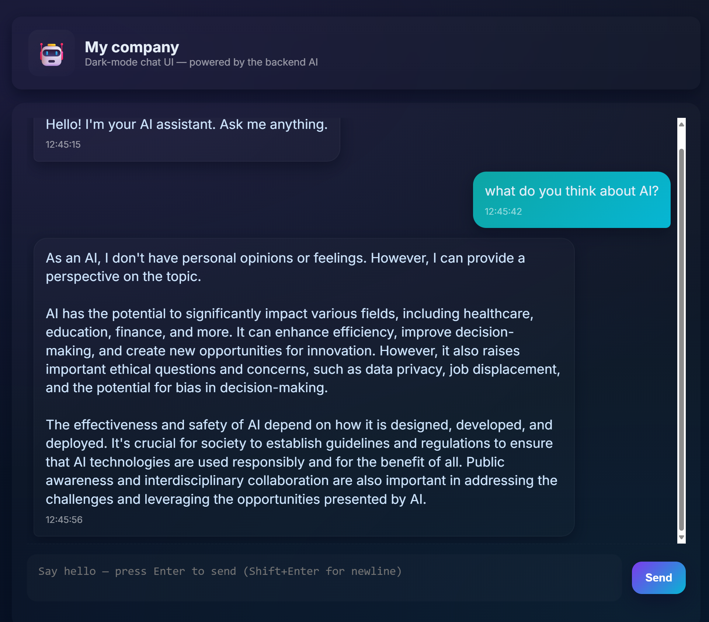
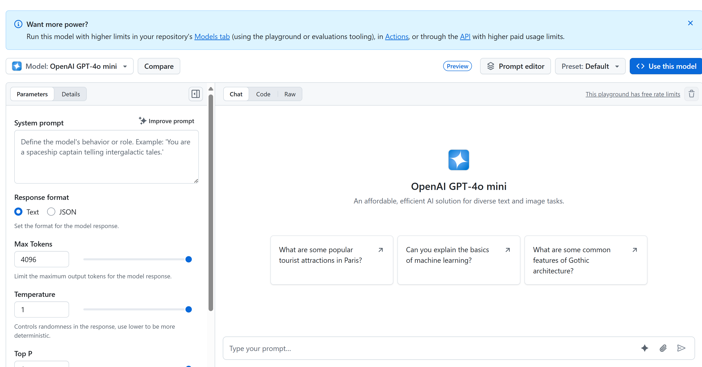

# Chat project

This chat project shows how to build a Chat Assistant using GitHub Models.

Here's what the finished project looks like:

<div>
  
</div>

Some context, building Chat assistants using generative AI is a great way to start learning about AI. What you'll learn is to integrate generative AI into a web app throughout this lesson, let's begin.

## Connecting to generative AI

For the backend, we're using GitHub Models. It's a great service that enables you to use AI for free. Go to its playground and grab code that corresponds to your chosen backend language. Here's what it looks like at [GitHub Models Playground](https://github.com/marketplace/models/azure-openai/gpt-4o-mini/playground)

<div>
  
</div>


As we said, select the "Code" tab and your chosen runtime. 

<div>
  
</div>

In this case we select Python, which will mean we pick this code:

```python
"""Run this model in Python

> pip install openai
"""
import os
from openai import OpenAI

# To authenticate with the model you will need to generate a personal access token (PAT) in your GitHub settings. 
# Create your PAT token by following instructions here: https://docs.github.com/en/authentication/keeping-your-account-and-data-secure/managing-your-personal-access-tokens
client = OpenAI(
    base_url="https://models.github.ai/inference",
    api_key=os.environ["GITHUB_TOKEN"],
)

response = client.chat.completions.create(
    messages=[
        {
            "role": "system",
            "content": "",
        },
        {
            "role": "user",
            "content": "What is the capital of France?",
        }
    ],
    model="openai/gpt-4o-mini",
    temperature=1,
    max_tokens=4096,
    top_p=1
)

print(response.choices[0].message.content)
```

Let's clean up this code a bit so it's reusable:

```python
def call_llm(prompt: str, system_message: str):
    response = client.chat.completions.create(
        messages=[
            {
                "role": "system",
                "content": system_message,
            },
            {
                "role": "user",
                "content": prompt,
            }
        ],
        model="openai/gpt-4o-mini",
        temperature=1,
        max_tokens=4096,
        top_p=1
    )

    return response.choices[0].message.content
```

With this function `call_llm` we can now take a prompt and a system prompt and the function ends up returning the result.

### Customize AI Assistant

If you want to customize the AI assistant you can specify how you want it to behave by populating the system prompt like so:

```python
call_llm("Tell me about you", "You're Albert Einstein, you only know of things in the time you were alive")
```

## Expose it via a Web API

Great, we have an AI part done, let's see how we can integrate that into a Web API. For the Web API, we're choosing to use Flask, but any web framework should be good. Let's see the code for it:

```python
# api.py
from flask import Flask, request, jsonify
from llm import call_llm
from flask_cors import CORS

app = Flask(__name__)
CORS(app)   # *   example.com

@app.route("/", methods=["GET"])
def index():
    return "Welcome to this API. Call POST /hello with 'message': 'my message' as JSON payload"


@app.route("/hello", methods=["POST"])
def hello():
    # get message from request body  { "message": "do this taks for me" }
    data = request.get_json()
    message = data.get("message", "")

    response = call_llm(message, "You are a helpful assistant.")
    return jsonify({
        "response": response
    })

if __name__ == "__main__":
    app.run(host="0.0.0.0", port=5000)
```

Here, we create a flask API and define a default route "/" and "/chat". The latter is meant to be used by our frontend to pass questions to it. 

To integrate *llm.py* here's what we need to do:

- Import the `call_llm` function:

   ```python
   from llm import call_llm
   from flask import Flask, request
   ```

- Call it from the "/chat" route:

   ```python
   @app.route("/hello", methods=["POST"])
   def hello():
      # get message from request body  { "message": "do this taks for me" }
      data = request.get_json()
      message = data.get("message", "")

      response = call_llm(message, "You are a helpful assistant.")
      return jsonify({
         "response": response
      })
   ```

   Here we parse the incoming request to retrieve the `message` property from the JSON body. Thereafter we call the LLM with this call:

   ```python
   response = call_llm(message, "You are a helpful assistant")

   # return the response as JSON
   return jsonify({
      "response": response 
   })
   ```

Great, now we have done what we need.

### Configure Cors

We should call out that we set up something like CORS, cross-origin resource sharing. This means that because our backend and frontend will ron on different ports, we need to allow the frontend to call into the backend. There's a piece of code in *api.py* that sets this up:

```python
from flask_cors import CORS

app = Flask(__name__)
CORS(app)   # *   example.com
```

Right now it's been set up to allow "*" which is all origins and that's a bit unsafe, we should restrict it once we go to production.

## Run your project

Ok, so we have *llm.py* and *api.py*, how can we make this work with a backend? Well, there's two things we need to do:

- Install dependencies:

   ```sh
   cd backend
   python -m venv venv
   source ./venv/bin/activate

   pip install openai flask flask-cors openai
   ```

- Start the API

   ```sh
   python api.py
   ```

   If you're in Codespaces you need to go to Ports in the bottom part of the editor, right-click over it and click Port Visibility" and select "Public".

### Work on a frontend

Now that we have an API up and running, let's create a frontend for this. A bare minimum frontend that we will improve stepwise. In a *frontend* folder, create the following:

```text
backend/
frontend/
index.html
app.js
styles.css
```

Let's start with **index.html**:

```html
<html>
    <head>
        <link rel="stylesheet" href="styles.css">
    </head>
    <body>
      <form>
        <textarea id="messages"></textarea>
        <input id="input" type="text" />
        <button type="submit" id="sendBtn">Send</button>  
      </form>  
      <script src="app.js" />
    </body>
</html>    
```

This above is the absolute minimum you need to support a chat window, as it consists of a textarea where messages will be rendered, an input for where to type the message and a button for sending your message to the backend. Let's look at the JavaScript next in *app.js*

**app.js**

```js
// app.js

(function(){
  // 1. set up elements  
  const messages = document.getElementById("messages");
  const form = document.getElementById("form");
  const input = document.getElementById("input");

  const BASE_URL = "change this";
  const API_ENDPOINT = `${BASE_URL}/hello`;

  // 2. create a function that talks to our backend
  async function callApi(text) {
    const response = await fetch(API_ENDPOINT, {
      method: "POST",
      headers: { "Content-Type": "application/json" },
      body: JSON.stringify({ message: text })
    });
    let json = await response.json();
    return json.response;
  }

  // 3. add response to our textarea
  function appendMessage(text, role) {
    const el = document.createElement("div");
    el.className = `message ${role}`;
    el.innerHTML = text;
    messages.appendChild(el);
  }

  // 4. listen to submit events
  form.addEventListener("submit", async(e) => {
    e.preventDefault();
   // someone clicked the button in the form
   
   // get input
   const text = input.value.trim();

   appendMessage(text, "user")

   // reset it
   input.value = '';

   const reply = await callApi(text);

   // add to messages
   appendMessage(reply, "assistant");

  })
})();
```

Let's go through the code per section:

- 1) Here we get a reference to all our elements we will refer to later in the code
- 2) In this section, we create a function that uses the built-in `fetch` method that calls our backend
- 3) `appendMessage` helps add responses as well as what you as a user type.
- 4) Here we listen to the submit event and we end up reading the input field, place the user's message in the text area, call the API, render that respond in the text area.

Let's look at styling next, here's where you can go really crazy and make it look like you want, but here's some suggestions:

**styles.css**

```
.message {
    background: #222;
    box-shadow: 0 0 0 10px orange;
    padding: 10px:
    margin: 5px;
}

.message.user {
    background: blue;
}

.message.assistant {
    background: grey;
} 
```

With these three classes, you will style messages different depending on where they come from an assistant or you as a user. If you want to be inspired, check out the `solution/frontend/styles.css` folder.

### Change Base Url

There was one thing here we didn't set and that was `BASE_URL`, this is not known until your backend is started. To set it:

- If you run API locally, it should be set to something like `http://localhost:5000`.
- If run in a Codespaces, it should look something like "[name]app.github.dev".

## Assignment

Create your own folder *project* with content like so:

```text
project/
  frontend/
    index.html
    app.js
    styles.css
  backend/
    api.py
    llm.py
```

Copy the content from what was instructed from above but feel free to customize to your liking

## Solution

[Solution](./solution/README.md)

## Bonus

Try changing the personality of the AI assistant. When you call `call_llm` in *api.py* you can change the second argument to what you want, for example:

```python
call_llm(message, "You are Captain Picard")
```

Change also the CSS and text to your liking, so do changes in *index.html* and *styles.css*.

## Summary

Great, you've learned from scratch how to create a personal assistant using AI. We've done so using GitHub Models, a backend in Python and a frontend in HTML, CSS and JavaScript

