# Introduction to Programming Languages and Modern Developer Tools
 
Hey there, future developer! 👋 Can I tell you something that still gives me chills every single day? You're about to discover that programming isn't just about computers – it's about having actual superpowers to bring your wildest ideas to life!

You know that moment when you're using your favorite app and everything just clicks perfectly? When you tap a button and something absolutely magical happens that makes you go "wow, how did they DO that?" Well, someone just like you – probably sitting in their favorite coffee shop at 2 AM with their third espresso – wrote the code that created that magic. And here's what's going to blow your mind: by the end of this lesson, you'll not only understand how they did it, but you'll be itching to try it yourself!

Look, I totally get it if programming feels intimidating right now. When I first started, I honestly thought you needed to be some kind of math genius or have been coding since you were five years old. But here's what completely changed my perspective: programming is exactly like learning to have conversations in a new language. You start with "hello" and "thank you," then work up to ordering coffee, and before you know it, you're having deep philosophical discussions! Except in this case, you're having conversations with computers, and honestly? They're the most patient conversation partners you'll ever have – they never judge your mistakes and they're always excited to try again!

Today, we're going to explore the incredible tools that make modern web development not just possible, but seriously addictive. I'm talking about the exact same editors, browsers, and workflows that developers at Netflix, Spotify, and your favorite indie app studio use every single day. And here's the part that's going to make you do a happy dance: most of these professional-grade, industry-standard tools are completely free!


> Sketchnote by [Tomomi Imura](https://twitter.com/girlie_mac)


## Let's See What You Already Know!

Before we jump into the fun stuff, I'm curious – what do you already know about this programming world? And listen, if you're looking at these questions thinking "I literally have zero clue about any of this," that's not just okay, it's perfect! That means you're in exactly the right place. Think of this quiz like stretching before a workout – we're just warming up those brain muscles!

[Take the pre-lesson quiz](https://forms.office.com/r/dru4TE0U9n?origin=lprLink)


## The Adventure We're About to Go On Together

Okay, I am genuinely bouncing with excitement about what we're going to explore today! Seriously, I wish I could see your face when some of these concepts click. Here's the incredible journey we're taking together:

- **What programming actually is (and why it's the coolest thing ever!)** – We're going to discover how code is literally the invisible magic powering everything around you, from that alarm that somehow knows it's Monday morning to the algorithm that perfectly curates your Netflix recommendations
- **Programming languages and their amazing personalities** – Imagine walking into a party where each person has completely different superpowers and ways of solving problems. That's what the programming language world is like, and you're going to love meeting them!
- **The fundamental building blocks that make digital magic happen** – Think of these as the ultimate creative LEGO set. Once you understand how these pieces fit together, you'll realize you can literally build anything your imagination dreams up
- **Professional tools that'll make you feel like you just got handed a wizard's wand** – I'm not being dramatic here – these tools will genuinely make you feel like you have superpowers, and the best part? They're the same ones the pros use!

> 💡 **Here's the thing**: Don't even think about trying to memorize everything today! Right now, I just want you to feel that spark of excitement about what's possible. The details will stick naturally as we practice together – that's how real learning happens!

> You can take this lesson on [Microsoft Learn](https://docs.microsoft.com/learn/modules/web-development-101/introduction-programming/?WT.mc_id=academic-77807-sagibbon)!

## So What Exactly *Is* Programming?

Alright, let's tackle the million-dollar question: what is programming, really?

I'll give you a story that completely changed how I think about this. Last week, I was trying to explain to my mom how to use our new smart TV remote. I caught myself saying things like "Press the red button, but not the big red button, the small red button on the left... no, your other left... okay, now hold it for two seconds, not one, not three..." Sound familiar? 😅

That's programming! It's the art of giving incredibly detailed, step-by-step instructions to something that's very powerful but needs everything spelled out perfectly. Except instead of explaining to your mom (who can ask "which red button?!"), you're explaining to a computer (which just does exactly what you say, even if what you said isn't quite what you meant).

Here's what blew my mind when I first learned this: computers are actually pretty simple at their core. They literally only understand two things – 1 and 0, which is basically just "yes" and "no" or "on" and "off." That's it! But here's where it gets magical – we don't have to speak in 1s and 0s like we're in The Matrix. That's where **programming languages** come to the rescue. They're like having the world's best translator who takes your perfectly normal human thoughts and converts them into computer language.

And here's what still gives me actual chills every morning when I wake up: literally *everything* digital in your life started with someone just like you, probably sitting in their pajamas with a cup of coffee, typing code on their laptop. That Instagram filter that makes you look flawless? Someone coded that. The recommendation that led you to your new favorite song? A developer built that algorithm. The app that helps you split dinner bills with friends? Yep, someone thought "this is annoying, I bet I could fix this" and then... they did!

When you learn to program, you're not just picking up a new skill – you're becoming part of this incredible community of problem-solvers who spend their days thinking, "What if I could build something that makes someone's day just a little bit better?" Honestly, is there anything cooler than that?

✅ **Fun Fact Hunt**: Here's something super cool to look up when you have a spare moment – who do you think was the world's first computer programmer? I'll give you a hint: it might not be who you're expecting! The story behind this person is absolutely fascinating and shows that programming has always been about creative problem-solving and thinking outside the box.

### 🧠 **Check-in Time: How Are You Feeling?**

**Take a moment to reflect:**
- Does the idea of "giving instructions to computers" make sense to you now?
- Can you think of a daily task you'd like to automate with programming?
- What questions are bubbling up in your mind about this whole programming thing?

> **Remember**: It's totally normal if some concepts feel fuzzy right now. Learning programming is like learning a new language – it takes time for your brain to build those neural pathways. You're doing great!

## Programming Languages Are Like Different Flavors of Magic

Okay, this is going to sound weird, but stick with me – programming languages are a lot like different types of music. Think about it: you've got jazz, which is smooth and improvisational, rock that's powerful and straightforward, classical that's elegant and structured, and hip-hop that's creative and expressive. Each style has its own vibe, its own community of passionate fans, and each one is perfect for different moods and occasions.

Programming languages work exactly the same way! You wouldn't use the same language to build a fun mobile game that you'd use to crunch massive amounts of climate data, just like you wouldn't play death metal at a yoga class (well, most yoga classes anyway! 😄).

But here's what absolutely blows my mind every time I think about it: these languages are like having the most patient, brilliant interpreter in the world sitting right next to you. You can express your ideas in a way that feels natural to your human brain, and they handle all the incredibly complex work of translating that into the 1s and 0s that computers actually speak. It's like having a friend who's perfectly fluent in both "human creativity" and "computer logic" – and they never get tired, never need coffee breaks, and never judge you for asking the same question twice!

### Popular Programming Languages and Their Uses


| Language | Best For | Why It's Popular |
|----------|----------|------------------|
| **JavaScript** | Web development, user interfaces | Runs in browsers and powers interactive websites |
| **Python** | Data science, automation, AI | Easy to read and learn, powerful libraries |
| **Java** | Enterprise applications, Android apps | Platform-independent, robust for large systems |
| **C#** | Windows applications, game development | Strong Microsoft ecosystem support |
| **Go** | Cloud services, backend systems | Fast, simple, designed for modern computing |

### High-Level vs. Low-Level Languages

Okay, this was honestly the concept that broke my brain when I first started learning, so I'm going to share the analogy that finally made it click for me – and I really hope it helps you too!

Imagine you're visiting a country where you don't speak the language, and you desperately need to find the nearest bathroom (we've all been there, right? 😅):

- **Low-level programming** is like learning the local dialect so well that you can chat with the grandmother selling fruit on the corner using cultural references, local slang, and inside jokes that only someone who grew up there would understand. Super impressive and incredibly efficient... if you happen to be fluent! But pretty overwhelming when you're just trying to find a bathroom.

- **High-level programming** is like having that amazing local friend who just gets you. You can say "I really need to find a restroom" in plain English, and they handle all the cultural translation and give you directions in a way that makes perfect sense to your non-local brain.

In programming terms:
- **Low-level languages** (like Assembly or C) let you have incredibly detailed conversations with the computer's actual hardware, but you need to think like a machine, which is... well, let's just say it's a pretty big mental shift!
- **High-level languages** (like JavaScript, Python, or C#) let you think like a human while they handle all the machine-speak behind the scenes. Plus, they have these incredibly welcoming communities full of people who remember what it was like to be new and genuinely want to help!

Guess which ones I'm going to suggest you start with? 😉 High-level languages are like having training wheels that you never actually want to take off because they make the whole experience so much more enjoyable!

```mermaid
flowchart TB
    A["👤 Human Thought:<br/>'I want to calculate Fibonacci numbers'"] --> B{Choose Language Level}
    
    B -->|High-Level| C["🌟 JavaScript/Python<br/>Easy to read and write"]
    B -->|Low-Level| D["⚙️ Assembly/C<br/>Direct hardware control"]
    
    C --> E["📝 Write: fibonacci(10)"]
    D --> F["📝 Write: mov r0,#00<br/>sub r0,r0,#01"]
    
    E --> G["🤖 Computer Understanding:<br/>Translator handles complexity"]
    F --> G
    
    G --> H["💻 Same Result:<br/>0, 1, 1, 2, 3, 5, 8, 13..."]
    
    style C fill:#e1f5fe
    style D fill:#fff3e0
    style H fill:#e8f5e8
```



### Let Me Show You Why High-Level Languages Are So Much Friendlier

Alright, I'm about to show you something that perfectly demonstrates why I fell in love with high-level languages, but first – I need you to promise me something. When you see that first code example, don't panic! It's supposed to look intimidating. That's exactly the point I'm making!

We're going to look at the exact same task written in two completely different styles. Both create what's called the Fibonacci sequence – it's this beautiful mathematical pattern where each number is the sum of the two before it: 0, 1, 1, 2, 3, 5, 8, 13... (Fun fact: you'll find this pattern literally everywhere in nature – sunflower seed spirals, pinecone patterns, even the way galaxies form!)

Ready to see the difference? Let's go!

**High-level language (JavaScript) – Human-friendly:**

```javascript
// Step 1: Basic Fibonacci setup
const fibonacciCount = 10;
let current = 0;
let next = 1;

console.log('Fibonacci sequence:');
```

**Here's what this code does:**
- **Declare** a constant to specify how many Fibonacci numbers we want to generate
- **Initialize** two variables to track the current and next numbers in the sequence
- **Set up** the starting values (0 and 1) that define the Fibonacci pattern
- **Display** a header message to identify our output

```javascript
// Step 2: Generate the sequence with a loop
for (let i = 0; i < fibonacciCount; i++) {
  console.log(`Position ${i + 1}: ${current}`);
  
  // Calculate next number in sequence
  const sum = current + next;
  current = next;
  next = sum;
}
```

**Breaking down what happens here:**
- **Loop** through each position in our sequence using a `for` loop
- **Display** each number with its position using template literal formatting
- **Calculate** the next Fibonacci number by adding current and next values
- **Update** our tracking variables to move to the next iteration

```javascript
// Step 3: Modern functional approach
const generateFibonacci = (count) => {
  const sequence = [0, 1];
  
  for (let i = 2; i < count; i++) {
    sequence[i] = sequence[i - 1] + sequence[i - 2];
  }
  
  return sequence;
};

// Usage example
const fibSequence = generateFibonacci(10);
console.log(fibSequence);
```

**In the above, we've:**
- **Created** a reusable function using modern arrow function syntax
- **Built** an array to store the complete sequence rather than displaying one by one
- **Used** array indexing to calculate each new number from previous values
- **Returned** the complete sequence for flexible use in other parts of our program

**Low-level language (ARM Assembly) – Computer-friendly:**

```assembly
 area ascen,code,readonly
 entry
 code32
 adr r0,thumb+1
 bx r0
 code16
thumb
 mov r0,#00
 sub r0,r0,#01
 mov r1,#01
 mov r4,#10
 ldr r2,=0x40000000
back add r0,r1
 str r0,[r2]
 add r2,#04
 mov r3,r0
 mov r0,r1
 mov r1,r3
 sub r4,#01
 cmp r4,#00
 bne back
 end
```

Notice how the JavaScript version reads almost like English instructions, while the Assembly version uses cryptic commands that directly control the computer's processor. Both accomplish the exact same task, but the high-level language is much easier for humans to understand, write, and maintain.

**Key differences you'll notice:**
- **Readability**: JavaScript uses descriptive names like `fibonacciCount` while Assembly uses cryptic labels like `r0`, `r1`
- **Comments**: High-level languages encourage explanatory comments that make code self-documenting
- **Structure**: JavaScript's logical flow matches how humans think about problems step-by-step
- **Maintenance**: Updating the JavaScript version for different requirements is straightforward and clear

✅ **About the Fibonacci sequence**: This absolutely gorgeous number pattern (where each number equals the sum of the two before it: 0, 1, 1, 2, 3, 5, 8...) shows up literally *everywhere* in nature! You'll find it in sunflower spirals, pinecone patterns, the way nautilus shells curve, and even in how tree branches grow. It's pretty mind-blowing how math and code can help us understand and recreate the patterns that nature uses to create beauty!


## The Building Blocks That Make the Magic Happen

Alright, now that you've seen what programming languages look like in action, let's break down the fundamental pieces that make up literally every program ever written. Think of these as the essential ingredients in your favorite recipe – once you understand what each one does, you'll be able to read and write code in pretty much any language!

This is kind of like learning the grammar of programming. Remember back in school when you learned about nouns, verbs, and how to put sentences together? Programming has its own version of grammar, and honestly, it's way more logical and forgiving than English grammar ever was! 😄

### Statements: The Step-by-Step Instructions

Let's start with **statements** – these are like individual sentences in a conversation with your computer. Each statement tells the computer to do one specific thing, kind of like giving directions: "Turn left here," "Stop at the red light," "Park in that spot."

What I love about statements is how readable they usually are. Check this out:

```javascript
// Basic statements that perform single actions
const userName = "Alex";                    
console.log("Hello, world!");              
const sum = 5 + 3;                         
```

**Here's what this code does:**
- **Declare** a constant variable to store a user's name
- **Display** a greeting message to the console output
- **Calculate** and store the result of a mathematical operation

```javascript
// Statements that interact with web pages
document.title = "My Awesome Website";      
document.body.style.backgroundColor = "lightblue";
```

**Step by step, here's what's happening:**
- **Modify** the webpage's title that appears in the browser tab
- **Change** the background color of the entire page body

### Variables: Your Program's Memory System

Okay, **variables** are honestly one of my absolute favorite concepts to teach because they're so much like things you already use every single day!

Think about your phone's contact list for a second. You don't memorize everyone's phone number – instead, you save "Mom," "Best Friend," or "Pizza Place That Delivers Until 2 AM" and let your phone remember the actual numbers. Variables work exactly the same way! They're like labeled containers where your program can store information and retrieve it later using a name that actually makes sense.

Here's what's really cool: variables can change as your program runs (hence the name "variable" – see what they did there?). Just like you might update that pizza place contact when you discover somewhere even better, variables can be updated as your program learns new information or as situations change!

Let me show you how beautifully simple this can be:

```javascript
// Step 1: Creating basic variables
const siteName = "Weather Dashboard";        
let currentWeather = "sunny";               
let temperature = 75;                       
let isRaining = false;                      
```

**Understanding these concepts:**
- **Store** unchanging values in `const` variables (like site name)
- **Use** `let` for values that can change throughout your program
- **Assign** different data types: strings (text), numbers, and booleans (true/false)
- **Choose** descriptive names that explain what each variable contains

```javascript
// Step 2: Working with objects to group related data
const weatherData = {                       
  location: "San Francisco",
  humidity: 65,
  windSpeed: 12
};
```

**In the above, we've:**
- **Created** an object to group related weather information together
- **Organized** multiple pieces of data under one variable name
- **Used** key-value pairs to label each piece of information clearly

```javascript
// Step 3: Using and updating variables
console.log(`${siteName}: Today is ${currentWeather} and ${temperature}°F`);
console.log(`Wind speed: ${weatherData.windSpeed} mph`);

// Updating changeable variables
currentWeather = "cloudy";                  
temperature = 68;                          
```

**Let's understand each part:**
- **Display** information using template literals with `${}` syntax
- **Access** object properties using dot notation (`weatherData.windSpeed`)
- **Update** variables declared with `let` to reflect changing conditions
- **Combine** multiple variables to create meaningful messages

```javascript
// Step 4: Modern destructuring for cleaner code
const { location, humidity } = weatherData; 
console.log(`${location} humidity: ${humidity}%`);
```

**What you need to know:**
- **Extract** specific properties from objects using destructuring assignment
- **Create** new variables automatically with the same names as object keys
- **Simplify** code by avoiding repetitive dot notation

### Control Flow: Teaching Your Program to Think

Okay, this is where programming gets absolutely mind-blowing! **Control flow** is basically teaching your program how to make smart decisions, exactly like you do every single day without even thinking about it.

Picture this: this morning you probably went through something like "If it's raining, I'll grab an umbrella. If it's cold, I'll wear a jacket. If I'm running late, I'll skip breakfast and grab coffee on the way." Your brain naturally follows this if-then logic dozens of times every day!

This is what makes programs feel intelligent and alive instead of just following some boring, predictable script. They can actually look at a situation, evaluate what's happening, and respond appropriately. It's like giving your program a brain that can adapt and make choices!

Want to see how beautifully this works? Let me show you:

```javascript
// Step 1: Basic conditional logic
const userAge = 17;

if (userAge >= 18) {
  console.log("You can vote!");
} else {
  const yearsToWait = 18 - userAge;
  console.log(`You'll be able to vote in ${yearsToWait} year(s).`);
}
```

**Here's what this code does:**
- **Check** if the user's age meets the voting requirement
- **Execute** different code blocks based on the condition result
- **Calculate** and display how long until voting eligibility if under 18
- **Provide** specific, helpful feedback for each scenario

```javascript
// Step 2: Multiple conditions with logical operators
const userAge = 17;
const hasPermission = true;

if (userAge >= 18 && hasPermission) {
  console.log("Access granted: You can enter the venue.");
} else if (userAge >= 16) {
  console.log("You need parent permission to enter.");
} else {
  console.log("Sorry, you must be at least 16 years old.");
}
```

**Breaking down what happens here:**
- **Combine** multiple conditions using the `&&` (and) operator
- **Create** a hierarchy of conditions using `else if` for multiple scenarios
- **Handle** all possible cases with a final `else` statement
- **Provide** clear, actionable feedback for each different situation

```javascript
// Step 3: Concise conditional with ternary operator
const votingStatus = userAge >= 18 ? "Can vote" : "Cannot vote yet";
console.log(`Status: ${votingStatus}`);
```

**What you need to remember:**
- **Use** the ternary operator (`? :`) for simple two-option conditions
- **Write** condition first, followed by `?`, then true result, then `:`, then false result
- **Apply** this pattern when you need to assign values based on conditions

```javascript
// Step 4: Handling multiple specific cases
const dayOfWeek = "Tuesday";

switch (dayOfWeek) {
  case "Monday":
  case "Tuesday":
  case "Wednesday":
  case "Thursday":
  case "Friday":
    console.log("It's a weekday - time to work!");
    break;
  case "Saturday":
  case "Sunday":
    console.log("It's the weekend - time to relax!");
    break;
  default:
    console.log("Invalid day of the week");
}
```

**This code accomplishes the following:**
- **Match** the variable value against multiple specific cases
- **Group** similar cases together (weekdays vs. weekends)
- **Execute** the appropriate code block when a match is found
- **Include** a `default` case to handle unexpected values
- **Use** `break` statements to prevent code from continuing to the next case

> 💡 **Real-world analogy**: Think of control flow like having the world's most patient GPS giving you directions. It might say "If there's traffic on Main Street, take the highway instead. If construction is blocking the highway, try the scenic route." Programs use exactly the same type of conditional logic to respond intelligently to different situations and always give users the best possible experience.

### 🎯 **Concept Check: Building Blocks Mastery**

**Let's see how you're doing with the fundamentals:**
- Can you explain the difference between a variable and a statement in your own words?
- Think of a real-world scenario where you'd use an if-then decision (like our voting example)
- What's one thing about programming logic that surprised you?

**Quick confidence booster:**

```mermaid
flowchart LR
    A["📝 Statements<br/>(Instructions)"] --> B["📦 Variables<br/>(Storage)"] --> C["🔀 Control Flow<br/>(Decisions)"] --> D["🎉 Working Program!"]
    
    style A fill:#ffeb3b
    style B fill:#4caf50
    style C fill:#2196f3
    style D fill:#ff4081
```


✅ **What's coming up next**: We're going to have an absolute blast diving deeper into these concepts as we continue this incredible journey together! Right now, just focus on feeling that excitement about all the amazing possibilities ahead of you. The specific skills and techniques will stick naturally as we practice together – I promise this is going to be so much more fun than you might expect!

## Tools of the Trade

Alright, this is honestly where I get so excited I can barely contain myself! 🚀 We're about to talk about the incredible tools that are going to make you feel like you just got handed the keys to a digital spaceship.

You know how a chef has those perfectly balanced knives that feel like extensions of their hands? Or how a musician has that one guitar that seems to sing the moment they touch it? Well, developers have our own version of these magical tools, and here's what's going to absolutely blow your mind – most of them are completely free!

I'm practically bouncing in my chair thinking about sharing these with you because they've completely revolutionized how we build software. We're talking about AI-powered coding assistants that can help write your code (I'm not even kidding!), cloud environments where you can build entire applications from literally anywhere with Wi-Fi, and debugging tools so sophisticated they're like having X-ray vision for your programs.

And here's the part that still gives me chills: these aren't "beginner tools" that you'll outgrow. These are the exact same professional-grade tools that developers at Google, Netflix, and that indie app studio you love are using right this very moment. You're going to feel like such a pro using them!

```mermaid
graph TD
    A["💡 Your Idea"] --> B["⌨️ Code Editor<br/>(VS Code)"] 
    B --> C["🌐 Browser DevTools<br/>(Testing & Debugging)"]
    C --> D["⚡ Command Line<br/>(Automation & Tools)"]
    D --> E["📚 Documentation<br/>(Learning & Reference)"]
    E --> F["🚀 Amazing Web App!"]
    
    B -.-> G["🤖 AI Assistant<br/>(GitHub Copilot)"]
    C -.-> H["📱 Device Testing<br/>(Responsive Design)"]
    D -.-> I["📦 Package Managers<br/>(npm, yarn)"]
    E -.-> J["👥 Community<br/>(Stack Overflow)"]
    
    style A fill:#fff59d
    style F fill:#c8e6c9
    style G fill:#e1f5fe
    style H fill:#f3e5f5
    style I fill:#ffccbc
    style J fill:#e8eaf6
```



### Code Editors and IDEs: Your New Digital Best Friends

Let's talk about code editors – these are seriously about to become your new favorite places to hang out! Think of them as your personal coding sanctuary where you'll spend most of your time crafting and perfecting your digital creations.

But here's what's absolutely magical about modern editors: they're not just fancy text editors. They're like having the most brilliant, supportive coding mentor sitting right next to you 24/7. They catch your typos before you even notice them, suggest improvements that make you look like a genius, help you understand what every piece of code does, and some of them can even predict what you're about to type and offer to finish your thoughts!

I remember when I first discovered auto-completion – I literally felt like I was living in the future. You start typing something, and your editor goes, "Hey, were you thinking of this function that does exactly what you need?" It's like having a mind reader as your coding buddy!

**What makes these editors so incredible?**

Modern code editors offer an impressive array of features designed to boost your productivity:

| Feature | What It Does | Why It Helps |
|---------|--------------|--------------|
| **Syntax Highlighting** | Colors different parts of your code | Makes code easier to read and spot errors |
| **Auto-completion** | Suggests code as you type | Speeds up coding and reduces typos |
| **Debugging Tools** | Helps you find and fix errors | Saves hours of troubleshooting time |
| **Extensions** | Add specialized features | Customize your editor for any technology |
| **AI Assistants** | Suggest code and explanations | Accelerates learning and productivity |

> 🎥 **Video Resource**: Want to see these tools in action? Check out this [Tools of the Trade video](https://youtube.com/watch?v=69WJeXGBdxg) for a comprehensive overview.

#### Recommended Editors for Web Development

**[Visual Studio Code](https://code.visualstudio.com/?WT.mc_id=academic-77807-sagibbon)** (Free)
- Most popular among web developers
- Excellent extension ecosystem
- Built-in terminal and Git integration
- **Must-have extensions**:
  - [GitHub Copilot](https://marketplace.visualstudio.com/items?itemName=GitHub.copilot) - AI-powered code suggestions
  - [Live Share](https://marketplace.visualstudio.com/items?itemName=MS-vsliveshare.vsliveshare) - Real-time collaboration
  - [Prettier](https://marketplace.visualstudio.com/items?itemName=esbenp.prettier-vscode) - Automatic code formatting
  - [Code Spell Checker](https://marketplace.visualstudio.com/items?itemName=streetsidesoftware.code-spell-checker) - Catch typos in your code

**[JetBrains WebStorm](https://www.jetbrains.com/webstorm/)** (Paid, free for students)
- Advanced debugging and testing tools
- Intelligent code completion
- Built-in version control

**Cloud-Based IDEs** (Various pricing)
- [GitHub Codespaces](https://github.com/features/codespaces) - Full VS Code in your browser
- [Replit](https://replit.com/) - Great for learning and sharing code
- [StackBlitz](https://stackblitz.com/) - Instant, full-stack web development

> 💡 **Getting Started Tip**: Start with Visual Studio Code – it's free, widely used in the industry, and has an enormous community creating helpful tutorials and extensions.


### Web Browsers: Your Secret Development Laboratory

Okay, prepare to have your mind completely blown! You know how you've been using browsers to scroll through social media and watch videos? Well, it turns out they've been hiding this incredible secret developer laboratory this entire time, just waiting for you to discover it!

Every single time you right-click on a webpage and select "Inspect Element," you're opening up a hidden world of developer tools that are honestly more powerful than some expensive software I used to pay hundreds of dollars for. It's like discovering that your regular old kitchen has been concealing a professional chef's laboratory behind a secret panel!

The first time someone showed me browser DevTools, I spent like three hours just clicking around and going "WAIT, IT CAN DO THAT TOO?!" You can literally edit any website in real-time, see exactly how fast everything loads, test how your site looks on different devices, and even debug JavaScript like a total pro. It's absolutely mind-blowing!

**Here's why browsers are your secret weapon:**

When you create a website or web application, you need to see how it looks and behaves in the real world. Browsers not only display your work but also provide detailed feedback about performance, accessibility, and potential issues.

#### Browser Developer Tools (DevTools)

Modern browsers include comprehensive development suites:

| Tool Category | What It Does | Example Use Case |
|---------------|--------------|------------------|
| **Element Inspector** | View and edit HTML/CSS in real-time | Adjust styling to see immediate results |
| **Console** | View error messages and test JavaScript | Debug problems and experiment with code |
| **Network Monitor** | Track how resources load | Optimize performance and loading times |
| **Accessibility Checker** | Test for inclusive design | Ensure your site works for all users |
| **Device Simulator** | Preview on different screen sizes | Test responsive design without multiple devices |

#### Recommended Browsers for Development

- **[Chrome](https://developers.google.com/web/tools/chrome-devtools/)** - Industry-standard DevTools with extensive documentation
- **[Firefox](https://developer.mozilla.org/docs/Tools)** - Excellent CSS Grid and accessibility tools
- **[Edge](https://docs.microsoft.com/microsoft-edge/devtools-guide-chromium/?WT.mc_id=academic-77807-sagibbon)** - Built on Chromium with Microsoft's developer resources

> ⚠️ **Important Testing Tip**: Always test your websites in multiple browsers! What works perfectly in Chrome might look different in Safari or Firefox. Professional developers test across all major browsers to ensure consistent user experiences.


### Command Line Tools: Your Gateway to Developer Superpowers

Alright, let's have a completely honest moment here about the command line, because I want you to hear this from someone who truly gets it. When I first saw it – just this scary black screen with blinking text – I literally thought, "Nope, absolutely not! This looks like something from a 1980s hacker movie, and I am definitely not smart enough for this!" 😅

But here's what I wish someone had told me back then, and what I'm telling you right now: the command line isn't scary – it's actually like having a direct conversation with your computer. Think of it like the difference between ordering food through a fancy app with pictures and menus (which is nice and easy) versus walking into your favorite local restaurant where the chef knows exactly what you like and can whip up something perfect just by you saying "surprise me with something amazing."

The command line is where developers go to feel like absolute wizards. You type a few seemingly magical words (okay, they're just commands, but they feel magical!), hit enter, and BOOM – you've created entire project structures, installed powerful tools from around the world, or deployed your app to the internet for millions of people to see. Once you get your first taste of that power, it's honestly pretty addictive!

**Why the command line will become your favorite tool:**

While graphical interfaces are great for many tasks, the command line excels at automation, precision, and speed. Many development tools work primarily through command line interfaces, and learning to use them efficiently can dramatically improve your productivity.

```bash
# Step 1: Create and navigate to project directory
mkdir my-awesome-website
cd my-awesome-website
```

**Here's what this code does:**
- **Create** a new directory called "my-awesome-website" for your project
- **Navigate** into the newly created directory to begin working

```bash
# Step 2: Initialize project with package.json
npm init -y

# Install modern development tools
npm install --save-dev vite prettier eslint
npm install --save-dev @eslint/js
```

**Step by step, here's what's happening:**
- **Initialize** a new Node.js project with default settings using `npm init -y`
- **Install** Vite as a modern build tool for fast development and production builds
- **Add** Prettier for automatic code formatting and ESLint for code quality checks
- **Use** the `--save-dev` flag to mark these as development-only dependencies

```bash
# Step 3: Create project structure and files
mkdir src assets
echo '<!DOCTYPE html><html><head><title>My Site</title></head><body><h1>Hello World</h1></body></html>' > index.html

# Start development server
npx vite
```

**In the above, we've:**
- **Organized** our project by creating separate folders for source code and assets
- **Generated** a basic HTML file with proper document structure
- **Started** the Vite development server for live reloading and hot module replacement

#### Essential Command Line Tools for Web Development

| Tool | Purpose | Why You Need It |
|------|---------|-----------------|
| **[Git](https://git-scm.com/)** | Version control | Track changes, collaborate with others, backup your work |
| **[Node.js & npm](https://nodejs.org/)** | JavaScript runtime & package management | Run JavaScript outside browsers, install modern development tools |
| **[Vite](https://vitejs.dev/)** | Build tool & dev server | Lightning-fast development with hot module replacement |
| **[ESLint](https://eslint.org/)** | Code quality | Automatically find and fix problems in your JavaScript |
| **[Prettier](https://prettier.io/)** | Code formatting | Keep your code consistently formatted and readable |

#### Platform-Specific Options

**Windows:**
- **[Windows Terminal](https://docs.microsoft.com/windows/terminal/?WT.mc_id=academic-77807-sagibbon)** - Modern, feature-rich terminal
- **[PowerShell](https://docs.microsoft.com/powershell/?WT.mc_id=academic-77807-sagibbon)** 💻 - Powerful scripting environment
- **[Command Prompt](https://docs.microsoft.com/windows-server/administration/windows-commands/?WT.mc_id=academic-77807-sagibbon)** 💻 - Traditional Windows command line

**macOS:**
- **[Terminal](https://support.apple.com/guide/terminal/)** 💻 - Built-in terminal application
- **[iTerm2](https://iterm2.com/)** - Enhanced terminal with advanced features

**Linux:**
- **[Bash](https://www.gnu.org/software/bash/)** 💻 - Standard Linux shell
- **[KDE Konsole](https://docs.kde.org/trunk5/en/konsole/konsole/index.html)** - Advanced terminal emulator

> 💻 = Pre-installed on the operating system

> 🎯 **Learning Path**: Start with basic commands like `cd` (change directory), `ls` or `dir` (list files), and `mkdir` (create folder). Practice with modern workflow commands like `npm install`, `git status`, and `code .` (opens current directory in VS Code). As you become more comfortable, you'll naturally pick up more advanced commands and automation techniques.


### Documentation: Your Always-Available Learning Mentor

Okay, let me share a little secret that's going to make you feel so much better about being a beginner: even the most experienced developers spend a huge chunk of their time reading documentation. And that's not because they don't know what they're doing – it's actually a sign of wisdom!

Think of documentation as having access to the world's most patient, knowledgeable teachers who are available 24/7. Stuck on a problem at 2 AM? Documentation is there with a warm virtual hug and exactly the answer you need. Want to learn about some cool new feature that everyone's talking about? Documentation has your back with step-by-step examples. Trying to understand why something works the way it does? You guessed it – documentation is ready to explain it in a way that finally makes it click!

Here's something that completely changed my perspective: the web development world moves incredibly fast, and nobody (I mean absolutely nobody!) keeps everything memorized. I've watched senior developers with 15+ years of experience look up basic syntax, and you know what? That's not embarrassing – that's smart! It's not about having a perfect memory; it's about knowing where to find reliable answers quickly and understanding how to apply them.

**Here's where the real magic happens:**

Professional developers spend a significant portion of their time reading documentation – not because they don't know what they're doing, but because the web development landscape evolves so rapidly that staying current requires continuous learning. Great documentation helps you understand not just *how* to use something, but *why* and *when* to use it.

#### Essential Documentation Resources

**[Mozilla Developer Network (MDN)](https://developer.mozilla.org/docs/Web)**
- The gold standard for web technology documentation
- Comprehensive guides for HTML, CSS, and JavaScript
- Includes browser compatibility information
- Features practical examples and interactive demos

**[Web.dev](https://web.dev)** (by Google)
- Modern web development best practices
- Performance optimization guides
- Accessibility and inclusive design principles
- Case studies from real-world projects

**[Microsoft Developer Documentation](https://docs.microsoft.com/microsoft-edge/#microsoft-edge-for-developers)**
- Edge browser development resources
- Progressive Web App guides
- Cross-platform development insights

**[Frontend Masters Learning Paths](https://frontendmasters.com/learn/)**
- Structured learning curricula
- Video courses from industry experts
- Hands-on coding exercises

> 📚 **Study Strategy**: Don't try to memorize documentation – instead, learn how to navigate it efficiently. Bookmark frequently-used references and practice using the search functions to find specific information quickly.

### 🔧 **Tool Mastery Check: What Resonates With You?**

**Take a moment to consider:**
- Which tool are you most excited to try first? (There's no wrong answer!)
- Does the command line still feel intimidating, or are you curious about it?
- Can you imagine using browser DevTools to peek behind the curtain of your favorite websites?


> **Fun insight**: Most developers spend about 40% of their time in their code editor, but notice how much time goes to testing, learning, and problem-solving. Programming isn't just about writing code – it's about crafting experiences!

✅ **Food for thought**: Here's something interesting to ponder – how do you think the tools for building websites (development) might be different from tools for designing how they look (design)? It's like the difference between being an architect who designs a beautiful house and the contractor who actually builds it. Both are crucial, but they need different toolboxes! This kind of thinking will really help you see the bigger picture of how websites come to life.

## GitHub Copilot Agent Challenge 🚀

Use the Agent mode to complete the following challenge:

**Description:** Explore the features of a modern code editor or IDE and demonstrate how it can improve your workflow as a web developer.

**Prompt:** Choose a code editor or IDE (such as Visual Studio Code, WebStorm, or a cloud-based IDE). List three features or extensions that help you write, debug, or maintain code more efficiently. For each, provide a brief explanation of how it benefits your workflow.

---

## 🚀 Challenge

**Alright, detective, ready for your first case?**

Now that you've got this awesome foundation, I've got an adventure that's going to help you see just how incredibly diverse and fascinating the programming world really is. And listen – this isn't about writing code yet, so no pressure there! Think of yourself as a programming language detective on your very first exciting case!

**Your mission, should you choose to accept it:**
1. **Become a language explorer**: Pick three programming languages from completely different universes – maybe one that builds websites, one that creates mobile apps, and one that crunches data for scientists. Find examples of the same simple task written in each language. I promise you're going to be absolutely amazed at how different they can look while doing the exact same thing!

2. **Uncover their origin stories**: What makes each language special? Here's a cool fact – every single programming language was created because someone thought, "You know what? There's got to be a better way to solve this specific problem." Can you figure out what those problems were? Some of these stories are genuinely fascinating!

3. **Meet the communities**: Check out how welcoming and passionate each language's community is. Some have millions of developers sharing knowledge and helping each other, others are smaller but incredibly tight-knit and supportive. You're going to love seeing the different personalities these communities have!

4. **Follow your gut feeling**: Which language feels most approachable to you right now? Don't stress about making the "perfect" choice – just listen to your instincts! There's honestly no wrong answer here, and you can always explore others later.

**Bonus detective work**: See if you can discover what major websites or apps are built with each language. I guarantee you'll be shocked to learn what powers Instagram, Netflix, or that mobile game you can't stop playing!

> 💡 **Remember**: You're not trying to become an expert in any of these languages today. You're just getting to know the neighborhood before you decide where you want to set up shop. Take your time, have fun with it, and let your curiosity guide you!

## Let's Celebrate What You've Discovered!

Holy moly, you've absorbed so much incredible information today! I'm genuinely excited to see how much of this amazing journey has stuck with you. And remember – this isn't a test where you need to get everything perfect. This is more like a celebration of all the cool stuff you've learned about this fascinating world you're about to dive into!

[Take the post-lesson quiz](https://ff-quizzes.netlify.app/web/)

## Review & Self Study

**Take your time to explore and have fun with it!**

You've covered a lot of ground today, and that's something to be proud of! Now comes the fun part – exploring the topics that sparked your curiosity. Remember, this isn't homework – it's an adventure!

**Dive deeper into what excites you:**

**Get hands-on with programming languages:**
- Visit the official websites of 2-3 languages that caught your attention. Each one has its own personality and story!
- Try some online coding playgrounds like [CodePen](https://codepen.io/), [JSFiddle](https://jsfiddle.net/), or [Replit](https://replit.com/). Don't be afraid to experiment – you can't break anything!
- Read about how your favorite language came to be. Seriously, some of these origin stories are fascinating and will help you understand why languages work the way they do.

**Get comfortable with your new tools:**
- Download Visual Studio Code if you haven't already – it's free and you're going to love it!
- Spend a few minutes browsing the Extensions marketplace. It's like an app store for your code editor!
- Open up your browser's Developer Tools and just click around. Don't worry about understanding everything – just get familiar with what's there.

**Join the community:**
- Follow some developer communities on [Dev.to](https://dev.to/), [Stack Overflow](https://stackoverflow.com/), or [GitHub](https://github.com/). The programming community is incredibly welcoming to newcomers!
- Watch some beginner-friendly coding videos on YouTube. There are so many great creators out there who remember what it's like to be starting out.
- Consider joining local meetups or online communities. Trust me, developers love helping newcomers!

> 🎯 **Listen, here's what I want you to remember**: You're not expected to become a coding wizard overnight! Right now, you're just getting to know this amazing new world you're about to be part of. Take your time, enjoy the journey, and remember – every single developer you admire was once sitting exactly where you are right now, feeling excited and maybe a little overwhelmed. That's totally normal, and it means you're doing it right!


## Assignment

[Reading the Docs](assignment.md)

> 💡 **A little nudge for your assignment**: I'd absolutely love to see you explore some tools we haven't covered yet! Skip the editors, browsers, and command line tools we've already talked about – there's this whole incredible universe of amazing development tools out there just waiting to be discovered. Look for ones that are actively maintained and have vibrant, helpful communities (these tend to have the best tutorials and the most supportive people when you inevitably get stuck and need a friendly hand).

---

## 🚀 Your Programming Journey Timeline

### 🕐 **What You Can Do in the Next 5 Minutes**
- [ ] Bookmark 2-3 programming language websites that caught your attention
- [ ] Download Visual Studio Code if you haven't already
- [ ] Open your browser's DevTools (F12) and click around any website
- [ ] Join one programming community (Dev.to, Reddit r/webdev, or Stack Overflow)

### ⏰ **What You Can Accomplish This Hour**
- [ ] Complete the post-lesson quiz and reflect on your answers
- [ ] Set up VS Code with the GitHub Copilot extension
- [ ] Try a "Hello World" example in 2 different programming languages online
- [ ] Watch a "Day in the Life of a Developer" video on YouTube
- [ ] Start your programming language detective work (from the challenge)

### 📅 **Your Week-Long Adventure**
- [ ] Complete the assignment and explore 3 new development tools
- [ ] Follow 5 developers or programming accounts on social media
- [ ] Try building something tiny in CodePen or Replit (even just "Hello, [Your Name]!")
- [ ] Read one developer blog post about someone's coding journey
- [ ] Join a virtual meetup or watch a programming talk
- [ ] Start learning your chosen language with online tutorials

### 🗓️ **Your Month-Long Transformation**
- [ ] Build your first small project (even a simple webpage counts!)
- [ ] Contribute to an open-source project (start with documentation fixes)
- [ ] Mentor someone who's just starting their programming journey
- [ ] Create your developer portfolio website
- [ ] Connect with local developer communities or study groups
- [ ] Start planning your next learning milestone

### 🎯 **Final Reflection Check-in**

**Before you move on, take a moment to celebrate:**
- What's one thing about programming that excited you today?
- Which tool or concept do you want to explore first?
- How do you feel about starting this programming journey?
- What's one question you'd like to ask a developer right now?


> 🌟 **Remember**: Every expert was once a beginner. Every senior developer once felt exactly like you do right now – excited, maybe a little overwhelmed, and definitely curious about what's possible. You're in amazing company, and this journey is going to be incredible. Welcome to the wonderful world of programming! 🎉
