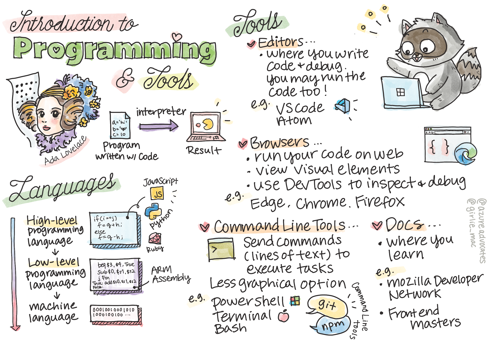

# प्रोग्रामिङ भाषाहरू र व्यापारका उपकरणहरूको परिचय

यो पाठले प्रोग्रामिङ भाषाहरूको आधारभूत कुराहरू समेट्छ। यहाँ समेटिएका विषयहरू आजका अधिकांश आधुनिक प्रोग्रामिङ भाषाहरूमा लागू हुन्छन्। 'व्यापारका उपकरणहरू' खण्डमा, तपाईंले विकासकर्ताको रूपमा मद्दत गर्ने उपयोगी सफ्टवेयरको बारेमा सिक्नुहुनेछ।


> [Tomomi Imura](https://twitter.com/girlie_mac) द्वारा स्केचनोट

## प्रि-लेक्चर क्विज
[प्री-लेक्चर क्विज](https://happy-mud-02d95f10f.azurestaticapps.net/quiz/1)

## परिचय

यस पाठमा, हामी कभर गर्नेछौं:

- प्रोग्रामिङ भनेको के हो?
- प्रोग्रामिङ भाषाहरूको प्रकार
- कार्यक्रमको आधारभूत तत्वहरू
- व्यावसायिक विकासकर्ताको लागि उपयोगी सफ्टवेयर र उपकरण

> तपाईंले [Microsoft Learn](https://docs.microsoft.com/learn/modules/web-development-101/introduction-programming?WT.mc_id=academic-13441-cxa) मा यो पाठ लिन सक्नुहुन्छ!

## प्रोग्रामिङ भनेको के हो?

प्रोग्रामिङ (कोडिङ पनि भनिन्छ) कम्प्युटर वा मोबाइल उपकरण जस्ता उपकरणका लागि निर्देशनहरू लेख्ने प्रक्रिया हो। हामी यी निर्देशनहरू प्रोग्रामिङ भाषाको साथ लेख्छौं, जुन त्यसपछि उपकरणद्वारा व्याख्या गरिन्छ। निर्देशनहरूको यी सेटहरू विभिन्न नामहरूद्वारा उल्लेख गर्न सकिन्छ, तर *कार्यक्रम*, *कम्प्युटर प्रोग्राम*, *एप्लिकेशन (एप)*, र *कार्यान्वयनयोग्य* केही लोकप्रिय नामहरू हुन्।

एक *कार्यक्रम* कोड संग लेखिएको कुनै पनि हुन सक्छ; वेबसाइटहरू, खेलहरू, र फोन एपहरू कार्यक्रमहरू हुन्। कोड नलिइकन एउटा कार्यक्रम सिर्जना गर्न सम्भव भए पनि, अन्तर्निहित तर्कलाई यन्त्रद्वारा व्याख्या गरिन्छ र त्यो तर्क सम्भवतः कोडसँग लेखिएको थियो। एउटा प्रोग्राम जुन * चलिरहेको * वा * कार्यान्वयन * कोड निर्देशनहरू पूरा गर्दैछ। तपाईंले यो पाठ पढिरहनुभएको यन्त्रले यसलाई तपाईंको स्क्रिनमा प्रिन्ट गर्नको लागि एउटा कार्यक्रम चलाउँदैछ।

✅ थोरै अनुसन्धान गर्नुहोस्: संसारको पहिलो कम्प्युटर प्रोग्रामर कसलाई मानिन्छ?

## प्रोग्रामिङ भाषाहरू

प्रोग्रामिङ भाषाहरूले विकासकर्ताहरूलाई उपकरणको लागि निर्देशनहरू लेख्न सक्षम बनाउँछन्। यन्त्रहरूले बाइनरी (1s र 0s) मात्र बुझ्न सक्छन्, र *धेरै* विकासकर्ताहरूका लागि यो सञ्चार गर्ने एकदमै प्रभावकारी तरिका होइन। प्रोग्रामिङ भाषाहरू मानिसहरू र कम्प्युटरहरू बीच सञ्चारको माध्यम हो।

प्रोग्रामिङ भाषाहरू विभिन्न ढाँचाहरूमा आउँछन् र विभिन्न उद्देश्यहरू पूरा गर्न सक्छन्। उदाहरणका लागि, जाभास्क्रिप्ट मुख्यतया वेब अनुप्रयोगहरूको लागि प्रयोग गरिन्छ, जबकि Bash मुख्य रूपमा अपरेटिङ सिस्टमहरूको लागि प्रयोग गरिन्छ।

*निम्न स्तरका भाषाहरू* लाई निर्देशनहरू व्याख्या गर्न यन्त्रको लागि *उच्च स्तरका भाषाहरू* भन्दा कम चरणहरू चाहिन्छ। यद्यपि, उच्च स्तरका भाषाहरूलाई लोकप्रिय बनाउने कुरा भनेको तिनीहरूको पठनीयता र समर्थन हो। जाभास्क्रिप्टलाई उच्च स्तरको भाषा मानिन्छ।

निम्न कोडले जाभास्क्रिप्टको साथ उच्च स्तरको भाषा र ARM असेंबली कोडको साथ निम्न स्तरको भाषा बीचको भिन्नतालाई चित्रण गर्दछ।

```javascript
let number = 10
let n1 = 0, n2 = 1, nextTerm;

for (let i = 1; i <= number; i++) {
    console.log(n1);
    nextTerm = n1 + n2;
    n1 = n2;
    n2 = nextTerm;
}
```

```c
 area ascen,code,readonly
 entry
 code32
 adr r0,thumb+1
 bx r0
 code16
thumb
 mov r0,#00
 sub r0,r0,#01
 mov r1,#01
 mov r4,#10
 ldr r2,=0x40000000
back add r0,r1
 str r0,[r2]
 add r2,#04
 mov r3,r0
 mov r0,r1
 mov r1,r3
 sub r4,#01
 cmp r4,#00
 bne back
 end
```

विश्वास गर्नुहोस् वा नगर्नुहोस्, *तिनीहरू दुवैले एउटै काम गरिरहेका छन्*: 10 सम्मको फिबोनाची अनुक्रम प्रिन्ट गर्दै।

✅ फिबोनाची अनुक्रम [परिभाषित](https://en.wikipedia.org/wiki/Fibonacci_number) संख्याहरूको सेटको रूपमा हो जसमा प्रत्येक संख्या ० र १ बाट सुरु हुने दुई अघिल्लो संख्याहरूको योग हो।

## कार्यक्रमका तत्वहरू

कार्यक्रममा एकल निर्देशनलाई *कथन* भनिन्छ र सामान्यतया एउटा क्यारेक्टर वा लाइन स्पेसिङ हुन्छ जहाँ निर्देशन समाप्त हुन्छ, वा *समाप्त हुन्छ*। कार्यक्रम कसरी समाप्त हुन्छ प्रत्येक भाषा अनुसार फरक हुन्छ।

कार्यक्रम भित्रका कथनहरू निर्देशनहरू पूरा गर्नका लागि प्रयोगकर्ता वा अन्यत्र प्रदान गरिएको डाटामा भर पर्न सक्छन्। डेटाले प्रोग्रामको व्यवहार कसरी परिवर्तन गर्न सक्छ, त्यसैले प्रोग्रामिङ भाषाहरू अस्थायी रूपमा डेटा भण्डारण गर्ने तरिकाको साथ आउँछन् ताकि यसलाई पछि प्रयोग गर्न सकिन्छ। यसलाई *चर* भनिन्छ। चरहरू कथनहरू हुन् जसले यन्त्रलाई यसको मेमोरीमा डेटा बचत गर्न निर्देशन दिन्छ। कार्यक्रमहरूमा चरहरू बीजगणितका चरहरू जस्तै हुन्छन्, जहाँ तिनीहरूको एक अद्वितीय नाम हुन्छ र तिनीहरूको मान समयसँगै परिवर्तन हुन सक्छ।

त्यहाँ एक मौका छ कि केहि कथनहरू यन्त्रद्वारा कार्यान्वयन गरिने छैन। यो सामान्यतया डिजाइन द्वारा हो जब विकासकर्ता द्वारा लेखिएको वा दुर्घटना द्वारा जब एक अप्रत्याशित त्रुटि हुन्छ। अनुप्रयोगमा यस प्रकारको नियन्त्रणले यसलाई अझ बलियो र मर्मतयोग्य बनाउँछ। सामान्यतया, नियन्त्रणमा यी परिवर्तनहरू हुन्छन् जब निश्चित सर्तहरू पूरा हुन्छन्। कार्यक्रम कसरी चल्छ भनेर नियन्त्रण गर्न आधुनिक प्रोग्रामिङमा प्रयोग गरिने सामान्य कथन `if..else` कथन हो।

✅ तपाईले यस प्रकारको कथनको बारेमा पछिल्ला पाठहरूमा जान्नुहुनेछ।

## व्यापार को उपकरण

[](https://youtube.com/watch?v=69WJeXGBdxg "व्यापारको उपकरण")

> 🎥 टूलिङको बारेमा भिडियोको लागि माथिको छविमा क्लिक गर्नुहोस्

यस खण्डमा, तपाइँ केहि सफ्टवेयर बारे जान्नुहुनेछ जुन तपाइँ तपाइँ जस्तै धेरै उपयोगी हुन सक्छ
