# Introduction to GitHub

Hey there, future developer! 👋 Ready to join millions of coders around the world? I'm genuinely excited to introduce you to GitHub – think of it as the social media platform for programmers, except instead of sharing photos of your lunch, we're sharing code and building incredible things together!

Here's what absolutely blows my mind: every app on your phone, every website you visit, and most of the tools you'll learn to use were built by teams of developers collaborating on platforms just like GitHub. That music app you love? Someone like you contributed to it. That game you can't put down? Yep, probably built with GitHub collaboration. And now YOU'RE going to learn how to be part of that amazing community!

I know this might feel like a lot at first – heck, I remember staring at my first GitHub page thinking "What on earth does any of this mean?" But here's the thing: every single developer started exactly where you are right now. By the end of this lesson, you'll have your very own GitHub repository (think of it as your personal project showcase in the cloud), and you'll know how to save your work, share it with others, and even contribute to projects that millions of people use. 

We're going to take this journey together, one step at a time. No rushing, no pressure – just you, me, and some really cool tools that are about to become your new best friends!


> Sketchnote by [Tomomi Imura](https://twitter.com/girlie_mac)


## Pre-Lecture Quiz
[Pre-lecture quiz](https://ff-quizzes.netlify.app)

## Introduction

Before we dive into the really exciting stuff, let's get your computer ready for some GitHub magic! Think of this like organizing your art supplies before creating a masterpiece – having the right tools ready makes everything so much smoother and way more fun.

I'm going to walk you through each setup step personally, and I promise it's not nearly as intimidating as it might look at first glance. If something doesn't click right away, that's completely normal! I remember setting up my first development environment and feeling like I was trying to read ancient hieroglyphics. Every single developer has been exactly where you are right now, wondering if they're doing it right. Spoiler alert: if you're here learning, you're already doing it right! 🌟

In this lesson, we'll cover:

- tracking the work you do on your machine
- working on projects with others
- how to contribute to open source software

### Prerequisites

Let's get your computer ready for some GitHub magic! Don't worry – this setup is something you only need to do once, and then you'll be all set for your entire coding journey.

Alright, let's start with the foundation! First, we need to check if Git is already hanging out on your computer. Git is basically like having a super-smart assistant that remembers every single change you make to your code – way better than frantically hitting Ctrl+S every two seconds (we've all been there!).

Let's see if Git is already installed by typing this magic command in your terminal:
`git --version`

If Git isn't there yet, no worries! Just head over to [download Git](https://git-scm.com/downloads) and grab it. Once you've got it installed, we need to introduce Git to you properly:

> 💡 **First Time Setup**: These commands tell Git who you are. This information will be attached to every commit you make, so choose a name and email you're comfortable sharing publicly.

```bash
git config --global user.name "your-name"
git config --global user.email "your-email"
```

To check if Git is already configured you can type:
```bash
git config --list
```

You'll also need a GitHub account, a code editor (like Visual Studio Code), and you'll need to open your terminal (or: command prompt).

Navigate to [github.com](https://github.com/) and create an account if you haven't already, or log in and fill out your profile. 

💡 **Modern tip**: Consider setting up [SSH keys](https://docs.github.com/en/authentication/connecting-to-github-with-ssh) or using [GitHub CLI](https://cli.github.com/) for easier authentication without passwords. 

✅ GitHub isn't the only code repository in the world; there are others, but GitHub is the best known

### Preparation

You'll need both a folder with a code project on your local machine (laptop or PC), and a public repository on GitHub, which will serve as an example for how to contribute to the projects of others.  

### Keeping Your Code Safe

Let's talk about security for a moment – but don't worry, we're not going to overwhelm you with scary stuff! Think of these security practices like locking your car or your house. They're simple habits that become second nature and keep your hard work protected.

We'll show you the modern, secure ways to work with GitHub right from the start. This way, you'll develop good habits that will serve you well throughout your coding career.

When working with GitHub, it's important to follow security best practices:

| Security Area | Best Practice | Why It Matters |
|---------------|---------------|----------------|
| **Authentication** | Use SSH keys or Personal Access Tokens | Passwords are less secure and being phased out |
| **Two-Factor Authentication** | Enable 2FA on your GitHub account | Adds an extra layer of account protection |
| **Repository Security** | Never commit sensitive information | API keys and passwords should never be in public repos |
| **Dependency Management** | Enable Dependabot for updates | Keeps your dependencies secure and up-to-date |

> ⚠️ **Critical Security Reminder**: Never commit API keys, passwords, or other sensitive information to any repository. Use environment variables and `.gitignore` files to protect sensitive data.

**Modern Authentication Setup:**

```bash
# Generate SSH key (modern ed25519 algorithm)
ssh-keygen -t ed25519 -C "your_email@example.com"

# Set up Git to use SSH
git remote set-url origin git@github.com:username/repository.git
```

> 💡 **Pro Tip**: SSH keys eliminate the need to enter passwords repeatedly and are more secure than traditional authentication methods.

---

## Managing Your Code Like a Pro

Okay, THIS is where things get really exciting! 🎉 We're about to learn how to track and manage your code like the pros do, and honestly, this is one of my favorite things to teach because it's such a game-changer.

Picture this: you're writing an amazing story, and you want to keep track of every draft, every brilliant edit, and every "wait, that's genius!" moment along the way. That's exactly what Git does for your code! It's like having the most incredible time-traveling notebook that remembers EVERYTHING – every keystroke, every change, every "oops, that broke everything" moment that you can instantly undo.

I'll be honest – this might feel overwhelming at first. When I started, I thought "Why can't I just save my files like normal?" But trust me on this: once Git clicks for you (and it will!), you'll have one of those lightbulb moments where you think "How did I EVER code without this?" It's like discovering you can fly when you've been walking everywhere your whole life!

Let's say you have a folder locally with some code project and you want to start tracking your progress using git - the version control system. Some people compare using git to writing a love letter to your future self. Reading your commit messages days or weeks or months later you'll be able to recall why you made a decision, or "rollback" a change - that is, when you write good "commit messages".

```mermaid
flowchart TD
    A[📁 Your Project Files] --> B{Is it a Git Repository?}
    B -->|No| C[git init]
    B -->|Yes| D[Make Changes]
    C --> D
    D --> E[git add .]
    E --> F["git commit -m 'message'"]
    F --> G[git push]
    G --> H[🌟 Code on GitHub!]
    
    H --> I{Want to collaborate?}
    I -->|Yes| J[Fork & Clone]
    I -->|No| D
    J --> K[Create Branch]
    K --> L[Make Changes]
    L --> M[Pull Request]
    M --> N[🎉 Contributing!]
    
    style A fill:#fff59d
    style H fill:#c8e6c9
    style N fill:#ff4081,color:#fff
```



### Task: Create Your First Repository!

> 🎯 **Your Mission (and I'm so excited for you!)**: We're going to create your very first GitHub repository together! By the time we're done here, you'll have your own little corner of the internet where your code lives, and you'll have made your first "commit" (that's developer speak for saving your work in a really smart way). 
>
> This is honestly such a special moment – you're about to officially join the global community of developers! I still remember the thrill of creating my first repo and thinking "Wow, I'm really doing this!"

Let's walk through this adventure together, step by step. Take your time with each part – there's no prize for rushing, and I promise every single step will make sense. Remember, every coding superstar you admire was once sitting exactly where you are, about to create their first repository. How cool is that?

> Check out video
> 
> [](https://www.youtube.com/watch?v=9R31OUPpxU4)

**Let's Do This Together:**

1. **Create your repository on GitHub**. Head over to GitHub.com and look for that bright green **New** button (or the **+** sign in the top right corner). Click it and select **New repository**.

   Here's what to do:
   1. Give your repository a name – make it something meaningful to you!
   1. Add a description if you want (this helps others understand what your project is about)
   1. Decide if you want it public (everyone can see it) or private (just for you)
   1. I recommend checking the box to add a README file – it's like the front page of your project
   1. Click **Create repository** and celebrate – you just created your first repo! 🎉

2. **Navigate to your project folder**. Now let's open up your terminal (don't worry, it's not as scary as it looks!). We need to tell your computer where your project files are. Type this command:

   ```bash
   cd [name of your folder]
   ```

   **What we're doing here:**
   - We're basically saying "Hey computer, take me to my project folder"
   - This is like opening a specific folder on your desktop, but we're doing it with text commands
   - Replace `[name of your folder]` with the actual name of your project folder

3. **Turn your folder into a Git repository**. This is where the magic happens! Type:

   ```bash
   git init
   ```

   **Here's what just happened (pretty cool stuff!):**
   - Git just created a hidden `.git` folder in your project – you won't see it, but it's there!
   - Your regular folder is now a "repository" that can track every change you make
   - Think of it like giving your folder superpowers to remember everything

4. **Check what's happening**. Let's see what Git thinks about your project right now:

   ```bash
   git status
   ```

   **Understanding what Git is telling you:**
   
   You might see something that looks like this:

   ```output
   Changes not staged for commit:
   (use "git add <file>..." to update what will be committed)
   (use "git restore <file>..." to discard changes in working directory)

        modified:   file.txt
        modified:   file2.txt
   ```

   **Don't panic! Here's what this means:**
   - Files in **red** are files that have changes but aren't ready to be saved yet
   - Files in **green** (when you see them) are ready to be saved
   - Git is being helpful by telling you exactly what you can do next

   > 💡 **Pro tip**: The `git status` command is your best friend! Use it anytime you're confused about what's going on. It's like asking Git "Hey, what's the situation right now?"

5. **Get your files ready to save** (this is called "staging"):

   ```bash
   git add .
   ```

   **What we just did:**
   - We told Git "Hey, I want to include ALL my files in the next save"
   - The `.` is like saying "everything in this folder"
   - Now your files are "staged" and ready for the next step

   **Want to be more selective?** You can add just specific files:

   ```bash
   git add [file or folder name]
   ```

   **Why might you want to do this?**
   - Sometimes you want to save related changes together
   - It helps you organize your work into logical chunks
   - Makes it easier to understand what changed and when

   **Changed your mind?** No worries! You can unstage files like this:

   ```bash
   # Unstage everything
   git reset
   
   # Unstage just one file
   git reset [file name]
   ```

   Don't worry – this doesn't delete your work, it just takes files out of the "ready to save" pile.

6. **Save your work permanently** (making your first commit!):

   ```bash
   git commit -m "first commit"
   ```

   **🎉 Congratulations! You just made your first commit!**
   
   **Here's what just happened:**
   - Git took a "snapshot" of all your staged files at this exact moment
   - Your commit message "first commit" explains what this save point is about
   - Git gave this snapshot a unique ID so you can always find it later
   - You've officially started tracking your project's history!

   > 💡 **Future commit messages**: For your next commits, be more descriptive! Instead of "updated stuff", try "Add contact form to homepage" or "Fix navigation menu bug". Your future self will thank you!

7. **Connect your local project to GitHub**. Right now, your project exists only on your computer. Let's connect it to your GitHub repository so you can share it with the world!

   First, go to your GitHub repository page and copy the URL. Then come back here and type:

   ```bash
   git remote add origin https://github.com/username/repository_name.git
   ```
   
   (Replace that URL with your actual repository URL!)

   **What we just did:**
   - We created a connection between your local project and your GitHub repository
   - "Origin" is just a nickname for your GitHub repository – it's like adding a contact to your phone
   - Now your local Git knows where to send your code when you're ready to share it

   💡 **Easier way**: If you have GitHub CLI installed, you can do this in one command:
   ```bash
   gh repo create my-repo --public --push --source=.
   ```

8. **Send your code to GitHub** (the big moment!):

   ```bash
   git push -u origin main
   ```

   **🚀 This is it! You're uploading your code to GitHub!**
   
   **What's happening:**
   - Your commits are traveling from your computer to GitHub
   - The `-u` flag sets up a permanent connection so future pushes are easier
   - "main" is the name of your primary branch (like the main folder)
   - After this, you can just type `git push` for future uploads!

   💡 **Quick note**: If your branch is called something else (like "master"), use that name instead. You can check with `git branch --show-current`.

9. **Your new daily coding rhythm** (this is where it gets addictive!):

   From now on, whenever you make changes to your project, you've got this simple three-step dance:

   ```bash
   git add .
   git commit -m "describe what you changed"
   git push
   ```

   **This becomes your coding heartbeat:**
   - Make some awesome changes to your code ✨
   - Stage them with `git add` ("Hey Git, pay attention to these changes!")
   - Save them with `git commit` and a descriptive message (future you will thank you!)
   - Share them with the world using `git push` 🚀
   - Rinse and repeat – seriously, this becomes as natural as breathing!

   I love this workflow because it's like having multiple save points in a video game. Made a change you love? Commit it! Want to try something risky? No problem – you can always go back to your last commit if things go sideways!

   > 💡 **Tip**: You might also want to adopt a `.gitignore` file to prevent files you don't want to track from showing up on GitHub - like that notes file you store in the same folder but has no place on a public repository. You can find templates for `.gitignore` files at [.gitignore templates](https://github.com/github/gitignore) or create one using [gitignore.io](https://www.toptal.com/developers/gitignore).

### 🧠 **First Repository Check-in: How Did That Feel?**

**Take a moment to celebrate and reflect:**
- How did it feel to see your code appear on GitHub for the first time?
- Which step felt the most confusing, and which felt surprisingly easy?
- Can you explain the difference between `git add`, `git commit`, and `git push` in your own words?

```mermaid
stateDiagram-v2
    [*] --> LocalFiles: Create project
    LocalFiles --> Staged: git add .
    Staged --> Committed: git commit
    Committed --> GitHub: git push
    GitHub --> [*]: Success! 🎉
    
    note right of Staged
        Files ready to save
    end note
    
    note right of Committed
        Snapshot created
    end note
```



> **Remember**: Even experienced developers sometimes forget the exact commands. Having this workflow become muscle memory takes practice - you're doing great!

#### Modern Git workflows

Consider adopting these modern practices:

- **Conventional Commits**: Use a standardized commit message format like `feat:`, `fix:`, `docs:`, etc. Learn more at [conventionalcommits.org](https://www.conventionalcommits.org/)
- **Atomic commits**: Make each commit represent a single logical change
- **Frequent commits**: Commit often with descriptive messages rather than large, infrequent commits

#### Commit messages

A great Git commit subject line completes the following sentence:
If applied, this commit will <your subject line here>

For the subject use the imperative, present tense: "change" not "changed" nor "changes". 
As in the subject, in the body (optional) also use the imperative, present tense. The body should include the motivation for the change and contrast this with previous behavior. You're explaining the `why`, not the `how`.

✅ Take a few minutes to surf around GitHub. Can you find a really great commit message? Can you find a really minimal one? What information do you think is the most important and useful to convey in a commit message?

## Working with Others (The Fun Part!)

Hold onto your hat because THIS is where GitHub becomes absolutely magical! 🪄 You've mastered managing your own code, but now we're diving into my absolute favorite part – collaborating with amazing people from all over the world.

Picture this: you wake up tomorrow and see that someone in Tokyo improved your code while you were sleeping. Then someone in Berlin fixes a bug you've been stuck on. By afternoon, a developer in São Paulo has added a feature you never even thought of. That's not science fiction – that's just Tuesday in the GitHub universe!

What gets me really excited is that the collaboration skills you're about to learn? These are the EXACT same workflows that teams at Google, Microsoft, and your favorite startups use every single day. You're not just learning a cool tool – you're learning the secret language that makes the entire software world work together. 

Seriously, once you experience the rush of having someone merge your first pull request, you'll understand why developers get so passionate about open source. It's like being part of the world's biggest, most creative team project!

> Check out video
>
> [](https://www.youtube.com/watch?v=bFCM-PC3cu8)

The main reason for putting things on GitHub was to make it possible to collaborate with other developers.


In your repository, navigate to `Insights > Community` to see how your project compares to recommended community standards.

Want to make your repository look professional and welcoming? Head over to your repository and click on `Insights > Community`. This cool feature shows you how your project compares to what the GitHub community considers "good repository practices."

> 🎯 **Making Your Project Shine**: A well-organized repository with good documentation is like having a clean, welcoming storefront. It tells people you care about your work and makes others want to contribute!

**Here's what makes a repository awesome:**

| What to Add | Why It's Important | What It Does for You |
|-------------|-------------------|---------------------|
| **Description** | First impression matters! | People know instantly what your project does |
| **README** | Your project's front page | Like a friendly tour guide for new visitors |
| **Contributing Guidelines** | Shows you welcome help | People know exactly how they can help you |
| **Code of Conduct** | Creates a friendly space | Everyone feels welcome to participate |
| **License** | Legal clarity | Others know how they can use your code |
| **Security Policy** | Shows you're responsible | Demonstrates professional practices |

> 💡 **Pro Tip**: GitHub provides templates for all of these files. When creating a new repository, check the boxes to automatically generate these files.

**Modern GitHub Features to Explore:**

🤖 **Automation & CI/CD:**
- **GitHub Actions** for automated testing and deployment
- **Dependabot** for automatic dependency updates

💬 **Community & Project Management:**
- **GitHub Discussions** for community conversations beyond issues
- **GitHub Projects** for kanban-style project management
- **Branch protection rules** to enforce code quality standards


All these resources will benefit onboarding new team members. And those are typically the kind of things new contributors look at before even looking at your code, to find out if your project is the right place for them to be spending their time.

✅ README files, although they take time to prepare, are often neglected by busy maintainers. Can you find an example of a particularly descriptive one? Note: there are some [tools to help create good READMEs](https://www.makeareadme.com/) that you might like to try.

### Task: Merge some code

Contributing docs help people contribute to the project. It explains what types of contributions you're looking for and how the process works. Contributors will need to go through a series of steps to be able to contribute to your repo on GitHub:


1. **Forking your repo** You will probably want people to _fork_ your project. Forking means creating a replica of your repository on their GitHub profile.
1. **Clone**. From there they will clone the project to their local machine. 
1. **Create a branch**. You will want to ask them to create a _branch_ for their work. 
1. **Focus their change on one area**. Ask contributors to concentrate their contributions on one thing at a time - that way the chances that you can _merge_ in their work is higher. Imagine they write a bug fix, add a new feature, and update several tests - what if you want to, or can only implement 2 out of 3, or 1 out of 3 changes?

✅ Imagine a situation where branches are particularly critical to writing and shipping good code. What use cases can you think of?

> Note, be the change you want to see in the world, and create branches for your own work as well. Any commits you make will be made on the branch you’re currently “checked out” to. Use `git status` to see which branch that is.

Let's go through a contributor workflow. Assume the contributor has already _forked_ and _cloned_ the repo so they have a Git repo ready to be worked on, on their local machine:

1. **Create a branch**. Use the command `git branch` to create a branch that will contain the changes they mean to contribute:

   ```bash
   git branch [branch-name]
   ```

   > 💡 **Modern Approach**: You can also create and switch to the new branch in one command:
   ```bash
   git switch -c [branch-name]
   ```

1. **Switch to working branch**. Switch to the specified branch and update the working directory with `git switch`:

   ```bash
   git switch [branch-name]
   ```

   > 💡 **Modern Note**: `git switch` is the modern replacement for `git checkout` when changing branches. It's clearer and safer for beginners.

1. **Do work**. At this point you want to add your changes. Don't forget to tell Git about it with the following commands:

   ```bash
   git add .
   git commit -m "my changes"
   ```

   > ⚠️ **Commit Message Quality**: Ensure you give your commit a good name, both for your sake and the maintainer of the repo you are helping on. Be specific about what you changed!

1. **Combine your work with the `main` branch**. At some point you are done working and you want to combine your work with that of the `main` branch. The `main` branch might have changed meanwhile so make sure you first update it to the latest with the following commands:

   ```bash
   git switch main
   git pull
   ```

   At this point you want to make sure that any _conflicts_, situations where Git can't easily _combine_ the changes happens in your working branch. Therefore run the following commands:

   ```bash
   git switch [branch_name]
   git merge main
   ```

   The `git merge main` command will bring in all changes from `main` into your branch. Hopefully you can just continue. If not, VS Code will tell you where Git is _confused_ and you just alter the affected files to say which content is the most accurate.

   💡 **Modern alternative**: Consider using `git rebase` for a cleaner history:
   ```bash
   git rebase main
   ```
   This replays your commits on top of the latest main branch, creating a linear history.

1. **Send your work to GitHub**. Sending your work to GitHub means two things. Pushing your branch to your repo and then open up a PR, Pull Request.

   ```bash
   git push --set-upstream origin [branch-name]
   ```

   The above command creates the branch on your forked repo.

### 🤝 **Collaboration Skills Check: Ready to Work with Others?**

**Let's see how you're feeling about collaboration:**
- Does the idea of forking and pull requests make sense to you now?
- What's one thing about working with branches that you want to practice more?
- How comfortable do you feel about contributing to someone else's project?


> **Confidence booster**: Every single developer you admire was once nervous about their first pull request. The GitHub community is incredibly welcoming to newcomers!

1. **Open a PR**. Next, you want to open up a PR. You do that by navigating to the forked repo on GitHub. You will see an indication on GitHub where it asks whether you want to create a new PR, you click that and you are taken to an interface where you can change commit message title, give it a more suitable description. Now the maintainer of the repo you forked will see this PR and _fingers crossed_ they will appreciate and _merge_ your PR. You are now a contributor, yay :)

   💡 **Modern tip**: You can also create PRs using GitHub CLI:
   ```bash
   gh pr create --title "Your PR title" --body "Description of changes"
   ```

   🔧 **Best practices for PRs**:
   - Link to related issues using keywords like "Fixes #123"
   - Add screenshots for UI changes
   - Request specific reviewers
   - Use draft PRs for work-in-progress
   - Ensure all CI checks pass before requesting review

1. **Clean up**. It's considered good practice to _clean up_ after you successfully merge a PR. You want to clean up both your local branch and the branch you pushed to GitHub. First let's delete it locally with the following command: 

   ```bash
   git branch -d [branch-name]
   ```

   Ensure you go the GitHub page for the forked repo next and remove the remote branch you just pushed to it.

`Pull request` seems like a silly term because really you want to push your changes to the project. But the maintainer (project owner) or core team needs to consider your changes before merging it with the project's "main" branch, so you're really requesting a change decision from a maintainer.  

A pull request is the place to compare and discuss the differences introduced on a branch with reviews, comments, integrated tests, and more. A good pull request follows roughly the same rules as a commit message. You can add a reference to an issue in the issue tracker, when your work for instance fixes an issue. This is done using a `#` followed by the number of your issue. For example `#97`.

🤞Fingers crossed that all checks pass and the project owner(s) merge your changes into the project🤞

Update your current local working branch with all new commits from the corresponding remote branch on GitHub:

`git pull`

## Contributing to Open Source (Your Chance to Make an Impact!)

Are you ready for something that's going to absolutely blow your mind? 🤯 Let's talk about contributing to open source projects – and I'm getting goosebumps just thinking about sharing this with you!

This is your chance to become part of something truly extraordinary. Imagine improving the tools that millions of developers use every day, or fixing a bug in an app that your friends love. That's not just a dream – that's what open source contribution is all about!

Here's what gives me chills every time I think about it: every single tool you've been learning with – your code editor, the frameworks we'll explore, even the browser you're reading this in – started with someone exactly like you making their very first contribution. That brilliant developer who built your favorite VS Code extension? They were once a beginner clicking "create pull request" with shaky hands, just like you're about to do.

And here's the most beautiful part: the open source community is like the internet's biggest group hug. Most projects actively look for newcomers and have issues tagged "good first issue" specifically for people like you! Maintainers genuinely get excited when they see new contributors because they remember their own first steps.

```mermaid
flowchart TD
    A[🔍 Explore GitHub] --> B[🏷️ Find "good first issue"]
    B --> C[📖 Read Contributing Guidelines]
    C --> D[🍴 Fork Repository]
    D --> E[💻 Set Up Local Environment]
    E --> F[🌿 Create Feature Branch]
    F --> G[✨ Make Your Contribution]
    G --> H[🧪 Test Your Changes]
    H --> I[📝 Write Clear Commit]
    I --> J[📤 Push & Create PR]
    J --> K[💬 Engage with Feedback]
    K --> L[🎉 Merged! You're a Contributor!]
    L --> M[🌟 Find Next Issue]
    
    style A fill:#e1f5fe
    style L fill:#c8e6c9
    style M fill:#fff59d
```

You're not just learning to code here – you're preparing to join a global family of builders who wake up every day thinking "How can we make the digital world a little bit better?" Welcome to the club! 🌟

First, let's find a repository (or **repo**) on GitHub of interest to you and to which you'd like to contribute a change. You will want to copy its contents to your machine.

✅ A good way to find 'beginner-friendly' repos is to [search by the tag 'good-first-issue'](https://github.blog/2020-01-22-browse-good-first-issues-to-start-contributing-to-open-source/).


There are several ways of copying code. One way is to "clone" the contents of the repository, using HTTPS, SSH, or using the GitHub CLI (Command Line Interface). 

Open your terminal and clone the repository like so:
```bash
# Using HTTPS
git clone https://github.com/ProjectURL

# Using SSH (requires SSH key setup)
git clone git@github.com:username/repository.git

# Using GitHub CLI
gh repo clone username/repository
```

To work on the project, switch to the right folder:
`cd ProjectURL`

You can also open the entire project using:
- **[GitHub Codespaces](https://github.com/features/codespaces)** - GitHub's cloud development environment with VS Code in the browser
- **[GitHub Desktop](https://desktop.github.com/)** - A GUI application for Git operations  
- **[GitHub.dev](https://github.dev)** - Press the `.` key on any GitHub repo to open VS Code in the browser
- **VS Code** with the GitHub Pull Requests extension

Lastly, you can download the code in a zipped folder. 

### A few more interesting things about GitHub

You can star, watch and/or "fork" any public repository on GitHub. You can find your starred repositories in the top-right drop-down menu. It's like bookmarking, but for code. 

Projects have an issue tracker, mostly on GitHub in the "Issues" tab unless indicated otherwise, where people discuss issues related to the project. And the Pull Requests tab is where people discuss and review changes that are in progress.

Projects might also have discussion in forums, mailing lists, or chat channels like Slack, Discord or IRC.

🔧 **Modern GitHub features**:
- **GitHub Discussions** - Built-in forum for community conversations
- **GitHub Sponsors** - Support maintainers financially  
- **Security tab** - Vulnerability reports and security advisories
- **Actions tab** - See automated workflows and CI/CD pipelines
- **Insights tab** - Analytics about contributors, commits, and project health
- **Projects tab** - GitHub's built-in project management tools

✅ Take a look around your new GitHub repo and try a few things, like editing settings, adding information to your repo, creating a project (like a Kanban board), and setting up GitHub Actions for automation. There's a lot you can do!

---

## 🚀 Challenge 

Alright, it's time to put your shiny new GitHub superpowers to the test! 🚀 Here's a challenge that's going to make everything click in the most satisfying way:

Grab a friend (or that family member who's always asking what you're up to with all this "computer stuff") and embark on a collaborative coding adventure together! This is where the real magic happens – create a project, let them fork it, make some branches, and merge changes like the pros you're becoming.

I'm not gonna lie – you'll probably laugh at some point (especially when you both try to change the same line), maybe scratch your heads in confusion, but you'll definitely have those amazing "aha!" moments that make all the learning worth it. Plus, there's something special about sharing that first successful merge with someone else – it's like a tiny celebration of how far you've come!

Don't have a coding buddy yet? No worries at all! The GitHub community is packed with incredibly welcoming people who remember what it was like to be new. Look for repositories with "good first issue" labels – they're basically saying "Hey beginners, come learn with us!" How awesome is that?

## Post-Lecture Quiz
[Post-lecture quiz](https://ff-quizzes.netlify.app/web/en/)

## Review & Keep Learning

Whew! 🎉 Look at you – you've just conquered GitHub basics like an absolute champion! If your brain feels a little full right now, that's completely normal and honestly a good sign. You've just learned tools that took me weeks to feel comfortable with when I started.

Git and GitHub are incredibly powerful (like, seriously powerful), and every developer I know – including the ones who seem like wizards now – had to practice and stumble around a bit before it all clicked. The fact that you've made it through this lesson means you're already on your way to mastering some of the most important tools in a developer's toolkit.

Here are some absolutely fantastic resources to help you practice and become even more awesome:

- [Contributing to open source software guide](https://opensource.guide/how-to-contribute/#how-to-submit-a-contribution) – Your roadmap to making a difference
- [Git cheatsheet](https://training.github.com/downloads/github-git-cheat-sheet/) – Keep this handy for quick reference!

And remember: practice makes progress, not perfection! The more you use Git and GitHub, the more natural it becomes. GitHub has created some amazing interactive courses that let you practice in a safe environment:

- [Introduction to GitHub](https://github.com/skills/introduction-to-github)
- [Communicate using Markdown](https://github.com/skills/communicate-using-markdown)  
- [GitHub Pages](https://github.com/skills/github-pages)
- [Managing merge conflicts](https://github.com/skills/resolve-merge-conflicts)

**Feeling adventurous? Check out these modern tools:**
- [GitHub CLI documentation](https://cli.github.com/manual/) – For when you want to feel like a command-line wizard
- [GitHub Codespaces documentation](https://docs.github.com/en/codespaces) – Code in the cloud!
- [GitHub Actions documentation](https://docs.github.com/en/actions) – Automate all the things
- [Git best practices](https://www.atlassian.com/git/tutorials/comparing-workflows) – Level up your workflow game 

## GitHub Copilot Agent Challenge 🚀

Use the Agent mode to complete the following challenge:

**Description:** Create a collaborative web development project that demonstrates the complete GitHub workflow you've learned in this lesson. This challenge will help you practice repository creation, collaboration features, and modern Git workflows in a real-world scenario.

**Prompt:** Create a new public GitHub repository for a simple "Web Development Resources" project. The repository should include a well-structured README.md file listing useful web development tools and resources, organized by categories (HTML, CSS, JavaScript, etc.). Set up the repository with proper community standards including a license, contributing guidelines, and a code of conduct. Create at least two feature branches: one for adding CSS resources and another for JavaScript resources. Make commits to each branch with descriptive commit messages, then create pull requests to merge the changes back to main. Enable GitHub features like Issues, Discussions, and set up a basic GitHub Actions workflow for automated checks.

## Assignment 

Your mission, should you choose to accept it: Complete the [Introduction to GitHub](https://github.com/skills/introduction-to-github) course on GitHub Skills. This interactive course will let you practice everything you've learned in a safe, guided environment. Plus, you'll get a cool badge when you finish! 🏅

**Feeling ready for more challenges?**
- Set up SSH authentication for your GitHub account (no more passwords!)
- Try using GitHub CLI for your daily Git operations
- Create a repository with a GitHub Actions workflow
- Explore GitHub Codespaces by opening this very repository in a cloud-based editor

---

## 🚀 Your GitHub Mastery Timeline

### ⚡ **What You Can Do in the Next 5 Minutes**
- [ ] Star this repository and 3 other projects that interest you
- [ ] Set up two-factor authentication on your GitHub account
- [ ] Create a simple README for your first repository
- [ ] Follow 5 developers whose work inspires you

### 🎯 **What You Can Accomplish This Hour**
- [ ] Complete the post-lesson quiz and reflect on your GitHub journey
- [ ] Set up SSH keys for password-free GitHub authentication
- [ ] Create your first meaningful commit with a great commit message
- [ ] Explore GitHub's "Explore" tab to discover trending projects
- [ ] Practice forking a repository and making a small change

### 📅 **Your Week-Long GitHub Adventure**
- [ ] Complete the GitHub Skills courses (Introduction to GitHub, Markdown)
- [ ] Make your first pull request to an open source project
- [ ] Set up a GitHub Pages site to showcase your work
- [ ] Join GitHub Discussions on projects you're interested in
- [ ] Create a repository with proper community standards (README, License, etc.)
- [ ] Try GitHub Codespaces for cloud-based development

### 🌟 **Your Month-Long Transformation**
- [ ] Contribute to 3 different open source projects
- [ ] Mentor someone new to GitHub (pay it forward!)
- [ ] Set up automated workflows with GitHub Actions
- [ ] Build a portfolio showcasing your GitHub contributions
- [ ] Participate in Hacktoberfest or similar community events
- [ ] Become a maintainer of your own project that others contribute to

### 🎓 **Final GitHub Mastery Check-in**

**Celebrate how far you've come:**
- What's your favorite thing about using GitHub?
- Which collaboration feature excites you most?
- How confident do you feel about contributing to open source now?
- What's the first project you want to contribute to?


> 🌍 **Welcome to the global developer community!** You now have the tools to collaborate with millions of developers worldwide. Your first contribution might seem small, but remember - every major open source project started with someone making their very first commit. The question isn't if you'll make an impact, but what amazing project will benefit from your unique perspective first! 🚀

Remember: every expert was once a beginner. You've got this! 💪
