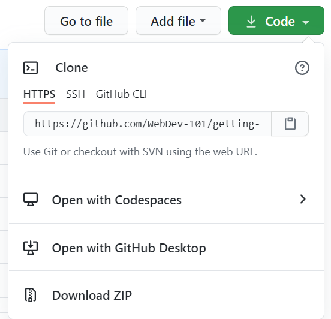

# गिटहब का परिचय

इस पाठ में GitHub की मूल बातें शामिल हैं, जो आपके कोड में परिवर्तनों को होस्ट और प्रबंधित करने के लिए एक मंच है।


> [टोमोमी इमुरा](https://twitter.com/girlie_mac) द्वारा स्केचनेट

## पूर्व व्याख्यान प्रश्नोत्तरी
[पूर्व व्याख्यान प्रश्नोत्तरी](https://happy-mud-02d95f10f.azurestaticapps.net/quiz/3?loc=hi)

## परिचय

इस पाठ में, हम कवर करेंगे:

- आपके द्वारा मशीन पर किए गए कार्य को ट्रैक करना
- दूसरों के साथ परियोजनाओं पर काम करना
- खुला स्त्रोत सॉफ़्टवेयर खोलने में योगदान कैसे करें

### आवश्यक शर्तें

 शुरू करने से पहले, आपको जांचना होगा कि क्या Git स्थापित है। टर्मिनल में लिखे:
`git --version`

यदि गिट स्थापित नहीं है तो , [गिट डाउनलोड करे](https://git-scm.com/downloads). फिर, टर्मिनल में अपनी स्थानीय Git प्रोफ़ाइल सेट करें:
* `git config --global user.name "your-name"`
* `git config --global user.email "your-email"`

यह जाँचने के लिए कि क्या Git पहले से कॉन्फ़िगर है आप टाइप कर सकते हैं:
`git config --list`

आपको एक GitHub खाते, एक कोड एडिटर (जैसे Visual Studio कोड) की आवश्यकता होगी, और आपको अपना टर्मिनल (या: कमांड प्रॉम्प्ट) खोलने की आवश्यकता होगी।

[Github.com](https://github.com/) पर नेविगेट करें और यदि आप पहले से नहीं हैं, तो एक खाता बनाएं या लॉग इन करें और अपना प्रोफ़ाइल भरें। 

✅ GitHub दुनिया में एकमात्र कोड भंडार नहीं है; अन्य हैं, लेकिन GitHub सबसे अच्छा ज्ञात है

### तैयारी

आपको अपने स्थानीय मशीन (लैपटॉप या पीसी) पर एक कोड परियोजना के साथ एक फ़ोल्डर की आवश्यकता होगी, और GitHub पर एक सार्वजनिक भंडार, जो दूसरों की परियोजनाओं में योगदान करने के लिए एक उदाहरण के रूप में काम करेगा। 

---

## कोड प्रबंधन

मान लें कि आपके पास कुछ कोड प्रोजेक्ट के साथ स्थानीय रूप से एक फ़ोल्डर है और आप संस्करण नियंत्रण प्रणाली - git का उपयोग करके अपनी प्रगति को ट्रैक करना शुरू करना चाहते हैं। कुछ लोग आपके भविष्य के लिए एक प्रेम पत्र लिखने के लिए git का उपयोग करने की तुलना करते हैं। अपने प्रतिबद्ध संदेशों को दिनों या हफ्तों या महीनों के बाद पढ़कर आप याद कर पाएंगे कि आपने निर्णय क्यों लिया, या "रोलबैक" में बदलाव किया - यानी जब आप अच्छा "कमिट मैसेज" लिखते हैं।

### कार्य: एक रीपाज़टॉरी और कमिट कोड बनाएं
1. **GitHub पर रीपाज़टॉरी बनाएँ**. GitHub.com पर, रिपॉजिटरी टैब में, या नेविगेशन बार टॉप-राइट से, **नया रेपो** बटन ढूंढें।

   1. अपने रिपॉजिटरी (फ़ोल्डर) को एक नाम दें
   1. **रिपॉजिटरी बनाएं** चुनें।

1. **अपने कार्यशील फ़ोल्डर में नेविगेट करें**. अपने टर्मिनल में, उस फ़ोल्डर पर स्विच करें (जिसे निर्देशिका के रूप में भी जाना जाता है) जिसे आप ट्रैक करना चाहते हैं, लिखे :

   ```bash
   cd [फ़ोल्डरका नाम]
   ```

1. **एक गिट रिपॉजिटरी को प्रारंभ करें**. आपके प्रोजेक्ट मे लिखे:
   ```bash
   git init
   ```

1. **अवस्था जांच**. अपने भंडार प्रकार की स्थिति की जांच करने के लिए लिखे:

   ```bash
   git status
   ```

  आउटपुट कुछ इस तरह दिख सकता है:

   ```output
   Changes not staged for commit:
   (use "git add <file>..." to update what will be committed)
   (use "git checkout -- <file>..." to discard changes in working directory)

        modified:   file.txt
        modified:   file2.txt
   ```

आमतौर पर एक `git status` कमांड आपको ऐसी चीजें बताती है जैसे रेपो में _saved_ होने के लिए कौन सी फाइलें तैयार हैं या इस पर ऐसे बदलाव हैं जिन्हें आप जारी रखना चाहते हैं।

1. **ट्रैकिंग के लिए सभी फाइलें जोड़ें**
  इसे स्टेजिंग फाइल / फाइल को स्टेजिंग एरिया में जोड़ना भी कहा जाता है।

   ```bash
   git add .
   ```

  `Git add` और `.` तर्क इंगित करता है कि आपकी सभी फाइलें और ट्रैकिंग के लिए परिवर्तन होगया है। 

1. **ट्रैकिंग के लिए चयनित फ़ाइलें जोड़ें**

   ```bash
   git add [फ़ाइल या फ़ोल्डर का नाम]
   ```

   जब हम एक बार में सभी फ़ाइलों को कमिट नहीं करना चाहते हैं, तो यह हमें केवल स्टेजिंग क्षेत्र में चयनित फ़ाइलों को जोड़ने में मदद करता है।

1. **सभी फाइलों को अनस्टेज करें**

   ```bash
   git reset
   ```

   यह कमांड हमें एक ही बार में सभी फ़ाइलों को अस्थिर करने में मदद करता है।

1. **किसी विशेष फ़ाइल को अनस्टेज करें**

   ```bash
   git reset [फ़ाइल या फ़ोल्डर का नाम]
   ```

यह कमांड हमें केवल एक विशेष फ़ाइल को एक बार में अनस्टेज करने में मदद करती है जिसे हम अगले कमिट के लिए शामिल नहीं करना चाहते हैं।

1. **अपना काम जारी रखना**. इस बिंदु पर आपने फ़ाइलों को तथाकथित _स्टैजिंग एरिया_ में जोड़ा है।एक जगह जहां Git आपकी फ़ाइलों को ट्रैक कर रही है। परिवर्तन को स्थायी करने के लिए आपको फ़ाइलों को _कॉमित_ की आवश्यकता होती है। ऐसा करने के लिए आप `git commit` कमांड के साथ एक _कमिट _ बनाते हैं। एक _कमिट_ आपके रेपो के इतिहास में एक बचत बिंदु का प्रतिनिधित्व करता है। _कमिट_ बनाने के लिए निम्नलिखित टाइप करें:

   ```bash
   git commit -m "पहला कमिट"
   ```

   यह आपकी सभी फ़ाइलों को "पहला कमिट" संदेश को जोड़ता है। भविष्य के कमिट संदेशों के लिए आप अपने विवरण में यह बताना चाहेंगे कि आपने किस प्रकार का परिवर्तन किया है।

1. **अपने स्थानीय Git रेपो को GitHub से कनेक्ट करें**. आपके मशीन पर एक Git रेपो अच्छा है, लेकिन कुछ बिंदु पर आप अपनी फ़ाइलों का बैकअप कहीं और रखना चाहते हैं और अन्य लोगों को भी अपने रेपो पर आपके साथ काम करने के लिए आमंत्रित करते हैं। ऐसा करने के लिए एक महान जगह GitHub है। याद रखें कि हमने पहले ही GitHub पर एक रेपो बना लिया है, इसलिए हमें केवल अपने Git रेपो को GitHub के साथ जोड़ना है। कमांड `git remote add` बस यही करेगा। निम्न कमांड टाइप करें:

   > ध्यान दें, इससे पहले कि आप कमांड टाइप करें अपने रिपॉजिटरी URL को खोजने के लिए अपने GitHub रेपो पेज पर जाएं। आप इसे नीचे दिए गए कमांड में उपयोग करेंगे। अपने GitHub URL से `repository_name` बदलें।

   ```bash
   git remote add origin https://github.com/username/repository_name.git
   ```

   यह आपके द्वारा पहले बनाए गए GitHub रिपॉजिटरी को इंगित करते हुए "origin" नाम का एक _remote_, या कनेक्शन बनाता है।

1. **GitHub पर स्थानीय फ़ाइलें भेजें**. अब तक आपने स्थानीय रेपो और गिटहब रेपो के बीच एक _कनेक्शन_ बनाया है। चलो निम्न कमांड `git push` के साथ इन फाइलों को गिटहब को भेजें, जैसे:

   ```bash
   git push -u origin main
   ```

   यह आपकी "मैन" शाखा में GitHub को आपके कमिट भेजता है।

1. **अधिक परिवर्तन जोड़ने के लिए**. यदि आप परिवर्तन करना जारी रखना चाहते हैं और उन्हें GitHub पर धकेलना चाहते हैं, तो आपको निम्नलिखित तीन आदेशों का उपयोग करने की आवश्यकता होगी:

   ```bash
   git add .
   git commit -m "अपना संदेश यहाँ लिखें"
   git push
   ```

   > टिप, आप उन फ़ाइलों को रोकने के लिए एक `.gitignore` फ़ाइल भी अपनाना चाह सकते हैं जिन्हें आप GitHub पर दिखाने से रोकना चाहते हैं - जैसे नोट्स आप उसी फ़ोल्डर में संग्रहीत करते हैं, लेकिन सार्वजनिक रिपॉजिटरी में कोई स्थान नहीं है। आप `.gitignore` फाइल के लिए टेम्प्लेट में [.gitignore टेम्प्लेट](https://github.com/github/gitignore) पे पा सकते हैं
#### कमिट संदेश

एक महान Git कमिट विषय पंक्ति निम्नलिखित वाक्य को पूरा करती है:
यदि लागू किया जाता है, तो यह प्रतिबद्ध होगा <आपकी विषय पंक्ति यहां>

विषय के लिए अनिवार्य, वर्तमान काल का उपयोग करें: "परिवर्तन" न "बदला गया" और न ही "परिवर्तने"।
विषय के रूप में, शरीर में (वैकल्पिक) भी अनिवार्य, वर्तमान काल का उपयोग करते हैं। शरीर में परिवर्तन के लिए प्रेरणा शामिल होनी चाहिए और पिछले व्यवहार के साथ इसके विपरीत होना चाहिए। आप `क्यों` को समझा रहे हैं,` कैसे` को नहीं।

✅ GitHub के आसपास सर्फ करने के लिए कुछ मिनट लें। क्या आप वास्तव में महान कमिट संदेश पा सकते हैं? क्या आप वास्तव में न्यूनतम पा सकते हैं? आपको क्या संदेश लगता है कि एक कमिट संदेश देने के लिए सबसे महत्वपूर्ण और उपयोगी है?

### कार्य: सहयोग करें

गिटहब पर चीजें डालने का मुख्य कारण अन्य डेवलपर्स के साथ सहयोग करना संभव बनाना था।

## दूसरों के साथ परियोजनाओं पर काम करना

अपनी रिपॉजिटरी में, यह देखने के लिए कि आपकी परियोजना अनुशंसित सामुदायिक मानकों की तुलना कैसे करती है, `इनसाइट्स > कम्यूनिटी` पर जाएँ।

   यहाँ कुछ चीजें हैं जो आपके GitHub रेपो में सुधार कर सकती हैं:
   - **विवरण**. क्या आपने अपनी परियोजना के लिए एक विवरण जोड़ा?
   - **README**. क्या आपने एक README जोड़ा? GitHub एक [README](https://docs.github.com/articles/about-readmes/) लिखने के लिए मार्गदर्शन प्रदान करता है।
   - **योगदान दिशानिर्देश**. आपके प्रोजेक्टका [योगदान दिशानिर्देश](https://docs.github.com/articles/setting-guidelines-for-repository-contributors/) है, 
   - **आचार संहिता**. एक [आचार संहिता](https://docs.github.com/articles/adding-a-code-of-conduct-to-your-project/), 
   - **लाइसेंस**. शायद सबसे महत्वपूर्ण बात, एक [लाइसेंस](https://docs.github.com/articles/adding-a-license-to-a-repository/)?


इन सभी संसाधनों से टीम के नए सदस्यों को लाभ मिलेगा। और वे आम तौर पर इस तरह की चीजें हैं जो आपके कोड को देखने से पहले भी नए योगदानकर्ताओं को देखते हैं, यह पता लगाने के लिए कि क्या आपका प्रोजेक्ट उनके लिए अपना समय बिताने के लिए सही जगह है।

✅ README फाइलें, हालांकि उन्हें तैयार करने में समय लगता है, अक्सर व्यस्त रखवाले द्वारा उपेक्षित कर दिए जाते हैं। क्या आप एक विशेष रूप से वर्णनात्मक का एक उदाहरण पा सकते हैं? नोट: कुछ अच्छे [READMEs बनाने में मदद करने के लिए कुछ उपकरण हैं](https://www.makeareadme.com/) जिन्हें आप आज़माना चाहते हैं।

### कार्य: कुछ कोड मर्ज करें

डॉक्स में योगदान करने से लोगों को परियोजना में योगदान करने में मदद मिलती है। यह बताता है कि आप किस प्रकार के योगदान की तलाश कर रहे हैं और प्रक्रिया कैसे काम करती है। योगदानकर्ताओं को GitHub पर आपके रेपो में योगदान करने में सक्षम होने के लिए कई चरणों से गुजरना होगा:


1. **अपने रेपो को फोर्क करना** आप शायद लोगों को अपनी परियोजना को _fork_ करना चाहेंगे। फोर्किंग का अर्थ है उनके GitHub प्रोफाइल पर अपनी रिपॉजिटरी की प्रतिकृति बनाना।
1. **क्लोन**.वहां से वे इस परियोजना को अपनी स्थानीय मशीन से जोड़ देंगे।
1. **एक शाखा बनाएँ**. आप उन्हें अपने काम के लिए एक _शाखा_ बनाने के लिए कहना चाहेंगे। 
1. **एक क्षेत्र पर उनके परिवर्तन पर ध्यान दें**.योगदानकर्ताओं से एक समय में एक चीज़ पर उनके योगदान पर ध्यान केंद्रित करने के लिए कहें - इस तरह से संभावना है कि आप उनके काम में विलय कर सकते हैं। कल्पना कीजिए कि वे एक बग फिक्स लिखते हैं, एक नई सुविधा जोड़ते हैं, और कई परीक्षण अपडेट करते हैं - क्या होगा यदि आप चाहते हैं, या केवल 3 में से 2, या 3 में से 1 परिवर्तन लागू कर सकते हैं?

✅ ऐसी स्थिति की कल्पना करें जहां शाखाएं विशेष रूप से अच्छे कोड लिखने और शिपिंग करने के लिए महत्वपूर्ण हैं। आप किन मामलों का उपयोग कर सकते हैं?

> ध्यान दें, वह परिवर्तन हो जो आप दुनिया में देखना चाहते हैं, और अपने काम के लिए भी शाखाएँ बनाएँ। आपके द्वारा किया गया कोई भी शाखा उस शाखा पर बना दी जाएगी जिसे आप वर्तमान में "चेक आउट" कर रहे हैं। कौन सी शाखा है यह देखने के लिए `git status` का प्रयोग करें।

चलो एक योगदानकर्ता वर्कफ़्लो के माध्यम से चलते हैं। मान लें कि योगदानकर्ता पहले से ही रेपो को _फोर्क_ और _क्लोन_ कर चुका है, इसलिए उनके पास अपने स्थानीय मशीन पर काम करने के लिए तैयार गिट रेपो है:

1. **एक शाखा बनाएँ**.एक शाखा बनाने के लिए कमांड `git branch` का उपयोग करें जिसमें वे परिवर्तन होंगे जो उनके योगदान के लिए हैं:

   ```bash
   git branch [शाखाका-नाम]
   ```

1. **कार्यशील शाखा पर स्विच करें**. निर्दिष्ट शाखा में स्विच करें और `git checkout` के साथ कार्य निर्देशिका को अपडेट करें:

   ```bash
   git checkout [शाखाका-नाम]
   ```

1. **काम करो**. इस बिंदु पर आप अपने परिवर्तन जोड़ना चाहते हैं। निम्नलिखित आदेशों के बारे में Git को बताना न भूलें:

   ```bash
   git add .
   git commit -m "मेरे परिवर्तन"
   ```

   यह सुनिश्चित करें कि आप अपनी खातिर एक अच्छा नाम दें, साथ ही साथ आप जिस रेपो में मदद कर रहे हैं उसका रखवालाका भी।

1. **`main` शाखा के साथ अपने काम को मिलाएं**. कुछ बिंदु पर आप काम कर रहे हैं और आप `main` शाखा के साथ अपने काम को जोड़ना चाहते हैं। `main` शाखा इस बीच बदल सकती है, इसलिए सुनिश्चित करें कि आपने इसे निम्न कमांड के साथ नवीनतम में अपडेट किया है:

   ```bash
   git checkout main
   git pull
   ```

  इस बिंदु पर आप यह सुनिश्चित करना चाहते हैं कि कोई भी _टकराव_, परिस्थितियां जहां Git आसानी से आपके कामकाजी शाखा में होने वाले परिवर्तनों को _संयोजित_ नहीं कर सकती है। इसलिए निम्न आदेश चलाएँ:

   ```bash
   git checkout [शाखाका-नाम]
   git merge main
   ```

   यह आपकी शाखा में `main` से सभी बदलाव लाएगा और उम्मीद है कि आप अभी भी जारी रख सकते हैं। यदि नहीं, तो VS कोड आपको बताएगा कि गिट कहां _उलझन_ में है और आप यह कहने के लिए प्रभावित फाइलों को बदल देते हैं कि कौन सी सामग्री सबसे सटीक है।

1. **अपना काम GitHub को भेजें**. अपने काम को GitHub में भेजने का मतलब है दो चीजें। अपनी शाखा को अपने रेपो में धकेलना और फिर एक पीआर, पुल अनुरोध को खोलें।

   ```bash
   git push --set-upstream origin [शाखाका-नाम]
   ```

  उपरोक्त कमांड आपके फोर्क्ड रेपो पर शाखा बनाता है।

1. **एक पीआर खोलें**. अगला, आप एक पीआर खोलना चाहते हैं। आप GitHub पर फोर्केड रेपो में नेविगेट करके ऐसा करते हैं। आपको GitHub पर एक संकेत दिखाई देगा जहां यह पूछता है कि क्या आप एक नया PR बनाना चाहते हैं, आप उस पर क्लिक करते हैं और आपको एक इंटरफ़ेस पर ले जाया जाता है जहाँ आप प्रतिबद्ध संदेश शीर्षक बदल सकते हैं, इसे अधिक उपयुक्त विवरण दे सकते हैं। अब रेपो के अनुरक्षक आप इस पीआर को देखेंगे और _उँगलियाँ पार_ कर जाएँगे जो आपके पीआर को सराहेंगे और _मर्ज_ करेंगे। अब आप एक योगदानकर्ता हैं, याय :)

1. **साफ - सफाई**. अपने को सफलतापूर्वक मर्ज करने के बाद _सफाई करना_ अच्छा माना जाता है। आप अपनी स्थानीय शाखा और उस शाखा को साफ़ करना चाहते हैं जिसे आपने GitHub में धकेल दिया है। पहले इसे निम्नलिखित कमांड के साथ स्थानीय रूप से हटा दें: 

   ```bash
   git branch -d [शाखाका-नाम]
   ```

   सुनिश्चित करें कि आप अगले फोर्केड रेपो के लिए GitHub पृष्ठ पर जाएं और उस दूरस्थ शाखा को हटा दें जिसे आपने अभी पुश किया था।

`पुल अनुरोध` एक मूर्खतापूर्ण शब्द की तरह लगता है क्योंकि वास्तव में आप परियोजना में अपने परिवर्तनों को आगे बढ़ाना चाहते हैं। लेकिन अनुरक्षक (परियोजना स्वामी) या कोर टीम को परियोजना की "main" शाखा के साथ विलय करने से पहले आपके परिवर्तनों पर विचार करने की आवश्यकता है, इसलिए आप वास्तव में एक अनुचर से परिवर्तन के निर्णय का अनुरोध कर रहे हैं।

एक पुल अनुरोध समीक्षा, टिप्पणियों, एकीकृत परीक्षणों और अधिक के साथ एक शाखा पर पेश किए गए मतभेदों की तुलना और चर्चा करने का स्थान है। एक अच्छा पुल अनुरोध एक प्रतिबद्ध संदेश के समान नियमों का पालन करता है। आप समस्या ट्रैकर में किसी समस्या के संदर्भ को जोड़ सकते हैं, जब उदाहरण के लिए आपका कार्य किसी समस्या को हल करता है। यह आपके अंक की संख्या के बाद एक `#` का उपयोग करके किया जाता है। उदाहरण के लिए `# 97`।

🤞उंगलियों ने पार कर दिया कि सभी चेक पास हो गए और परियोजना के मालिकों ने परियोजना में आपके बदलावों को मर्ज कर दिया🤞

GitHub पर संबंधित दूरस्थ शाखा से सभी नए कमिट के साथ अपनी वर्तमान स्थानीय कार्य शाखा को अपडेट करें:

`git pull`

## कैसे खुला स्रोत में योगदान करे

सबसे पहले, आप के हित के GitHub पर एक रिपॉजिटरी (या **रेपो**) ढूंढें और जिसमें आप बदलाव में योगदान करना चाहते हैं। आप इसकी सामग्री को अपनी मशीन पर कॉपी करना चाहेंगे।

✅'शुरुआती-अनुकूल' रेपो को खोजने का एक अच्छा तरीका है, ['good-first-issue' द्वारा खोज करना](https://github.blog/2020-01-22-browse-good-first-issues-to-start-contributing-to-open-source/).



कोड को कॉपी करने के कई तरीके हैं। एक तरीका है रिपॉजिटरी की सामग्री को "क्लोन" करना, HTTPS, SSH का उपयोग करना, या GitHub CLI (कमांड लाइन इंटरफ़ेस) का उपयोग करना। 

अपना टर्मिनल खोलें और रिपॉजिटरी को क्लोन करें जैसे:
`git clone https://github.com/ProjectURL`

प्रोजेक्ट पर काम करने के लिए, सही फ़ोल्डर पर जाएँ:
`cd ProjectURL`

आप [Codespaces](https://github.com/features/codespaces), GitHub के एम्बेडेड कोड एडिटर / क्लाउड डेवलपमेंट एन्वायरमेंट, या [GitHub Desktop](https://desktop.github.com/) का उपयोग करके पूरी परियोजना भी खोल सकते हैं ) का है।

अंत में, आप ज़िप फ़ोल्डर में कोड डाउनलोड कर सकते हैं।

### GitHub के बारे में कुछ और दिलचस्प बातें

आप GitHub पर किसी भी पब्लिक रिपॉजिटरी को स्टार, पहरा और/या "फोर्क" कर सकते हैं। आप शीर्ष-दाएँ ड्रॉप-डाउन मेनू में अपने तारांकित रिपॉजिटरी पा सकते हैं। यह बुकमार्क करने जैसा है, लेकिन कोड के लिए।

परियोजनाओं में एक मुद्दा ट्रैकर है, ज्यादातर "इश्यू" टैब में गिटहब पर जब तक कि अन्यथा इंगित नहीं किया जाता है, जहां लोग परियोजना से संबंधित मुद्दों पर चर्चा करते हैं। और पुल अनुरोध टैब वह है जहां लोग उन परिवर्तनों की चर्चा और समीक्षा करते हैं जो प्रगति पर हैं।

परियोजनाओं की चर्चा फ़ोरम, मेलिंग सूचियों, या चैट चैनलों जैसे स्लैक, डिस्कोर्ड या आईआरसी में भी हो सकती है।

✅ अपने नए GitHub रेपो के चारों ओर एक नज़र डालें और कुछ चीजों को आज़माएं, जैसे कि सेटिंग्स को संपादित करना, अपने रेपो में जानकारी जोड़ना और एक प्रोजेक्ट बनाना (जैसे कंबन बोर्ड)। बहुत कुछ है जो आप कर सकते हैं!

---

## 🚀 चुनौती

एक दूसरे के कोड पर काम करने के लिए एक दोस्त के साथ जोडे। सहयोगी रूप से एक परियोजना बनाएँ, कोड बनाएँ, शाखाएँ बनाएँ, और परिवर्तनों को मर्ज करें।

## व्याख्यान उपरांत प्रश्नोत्तरी
[व्याख्यान उपरांत प्रश्नोत्तरी](https://happy-mud-02d95f10f.azurestaticapps.net/quiz/4?loc=hi)

## समीक्षा और स्व अध्ययन

[ओपन सोर्स सॉफ्टवेयर में योगदान](https://opensource.guide/how-to-contribute/#how-to-submit-a-contribution) के बारे में और पढ़ें।

[गिट चिटशीट](https://training.github.com/downloads/github-git-cheat-sheet/).

अभ्यास, अभ्यास, अभ्यास। GitHub में [lab.github.com](https://lab.github.com/) के माध्यम से सीखने के शानदार रास्ते उपलब्ध हैं:

- [GitHub पर पहला सप्ताह](https://lab.github.com/githubtraining/first-week-on-github)

आपको और भी उन्नत प्रयोगशालाएँ मिलेंगी।

## असाइनमेंट 

[GitHub प्रशिक्षण प्रयोगशाला पर पहला सप्ताह](https://lab.github.com/githubtraining/first-week-on-github) पूरा करे
