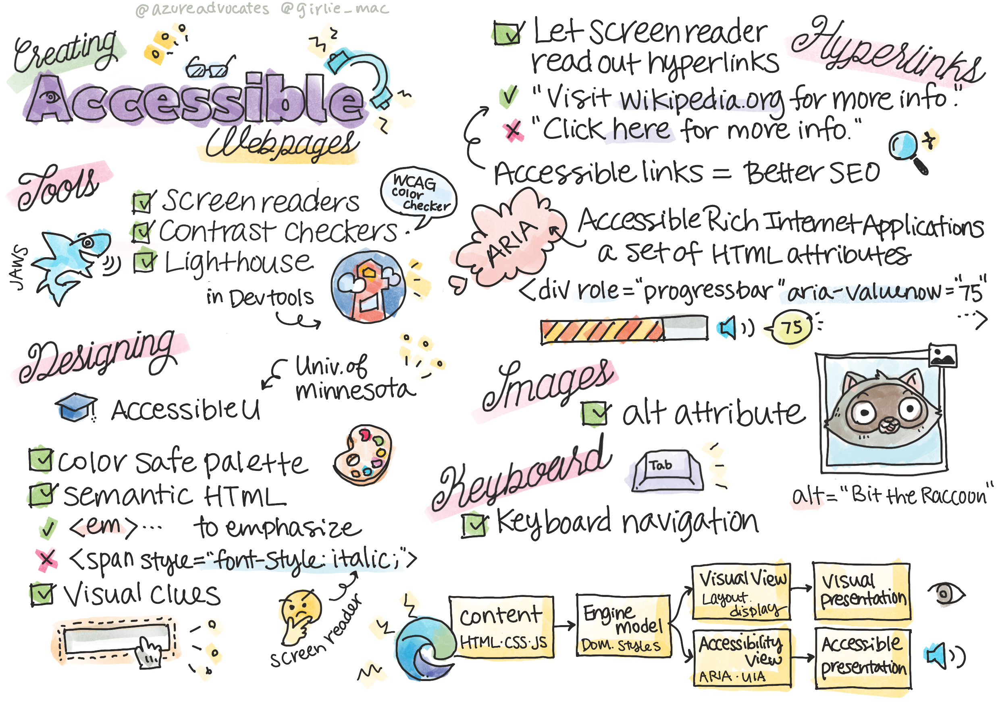

# Creating Accessible Webpages


> Sketchnote by [Tomomi Imura](https://twitter.com/girlie_mac)

## Pre-Lecture Quiz
[Pre-lecture quiz](https://calm-wave-0d1a32b03.1.azurestaticapps.net/quiz/5)

> The power of the Web is in its universality. Access by everyone regardless of disability is an essential aspect.
>
> \- Sir Timothy Berners-Lee, W3C Director and inventor of the World Wide Web

This quote perfectly highlights the importance of creating accessible websites. An application that can't be accessed by all is by definition exclusionary. As web developers we should always have accessibility in mind. By having this focus from the beginning you will be well on your way to ensure everyone can access the pages you create. In this lesson, you'll learn about the tools that can help you ensure that your web assets are accessible and how to build with accessibility in mind. 

> You can take this lesson on [Microsoft Learn](https://docs.microsoft.com/learn/modules/web-development-101/accessibility?WT.mc_id=academic-13441-cxa)!

## Tools to use

### Screen readers

One of the best-known accessibility tools are screen readers.

[Screen readers](https://en.wikipedia.org/wiki/Screen_reader) are commonly used clients for those with vision impairments. As we spend time ensuring a browser properly conveys the information we wish to share, we must also ensure a screen reader does the same.

At its most basic, a screen reader will read a page from top to bottom audibly. If your page is all text, the reader will convey the information in a similar fashion to a browser. Of course, web pages are rarely purely text; they will contain links, graphics, color, and other visual components. Care must be taken to ensure that this information is read correctly by a screen reader.

Every web developer should familiarize themselves with a screen reader. As highlighted above, it's the client your users will utilize. Much in the same way you're familiar with how a browser operates, you should learn how a screen reader operates. Fortunately, screen readers are built into most operating systems.

Some browsers also have built-in tools and extensions that can read text aloud or even provide some basic navigational features, such as [these accessibility-focused Edge browser tools](https://support.microsoft.com/help/4000734/microsoft-edge-accessibility-features). These are also important accessibility tools, but function very differently from screen readers and they should not be mistaken for screen reader testing tools.

✅ Try a screen reader and browser text reader. On Windows [Narrator](https://support.microsoft.com/windows/complete-guide-to-narrator-e4397a0d-ef4f-b386-d8ae-c172f109bdb1) is included by default, and [JAWS](https://webaim.org/articles/jaws/) and [NVDA](https://www.nvaccess.org/about-nvda/) can also be installed. On macOS and iOS, [VoiceOver](https://support.apple.com/guide/voiceover/welcome/10) is installed by default.

### Zoom

Another tool commonly used by people with vision impairments is zooming. The most basic type of zooming is static zoom, controlled through `Control + plus sign (+)` or by decreasing screen resolution. This type of zoom causes the entire page to resize, so using [responsive design](https://developer.mozilla.org/docs/Learn/CSS/CSS_layout/Responsive_Design) is important to provide a good user experience at increased zoom levels.

Another type of zoom relies on specialized software to magnify one area of the screen and pan, much like using a real magnifying glass. On Windows, [Magnifier](https://support.microsoft.com/windows/use-magnifier-to-make-things-on-the-screen-easier-to-see-414948ba-8b1c-d3bd-8615-0e5e32204198) is built in, and [ZoomText](https://www.freedomscientific.com/training/zoomtext/getting-started/) is a third-party magnification software with more features and a larger user base. Both macOS and iOS have a built-in magnification software called [Zoom](https://www.apple.com/accessibility/mac/vision/).

### Contrast checkers

Colors on web sites need to be carefully chosen to  answer the needs of color-blind users or people who have  difficulty seeing low-contrast colors.

✅ Test a web site you enjoy using for color usage with a browser extension such as [WCAG's color checker](https://microsoftedge.microsoft.com/addons/detail/wcag-color-contrast-check/idahaggnlnekelhgplklhfpchbfdmkjp?hl=en-US). What do you learn?

### Lighthouse

In the developer tool area of your browser, you'll find the Lighthouse tool. This tool is important to get a first view of the accessibility (as well as other analysis) of a web site. While it's important not to rely exclusively on Lighthouse, a 100% score is very helpful as a baseline.

✅ Find Lighthouse in your browser's developer tool panel and run an analysis on any site. what do you discover?

## Designing for accessibility

Accessibility is a relatively large topic. To help you out, there are numerous resources available.

- [Accessible U - University of Minnesota](https://accessibility.umn.edu/your-role/web-developers)

While we won't be able to cover every aspect of creating accessible sites, below are some of the core tenets you will want to implement. Designing an accessible page from the start is **always** easier than going back to an existing page to make it accessible.

## Good display principles

### Color safe palettes

People see the world in different ways, and this includes colors. When selecting a color scheme for your site, you should ensure it's accessible to all. One great [tool for generating color palettes is Color Safe](http://colorsafe.co/).

✅ Identify a web site that is very problematic in its use of color. Why?

### Use the correct HTML

With CSS and JavaScript it's possible to make any element look like any type of control. `<span>` could be used to create a `<button>`, and `<b>` could become a hyperlink. While this might be considered easier to style, it conveys nothing to a screen reader. Use the appropriate HTML when creating controls on a page. If you want a hyperlink, use `<a>`. Using the right HTML for the right control is called making use of Semantic HTML.

✅ Go to any web site and see if the designers and developers are using HTML properly. Can you find a button that should be a link? Hint: right click and choose 'View Page Source' in your browser to look at underlying code.

### Create a descriptive heading hierarchy

Screen reader users [rely heavily on headings](https://webaim.org/projects/screenreadersurvey8/#finding) to find information and navigate through a page. Writing descriptive heading content and using semantic heading tags are important for creating an easily navigable site for screen reader users.

### Use good visual clues

CSS offers complete control over the look of any element on a page. You can create text boxes without an outline or hyperlinks without an underline. Unfortunately removing those clues can make it more challenging for someone who depends on them to be able to recognize the type of control.

## The importance of link text

Hyperlinks are core to navigating the web. As a result, ensuring a screen reader can properly read links allows all users to navigate your site.

### Screen readers and links

As you would expect, screen readers read link text in the same way they'd read any other text on the page. With this in mind, the text demonstrated below might feel perfectly acceptable.

> The little penguin, sometimes known as the fairy penguin, is the smallest penguin in the world. [Click here](https://en.wikipedia.org/wiki/Little_penguin) for more information.

> The little penguin, sometimes known as the fairy penguin, is the smallest penguin in the world. Visit https://en.wikipedia.org/wiki/Little_penguin for more information.

> **NOTE** As you're about to read, you should **never** create links which look like the above.

Remember, screen readers are a different interface from browsers with a different set of features.

### The problem with using the URL

Screen readers read the text. If a URL appears in the text, the screen reader will read the URL. Generally speaking, the URL does not convey meaningful information, and can sound annoying. You may have experienced this if your phone has ever audibly read a text message with a URL.

### The problem with "click here"

Screen readers also have the ability to read only the hyperlinks on a page, much in the same way a sighted person would scan a page for links. If the link text is always "click here", all the user will hear is "click here, click here, click here, click here, click here, ..." All links are now indistinguishable from one another.

### Good link text

Good link text briefly describes what's on the other side of the link. In the above example talking about little penguins, the link is to the Wikipedia page about the species. The phrase *little penguins* would make for perfect link text as it makes it clear what someone will learn about if they click the link - little penguins.

> The [little penguin](https://en.wikipedia.org/wiki/Little_penguin), sometimes known as the fairy penguin, is the smallest penguin in the world.

✅ Surf the web for a few minutes to find pages that use obscure linking strategies. Compare them with other, better-linked sites. What do you learn?

#### Search engine notes

As an added bonus for ensuring your site is accessible to all, you'll help search engines navigate your site as well. Search engines use link text to learn the topics of pages. So using good link text helps everyone!

### ARIA

Imagine the following page:

| Product      | Description        | Order        |
| ------------ | ------------------ | ------------ |
| Widget       | [Description]('#') | [Order]('#') |
| Super widget | [Description]('#') | [Order]('#') |

In this example, duplicating the text of description and order make sense for someone using a browser. However, someone using a screen reader would only hear the words *description* and *order* repeated without context.

To support these types of scenarios, HTML supports a set of attributes known as [Accessible Rich Internet Applications (ARIA)](https://developer.mozilla.org/docs/Web/Accessibility/ARIA). These attributes allow you to provide additional information to screen readers.

> **NOTE**: Like many aspects of HTML, browser and screen reader support may vary. However, most mainline clients support ARIA attributes.

You can use `aria-label` to describe the link when the format of the page doesn't allow you to. The description for widget could be set as

``` html
<a href="#" aria-label="Widget description">description</a>
```

✅ In general, using Semantic markup as described above supersedes the use of ARIA, but sometimes there is no semantic equivalent for various HTML widgets. A good example is a Tree. There's no HTML equivalent for a tree, so you identify the generic `<div>` for this element with a proper role and aria values. The [MDN documentation on ARIA](https://developer.mozilla.org/docs/Web/Accessibility/ARIA) contains more useful information.

```html
<h2 id="tree-label">File Viewer</h2>
<div role="tree" aria-labelledby="tree-label">
  <div role="treeitem" aria-expanded="false" tabindex="0">Uploads</div>
</div>
```

## Images

It goes without saying screen readers are unable to automatically read what's in an image. Ensuring images are accessible doesn't take much work - it's what the `alt` attribute is all about. All meaningful images should have an `alt` to describe what they are.
Images that are purely decorative should have their `alt` attribute set to an empty string: `alt=""`. This prevents screen readers from unnecessarily announcing the decorative image.

✅ As you might expect, search engines are also unable to understand what's in an image. They also use alt text. So once again, ensuring your page is accessible provides additional bonuses!

## The keyboard

Some users are unable to use a mouse or trackpad, instead relying on keyboard interactions to tab from one element to the next. It's important for your web site to present your content in logical order so a keyboard user can access each interactive element as they move down a document. If you build your web pages with semantic markup and use CSS to style their visual layout, your site should be keyboard-navigable, but it's important to test this aspect manually. Learn more about [keyboard navigation strategies](https://webaim.org/techniques/keyboard/).

✅ Go to any web site and try to navigate through it using only your keyboard. What works, what doesn't work? Why?

## Summary

A web accessible to some is not a truly 'world-wide web'. The best way to ensure the sites you create are accessible is to incorporate accessibility best practices from the start. While there are extra steps involved, incorporating these skills into your workflow now will mean all pages you create will be accessible.

---

## 🚀 Challenge

Take this HTML and rewrite it to be as accessible as possible, given the strategies you learned.

```html
<!DOCTYPE html>
<html>
  <head>
    <title>
      Example
    </title>
    <link href='../assets/style.css' rel='stylesheet' type='text/css'>
  </head>
  <body>
    <div class="site-header">
      <p class="site-title">Turtle Ipsum</p>
      <p class="site-subtitle">The World's Premier Turtle Fan Club</p>
    </div>
    <div class="main-nav">
      <p class="nav-header">Resources</p>
      <div class="nav-list">
        <p class="nav-item nav-item-bull"><a href="https://www.youtube.com/watch?v=CMNry4PE93Y">"I like turtles"</a></p>
        <p class="nav-item nav-item-bull"><a href="https://en.wikipedia.org/wiki/Turtle">Basic Turtle Info</a></p>
        <p class="nav-item nav-item-bull"><a href="https://en.wikipedia.org/wiki/Turtles_(chocolate)">Chocolate Turtles</a></p>
      </div>
    </div>
    <div class="main-content">
      <div>
        <p class="page-title">Welcome to Turtle Ipsum. 
            <a href="">Click here</a> to learn more.
        </p>
        <p class="article-text">
          Turtle ipsum dolor sit amet, consectetur adipiscing elit, sed do eiusmod tempor incididunt ut labore et dolore magna aliqua. Ut enim ad minim veniam, quis nostrud exercitation ullamco laboris nisi ut aliquip ex ea commodo consequat. Duis aute irure dolor in reprehenderit in voluptate velit esse cillum dolore eu fugiat nulla pariatur. Excepteur sint occaecat cupidatat non proident, sunt in culpa qui officia deserunt mollit anim id est laborum
        </p>
      </div>
    </div>
    <div class="footer">
      <div class="footer-section">
        <span class="button">Sign up for turtle news</span>
      </div><div class="footer-section">
        <p class="nav-header footer-title">
          Internal Pages
        </p>
        <div class="nav-list">
          <p class="nav-item nav-item-bull"><a href="../">Index</a></p>
          <p class="nav-item nav-item-bull"><a href="../semantic">Semantic Example</a></p>
        </div>
      </div>
      <p class="footer-copyright">&copy; 2016 Instrument</span>
    </div>
  </body>
</html>
```

## Post-Lecture Quiz
[Post-lecture quiz](https://calm-wave-0d1a32b03.1.azurestaticapps.net/quiz/6)

## Review & Self Study

Many governments have laws regarding accessibility requirements. Read up on your home country's accessibility laws. What is covered, and what isn't? An example is [this government web site](https://accessibility.blog.gov.uk/).

## Assignment
 
[Analyze a non-accessible web site](assignment.md)

Credits: [Turtle Ipsum](https://github.com/Instrument/semantic-html-sample) by Instrument
