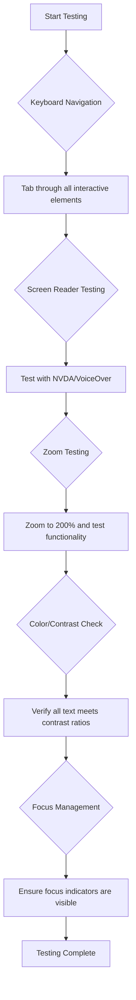
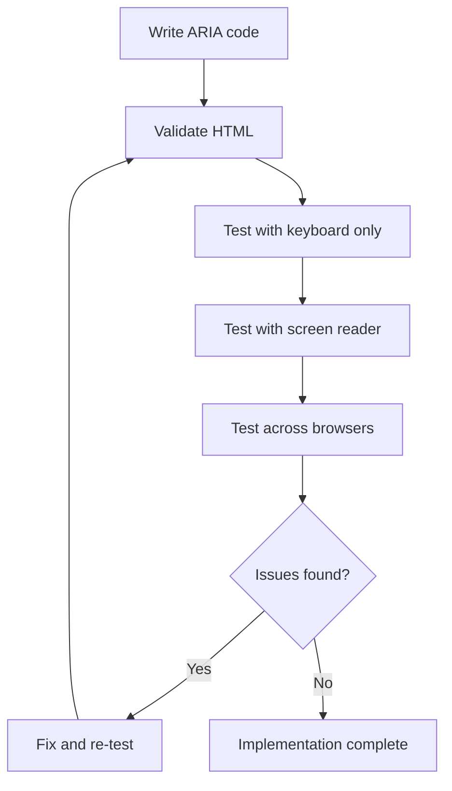

# Creating Accessible Webpages


> Sketchnote by [Tomomi Imura](https://twitter.com/girlie_mac)

## Pre-Lecture Quiz
[Pre-lecture quiz](https://ff-quizzes.netlify.app/web/)

> The power of the Web is in its universality. Access by everyone regardless of disability is an essential aspect.
>
> \- Sir Timothy Berners-Lee, W3C Director and inventor of the World Wide Web

Here's something that might surprise you: when you build accessible websites, you're not just helping people with disabilities—you're actually making the web better for everyone!

Ever notice those curb cuts at street corners? They were originally designed for wheelchairs, but now they help people with strollers, delivery workers with dollies, travelers with rolling luggage, and cyclists too. That's exactly how accessible web design works—solutions that help one group often end up benefiting everyone. Pretty cool, right?

In this lesson, we're going to explore how to create websites that truly work for everyone, no matter how they browse the web. You'll discover practical techniques that are already built into web standards, get hands-on with testing tools, and see how accessibility makes your sites more usable for all users.

By the end of this lesson, you'll have the confidence to make accessibility a natural part of your development workflow. Ready to explore how thoughtful design choices can open up the web to billions of users? Let's dive in! 

> You can take this lesson on [Microsoft Learn](https://docs.microsoft.com/learn/modules/web-development-101/accessibility/?WT.mc_id=academic-77807-sagibbon)!

## Understanding Assistive Technologies

Before we jump into coding, let's take a moment to understand how people with different abilities actually experience the web. This isn't just theory—understanding these real-world navigation patterns will make you a much better developer!

Assistive technologies are pretty amazing tools that help people with disabilities interact with websites in ways that might surprise you. Once you get the hang of how these technologies work, creating accessible web experiences becomes way more intuitive. It's like learning to see your code through someone else's eyes.

### Screen readers

[Screen readers](https://en.wikipedia.org/wiki/Screen_reader) are pretty sophisticated pieces of technology that convert digital text into speech or braille output. While they're primarily used by people with visual impairments, they're also super helpful for users with learning disabilities like dyslexia.

I like to think of a screen reader as having a really smart narrator reading a book to you. It reads content aloud in a logical order, announces interactive elements like "button" or "link," and provides keyboard shortcuts for jumping around a page. But here's the thing—screen readers can only work their magic if we build websites with proper structure and meaningful content. That's where you come in as a developer!

**Popular screen readers across platforms:**
- **Windows**: [NVDA](https://www.nvaccess.org/about-nvda/) (free and most popular), [JAWS](https://webaim.org/articles/jaws/), [Narrator](https://support.microsoft.com/windows/complete-guide-to-narrator-e4397a0d-ef4f-b386-d8ae-c172f109bdb1/?WT.mc_id=academic-77807-sagibbon) (built-in)
- **macOS/iOS**: [VoiceOver](https://support.apple.com/guide/voiceover/welcome/10) (built-in and very capable)
- **Android**: [TalkBack](https://support.google.com/accessibility/android/answer/6283677) (built-in)
- **Linux**: [Orca](https://wiki.gnome.org/Projects/Orca) (free and open-source)

**How screen readers navigate web content:**

Screen readers provide multiple navigation methods that make browsing efficient for experienced users:
- **Sequential reading**: Reads content from top to bottom, like following a book
- **Landmark navigation**: Jump between page sections (header, nav, main, footer)
- **Heading navigation**: Skip between headings to understand page structure
- **Link lists**: Generate a list of all links for quick access
- **Form controls**: Navigate directly between input fields and buttons

> 💡 **Here's something that blew my mind**: 68% of screen reader users navigate primarily by headings ([WebAIM Survey](https://webaim.org/projects/screenreadersurvey9/#finding)). This means your heading structure is like a roadmap for users—when you get it right, you're literally helping people find their way around your content faster!

### Building your testing workflow

Here's some good news—effective accessibility testing doesn't have to be overwhelming! You'll want to combine automated tools (they're fantastic at catching obvious issues) with some hands-on testing. Here's a systematic approach that I've found catches the most issues without eating up your entire day:

**Essential manual testing workflow:**



**Step-by-step testing checklist:**
1. **Keyboard navigation**: Use only Tab, Shift+Tab, Enter, Space, and Arrow keys
2. **Screen reader testing**: Enable NVDA, VoiceOver, or Narrator and navigate with eyes closed
3. **Zoom testing**: Test at 200% and 400% zoom levels
4. **Color contrast verification**: Check all text and UI components
5. **Focus indicator testing**: Ensure all interactive elements have visible focus states

✅ **Start with Lighthouse**: Open your browser's DevTools, run a Lighthouse accessibility audit, then use the results to guide your manual testing focus areas.

### Zoom and magnification tools

You know how you sometimes pinch to zoom on your phone when text is too small, or squint at your laptop screen in bright sunlight? Many users rely on magnification tools to make content readable every single day. This includes people with low vision, older adults, and anyone who's ever tried to read a website outdoors.

Modern zoom technologies have evolved beyond just making things bigger. Understanding how these tools work will help you create responsive designs that remain functional and attractive at any magnification level.

**Modern browser zoom capabilities:**
- **Page zoom**: Scales all content proportionally (text, images, layout) - this is the preferred method
- **Text-only zoom**: Increases font size while maintaining original layout
- **Pinch-to-zoom**: Mobile gesture support for temporary magnification
- **Browser support**: All modern browsers support zoom up to 500% without breaking functionality

**Specialized magnification software:**
- **Windows**: [Magnifier](https://support.microsoft.com/windows/use-magnifier-to-make-things-on-the-screen-easier-to-see-414948ba-8b1c-d3bd-8615-0e5e32204198) (built-in), [ZoomText](https://www.freedomscientific.com/training/zoomtext/getting-started/)
- **macOS/iOS**: [Zoom](https://www.apple.com/accessibility/mac/vision/) (built-in with advanced features)

> ⚠️ **Design Consideration**: WCAG requires that content remain functional when zoomed to 200%. At this level, horizontal scrolling should be minimal, and all interactive elements should remain accessible.

✅ **Test your responsive design**: Zoom your browser to 200% and 400%. Does your layout adapt gracefully? Can you still access all functionality without excessive scrolling?

## Modern Accessibility Testing Tools

Now that you understand how people navigate the web with assistive technologies, let's explore the tools that help you build and test accessible websites.

Think of it like this: automated tools are great at catching obvious issues (like missing alt text), while hands-on testing helps you ensure your site feels good to use in the real world. Together, they give you confidence that your sites work for everyone.

### Color contrast testing

Here's some good news: color contrast is one of the most common accessibility issues, but it's also one of the easiest to fix. Good contrast benefits everyone—from users with visual impairments to people trying to read their phones at the beach.

**WCAG contrast requirements:**

| Text Type | WCAG AA (Minimum) | WCAG AAA (Enhanced) |
|-----------|-------------------|---------------------|
| **Normal text** (under 18pt) | 4.5:1 contrast ratio | 7:1 contrast ratio |
| **Large text** (18pt+ or 14pt+ bold) | 3:1 contrast ratio | 4.5:1 contrast ratio |
| **UI components** (buttons, form borders) | 3:1 contrast ratio | 3:1 contrast ratio |

**Essential testing tools:**
- [Colour Contrast Analyser](https://www.tpgi.com/color-contrast-checker/) - Desktop app with color picker
- [WebAIM Contrast Checker](https://webaim.org/resources/contrastchecker/) - Web-based with instant feedback
- [Stark](https://www.getstark.co/) - Design tool plugin for Figma, Sketch, Adobe XD
- [Accessible Colors](https://accessible-colors.com/) - Find accessible color palettes

✅ **Build better color palettes**: Start with your brand colors and use contrast checkers to create accessible variations. Document these as your design system's accessible color tokens.

### Comprehensive accessibility auditing

The most effective accessibility testing combines multiple approaches. No single tool catches everything, so building a testing routine with various methods ensures thorough coverage.

**Browser-based testing (built into DevTools):**
- **Chrome/Edge**: Lighthouse accessibility audit + Accessibility panel
- **Firefox**: Accessibility Inspector with detailed tree view
- **Safari**: Audit tab in Web Inspector with VoiceOver simulation

**Professional testing extensions:**
- [axe DevTools](https://www.deque.com/axe/devtools/) - Industry-standard automated testing
- [WAVE](https://wave.webaim.org/extension/) - Visual feedback with error highlighting
- [Accessibility Insights](https://accessibilityinsights.io/) - Microsoft's comprehensive testing suite

**Command-line and CI/CD integration:**
- [axe-core](https://github.com/dequelabs/axe-core) - JavaScript library for automated testing
- [Pa11y](https://pa11y.org/) - Command-line accessibility testing tool
- [Lighthouse CI](https://github.com/GoogleChrome/lighthouse-ci) - Automated accessibility scoring

> 🎯 **Testing Goal**: Aim for a Lighthouse accessibility score of 95+ as your baseline. Remember, automated tools only catch about 30-40% of accessibility issues—manual testing is still essential!

## Building Accessibility from the Ground Up

The key to accessibility success is building it into your foundation from day one. I know it's tempting to think "I'll add accessibility later," but that's like trying to add a ramp to a house after it's already built. Possible? Yes. Easy? Not really.

Think of accessibility like planning a house—it's much easier to include wheelchair accessibility in your initial architectural plans than to retrofit everything later.

### The POUR principles: Your accessibility foundation

The Web Content Accessibility Guidelines (WCAG) are built around four fundamental principles that spell out POUR. Don't worry—these aren't stuffy academic concepts! They're actually practical guidelines for making content that works for everyone.

Once you get the hang of POUR, making accessibility decisions becomes way more intuitive. It's like having a mental checklist that guides your design choices. Let's break it down:

**🔍 Perceivable**: Information must be presentable in ways users can perceive through their available senses

- Provide text alternatives for non-text content (images, videos, audio)
- Ensure sufficient color contrast for all text and UI components
- Offer captions and transcripts for multimedia content
- Design content that remains functional when resized up to 200%
- Use multiple sensory characteristics (not just color) to convey information

**🎮 Operable**: All interface components must be operable through available input methods

- Make all functionality accessible via keyboard navigation
- Provide users sufficient time to read and interact with content
- Avoid content that causes seizures or vestibular disorders
- Help users navigate efficiently with clear structure and landmarks
- Ensure interactive elements have adequate target sizes (44px minimum)

**📖 Understandable**: Information and UI operation must be clear and comprehensible

- Use clear, simple language appropriate for your audience
- Ensure content appears and operates in predictable, consistent ways
- Provide clear instructions and error messages for user input
- Help users understand and correct mistakes in forms
- Organize content with logical reading order and information hierarchy

**💪 Robust**: Content must work reliably across different technologies and assistive devices

- Use valid, semantic HTML as your foundation
- Ensure compatibility with current and future assistive technologies
- Follow web standards and best practices for markup
- Test across different browsers, devices, and assistive tools
- Structure content so it degrades gracefully when advanced features aren't supported

## Creating Accessible Visual Design

Good visual design and accessibility go hand in hand. When you design with accessibility in mind, you often discover that these constraints lead to cleaner, more elegant solutions that benefit all users.

Let's explore how to create visually appealing designs that work for everyone, regardless of their visual abilities or the conditions under which they're viewing your content.

### Color and visual accessibility strategies

Color is powerful for communication, but it should never be the only way you convey important information. Designing beyond color creates more robust, inclusive experiences that work in more situations.

**Design for color vision differences:**

Approximately 8% of men and 0.5% of women have some form of color vision difference (often called "color blindness"). The most common types are:
- **Deuteranopia**: Difficulty distinguishing red and green
- **Protanopia**: Red appears more dim
- **Tritanopia**: Difficulty with blue and yellow (rare)

**Inclusive color strategies:**

```css
/* ❌ Bad: Using only color to indicate status */
.error { color: red; }
.success { color: green; }

/* ✅ Good: Color plus icons and context */
.error {
  color: #d32f2f;
  border-left: 4px solid #d32f2f;
}
.error::before {
  content: "⚠️";
  margin-right: 8px;
}

.success {
  color: #2e7d32;
  border-left: 4px solid #2e7d32;
}
.success::before {
  content: "✅";
  margin-right: 8px;
}
```

**Beyond basic contrast requirements:**
- Test your color choices with color blind simulators
- Use patterns, textures, or shapes alongside color coding
- Ensure interactive states remain distinguishable without color
- Consider how your design looks in high contrast mode

✅ **Test your color accessibility**: Use tools like [Coblis](https://www.color-blindness.com/coblis-color-blindness-simulator/) to see how your site appears to users with different types of color vision.

### Focus indicators and interaction design

Focus indicators are the digital equivalent of a cursor—they show keyboard users where they are on the page. Well-designed focus indicators enhance the experience for everyone by making interactions clear and predictable.

**Modern focus indicator best practices:**

```css
/* Enhanced focus styles that work across browsers */
button:focus-visible {
  outline: 2px solid #0066cc;
  outline-offset: 2px;
  box-shadow: 0 0 0 4px rgba(0, 102, 204, 0.25);
}

/* Remove focus outline for mouse users, preserve for keyboard users */
button:focus:not(:focus-visible) {
  outline: none;
}

/* Focus-within for complex components */
.card:focus-within {
  box-shadow: 0 0 0 3px rgba(74, 144, 164, 0.5);
  border-color: #4A90A4;
}

/* Ensure focus indicators meet contrast requirements */
.custom-focus:focus-visible {
  outline: 3px solid #ffffff;
  outline-offset: 2px;
  box-shadow: 0 0 0 6px #000000;
}
```

**Focus indicator requirements:**
- **Visibility**: Must have at least 3:1 contrast ratio with surrounding elements
- **Width**: Minimum 2px thickness around the entire element
- **Persistence**: Should remain visible until focus moves elsewhere
- **Distinction**: Must be visually different from other UI states

> 💡 **Design Tip**: Great focus indicators often use a combination of outline, box-shadow, and color changes to ensure visibility across different backgrounds and contexts.

✅ **Audit focus indicators**: Tab through your website and note which elements have clear focus indicators. Are any difficult to see or missing entirely?

### Semantic HTML: The foundation of accessibility

Semantic HTML is like giving assistive technologies a GPS system for your website. When you use the right HTML elements for their intended purpose, you're basically providing screen readers, keyboards, and other tools with a detailed roadmap to help users navigate effectively.

Here's an analogy that really clicked for me: semantic HTML is the difference between a well-organized library with clear categories and helpful signs versus a warehouse where books are scattered randomly. Both places have the same books, but which one would you rather try to find something in? Exactly!

**Building blocks of accessible page structure:**

```html
<!-- Landmark elements provide page navigation structure -->
<header>
  <h1>Your Site Name</h1>
  <nav aria-label="Main navigation">
    <ul>
      <li><a href="/home">Home</a></li>
      <li><a href="/about">About</a></li>
      <li><a href="/services">Services</a></li>
    </ul>
  </nav>
</header>

<main>
  <article>
    <header>
      <h1>Article Title</h1>
      <p>Published on <time datetime="2024-10-14">October 14, 2024</time></p>
    </header>
    
    <section>
      <h2>First Section</h2>
      <p>Content that relates to this section...</p>
    </section>
    
    <section>
      <h2>Second Section</h2>
      <p>More related content...</p>
    </section>
  </article>
  
  <aside>
    <h2>Related Links</h2>
    <nav aria-label="Related articles">
      <ul>
        <li><a href="/related-1">First related article</a></li>
        <li><a href="/related-2">Second related article</a></li>
      </ul>
    </nav>
  </aside>
</main>

<footer>
  <p>&copy; 2024 Your Site Name. All rights reserved.</p>
  <nav aria-label="Footer links">
    <ul>
      <li><a href="/privacy">Privacy Policy</a></li>
      <li><a href="/contact">Contact Us</a></li>
    </ul>
  </nav>
</footer>
```

**Why semantic HTML transforms accessibility:**

| Semantic Element | Purpose | Screen Reader Benefit |
|------------------|---------|----------------------|
| `<header>` | Page or section header | "Banner landmark" - quick navigation to top |
| `<nav>` | Navigation links | "Navigation landmark" - list of nav sections |
| `<main>` | Primary page content | "Main landmark" - skip directly to content |
| `<article>` | Self-contained content | Announces article boundaries |
| `<section>` | Themed content groups | Provides content structure |
| `<aside>` | Related sidebar content | "Complementary landmark" |
| `<footer>` | Page or section footer | "Contentinfo landmark" |

**Screen reader superpowers with semantic HTML:**
- **Landmark navigation**: Jump between major page sections instantly
- **Heading outlines**: Generate a table of contents from your heading structure
- **Element lists**: Create lists of all links, buttons, or form controls
- **Context awareness**: Understand relationships between content sections

> 🎯 **Quick Test**: Try navigating your site with a screen reader using landmark shortcuts (D for landmark, H for heading, K for link in NVDA/JAWS). Does the navigation make sense?

✅ **Audit your semantic structure**: Use the Accessibility panel in your browser's DevTools to view the accessibility tree and ensure your markup creates a logical structure.

### Heading hierarchy: Creating a logical content outline

Headings are absolutely crucial for accessible content—they're like the spine that holds everything together. Screen reader users rely heavily on headings to understand and navigate your content. Think of it as providing a table of contents for your page.

**Here's the golden rule for headings:**
Never skip levels. Always progress logically from `<h1>` to `<h2>` to `<h3>`, and so on. Remember making outlines in school? It's exactly the same principle—you wouldn't jump from "I. Main Point" straight to "C. Sub-sub-point" without a "A. Sub-point" in between, right?

**Perfect heading structure example:**

```html
<!-- ✅ Excellent: Logical, hierarchical progression -->
<main>
  <h1>Complete Guide to Web Accessibility</h1>
  
  <section>
    <h2>Understanding Screen Readers</h2>
    <p>Introduction to screen reader technology...</p>
    
    <h3>Popular Screen Reader Software</h3>
    <p>NVDA, JAWS, and VoiceOver comparison...</p>
    
    <h3>Testing with Screen Readers</h3>
    <p>Step-by-step testing instructions...</p>
  </section>
  
  <section>
    <h2>Color and Contrast Guidelines</h2>
    <p>Designing with sufficient contrast...</p>
    
    <h3>WCAG Contrast Requirements</h3>
    <p>Understanding the different contrast levels...</p>
    
    <h3>Testing Tools and Techniques</h3>
    <p>Tools for verifying contrast ratios...</p>
  </section>
</main>
```

```html
<!-- ❌ Problematic: Skipping levels, inconsistent structure -->
<h1>Page Title</h1>
<h3>Subsection</h3> <!-- Skipped h2 -->
<h2>This should come before h3</h2>
<h1>Another main heading?</h1> <!-- Multiple h1s -->
```

**Heading best practices:**
- **One `<h1>` per page**: Typically your main page title or primary content heading
- **Logical progression**: Never skip levels (h1 → h2 → h3, not h1 → h3)
- **Descriptive content**: Make headings meaningful when read out of context
- **Visual styling with CSS**: Use CSS for appearance, HTML levels for structure

**Screen reader navigation statistics:**
- 68% of screen reader users navigate by headings ([WebAIM Survey](https://webaim.org/projects/screenreadersurvey9/#finding))
- Users expect to find a logical heading outline
- Headings provide the fastest way to understand page structure

> 💡 **Pro Tip**: Use browser extensions like "HeadingsMap" to visualize your heading structure. It should read like a well-organized table of contents.

✅ **Test your heading structure**: Use a screen reader's heading navigation (H key in NVDA) to jump through your headings. Does the progression tell the story of your content logically?

### Advanced visual accessibility techniques

Beyond the basics of contrast and color, there are sophisticated techniques that help create truly inclusive visual experiences. These methods ensure your content works across different viewing conditions and assistive technologies.

**Essential visual communication strategies:**

- **Multi-modal feedback**: Combine visual, textual, and sometimes audio cues
- **Progressive disclosure**: Present information in digestible chunks
- **Consistent interaction patterns**: Use familiar UI conventions
- **Responsive typography**: Scale text appropriately across devices
- **Loading and error states**: Provide clear feedback for all user actions

**CSS utilities for enhanced accessibility:**

```css
/* Screen reader only text - visually hidden but accessible */
.sr-only {
  position: absolute;
  width: 1px;
  height: 1px;
  padding: 0;
  margin: -1px;
  overflow: hidden;
  clip: rect(0, 0, 0, 0);
  white-space: nowrap;
  border: 0;
}

/* Skip link for keyboard navigation */
.skip-link {
  position: absolute;
  top: -40px;
  left: 6px;
  background: #000000;
  color: #ffffff;
  padding: 8px 16px;
  text-decoration: none;
  border-radius: 4px;
  font-weight: bold;
  transition: top 0.3s ease;
  z-index: 1000;
}

.skip-link:focus {
  top: 6px;
}

/* Reduced motion respect */
@media (prefers-reduced-motion: reduce) {
  .skip-link {
    transition: none;
  }
  
  * {
    animation-duration: 0.01ms !important;
    animation-iteration-count: 1 !important;
    transition-duration: 0.01ms !important;
  }
}

/* High contrast mode support */
@media (prefers-contrast: high) {
  .button {
    border: 2px solid;
  }
}
```

> 🎯 **Accessibility Pattern**: The "skip link" is essential for keyboard users. It should be the first focusable element on your page and jump directly to the main content area.

✅ **Implement skip navigation**: Add skip links to your pages and test them by pressing Tab as soon as the page loads. They should appear and allow you to jump to main content.

## Crafting Meaningful Link Text

Links are basically the highways of the web, but poorly written link text is like having road signs that just say "Place" instead of "Downtown Chicago." Not very helpful, right?

Here's something that blew my mind when I first learned it: screen readers can extract all the links from a page and show them as one big list. Imagine if someone handed you a directory of every link on your page. Would each one make sense on its own? That's the test your link text needs to pass!

### Understanding link navigation patterns

Screen readers offer powerful link navigation features that rely on well-written link text:

**Link navigation methods:**
- **Sequential reading**: Links are read in context as part of content flow
- **Link list generation**: All page links compiled into a searchable directory
- **Quick navigation**: Jump between links using keyboard shortcuts (K in NVDA)
- **Search functionality**: Find specific links by typing partial text

**Why context matters:**
When screen reader users generate a link list, they see something like this:
- "Download report"
- "Learn more"
- "Click here"
- "Privacy policy"
- "Click here"

Only two of these links provide useful information when read out of context!

> 📊 **User Impact**: Screen reader users scan link lists to understand page content quickly. Generic link text forces them to navigate back to each link's context, significantly slowing down their browsing experience.

### Common link text mistakes to avoid

Understanding what doesn't work helps you recognize and fix accessibility issues in existing content.

**❌ Generic link text that provides no context:**

```html
<!-- Meaningless when read from a link list -->
<p>Our sustainability efforts are detailed in our recent report. 
   <a href="/sustainability-2024.pdf">Click here</a> to view it.</p>

<!-- Repeated generic text throughout the page -->
<div class="article-card">
  <h3>Web Accessibility Guide</h3>
  <p>Learn the fundamentals...</p>
  <a href="/accessibility-guide">Read more</a>
</div>
<div class="article-card">
  <h3>Color Contrast Tips</h3>
  <p>Improve your design...</p>
  <a href="/color-contrast">Read more</a>
</div>

<!-- URLs as link text (difficult for screen readers to announce) -->
<p>Visit https://www.w3.org/WAI/WCAG21/quickref/ for WCAG guidelines.</p>

<!-- Vague action words -->
<a href="/contact">Go</a> | <a href="/about">See</a> | <a href="/help">View</a>
```

**Why these patterns fail:**
- **"Click here"** tells users nothing about the destination
- **"Read more"** repeated multiple times creates confusion
- **Raw URLs** are difficult for screen readers to pronounce clearly
- **Single words** like "Go" or "See" lack descriptive context

### Writing excellent link text

Descriptive link text benefits everyone—sighted users can quickly scan links, and screen reader users understand destinations immediately.

**✅ Clear, descriptive link text examples:**

```html
<!-- Descriptive text that explains the destination -->
<p>Our comprehensive <a href="/sustainability-2024.pdf">2024 sustainability report (PDF, 2.1MB)</a> details our environmental initiatives.</p>

<!-- Specific, unique link text for each card -->
<div class="article-card">
  <h3>Web Accessibility Guide</h3>
  <p>Learn the fundamentals of inclusive design...</p>
  <a href="/accessibility-guide">Read our complete web accessibility guide</a>
</div>
<div class="article-card">
  <h3>Color Contrast Tips</h3>
  <p>Improve your design with better color choices...</p>
  <a href="/color-contrast">Explore color contrast best practices</a>
</div>

<!-- Meaningful text instead of raw URLs -->
<p>The <a href="https://www.w3.org/WAI/WCAG21/quickref/">WCAG 2.1 Quick Reference guide</a> provides comprehensive accessibility guidelines.</p>

<!-- Descriptive action links -->
<a href="/contact">Contact our support team</a> | 
<a href="/about">About our company</a> | 
<a href="/help">Get help with your account</a>
```

**Link text best practices:**
- **Be specific**: "Download the quarterly financial report" vs. "Download"
- **Include file type and size**: "(PDF, 1.2MB)" for downloadable files
- **Mention if links open externally**: "(opens in new window)" when appropriate
- **Use active language**: "Contact us" vs. "Contact page"
- **Keep it concise**: Aim for 2-8 words when possible

### Advanced link accessibility patterns

Sometimes visual design constraints or technical requirements need special solutions. Here are sophisticated techniques for common challenging scenarios:

**Using ARIA for enhanced context:**

```html
<!-- When button text must be short but needs more context -->
<a href="/report.pdf" 
   aria-label="Download 2024 annual financial report, PDF format, 2.3MB">
  Download Report
</a>

<!-- When the full context comes from surrounding content -->
<h3 id="sustainability-heading">Sustainability Initiative</h3>
<p>Our efforts to reduce environmental impact...</p>
<a href="/sustainability-details" 
   aria-labelledby="sustainability-heading"
   aria-describedby="sustainability-summary">
  Learn more
</a>
<p id="sustainability-summary">Detailed breakdown of our 2024 environmental goals and achievements</p>
```

**Indicating file types and external destinations:**

```html
<!-- Method 1: Include information in visible link text -->
<a href="/annual-report.pdf">
  Download our 2024 annual report (PDF, 2.3MB)
</a>

<!-- Method 2: Use screen reader-only text for file details -->
<a href="/annual-report.pdf">
  Download our 2024 annual report
  <span class="sr-only">(PDF format, 2.3MB)</span>
</a>

<!-- Method 3: External link indication -->
<a href="https://example.com" 
   target="_blank" 
   aria-describedby="external-link-warning">
  Visit external resource
</a>
<span id="external-link-warning" class="sr-only">
  (opens in new window)
</span>

<!-- Method 4: Using CSS for visual indicators -->
<a href="https://example.com" class="external-link">
  External resource
</a>
```

```css
/* Visual indicator for external links */
.external-link::after {
  content: " ↗";
  font-size: 0.8em;
  color: #666;
}

/* Screen reader announcement for external links */
.external-link::before {
  content: "External link: ";
  position: absolute;
  left: -10000px;
  width: 1px;
  height: 1px;
  overflow: hidden;
}
```

> ⚠️ **Important**: When using `target="_blank"`, always inform users that the link opens in a new window or tab. Unexpected navigation changes can be disorienting.

✅ **Test your link context**: Use your browser's developer tools to generate a list of all links on your page. Can you understand each link's purpose without any surrounding context?

## ARIA: Supercharging HTML Accessibility

[Accessible Rich Internet Applications (ARIA)](https://developer.mozilla.org/docs/Web/Accessibility/ARIA) is like having a universal translator between your complex web applications and assistive technologies. When HTML alone can't express everything your interactive components are doing, ARIA steps in to fill those gaps.

I like to think of ARIA as adding helpful annotations to your HTML—kind of like stage directions in a play script that help actors understand their roles and relationships.

**Here's the most important rule about ARIA**: Always use semantic HTML first, then add ARIA to enhance it. Think of ARIA as seasoning, not the main dish. It should clarify and enhance your HTML structure, never replace it. Get that foundation right first!

### Strategic ARIA implementation

ARIA is powerful, but with power comes responsibility. Incorrect ARIA can make accessibility worse than no ARIA at all. Here's when and how to use it effectively:

**✅ Use ARIA when:**
- Creating custom interactive widgets (accordions, tabs, carousels)
- Building dynamic content that changes without page reloads
- Providing additional context for complex UI relationships
- Indicating loading states or live content updates
- Creating app-like interfaces with custom controls

**❌ Avoid ARIA when:**
- Standard HTML elements already provide the needed semantics
- You're unsure how to implement it correctly
- It duplicates information already provided by semantic HTML
- You haven't tested with actual assistive technology

> 🎯 **ARIA Golden Rule**: "Don't change semantics unless you absolutely have to, ensure keyboard accessibility always, and test with real assistive technology."

**The five categories of ARIA:**

1. **Roles**: What is this element? (`button`, `tab`, `dialog`)
2. **Properties**: What are its features? (`aria-required`, `aria-haspopup`)
3. **States**: What's its current condition? (`aria-expanded`, `aria-checked`)
4. **Landmarks**: Where is it in page structure? (`banner`, `navigation`, `main`)
5. **Live regions**: How should changes be announced? (`aria-live`, `aria-atomic`)

### Essential ARIA patterns for modern web apps

These patterns solve the most common accessibility challenges in interactive web applications:

**Naming and describing elements:**

```html
<!-- aria-label: Provides accessible name when visible text isn't sufficient -->
<button aria-label="Close newsletter subscription dialog">×</button>

<!-- aria-labelledby: References existing text as the accessible name -->
<section aria-labelledby="news-heading">
  <h2 id="news-heading">Latest News</h2>
  <!-- news content -->
</section>

<!-- aria-describedby: Links to additional descriptive text -->
<input type="password" 
       aria-describedby="pwd-requirements pwd-strength"
       required>
<div id="pwd-requirements">
  Password must contain at least 8 characters, including uppercase, lowercase, and numbers.
</div>
<div id="pwd-strength" aria-live="polite">
  <!-- Dynamic password strength indicator -->
</div>
```

**Live regions for dynamic content:**

```html
<!-- Polite announcements (don't interrupt current speech) -->
<div aria-live="polite" id="status-updates">
  <!-- Status messages appear here -->
</div>

<!-- Assertive announcements (interrupt and announce immediately) -->
<div aria-live="assertive" id="urgent-alerts">
  <!-- Error messages and critical alerts -->
</div>

<!-- Loading states with live regions -->
<button id="submit-btn" aria-describedby="loading-status">
  Submit Application
</button>
<div id="loading-status" aria-live="polite" aria-atomic="true">
  <!-- "Processing your application..." appears here -->
</div>
```

**Interactive widget example (accordion):**

```html
<div class="accordion">
  <h3>
    <button aria-expanded="false" 
            aria-controls="panel-1" 
            id="accordion-trigger-1"
            class="accordion-trigger">
      Accessibility Guidelines
    </button>
  </h3>
  <div id="panel-1" 
       role="region"
       aria-labelledby="accordion-trigger-1" 
       hidden>
    <p>WCAG 2.1 provides comprehensive guidelines...</p>
  </div>
</div>
```

```javascript
// JavaScript to manage accordion state
function toggleAccordion(trigger) {
  const panel = document.getElementById(trigger.getAttribute('aria-controls'));
  const isExpanded = trigger.getAttribute('aria-expanded') === 'true';
  
  // Toggle states
  trigger.setAttribute('aria-expanded', !isExpanded);
  panel.hidden = isExpanded;
  
  // Announce change to screen readers
  const status = document.getElementById('status-updates');
  status.textContent = isExpanded ? 'Section collapsed' : 'Section expanded';
}
```

### ARIA implementation best practices

ARIA is powerful but requires careful implementation. Following these guidelines helps ensure your ARIA enhances rather than hinders accessibility:

**🛡️ Core principles:**

1. **Semantic HTML first**: Always prefer `<button>` over `<div role="button">`
2. **Don't break semantics**: Never override existing HTML meaning (avoid `<h1 role="button">`)
3. **Maintain keyboard accessibility**: All interactive ARIA elements must be fully keyboard accessible
4. **Test with real users**: ARIA support varies significantly between assistive technologies
5. **Start simple**: Complex ARIA implementations are more likely to have errors

**🔍 Testing workflow:**



**🚫 Common ARIA mistakes to avoid:**

- **Conflicting information**: Don't contradict HTML semantics
- **Over-labeling**: Too much ARIA information overwhelms users
- **Static ARIA**: Forgetting to update ARIA states when content changes
- **Untested implementations**: ARIA that works in theory but fails in practice
- **Missing keyboard support**: ARIA roles without corresponding keyboard interactions

> 💡 **Testing Resources**: Use tools like [accessibility-checker](https://www.npmjs.com/package/accessibility-checker) for automated ARIA validation, but always test with real screen readers for the complete experience.

✅ **Learn from experts**: Study the [ARIA Authoring Practices Guide](https://w3c.github.io/aria-practices/) for battle-tested patterns and implementations of complex interactive widgets.

## Making Images and Media Accessible

Visual and audio content are essential parts of modern web experiences, but they can create barriers if not implemented thoughtfully. The goal is ensuring that the information and emotional impact of your media reaches every user. Once you get the hang of it, it becomes second nature.

Different types of media need different accessibility approaches. It's like cooking—you wouldn't treat a delicate fish the same way you'd treat a hearty steak. Understanding these distinctions helps you choose the right solution for each situation.

### Strategic image accessibility

Every image on your website serves a purpose. Understanding that purpose helps you write better alternative text and create more inclusive experiences.

**The four types of images and their alt text strategies:**

**Informative images** - convey important information:
```html

```

**Decorative images** - purely visual with no informational value:
```html

```

**Functional images** - serve as buttons or controls:
```html
<button>
  
</button>
```

**Complex images** - charts, diagrams, infographics:
```html

<div id="chart-description">
  <p>Detailed description: Sales data shows a steady increase across all quarters...</p>
</div>
```

### Video and audio accessibility

**Video requirements:**
- **Captions**: Text version of spoken content and sound effects
- **Audio descriptions**: Narration of visual elements for blind users
- **Transcripts**: Full text version of all audio and visual content

```html
<video controls>
  <source src="video.mp4" type="video/mp4">
  <track kind="captions" src="captions.vtt" srclang="en" label="English">
  <track kind="descriptions" src="descriptions.vtt" srclang="en" label="Audio descriptions">
</video>
```

**Audio requirements:**
- **Transcripts**: Text version of all spoken content
- **Visual indicators**: For audio-only content, provide visual cues

### Modern image techniques

**Using CSS for decorative images:**
```css
.hero-section {
  background-image: url('decorative-hero.jpg');
  /* Decorative images in CSS don't need alt text */
}
```

**Responsive images with accessibility:**
```html
<picture>
  <source media="(min-width: 800px)" srcset="large-chart.png">
  <source media="(min-width: 400px)" srcset="medium-chart.png">
  
</picture>
```

✅ **Test image accessibility**: Use a screen reader to navigate a page with images. Are you getting enough information to understand the content?

## Keyboard navigation and focus management

Many users navigate the web entirely with their keyboards. This includes people with motor disabilities, power users who find keyboards faster than mice, and anyone whose mouse has stopped working. Making sure your site works well with keyboard input is essential and often makes your site more efficient for everyone.

### Essential keyboard navigation patterns

**Standard keyboard interactions:**
- **Tab**: Move focus forward through interactive elements
- **Shift + Tab**: Move focus backward
- **Enter**: Activate buttons and links
- **Space**: Activate buttons, check checkboxes
- **Arrow keys**: Navigate within component groups (radio buttons, menus)
- **Escape**: Close modals, dropdowns, or cancel operations

### Focus management best practices

**Visible focus indicators:**
```css
/* Ensure focus is always visible */
button:focus-visible {
  outline: 2px solid #4A90A4;
  outline-offset: 2px;
}

/* Custom focus styles for different components */
.card:focus-within {
  box-shadow: 0 0 0 3px rgba(74, 144, 164, 0.5);
}
```

**Skip links for efficient navigation:**
```html
<a href="#main-content" class="skip-link">Skip to main content</a>
<a href="#navigation" class="skip-link">Skip to navigation</a>

<nav id="navigation">
  <!-- navigation content -->
</nav>
<main id="main-content">
  <!-- main content -->
</main>
```

**Proper tab order:**
```html
<!-- Use semantic HTML for natural tab order -->
<form>
  <label for="name">Name:</label>
  <input type="text" id="name" tabindex="0">
  
  <label for="email">Email:</label>
  <input type="email" id="email" tabindex="0">
  
  <button type="submit" tabindex="0">Submit</button>
</form>
```

### Focus trapping in modals

When opening modal dialogs, focus should be trapped within the modal:

```javascript
// Modern focus trap implementation
function trapFocus(element) {
  const focusableElements = element.querySelectorAll(
    'button, [href], input, select, textarea, [tabindex]:not([tabindex="-1"])'
  );
  
  const firstElement = focusableElements[0];
  const lastElement = focusableElements[focusableElements.length - 1];

  element.addEventListener('keydown', (e) => {
    if (e.key === 'Tab') {
      if (e.shiftKey && document.activeElement === firstElement) {
        e.preventDefault();
        lastElement.focus();
      } else if (!e.shiftKey && document.activeElement === lastElement) {
        e.preventDefault();
        firstElement.focus();
      }
    }
    
    if (e.key === 'Escape') {
      closeModal();
    }
  });
  
  // Focus first element when modal opens
  firstElement.focus();
}
```

✅ **Test keyboard navigation**: Try navigating your website using only the Tab key. Can you reach all interactive elements? Is the focus order logical? Are focus indicators clearly visible?

## Form accessibility

Forms are critical for user interaction and require special attention to accessibility.

### Label and form control association

**Every form control needs a label:**
```html
<!-- Explicit labeling (preferred) -->
<label for="username">Username:</label>
<input type="text" id="username" name="username" required>

<!-- Implicit labeling -->
<label>
  Password:
  <input type="password" name="password" required>
</label>

<!-- Using aria-label when visual label isn't desired -->
<input type="search" aria-label="Search products" placeholder="Search...">
```

### Error handling and validation

**Accessible error messages:**
```html
<label for="email">Email Address:</label>
<input type="email" id="email" name="email" 
       aria-describedby="email-error" 
       aria-invalid="true" required>
<div id="email-error" role="alert">
  Please enter a valid email address
</div>
```

**Form validation best practices:**
- Use `aria-invalid` to indicate invalid fields
- Provide clear, specific error messages
- Use `role="alert"` for important error announcements
- Show errors both immediately and on form submission

### Fieldsets and grouping

**Group related form controls:**
```html
<fieldset>
  <legend>Shipping Address</legend>
  <label for="street">Street Address:</label>
  <input type="text" id="street" name="street">
  
  <label for="city">City:</label>
  <input type="text" id="city" name="city">
</fieldset>

<fieldset>
  <legend>Preferred Contact Method</legend>
  <input type="radio" id="contact-email" name="contact" value="email">
  <label for="contact-email">Email</label>
  
  <input type="radio" id="contact-phone" name="contact" value="phone">
  <label for="contact-phone">Phone</label>
</fieldset>
```

## Your Accessibility Journey: Key Takeaways

Congratulations! You've just gained the foundational knowledge to create truly inclusive web experiences. This is pretty exciting stuff! Web accessibility isn't just about checking compliance boxes—it's about recognizing the diverse ways people interact with digital content and designing for that amazing complexity.

You're now part of a growing community of developers who understand that great design works for everyone. Welcome to the club!

**🎯 Your accessibility toolkit now includes:**

| Core Principle | Implementation | Impact |
|----------------|----------------|---------|
| **Semantic HTML Foundation** | Use proper HTML elements for their intended purpose | Screen readers can navigate efficiently, keyboards work automatically |
| **Inclusive Visual Design** | Sufficient contrast, meaningful color use, visible focus indicators | Clear for everyone in any lighting condition |
| **Descriptive Content** | Meaningful link text, alt text, headings | Users understand content without visual context |
| **Keyboard Accessibility** | Tab order, keyboard shortcuts, focus management | Motor accessibility and power user efficiency |
| **ARIA Enhancement** | Strategic use to fill semantic gaps | Complex applications work with assistive technologies |
| **Comprehensive Testing** | Automated tools + manual verification + real user testing | Catch issues before they impact users |

**🚀 Your next steps:**

1. **Build accessibility into your workflow**: Make testing a natural part of your development process
2. **Learn from real users**: Seek out feedback from people who use assistive technologies
3. **Stay current**: Accessibility techniques evolve with new technologies and standards
4. **Advocate for inclusion**: Share your knowledge and make accessibility a team priority

> 💡 **Remember**: Accessibility constraints often lead to innovative, elegant solutions that benefit everyone. Curb cuts, captions, and voice controls all started as accessibility features and became mainstream improvements.

**The business case is crystal clear**: Accessible websites reach more users, rank better in search engines, have lower maintenance costs, and avoid legal risks. But honestly? The real reason to care about accessibility goes so much deeper. Accessible websites embody the best values of the web—openness, inclusivity, and the idea that everyone deserves equal access to information.

You're now equipped to build the inclusive web of the future. Every accessible site you create makes the internet a more welcoming place for everyone. That's pretty amazing when you think about it!

## Additional Resources

Continue your accessibility learning journey with these essential resources:

**📚 Official Standards and Guidelines:**
- [WCAG 2.1 Guidelines](https://www.w3.org/WAI/WCAG21/quickref/) - The official accessibility standard with quick reference
- [ARIA Authoring Practices Guide](https://w3c.github.io/aria-practices/) - Comprehensive patterns for interactive widgets
- [WebAIM Guidelines](https://webaim.org/) - Practical, beginner-friendly accessibility guidance

**🛠️ Tools and Testing Resources:**
- [axe DevTools](https://www.deque.com/axe/devtools/) - Industry-standard accessibility testing
- [A11y Project Checklist](https://www.a11yproject.com/checklist/) - Step-by-step accessibility verification
- [Accessibility Insights](https://accessibilityinsights.io/) - Microsoft's comprehensive testing suite
- [Color Oracle](https://colororacle.org/) - Color blindness simulator for design testing

**🎓 Learning and Community:**
- [WebAIM Screen Reader Survey](https://webaim.org/projects/screenreadersurvey9/) - Real user preferences and behaviors
- [Inclusive Components](https://inclusive-components.design/) - Modern accessible component patterns
- [A11y Coffee](https://a11y.coffee/) - Quick accessibility tips and insights
- [Web Accessibility Initiative (WAI)](https://www.w3.org/WAI/) - W3C's comprehensive accessibility resources

**🎥 Hands-on Learning:**
- [Accessibility Developer Guide](https://www.accessibility-developer-guide.com/) - Practical implementation guidance
- [Deque University](https://dequeuniversity.com/) - Professional accessibility training courses

## GitHub Copilot Agent Challenge 🚀

Use the Agent mode to complete the following challenge:

**Description:** Create an accessible modal dialog component that demonstrates proper focus management, ARIA attributes, and keyboard navigation patterns.

**Prompt:** Build a complete modal dialog component with HTML, CSS, and JavaScript that includes: proper focus trapping, ESC key to close, click outside to close, ARIA attributes for screen readers, and visible focus indicators. The modal should contain a form with proper labels and error handling. Ensure the component meets WCAG 2.1 AA standards.


## 🚀 Challenge

Take this HTML and rewrite it to be as accessible as possible, given the strategies you learned.

```html
<!DOCTYPE html>
<html lang="en">
  <head>
    <meta charset="UTF-8">
    <meta name="viewport" content="width=device-width, initial-scale=1.0">
    <title>Turtle Ipsum - The World's Premier Turtle Fan Club</title>
    <link href='../assets/style.css' rel='stylesheet' type='text/css'>
  </head>
  <body>
    <header class="site-header">
      <h1 class="site-title">Turtle Ipsum</h1>
      <p class="site-subtitle">The World's Premier Turtle Fan Club</p>
    </header>
    
    <nav class="main-nav" aria-label="Main navigation">
      <h2 class="nav-header">Resources</h2>
      <ul class="nav-list">
        <li><a href="https://www.youtube.com/watch?v=CMNry4PE93Y">"I like turtles" video</a></li>
        <li><a href="https://en.wikipedia.org/wiki/Turtle">Basic turtle information</a></li>
        <li><a href="https://en.wikipedia.org/wiki/Turtles_(chocolate)">Chocolate turtles candy</a></li>
      </ul>
    </nav>
    
    <main class="main-content">
      <article>
        <h1>Welcome to Turtle Ipsum</h1>
        <p class="intro">
          <a href="/about">Learn more about our turtle community</a> and discover fascinating facts about these amazing creatures.
        </p>
        <p class="article-text">
          Turtle ipsum dolor sit amet, consectetur adipiscing elit, sed do eiusmod tempor incididunt ut labore et dolore magna aliqua. Ut enim ad minim veniam, quis nostrud exercitation ullamco laboris nisi ut aliquip ex ea commodo consequat. Duis aute irure dolor in reprehenderit in voluptate velit esse cillum dolore eu fugiat nulla pariatur. Excepteur sint occaecat cupidatat non proident, sunt in culpa qui officia deserunt mollit anim id est laborum.
        </p>
      </article>
    </main>
    
    <footer class="footer">
      <section class="newsletter-signup">
        <h2>Stay Updated</h2>
        <button type="button" onclick="showNewsletterForm()">Sign up for turtle news</button>
      </section>
      
      <nav class="footer-nav" aria-label="Footer navigation">
        <h2>Site Pages</h2>
        <ul>
          <li><a href="../">Home</a></li>
          <li><a href="../semantic">Semantic HTML example</a></li>
        </ul>
      </nav>
      
      <p class="footer-copyright">&copy; 2024 Instrument. All rights reserved.</p>
    </footer>
  </body>
</html>
```

**Key improvements made:**
- Added proper semantic HTML structure
- Fixed heading hierarchy (single h1, logical progression)
- Added meaningful link text instead of "click here"
- Included proper ARIA labels for navigation
- Added lang attribute and proper meta tags
- Used button element for interactive elements
- Structured footer content with proper landmarks

## Post-Lecture Quiz
[Post-lecture quiz](https://ff-quizzes.netlify.app/web/en/)

## Review & Self Study

Many governments have laws regarding accessibility requirements. Read up on your home country's accessibility laws. What is covered, and what isn't? An example is [this government web site](https://accessibility.blog.gov.uk/).

## Assignment
 
[Analyze a non-accessible web site](assignment.md)

Credits: [Turtle Ipsum](https://github.com/Instrument/semantic-html-sample) by Instrument
