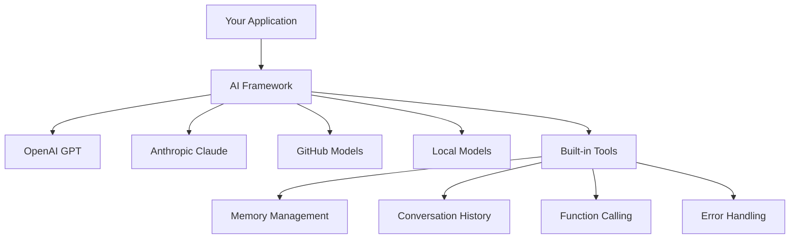
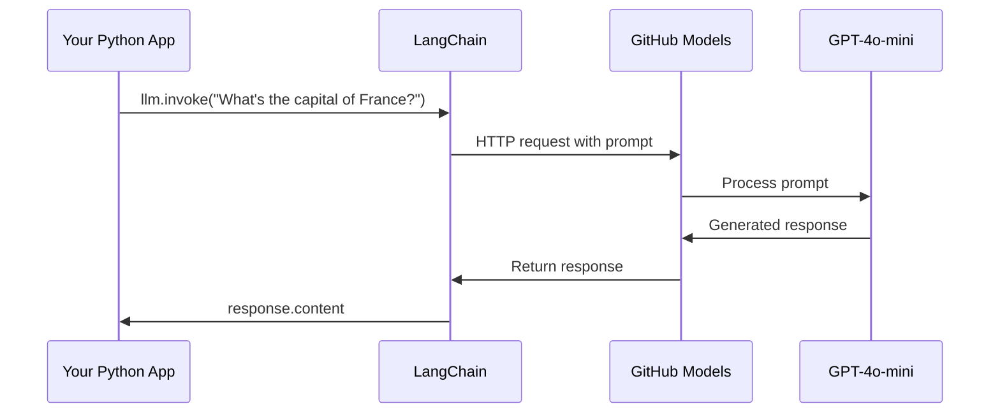
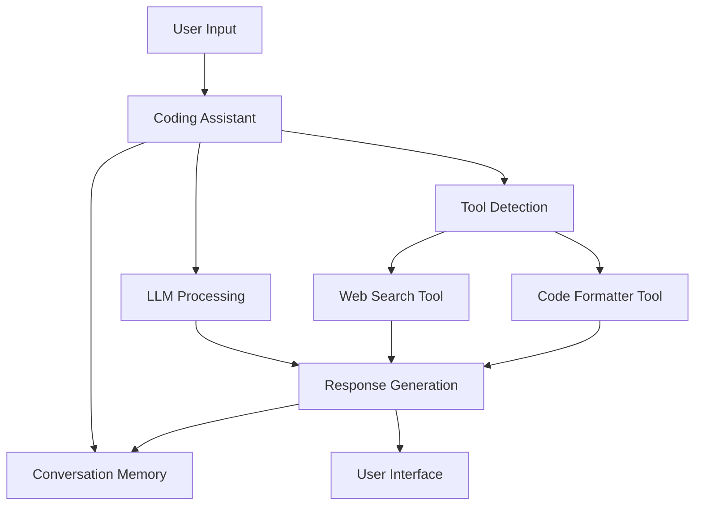
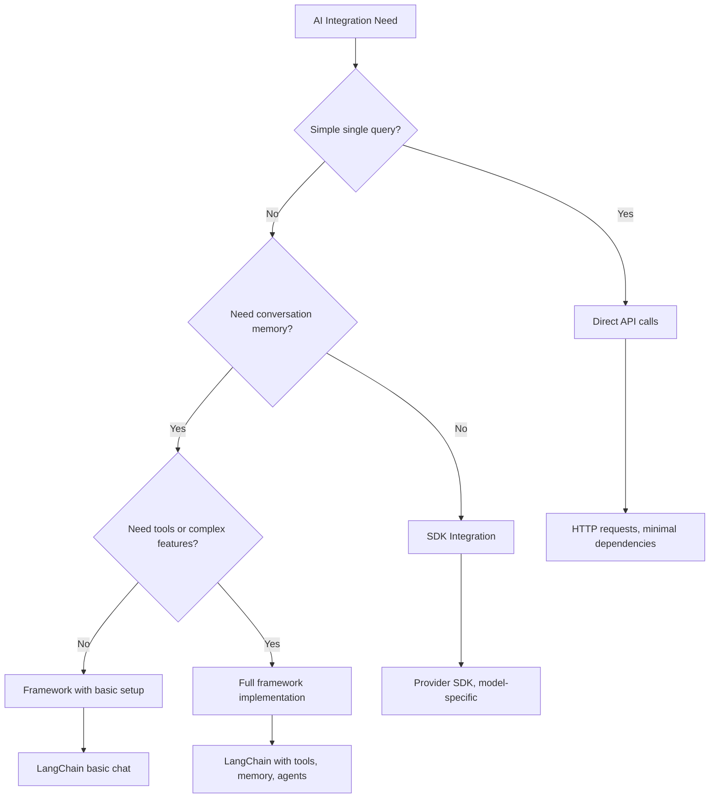

# AI Framework

Ever felt overwhelmed trying to build AI applications from scratch? You're not alone! AI frameworks are like having a Swiss Army knife for AI development - they're powerful tools that can save you time and headaches when building intelligent applications. Think of an AI framework as a well-organized library: it provides pre-built components, standardized APIs, and smart abstractions so you can focus on solving problems instead of wrestling with implementation details.

In this lesson, we'll explore how frameworks like LangChain can turn what used to be complex AI integration tasks into clean, readable code. You'll discover how to tackle real-world challenges like keeping track of conversations, implementing tool calling, and juggling different AI models through one unified interface.

By the time we're done, you'll know when to reach for frameworks instead of raw API calls, how to use their abstractions effectively, and how to build AI applications that are ready for real-world use. Let's explore what AI frameworks can do for your projects.

## Why choose a framework?

So you're ready to build an AI app - awesome! But here's the thing: you've got several different paths you can take, and each one has its own pros and cons. It's kind of like choosing between walking, biking, or driving to get somewhere - they'll all get you there, but the experience (and effort) will be totally different.

Let's break down the three main ways you can integrate AI into your projects:

| Approach | Advantages | Best For | Considerations |
|----------|------------|----------|--------------|
| **Direct HTTP Requests** | Full control, no dependencies | Simple queries, learning fundamentals | More verbose code, manual error handling |
| **SDK Integration** | Less boilerplate, model-specific optimization | Single-model applications | Limited to specific providers |
| **AI Frameworks** | Unified API, built-in abstractions | Multi-model apps, complex workflows | Learning curve, potential over-abstraction |

### Framework Benefits in Practice



**Why frameworks matter:**
- **Unifies** multiple AI providers under one interface
- **Handles** conversation memory automatically
- **Provides** ready-made tools for common tasks like embeddings and function calling
- **Manages** error handling and retry logic
- **Turns** complex workflows into readable method calls

> 💡 **Pro Tip**: Use frameworks when switching between different AI models or building complex features like agents, memory, or tool calling. Stick with direct APIs when learning the basics or building simple, focused applications.

**Bottom line**: Like choosing between a craftsman's specialized tools and a complete workshop, it's about matching the tool to the task. Frameworks excel for complex, feature-rich applications, while direct APIs work well for straightforward use cases.

## Introduction

In this lesson, we'll learn to:

- Use a common AI framework.
- Address common problems like chat conversations, tool usage, memory and context.
- Leverage this to build AI apps.

## Your first AI prompt

Let's start with the fundamentals by creating your first AI application that sends a question and gets an answer back. Like Archimedes discovering the principle of displacement in his bath, sometimes the simplest observations lead to the most powerful insights - and frameworks make these insights accessible.

### Setting up LangChain with GitHub Models

We're going to use LangChain to connect to GitHub Models, which is pretty sweet because it gives you free access to various AI models. The best part? You only need a few simple configuration parameters to get started:

```python
from langchain_openai import ChatOpenAI
import os

llm = ChatOpenAI(
    api_key=os.environ["GITHUB_TOKEN"],
    base_url="https://models.github.ai/inference",
    model="openai/gpt-4o-mini",
)

# Send a simple prompt
response = llm.invoke("What's the capital of France?")
print(response.content)
```

**Let's break down what's happening here:**
- **Creates** a LangChain client using the `ChatOpenAI` class - this is your gateway to AI!
- **Configures** the connection to GitHub Models with your authentication token
- **Specifies** which AI model to use (`gpt-4o-mini`) - think of this as choosing your AI assistant
- **Sends** your question using the `invoke()` method - this is where the magic happens
- **Extracts** and displays the response - and voilà, you're chatting with AI!

> 🔧 **Setup Note**: If you're using GitHub Codespaces, you're in luck - the `GITHUB_TOKEN` is already set up for you! Working locally? No worries, you'll just need to create a personal access token with the right permissions.

**Expected output:**
```text
The capital of France is Paris.
```



## Building conversational AI

That first example demonstrates the basics, but it's just a single exchange - you ask a question, get an answer, and that's it. In real applications, you want your AI to remember what you've been discussing, like how Watson and Holmes built their investigative conversations over time.

This is where LangChain becomes particularly useful. It provides different message types that help structure conversations and let you give your AI a personality. You'll be building chat experiences that maintain context and character.

### Understanding message types

Think of these message types as different "hats" that participants wear in a conversation. LangChain uses different message classes to keep track of who's saying what:

| Message Type | Purpose | Example Use Case |
|--------------|---------|------------------|
| `SystemMessage` | Defines AI personality and behavior | "You are a helpful coding assistant" |
| `HumanMessage` | Represents user input | "Explain how functions work" |
| `AIMessage` | Stores AI responses | Previous AI responses in conversation |

### Creating your first conversation

Let's create a conversation where our AI assumes a specific role. We'll have it embody Captain Picard - a character known for his diplomatic wisdom and leadership:

```python
messages = [
    SystemMessage(content="You are Captain Picard of the Starship Enterprise"),
    HumanMessage(content="Tell me about you"),
]
```

**Breaking down this conversation setup:**
- **Establishes** the AI's role and personality through `SystemMessage`
- **Provides** the initial user query via `HumanMessage`
- **Creates** a foundation for multi-turn conversation

The full code for this example looks like so:

```python
from langchain_core.messages import HumanMessage, SystemMessage
from langchain_openai import ChatOpenAI
import os

llm = ChatOpenAI(
    api_key=os.environ["GITHUB_TOKEN"],
    base_url="https://models.github.ai/inference",
    model="openai/gpt-4o-mini",
)

messages = [
    SystemMessage(content="You are Captain Picard of the Starship Enterprise"),
    HumanMessage(content="Tell me about you"),
]


# works
response  = llm.invoke(messages)
print(response.content)
```

You should see an outcome similar to:

```text
I am Captain Jean-Luc Picard, the commanding officer of the USS Enterprise (NCC-1701-D), a starship in the United Federation of Planets. My primary mission is to explore new worlds, seek out new life and new civilizations, and boldly go where no one has gone before. 

I believe in the importance of diplomacy, reason, and the pursuit of knowledge. My crew is diverse and skilled, and we often face challenges that test our resolve, ethics, and ingenuity. Throughout my career, I have encountered numerous species, grappled with complex moral dilemmas, and have consistently sought peaceful solutions to conflicts.

I hold the ideals of the Federation close to my heart, believing in the importance of cooperation, understanding, and respect for all sentient beings. My experiences have shaped my leadership style, and I strive to be a thoughtful and just captain. How may I assist you further?
```

To maintain conversation continuity (instead of resetting context each time), you need to keep adding responses to your message list. Like the oral traditions that preserved stories across generations, this approach builds lasting memory:

```python
from langchain_core.messages import HumanMessage, SystemMessage
from langchain_openai import ChatOpenAI
import os

llm = ChatOpenAI(
    api_key=os.environ["GITHUB_TOKEN"],
    base_url="https://models.github.ai/inference",
    model="openai/gpt-4o-mini",
)

messages = [
    SystemMessage(content="You are Captain Picard of the Starship Enterprise"),
    HumanMessage(content="Tell me about you"),
]


# works
response  = llm.invoke(messages)

print(response.content)

print("---- Next ----")

messages.append(response)
messages.append(HumanMessage(content="Now that I know about you, I'm Chris, can I be in your crew?"))

response  = llm.invoke(messages)

print(response.content)

```

Pretty neat, right? What's happening here is that we're calling the LLM twice - first with just our initial two messages, but then again with the full conversation history. It's like the AI is actually following along with our chat!

When you run this code, you'll get a second response that sounds something like:

```text
Welcome aboard, Chris! It's always a pleasure to meet those who share a passion for exploration and discovery. While I cannot formally offer you a position on the Enterprise right now, I encourage you to pursue your aspirations. We are always in need of talented individuals with diverse skills and backgrounds. 

If you are interested in space exploration, consider education and training in the sciences, engineering, or diplomacy. The values of curiosity, resilience, and teamwork are crucial in Starfleet. Should you ever find yourself on a starship, remember to uphold the principles of the Federation: peace, understanding, and respect for all beings. Your journey can lead you to remarkable adventures, whether in the stars or on the ground. Engage!
```

I'll take that as a maybe ;)

## Streaming responses

Ever notice how ChatGPT seems to "type" its responses in real-time? That's streaming in action. Like watching a skilled calligrapher work - seeing the characters appear stroke by stroke rather than materializing instantly - streaming makes the interaction feel more natural and provides immediate feedback.

### Implementing streaming with LangChain

```python
from langchain_openai import ChatOpenAI
import os

llm = ChatOpenAI(
    api_key=os.environ["GITHUB_TOKEN"],
    base_url="https://models.github.ai/inference",
    model="openai/gpt-4o-mini",
    streaming=True
)

# Stream the response
for chunk in llm.stream("Write a short story about a robot learning to code"):
    print(chunk.content, end="", flush=True)
```

**Why streaming is awesome:**
- **Shows** content as it's being created - no more awkward waiting!
- **Makes** users feel like something's actually happening
- **Feels** faster, even when it technically isn't
- **Lets** users start reading while the AI is still "thinking"

> 💡 **User Experience Tip**: Streaming really shines when you're dealing with longer responses like code explanations, creative writing, or detailed tutorials. Your users will love seeing progress instead of staring at a blank screen!

## Prompt templates

Prompt templates work like the rhetorical structures used in classical oratory - think of how Cicero would adapt his speech patterns for different audiences while maintaining the same persuasive framework. They let you create reusable prompts where you can swap out different pieces of information without rewriting everything from scratch. Once you set up the template, you just fill in the variables with whatever values you need.

### Creating reusable prompts

```python
from langchain_core.prompts import ChatPromptTemplate

# Define a template for code explanations
template = ChatPromptTemplate.from_messages([
    ("system", "You are an expert programming instructor. Explain concepts clearly with examples."),
    ("human", "Explain {concept} in {language} with a practical example for {skill_level} developers")
])

# Use the template with different values
questions = [
    {"concept": "functions", "language": "JavaScript", "skill_level": "beginner"},
    {"concept": "classes", "language": "Python", "skill_level": "intermediate"},
    {"concept": "async/await", "language": "JavaScript", "skill_level": "advanced"}
]

for question in questions:
    prompt = template.format_messages(**question)
    response = llm.invoke(prompt)
    print(f"Topic: {question['concept']}\n{response.content}\n---\n")
```

**Why you'll love using templates:**
- **Keeps** your prompts consistent across your entire app
- **No more** messy string concatenation - just clean, simple variables
- **Your AI** behaves predictably because the structure stays the same
- **Updates** are a breeze - change the template once, and it's fixed everywhere

## Structured output

Ever get frustrated trying to parse AI responses that come back as unstructured text? Structured output is like teaching your AI to follow the systematic approach that Linnaeus used for biological classification - organized, predictable, and easy to work with. You can request JSON, specific data structures, or any format you need.

### Defining output schemas

```python
from langchain_core.prompts import ChatPromptTemplate
from langchain_core.output_parsers import JsonOutputParser
from pydantic import BaseModel, Field

class CodeReview(BaseModel):
    score: int = Field(description="Code quality score from 1-10")
    strengths: list[str] = Field(description="List of code strengths")
    improvements: list[str] = Field(description="List of suggested improvements")
    overall_feedback: str = Field(description="Summary feedback")

# Set up the parser
parser = JsonOutputParser(pydantic_object=CodeReview)

# Create prompt with format instructions
prompt = ChatPromptTemplate.from_messages([
    ("system", "You are a code reviewer. {format_instructions}"),
    ("human", "Review this code: {code}")
])

# Format the prompt with instructions
chain = prompt | llm | parser

# Get structured response
code_sample = """
def calculate_average(numbers):
    return sum(numbers) / len(numbers)
"""

result = chain.invoke({
    "code": code_sample,
    "format_instructions": parser.get_format_instructions()
})

print(f"Score: {result['score']}")
print(f"Strengths: {', '.join(result['strengths'])}")
```

**Why structured output is a game-changer:**
- **No more** guessing what format you'll get back - it's consistent every time
- **Plugs** directly into your databases and APIs without extra work
- **Catches** weird AI responses before they break your app
- **Makes** your code cleaner because you know exactly what you're working with

## Tool calling

Now we reach one of the most powerful features: tools. This is how you give your AI practical capabilities beyond conversation. Like how medieval guilds developed specialized tools for specific crafts, you can equip your AI with focused instruments. You describe what tools are available, and when someone requests something that matches, your AI can take action. 

### Using Python

Let's add some tools like so:

```python
from typing_extensions import Annotated, TypedDict

class add(TypedDict):
    """Add two integers."""

    # Annotations must have the type and can optionally include a default value and description (in that order).
    a: Annotated[int, ..., "First integer"]
    b: Annotated[int, ..., "Second integer"]

tools = [add]

functions = {
    "add": lambda a, b: a + b
}
```

So what's happening here? We're creating a blueprint for a tool called `add`. By inheriting from `TypedDict` and using those fancy `Annotated` types for `a` and `b`, we're giving the LLM a clear picture of what this tool does and what it needs. The `functions` dictionary is like our toolbox - it tells our code exactly what to do when the AI decides to use a specific tool.

Let's see how we call the LLM with this tool next:

```python
llm = ChatOpenAI(
    api_key=os.environ["GITHUB_TOKEN"],
    base_url="https://models.github.ai/inference",
    model="openai/gpt-4o-mini",
)

llm_with_tools = llm.bind_tools(tools)
```

Here we call `bind_tools` with our `tools` array and thereby the LLM `llm_with_tools` now has knowledge of this tool.

To use this new LLM, we can type the following code:

```python
query = "What is 3 + 12?"

res = llm_with_tools.invoke(query)
if(res.tool_calls):
    for tool in res.tool_calls:
        print("TOOL CALL: ", functions[tool["name"]](**tool["args"]))
print("CONTENT: ",res.content)
```

Now that we call `invoke` on this new llm, that has tools, we maybe the the property `tool_calls` populated. If so, any identified tools has a `name` and `args` property that identifies what tool should be called and with arguments. The full code looks like so:

```python
from langchain_core.messages import HumanMessage, SystemMessage
from langchain_openai import ChatOpenAI
import os
from typing_extensions import Annotated, TypedDict

class add(TypedDict):
    """Add two integers."""

    # Annotations must have the type and can optionally include a default value and description (in that order).
    a: Annotated[int, ..., "First integer"]
    b: Annotated[int, ..., "Second integer"]

tools = [add]

functions = {
    "add": lambda a, b: a + b
}

llm = ChatOpenAI(
    api_key=os.environ["GITHUB_TOKEN"],
    base_url="https://models.github.ai/inference",
    model="openai/gpt-4o-mini",
)

llm_with_tools = llm.bind_tools(tools)

query = "What is 3 + 12?"

res = llm_with_tools.invoke(query)
if(res.tool_calls):
    for tool in res.tool_calls:
        print("TOOL CALL: ", functions[tool["name"]](**tool["args"]))
print("CONTENT: ",res.content)
```

Running this code, you should see output similar to:

```text
TOOL CALL:  15
CONTENT: 
```

The AI examined "What is 3 + 12" and recognized this as a task for the `add` tool. Like how a skilled librarian knows which reference to consult based on the type of question asked, it made this determination from the tool's name, description, and field specifications. The result of 15 comes from our `functions` dictionary executing the tool:

```python
print("TOOL CALL: ", functions[tool["name"]](**tool["args"]))
```

### A more interesting tool that calls a web API

Adding numbers demonstrates the concept, but real tools typically perform more complex operations, like calling web APIs. Let's expand our example to have the AI fetch content from the internet - similar to how telegraph operators once connected distant locations:

```python
class joke(TypedDict):
    """Tell a joke."""

    # Annotations must have the type and can optionally include a default value and description (in that order).
    category: Annotated[str, ..., "The joke category"]

def get_joke(category: str) -> str:
    response = requests.get(f"https://api.chucknorris.io/jokes/random?category={category}", headers={"Accept": "application/json"})
    if response.status_code == 200:
        return response.json().get("value", f"Here's a {category} joke!")
    return f"Here's a {category} joke!"

functions = {
    "add": lambda a, b: a + b,
    "joke": lambda category: get_joke(category)
}

query = "Tell me a joke about animals"

# the rest of the code is the same
```

Now if you run this code you will get a response saying something like:

```text
TOOL CALL:  Chuck Norris once rode a nine foot grizzly bear through an automatic car wash, instead of taking a shower.
CONTENT:  
```

Here's the code in its entirety:

```python
from langchain_openai import ChatOpenAI
import requests
import os
from typing_extensions import Annotated, TypedDict

class add(TypedDict):
    """Add two integers."""

    # Annotations must have the type and can optionally include a default value and description (in that order).
    a: Annotated[int, ..., "First integer"]
    b: Annotated[int, ..., "Second integer"]

class joke(TypedDict):
    """Tell a joke."""

    # Annotations must have the type and can optionally include a default value and description (in that order).
    category: Annotated[str, ..., "The joke category"]

tools = [add, joke]

def get_joke(category: str) -> str:
    response = requests.get(f"https://api.chucknorris.io/jokes/random?category={category}", headers={"Accept": "application/json"})
    if response.status_code == 200:
        return response.json().get("value", f"Here's a {category} joke!")
    return f"Here's a {category} joke!"

functions = {
    "add": lambda a, b: a + b,
    "joke": lambda category: get_joke(category)
}

llm = ChatOpenAI(
    api_key=os.environ["GITHUB_TOKEN"],
    base_url="https://models.github.ai/inference",
    model="openai/gpt-4o-mini",
)

llm_with_tools = llm.bind_tools(tools)

query = "Tell me a joke about animals"

res = llm_with_tools.invoke(query)
if(res.tool_calls):
    for tool in res.tool_calls:
        # print("TOOL CALL: ", tool)
        print("TOOL CALL: ", functions[tool["name"]](**tool["args"]))
print("CONTENT: ",res.content)
```

## Embeddings and document processing

Embeddings represent one of the most elegant solutions in modern AI. Imagine if you could take any piece of text and convert it into numerical coordinates that capture its meaning. That's exactly what embeddings do - they transform text into points in multi-dimensional space where similar concepts cluster together. It's like having a coordinate system for ideas, reminiscent of how Mendeleev organized the periodic table by atomic properties.

### Creating and using embeddings

```python
from langchain_openai import OpenAIEmbeddings
from langchain_community.vectorstores import FAISS
from langchain_community.document_loaders import TextLoader
from langchain.text_splitter import CharacterTextSplitter

# Initialize embeddings
embeddings = OpenAIEmbeddings(
    api_key=os.environ["GITHUB_TOKEN"],
    base_url="https://models.github.ai/inference",
    model="text-embedding-3-small"
)

# Load and split documents
loader = TextLoader("documentation.txt")
documents = loader.load()

text_splitter = CharacterTextSplitter(chunk_size=1000, chunk_overlap=0)
texts = text_splitter.split_documents(documents)

# Create vector store
vectorstore = FAISS.from_documents(texts, embeddings)

# Perform similarity search
query = "How do I handle user authentication?"
similar_docs = vectorstore.similarity_search(query, k=3)

for doc in similar_docs:
    print(f"Relevant content: {doc.page_content[:200]}...")
```

### Document loaders for various formats

```python
from langchain_community.document_loaders import (
    PyPDFLoader,
    CSVLoader,
    JSONLoader,
    WebBaseLoader
)

# Load different document types
pdf_loader = PyPDFLoader("manual.pdf")
csv_loader = CSVLoader("data.csv")
json_loader = JSONLoader("config.json")
web_loader = WebBaseLoader("https://example.com/docs")

# Process all documents
all_documents = []
for loader in [pdf_loader, csv_loader, json_loader, web_loader]:
    docs = loader.load()
    all_documents.extend(docs)
```

**What you can do with embeddings:**
- **Build** search that actually understands what you mean, not just keyword matching
- **Create** AI that can answer questions about your documents
- **Make** recommendation systems that suggest truly relevant content
- **Automatically** organize and categorize your content

## Building a complete AI application

Now we'll integrate everything you've learned into a comprehensive application - a coding assistant that can answer questions, use tools, and maintain conversation memory. Like how the printing press combined existing technologies (movable type, ink, paper, and pressure) into something transformative, we'll combine our AI components into something practical and useful.

### Complete application example

```python
from langchain_openai import ChatOpenAI, OpenAIEmbeddings
from langchain_core.prompts import ChatPromptTemplate
from langchain_core.messages import HumanMessage, SystemMessage, AIMessage
from langchain_community.vectorstores import FAISS
from typing_extensions import Annotated, TypedDict
import os
import requests

class CodingAssistant:
    def __init__(self):
        self.llm = ChatOpenAI(
            api_key=os.environ["GITHUB_TOKEN"],
            base_url="https://models.github.ai/inference",
            model="openai/gpt-4o-mini"
        )
        
        self.conversation_history = [
            SystemMessage(content="""You are an expert coding assistant. 
            Help users learn programming concepts, debug code, and write better software.
            Use tools when needed and maintain a helpful, encouraging tone.""")
        ]
        
        # Define tools
        self.setup_tools()
    
    def setup_tools(self):
        class web_search(TypedDict):
            """Search for programming documentation or examples."""
            query: Annotated[str, "Search query for programming help"]
        
        class code_formatter(TypedDict):
            """Format and validate code snippets."""
            code: Annotated[str, "Code to format"]
            language: Annotated[str, "Programming language"]
        
        self.tools = [web_search, code_formatter]
        self.llm_with_tools = self.llm.bind_tools(self.tools)
    
    def chat(self, user_input: str):
        # Add user message to conversation
        self.conversation_history.append(HumanMessage(content=user_input))
        
        # Get AI response
        response = self.llm_with_tools.invoke(self.conversation_history)
        
        # Handle tool calls if any
        if response.tool_calls:
            for tool_call in response.tool_calls:
                tool_result = self.execute_tool(tool_call)
                print(f"🔧 Tool used: {tool_call['name']}")
                print(f"📊 Result: {tool_result}")
        
        # Add AI response to conversation
        self.conversation_history.append(response)
        
        return response.content
    
    def execute_tool(self, tool_call):
        tool_name = tool_call['name']
        args = tool_call['args']
        
        if tool_name == 'web_search':
            return f"Found documentation for: {args['query']}"
        elif tool_name == 'code_formatter':
            return f"Formatted {args['language']} code: {args['code'][:50]}..."
        
        return "Tool execution completed"

# Usage example
assistant = CodingAssistant()

print("🤖 Coding Assistant Ready! Type 'quit' to exit.\n")

while True:
    user_input = input("You: ")
    if user_input.lower() == 'quit':
        break
    
    response = assistant.chat(user_input)
    print(f"🤖 Assistant: {response}\n")
```

**Application architecture:**



**Key features we've implemented:**
- **Remembers** your entire conversation for context continuity
- **Performs actions** through tool calling, not just conversation
- **Follows** predictable interaction patterns
- **Manages** error handling and complex workflows automatically

## Assignment: Build your own AI-powered study assistant

**Objective**: Create an AI application that helps students learn programming concepts by providing explanations, code examples, and interactive quizzes.

### Requirements

**Core Features (Required):**
1. **Conversational Interface**: Implement a chat system that maintains context across multiple questions
2. **Educational Tools**: Create at least two tools that help with learning:
   - Code explanation tool
   - Concept quiz generator
3. **Personalized Learning**: Use system messages to adapt responses to different skill levels
4. **Response Formatting**: Implement structured output for quiz questions

### Implementation Steps

**Step 1: Setup your environment**
```bash
pip install langchain langchain-openai
```

**Step 2: Basic chat functionality**
- Create a `StudyAssistant` class
- Implement conversation memory
- Add personality configuration for educational support

**Step 3: Add educational tools**
- **Code Explainer**: Breaks down code into understandable parts
- **Quiz Generator**: Creates questions about programming concepts
- **Progress Tracker**: Keeps track of topics covered

**Step 4: Enhanced features (Optional)**
- Implement streaming responses for better user experience
- Add document loading to incorporate course materials
- Create embeddings for similarity-based content retrieval

### Evaluation Criteria

| Feature | Excellent (4) | Good (3) | Satisfactory (2) | Needs Work (1) |
|---------|---------------|----------|------------------|----------------|
| **Conversation Flow** | Natural, context-aware responses | Good context retention | Basic conversation | No memory between exchanges |
| **Tool Integration** | Multiple useful tools working seamlessly | 2+ tools implemented correctly | 1-2 basic tools | Tools not functional |
| **Code Quality** | Clean, well-documented, error handling | Good structure, some documentation | Basic functionality works | Poor structure, no error handling |
| **Educational Value** | Truly helpful for learning, adaptive | Good learning support | Basic explanations | Limited educational benefit |

### Sample code structure

```python
class StudyAssistant:
    def __init__(self, skill_level="beginner"):
        # Initialize LLM, tools, and conversation memory
        pass
    
    def explain_code(self, code, language):
        # Tool: Explain how code works
        pass
    
    def generate_quiz(self, topic, difficulty):
        # Tool: Create practice questions
        pass
    
    def chat(self, user_input):
        # Main conversation interface
        pass

# Example usage
assistant = StudyAssistant(skill_level="intermediate")
response = assistant.chat("Explain how Python functions work")
```

**Bonus Challenges:**
- Add voice input/output capabilities
- Implement a web interface using Streamlit or Flask
- Create a knowledge base from course materials using embeddings
- Add progress tracking and personalized learning paths

## Summary

🎉 You've now mastered the fundamentals of AI framework development and learned how to build sophisticated AI applications using LangChain. Like completing a comprehensive apprenticeship, you've acquired a substantial toolkit of skills. Let's review what you've accomplished.

### What you've learned

**Core Framework Concepts:**
- **Framework Benefits**: Understanding when to choose frameworks over direct API calls
- **LangChain Basics**: Setting up and configuring AI model connections
- **Message Types**: Using `SystemMessage`, `HumanMessage`, and `AIMessage` for structured conversations

**Advanced Features:**
- **Tool Calling**: Creating and integrating custom tools for enhanced AI capabilities
- **Conversation Memory**: Maintaining context across multiple conversation turns
- **Streaming Responses**: Implementing real-time response delivery
- **Prompt Templates**: Building reusable, dynamic prompts
- **Structured Output**: Ensuring consistent, parseable AI responses
- **Embeddings**: Creating semantic search and document processing capabilities

**Practical Applications:**
- **Building Complete Apps**: Combining multiple features into production-ready applications
- **Error Handling**: Implementing robust error management and validation
- **Tool Integration**: Creating custom tools that extend AI capabilities

### Key takeaways

> 🎯 **Remember**: AI frameworks like LangChain are basically your complexity-hiding, feature-packed best friends. They're perfect when you need conversation memory, tool calling, or want to work with multiple AI models without losing your sanity.

**Decision framework for AI integration:**



### Where do you go from here?

**Start building right now:**
- Take these concepts and build something that excites YOU!
- Play around with different AI models through LangChain - it's like having a playground of AI models
- Create tools that solve actual problems you face in your work or projects

**Ready for the next level?**
- **AI Agents**: Build AI systems that can actually plan and execute complex tasks on their own
- **RAG (Retrieval-Augmented Generation)**: Combine AI with your own knowledge bases for super-powered applications
- **Multi-Modal AI**: Work with text, images, and audio all together - the possibilities are endless!
- **Production Deployment**: Learn how to scale your AI apps and monitor them in the real world

**Join the community:**
- The LangChain community is fantastic for staying up-to-date and learning best practices
- GitHub Models gives you access to cutting-edge AI capabilities - perfect for experimenting
- Keep practicing with different use cases - each project will teach you something new

You now have the knowledge to build intelligent, conversational applications that can help people solve real problems. Like the Renaissance craftsmen who combined artistic vision with technical skill, you can now merge AI capabilities with practical application. The question is: what will you create? 🚀

## GitHub Copilot Agent Challenge 🚀

Use the Agent mode to complete the following challenge:

**Description:** Build an advanced AI-powered code review assistant that combines multiple LangChain features including tool calling, structured output, and conversation memory to provide comprehensive feedback on code submissions.

**Prompt:** Create a CodeReviewAssistant class that implements:
1. A tool for analyzing code complexity and suggesting improvements
2. A tool for checking code against best practices
3. Structured output using Pydantic models for consistent review format
4. Conversation memory to track review sessions
5. A main chat interface that can handle code submissions and provide detailed, actionable feedback

The assistant should be able to review code in multiple programming languages, maintain context across multiple code submissions in a session, and provide both summary scores and detailed improvement suggestions.

Learn more about [agent mode](https://code.visualstudio.com/blogs/2025/02/24/introducing-copilot-agent-mode) here.
