# JavaScript Basics: Data Types


> Sketchnote by [Tomomi Imura](https://twitter.com/girlie_mac)

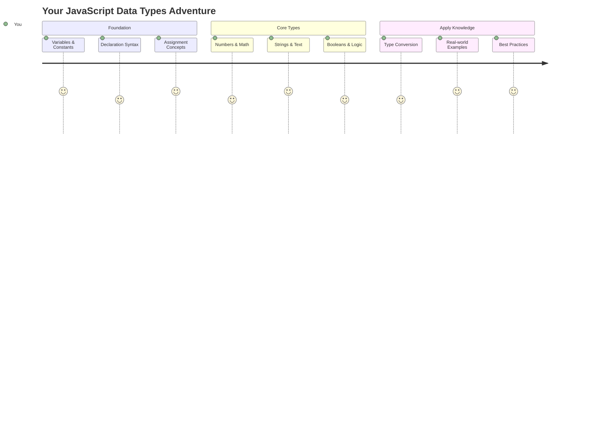

Data types are one of the fundamental concepts in JavaScript that you'll encounter in every program you write. Think of data types like the filing system used by ancient librarians in Alexandria – they had specific places for scrolls containing poetry, mathematics, and historical records. JavaScript organizes information in a similar way with different categories for different kinds of data.

In this lesson, we'll explore the core data types that make JavaScript work. You'll learn how to handle numbers, text, true/false values, and understand why choosing the correct type is essential for your programs. These concepts might seem abstract at first, but with practice, they'll become second nature.

Understanding data types will make everything else in JavaScript much clearer. Just as architects need to understand different building materials before constructing a cathedral, these fundamentals will support everything you build going forward.

## Pre-Lecture Quiz
[Pre-lecture quiz](https://ff-quizzes.netlify.app/web/)

This lesson covers the basics of JavaScript, the language that provides interactivity on the web.

> You can take this lesson on [Microsoft Learn](https://docs.microsoft.com/learn/modules/web-development-101-variables/?WT.mc_id=academic-77807-sagibbon)!

[](https://youtube.com/watch?v=JNIXfGiDWM8 "Variables in JavaScript")

[](https://youtube.com/watch?v=AWfA95eLdq8 "Data Types in JavaScript")

> 🎥 Click the images above for videos about variables and data types

Let's start with variables and the data types that populate them!

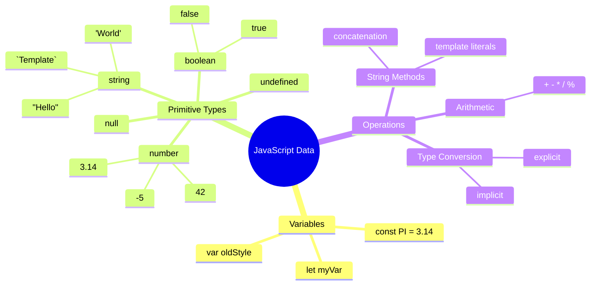

## Variables

Variables are fundamental building blocks in programming. Like the labeled jars that medieval alchemists used to store different substances, variables let you store information and give it a descriptive name so you can reference it later. Need to remember someone's age? Store it in a variable called `age`. Want to track a user's name? Keep it in a variable called `userName`.

We'll focus on the modern approach to creating variables in JavaScript. The techniques you'll learn here represent years of language evolution and best practices developed by the programming community.

Creating and **declaring** a variable has the following syntax **[keyword] [name]**. It's made up of the two parts:

- **Keyword**. Use `let` for variables that can change, or `const` for values that stay the same.
- **The variable name**, this is a descriptive name you choose yourself.

✅ The keyword `let` was introduced in ES6 and gives your variable a so called _block scope_. It's recommended that you use `let` or `const` instead of the older `var` keyword. We will cover block scopes more in depth in future parts.

### Task - working with variables

1. **Declare a variable**. Let's start by creating our first variable:

    ```javascript
    let myVariable;
    ```

   **What this accomplishes:**
   - This tells JavaScript to create a storage location called `myVariable`
   - JavaScript allocates space in memory for this variable
   - The variable currently has no value (undefined)

2. **Give it a value**. Now let's put something in our variable:

    ```javascript
    myVariable = 123;
    ```

   **How assignment works:**
   - The `=` operator assigns the value 123 to our variable
   - The variable now contains this value instead of being undefined
   - You can reference this value throughout your code using `myVariable`

   > Note: the use of `=` in this lesson means we make use of an "assignment operator", used to set a value to a variable. It doesn't denote equality.

3. **Do it the smart way**. Actually, let's combine those two steps:

    ```javascript
    let myVariable = 123;
    ```

    **This approach is more efficient:**
    - You're declaring the variable and assigning a value in one statement
    - This is the standard practice among developers
    - It reduces code length while maintaining clarity

4. **Change your mind**. What if we want to store a different number?

   ```javascript
   myVariable = 321;
   ```

   **Understanding reassignment:**
   - The variable now contains 321 instead of 123
   - The previous value is replaced – variables store only one value at a time
   - This mutability is the key characteristic of variables declared with `let`

   ✅ Try it! You can write JavaScript right in your browser. Open a browser window and navigate to Developer Tools. In the console, you will find a prompt; type `let myVariable = 123`, press return, then type `myVariable`. What happens? Note, you'll learn more about these concepts in subsequent lessons.

### 🧠 **Variables Mastery Check: Getting Comfortable**

**Let's see how you're feeling about variables:**
- Can you explain the difference between declaring and assigning a variable?
- What happens if you try to use a variable before you declare it?
- When would you choose `let` over `const` for a variable?

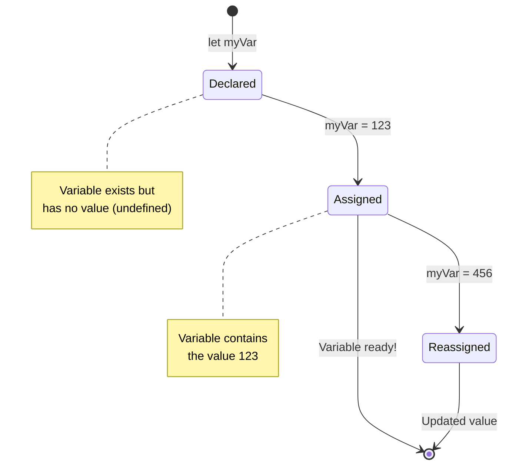

> **Quick tip**: Think of variables as labeled storage boxes. You create the box (`let`), put something in it (`=`), and can later replace the contents if needed!

## Constants

Sometimes you need to store information that should never change during program execution. Think of constants like the mathematical principles that Euclid established in ancient Greece – once proven and documented, they remained fixed for all future reference.

Constants work similarly to variables, but with an important restriction: once you assign their value, it cannot be changed. This immutability helps prevent accidental modifications to critical values in your program.

Declaration and initialization of a constant follows the same concepts as a variable, with the exception of the `const` keyword. Constants are typically declared with all uppercase letters.

```javascript
const MY_VARIABLE = 123;
```

**Here's what this code does:**
- **Creates** a constant named `MY_VARIABLE` with the value 123
- **Uses** uppercase naming convention for constants
- **Prevents** any future changes to this value

Constants have two main rules:

- **You must give them a value right away** – no empty constants allowed!
- **You can never change that value** – JavaScript will throw an error if you try. Let's see what I mean:

   **Simple value** - The following is NOT allowed:
   
      ```javascript
      const PI = 3;
      PI = 4; // not allowed
      ```

   **What you need to remember:**
   - **Attempts** to reassign a constant will cause an error
   - **Protects** important values from accidental changes
   - **Ensures** the value remains consistent throughout your program
 
   **Object reference is protected** - The following is NOT allowed:
   
      ```javascript
      const obj = { a: 3 };
      obj = { b: 5 } // not allowed
      ```

   **Understanding these concepts:**
   - **Prevents** replacing the entire object with a new one
   - **Protects** the reference to the original object
   - **Maintains** the object's identity in memory

    **Object value is not protected** - The following IS allowed:
    
      ```javascript
      const obj = { a: 3 };
      obj.a = 5;  // allowed
      ```

      **Breaking down what happens here:**
      - **Modifies** the property value inside the object
      - **Keeps** the same object reference
      - **Demonstrates** that object contents can change while the reference stays constant

   > Note, a `const` means the reference is protected from reassignment. The value is not _immutable_ though and can change, especially if it's a complex construct like an object.

## Data Types

JavaScript organizes information into different categories called data types. This concept mirrors how ancient scholars categorized knowledge – Aristotle distinguished between different types of reasoning, knowing that logical principles couldn't be applied uniformly to poetry, mathematics, and natural philosophy.

Data types matter because different operations work with different kinds of information. Just as you can't perform arithmetic on a person's name or alphabetize a mathematical equation, JavaScript requires the appropriate data type for each operation. Understanding this prevents errors and makes your code more reliable.

Variables can store many different types of values, like numbers and text. These various types of values are known as the **data type**. Data types are an important part of software development because it helps developers make decisions on how the code should be written and how the software should run. Furthermore, some data types have unique features that help transform or extract additional information in a value.

✅ Data Types are also referred to as JavaScript data primitives, as they are the lowest-level data types that are provided by the language. There are 7 primitive data types: string, number, bigint, boolean, undefined, null and symbol. Take a minute to visualize what each of these primitives might represent. What is a `zebra`? How about `0`? `true`?

### Numbers

Numbers are the most straightforward data type in JavaScript. Whether you're working with whole numbers like 42, decimals like 3.14, or negative numbers like -5, JavaScript handles them uniformly.

Remember our variable from earlier? That 123 we stored was actually a number data type:

```javascript
let myVariable = 123;
```

**Key characteristics:**
- JavaScript automatically recognizes numeric values
- You can perform mathematical operations with these variables
- No explicit type declaration is required

Variables can store all types of numbers, including decimals or negative numbers. Numbers also can be used with arithmetic operators, covered in the [next section](#arithmetic-operators).

```mermaid
flowchart LR
    A["🔢 Numbers"] --> B["➕ Addition"]
    A --> C["➖ Subtraction"]
    A --> D["✖️ Multiplication"]
    A --> E["➗ Division"]
    A --> F["📊 Remainder %"]
    
    B --> B1["1 + 2 = 3"]
    C --> C1["5 - 3 = 2"]
    D --> D1["4 * 3 = 12"]
    E --> E1["10 / 2 = 5"]
    F --> F1["7 % 3 = 1"]
    
    style A fill:#e3f2fd
    style B fill:#e8f5e8
    style C fill:#fff3e0
    style D fill:#f3e5f5
    style E fill:#e0f2f1
    style F fill:#fce4ec
```

### Arithmetic Operators

Arithmetic operators allow you to perform mathematical calculations in JavaScript. These operators follow the same principles mathematicians have used for centuries – the same symbols that appeared in the works of scholars like Al-Khwarizmi, who developed algebraic notation.

The operators work as you would expect from traditional mathematics: plus for addition, minus for subtraction, and so forth.

There are several types of operators to use when performing arithmetic functions, and some are listed here:

| Symbol | Description                                                              | Example                          |
| ------ | ------------------------------------------------------------------------ | -------------------------------- |
| `+`    | **Addition**: Calculates the sum of two numbers                          | `1 + 2 //expected answer is 3`   |
| `-`    | **Subtraction**: Calculates the difference of two numbers                | `1 - 2 //expected answer is -1`  |
| `*`    | **Multiplication**: Calculates the product of two numbers                | `1 * 2 //expected answer is 2`   |
| `/`    | **Division**: Calculates the quotient of two numbers                     | `1 / 2 //expected answer is 0.5` |
| `%`    | **Remainder**: Calculates the remainder from the division of two numbers | `1 % 2 //expected answer is 1`   |

✅ Try it! Try an arithmetic operation in your browser's console. Do the results surprise you?

### 🧮 **Math Skills Check: Calculating with Confidence**

**Test your arithmetic understanding:**
- What's the difference between `/` (division) and `%` (remainder)?
- Can you predict what `10 % 3` equals? (Hint: it's not 3.33...)
- Why might the remainder operator be useful in programming?

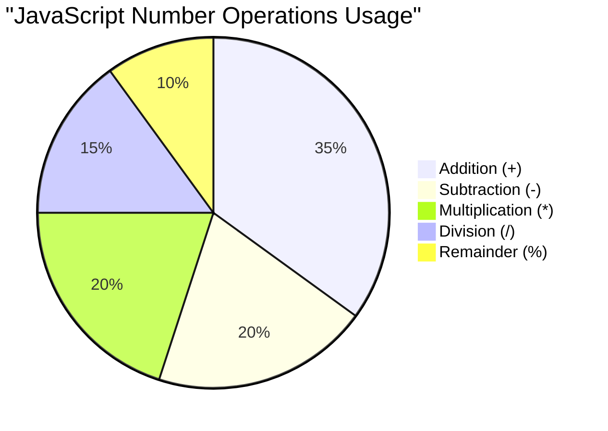

> **Real-world insight**: The remainder operator (%) is super useful for checking if numbers are even/odd, creating patterns, or cycling through arrays!

### Strings

In JavaScript, textual data is represented as strings. The term "string" comes from the concept of characters strung together in sequence, much like the way scribes in medieval monasteries would connect letters to form words and sentences in their manuscripts.

Strings are fundamental to web development. Every piece of text displayed on a website – usernames, button labels, error messages, content – is handled as string data. Understanding strings is essential for creating functional user interfaces.

Strings are sets of characters that reside between single or double quotes.

```javascript
'This is a string'
"This is also a string"
let myString = 'This is a string value stored in a variable';
```

**Understanding these concepts:**
- **Uses** either single quotes `'` or double quotes `"` to define strings
- **Stores** text data that can include letters, numbers, and symbols
- **Assigns** string values to variables for later use
- **Requires** quotes to distinguish text from variable names

Remember to use quotes when writing a string, or else JavaScript will assume it's a variable name.

```mermaid
flowchart TD
    A["📝 Strings"] --> B["Single Quotes"]
    A --> C["Double Quotes"]
    A --> D["Template Literals"]
    
    B --> B1["'Hello World'"]
    C --> C1["\"Hello World\""]
    D --> D1["`Hello \${name}`"]
    
    E["String Operations"] --> F["Concatenation"]
    E --> G["Template Insertion"]
    E --> H["Length & Methods"]
    
    F --> F1["'Hello' + ' ' + 'World'"]
    G --> G1["`Hello \${firstName} \${lastName}`"]
    H --> H1["myString.length"]
    
    style A fill:#e3f2fd
    style E fill:#fff3e0
    style D fill:#e8f5e8
    style G fill:#e8f5e8
```

### Formatting Strings

String manipulation allows you to combine text elements, incorporate variables, and create dynamic content that responds to program state. This technique enables you to construct text programmatically.

Often you need to join multiple strings together – this process is called concatenation.

To **concatenate** two or more strings, or join them together, use the `+` operator.

```javascript
let myString1 = "Hello";
let myString2 = "World";

myString1 + myString2 + "!"; //HelloWorld!
myString1 + " " + myString2 + "!"; //Hello World!
myString1 + ", " + myString2 + "!"; //Hello, World!
```

**Step by step, here's what's happening:**
- **Combines** multiple strings using the `+` operator
- **Joins** strings directly together without spaces in the first example
- **Adds** space characters `" "` between strings for readability
- **Inserts** punctuation like commas to create proper formatting

✅ Why does `1 + 1 = 2` in JavaScript, but `'1' + '1' = 11?` Think about it. What about `'1' + 1`?

**Template literals** are another way to format strings, except instead of quotes, the backtick  is used. Anything that is not plain text must be placed inside placeholders `${ }`. This includes any variables that may be strings.

```javascript
let myString1 = "Hello";
let myString2 = "World";

`${myString1} ${myString2}!` //Hello World!
`${myString1}, ${myString2}!` //Hello, World!
```

**Let's understand each part:**
- **Uses** backticks `` ` `` instead of regular quotes to create template literals
- **Embeds** variables directly using `${}` placeholder syntax
- **Preserves** spaces and formatting exactly as written
- **Provides** a cleaner way to create complex strings with variables

You can achieve your formatting goals with either method, but template literals will respect any spaces and line breaks.

✅ When would you use a template literal vs. a plain string?

### 🔤 **String Mastery Check: Text Manipulation Confidence**

**Evaluate your string skills:**
- Can you explain why `'1' + '1'` equals `'11'` instead of `2`?
- Which string method do you find more readable: concatenation or template literals?
- What happens if you forget the quotes around a string?

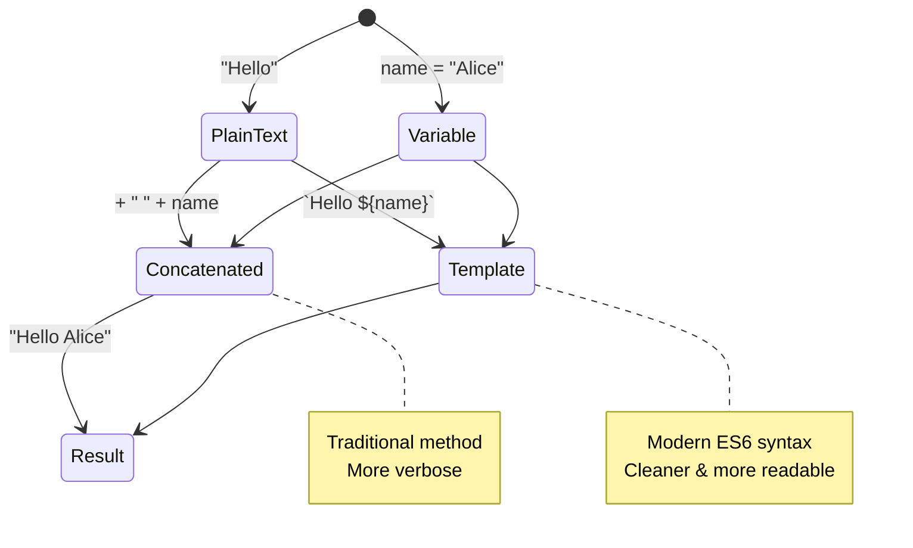

> **Pro tip**: Template literals are generally preferred for complex string building because they're more readable and handle multi-line strings beautifully!

### Booleans

Booleans represent the simplest form of data: they can only hold one of two values – `true` or `false`. This binary logic system traces back to the work of George Boole, a 19th-century mathematician who developed Boolean algebra.

Despite their simplicity, booleans are essential for program logic. They enable your code to make decisions based on conditions – whether a user is logged in, if a button was clicked, or if certain criteria are met.

Booleans can be only two values: `true` or `false`. Booleans can help make decisions on which lines of code should run when certain conditions are met. In many cases, [operators](#arithmetic-operators) assist with setting the value of a Boolean and you will often notice and write variables being initialized or their values being updated with an operator.

```javascript
let myTrueBool = true;
let myFalseBool = false;
```

**In the above, we've:**
- **Created** a variable that stores the Boolean value `true`
- **Demonstrated** how to store the Boolean value `false`
- **Used** the exact keywords `true` and `false` (no quotes needed)
- **Prepared** these variables for use in conditional statements

✅ A variable can be considered 'truthy' if it evaluates to a boolean `true`. Interestingly, in JavaScript, [all values are truthy unless defined as falsy](https://developer.mozilla.org/docs/Glossary/Truthy).

```mermaid
flowchart LR
    A["🔘 Boolean Values"] --> B["true"]
    A --> C["false"]
    
    D["Truthy Values"] --> D1["'hello'"]
    D --> D2["42"]
    D --> D3["[]"]
    D --> D4["{}"]
    
    E["Falsy Values"] --> E1["false"]
    E --> E2["0"]
    E --> E3["''"]
    E --> E4["null"]
    E --> E5["undefined"]
    E --> E6["NaN"]
    
    style B fill:#e8f5e8
    style C fill:#ffebee
    style D fill:#e3f2fd
    style E fill:#fff3e0
```

### 🎯 **Boolean Logic Check: Decision Making Skills**

**Test your boolean understanding:**
- Why do you think JavaScript has "truthy" and "falsy" values beyond just `true` and `false`?
- Can you predict which of these is falsy: `0`, `"0"`, `[]`, `"false"`?
- How might booleans be useful in controlling program flow?

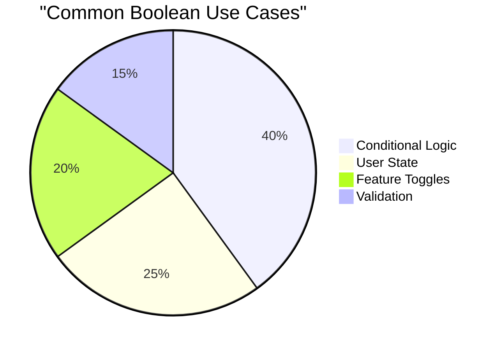

> **Remember**: In JavaScript, only 6 values are falsy: `false`, `0`, `""`, `null`, `undefined`, and `NaN`. Everything else is truthy!

---

## 📊 **Your Data Types Toolkit Summary**

```mermaid
graph TD
    A["🎯 JavaScript Data Types"] --> B["📦 Variables"]
    A --> C["🔢 Numbers"]
    A --> D["📝 Strings"]
    A --> E["🔘 Booleans"]
    
    B --> B1["let mutable"]
    B --> B2["const immutable"]
    
    C --> C1["42, 3.14, -5"]
    C --> C2["+ - * / %"]
    
    D --> D1["'quotes' or \\\"quotes\\\""]
    D --> D2["`template literals`"]
    
    E --> E1["true or false"]
    E --> E2["truthy vs falsy"]
    
    F["⚡ Key Concepts"] --> F1["Type matters for operations"]
    F --> F2["JavaScript is dynamically typed"]
    F --> F3["Variables can change types"]
    F --> F4["Naming is case-sensitive"]
    
    style A fill:#e3f2fd
    style B fill:#e8f5e8
    style C fill:#fff3e0
    style D fill:#f3e5f5
    style E fill:#e0f2f1
    style F fill:#fce4ec
```

## GitHub Copilot Agent Challenge 🚀

Use the Agent mode to complete the following challenge:

**Description:** Create a personal information manager that demonstrates all the JavaScript data types you've learned in this lesson while handling real-world data scenarios.

**Prompt:** Build a JavaScript program that creates a user profile object containing: a person's name (string), age (number), is a student status (boolean), favorite colors as an array, and an address object with street, city, and zip code properties. Include functions to display the profile information and update individual fields. Make sure to demonstrate string concatenation, template literals, arithmetic operations with the age, and boolean logic for the student status.

Learn more about [agent mode](https://code.visualstudio.com/blogs/2025/02/24/introducing-copilot-agent-mode) here.

## 🚀 Challenge

JavaScript has some behaviors that can catch developers off guard. Here's a classic example to explore: try typing this in your browser console: `let age = 1; let Age = 2; age == Age` and observe the result. It returns `false` – can you determine why?

This represents one of many JavaScript behaviors worth understanding. Familiarity with these quirks will help you write more reliable code and debug issues more effectively.

## Post-Lecture Quiz
[Post-lecture quiz](https://ff-quizzes.netlify.app)

## Review & Self Study

Take a look at [this list of JavaScript exercises](https://css-tricks.com/snippets/javascript/) and try one. What did you learn?

## Assignment

[Data Types Practice](assignment.md)

## 🚀 Your JavaScript Data Types Mastery Timeline

### ⚡ **What You Can Do in the Next 5 Minutes**
- [ ] Open your browser console and create 3 variables with different data types
- [ ] Try the challenge: `let age = 1; let Age = 2; age == Age` and figure out why it's false
- [ ] Practice string concatenation with your name and favorite number
- [ ] Test what happens when you add a number to a string

### 🎯 **What You Can Accomplish This Hour**
- [ ] Complete the post-lesson quiz and review any confusing concepts
- [ ] Create a mini calculator that adds, subtracts, multiplies, and divides two numbers
- [ ] Build a simple name formatter using template literals
- [ ] Explore the differences between `==` and `===` comparison operators
- [ ] Practice converting between different data types

### 📅 **Your Week-Long JavaScript Foundation**
- [ ] Complete the assignment with confidence and creativity
- [ ] Create a personal profile object using all data types learned
- [ ] Practice with [JavaScript exercises from CSS-Tricks](https://css-tricks.com/snippets/javascript/)
- [ ] Build a simple form validator using boolean logic
- [ ] Experiment with array and object data types (preview of coming lessons)
- [ ] Join a JavaScript community and ask questions about data types

### 🌟 **Your Month-Long Transformation**
- [ ] Integrate data type knowledge into larger programming projects
- [ ] Understand when and why to use each data type in real applications
- [ ] Help other beginners understand JavaScript fundamentals
- [ ] Build a small application that manages different types of user data
- [ ] Explore advanced data type concepts like type coercion and strict equality
- [ ] Contribute to open source JavaScript projects with documentation improvements

### 🧠 **Final Data Types Mastery Check-in**

**Celebrate your JavaScript foundation:**
- Which data type surprised you the most in terms of its behavior?
- How comfortable do you feel explaining variables vs. constants to a friend?
- What's the most interesting thing you discovered about JavaScript's type system?
- Which real-world application can you imagine building with these fundamentals?

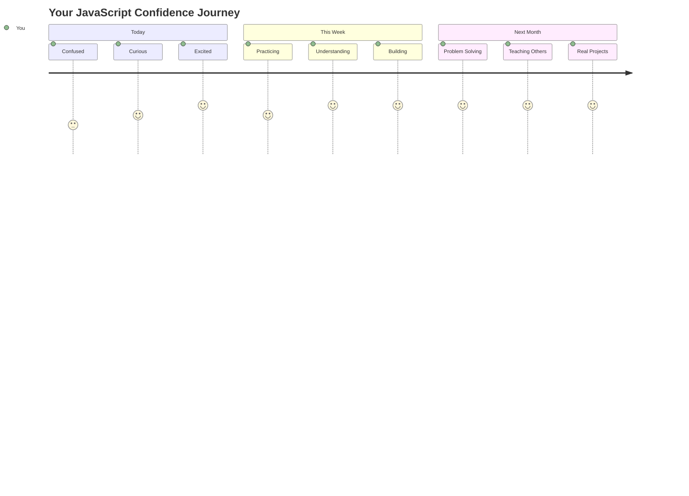

> 💡 **You've built the foundation!** Understanding data types is like learning the alphabet before writing stories. Every JavaScript program you'll ever write will use these fundamental concepts. You now have the building blocks to create interactive websites, dynamic applications, and solve real-world problems with code. Welcome to the wonderful world of JavaScript! 🎉
