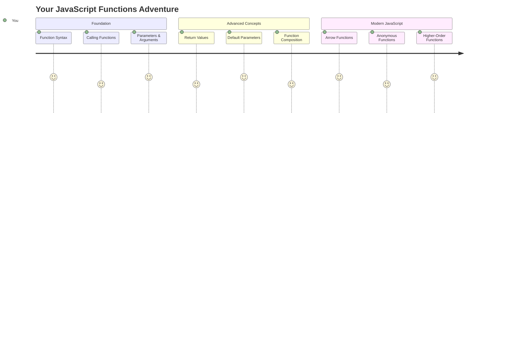
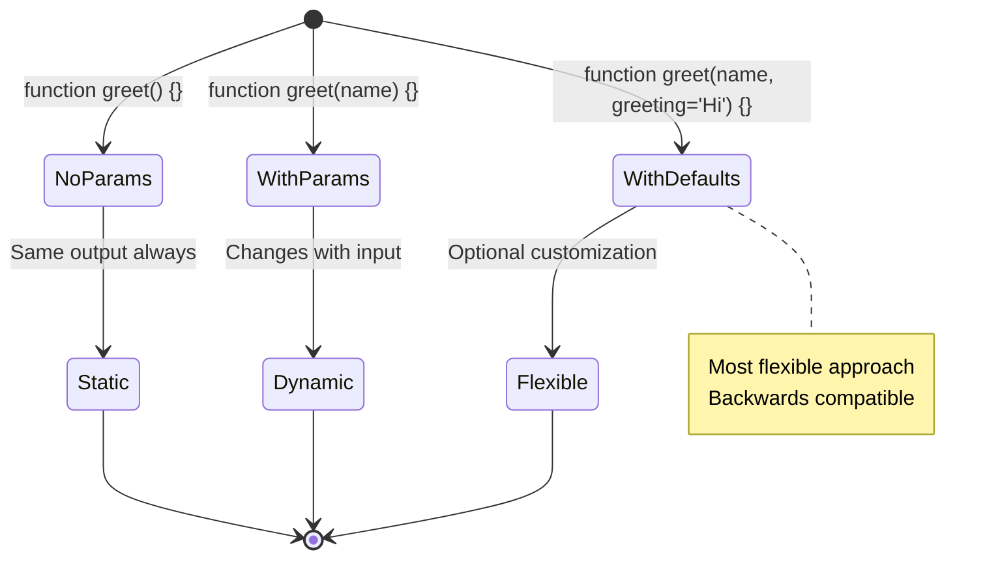
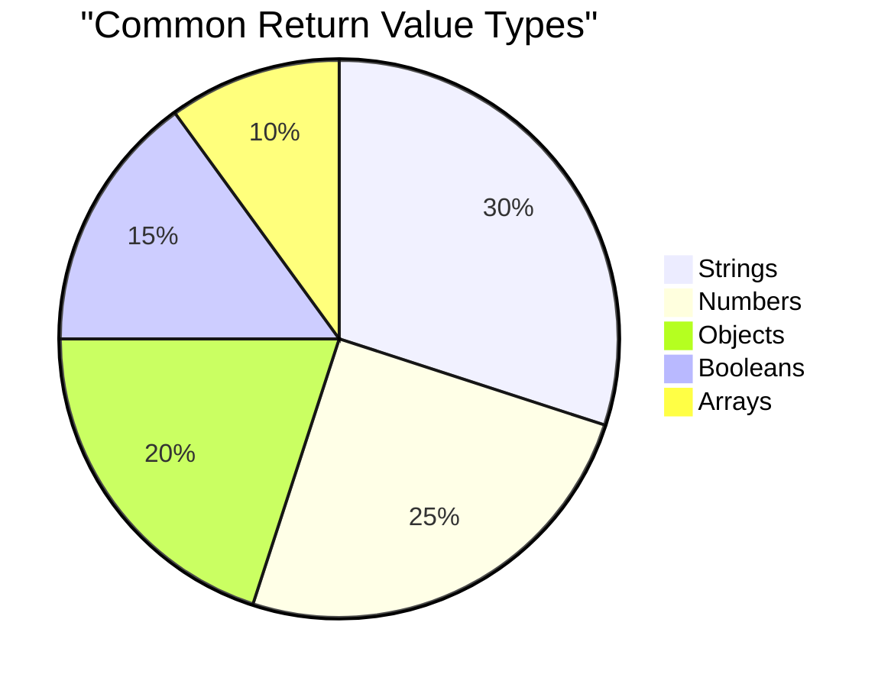
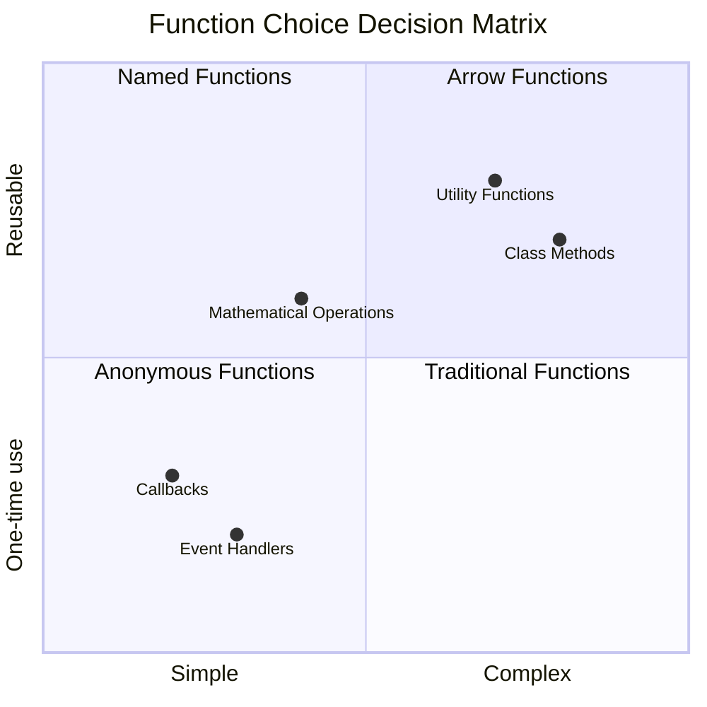
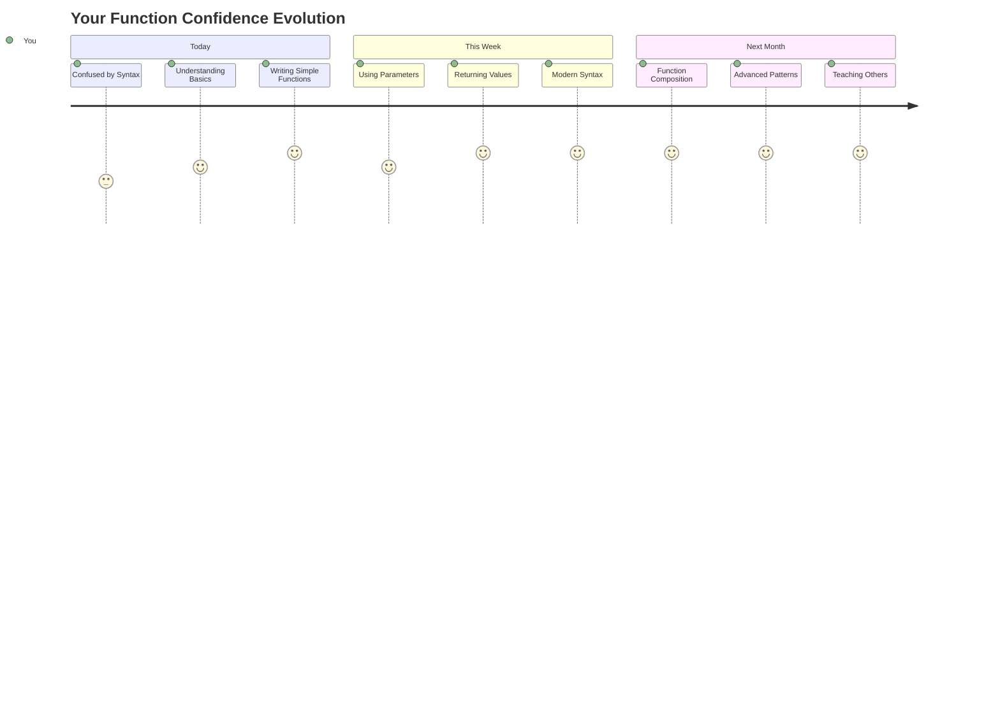

# JavaScript Basics: Methods and Functions


> Sketchnote by [Tomomi Imura](https://twitter.com/girlie_mac)



## Pre-Lecture Quiz
[Pre-lecture quiz](https://ff-quizzes.netlify.app)

Writing the same code repeatedly is one of programming's most common frustrations. Functions solve this problem by letting you package code into reusable blocks. Think of functions like the standardized parts that made Henry Ford's assembly line revolutionary – once you create a reliable component, you can use it wherever needed without rebuilding from scratch.

Functions allow you to bundle pieces of code so you can reuse them throughout your program. Instead of copying and pasting the same logic everywhere, you can create a function once and call it whenever needed. This approach keeps your code organized and makes updates much easier.

In this lesson, you'll learn how to create your own functions, pass information to them, and get useful results back. You'll discover the difference between functions and methods, learn modern syntax approaches, and see how functions can work with other functions. We'll build these concepts step by step.

[](https://youtube.com/watch?v=XgKsD6Zwvlc "Methods and Functions")

> 🎥 Click the image above for a video about methods and functions.

> You can take this lesson on [Microsoft Learn](https://docs.microsoft.com/learn/modules/web-development-101-functions/?WT.mc_id=academic-77807-sagibbon)!

```mermaid
mindmap
  root((JavaScript Functions))
    Basic Concepts
      Declaration
        function name() {}
        const name = () => {}
      Calling
        functionName()
        Parentheses required
    Parameters
      Input Values
        function(param1, param2)
        Default values
      Arguments
        Values passed in
        Can be any type
    Return Values
      Output Data
        return statement
        Exit function
      Use Results
        Store in variables
        Chain functions
    Advanced Patterns
      Higher-Order
        Functions as parameters
        Callbacks
      Anonymous
        No name needed
        Inline definition
```

## Functions

A function is a self-contained block of code that performs a specific task. It encapsulates logic that you can execute whenever needed.

Instead of writing the same code multiple times throughout your program, you can package it in a function and call that function whenever you need it. This approach keeps your code clean and makes updates much easier. Consider the maintenance challenge if you needed to change logic that was scattered across 20 different locations in your codebase.

Naming your functions descriptively is essential. A well-named function communicates its purpose clearly – when you see `cancelTimer()`, you immediately understand what it does, just as a clearly labeled button tells you exactly what will happen when you click it. 

## Creating and calling a function

Let's examine how to create a function. The syntax follows a consistent pattern:

```javascript
function nameOfFunction() { // function definition
 // function definition/body
}
```

Let's break this down:
- The `function` keyword tells JavaScript "Hey, I'm creating a function!"
- `nameOfFunction` is where you give your function a descriptive name
- The parentheses `()` are where you can add parameters (we'll get to that soon)
- The curly braces `{}` contain the actual code that runs when you call the function

Let's create a simple greeting function to see this in action:

```javascript
function displayGreeting() {
  console.log('Hello, world!');
}
```

This function prints "Hello, world!" to the console. Once you've defined it, you can use it as many times as needed.

To execute (or "call") your function, write its name followed by parentheses. JavaScript allows you to define your function before or after you call it – the JavaScript engine will handle the execution order.

```javascript
// calling our function
displayGreeting();
```

When you run this line, it executes all the code inside your `displayGreeting` function, displaying "Hello, world!" in your browser's console. You can call this function repeatedly.

### 🧠 **Function Fundamentals Check: Building Your First Functions**

**Let's see how you're feeling about basic functions:**
- Can you explain why we use curly braces `{}` in function definitions?
- What happens if you write `displayGreeting` without the parentheses?
- Why might you want to call the same function multiple times?

```mermaid
flowchart TD
    A["✏️ Define Function"] --> B["📦 Package Code"]
    B --> C["🏷️ Give it a Name"]
    C --> D["📞 Call When Needed"]
    D --> E["🔄 Reuse Anywhere"]
    
    F["💡 Benefits"] --> F1["No code repetition"]
    F --> F2["Easy to maintain"]
    F --> F3["Clear organization"]
    F --> F4["Easier testing"]
    
    style A fill:#e3f2fd
    style E fill:#e8f5e8
    style F fill:#fff3e0
```



> **Note:** You've been using **methods** throughout these lessons. `console.log()` is a method – essentially a function that belongs to the `console` object. The key difference is that methods are attached to objects, while functions stand independently. Many developers use these terms interchangeably in casual conversation.

### Function best practices

Here are a few tips to help you write great functions:

- Give your functions clear, descriptive names – your future self will thank you!
- Use **camelCasing** for multi-word names (like `calculateTotal` instead of `calculate_total`)
- Keep each function focused on doing one thing well

## Passing information to a function

Our `displayGreeting` function is limited – it can only display "Hello, world!" for everyone. Parameters allow us to make functions more flexible and useful.

**Parameters** act like placeholders where you can insert different values each time you use the function. This way, the same function can work with different information on each call.

You list parameters inside the parentheses when you define your function, separating multiple parameters with commas:

```javascript
function name(param, param2, param3) {

}
```

Each parameter acts like a placeholder – when someone calls your function, they'll provide actual values that get plugged into these spots.

Let's update our greeting function to accept someone's name:

```javascript
function displayGreeting(name) {
  const message = `Hello, ${name}!`;
  console.log(message);
}
```

Notice how we're using backticks (`` ` ``) and `${}` to insert the name directly into our message – this is called a template literal, and it's a really handy way to build strings with variables mixed in.

Now when we call our function, we can pass in any name:

```javascript
displayGreeting('Christopher');
// displays "Hello, Christopher!" when run
```

JavaScript takes the string `'Christopher'`, assigns it to the `name` parameter, and creates the personalized message "Hello, Christopher!"

```mermaid
flowchart LR
    A["🎯 Function Call"] --> B["📥 Parameters"]
    B --> C["⚙️ Function Body"]
    C --> D["📤 Result"]
    
    A1["displayGreeting('Alice')"] --> A
    B1["name = 'Alice'"] --> B
    C1["Template literal\n\`Hello, \${name}!\`"] --> C
    D1["'Hello, Alice!'"] --> D
    
    E["🔄 Parameter Types"] --> E1["Strings"]
    E --> E2["Numbers"]
    E --> E3["Booleans"]
    E --> E4["Objects"]
    E --> E5["Functions"]
    
    style A fill:#e3f2fd
    style C fill:#e8f5e8
    style D fill:#fff3e0
    style E fill:#f3e5f5
```



## Default values

What if we want to make some parameters optional? That's where default values come in handy!

Let's say we want people to be able to customize the greeting word, but if they don't specify one, we'll just use "Hello" as a fallback. You can set up default values by using the equals sign, just like setting a variable:

```javascript
function displayGreeting(name, salutation='Hello') {
  console.log(`${salutation}, ${name}`);
}
```

Here, `name` is still required, but `salutation` has a backup value of `'Hello'` if no one provides a different greeting.

Now we can call this function in two different ways:

```javascript
displayGreeting('Christopher');
// displays "Hello, Christopher"

displayGreeting('Christopher', 'Hi');
// displays "Hi, Christopher"
```

In the first call, JavaScript uses the default "Hello" since we didn't specify a salutation. In the second call, it uses our custom "Hi" instead. This flexibility makes functions adaptable to different scenarios.

### 🎛️ **Parameters Mastery Check: Making Functions Flexible**

**Test your parameter understanding:**
- What's the difference between a parameter and an argument?
- Why are default values useful in real-world programming?
- Can you predict what happens if you pass more arguments than parameters?



> **Pro tip**: Default parameters make your functions more user-friendly. Users can get started quickly with sensible defaults, but still customize when needed!

## Return values

Our functions so far have just been printing messages to the console, but what if you want a function to calculate something and give you back the result?

That's where **return values** come in. Instead of just displaying something, a function can hand you back a value that you can store in a variable or use in other parts of your code.

To send a value back, you use the `return` keyword followed by whatever you want to return:

```javascript
return myVariable;
```

Here's something important: when a function hits a `return` statement, it immediately stops running and sends that value back to whoever called it.

Let's modify our greeting function to return the message instead of printing it:

```javascript
function createGreetingMessage(name) {
  const message = `Hello, ${name}`;
  return message;
}
```

Now instead of printing the greeting, this function creates the message and hands it back to us.

To use the returned value, we can store it in a variable just like any other value:

```javascript
const greetingMessage = createGreetingMessage('Christopher');
```

Now `greetingMessage` contains "Hello, Christopher" and we can use it anywhere in our code – to display it on a webpage, include it in an email, or pass it to another function.

```mermaid
flowchart TD
    A["🔧 Function Processing"] --> B{"return statement?"}
    B -->|Yes| C["📤 Return Value"]
    B -->|No| D["📭 Return undefined"]
    
    C --> E["💾 Store in Variable"]
    C --> F["🔗 Use in Expression"]
    C --> G["📞 Pass to Function"]
    
    D --> H["⚠️ Usually not useful"]
    
    I["📋 Return Value Uses"] --> I1["Calculate results"]
    I --> I2["Validate input"]
    I --> I3["Transform data"]
    I --> I4["Create objects"]
    
    style C fill:#e8f5e8
    style D fill:#ffebee
    style I fill:#e3f2fd
```



### 🔄 **Return Values Check: Getting Results Back**

**Evaluate your return value understanding:**
- What happens to code after a `return` statement in a function?
- Why is returning values often better than just printing to console?
- Can a function return different types of values (string, number, boolean)?



> **Key insight**: Functions that return values are more versatile because the caller decides what to do with the result. This makes your code more modular and reusable!

## Functions as parameters for functions

Functions can be passed as parameters to other functions. While this concept may seem complex initially, it's a powerful feature that enables flexible programming patterns.

This pattern is super common when you want to say "when something happens, do this other thing." For example, "when the timer finishes, run this code" or "when the user clicks the button, call this function."

Let's look at `setTimeout`, which is a built-in function that waits a certain amount of time and then runs some code. We need to tell it what code to run – perfect use case for passing a function!

Try this code – after 3 seconds, you'll see a message:

```javascript
function displayDone() {
  console.log('3 seconds has elapsed');
}
// timer value is in milliseconds
setTimeout(displayDone, 3000);
```

Notice how we pass `displayDone` (without parentheses) to `setTimeout`. We're not calling the function ourselves – we're handing it over to `setTimeout` and saying "call this in 3 seconds."

### Anonymous functions

Sometimes you need a function for just one thing and don't want to give it a name. Think about it – if you're only using a function once, why clutter up your code with an extra name?

JavaScript lets you create **anonymous functions** – functions without names that you can define right where you need them.

Here's how we can rewrite our timer example using an anonymous function:

```javascript
setTimeout(function() {
  console.log('3 seconds has elapsed');
}, 3000);
```

This achieves the same result, but the function is defined directly within the `setTimeout` call, eliminating the need for a separate function declaration.

### Fat arrow functions

Modern JavaScript has an even shorter way to write functions called **arrow functions**. They use `=>` (which looks like an arrow – get it?) and are super popular with developers.

Arrow functions let you skip the `function` keyword and write more concise code.

Here's our timer example using an arrow function:

```javascript
setTimeout(() => {
  console.log('3 seconds has elapsed');
}, 3000);
```

The `()` is where parameters would go (empty in this case), then comes the arrow `=>`, and finally the function body in curly braces. This provides the same functionality with more concise syntax.

```mermaid
flowchart LR
    A["📝 Function Styles"] --> B["Traditional"]
    A --> C["Arrow"]
    A --> D["Anonymous"]
    
    B --> B1["function name() {}"]
    B --> B2["Hoisted"]
    B --> B3["Named"]
    
    C --> C1["const name = () => {}"]
    C --> C2["Concise syntax"]
    C --> C3["Modern style"]
    
    D --> D1["function() {}"]
    D --> D2["No name"]
    D --> D3["One-time use"]
    
    E["⏰ When to Use"] --> E1["Traditional: Reusable functions"]
    E --> E2["Arrow: Short callbacks"]
    E --> E3["Anonymous: Event handlers"]
    
    style A fill:#e3f2fd
    style B fill:#e8f5e8
    style C fill:#fff3e0
    style D fill:#f3e5f5
    style E fill:#e0f2f1
```



### When to use each strategy

When should you use each approach? A practical guideline: if you'll use the function multiple times, give it a name and define it separately. If it's for one specific use, consider an anonymous function. Both arrow functions and traditional syntax are valid choices, though arrow functions are prevalent in modern JavaScript codebases.

### 🎨 **Function Styles Mastery Check: Choosing the Right Syntax**

**Test your syntax understanding:**
- When might you prefer arrow functions over traditional function syntax?
- What's the main advantage of anonymous functions?
- Can you think of a situation where a named function is better than an anonymous one?



> **Modern trend**: Arrow functions are becoming the default choice for many developers because of their concise syntax, but traditional functions still have their place!

---


## 🚀 Challenge

Can you articulate in one sentence the difference between functions and methods? Give it a try!

## GitHub Copilot Agent Challenge 🚀

Use the Agent mode to complete the following challenge:

**Description:** Create a utility library of mathematical functions that demonstrates different function concepts covered in this lesson, including parameters, default values, return values, and arrow functions.

**Prompt:** Create a JavaScript file called `mathUtils.js` that contains the following functions:
1. A function `add` that takes two parameters and returns their sum
2. A function `multiply` with default parameter values (second parameter defaults to 1)
3. An arrow function `square` that takes a number and returns its square
4. A function `calculate` that accepts another function as a parameter and two numbers, then applies the function to those numbers
5. Demonstrate calling each function with appropriate test cases

Learn more about [agent mode](https://code.visualstudio.com/blogs/2025/02/24/introducing-copilot-agent-mode) here.

## Post-Lecture Quiz
[Post-lecture quiz](https://ff-quizzes.netlify.app)

## Review & Self Study

It's worth [reading up a little more on arrow functions](https://developer.mozilla.org/docs/Web/JavaScript/Reference/Functions/Arrow_functions), as they are increasingly used in code bases. Practice writing a function, and then rewriting it with this syntax.

## Assignment

[Fun with Functions](assignment.md)

---

## 🧰 **Your JavaScript Functions Toolkit Summary**

```mermaid
graph TD
    A["🎯 JavaScript Functions"] --> B["📋 Function Declaration"]
    A --> C["📥 Parameters"]
    A --> D["📤 Return Values"]
    A --> E["🎨 Modern Syntax"]
    
    B --> B1["function name() {}"]
    B --> B2["Descriptive naming"]
    B --> B3["Reusable code blocks"]
    
    C --> C1["Input data"]
    C --> C2["Default values"]
    C --> C3["Multiple parameters"]
    
    D --> D1["return statement"]
    D --> D2["Exit function"]
    D --> D3["Pass data back"]
    
    E --> E1["Arrow functions: () =>"]
    E --> E2["Anonymous functions"]
    E --> E3["Higher-order functions"]
    
    F["⚡ Key Benefits"] --> F1["Code reusability"]
    F --> F2["Better organization"]
    F --> F3["Easier testing"]
    F --> F4["Modular design"]
    
    style A fill:#e3f2fd
    style B fill:#e8f5e8
    style C fill:#fff3e0
    style D fill:#f3e5f5
    style E fill:#e0f2f1
    style F fill:#fce4ec
```



---

## 🚀 Your JavaScript Functions Mastery Timeline

### ⚡ **What You Can Do in the Next 5 Minutes**
- [ ] Write a simple function that returns your favorite number
- [ ] Create a function with two parameters that adds them together
- [ ] Try converting a traditional function to arrow function syntax
- [ ] Practice the challenge: explain the difference between functions and methods

### 🎯 **What You Can Accomplish This Hour**
- [ ] Complete the post-lesson quiz and review any confusing concepts
- [ ] Build the math utilities library from the GitHub Copilot challenge
- [ ] Create a function that uses another function as a parameter
- [ ] Practice writing functions with default parameters
- [ ] Experiment with template literals in function return values

### 📅 **Your Week-Long Function Mastery**
- [ ] Complete the "Fun with Functions" assignment with creativity
- [ ] Refactor some repetitive code you've written into reusable functions
- [ ] Build a small calculator using only functions (no global variables)
- [ ] Practice arrow functions with array methods like `map()` and `filter()`
- [ ] Create a collection of utility functions for common tasks
- [ ] Study higher-order functions and functional programming concepts

### 🌟 **Your Month-Long Transformation**
- [ ] Master advanced function concepts like closures and scope
- [ ] Build a project that heavily uses function composition
- [ ] Contribute to open source by improving function documentation
- [ ] Teach someone else about functions and different syntax styles
- [ ] Explore functional programming paradigms in JavaScript
- [ ] Create a personal library of reusable functions for future projects

### 🏆 **Final Functions Champion Check-in**

**Celebrate your function mastery:**
- What's the most useful function you've created so far?
- How has learning about functions changed the way you think about code organization?
- Which function syntax do you prefer and why?
- What real-world problem would you solve by writing a function?



> 🎉 **You've mastered one of programming's most powerful concepts!** Functions are the building blocks of larger programs. Every application you'll ever build will use functions to organize, reuse, and structure code. You now understand how to package logic into reusable components, making you a more efficient and effective programmer. Welcome to the world of modular programming! 🚀
