# JavaScript Basics: Making Decisions


> Sketchnote by [Tomomi Imura](https://twitter.com/girlie_mac)


Have you ever wondered how applications make smart decisions? Like how a navigation system chooses the fastest route, or how a thermostat decides when to turn on the heat? This is the fundamental concept of decision-making in programming.

Just as Charles Babbage's Analytical Engine was designed to follow different sequences of operations based on conditions, modern JavaScript programs need to make choices based on varying circumstances. This ability to branch and make decisions is what transforms static code into responsive, intelligent applications.

In this lesson, you'll learn how to implement conditional logic in your programs. We'll explore conditional statements, comparison operators, and logical expressions that allow your code to evaluate situations and respond appropriately.

## Pre-Lecture Quiz

[Pre-lecture quiz](https://ff-quizzes.netlify.app/web/quiz/11)

The ability to make decisions and control program flow is a fundamental aspect of programming. This section covers how to control the execution path of your JavaScript programs using Boolean values and conditional logic.

[](https://youtube.com/watch?v=SxTp8j-fMMY "Making Decisions")

> 🎥 Click the image above for a video about making decisions.

> You can take this lesson on [Microsoft Learn](https://docs.microsoft.com/learn/modules/web-development-101-if-else/?WT.mc_id=academic-77807-sagibbon)!


## A Brief Recap on Booleans

Before exploring decision-making, let's revisit Boolean values from our previous lesson. Named after mathematician George Boole, these values represent binary states – either `true` or `false`. There's no ambiguity, no middle ground.

These binary values form the foundation of all computational logic. Every decision your program makes ultimately reduces to a Boolean evaluation.

Creating Boolean variables is straightforward:

```javascript
let myTrueBool = true;
let myFalseBool = false;
```

This creates two variables with explicit Boolean values.

✅ Booleans are named after the English mathematician, philosopher and logician George Boole (1815–1864).

## Comparison Operators and Booleans

In practice, you'll rarely set Boolean values manually. Instead, you'll generate them by evaluating conditions: "Is this number greater than that one?" or "Are these values equal?"

Comparison operators enable these evaluations. They compare values and return Boolean results based on the relationship between the operands.

| Symbol | Description                                                                                                                                                   | Example            |
| ------ | ------------------------------------------------------------------------------------------------------------------------------------------------------------- | ------------------ |
| `<`    | **Less than**: Compares two values and returns the `true` Boolean data type if the value on the left side is less than the right                              | `5 < 6 // true`    |
| `<=`   | **Less than or equal to**: Compares two values and returns the `true` Boolean data type if the value on the left side is less than or equal to the right      | `5 <= 6 // true`   |
| `>`    | **Greater than**: Compares two values and returns the `true` Boolean data type if the value on the left side is larger than the right                         | `5 > 6 // false`   |
| `>=`   | **Greater than or equal to**: Compares two values and returns the `true` Boolean data type if the value on the left side is larger than or equal to the right | `5 >= 6 // false`  |
| `===`  | **Strict equality**: Compares two values and returns the `true` Boolean data type if values on the right and left are equal AND are the same data type.       | `5 === 6 // false` |
| `!==`  | **Inequality**: Compares two values and returns the opposite Boolean value of what a strict equality operator would return                                    | `5 !== 6 // true`  |

✅ Check your knowledge by writing some comparisons in your browser's console. Does any returned data surprise you?

```mermaid
flowchart LR
    A["🔢 Values"] --> B["⚖️ Comparison"]
    B --> C["✅ Boolean Result"]
    
    D["5"] --> E["< 6"]
    E --> F["true"]
    
    G["10"] --> H["=== '10'"]
    H --> I["false"]
    
    J["'hello'"] --> K["!== 'world'"]
    K --> L["true"]
    
    M["📋 Operator Types"] --> M1["Equality: === !=="]
    M --> M2["Relational: < > <= >="]
    M --> M3["Strict vs Loose"]
    
    style A fill:#e3f2fd
    style C fill:#e8f5e8
    style M fill:#fff3e0
```



### 🧠 **Comparison Mastery Check: Understanding Boolean Logic**

**Test your comparison understanding:**
- Why do you think `===` (strict equality) is generally preferred over `==` (loose equality)?
- Can you predict what `5 === '5'` returns? How about `5 == '5'`?
- What's the difference between `!==` and `!=`?


> **Pro tip**: Always use `===` and `!==` for equality checks unless you specifically need type conversion. This prevents unexpected behavior!

## If Statement

The `if` statement is like asking a question in your code. "If this condition is true, then do this thing." It's probably the most important tool you'll use for making decisions in JavaScript.

Here's how it works:

```javascript
if (condition) {
  // Condition is true. Code in this block will run.
}
```

The condition goes inside the parentheses, and if it's `true`, JavaScript runs the code inside the curly braces. If it's `false`, JavaScript just skips that whole block.

You'll often use comparison operators to create these conditions. Let's see a practical example:

```javascript
let currentMoney = 1000;
let laptopPrice = 800;

if (currentMoney >= laptopPrice) {
  // Condition is true. Code in this block will run.
  console.log("Getting a new laptop!");
}
```

Since `1000 >= 800` evaluates to `true`, the code inside the block executes, displaying "Getting a new laptop!" in the console.

```mermaid
flowchart TD
    A["🚀 Program Start"] --> B{"💰 currentMoney >= laptopPrice?"}
    B -->|true| C["🎉 'Getting a new laptop!'"]
    B -->|false| D["⏭️ Skip code block"]
    C --> E["📋 Continue program"]
    D --> E
    
    F["📊 If Statement Structure"] --> F1["if (condition) {"]
    F1 --> F2["  // code to run if true"]
    F2 --> F3["}"]
    
    style B fill:#fff3e0
    style C fill:#e8f5e8
    style D fill:#ffebee
    style F fill:#e3f2fd
```



## If..Else Statement

But what if you want your program to do something different when the condition is false? That's where `else` comes in – it's like having a backup plan.

The `else` statement gives you a way to say "if this condition isn't true, do this other thing instead."

```javascript
let currentMoney = 500;
let laptopPrice = 800;

if (currentMoney >= laptopPrice) {
  // Condition is true. Code in this block will run.
  console.log("Getting a new laptop!");
} else {
  // Condition is false. Code in this block will run.
  console.log("Can't afford a new laptop, yet!");
}
```

Now since `500 >= 800` is `false`, JavaScript skips the first block and runs the `else` block instead. You'll see "Can't afford a new laptop, yet!" in the console.

✅ Test your understanding of this code and the following code by running it in a browser console. Change the values of the currentMoney and laptopPrice variables to change the returned `console.log()`.

### 🎯 **If-Else Logic Check: Branching Paths**

**Evaluate your conditional logic understanding:**
- What happens if `currentMoney` exactly equals `laptopPrice`?
- Can you think of a real-world scenario where if-else logic would be useful?
- How might you extend this to handle multiple price ranges?

```mermaid
flowchart TD
    A["🔍 Evaluate Condition"] --> B{"Condition True?"}
    B -->|Yes| C["📤 Execute IF block"]
    B -->|No| D["📥 Execute ELSE block"]
    
    C --> E["✅ One path taken"]
    D --> E
    
    F["🌐 Real-world Examples"] --> F1["User login status"]
    F --> F2["Age verification"]
    F --> F3["Form validation"]
    F --> F4["Game state changes"]
    
    style B fill:#fff3e0
    style C fill:#e8f5e8
    style D fill:#e3f2fd
    style F fill:#f3e5f5
```



> **Key insight**: If-else ensures exactly one path is taken. This guarantees your program always has a response to any condition!

## Switch Statement

Sometimes you need to compare one value against multiple options. While you could chain several `if..else` statements, this approach becomes unwieldy. The `switch` statement provides a cleaner structure for handling multiple discrete values.

The concept resembles the mechanical switching systems used in early telephone exchanges – one input value determines which specific path the execution follows.

```javascript
switch (expression) {
  case x:
    // code block
    break;
  case y:
    // code block
    break;
  default:
    // code block
}
```

Here's how it's structured:
- JavaScript evaluates the expression once
- It looks through each `case` to find a match
- When it finds a match, it runs that code block
- The `break` tells JavaScript to stop and exit the switch
- If no cases match, it runs the `default` block (if you have one)

```javascript
// Program using switch statement for day of week
let dayNumber = 2;
let dayName;

switch (dayNumber) {
  case 1:
    dayName = "Monday";
    break;
  case 2:
    dayName = "Tuesday";
    break;
  case 3:
    dayName = "Wednesday";
    break;
  default:
    dayName = "Unknown day";
    break;
}
console.log(`Today is ${dayName}`);
```

In this example, JavaScript sees that `dayNumber` is `2`, finds the matching `case 2`, sets `dayName` to "Tuesday", and then breaks out of the switch. The result? "Today is Tuesday" gets logged to the console.

```mermaid
flowchart TD
    A["📥 switch(expression)"] --> B["🔍 Evaluate once"]
    B --> C{"Match case 1?"}
    C -->|Yes| D["📋 Execute case 1"]
    C -->|No| E{"Match case 2?"}
    E -->|Yes| F["📋 Execute case 2"]
    E -->|No| G{"Match case 3?"}
    G -->|Yes| H["📋 Execute case 3"]
    G -->|No| I["📋 Execute default"]
    
    D --> J["🛑 break"]
    F --> K["🛑 break"]
    H --> L["🛑 break"]
    
    J --> M["✅ Exit switch"]
    K --> M
    L --> M
    I --> M
    
    style A fill:#e3f2fd
    style B fill:#fff3e0
    style M fill:#e8f5e8
```



✅ Test your understanding of this code and the following code by running it in a browser console. Change the values of the variable a to change the returned `console.log()`.

### 🔄 **Switch Statement Mastery: Multiple Options**

**Test your switch understanding:**
- What happens if you forget a `break` statement?
- When would you use `switch` instead of multiple `if-else` statements?
- Why is the `default` case useful even if you think you've covered all possibilities?


> **Best practice**: Use `switch` when comparing one variable against multiple specific values. Use `if-else` for range checks or complex conditions!

## Logical Operators and Booleans

Complex decisions often require evaluating multiple conditions simultaneously. Just as Boolean algebra allows mathematicians to combine logical expressions, programming provides logical operators to connect multiple Boolean conditions.

These operators enable sophisticated conditional logic by combining simple true/false evaluations.

| Symbol | Description                                                                                     | Example                                                                 |
| ------ | ----------------------------------------------------------------------------------------------- | ----------------------------------------------------------------------- |
| `&&`   | **Logical AND**: Compares two Boolean expressions. Returns true **only** if both sides are true | `(5 > 3) && (5 < 10) // Both sides are true. Returns true` |
| `\|\|` | **Logical OR**: Compares two Boolean expressions. Returns true if at least one side is true     | `(5 > 10) \|\| (5 < 10) // One side is false, other is true. Returns true` |
| `!`    | **Logical NOT**: Returns the opposite value of a Boolean expression                             | `!(5 > 10) // 5 is not greater than 10, so "!" makes it true`         |

These operators let you combine conditions in useful ways:
- AND (`&&`) means both conditions must be true
- OR (`||`) means at least one condition must be true  
- NOT (`!`) flips true to false (and vice versa)

```mermaid
flowchart LR
    A["🔗 Logical Operators"] --> B["&& AND"]
    A --> C["|| OR"]
    A --> D["! NOT"]
    
    B --> B1["Both must be true"]
    B --> B2["true && true = true"]
    B --> B3["true && false = false"]
    
    C --> C1["At least one true"]
    C --> C2["true || false = true"]
    C --> C3["false || false = false"]
    
    D --> D1["Flips the value"]
    D --> D2["!true = false"]
    D --> D3["!false = true"]
    
    E["🌍 Real Examples"] --> E1["Age >= 18 && hasLicense"]
    E --> E2["isWeekend || isHoliday"]
    E --> E3["!isLoggedIn"]
    
    style A fill:#e3f2fd
    style B fill:#e8f5e8
    style C fill:#fff3e0
    style D fill:#f3e5f5
    style E fill:#e0f2f1
```



## Conditions and Decisions with Logical Operators

Let's see these logical operators in action with a more realistic example:

```javascript
let currentMoney = 600;
let laptopPrice = 800;
let laptopDiscountPrice = laptopPrice - (laptopPrice * 0.2); // Laptop price at 20 percent off

if (currentMoney >= laptopPrice || currentMoney >= laptopDiscountPrice) {
  // Condition is true. Code in this block will run.
  console.log("Getting a new laptop!");
} else {
  // Condition is false. Code in this block will run.
  console.log("Can't afford a new laptop, yet!");
}
```

In this example: we calculate a 20% discount price (640), then evaluate whether our available funds cover either the full price OR the discounted price. Since 600 meets the discounted price threshold of 640, the condition evaluates to true.

### 🧮 **Logical Operators Check: Combining Conditions**

**Test your logical operator understanding:**
- In the expression `A && B`, what happens if A is false? Does B even get evaluated?
- Can you think of a situation where you'd need all three operators (&&, ||, !) together?
- What's the difference between `!user.isActive` and `user.isActive !== true`?


> **Performance tip**: JavaScript uses "short-circuit evaluation" - in `A && B`, if A is false, B isn't even evaluated. Use this to your advantage!

### Negation Operator

Sometimes it's easier to think about when something is NOT true. Like instead of asking "Is the user logged in?", you might want to ask "Is the user NOT logged in?" The exclamation mark (`!`) operator flips the logic for you.

```javascript
if (!condition) {
  // runs if condition is false
} else {
  // runs if condition is true
}
```

The `!` operator is like saying "the opposite of..." – if something is `true`, `!` makes it `false`, and vice versa.

### Ternary Expressions

For simple conditional assignments, JavaScript provides the **ternary operator**. This concise syntax allows you to write a conditional expression in a single line, useful when you need to assign one of two values based on a condition.

```javascript
let variable = condition ? returnThisIfTrue : returnThisIfFalse;
```

It reads like a question: "Is this condition true? If yes, use this value. If no, use that value."

Below is a more tangible example:

```javascript
let firstNumber = 20;
let secondNumber = 10;
let biggestNumber = firstNumber > secondNumber ? firstNumber : secondNumber;
```

✅ Take a minute to read this code a few times. Do you understand how these operators are working?

Here's what this line is saying: "Is `firstNumber` greater than `secondNumber`? If yes, put `firstNumber` in `biggestNumber`. If no, put `secondNumber` in `biggestNumber`."

The ternary operator is just a shorter way to write this traditional `if..else` statement:

```javascript
let biggestNumber;
if (firstNumber > secondNumber) {
  biggestNumber = firstNumber;
} else {
  biggestNumber = secondNumber;
}
```

Both approaches produce identical results. The ternary operator offers conciseness, while the traditional if-else structure may be more readable for complex conditions.


---


## 🚀 Challenge

Create a program that is written first with logical operators, and then rewrite it using a ternary expression. What's your preferred syntax?

---

## GitHub Copilot Agent Challenge 🚀

Use the Agent mode to complete the following challenge:

**Description:** Create a comprehensive grade calculator that demonstrates multiple decision-making concepts from this lesson, including if-else statements, switch statements, logical operators, and ternary expressions.

**Prompt:** Write a JavaScript program that takes a student's numerical score (0-100) and determines their letter grade using the following criteria:
- A: 90-100
- B: 80-89  
- C: 70-79
- D: 60-69
- F: Below 60

Requirements:
1. Use an if-else statement to determine the letter grade
2. Use logical operators to check if the student passes (grade >= 60) AND has honors (grade >= 90)
3. Use a switch statement to provide specific feedback for each letter grade
4. Use a ternary operator to determine if the student is eligible for the next course (grade >= 70)
5. Include input validation to ensure the score is between 0 and 100

Test your program with various scores including edge cases like 59, 60, 89, 90, and invalid inputs.

Learn more about [agent mode](https://code.visualstudio.com/blogs/2025/02/24/introducing-copilot-agent-mode) here.


## Post-Lecture Quiz

[Post-lecture quiz](https://ff-quizzes.netlify.app/web/quiz/12)

## Review & Self Study

Read more about the many operators available to the user [on MDN](https://developer.mozilla.org/docs/Web/JavaScript/Reference/Operators).

Go through Josh Comeau's wonderful [operator lookup](https://joshwcomeau.com/operator-lookup/)!

## Assignment

[Operators](assignment.md)

---

## 🧠 **Your Decision-Making Toolkit Summary**

```mermaid
graph TD
    A["🎯 JavaScript Decisions"] --> B["🔍 Boolean Logic"]
    A --> C["📊 Conditional Statements"]
    A --> D["🔗 Logical Operators"]
    A --> E["⚡ Advanced Patterns"]
    
    B --> B1["true/false values"]
    B --> B2["Comparison operators"]
    B --> B3["Truthiness concepts"]
    
    C --> C1["if statements"]
    C --> C2["if-else chains"]
    C --> C3["switch statements"]
    
    D --> D1["&& (AND)"]
    D --> D2["|| (OR)"]
    D --> D3["! (NOT)"]
    
    E --> E1["Ternary operator"]
    E --> E2["Short-circuit evaluation"]
    E --> E3["Complex conditions"]
    
    F["💡 Key Principles"] --> F1["Clear readable conditions"]
    F --> F2["Consistent comparison style"]
    F --> F3["Proper operator precedence"]
    F --> F4["Efficient evaluation order"]
    
    style A fill:#e3f2fd
    style B fill:#e8f5e8
    style C fill:#fff3e0
    style D fill:#f3e5f5
    style E fill:#e0f2f1
    style F fill:#fce4ec
```



---

## 🚀 Your JavaScript Decision-Making Mastery Timeline

### ⚡ **What You Can Do in the Next 5 Minutes**
- [ ] Practice comparison operators in your browser console
- [ ] Write a simple if-else statement that checks your age
- [ ] Try the challenge: rewrite an if-else using a ternary operator
- [ ] Test what happens with different "truthy" and "falsy" values

### 🎯 **What You Can Accomplish This Hour**
- [ ] Complete the post-lesson quiz and review any confusing concepts
- [ ] Build the comprehensive grade calculator from the GitHub Copilot challenge
- [ ] Create a simple decision tree for a real-world scenario (like choosing what to wear)
- [ ] Practice combining multiple conditions with logical operators
- [ ] Experiment with switch statements for different use cases

### 📅 **Your Week-Long Logic Mastery**
- [ ] Complete the operators assignment with creative examples
- [ ] Build a mini quiz application using various conditional structures
- [ ] Create a form validator that checks multiple input conditions
- [ ] Practice Josh Comeau's [operator lookup](https://joshwcomeau.com/operator-lookup/) exercises
- [ ] Refactor existing code to use more appropriate conditional structures
- [ ] Study short-circuit evaluation and performance implications

### 🌟 **Your Month-Long Transformation**
- [ ] Master complex nested conditions and maintain code readability
- [ ] Build an application with sophisticated decision-making logic
- [ ] Contribute to open source by improving conditional logic in existing projects
- [ ] Teach someone else about different conditional structures and when to use each
- [ ] Explore functional programming approaches to conditional logic
- [ ] Create a personal reference guide for conditional best practices

### 🏆 **Final Decision-Making Champion Check-in**

**Celebrate your logical thinking mastery:**
- What's the most complex decision logic you've successfully implemented?
- Which conditional structure feels most natural to you and why?
- How has learning about logical operators changed your problem-solving approach?
- What real-world application would benefit from sophisticated decision-making logic?


> 🧠 **You've mastered the art of digital decision-making!** Every interactive application relies on conditional logic to respond intelligently to user actions and changing conditions. You now understand how to make your programs think, evaluate, and choose appropriate responses. This logical foundation will power every dynamic application you build! 🎉
