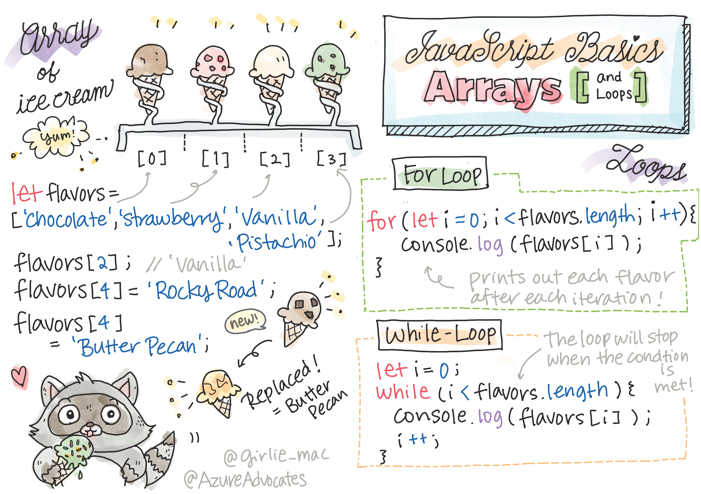

# JavaScript Basics: Arrays and Loops


> Sketchnote by [Tomomi Imura](https://twitter.com/girlie_mac)

## Pre-Lecture Quiz
[Pre-lecture quiz](https://happy-mud-02d95f10f.azurestaticapps.net/quiz/13)

This lesson covers the basics of JavaScript, the language that provides interactivity on the web. In this lesson, you'll learn about arrays and loops, which are used to manipulate data.

[](https://youtube.com/watch?v=1U4qTyq02Xw "Arrays")
[](https://www.youtube.com/watch?v=Eeh7pxtTZ3k "Loops")
> 🎥 Click the image above for a video about arrays and loops.

> You can take this lesson on [Microsoft Learn](https://docs.microsoft.com/en-us/learn/modules/web-development-101-arrays/?WT.mc_id=academic-13441-cxa)!
## Arrays

Working with data is a common task for any language, and it's a much easier task when data is organized in a structural format, such as arrays. With arrays, data is stored in a structure similar to a list. One major benefit of arrays is that you can store different types of data in one array.

✅ Arrays are all around us! Can you think of a real-life example of an array, such as a solar panel array?

The syntax for an array is a pair of square brackets.

```javascript
let myArray = [];
```

This is an empty array, but arrays can be declared already populated with data. Multiple values in an array are separated by a comma.

```javascript
let iceCreamFlavors = ["Chocolate", "Strawberry", "Vanilla", "Pistachio", "Rocky Road"];
```

The array values are assigned a unique value called the **index**, a whole number that is assigned based on its distance from the beginning of the array. In the example above, the string value "Chocolate" has an index of 0, and the index of "Rocky Road" is 4. Use the index with square brackets to retrieve, change, or insert array values.

✅ Does it surprise you that arrays start at the zero index? In some programming languages, indexes start at 1. There's an interesting history around this, which you can [read on Wikipedia](https://en.wikipedia.org/wiki/Zero-based_numbering).

```javascript
let iceCreamFlavors = ["Chocolate", "Strawberry", "Vanilla", "Pistachio", "Rocky Road"];
iceCreamFlavors[2]; //"Vanilla"
```

You can leverage the index to change a value, like this:

```javascript
iceCreamFlavors[4] = "Butter Pecan"; //Changed "Rocky Road" to "Butter Pecan"
```

And you can insert a new value at a given index like this:

```javascript
iceCreamFlavors[5] = "Cookie Dough"; //Added "Cookie Dough"
```

✅ A more common way to push values to an array is by using array operators such as array.push()

To find out how many items are in an array, use the `length` property.

```javascript
let iceCreamFlavors = ["Chocolate", "Strawberry", "Vanilla", "Pistachio", "Rocky Road"];
iceCreamFlavors.length; //5
```

✅ Try it yourself! Use your browser's console to create and manipulate an array of your own creation.

## Loops

Loops allow for repetitive or **iterative** tasks, and can save a lot of time and code. Each iteration can vary in their variables, values, and conditions. There are different types of loops in JavaScript, and they have small differences, but essentially do the same thing: loop over data.

### For Loop

The `for` loop requires 3 parts to iterate:
    - `counter` A variable that is typically initialized with a number that counts the number of iterations.
    - `condition` Expression that uses comparison operators to cause the loop to stop when `true`
    - `iteration-expression` Runs at the end of each iteration, typically used to change the counter value
  
```javascript
// Counting up to 10
for (let i = 0; i < 10; i++) {
  console.log(i);
}
```

✅ Run this code in a browser console. What happens when you make small changes to the counter, condition, or iteration expression? Can you make it run backwards, creating a countdown?

### While loop

Unlike the syntax for the `for` loop, `while` loops only require a condition that will stop the loop when `true`. Conditions in loops usually rely on other values like counters, and must be managed during the loop. Starting values for counters must be created outside the loop, and any expressions to meet a condition, including changing the counter must be maintained inside the loop.

```javascript
//Counting up to 10
let i = 0;
while (i < 10) {
 console.log(i);
 i++;
}
```

✅ Why would you choose a for loop vs. a while loop? 17K viewers had the same question on StackOverflow, and some of the opinions [might be interesting to you](https://stackoverflow.com/questions/39969145/while-loops-vs-for-loops-in-javascript).

## Loops and Arrays

Arrays are often used with loops because most conditions require the length of the array to stop the loop, and the index can also be the counter value.

```javascript
let iceCreamFlavors = ["Chocolate", "Strawberry", "Vanilla", "Pistachio", "Rocky Road"];

for (let i = 0; i < iceCreamFlavors.length; i++) {
  console.log(iceCreamFlavors[i]);
} //Ends when all flavors are printed
```

✅ Experiment with looping over an array of your own making in your browser's console. 

---

## 🚀 Challenge

There are other ways of looping over arrays other than for and while loops. There are [forEach](https://developer.mozilla.org/docs/Web/JavaScript/Reference/Global_Objects/Array/forEach), [for-of](https://developer.mozilla.org/docs/Web/JavaScript/Reference/Statements/for...of), and [map](https://developer.mozilla.org/docs/Web/JavaScript/Reference/Global_Objects/Array/map). Rewrite your array loop using one of these techniques.

## Post-Lecture Quiz
[Post-lecture quiz](https://happy-mud-02d95f10f.azurestaticapps.net/quiz/14)


## Review & Self Study

Arrays in JavaScript have many methods attached to them, extremely useful for data manipulation. [Read up on these methods](https://developer.mozilla.org/docs/Web/JavaScript/Reference/Global_Objects/Array) and try some of them out (like push, pop, slice and splice) on an array of your creation.

## Assignment

[Loop an Array](assignment.md)
