# JavaScript Basics: Arrays and Loops


> Sketchnote by [Tomomi Imura](https://twitter.com/girlie_mac)


## Pre-Lecture Quiz
[Pre-lecture quiz](https://ff-quizzes.netlify.app/web/quiz/13)

Ever wondered how websites keep track of shopping cart items or display your friend list? That's where arrays and loops come in. Arrays are like digital containers that hold multiple pieces of information, while loops let you work with all that data efficiently without repetitive code.

Together, these two concepts form the foundation for handling information in your programs. You'll learn to move from manually writing out every single step to creating smart, efficient code that can process hundreds or even thousands of items quickly.

By the end of this lesson, you'll understand how to accomplish complex data tasks with just a few lines of code. Let's explore these essential programming concepts.

[](https://youtube.com/watch?v=1U4qTyq02Xw "Arrays")

[](https://www.youtube.com/watch?v=Eeh7pxtTZ3k "Loops")

> 🎥 Click the images above for videos about arrays and loops.

> You can take this lesson on [Microsoft Learn](https://docs.microsoft.com/learn/modules/web-development-101-arrays/?WT.mc_id=academic-77807-sagibbon)!

```mermaid
mindmap
  root((Data Processing))
    Arrays
      Structure
        [ ] square brackets
        Zero-based indexing
        Dynamic sizing
      Operations
        push/pop
        shift/unshift
        indexOf/includes
      Types
        Numbers [1,2,3]
        Strings ["a","b"]
        Mixed [1,"a",true]
    Loops
      For Loops
        Counting iterations
        Array processing
        Predictable flow
      While Loops
        Condition-based
        Unknown iterations
        User input
      Modern Syntax
        for...of
        forEach
        Functional methods
    Applications
      Data Analysis
        Statistics
        Filtering
        Transformations
      User Interfaces
        Lists
        Menus
        Galleries
```

## Arrays

Think of arrays as a digital filing cabinet - instead of storing one document per drawer, you can organize multiple related items in a single, structured container. In programming terms, arrays let you store multiple pieces of information in one organized package.

Whether you're building a photo gallery, managing a to-do list, or keeping track of high scores in a game, arrays provide the foundation for data organization. Let's see how they work.

✅ Arrays are all around us! Can you think of a real-life example of an array, such as a solar panel array?

### Creating Arrays

Creating an array is super simple - just use square brackets!

```javascript
// Empty array - like an empty shopping cart waiting for items
const myArray = [];
```

**What's happening here?**
You've just created an empty container using those square brackets `[]`. Think of it like an empty library shelf - it's ready to hold whatever books you want to organize there.

You can also fill your array with initial values right from the start:

```javascript
// Your ice cream shop's flavor menu
const iceCreamFlavors = ["Chocolate", "Strawberry", "Vanilla", "Pistachio", "Rocky Road"];

// A user's profile info (mixing different types of data)
const userData = ["John", 25, true, "developer"];

// Test scores for your favorite class
const scores = [95, 87, 92, 78, 85];
```

**Cool things to notice:**
- You can store text, numbers, or even true/false values in the same array
- Just separate each item with a comma - easy!
- Arrays are perfect for keeping related information together

```mermaid
flowchart LR
    A["📦 Arrays"] --> B["Create [ ]"]
    A --> C["Store Multiple Items"]
    A --> D["Access by Index"]
    
    B --> B1["const arr = []"]
    B --> B2["const arr = [1,2,3]"]
    
    C --> C1["Numbers"]
    C --> C2["Strings"]
    C --> C3["Booleans"]
    C --> C4["Mixed Types"]
    
    D --> D1["arr[0] = first"]
    D --> D2["arr[1] = second"]
    D --> D3["arr[2] = third"]
    
    E["📊 Array Index"] --> E1["Index 0: First"]
    E --> E2["Index 1: Second"]
    E --> E3["Index 2: Third"]
    E --> E4["Index n-1: Last"]
    
    style A fill:#e3f2fd
    style B fill:#e8f5e8
    style C fill:#fff3e0
    style D fill:#f3e5f5
    style E fill:#e0f2f1
```



### Array Indexing

Here's something that might seem unusual at first: arrays number their items starting from 0, not 1. This zero-based indexing has its roots in how computer memory works - it's been a programming convention since the early days of computing languages like C. Each spot in the array gets its own address number called an **index**.

| Index | Value | Description |
|-------|-------|-------------|
| 0 | "Chocolate" | First element |
| 1 | "Strawberry" | Second element |
| 2 | "Vanilla" | Third element |
| 3 | "Pistachio" | Fourth element |
| 4 | "Rocky Road" | Fifth element |

✅ Does it surprise you that arrays start at the zero index? In some programming languages, indexes start at 1. There's an interesting history around this, which you can [read on Wikipedia](https://en.wikipedia.org/wiki/Zero-based_numbering).

**Accessing Array Elements:**

```javascript
const iceCreamFlavors = ["Chocolate", "Strawberry", "Vanilla", "Pistachio", "Rocky Road"];

// Access individual elements using bracket notation
console.log(iceCreamFlavors[0]); // "Chocolate" - first element
console.log(iceCreamFlavors[2]); // "Vanilla" - third element
console.log(iceCreamFlavors[4]); // "Rocky Road" - last element
```

**Breaking down what happens here:**
- **Uses** square bracket notation with the index number to access elements
- **Returns** the value stored at that specific position in the array
- **Starts** counting from 0, making the first element index 0

**Modifying Array Elements:**

```javascript
// Change an existing value
iceCreamFlavors[4] = "Butter Pecan";
console.log(iceCreamFlavors[4]); // "Butter Pecan"

// Add a new element at the end
iceCreamFlavors[5] = "Cookie Dough";
console.log(iceCreamFlavors[5]); // "Cookie Dough"
```

**In the above, we've:**
- **Modified** the element at index 4 from "Rocky Road" to "Butter Pecan"
- **Added** a new element "Cookie Dough" at index 5
- **Expanded** the array length automatically when adding beyond current bounds

### Array Length and Common Methods

Arrays come with built-in properties and methods that make working with data much easier.

**Finding Array Length:**

```javascript
const iceCreamFlavors = ["Chocolate", "Strawberry", "Vanilla", "Pistachio", "Rocky Road"];
console.log(iceCreamFlavors.length); // 5

// Length updates automatically as array changes
iceCreamFlavors.push("Mint Chip");
console.log(iceCreamFlavors.length); // 6
```

**Key points to remember:**
- **Returns** the total number of elements in the array
- **Updates** automatically when elements are added or removed
- **Provides** a dynamic count useful for loops and validation

**Essential Array Methods:**

```javascript
const fruits = ["apple", "banana", "orange"];

// Add elements
fruits.push("grape");           // Adds to end: ["apple", "banana", "orange", "grape"]
fruits.unshift("strawberry");   // Adds to beginning: ["strawberry", "apple", "banana", "orange", "grape"]

// Remove elements
const lastFruit = fruits.pop();        // Removes and returns "grape"
const firstFruit = fruits.shift();     // Removes and returns "strawberry"

// Find elements
const index = fruits.indexOf("banana"); // Returns 1 (position of "banana")
const hasApple = fruits.includes("apple"); // Returns true
```

**Understanding these methods:**
- **Adds** elements with `push()` (end) and `unshift()` (beginning)
- **Removes** elements with `pop()` (end) and `shift()` (beginning)
- **Locates** elements with `indexOf()` and checks existence with `includes()`
- **Returns** useful values like removed elements or position indexes

✅ Try it yourself! Use your browser's console to create and manipulate an array of your own creation.

### 🧠 **Array Fundamentals Check: Organizing Your Data**

**Test your array understanding:**
- Why do you think arrays start counting from 0 instead of 1?
- What happens if you try to access an index that doesn't exist (like `arr[100]` in a 5-element array)?
- Can you think of three real-world scenarios where arrays would be useful?


> **Real-world insight**: Arrays are everywhere in programming! Social media feeds, shopping carts, photo galleries, playlist songs - they're all arrays behind the scenes!

## Loops

Think of the famous punishment from Charles Dickens' novels where students had to write lines repeatedly on a slate. Imagine if you could simply instruct someone to "write this sentence 100 times" and have it done automatically. That's exactly what loops do for your code.

Loops are like having a tireless assistant who can repeat tasks without error. Whether you need to check every item in a shopping cart or display all the photos in an album, loops handle the repetition efficiently.

JavaScript provides several types of loops to choose from. Let's examine each one and understand when to use them.

```mermaid
flowchart TD
    A["🔄 Loop Types"] --> B["For Loop"]
    A --> C["While Loop"]
    A --> D["For...of Loop"]
    A --> E["forEach Method"]
    
    B --> B1["Known iterations"]
    B --> B2["Counter-based"]
    B --> B3["for(init; condition; increment)"]
    
    C --> C1["Unknown iterations"]
    C --> C2["Condition-based"]
    C --> C3["while(condition)"]
    
    D --> D1["Modern ES6+"]
    D --> D2["Array iteration"]
    D --> D3["for(item of array)"]
    
    E --> E1["Functional style"]
    E --> E2["Array method"]
    E --> E3["array.forEach(callback)"]
    
    F["⏰ When to Use"] --> F1["For: Counting, indexes"]
    F --> F2["While: User input, searching"]
    F --> F3["For...of: Simple iteration"]
    F --> F4["forEach: Functional programming"]
    
    style A fill:#e3f2fd
    style B fill:#e8f5e8
    style C fill:#fff3e0
    style D fill:#f3e5f5
    style E fill:#e0f2f1
    style F fill:#fce4ec
```



### For Loop

The `for` loop is like setting a timer - you know exactly how many times you want something to happen. It's super organized and predictable, which makes it perfect when you're working with arrays or need to count things.

**For Loop Structure:**

| Component | Purpose | Example |
|-----------|---------|----------|
| **Initialization** | Sets starting point | `let i = 0` |
| **Condition** | When to continue | `i < 10` |
| **Increment** | How to update | `i++` |

```javascript
// Counting from 0 to 9
for (let i = 0; i < 10; i++) {
  console.log(`Count: ${i}`);
}

// More practical example: processing scores
const testScores = [85, 92, 78, 96, 88];
for (let i = 0; i < testScores.length; i++) {
  console.log(`Student ${i + 1}: ${testScores[i]}%`);
}
```

**Step by step, here's what's happening:**
- **Initializes** the counter variable `i` to 0 at the start
- **Checks** the condition `i < 10` before each iteration
- **Executes** the code block when the condition is true
- **Increments** `i` by 1 after each iteration with `i++`
- **Stops** when the condition becomes false (when `i` reaches 10)

✅ Run this code in a browser console. What happens when you make small changes to the counter, condition, or iteration expression? Can you make it run backwards, creating a countdown?

### 🗓️ **For Loop Mastery Check: Controlled Repetition**

**Evaluate your for loop understanding:**
- What are the three parts of a for loop, and what does each one do?
- How would you loop through an array backwards?
- What happens if you forget the increment part (`i++`)?

```mermaid
flowchart TD
    A["🚀 Start For Loop"] --> B["Initialize: let i = 0"]
    B --> C{"Condition: i < array.length?"}
    C -->|true| D["Execute code block"]
    D --> E["Increment: i++"]
    E --> C
    C -->|false| F["✅ Exit loop"]
    
    G["📋 Common Patterns"] --> G1["for(let i=0; i<n; i++)"]
    G --> G2["for(let i=n-1; i>=0; i--)"]
    G --> G3["for(let i=0; i<arr.length; i+=2)"]
    
    style A fill:#e3f2fd
    style F fill:#e8f5e8
    style G fill:#fff3e0
```



> **Loop wisdom**: For loops are perfect when you know exactly how many times you need to repeat something. They're the most common choice for array processing!

### While Loop

The `while` loop is like saying "keep doing this until..." - you might not know exactly how many times it'll run, but you know when to stop. It's perfect for things like asking a user for input until they give you what you need, or searching through data until you find what you're looking for.

**While Loop Characteristics:**
- **Continues** executing as long as the condition is true
- **Requires** manual management of any counter variables
- **Checks** the condition before each iteration
- **Risks** infinite loops if the condition never becomes false

```javascript
// Basic counting example
let i = 0;
while (i < 10) {
  console.log(`While count: ${i}`);
  i++; // Don't forget to increment!
}

// More practical example: processing user input
let userInput = "";
let attempts = 0;
const maxAttempts = 3;

while (userInput !== "quit" && attempts < maxAttempts) {
  userInput = prompt(`Enter 'quit' to exit (attempt ${attempts + 1}):`);
  attempts++;
}

if (attempts >= maxAttempts) {
  console.log("Maximum attempts reached!");
}
```

**Understanding these examples:**
- **Manages** the counter variable `i` manually inside the loop body
- **Increments** the counter to prevent infinite loops
- **Demonstrates** practical use case with user input and attempt limiting
- **Includes** safety mechanisms to prevent endless execution

### ♾️ **While Loop Wisdom Check: Condition-Based Repetition**

**Test your while loop comprehension:**
- What's the main danger when using while loops?
- When would you choose a while loop over a for loop?
- How can you prevent infinite loops?

```mermaid
flowchart LR
    A["🔄 While vs For"] --> B["While Loop"]
    A --> C["For Loop"]
    
    B --> B1["Unknown iterations"]
    B --> B2["Condition-driven"]
    B --> B3["User input, searching"]
    B --> B4["⚠️ Risk: infinite loops"]
    
    C --> C1["Known iterations"]
    C --> C2["Counter-driven"]
    C --> C3["Array processing"]
    C --> C4["✅ Safe: predictable end"]
    
    D["🛡️ Safety Tips"] --> D1["Always modify condition variable"]
    D --> D2["Include escape conditions"]
    D --> D3["Set maximum iteration limits"]
    
    style A fill:#e3f2fd
    style B fill:#fff3e0
    style C fill:#e8f5e8
    style D fill:#ffebee
```



> **Safety first**: While loops are powerful but require careful condition management. Always ensure your loop condition will eventually become false!

### Modern Loop Alternatives

JavaScript offers modern loop syntax that can make your code more readable and less error-prone.

**For...of Loop (ES6+):**

```javascript
const colors = ["red", "green", "blue", "yellow"];

// Modern approach - cleaner and safer
for (const color of colors) {
  console.log(`Color: ${color}`);
}

// Compare with traditional for loop
for (let i = 0; i < colors.length; i++) {
  console.log(`Color: ${colors[i]}`);
}
```

**Key advantages of for...of:**
- **Eliminates** index management and potential off-by-one errors
- **Provides** direct access to array elements
- **Improves** code readability and reduces syntax complexity

**forEach Method:**

```javascript
const prices = [9.99, 15.50, 22.75, 8.25];

// Using forEach for functional programming style
prices.forEach((price, index) => {
  console.log(`Item ${index + 1}: $${price.toFixed(2)}`);
});

// forEach with arrow functions for simple operations
prices.forEach(price => console.log(`Price: $${price}`));
```

**What you need to know about forEach:**
- **Executes** a function for each array element
- **Provides** both element value and index as parameters
- **Cannot** be stopped early (unlike traditional loops)
- **Returns** undefined (doesn't create a new array)

✅ Why would you choose a for loop vs. a while loop? 17K viewers had the same question on StackOverflow, and some of the opinions [might be interesting to you](https://stackoverflow.com/questions/39969145/while-loops-vs-for-loops-in-javascript).

### 🎨 **Modern Loop Syntax Check: Embracing ES6+**

**Assess your modern JavaScript understanding:**
- What are the advantages of `for...of` over traditional for loops?
- When might you still prefer traditional for loops?
- What's the difference between `forEach` and `map`?


> **Modern trend**: ES6+ syntax like `for...of` and `forEach` is becoming the preferred approach for array iteration because it's cleaner and less error-prone!

## Loops and Arrays

Combining arrays with loops creates powerful data processing capabilities. This pairing is fundamental to many programming tasks, from displaying lists to calculating statistics.

**Traditional Array Processing:**

```javascript
const iceCreamFlavors = ["Chocolate", "Strawberry", "Vanilla", "Pistachio", "Rocky Road"];

// Classic for loop approach
for (let i = 0; i < iceCreamFlavors.length; i++) {
  console.log(`Flavor ${i + 1}: ${iceCreamFlavors[i]}`);
}

// Modern for...of approach
for (const flavor of iceCreamFlavors) {
  console.log(`Available flavor: ${flavor}`);
}
```

**Let's understand each approach:**
- **Uses** array length property to determine loop boundary
- **Accesses** elements by index in traditional for loops
- **Provides** direct element access in for...of loops
- **Processes** each array element exactly once

**Practical Data Processing Example:**

```javascript
const studentGrades = [85, 92, 78, 96, 88, 73, 89];
let total = 0;
let highestGrade = studentGrades[0];
let lowestGrade = studentGrades[0];

// Process all grades with a single loop
for (let i = 0; i < studentGrades.length; i++) {
  const grade = studentGrades[i];
  total += grade;
  
  if (grade > highestGrade) {
    highestGrade = grade;
  }
  
  if (grade < lowestGrade) {
    lowestGrade = grade;
  }
}

const average = total / studentGrades.length;
console.log(`Average: ${average.toFixed(1)}`);
console.log(`Highest: ${highestGrade}`);
console.log(`Lowest: ${lowestGrade}`);
```

**Here's how this code works:**
- **Initializes** tracking variables for sum and extremes
- **Processes** each grade with a single efficient loop
- **Accumulates** the total for average calculation
- **Tracks** highest and lowest values during iteration
- **Calculates** final statistics after loop completion

✅ Experiment with looping over an array of your own making in your browser's console.

```mermaid
flowchart TD
    A["📦 Array Data"] --> B["🔄 Loop Processing"]
    B --> C["📈 Results"]
    
    A1["[85, 92, 78, 96, 88]"] --> A
    
    B --> B1["Calculate total"]
    B --> B2["Find min/max"]
    B --> B3["Count conditions"]
    B --> B4["Transform data"]
    
    C --> C1["Average: 87.8"]
    C --> C2["Highest: 96"]
    C --> C3["Passing: 5/5"]
    C --> C4["Letter grades"]
    
    D["⚡ Processing Patterns"] --> D1["Accumulation (sum)"]
    D --> D2["Comparison (min/max)"]
    D --> D3["Filtering (conditions)"]
    D --> D4["Mapping (transformation)"]
    
    style A fill:#e3f2fd
    style B fill:#fff3e0
    style C fill:#e8f5e8
    style D fill:#f3e5f5
```



---

## GitHub Copilot Agent Challenge 🚀

Use the Agent mode to complete the following challenge:

**Description:** Build a comprehensive data processing function that combines arrays and loops to analyze a dataset and generate meaningful insights.

**Prompt:** Create a function called `analyzeGrades` that takes an array of student grade objects (each containing name and score properties) and returns an object with statistics including the highest score, lowest score, average score, count of students who passed (score >= 70), and an array of student names who scored above average. Use at least two different loop types in your solution.

Learn more about [agent mode](https://code.visualstudio.com/blogs/2025/02/24/introducing-copilot-agent-mode) here.

## 🚀 Challenge

JavaScript offers several modern array methods that can replace traditional loops for specific tasks. Explore [forEach](https://developer.mozilla.org/docs/Web/JavaScript/Reference/Global_Objects/Array/forEach), [for-of](https://developer.mozilla.org/docs/Web/JavaScript/Reference/Statements/for...of), [map](https://developer.mozilla.org/docs/Web/JavaScript/Reference/Global_Objects/Array/map), [filter](https://developer.mozilla.org/docs/Web/JavaScript/Reference/Global_Objects/Array/filter), and [reduce](https://developer.mozilla.org/docs/Web/JavaScript/Reference/Global_Objects/Array/reduce). 

**Your challenge:** Refactor the student grades example using at least three different array methods. Notice how much cleaner and more readable the code becomes with modern JavaScript syntax.

## Post-Lecture Quiz
[Post-lecture quiz](https://ff-quizzes.netlify.app/web/quiz/14)


## Review & Self Study

Arrays in JavaScript have many methods attached to them, that are extremely useful for data manipulation. [Read up on these methods](https://developer.mozilla.org/docs/Web/JavaScript/Reference/Global_Objects/Array) and try some of them out (like push, pop, slice and splice) on an array of your creation.

## Assignment

[Loop an Array](assignment.md)

---

## 📊 **Your Arrays & Loops Toolkit Summary**

```mermaid
graph TD
    A["🎯 Arrays & Loops Mastery"] --> B["📦 Array Fundamentals"]
    A --> C["🔄 Loop Types"]
    A --> D["🔗 Data Processing"]
    A --> E["🎨 Modern Techniques"]
    
    B --> B1["Creation: [ ]"]
    B --> B2["Indexing: arr[0]"]
    B --> B3["Methods: push, pop"]
    B --> B4["Properties: length"]
    
    C --> C1["For: Known iterations"]
    C --> C2["While: Condition-based"]
    C --> C3["For...of: Direct access"]
    C --> C4["forEach: Functional"]
    
    D --> D1["Statistics calculation"]
    D --> D2["Data transformation"]
    D --> D3["Filtering & searching"]
    D --> D4["Real-time processing"]
    
    E --> E1["Arrow functions"]
    E --> E2["Method chaining"]
    E --> E3["Destructuring"]
    E --> E4["Template literals"]
    
    F["💡 Key Benefits"] --> F1["Efficient data handling"]
    F --> F2["Reduced code repetition"]
    F --> F3["Scalable solutions"]
    F --> F4["Cleaner syntax"]
    
    style A fill:#e3f2fd
    style B fill:#e8f5e8
    style C fill:#fff3e0
    style D fill:#f3e5f5
    style E fill:#e0f2f1
    style F fill:#fce4ec
```



---

## 🚀 Your Arrays & Loops Mastery Timeline

### ⚡ **What You Can Do in the Next 5 Minutes**
- [ ] Create an array of your favorite movies and access specific elements
- [ ] Write a for loop that counts from 1 to 10
- [ ] Try the modern array methods challenge from the lesson
- [ ] Practice array indexing in your browser console

### 🎯 **What You Can Accomplish This Hour**
- [ ] Complete the post-lesson quiz and review any challenging concepts
- [ ] Build the comprehensive grade analyzer from the GitHub Copilot challenge
- [ ] Create a simple shopping cart that adds and removes items
- [ ] Practice converting between different loop types
- [ ] Experiment with array methods like `push`, `pop`, `slice`, and `splice`

### 📅 **Your Week-Long Data Processing Journey**
- [ ] Complete the "Loop an Array" assignment with creative enhancements
- [ ] Build a to-do list application using arrays and loops
- [ ] Create a simple statistics calculator for numerical data
- [ ] Practice with [MDN array methods](https://developer.mozilla.org/docs/Web/JavaScript/Reference/Global_Objects/Array)
- [ ] Build a photo gallery or music playlist interface
- [ ] Explore functional programming with `map`, `filter`, and `reduce`

### 🌟 **Your Month-Long Transformation**
- [ ] Master advanced array operations and performance optimization
- [ ] Build a complete data visualization dashboard
- [ ] Contribute to open source projects involving data processing
- [ ] Teach someone else about arrays and loops with practical examples
- [ ] Create a personal library of reusable data processing functions
- [ ] Explore algorithms and data structures built on arrays

### 🏆 **Final Data Processing Champion Check-in**

**Celebrate your array and loop mastery:**
- What's the most useful array operation you've learned for real-world applications?
- Which loop type feels most natural to you and why?
- How has understanding arrays and loops changed your approach to organizing data?
- What complex data processing task would you like to tackle next?


> 📦 **You've unlocked the power of data organization and processing!** Arrays and loops are the foundation of almost every application you'll ever build. From simple lists to complex data analysis, you now have the tools to handle information efficiently and elegantly. Every dynamic website, mobile app, and data-driven application relies on these fundamental concepts. Welcome to the world of scalable data processing! 🎉
