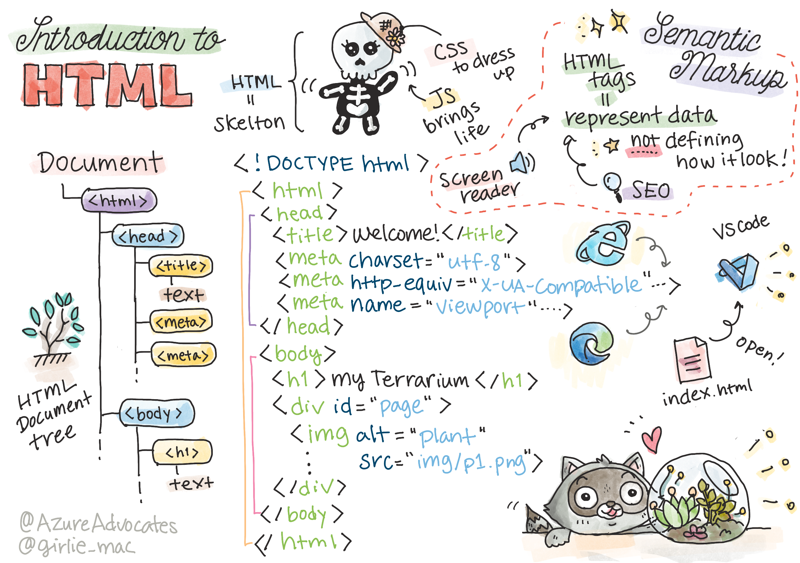

# Terrarium Project Part 1: Introduction to HTML


> Sketchnote by [Tomomi Imura](https://twitter.com/girlie_mac)

## Pre-Lecture Quiz

[Pre-lecture quiz](https://calm-wave-0d1a32b03.1.azurestaticapps.net/quiz/15)

### Introduction

HTML, or HyperText Markup Language, is the 'skeleton' of the web. If CSS 'dresses up' your HTML and JavaScript brings it to life, HTML is the body of your web application. HTML's syntax even reflects that idea, as it includes "head", "body", and "footer" tags.

In this lesson, we're going to use HTML to layout the 'skeleton' of our virtual terrarium's interface. It will have a title and three columns: a right and a left column where the draggable plants live, and a center area that will be the actual glass-looking terrarium. By the end of this lesson, you will be able to see the plants in the columns, but the interface will look a little strange; don't worry, in the next section you will add CSS styles to the interface to make it look better.

### Task

On your computer, create a folder called 'terrarium' and inside it, a file called 'index.html'. You can do this in Visual Studio Code after you create your terrarium folder by opening a new VS Code window, clicking 'open folder', and navigating to your new folder. Click the small 'file' button in the Explorer pane and create the new file:


Or

Use these commands on your git bash:
* `mkdir terrarium`
* `cd terrarium`
* `touch index.html`
* `code index.html` or `nano index.html`

> index.html files indicate to a browser that it is the default file in a folder; URLs such as `https://anysite.com/test` might be built using a folder structure including a folder called `test` with `index.html` inside it; `index.html` doesn't have to show in a URL.

---

## The DocType and html tags

The first line of an HTML file is its doctype. It's a little surprising that you need to have this line at the very top of the file, but it tells older browsers that the browser needs to render the page in a standard mode, following the current html specification.

> Tip: in VS Code, you can hover over a tag and get information about its use from the MDN Reference guides.

The second line should be the `<html>` tag's opening tag, followed right now by its closing tag `</html>`. These tags are the root elements of your interface.

### Task

Add these lines at the top of your `index.html` file:

```HTML
<!DOCTYPE html>
<html></html>
```

✅ There are a few different modes that can be determined by setting the DocType with a query string: [Quirks Mode and Standards Mode](https://developer.mozilla.org/docs/Web/HTML/Quirks_Mode_and_Standards_Mode). These modes used to support really old browsers that aren't normally used nowadays (Netscape Navigator 4 and Internet Explorer 5). You can stick to the standard doctype declaration.

---

## The document's 'head'

The 'head' area of the HTML document includes crucial information about your web page, also known as [metadata](https://developer.mozilla.org/docs/Web/HTML/Element/meta). In our case, we tell the web server to which this page will be sent to be rendered, these four things:

-   the page's title
-   page metadata including:
    -   the 'character set', telling about what character encoding is used in the page
    -   browser information, including `x-ua-compatible` which indicates that the IE=edge browser is supported
    -   information about how the viewport should behave when it is loaded. Setting the viewport to have an initial scale of 1 controls the zoom level when the page is first loaded.

### Task

Add a 'head' block to your document in between the opening and closing `<html>` tags.

```html
<head>
	<title>Welcome to my Virtual Terrarium</title>
	<meta charset="utf-8" />
	<meta http-equiv="X-UA-Compatible" content="IE=edge" />
	<meta name="viewport" content="width=device-width, initial-scale=1" />
</head>
```

✅ What would happen if you set a viewport meta tag like this: `<meta name="viewport" content="width=600">`? Read more about the [viewport](https://developer.mozilla.org/docs/Web/HTML/Viewport_meta_tag).

---

## The document's `body`

### HTML Tags

In HTML, you add tags to your .html file to create elements of a web page. Each tag usually has an opening and closing tag, like this: `<p>hello</p>` to indicate a paragraph. Create your interface's body by adding a set of `<body>` tags inside the `<html>` tag pair; your markup now looks like this:

### Task

```html
<!DOCTYPE html>
<html>
	<head>
		<title>Welcome to my Virtual Terrarium</title>
		<meta charset="utf-8" />
		<meta http-equiv="X-UA-Compatible" content="IE=edge" />
		<meta name="viewport" content="width=device-width, initial-scale=1" />
	</head>
	<body></body>
</html>
```

Now, you can start building out your page. Normally, you use `<div>` tags to create the separate elements in a page. We'll create a series of `<div>` elements which will contain images.

### Images

One html tag that doesn't need a closing tag is the `` tag, because it has a `src` element that contains all the information the page needs to render the item.

Create a folder in your app called `images` and in that, add all the images in the [source code folder](../solution/images); (there are 14 images of plants).

### Task

Add those plant images into two columns between the `<body></body>` tags:

```html
<div id="page">
	<div id="left-container" class="container">
		<div class="plant-holder">
			
		</div>
		<div class="plant-holder">
			
		</div>
		<div class="plant-holder">
			
		</div>
		<div class="plant-holder">
			
		</div>
		<div class="plant-holder">
			
		</div>
		<div class="plant-holder">
			
		</div>
		<div class="plant-holder">
			
		</div>
	</div>
	<div id="right-container" class="container">
		<div class="plant-holder">
			
		</div>
		<div class="plant-holder">
			
		</div>
		<div class="plant-holder">
			
		</div>
		<div class="plant-holder">
			
		</div>
		<div class="plant-holder">
			
		</div>
		<div class="plant-holder">
			
		</div>
		<div class="plant-holder">
			
		</div>
	</div>
</div>
```

> Note: Spans vs. Divs. Divs are considered 'block' elements, and Spans are 'inline'. What would happen if you transformed these divs to spans?

With this markup, the plants now show up on the screen. It looks pretty bad, because they aren't yet styled using CSS, and we'll do that in the next lesson.

Each image has alt text that will appear even if you can't see or render an image. This is an important attribute to include for accessibility. Learn more about accessibility in future lessons; for now, remember that the alt attribute provides alternative information for an image if a user for some reason cannot view it (because of slow connection, an error in the src attribute, or if the user uses a screen reader).

✅ Did you notice that each image has the same alt tag? Is this good practice? Why or why not? Can you improve this code?

---

## Semantic markup

In general, it's preferable to use meaningful 'semantics' when writing HTML. What does that mean? It means that you use HTML tags to represent the type of data or interaction they were designed for. For example, the main title text on a page should use an `<h1>` tag.

Add the following line right below your opening `<body>` tag:

```html
<h1>My Terrarium</h1>
```

Using semantic markup such as having headers be `<h1>` and unordered lists be rendered as `<ul>` helps screen readers navigate through a page. In general, buttons should be written as `<button>` and lists should be `<li>`. While it's _possible_ to use specially styled `<span>` elements with click handlers to mock buttons, it's better for disabled users to use technologies to determine where on a page a button resides, and to interact with it, if the element appears as a button. For this reason, try to use semantic markup as much as possible.

✅ Take a look at a screen reader and [how it interacts with a web page](https://www.youtube.com/watch?v=OUDV1gqs9GA). Can you see why having non semantic markup might frustrate the user?

## The terrarium

The last part of this interface involves creating markup that will be styled to create a terrarium.

### Task:

Add this markup above the last `</div>` tag:

```html
<div id="terrarium">
	<div class="jar-top"></div>
	<div class="jar-walls">
		<div class="jar-glossy-long"></div>
		<div class="jar-glossy-short"></div>
	</div>
	<div class="dirt"></div>
	<div class="jar-bottom"></div>
</div>
```

✅ Even though you added this markup to the screen, you see absolutely nothing render. Why?

---

## 🚀Challenge

There are some wild 'older' tags in HTML that are still fun to play with, though you shouldn't use deprecated tags such as [these tags](https://developer.mozilla.org/docs/Web/HTML/Element#Obsolete_and_deprecated_elements) in your markup. Still, can you use the old `<marquee>` tag to make the h1 title scroll horizontally? (if you do, don't forget to remove it afterwards)

## Post-Lecture Quiz

[Post-lecture quiz](https://calm-wave-0d1a32b03.1.azurestaticapps.net/quiz/16)

## Review & Self Study

HTML is the 'tried and true' building block system that has helped build the web into what it is today. Learn a little about its history by studying some old and new tags. Can you figure out why some tags were deprecated and some added? What tags might be introduced in the future?

Learn more about building sites for the web and mobile devices at [Microsoft Learn](https://docs.microsoft.com/learn/modules/build-simple-website/?WT.mc_id=academic-13441-cxa).


## Assignment

[Practice your HTML: Build a blog mockup](assignment.md)
