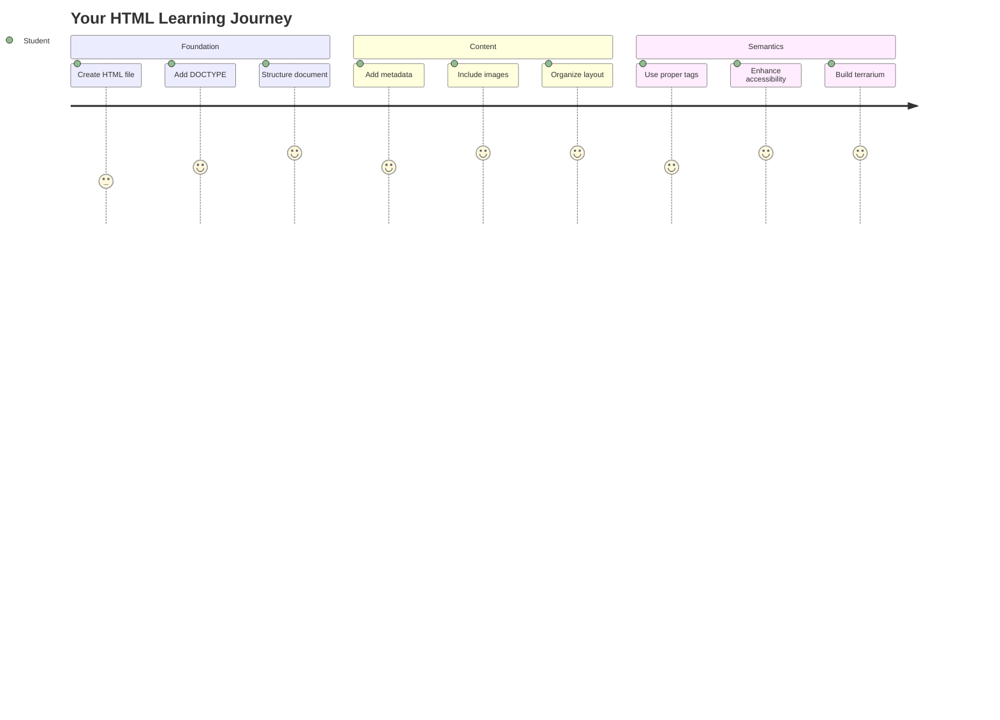
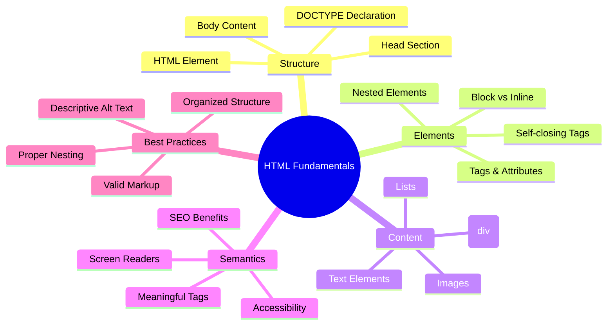
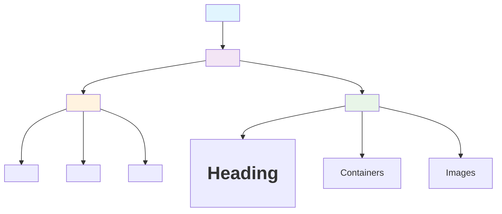
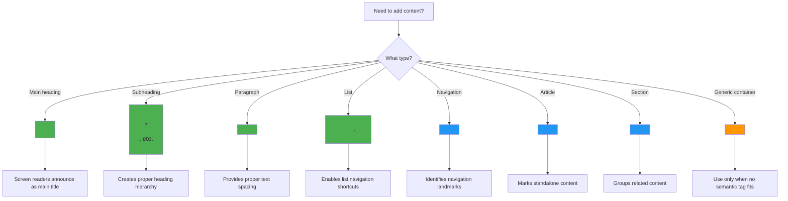
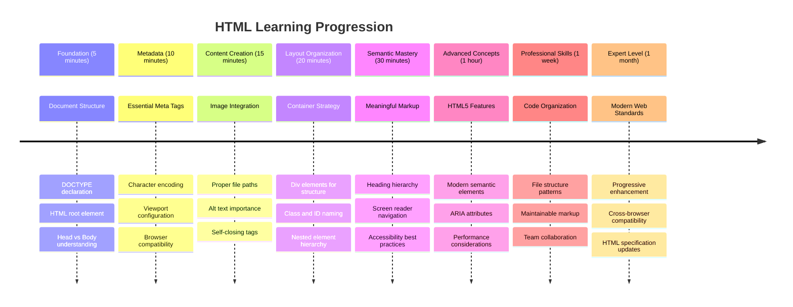

# Terrarium Project Part 1: Introduction to HTML




> Sketchnote by [Tomomi Imura](https://twitter.com/girlie_mac)

HTML, or HyperText Markup Language, is the foundation of every website you've ever visited. Think of HTML as the skeleton that gives structure to web pages – it defines where content goes, how it's organized, and what each piece represents. While CSS will later "dress up" your HTML with colors and layouts, and JavaScript will bring it to life with interactivity, HTML provides the essential structure that makes everything else possible.

In this lesson, you'll create the HTML structure for a virtual terrarium interface. This hands-on project will teach you fundamental HTML concepts while building something visually engaging. You'll learn how to organize content using semantic elements, work with images, and create the foundation for an interactive web application.

By the end of this lesson, you'll have a working HTML page displaying plant images in organized columns, ready for styling in the next lesson. Don't worry if it looks basic at first – that's exactly what HTML should do before CSS adds the visual polish.



## Pre-Lecture Quiz

[Pre-lecture quiz](https://ff-quizzes.netlify.app/web/quiz/15)

> 📺 **Watch and Learn**: Check out this helpful video overview
> 
> [](https://www.youtube.com/watch?v=1TvxJKBzhyQ)

## Setting Up Your Project

Before we dive into HTML code, let's set up a proper workspace for your terrarium project. Creating an organized file structure from the beginning is a crucial habit that will serve you well throughout your web development journey.

### Task: Create Your Project Structure

You'll create a dedicated folder for your terrarium project and add your first HTML file. Here are two approaches you can use:

**Option 1: Using Visual Studio Code**
1. Open Visual Studio Code
2. Click "File" → "Open Folder" or use `Ctrl+K, Ctrl+O` (Windows/Linux) or `Cmd+K, Cmd+O` (Mac)
3. Create a new folder called `terrarium` and select it
4. In the Explorer pane, click the "New File" icon
5. Name your file `index.html`


**Option 2: Using Terminal Commands**
```bash
mkdir terrarium
cd terrarium
touch index.html
code index.html
```

**Here's what these commands accomplish:**
- **Creates** a new directory called `terrarium` for your project
- **Navigates** into the terrarium directory 
- **Creates** an empty `index.html` file
- **Opens** the file in Visual Studio Code for editing

> 💡 **Pro Tip**: The filename `index.html` is special in web development. When someone visits a website, browsers automatically look for `index.html` as the default page to display. This means a URL like `https://mysite.com/projects/` will automatically serve the `index.html` file from the `projects` folder without needing to specify the filename in the URL.

## Understanding HTML Document Structure

Every HTML document follows a specific structure that browsers need to understand and display correctly. Think of this structure like a formal letter – it has required elements in a particular order that help the recipient (in this case, the browser) process the content properly.



Let's start by adding the essential foundation that every HTML document needs.

### The DOCTYPE Declaration and Root Element

The first two lines of any HTML file serve as the document's "introduction" to the browser:

```html
<!DOCTYPE html>
<html></html>
```

**Understanding what this code does:**
- **Declares** the document type as HTML5 using `<!DOCTYPE html>`
- **Creates** the root `<html>` element that will contain all page content
- **Establishes** modern web standards for proper browser rendering
- **Ensures** consistent display across different browsers and devices

> 💡 **VS Code Tip**: Hover over any HTML tag in VS Code to see helpful information from MDN Web Docs, including usage examples and browser compatibility details.

> 📚 **Learn More**: The DOCTYPE declaration prevents browsers from entering "quirks mode," which was used to support very old websites. Modern web development uses the simple `<!DOCTYPE html>` declaration to ensure [standards-compliant rendering](https://developer.mozilla.org/docs/Web/HTML/Quirks_Mode_and_Standards_Mode).

### 🔄 **Pedagogical Check-in**
**Pause and Reflect**: Before continuing, make sure you understand:
- ✅ Why every HTML document needs a DOCTYPE declaration
- ✅ What the `<html>` root element contains
- ✅ How this structure helps browsers render pages correctly

**Quick Self-Test**: Can you explain in your own words what "standards-compliant rendering" means?

## Adding Essential Document Metadata

The `<head>` section of an HTML document contains crucial information that browsers and search engines need, but that visitors don't see directly on the page. Think of it as the "behind-the-scenes" information that helps your webpage work properly and appear correctly across different devices and platforms.

This metadata tells browsers how to display your page, what character encoding to use, and how to handle different screen sizes – all essential for creating professional, accessible web pages.

### Task: Add the Document Head

Insert this `<head>` section between your opening and closing `<html>` tags:

```html
<head>
	<title>Welcome to my Virtual Terrarium</title>
	<meta charset="utf-8" />
	<meta http-equiv="X-UA-Compatible" content="IE=edge" />
	<meta name="viewport" content="width=device-width, initial-scale=1" />
</head>
```

**Breaking down what each element accomplishes:**
- **Sets** the page title that appears in browser tabs and search results
- **Specifies** UTF-8 character encoding for proper text display worldwide
- **Ensures** compatibility with modern versions of Internet Explorer
- **Configures** responsive design by setting the viewport to match device width
- **Controls** initial zoom level to display content at natural size

> 🤔 **Think About This**: What would happen if you set a viewport meta tag like this: `<meta name="viewport" content="width=600">`? This would force the page to always be 600 pixels wide, breaking responsive design! Learn more about [proper viewport configuration](https://developer.mozilla.org/docs/Web/HTML/Viewport_meta_tag).

## Building the Document Body

The `<body>` element contains all the visible content of your webpage – everything users will see and interact with. While the `<head>` section provided instructions to the browser, the `<body>` section contains the actual content: text, images, buttons, and other elements that create your user interface.

Let's add the body structure and understand how HTML tags work together to create meaningful content.

### Understanding HTML Tag Structure

HTML uses paired tags to define elements. Most tags have an opening tag like `<p>` and a closing tag like `</p>`, with content in between: `<p>Hello, world!</p>`. This creates a paragraph element containing the text "Hello, world!".

### Task: Add the Body Element

Update your HTML file to include the `<body>` element:

```html
<!DOCTYPE html>
<html>
	<head>
		<title>Welcome to my Virtual Terrarium</title>
		<meta charset="utf-8" />
		<meta http-equiv="X-UA-Compatible" content="IE=edge" />
		<meta name="viewport" content="width=device-width, initial-scale=1" />
	</head>
	<body></body>
</html>
```

**Here's what this complete structure provides:**
- **Establishes** the basic HTML5 document framework
- **Includes** essential metadata for proper browser rendering
- **Creates** an empty body ready for your visible content
- **Follows** modern web development best practices

Now you're ready to add the visible elements of your terrarium. We'll use `<div>` elements as containers to organize different sections of content, and `` elements to display the plant images.

### Working with Images and Layout Containers

Images are special in HTML because they use "self-closing" tags. Unlike elements like `<p></p>` that wrap around content, the `` tag contains all the information it needs within the tag itself using attributes like `src` for the image file path and `alt` for accessibility.

Before adding images to your HTML, you'll need to organize your project files properly by creating an images folder and adding the plant graphics.

**First, set up your images:**
1. Create a folder called `images` inside your terrarium project folder
2. Download the plant images from the [solution folder](../solution/images) (14 plant images total)
3. Copy all plant images into your new `images` folder

### Task: Create the Plant Display Layout

Now add the plant images organized in two columns between your `<body></body>` tags:

```html
<div id="page">
	<div id="left-container" class="container">
		<div class="plant-holder">
			
		</div>
		<div class="plant-holder">
			
		</div>
		<div class="plant-holder">
			
		</div>
		<div class="plant-holder">
			
		</div>
		<div class="plant-holder">
			
		</div>
		<div class="plant-holder">
			
		</div>
		<div class="plant-holder">
			
		</div>
	</div>
	<div id="right-container" class="container">
		<div class="plant-holder">
			
		</div>
		<div class="plant-holder">
			
		</div>
		<div class="plant-holder">
			
		</div>
		<div class="plant-holder">
			
		</div>
		<div class="plant-holder">
			
		</div>
		<div class="plant-holder">
			
		</div>
		<div class="plant-holder">
			
		</div>
	</div>
</div>
```

**Step by step, here's what's happening in this code:**
- **Creates** a main page container with `id="page"` to hold all content
- **Establishes** two column containers: `left-container` and `right-container`
- **Organizes** 7 plants in the left column and 7 plants in the right column
- **Wraps** each plant image in a `plant-holder` div for individual positioning
- **Applies** consistent class names for CSS styling in the next lesson
- **Assigns** unique IDs to each plant image for JavaScript interaction later
- **Includes** proper file paths pointing to the images folder

> 🤔 **Consider This**: Notice that all images currently have the same alt text "plant". This isn't ideal for accessibility. Screen reader users would hear "plant" repeated 14 times without knowing which specific plant each image shows. Can you think of better, more descriptive alt text for each image?

> 📝 **HTML Element Types**: `<div>` elements are "block-level" and take up full width, while `<span>` elements are "inline" and only take up necessary width. What do you think would happen if you changed all these `<div>` tags to `<span>` tags?

### 🔄 **Pedagogical Check-in**
**Structure Understanding**: Take a moment to review your HTML structure:
- ✅ Can you identify the main containers in your layout?
- ✅ Do you understand why each image has a unique ID?
- ✅ How would you describe the purpose of the `plant-holder` divs?

**Visual Inspection**: Open your HTML file in a browser. You should see:
- A basic list of plant images
- Images organized in two columns
- Simple, unstyled layout

**Remember**: This plain appearance is exactly what HTML should look like before CSS styling!

With this markup added, the plants will appear on screen, though they won't look polished yet – that's what CSS is for in the next lesson! For now, you have a solid HTML foundation that properly organizes your content and follows accessibility best practices.

## Using Semantic HTML for Accessibility

Semantic HTML means choosing HTML elements based on their meaning and purpose, not just their appearance. When you use semantic markup, you're communicating the structure and meaning of your content to browsers, search engines, and assistive technologies like screen readers.



This approach makes your websites more accessible to users with disabilities and helps search engines better understand your content. It's a fundamental principle of modern web development that creates better experiences for everyone.

### Adding a Semantic Page Title

Let's add a proper heading to your terrarium page. Insert this line right after your opening `<body>` tag:

```html
<h1>My Terrarium</h1>
```

**Why semantic markup matters:**
- **Helps** screen readers navigate and understand page structure
- **Improves** search engine optimization (SEO) by clarifying content hierarchy
- **Enhances** accessibility for users with visual impairments or cognitive differences
- **Creates** better user experiences across all devices and platforms
- **Follows** web standards and best practices for professional development

**Examples of semantic vs. non-semantic choices:**

| Purpose | ✅ Semantic Choice | ❌ Non-Semantic Choice |
|---------|-------------------|------------------------|
| Main heading | `<h1>Title</h1>` | `<div class="big-text">Title</div>` |
| Navigation | `<nav><ul><li></li></ul></nav>` | `<div class="menu"><div></div></div>` |
| Button | `<button>Click me</button>` | `<span onclick="...">Click me</span>` |
| Article content | `<article><p></p></article>` | `<div class="content"><div></div></div>` |

> 🎥 **See It in Action**: Watch [how screen readers interact with web pages](https://www.youtube.com/watch?v=OUDV1gqs9GA) to understand why semantic markup is crucial for accessibility. Notice how proper HTML structure helps users navigate efficiently.

## Creating the Terrarium Container

Now let's add the HTML structure for the terrarium itself – the glass container where plants will eventually be placed. This section demonstrates an important concept: HTML provides structure, but without CSS styling, these elements won't be visible yet.

The terrarium markup uses descriptive class names that will make CSS styling intuitive and maintainable in the next lesson.

### Task: Add the Terrarium Structure

Insert this markup above the last `</div>` tag (before the closing tag of the page container):

```html
<div id="terrarium">
	<div class="jar-top"></div>
	<div class="jar-walls">
		<div class="jar-glossy-long"></div>
		<div class="jar-glossy-short"></div>
	</div>
	<div class="dirt"></div>
	<div class="jar-bottom"></div>
</div>
```

**Understanding this terrarium structure:**
- **Creates** a main terrarium container with a unique ID for styling
- **Defines** separate elements for each visual component (top, walls, dirt, bottom)
- **Includes** nested elements for glass reflection effects (glossy elements)
- **Uses** descriptive class names that clearly indicate each element's purpose
- **Prepares** the structure for CSS styling that will create the glass terrarium appearance

> 🤔 **Notice Something?**: Even though you added this markup, you don't see anything new on the page! This perfectly illustrates how HTML provides structure while CSS provides appearance. These `<div>` elements exist but have no visual styling yet – that's coming in the next lesson!

```mermaid
gitgraph
    commit id: "HTML Document"
    branch head
    checkout head
    commit id: "<title>"
    commit id: "<meta charset>"
    commit id: "<meta viewport>"
    checkout main
    branch body
    checkout body
    commit id: "<h1>My Terrarium</h1>"
    branch containers
    checkout containers
    commit id: "<div id='page'>"
    commit id: "Left Container (7 plants)"
    commit id: "Right Container (7 plants)"
    commit id: "Terrarium Structure"
    checkout body
    merge containers
    checkout main
    merge head
    merge body
    commit id: "Complete HTML Page"
```

### 🔄 **Pedagogical Check-in**
**HTML Structure Mastery**: Before moving forward, ensure you can:
- ✅ Explain the difference between HTML structure and visual appearance
- ✅ Identify semantic vs. non-semantic HTML elements
- ✅ Describe how proper markup benefits accessibility
- ✅ Recognize the complete document tree structure

**Testing Your Understanding**: Try opening your HTML file in a browser with JavaScript disabled and CSS removed. This shows you the pure semantic structure you've created!

---

## GitHub Copilot Agent Challenge

Use the Agent mode to complete the following challenge:

**Description:** Create a semantic HTML structure for a plant care guide section that could be added to the terrarium project.

**Prompt:** Create a semantic HTML section that includes a main heading "Plant Care Guide", three subsections with headings "Watering", "Light Requirements", and "Soil Care", each containing a paragraph of plant care information. Use proper semantic HTML tags like `<section>`, `<h2>`, `<h3>`, and `<p>` to structure the content appropriately.

Learn more about [agent mode](https://code.visualstudio.com/blogs/2025/02/24/introducing-copilot-agent-mode) here.

## Explore HTML History Challenge

**Learning About Web Evolution**

HTML has evolved significantly since Tim Berners-Lee created the first web browser at CERN in 1990. Some older tags like `<marquee>` are now deprecated because they don't work well with modern accessibility standards and responsive design principles.

**Try This Experiment:**
1. Temporarily wrap your `<h1>` title in a `<marquee>` tag: `<marquee><h1>My Terrarium</h1></marquee>`
2. Open your page in a browser and observe the scrolling effect
3. Consider why this tag was deprecated (hint: think about user experience and accessibility)
4. Remove the `<marquee>` tag and return to semantic markup

**Reflection Questions:**
- How might a scrolling title affect users with visual impairments or motion sensitivity?
- What modern CSS techniques could achieve similar visual effects more accessibly?
- Why is it important to use current web standards instead of deprecated elements?

Explore more about [obsolete and deprecated HTML elements](https://developer.mozilla.org/docs/Web/HTML/Element#Obsolete_and_deprecated_elements) to understand how web standards evolve to improve user experience.


## Post-Lecture Quiz

[Post-lecture quiz](https://ff-quizzes.netlify.app/web/quiz/16)

## Review & Self Study

**Deepen Your HTML Knowledge**

HTML has been the foundation of the web for over 30 years, evolving from a simple document markup language to a sophisticated platform for building interactive applications. Understanding this evolution helps you appreciate modern web standards and make better development decisions.

**Recommended Learning Paths:**

1. **HTML History and Evolution**
   - Research the timeline from HTML 1.0 to HTML5
   - Explore why certain tags were deprecated (accessibility, mobile-friendliness, maintainability)
   - Investigate emerging HTML features and proposals

2. **Semantic HTML Deep Dive**
   - Study the complete list of [HTML5 semantic elements](https://developer.mozilla.org/docs/Web/HTML/Element)
   - Practice identifying when to use `<article>`, `<section>`, `<aside>`, and `<main>`
   - Learn about ARIA attributes for enhanced accessibility

3. **Modern Web Development**
   - Explore [building responsive websites](https://docs.microsoft.com/learn/modules/build-simple-website/?WT.mc_id=academic-77807-sagibbon) on Microsoft Learn
   - Understand how HTML integrates with CSS and JavaScript
   - Learn about web performance and SEO best practices

**Reflection Questions:**
- Which deprecated HTML tags did you discover, and why were they removed?
- What new HTML features are being proposed for future versions?
- How does semantic HTML contribute to web accessibility and SEO?

### ⚡ **What You Can Do in the Next 5 Minutes**
- [ ] Open DevTools (F12) and inspect the HTML structure of your favorite website
- [ ] Create a simple HTML file with basic tags: `<h1>`, `<p>`, and ``
- [ ] Validate your HTML using the W3C HTML Validator online
- [ ] Try adding a comment to your HTML using `<!-- comment -->`

### 🎯 **What You Can Accomplish This Hour**
- [ ] Complete the post-lesson quiz and review semantic HTML concepts
- [ ] Build a simple webpage about yourself using proper HTML structure
- [ ] Experiment with different heading levels and text formatting tags
- [ ] Add images and links to practice multimedia integration
- [ ] Research HTML5 features you haven't tried yet

### 📅 **Your Week-Long HTML Journey**
- [ ] Complete the terrarium project assignment with semantic markup
- [ ] Create an accessible webpage using ARIA labels and roles
- [ ] Practice form creation with various input types
- [ ] Explore HTML5 APIs like localStorage or geolocation
- [ ] Study responsive HTML patterns and mobile-first design
- [ ] Review other developers' HTML code for best practices

### 🌟 **Your Month-Long Web Foundation**
- [ ] Build a portfolio website showcasing your HTML mastery
- [ ] Learn HTML templating with a framework like Handlebars
- [ ] Contribute to open source projects by improving HTML documentation
- [ ] Master advanced HTML concepts like custom elements
- [ ] Integrate HTML with CSS frameworks and JavaScript libraries
- [ ] Mentor others learning HTML fundamentals

## 🎯 Your HTML Mastery Timeline



### 🛠️ Your HTML Toolkit Summary

After completing this lesson, you now have:
- **Document Structure**: Complete HTML5 foundation with proper DOCTYPE
- **Semantic Markup**: Meaningful tags that enhance accessibility and SEO
- **Image Integration**: Proper file organization and alt text practices
- **Layout Containers**: Strategic use of divs with descriptive class names
- **Accessibility Awareness**: Understanding of screen reader navigation
- **Modern Standards**: Current HTML5 practices and deprecated tag knowledge
- **Project Foundation**: Solid base for CSS styling and JavaScript interactivity

**Next Steps**: Your HTML structure is ready for CSS styling! The semantic foundation you've built will make the next lesson much easier to understand.


## Assignment

[Practice your HTML: Build a blog mockup](assignment.md)
