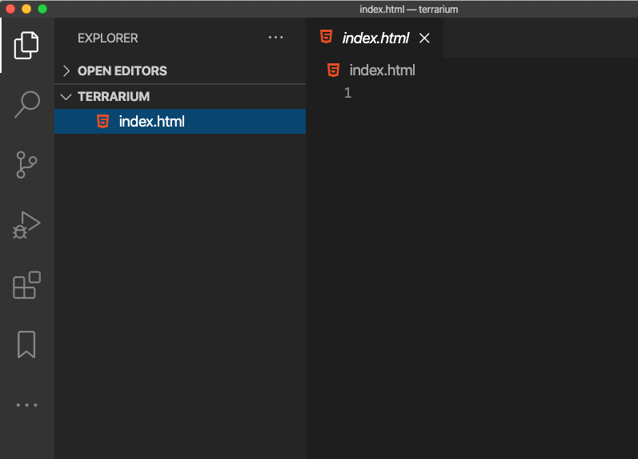

# Terrarium 프로젝트 파트 1: HTML 소개


> Sketchnote by [Tomomi Imura](https://twitter.com/girlie_mac)

## 강의 전 퀴즈

[Pre-lecture quiz](../.github/pre-lecture-quiz.md)

### 소개

HTML, HyperText Markup Language는 웹의 '뼈대' 입니다. CSS가 HTML과 JavaScript를 '꾸미면' HTML은 웹 애플리케이션의 본체입니다. HTML의 구문은 "head", "body" 그리고 "footer" 태그를 포함하므로 이러한 상상을 반영합니다.

이 강의에서는, HTML을 사용하여 가상 terrarium 인터페이스의 '뼈대'을 구상할 것입니다. 제목과 3개의 열을 가집니다: 드래그 가능한 식물이 살고 있는 오른쪽과 왼쪽 열 그리고 유리처럼 보이는 테라리움이 될 가운데 영역이 있습니다. 이 강의가 끝나면, 열에서 식물을 볼 수 있지만, 인터페이스가 약간 이상하게 보일 것입니다; 걱정하지 마세요. 다음 강의에서는 인터페이스에 CSS 스타일을 추가하여 더 좋아 보이게 만들 것입니다.

### 작업

컴퓨터에서, 'terrarium' 이라는 폴더를 만들고 그 안에 'index.html' 파일을 만듭니다. 새 VS Code 윈도우를 열어서 'open folder'를 클릭하고, terrarium 폴더를 만들면 Visual Studio Code에서 이 작업을 할 수 있습니다. 탐색기에서 작은 'file' 버튼을 클릭하고 새 파일을 만듭니다:



또는

git bash에서 아래 명령어를 수행합니다:
* `mkdir terrarium`
* `cd terrarium`
* `touch index.html`
* `code index.html` 또는 `nano index.html`

> index.html 파일은 브라우저에 폴더의 기본 파일임을 나타냅니다; `https://anysite.com/test`와 같은 URL은 `index.html`이 내부에 있는 `test`라는 폴더에 포함되어 있는 폴더 구조를 사용하여 제작될 수 있습니다; `index.html`은 URL에 표시할 필요가 없습니다.

---

## DocType과 html 태그

HTML 파일의 첫 번째 줄은 doctype입니다. 파일 최상단에 줄이 존재해야 된다는 사실에 살짝 놀랐지만, 현재 html 사양에 따라 페이지를 표준 모드로 렌더링해야한다고 오래된 브라우저에 알려줍니다.

> Tip: VS Code에서는, 태그 위에 마우스를 가져가면 MDN 레퍼런스 가이드에서 정보를 얻을 수 있습니다.

두 번째 줄에는 `<html>`이 열어주는 태그이며 그 뒤에 바로 닫는 태그로 `</html>`이 와야합니다. 이러한 태그는 인터페이스의 상위 요소입니다.

### 작업

`index.html` 파일의 상단에 해당 줄들을 추가합니다:

```HTML
<!DOCTYPE html>
<html></html>
```

✅ 쿼리 문자열로 DocType을 설정하여 결정할 수 있는 몇 가지 모드가 있습니다: [Quirks Mode and Standards Mode](https://developer.mozilla.org/en-US/docs/Web/HTML/Quirks_Mode_and_Standards_Mode). 이 모드는 요즘 잘 사용하지 않는 오래된 브라우저를 지원하는 데 사용되었습니다 (Netscape Navigator 4 및 Internet Explorer 5). 표준 doctype 선언을 할 수도 있습니다.

---

## 문서의 'head'

HTML 문서의 'head' 영역에는 [metadata](https://developer.mozilla.org/en-US/docs/Web/HTML/Element/meta)라고 하는 웹 페이지의 중요한 정보가 포함되어 있습니다. 우리의 경우에는, 이 페이지가 렌더링될 웹 서버에 다음 4가지를 알립니다.

-   페이지의 제목
-   페이지 메타데이터 포함:
	- 페이지에서 사용되는 문자 인코딩을 알려주는, 'character set'
    - IE=edge 브라우저가 지원됨을 나타내는 `x-ua-compatible`을 포함한, 브라우저 정보
    - viewport가 볼러질 때 어떻게 동작해야되는 지에 대한 정보. viewport를 초기 배율 1로 설정하며 처음 불러올 때 줌 수준이 제어됩니다.

### 작업

문서의 열고 닫는 `<html>` 태그 사이에 'head' 블록을 추가합니다.

```html
<head>
	<title>Welcome to my Virtual Terrarium</title>
	<meta charset="utf-8" />
	<meta http-equiv="X-UA-Compatible" content="IE=edge" />
	<meta name="viewport" content="width=device-width, initial-scale=1" />
</head>
```

✅ `<meta name="viewport" content="width=600">`과 같이 viewport 메타 태그를 설정하면 어떻게 되나요? [viewport](https://developer.mozilla.org/en-US/docs/Mozilla/Mobile/Viewport_meta_tag)에 대해 자세히 알아보세요.

---

## 문서의 `body`

### HTML 태그

HTML에서는, .html 파일에 태그를 추가하여 웹 페이지의 요소를 만듭니다. 각 태그에는 단락을 나타내기 위한 `<p>hello</p>` 같이 열고 닫는 태그가 있습니다. `<html>` 태그 쌍 안에 `<body>` 태그 세트를 추가하여 인터페이스의 본문을 만듭니다; 이제 마크업은 다음과 같습니다:

### 작업

```html
<!DOCTYPE html>
<html>
	<head>
		<title>Welcome to my Virtual Terrarium</title>
		<meta charset="utf-8" />
		<meta http-equiv="X-UA-Compatible" content="IE=edge" />
		<meta name="viewport" content="width=device-width, initial-scale=1" />
	</head>
	<body></body>
</html>
```

이제 페이지 만들 수 있습니다. 일반적으로 `<div>` 태그를 사용하여 페이지에 별도의 요소를 만듭니다. 이미지를 포함한 일련의 `<div>`요소를 만듭니다.

### 이미지

페이지가 아이템을 렌더링하면서 필요한 모든 정보가 `src` 요소에 들어있기 때문에, `` 태그는 닫는 태그가 필요하지 않은 html 태그입니다.

앱에 `images` 라는 폴더를 만들고, [소스코드 폴더](../images)에 모든 이미지(식물 14개의 이미지)를 모두 추가합니다.

### 작업

식물 이미지를 `<body></body>` 태그 사이의 두 열에 추가합니다:

```html
<div id="page">
	<div id="left-container" class="container">
		<div class="plant-holder">
			
		</div>
		<div class="plant-holder">
			
		</div>
		<div class="plant-holder">
			
		</div>
		<div class="plant-holder">
			
		</div>
		<div class="plant-holder">
			
		</div>
		<div class="plant-holder">
			
		</div>
		<div class="plant-holder">
			
		</div>
	</div>
	<div id="right-container" class="container">
		<div class="plant-holder">
			
		</div>
		<div class="plant-holder">
			
		</div>
		<div class="plant-holder">
			
		</div>
		<div class="plant-holder">
			
		</div>
		<div class="plant-holder">
			
		</div>
		<div class="plant-holder">
			
		</div>
		<div class="plant-holder">
			
		</div>
	</div>
</div>
```

> Note: Spans vs. Divs. Div는 'block' 요소로 간주되고, Span은 'inline'입니다. 이 div를 spans으로 변환하면 어떻게 될까요?

이 마크업을 사용하면, 이제 식물이 화면에 출력됩니다. 아직 CSS로 스타일이 지정되지 않았기 때문에 안 이뻐보입니다. 다음 강의에 그렇게 할 것입니다.

각 이미지에는 이미지를 보거나 렌더링 할 수 없는 경우에 보여지는 alt 태그가 있습니다. 이건 접근성을 위해 있어야 할 중요한 요소입니다. 이후 강의에서 접근성에 대해 자세히 알아보십시오. 지금은 어떤 이유로 이미지를 볼 수 없는 경우(연결이 느리거나, src 속성에 오류가 있거나, 스크린 리더를 사용하는 경우) alt 속성이 이미지의 대체 정보를 제공한다는 점을 기억하시기 바랍니다.

✅ 각 이미지에 같은 alt 태그가 있다는 것을 알았습니까? 이건 좋은 습관일까요? 어떤 이유일까요? 이 코드를 개선할 수 있나요?

---

## 시멘틱 마크업

일반적으로, HTML을 작성할 때 'semantics'을 사용하는 것이 좋습니다. 무슨 뜻일까요? 이는 HTML 태그를 디자인된 방식으로 사용한다는 것을 의미합니다: 데이터를 표현하기 위해; 따라서 H1 태그는 항상 페이지에 존재해야 합니다

`<body>` 여는 태그 바로 아래에 다음 줄을 추가합니다:

```html
<h1>My Terrarium</h1>
```

헤더가 `<h1>`이고 순서가 지정되지 않은 목록은 `<ul>`로 렌더링하는 것처럼 마크업을 사용하면 스크린 리더가 페이지를 탐색하는 데 도움이 됩니다. 일반적으로, 버튼은 `<button>`으로, 목록은 `<li>`로 작성해야 합니다. 버튼을 구상하기 위해서 클릭 핸들러와 특별히 스타일이 지정된 `<span>` 요소를 사용 _가능하지만_ , differently-abled 사용자는 기술을 사용하여 페이지에 버튼이 있는 위치를 확인하므로 버튼으로 상호 작용하는 것이 더 좋습니다. 이러한 이유로, 가능한 시맨틱 마크업을 사용하십시오.

✅ 스크린 리더를 살펴보고 [웹 페이지와 상호 작용하는 방식](https://www.youtube.com/watch?v=OUDV1gqs9GA)을 살펴보세요. 의미 없는 마크업이 사용자를 혼란스럽게 하는 이유를 알 수 있습니까?

## terrarium

이 인터페이스의 마지막 부분은 terrarium을 만들기 위해 스타일 지정할 마크업을 만드는 것입니다.

### 작업:

마지막 `</div>` 태그 위에 이 마크업을 놓습니다:

```html
<div id="terrarium">
	<div class="jar-top"></div>
	<div class="jar-walls">
		<div class="jar-glossy-long"></div>
		<div class="jar-glossy-short"></div>
	</div>
	<div class="dirt"></div>
	<div class="jar-bottom"></div>
</div>
```

✅ 이 마크업을 화면에 추가했지만, 전혀 렌더링이 안됩니다. 왜 그럴까요?

---

## 🚀 도전

HTML에는 여전히 재미있고 '오래된' 태그가 있지만, 마크업에서는 [이러한 태그](https://developer.mozilla.org/en-US/docs/Web/HTML/Element)처럼 더 이상 사용되지 않는 태그를 쓰면 안됩니다. 그래도, 예전 `<marquee>` 태그를 사용하여 h1 제목을 가로로 스크롤할 수 있습니까? (한다면, 나중에 제거하는 것을 잊지 마십시오)

## 강의 후 퀴즈

[Post-lecture quiz](../.github/post-lecture-quiz.md)

## 리뷰 & 자기주도 학습

HTML은 웹을 오늘 날의 웹으로 구축하는 데 도움이 준 'tried and true' 빌딩 블록 시스템입니다. 오래된 태그와 새로운 태그를 연구하여 그 역사에 대해 조금 배우십시오. 일부는 더 이상 안 쓰고 일부는 새로 만들어진 이유를 알 수 있습니까? 앞으로 어떤 태그가 도입될까요?

[Microsoft Learn](https://docs.microsoft.com/learn/modules/build-simple-website/?WT.mc_id=cxaall-4621-cxall)에서 웹과 모바일용 사이트 제작에 대해 자세히 알아보세요.


## 과제

[Practice your HTML: Build a blog mockup](../assignment.md)
