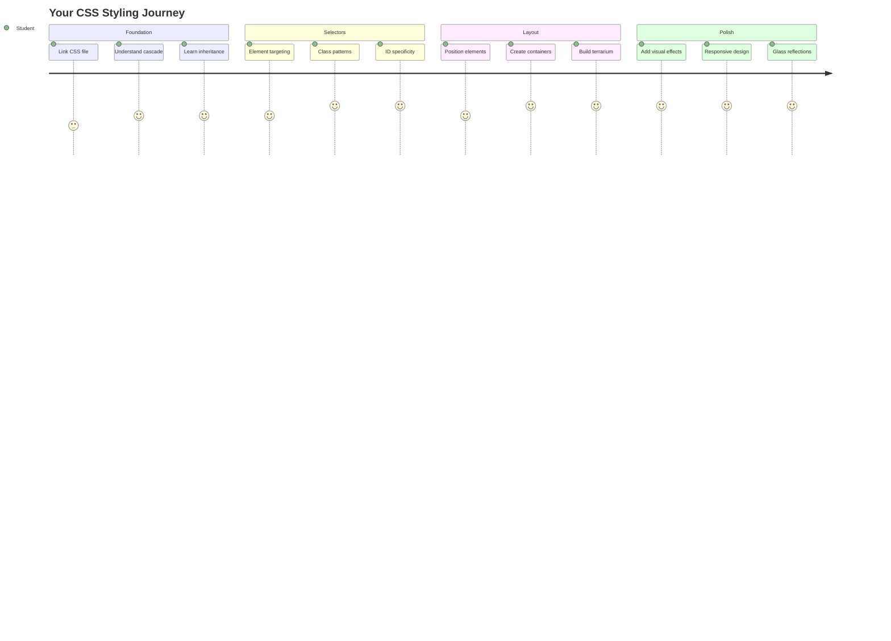
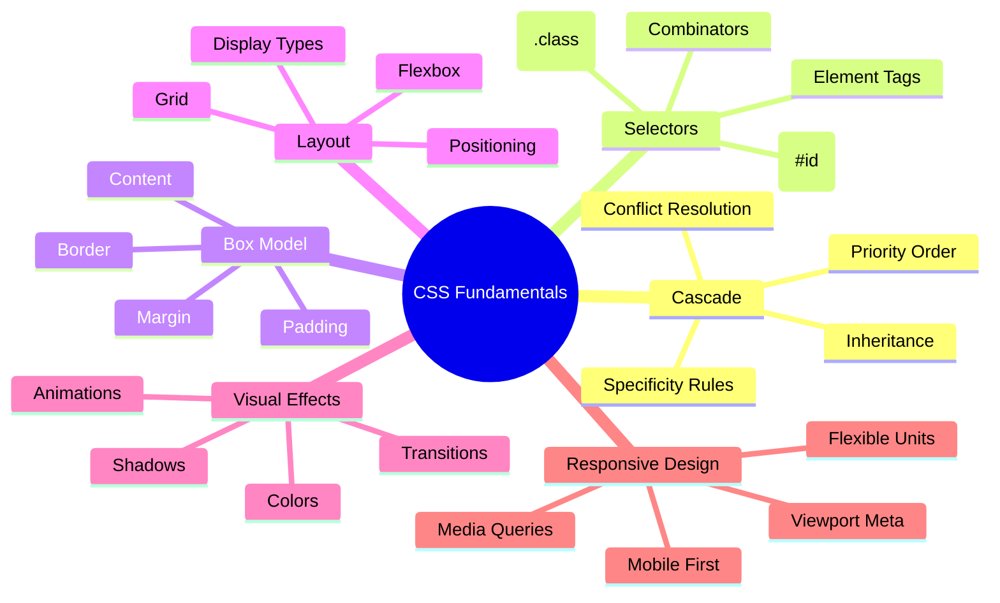
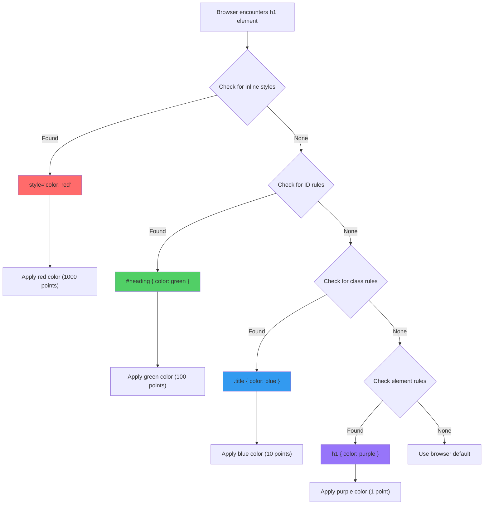
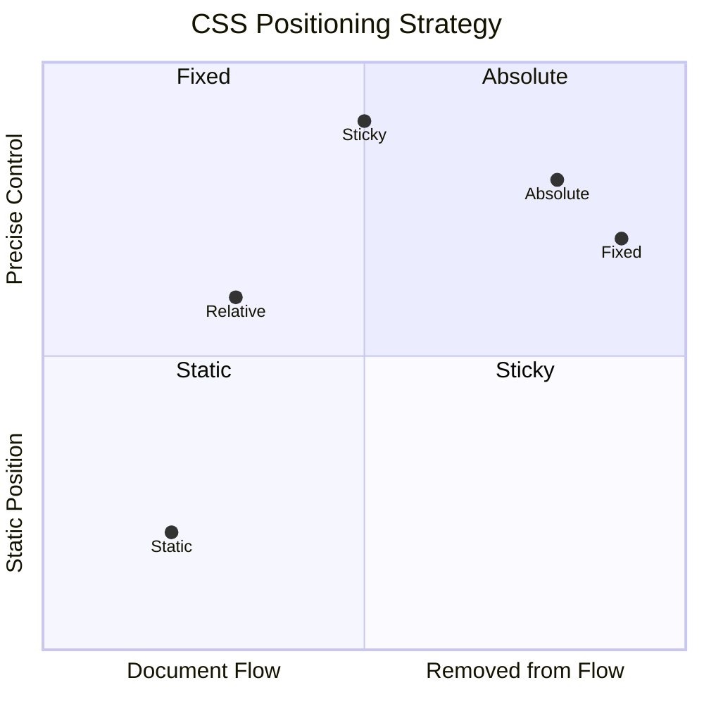
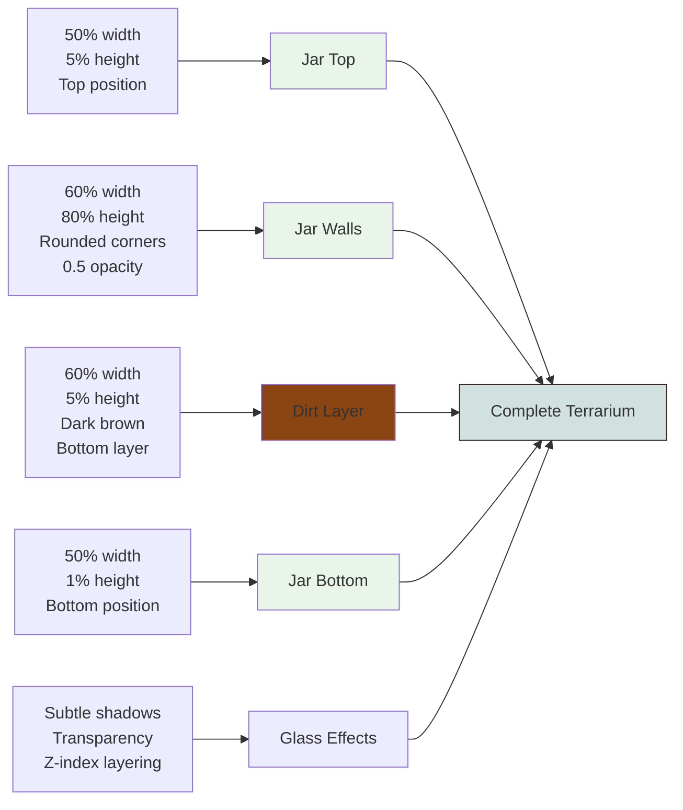
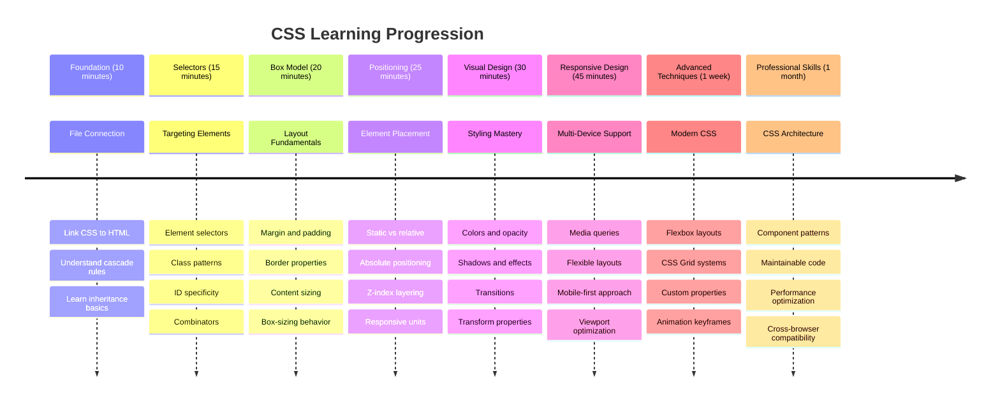

# Terrarium Project Part 2: Introduction to CSS




> Sketchnote by [Tomomi Imura](https://twitter.com/girlie_mac)

Remember how your HTML terrarium looked quite basic? CSS is where we transform that plain structure into something visually appealing.

If HTML is like building the frame of a house, then CSS is everything that makes it feel like home - the paint colors, the furniture arrangement, the lighting, and how the rooms flow together. Think of how the Palace of Versailles started as a simple hunting lodge, but careful attention to decoration and layout transformed it into one of the world's most magnificent buildings.

Today, we'll transform your terrarium from functional to polished. You'll learn how to position elements precisely, make layouts respond to different screen sizes, and create the visual appeal that makes websites engaging.

By the end of this lesson, you'll see how strategic CSS styling can dramatically improve your project. Let's add some style to your terrarium.



## Pre-Lecture Quiz

[Pre-lecture quiz](https://ff-quizzes.netlify.app/web/quiz/17)

## Getting Started with CSS

CSS is often thought of as just "making things pretty," but it serves a much broader purpose. CSS is like being the director of a movie - you control not just how everything looks, but how it moves, responds to interaction, and adapts to different situations.

Modern CSS is remarkably capable. You can write code that automatically adjusts layouts for phones, tablets, and desktop computers. You can create smooth animations that guide users' attention where needed. The results can be quite impressive when everything works together.

> 💡 **Pro Tip**: CSS is constantly evolving with new features and capabilities. Always check [CanIUse.com](https://caniuse.com) to verify browser support for newer CSS features before using them in production projects.

**Here's what we'll accomplish in this lesson:**
- **Creates** a complete visual design for your terrarium using modern CSS techniques
- **Explores** fundamental concepts like the cascade, inheritance, and CSS selectors
- **Implements** responsive positioning and layout strategies
- **Builds** the terrarium container using CSS shapes and styling

### Prerequisite

You should have completed the HTML structure for your terrarium from the previous lesson and have it ready to be styled.

> 📺 **Video Resource**: Check out this helpful video walkthrough
>
> [](https://www.youtube.com/watch?v=6yIdOIV9p1I)

### Setting Up Your CSS File

Before we can start styling, we need to connect CSS to our HTML. This connection tells the browser where to find the styling instructions for our terrarium.

In your terrarium folder, create a new file called `style.css`, then link it in your HTML document's `<head>` section:

```html
<link rel="stylesheet" href="./style.css" />
```

**Here's what this code does:**
- **Creates** a connection between your HTML and CSS files
- **Tells** the browser to load and apply the styles from `style.css`
- **Uses** the `rel="stylesheet"` attribute to specify this is a CSS file
- **References** the file path with `href="./style.css"`

## Understanding the CSS Cascade

Ever wondered why CSS is called "Cascading" Style Sheets? Styles cascade down like a waterfall, and sometimes they conflict with each other.

Consider how military command structures work - a general order might say "all troops wear green," but a specific order to your unit might say "wear dress blues for the ceremony." The more specific instruction takes precedence. CSS follows similar logic, and understanding this hierarchy makes debugging much more manageable.

### Experimenting with Cascade Priority

Let's see the cascade in action by creating a style conflict. First, add an inline style to your `<h1>` tag:

```html
<h1 style="color: red">My Terrarium</h1>
```

**What this code does:**
- **Applies** a red color directly to the `<h1>` element using inline styling
- **Uses** the `style` attribute to embed CSS directly in the HTML
- **Creates** the highest priority style rule for this specific element

Next, add this rule to your `style.css` file:

```css
h1 {
  color: blue;
}
```

**In the above, we've:**
- **Defined** a CSS rule that targets all `<h1>` elements
- **Set** the text color to blue using an external stylesheet
- **Created** a lower priority rule compared to inline styles

✅ **Knowledge Check**: Which color displays in your web app? Why does that color win? Can you think of scenarios where you might want to override styles?



> 💡 **CSS Priority Order (highest to lowest):**
> 1. **Inline styles** (style attribute)
> 2. **IDs** (#myId)
> 3. **Classes** (.myClass) and attributes
> 4. **Element selectors** (h1, div, p)
> 5. **Browser defaults**

## CSS Inheritance in Action

CSS inheritance works like genetics - elements inherit certain properties from their parent elements. If you set the font family on the body element, all text inside automatically uses that same font. It's similar to how the Habsburg family's distinctive jawline appeared across generations without being specified for each individual.

However, not everything gets inherited. Text styles like fonts and colors do inherit, but layout properties like margins and borders do not. Just as children might inherit physical traits but not their parents' fashion choices.

### Observing Font Inheritance

Let's see inheritance in action by setting a font family on the `<body>` element:

```css
body {
  font-family: 'Segoe UI', Tahoma, Geneva, Verdana, sans-serif;
}
```

**Breaking down what happens here:**
- **Sets** the font family for the entire page by targeting the `<body>` element
- **Uses** a font stack with fallback options for better browser compatibility
- **Applies** modern system fonts that look great across different operating systems
- **Ensures** all child elements inherit this font unless specifically overridden

Open your browser's developer tools (F12), navigate to the Elements tab, and inspect your `<h1>` element. You'll see that it inherits the font family from the body:


✅ **Experiment Time**: Try setting other inheritable properties on the `<body>` like `color`, `line-height`, or `text-align`. What happens to your heading and other elements?

> 📝 **Inheritable Properties Include**: `color`, `font-family`, `font-size`, `line-height`, `text-align`, `visibility`
>
> **Non-Inheritable Properties Include**: `margin`, `padding`, `border`, `width`, `height`, `position`

### 🔄 **Pedagogical Check-in**
**CSS Foundation Understanding**: Before moving to selectors, ensure you can:
- ✅ Explain the difference between cascade and inheritance
- ✅ Predict which style will win in a specificity conflict
- ✅ Identify which properties inherit from parent elements
- ✅ Connect CSS files to HTML properly

**Quick Test**: If you have these styles, what color will an `<h1>` inside a `<div class="special">` be?
```css
div { color: blue; }
.special { color: green; }
h1 { color: red; }
```
*Answer: Red (element selector directly targets h1)*

## Mastering CSS Selectors

CSS selectors are your way of targeting specific elements for styling. They work like giving precise directions - instead of saying "the house," you might say "the blue house with the red door on Maple Street."

CSS provides different ways to be specific, and choosing the right selector is like choosing the appropriate tool for the task. Sometimes you need to style every door in the neighborhood, and sometimes just one specific door.

### Element Selectors (Tags)

Element selectors target HTML elements by their tag name. They're perfect for setting base styles that apply broadly across your page:

```css
body {
  font-family: 'Segoe UI', Tahoma, Geneva, Verdana, sans-serif;
  margin: 0;
  padding: 0;
}

h1 {
  color: #3a241d;
  text-align: center;
  font-size: 2.5rem;
  margin-bottom: 1rem;
}
```

**Understanding these styles:**
- **Sets** consistent typography across the entire page with the `body` selector
- **Removes** default browser margins and padding for better control
- **Styles** all heading elements with color, alignment, and spacing
- **Uses** `rem` units for scalable, accessible font sizing

While element selectors work well for general styling, you'll need more specific selectors to style individual components like the plants in your terrarium.

### ID Selectors for Unique Elements

ID selectors use the `#` symbol and target elements with specific `id` attributes. Since IDs must be unique on a page, they're perfect for styling individual, special elements like our left and right plant containers.

Let's create the styling for our terrarium's side containers where the plants will live:

```css
#left-container {
  background-color: #f5f5f5;
  width: 15%;
  left: 0;
  top: 0;
  position: absolute;
  height: 100vh;
  padding: 1rem;
  box-sizing: border-box;
}

#right-container {
  background-color: #f5f5f5;
  width: 15%;
  right: 0;
  top: 0;
  position: absolute;
  height: 100vh;
  padding: 1rem;
  box-sizing: border-box;
}
```

**Here's what this code accomplishes:**
- **Positions** containers at the far left and right edges using `absolute` positioning
- **Uses** `vh` (viewport height) units for responsive height that adapts to screen size
- **Applies** `box-sizing: border-box` so padding is included in the total width
- **Removes** unnecessary `px` units from zero values for cleaner code
- **Sets** a subtle background color that's easier on the eyes than stark gray

✅ **Code Quality Challenge**: Notice how this CSS violates the DRY (Don't Repeat Yourself) principle. Can you refactor it using both an ID and a class?

**Improved approach:**
```html
<div id="left-container" class="container"></div>
<div id="right-container" class="container"></div>
```

```css
.container {
  background-color: #f5f5f5;
  width: 15%;
  top: 0;
  position: absolute;
  height: 100vh;
  padding: 1rem;
  box-sizing: border-box;
}

#left-container {
  left: 0;
}

#right-container {
  right: 0;
}
```

### Class Selectors for Reusable Styles

Class selectors use the `.` symbol and are perfect when you want to apply the same styles to multiple elements. Unlike IDs, classes can be reused throughout your HTML, making them ideal for consistent styling patterns.

In our terrarium, each plant needs similar styling but also needs individual positioning. We'll use a combination of classes for shared styles and IDs for unique positioning.

**Here's the HTML structure for each plant:**
```html
<div class="plant-holder">
  
</div>
```

**Key elements explained:**
- **Uses** `class="plant-holder"` for consistent container styling across all plants
- **Applies** `class="plant"` for shared image styling and behavior
- **Includes** unique `id="plant1"` for individual positioning and JavaScript interaction
- **Provides** descriptive alt text for screen reader accessibility

Now add these styles to your `style.css` file:

```css
.plant-holder {
  position: relative;
  height: 13%;
  left: -0.6rem;
}

.plant {
  position: absolute;
  max-width: 150%;
  max-height: 150%;
  z-index: 2;
  transition: transform 0.3s ease;
}

.plant:hover {
  transform: scale(1.05);
}
```

**Breaking down these styles:**
- **Creates** relative positioning for the plant holder to establish a positioning context
- **Sets** each plant holder to 13% height, ensuring all plants fit vertically without scrolling
- **Shifts** holders slightly left to better center plants within their containers
- **Allows** plants to scale responsively with `max-width` and `max-height` properties
- **Uses** `z-index` to layer plants above other elements in the terrarium
- **Adds** a subtle hover effect with CSS transitions for better user interaction

✅ **Critical Thinking**: Why do we need both `.plant-holder` and `.plant` selectors? What would happen if we tried to use just one?

> 💡 **Design Pattern**: The container (`.plant-holder`) controls layout and positioning, while the content (`.plant`) controls appearance and scaling. This separation makes the code more maintainable and flexible.

## Understanding CSS Positioning

CSS positioning is like being the stage director for a play - you direct where every actor stands and how they move around the stage. Some actors follow the standard formation, while others need specific positioning for dramatic effect.

Once you understand positioning, many layout challenges become manageable. Need a navigation bar that stays at the top while users scroll? Positioning handles that. Want a tooltip that appears at a specific location? That's positioning too.

### The Five Position Values



| Position Value | Behavior | Use Case |
|----------------|----------|----------|
| `static` | Default flow, ignores top/left/right/bottom | Normal document layout |
| `relative` | Positioned relative to its normal position | Small adjustments, creating positioning context |
| `absolute` | Positioned relative to nearest positioned ancestor | Precise placement, overlays |
| `fixed` | Positioned relative to viewport | Navigation bars, floating elements |
| `sticky` | Switches between relative and fixed based on scroll | Headers that stick when scrolling |

### Positioning in Our Terrarium

Our terrarium uses a strategic combination of positioning types to create the desired layout:

```css
/* Container positioning */
.container {
  position: absolute; /* Removes from normal flow */
  /* ... other styles ... */
}

/* Plant holder positioning */
.plant-holder {
  position: relative; /* Creates positioning context */
  /* ... other styles ... */
}

/* Plant positioning */
.plant {
  position: absolute; /* Allows precise placement within holder */
  /* ... other styles ... */
}
```

**Understanding the positioning strategy:**
- **Absolute containers** are removed from normal document flow and pinned to screen edges
- **Relative plant holders** create a positioning context while staying in document flow
- **Absolute plants** can be positioned precisely within their relative containers
- **This combination** allows plants to stack vertically while being individually positionable

> 🎯 **Why This Matters**: The `plant` elements need absolute positioning to become draggable in the next lesson. Absolute positioning removes them from the normal layout flow, making drag-and-drop interactions possible.

✅ **Experiment Time**: Try changing the positioning values and observe the results:
- What happens if you change `.container` from `absolute` to `relative`?
- How does the layout change if `.plant-holder` uses `absolute` instead of `relative`?
- What occurs when you switch `.plant` to `relative` positioning?

### 🔄 **Pedagogical Check-in**
**CSS Positioning Mastery**: Pause to verify your understanding:
- ✅ Can you explain why plants need absolute positioning for drag-and-drop?
- ✅ Do you understand how relative containers create positioning context?
- ✅ Why do the side containers use absolute positioning?
- ✅ What would happen if you removed position declarations entirely?

**Real-World Connection**: Think about how CSS positioning mirrors real-world layout:
- **Static**: Books on a shelf (natural order)
- **Relative**: Moving a book slightly but keeping its spot
- **Absolute**: Placing a bookmark at an exact page number
- **Fixed**: A sticky note that stays visible as you flip pages

## Building the Terrarium with CSS

Now we'll build a glass jar using only CSS - no images or graphics software required.

Creating realistic-looking glass, shadows, and depth effects using positioning and transparency demonstrates CSS's visual capabilities. This technique mirrors how architects in the Bauhaus movement used simple geometric forms to create complex, beautiful structures. Once you understand these principles, you'll recognize the CSS techniques behind many web designs.



### Creating the Glass Jar Components

Let's build the terrarium jar piece by piece. Each part uses absolute positioning and percentage-based sizing for responsive design:

```css
.jar-walls {
  height: 80%;
  width: 60%;
  background: #d1e1df;
  border-radius: 1rem;
  position: absolute;
  bottom: 0.5%;
  left: 20%;
  opacity: 0.5;
  z-index: 1;
  box-shadow: inset 0 0 2rem rgba(0, 0, 0, 0.1);
}

.jar-top {
  width: 50%;
  height: 5%;
  background: #d1e1df;
  position: absolute;
  bottom: 80.5%;
  left: 25%;
  opacity: 0.7;
  z-index: 1;
  border-radius: 0.5rem 0.5rem 0 0;
}

.jar-bottom {
  width: 50%;
  height: 1%;
  background: #d1e1df;
  position: absolute;
  bottom: 0;
  left: 25%;
  opacity: 0.7;
  border-radius: 0 0 0.5rem 0.5rem;
}

.dirt {
  width: 60%;
  height: 5%;
  background: #3a241d;
  position: absolute;
  border-radius: 0 0 1rem 1rem;
  bottom: 1%;
  left: 20%;
  opacity: 0.7;
  z-index: -1;
}
```

**Understanding the terrarium construction:**
- **Uses** percentage-based dimensions for responsive scaling across all screen sizes
- **Positions** elements absolutely to stack and align them precisely
- **Applies** different opacity values to create the glass transparency effect
- **Implements** `z-index` layering so plants appear inside the jar
- **Adds** subtle box-shadow and refined border-radius for more realistic appearance

### Responsive Design with Percentages

Notice how all dimensions use percentages rather than fixed pixel values:

**Why this matters:**
- **Ensures** the terrarium scales proportionally on any screen size
- **Maintains** the visual relationships between jar components
- **Provides** a consistent experience from mobile phones to large desktop monitors
- **Allows** the design to adapt without breaking the visual layout

### CSS Units in Action

We're using `rem` units for border-radius, which scale relative to the root font size. This creates more accessible designs that respect user font preferences. Learn more about [CSS relative units](https://www.w3.org/TR/css-values-3/#font-relative-lengths) in the official specification.

✅ **Visual Experimentation**: Try modifying these values and observe the effects:
- Change the jar opacity from 0.5 to 0.8 – how does this affect the glass appearance?
- Adjust the dirt color from `#3a241d` to `#8B4513` – what visual impact does this have?
- Modify the `z-index` of the dirt to 2 – what happens to the layering?

### 🔄 **Pedagogical Check-in**
**CSS Visual Design Understanding**: Confirm your grasp of visual CSS:
- ✅ How do percentage-based dimensions create responsive design?
- ✅ Why does opacity create the glass transparency effect?
- ✅ What role does z-index play in layering elements?
- ✅ How do border-radius values create the jar shape?

**Design Principle**: Notice how we're building complex visuals from simple shapes:
1. **Rectangles** → **Rounded rectangles** → **Jar components**
2. **Flat colors** → **Opacity** → **Glass effect**
3. **Individual elements** → **Layered composition** → **3D appearance**

---

## GitHub Copilot Agent Challenge 🚀

Use the Agent mode to complete the following challenge:

**Description:** Create a CSS animation that makes the terrarium plants gently sway back and forth, simulating a natural breeze effect. This will help you practice CSS animations, transforms, and keyframes while enhancing the visual appeal of your terrarium.

**Prompt:** Add CSS keyframe animations to make the plants in the terrarium sway gently from side to side. Create a swaying animation that rotates each plant slightly (2-3 degrees) left and right with a duration of 3-4 seconds, and apply it to the `.plant` class. Make sure the animation loops infinitely and has an easing function for natural movement.

Learn more about [agent mode](https://code.visualstudio.com/blogs/2025/02/24/introducing-copilot-agent-mode) here.

## 🚀 Challenge: Adding Glass Reflections

Ready to enhance your terrarium with realistic glass reflections? This technique will add depth and realism to the design.

You'll create subtle highlights that simulate how light reflects off glass surfaces. This approach is similar to how Renaissance painters like Jan van Eyck used light and reflection to make painted glass appear three-dimensional. Here's what you're aiming for:


**Your challenge:**
- **Create** subtle white or light-colored oval shapes for the glass reflections
- **Position** them strategically on the left side of the jar
- **Apply** appropriate opacity and blur effects for realistic light reflection
- **Use** `border-radius` to create organic, bubble-like shapes
- **Experiment** with gradients or box-shadows for enhanced realism

## Post-Lecture Quiz

[Post-lecture quiz](https://ff-quizzes.netlify.app/web/quiz/18)

## Expand Your CSS Knowledge

CSS can feel complex initially, but understanding these core concepts provides a solid foundation for more advanced techniques.

**Your next CSS learning areas:**
- **Flexbox** - simplifies alignment and distribution of elements
- **CSS Grid** - provides powerful tools for creating complex layouts
- **CSS Variables** - reduces repetition and improves maintainability
- **Responsive design** - ensures sites work well across different screen sizes

### Interactive Learning Resources

Practice these concepts with these engaging, hands-on games:
- 🐸 [Flexbox Froggy](https://flexboxfroggy.com/) - Master Flexbox through fun challenges
- 🌱 [Grid Garden](https://codepip.com/games/grid-garden/) - Learn CSS Grid by growing virtual carrots
- 🎯 [CSS Battle](https://cssbattle.dev/) - Test your CSS skills with coding challenges

### Additional Learning

For comprehensive CSS fundamentals, complete this Microsoft Learn module: [Style your HTML app with CSS](https://docs.microsoft.com/learn/modules/build-simple-website/4-css-basics/?WT.mc_id=academic-77807-sagibbon)

## 🎯 Your CSS Mastery Timeline



### 🛠️ Your CSS Toolkit Summary

After completing this lesson, you now have:
- **Cascade Understanding**: How styles inherit and override each other
- **Selector Mastery**: Precise targeting with elements, classes, and IDs
- **Positioning Skills**: Strategic element placement and layering
- **Visual Design**: Creating glass effects, shadows, and transparency
- **Responsive Techniques**: Percentage-based layouts that adapt to any screen
- **Code Organization**: Clean, maintainable CSS structure
- **Modern Practices**: Using relative units and accessible design patterns

**Next Steps**: Your terrarium now has both structure (HTML) and style (CSS). The final lesson will add interactivity with JavaScript!

## Assignment

[CSS Refactoring](assignment.md)
