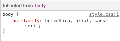
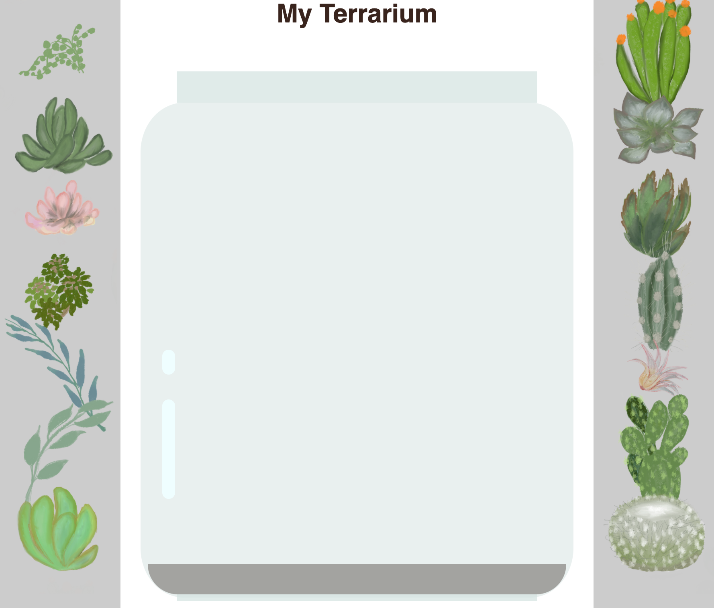

# Terrarium 프로젝트 파트 2: CSS 소개


> Sketchnote by [Tomomi Imura](https://twitter.com/girlie_mac)

## 강의 전 퀴즈

[Pre-lecture quiz](https://happy-mud-02d95f10f.azurestaticapps.net/quiz/17?loc=ko)

### 소개

CSS 또는 Cascading Style Sheets는 웹 개발의 중요한 이슈를 해결합니다: 웹 사이트를 멋지게 만드는 방법. 앱의 스타일을 지정하면 더 유용하고 보기 좋게 만들 수 있습니다; CSS를 사용하여 반응형 웹 디자인(RWD)을 만들 수도 있습니다 - 따라서 앱이 표시되는 화면 크기에 관계없이 멋지게 보일 수 있습니다. CSS는 앱을 멋지게 보이는 방법만 있는 것이 아닙니다; 사양에는 앱에 대한 정교한 상호 작용을 가능하게 하는 애니메이션 및 변환이 포함됩니다. CSS 워킹 그룹은 현재 CSS 사양을 유지하는 데 도움을 줍니다; [World Wide Web Consortium 사이트](https://www.w3.org/Style/CSS/members)에서 작업을 확인할 수 있습니다.

> Note, CSS는 웹의 모든 것과 마찬가지로, 진화하는 언어이며, 모든 브라우저가 사양의 최신 부분을 지원하는 것은 아닙니다. 항상 [CanIUse.com](caniuse.com)에 문의하여 구현을 확인하십시오.

이 강의에서는, 온라인 terrarium에 스타일을 추가하며 여러 CSS 개념에 대해 자세히 알아봅시다: 캐스케이드, 상속과 선택자 사용, 포지셔닝과 레이아웃 구축을 하기위한 CSS 사용. 이 과정에서 terrarium을 레이아웃하고 실제 terrarium 자체를 만듭니다.

### 준비물

terrarium으로 HTML이 제작되고 스타일을 지정할 준비가 되어있어야 합니다.

### 작업

terrarium 폴더에서, `style.css` 라고 불리는 파일을 만듭니다. 파일의 `<head>` 부분에 넣습니다:

```html
<link rel="stylesheet" href="./style.css" />
```

---

## Cascade

Cascade 스타일 시트는 우선 순위에 따라 스타일이 적용 되도록 'Cascade' 된다는 상상을 합칩니다. 웹 사이트 작성자가 지정한 스타일은 브라우저가 지정한 스타일보다 우선합니다. '인라인'으로 설정된 스타일은 외부 스타일 시트에 설정된 스타일보다 우선합니다.

### 작업

`<h1>` 태그에 "color: red" inline 스타일을 추가합니다:

```HTML
<h1 style="color: red">My Terrarium</h1>
```

그러고, `style.css` 파일에 다은 코드를 추가합니다:

```CSS
h1 {
 color: blue;
}
```

✅ 웹 앱에는 어떤 색으로 표시되나요? 왜 그럴까요? 스타일을 오버라이드하는 방법을 찾을 수 있나요? 언제 하고 싶나요? 아니면 왜 안될까요?

---

## 상속

스타일은 상위 스타일에서 하위 요소로 상속되므로, 중첩된 요소는 상위 스타일을 상속합니다.

### 작업

본문의 폰트를 지정된 주어진 폰트로 설정하고, 중첩된 요소의 폰트를 확인합니다:

```
body {
	font-family: helvetica, arial, sans-serif;
}
```

브라우저의 콘솔에서 'Elements'을 열고 H1 폰트를 보십시오. 브라우저에 기록된대로 본문에서 폰트를 상속합니다:



✅ 중첩된 스타일이 다른 속성을 상속하도록 만들 수 있습니까?

---

## CSS 선택자

### 태그

지금까지, `style.css` 파일에는 스타일이 지정된 태그가 몇 개 뿐이며, 앱이 매우 이상하게 보입니다:

```
body {
	font-family: helvetica, arial, sans-serif;
}

h1 {
	color: #3a241d;
	text-align: center;
}
```

이 태그 스타일링 방식을 사용하면 고유 요소를 제어할 수 있지만, terrarium에 있는 많은 식물의 스타일을 제어해야 합니다. 이를 위해서는, CSS 선택자를 활용해야 합니다.

### Id

왼쪽과 오른쪽 컨테이너 레이아웃에 스타일을 추가합니다. 왼쪽 컨테이너와 오른쪽 컨테이너가 하나만 있으므로, 마크업에 Id가 제공됩니다. 스타일을 지정하려면, `#`을 사용하세요:

```
#left-container {
	background-color: #eee;
	width: 15%;
	left: 0px;
	top: 0px;
	position: absolute;
	height: 100%;
	padding: 10px;
}

#right-container {
	background-color: #eee;
	width: 15%;
	right: 0px;
	top: 0px;
	position: absolute;
	height: 100%;
	padding: 10px;
}
```

여기에서는, 컨테이너를 화면의 맨 왼쪽과 오른쪽에 절대 위치로 두고, 너비에 백분율을 사용하여 작은 모바일 화면에 맞을 수 있도록 조정했습니다.

✅ 이 코드는 꽤 반복되므로, "DRY" 하지 않습니다 (반복하지 마십시오); id와 클래스를 사용하여 스타일링하는 더 좋은 방법을 찾을 수 있나요? 마크업을 변경하고 CSS를 리팩토링해야 합니다:

```html
<div id="left-container" class="container"></div>
```

### 클래스

위의 예시에서, 화면에서 두가지 고유 요소를 꾸몄습니다. 화면의 많은 요소에 꾸미려면, CSS 클래스를 사용할 수 있습니다. 왼쪽과 오른쪽 컨테이너에 식물을 둘 수 있습니다.

HTML 마크업의 각 식물에는 id와 클래스의 조합이 있습니다. id는 나중에 추가할 JavaScript에서 terrarium 식물 배치를 조작하는 데 사용됩니다. 그러나 이 강의에서는 모든 식물에 주어진 스타일로 부여합니다.

```html
<div class="plant-holder">
	
</div>
```

`style.css` 파일에 다음을 추가합니다:

```css
.plant-holder {
	position: relative;
	height: 13%;
	left: -10px;
}

.plant {
	position: absolute;
	max-width: 150%;
	max-height: 150%;
	z-index: 2;
}
```

이 스니펫에서 볼 관점은 상대 위치와 절대 위치가 혼합되어 있다는 것이며, 다음 강의에서 다룰 것입니다. 높이가 백분율로 처리되는 방식을 살펴보십시오:

식물 홀더의 높이를 13%로 설정하면, 스크롤할 필요없이 모든 식물이 각 수직 컨테이너에 출력되도록 할 수 있습니다.

식물 홀더를 왼쪽으로 이동하여 식물이 컨테이너 인에서 더 가운데로 들어오도록 설정합니다. 이미지는 드래그하기 쉽게 만들기 위해 투명한 배경을 많이 가지고 있으므로, 화면에 더 잘 맞게 왼쪽으로 밀어야 합니다.

그러면, 식물 자체의 최대 너비는 150% 입니다. 브라우저가 작아지면 같이 작아질 수 있습니다. 브라우저 크기를 조절해보십시오. 식물은 컨테이너에 있지만 크기에 맞게 작아집니다.

또한 요소의 상대적 고도를 제어하는, ​​z-index의 사용은 주목할만 합니다 (식물이 컨테이너 위에 있고 terrarium 안에 있는 것처럼 보이게).

✅ 식물 홀더와 식물 CSS 선택자가 필요한 이유는 무엇입니까?

## CSS 포지셔닝

위치 속성(static, relative, fixed, absolute 그리고 sticky 포지션)을 섞는 것은 약간 까다로울 수 있지만, 제대로 하면 페이지의 요소를 잘 제어할 수 있습니다.

절대 위치 요소는 가장 가까운 위치에 있는 최상위를 기준으로 위치하며, 없는 경우 문서 본문에 따라 위치가 지정됩니다.

상대 배치된 요소는 CSS의 방향에 따라 배치되며 처음 위치에서 떨어진 배치를 조정합니다.

예시에서, `plant-holder`는 절대 위치지만 컨테이너 안에서는 상대 위치 요소입니다. 그 결과 사이드바 컨테이너가 왼쪽과 오른쪽에 고정되고, 식물 홀더가 중첩되어 사이드바 안에서 자체적으로 조정되므로 수직 행에 식물이 배치될 공간을 제공합니다.

> 다음 강의에서 확인해보면, `plant`은 드래그 가능한 필요한 절대 위치에 있습니다.

✅ 사이드 컨테이너와 식물 홀더의 위치 타입을 전환하여 실험하십시오. 무슨 일이 생기나요?

## CSS 레이아웃

이제는 배웠던 모든 CSS를 사용하여 terrarium 자체를 만듭니다!

먼저, CSS를 사용하여 `.terrarium` div 하위를 라운딩된 사각형으로 꾸밉니다:

```css
.jar-walls {
	height: 80%;
	width: 60%;
	background: #d1e1df;
	border-radius: 1rem;
	position: absolute;
	bottom: 0.5%;
	left: 20%;
	opacity: 0.5;
	z-index: 1;
}

.jar-top {
	width: 50%;
	height: 5%;
	background: #d1e1df;
	position: absolute;
	bottom: 80.5%;
	left: 25%;
	opacity: 0.7;
	z-index: 1;
}

.jar-bottom {
	width: 50%;
	height: 1%;
	background: #d1e1df;
	position: absolute;
	bottom: 0%;
	left: 25%;
	opacity: 0.7;
}

.dirt {
	width: 60%;
	height: 5%;
	background: #3a241d;
	position: absolute;
	border-radius: 0 0 1rem 1rem;
	bottom: 1%;
	left: 20%;
	opacity: 0.7;
	z-index: -1;
}
```

여기서는 `border-radius`에 대해서도 백분율을 사용합니다. 브라우저를 줄이면 jar 모서리도 어떻게 변하는 지 볼 수 있습니다. 또한 jar 요소의 너비, 높이 백분율과 각 요소가 뷰포트 하단에 고정되어 중앙에 절대 배치되는 방식을 확인하십시오.

✅ jar 색상과 투명도를 흙 색과 비교해보십시오. 무슨 일인가요? 왜 그럴까요?

---

## 🚀 도전

jar 좌측 하단 부분에 'bubble' 광택을 추가하여 유리처럼 보이도록 합니다. `.jar-glossy-long`과 `.jar-glossy-short`를 빛 반사되는 것처럼 보이도록 꾸밉니다. 다음과 같이 표시됩니다.



강의 후 퀴즈를 완료하려면, 다음 학습 모듈을 진행하십시오: [Style your HTML app with CSS](https://docs.microsoft.com/learn/modules/build-simple-website/4-css-basics?WT.mc_id=academic-13441-cxa)

## 강의 후 퀴즈

[Post-lecture quiz](https://happy-mud-02d95f10f.azurestaticapps.net/quiz/18?loc=ko)

## 리뷰 & 자기주도 학습

CSS는 믿을 수 없게 간단해 보이지만, 모든 브라우저와 모든 화면 크기에 대해 완벽한 스타일을 지정하려면 많이 어렵습니다. CSS-Grid 및 Flexbox는 좀 더 구조화되고 안정적으로 보이게 개발된 도구입니다. [Flexbox Froggy](https://flexboxfroggy.com/)와 [Grid Garden](https://codepip.com/games/grid-garden/)을 플레이하여 도구에 대해 알아보세요.

## 과제

[CSS Refactoring](../assignment.md)
