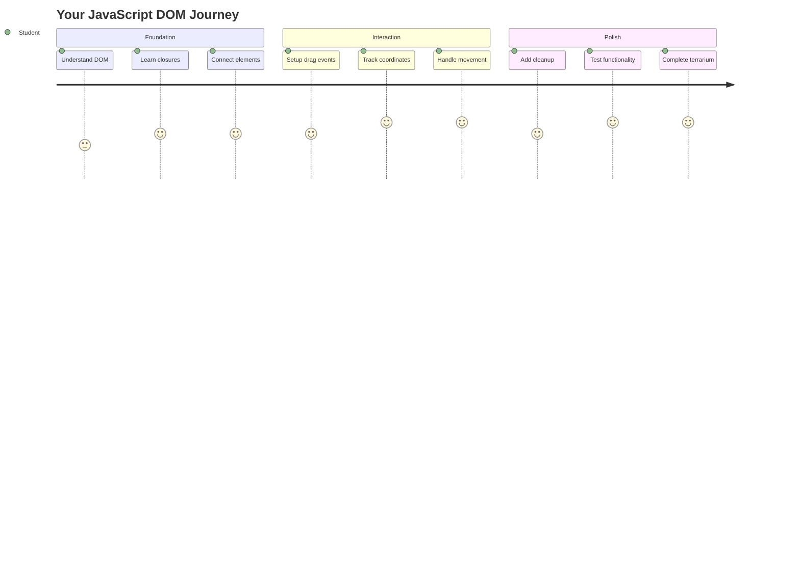
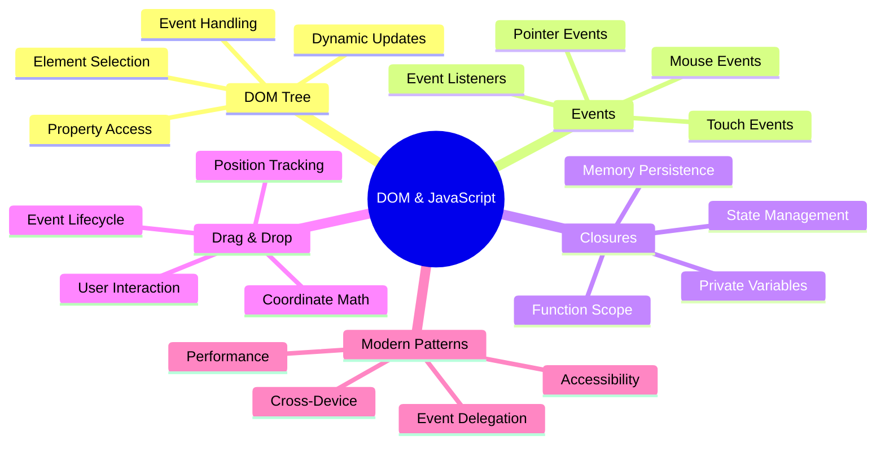
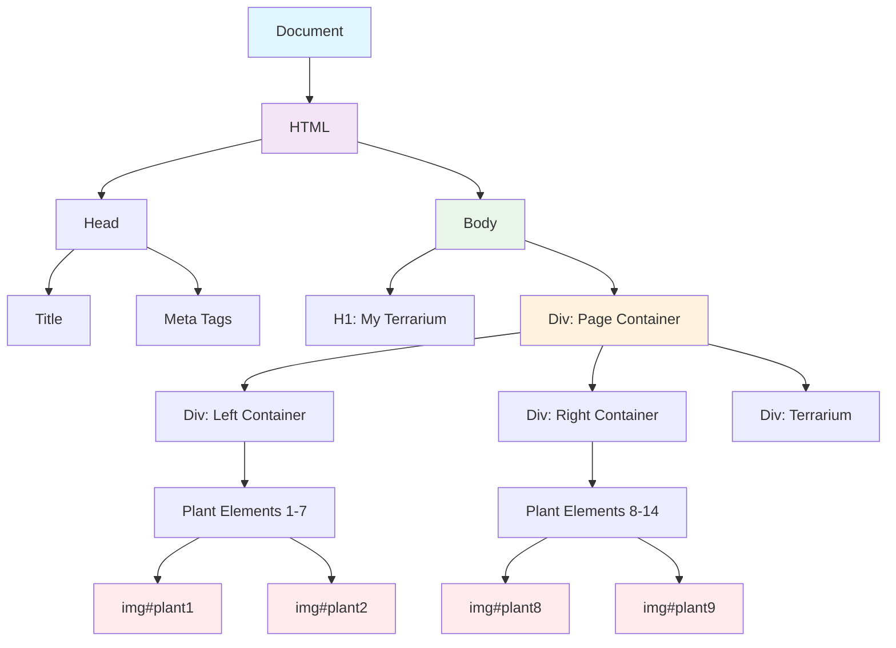
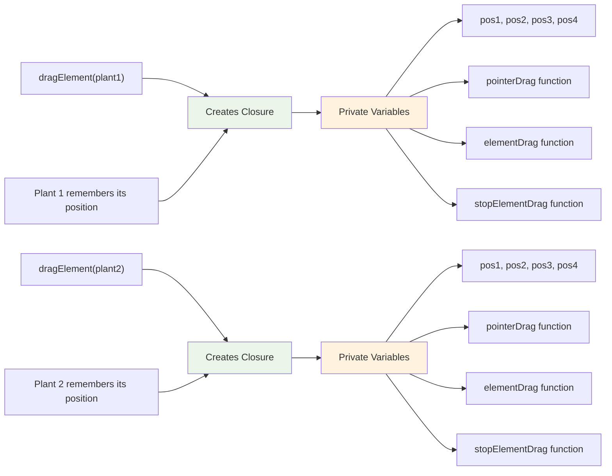
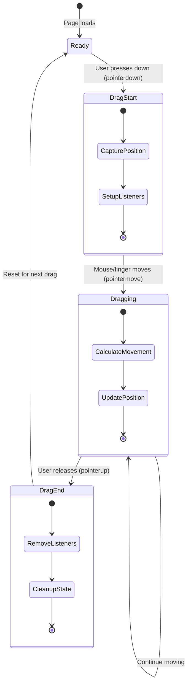
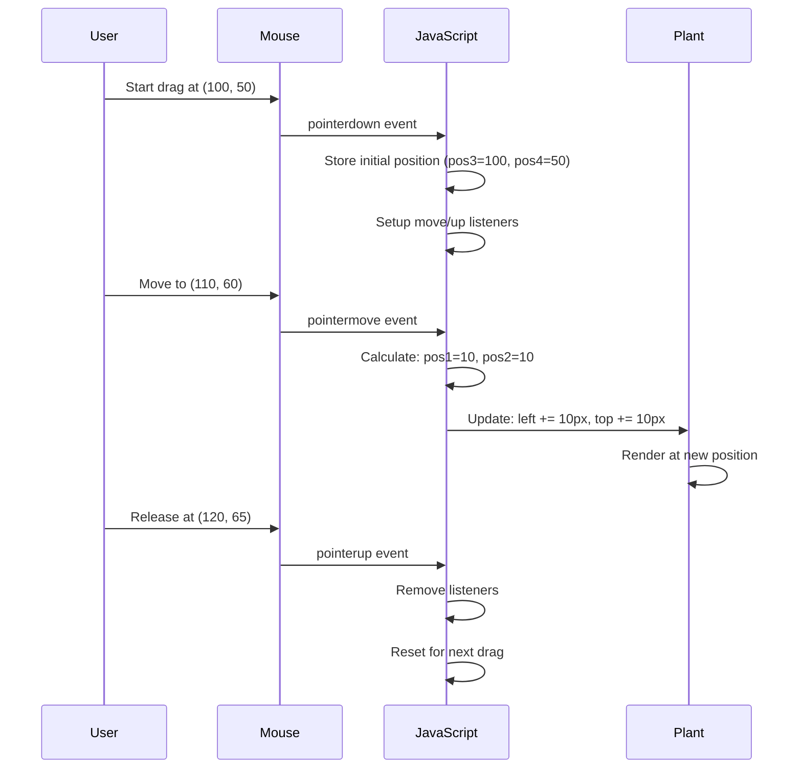
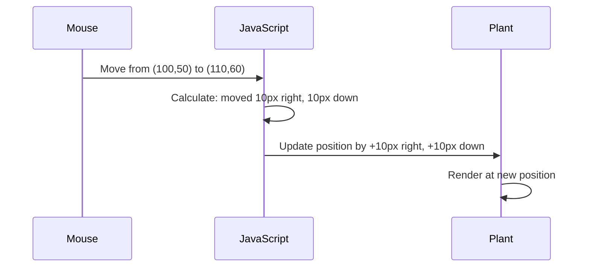
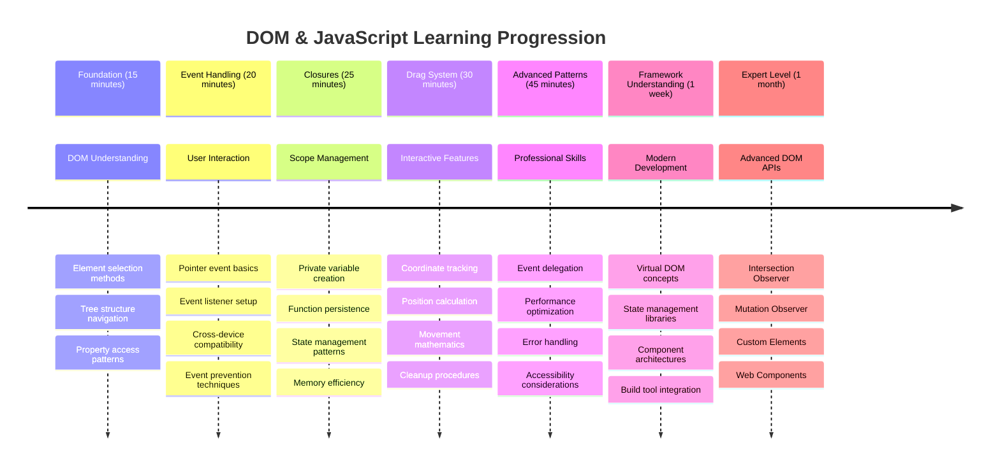

# Terrarium Project Part 3: DOM Manipulation and JavaScript Closures




> Sketchnote by [Tomomi Imura](https://twitter.com/girlie_mac)

Welcome to one of the most engaging aspects of web development - making things interactive! The Document Object Model (DOM) is like a bridge between your HTML and JavaScript, and today we'll use it to bring your terrarium to life. When Tim Berners-Lee created the first web browser, he envisioned a web where documents could be dynamic and interactive - the DOM makes that vision possible.

We'll also explore JavaScript closures, which might sound intimidating initially. Think of closures as creating "memory pockets" where your functions can remember important information. It's like each plant in your terrarium having its own data record to track its position. By the end of this lesson, you'll understand how natural and useful they are.

Here's what we're building: a terrarium where users can drag and drop plants anywhere they want. You'll learn the DOM manipulation techniques that power everything from drag-and-drop file uploads to interactive games. Let's make your terrarium come alive.



## Pre-Lecture Quiz

[Pre-lecture quiz](https://ff-quizzes.netlify.app/web/quiz/19)

## Understanding the DOM: Your Gateway to Interactive Web Pages

The Document Object Model (DOM) is how JavaScript communicates with your HTML elements. When your browser loads an HTML page, it creates a structured representation of that page in memory - that's the DOM. Think of it as a family tree where every HTML element is a family member that JavaScript can access, modify, or rearrange.

DOM manipulation transforms static pages into interactive websites. Every time you see a button change color on hover, content update without page refresh, or elements you can drag around, that's DOM manipulation at work.




> A representation of the DOM and the HTML markup that references it. From [Olfa Nasraoui](https://www.researchgate.net/publication/221417012_Profile-Based_Focused_Crawler_for_Social_Media-Sharing_Websites)

**Here's what makes the DOM powerful:**
- **Provides** a structured way to access any element on your page
- **Enables** dynamic content updates without page refreshes
- **Allows** real-time response to user interactions like clicks and drags
- **Creates** the foundation for modern interactive web applications

## JavaScript Closures: Creating Organized, Powerful Code

A [JavaScript closure](https://developer.mozilla.org/docs/Web/JavaScript/Closures) is like giving a function its own private workspace with persistent memory. Consider how Darwin's finches on the Galápagos Islands each developed specialized beaks based on their specific environment - closures work similarly, creating specialized functions that "remember" their specific context even after their parent function has finished.

In our terrarium, closures help each plant remember its own position independently. This pattern appears throughout professional JavaScript development, making it a valuable concept to understand.



> 💡 **Understanding Closures**: Closures are a significant topic in JavaScript, and many developers use them for years before fully grasping all the theoretical aspects. Today, we're focusing on practical application - you'll see closures naturally emerge as we build our interactive features. Understanding will develop as you see how they solve real problems.


> A representation of the DOM and the HTML markup that references it. From [Olfa Nasraoui](https://www.researchgate.net/publication/221417012_Profile-Based_Focused_Crawler_for_Social_Media-Sharing_Websites)

In this lesson, we will complete our interactive terrarium project by creating the JavaScript that will allow a user to manipulate the plants on the page.

## Before We Begin: Setting Up for Success

You'll need your HTML and CSS files from the previous terrarium lessons - we're about to make that static design interactive. If you're joining for the first time, completing those lessons first will provide important context.

Here's what we'll build:
- **Smooth drag-and-drop** for all terrarium plants
- **Coordinate tracking** so plants remember their positions
- **A complete interactive interface** using vanilla JavaScript
- **Clean, organized code** using closure patterns

## Setting Up Your JavaScript File

Let's create the JavaScript file that will make your terrarium interactive.

**Step 1: Create your script file**

In your terrarium folder, create a new file called `script.js`.

**Step 2: Link the JavaScript to your HTML**

Add this script tag to the `<head>` section of your `index.html` file:

```html
<script src="./script.js" defer></script>
```

**Why the `defer` attribute is important:**
- **Ensures** your JavaScript waits until all HTML is loaded
- **Prevents** errors where JavaScript looks for elements that aren't ready yet
- **Guarantees** all your plant elements are available for interaction
- **Provides** better performance than placing scripts at the page bottom

> ⚠️ **Important Note**: The `defer` attribute prevents common timing issues. Without it, JavaScript may try to access HTML elements before they're loaded, causing errors.

---

## Connecting JavaScript to Your HTML Elements

Before we can make elements draggable, JavaScript needs to locate them in the DOM. Think of this like a library cataloging system - once you have the catalog number, you can find exactly the book you need and access all its contents.

We'll use the `document.getElementById()` method to make these connections. It's like having a precise filing system - you provide an ID, and it locates exactly the element you need in your HTML.

### Enabling Drag Functionality for All Plants

Add this code to your `script.js` file:

```javascript
// Enable drag functionality for all 14 plants
dragElement(document.getElementById('plant1'));
dragElement(document.getElementById('plant2'));
dragElement(document.getElementById('plant3'));
dragElement(document.getElementById('plant4'));
dragElement(document.getElementById('plant5'));
dragElement(document.getElementById('plant6'));
dragElement(document.getElementById('plant7'));
dragElement(document.getElementById('plant8'));
dragElement(document.getElementById('plant9'));
dragElement(document.getElementById('plant10'));
dragElement(document.getElementById('plant11'));
dragElement(document.getElementById('plant12'));
dragElement(document.getElementById('plant13'));
dragElement(document.getElementById('plant14'));
```

**Here's what this code accomplishes:**
- **Locates** each plant element in the DOM using its unique ID
- **Retrieves** a JavaScript reference to each HTML element
- **Passes** each element to a `dragElement` function (which we'll create next)
- **Prepares** every plant for drag-and-drop interaction
- **Connects** your HTML structure to JavaScript functionality

> 🎯 **Why Use IDs Instead of Classes?** IDs provide unique identifiers for specific elements, while CSS classes are designed for styling groups of elements. When JavaScript needs to manipulate individual elements, IDs offer the precision and performance we need.

> 💡 **Pro Tip**: Notice how we're calling `dragElement()` for each plant individually. This approach ensures that each plant gets its own independent dragging behavior, which is essential for smooth user interaction.

### 🔄 **Pedagogical Check-in**
**DOM Connection Understanding**: Before moving to drag functionality, verify you can:
- ✅ Explain how `document.getElementById()` locates HTML elements
- ✅ Understand why we use unique IDs for each plant
- ✅ Describe the purpose of the `defer` attribute in script tags
- ✅ Recognize how JavaScript and HTML connect through the DOM

**Quick Self-Test**: What would happen if two elements had the same ID? Why does `getElementById()` return only one element?
*Answer: IDs should be unique; if duplicated, only the first element is returned*

---

## Building the Drag Element Closure

Now we'll create the heart of our dragging functionality: a closure that manages the dragging behavior for each plant. This closure will contain multiple inner functions that work together to track mouse movements and update element positions.

Closures are perfect for this task because they allow us to create "private" variables that persist between function calls, giving each plant its own independent coordinate tracking system.

### Understanding Closures with a Simple Example

Let me demonstrate closures with a simple example that illustrates the concept:

```javascript
function createCounter() {
    let count = 0; // This is like a private variable
    
    function increment() {
        count++; // The inner function remembers the outer variable
        return count;
    }
    
    return increment; // We're giving back the inner function
}

const myCounter = createCounter();
console.log(myCounter()); // 1
console.log(myCounter()); // 2
```

**Here's what's happening in this closure pattern:**
- **Creates** a private `count` variable that only exists within this closure
- **The inner function** can access and modify that outer variable (the closure mechanism)
- **When we return** the inner function, it maintains its connection to that private data
- **Even after** `createCounter()` finishes execution, `count` persists and remembers its value

### Why Closures Are Perfect for Drag Functionality

For our terrarium, each plant needs to remember its current position coordinates. Closures provide the perfect solution:

**Key benefits for our project:**
- **Maintains** private position variables for each plant independently
- **Preserves** coordinate data between drag events
- **Prevents** variable conflicts between different draggable elements
- **Creates** clean, organized code structure

> 🎯 **Learning Goal**: You don't need to master every aspect of closures right now. Focus on seeing how they help us organize code and maintain state for our dragging functionality.



### Creating the dragElement Function

Now let's build the main function that will handle all the dragging logic. Add this function below your plant element declarations:

```javascript
function dragElement(terrariumElement) {
    // Initialize position tracking variables
    let pos1 = 0,  // Previous mouse X position
        pos2 = 0,  // Previous mouse Y position  
        pos3 = 0,  // Current mouse X position
        pos4 = 0;  // Current mouse Y position
    
    // Set up the initial drag event listener
    terrariumElement.onpointerdown = pointerDrag;
}
```

**Understanding the position tracking system:**
- **`pos1` and `pos2`**: Store the difference between old and new mouse positions
- **`pos3` and `pos4`**: Track the current mouse coordinates
- **`terrariumElement`**: The specific plant element we're making draggable
- **`onpointerdown`**: The event that triggers when the user starts dragging

**Here's how the closure pattern works:**
- **Creates** private position variables for each plant element
- **Maintains** these variables throughout the dragging lifecycle
- **Ensures** each plant tracks its own coordinates independently
- **Provides** a clean interface through the `dragElement` function

### Why Use Pointer Events?

You might wonder why we use `onpointerdown` instead of the more familiar `onclick`. Here's the reasoning:

| Event Type | Best For | The Catch |
|------------|----------|-------------|
| `onclick` | Simple button clicks | Can't handle dragging (just clicks and releases) |
| `onpointerdown` | Both mouse and touch | Newer, but well-supported these days |
| `onmousedown` | Desktop mouse only | Leaves mobile users out in the cold |

**Why pointer events are perfect for what we're building:**
- **Works great** whether someone's using a mouse, finger, or even a stylus
- **Feels the same** on a laptop, tablet, or phone
- **Handles** the actual dragging motion (not just click-and-done)
- **Creates** a smooth experience that users expect from modern web apps

> 💡 **Future-Proofing**: Pointer events are the modern way to handle user interactions. Instead of writing separate code for mouse and touch, you get both for free. Pretty neat, right?

### 🔄 **Pedagogical Check-in**
**Event Handling Understanding**: Pause to confirm your grasp of events:
- ✅ Why do we use pointer events instead of mouse events?
- ✅ How do closure variables persist between function calls?
- ✅ What role does `preventDefault()` play in smooth dragging?
- ✅ Why do we attach listeners to the document instead of individual elements?

**Real-World Connection**: Think about drag-and-drop interfaces you use daily:
- **File uploads**: Dragging files into a browser window
- **Kanban boards**: Moving tasks between columns
- **Image galleries**: Rearranging photo order
- **Mobile interfaces**: Swiping and dragging on touchscreens

---

## The pointerDrag Function: Capturing the Start of a Drag

When a user presses down on a plant (whether with a mouse click or finger touch), the `pointerDrag` function springs into action. This function captures the initial coordinates and sets up the dragging system.

Add this function inside your `dragElement` closure, right after the line `terrariumElement.onpointerdown = pointerDrag;`:

```javascript
function pointerDrag(e) {
    // Prevent default browser behavior (like text selection)
    e.preventDefault();
    
    // Capture the initial mouse/touch position
    pos3 = e.clientX;  // X coordinate where drag started
    pos4 = e.clientY;  // Y coordinate where drag started
    
    // Set up event listeners for the dragging process
    document.onpointermove = elementDrag;
    document.onpointerup = stopElementDrag;
}
```

**Step by step, here's what's happening:**
- **Prevents** default browser behaviors that could interfere with dragging
- **Records** the exact coordinates where the user started the drag gesture
- **Establishes** event listeners for the ongoing drag movement
- **Prepares** the system to track mouse/finger movement across the entire document

### Understanding Event Prevention

The `e.preventDefault()` line is crucial for smooth dragging:

**Without prevention, browsers might:**
- **Select** text when dragging across the page
- **Trigger** context menus on right-click drag
- **Interfere** with our custom dragging behavior
- **Create** visual artifacts during the drag operation

> 🔍 **Experiment**: After completing this lesson, try removing `e.preventDefault()` and see how it affects the dragging experience. You'll quickly understand why this line is essential!

### Coordinate Tracking System

The `e.clientX` and `e.clientY` properties give us precise mouse/touch coordinates:

| Property | What It Measures | Use Case |
|----------|------------------|----------|
| `clientX` | Horizontal position relative to the viewport | Tracking left-right movement |
| `clientY` | Vertical position relative to the viewport | Tracking up-down movement |

**Understanding these coordinates:**
- **Provides** pixel-perfect positioning information
- **Updates** in real-time as the user moves their pointer
- **Remains** consistent across different screen sizes and zoom levels
- **Enables** smooth, responsive drag interactions

### Setting Up Document-Level Event Listeners

Notice how we attach the move and stop events to the entire `document`, not just the plant element:

```javascript
document.onpointermove = elementDrag;
document.onpointerup = stopElementDrag;
```

**Why attach to the document:**
- **Continues** tracking even when the mouse leaves the plant element
- **Prevents** drag interruption if the user moves quickly
- **Provides** smooth dragging across the entire screen
- **Handles** edge cases where the cursor moves outside the browser window

> ⚡ **Performance Note**: We'll clean up these document-level listeners when dragging stops to avoid memory leaks and performance issues.

## Completing the Drag System: Movement and Cleanup

Now we'll add the two remaining functions that handle the actual dragging movement and the cleanup when dragging stops. These functions work together to create smooth, responsive plant movement across your terrarium.

### The elementDrag Function: Tracking Movement

Add the `elementDrag` function right after the closing curly bracket of `pointerDrag`:

```javascript
function elementDrag(e) {
    // Calculate the distance moved since the last event
    pos1 = pos3 - e.clientX;  // Horizontal distance moved
    pos2 = pos4 - e.clientY;  // Vertical distance moved
    
    // Update the current position tracking
    pos3 = e.clientX;  // New current X position
    pos4 = e.clientY;  // New current Y position
    
    // Apply the movement to the element's position
    terrariumElement.style.top = (terrariumElement.offsetTop - pos2) + 'px';
    terrariumElement.style.left = (terrariumElement.offsetLeft - pos1) + 'px';
}
```

**Understanding the coordinate mathematics:**
- **`pos1` and `pos2`**: Calculate how far the mouse has moved since the last update
- **`pos3` and `pos4`**: Store the current mouse position for the next calculation
- **`offsetTop` and `offsetLeft`**: Get the element's current position on the page
- **Subtraction logic**: Moves the element by the same amount the mouse moved



**Here's the movement calculation breakdown:**
1. **Measures** the difference between old and new mouse positions
2. **Calculates** how much to move the element based on mouse movement
3. **Updates** the element's CSS position properties in real-time
4. **Stores** the new position as the baseline for the next movement calculation

### Visual Representation of the Math



### The stopElementDrag Function: Cleaning Up

Add the cleanup function after the closing curly bracket of `elementDrag`:

```javascript
function stopElementDrag() {
    // Remove the document-level event listeners
    document.onpointerup = null;
    document.onpointermove = null;
}
```

**Why cleanup is essential:**
- **Prevents** memory leaks from lingering event listeners
- **Stops** the dragging behavior when the user releases the plant
- **Allows** other elements to be dragged independently
- **Resets** the system for the next drag operation

**What happens without cleanup:**
- Event listeners continue running even after dragging stops
- Performance degrades as unused listeners accumulate
- Unexpected behavior when interacting with other elements
- Browser resources are wasted on unnecessary event handling

### Understanding CSS Position Properties

Our dragging system manipulates two key CSS properties:

| Property | What It Controls | How We Use It |
|----------|------------------|---------------|
| `top` | Distance from the top edge | Vertical positioning during drag |
| `left` | Distance from the left edge | Horizontal positioning during drag |

**Key insights about offset properties:**
- **`offsetTop`**: Current distance from the top of the positioned parent element
- **`offsetLeft`**: Current distance from the left of the positioned parent element
- **Positioning context**: These values are relative to the nearest positioned ancestor
- **Real-time updates**: Changes immediately when we modify the CSS properties

> 🎯 **Design Philosophy**: This drag system is intentionally flexible – there are no "drop zones" or restrictions. Users can place plants anywhere, giving them complete creative control over their terrarium design.

## Bringing It All Together: Your Complete Drag System

Congratulations! You've just built a sophisticated drag-and-drop system using vanilla JavaScript. Your complete `dragElement` function now contains a powerful closure that manages:

**What your closure accomplishes:**
- **Maintains** private position variables for each plant independently
- **Handles** the complete drag lifecycle from start to finish
- **Provides** smooth, responsive movement across the entire screen
- **Cleans** up resources properly to prevent memory leaks
- **Creates** an intuitive, creative interface for terrarium design

### Testing Your Interactive Terrarium

Now test your interactive terrarium! Open your `index.html` file in a web browser and try the functionality:

1. **Click and hold** any plant to start dragging
2. **Move your mouse or finger** and watch the plant follow smoothly
3. **Release** to drop the plant in its new position
4. **Experiment** with different arrangements to explore the interface

🥇 **Achievement**: You've created a fully interactive web application using core concepts that professional developers use daily. That drag-and-drop functionality uses the same principles behind file uploads, kanban boards, and many other interactive interfaces.

### 🔄 **Pedagogical Check-in**
**Complete System Understanding**: Verify your mastery of the full drag system:
- ✅ How do closures maintain independent state for each plant?
- ✅ Why is the coordinate calculation math necessary for smooth movement?
- ✅ What would happen if we forgot to clean up event listeners?
- ✅ How does this pattern scale to more complex interactions?

**Code Quality Reflection**: Review your complete solution:
- **Modular design**: Each plant gets its own closure instance
- **Event efficiency**: Proper setup and cleanup of listeners
- **Cross-device support**: Works on desktop and mobile
- **Performance conscious**: No memory leaks or redundant calculations


---

## GitHub Copilot Agent Challenge 🚀

Use the Agent mode to complete the following challenge:

**Description:** Enhance the terrarium project by adding a reset functionality that returns all plants to their original positions with smooth animations.

**Prompt:** Create a reset button that, when clicked, animates all plants back to their original sidebar positions using CSS transitions. The function should store the original positions when the page loads and smoothly transition plants back to those positions over 1 second when the reset button is pressed.

Learn more about [agent mode](https://code.visualstudio.com/blogs/2025/02/24/introducing-copilot-agent-mode) here.

## 🚀 Additional Challenge: Expand Your Skills

Ready to take your terrarium to the next level? Try implementing these enhancements:

**Creative Extensions:**
- **Double-click** a plant to bring it to the front (z-index manipulation)
- **Add visual feedback** like a subtle glow when hovering over plants
- **Implement boundaries** to prevent plants from being dragged outside the terrarium
- **Create a save function** that remembers plant positions using localStorage
- **Add sound effects** for picking up and placing plants

> 💡 **Learning Opportunity**: Each of these challenges will teach you new aspects of DOM manipulation, event handling, and user experience design.

## Post-Lecture Quiz

[Post-lecture quiz](https://ff-quizzes.netlify.app/web/quiz/20)

## Review & Self Study: Deepening Your Understanding

You've mastered the fundamentals of DOM manipulation and closures, but there's always more to explore! Here are some pathways to expand your knowledge and skills.

### Alternative Drag and Drop Approaches

We used pointer events for maximum flexibility, but web development offers multiple approaches:

| Approach | Best For | Learning Value |
|----------|----------|----------------|
| [HTML Drag and Drop API](https://developer.mozilla.org/docs/Web/API/HTML_Drag_and_Drop_API) | File uploads, formal drag zones | Understanding native browser capabilities |
| [Touch Events](https://developer.mozilla.org/docs/Web/API/Touch_events) | Mobile-specific interactions | Mobile-first development patterns |
| CSS `transform` properties | Smooth animations | Performance optimization techniques |

### Advanced DOM Manipulation Topics

**Next steps in your learning journey:**
- **Event delegation**: Handling events efficiently for multiple elements
- **Intersection Observer**: Detecting when elements enter/leave the viewport
- **Mutation Observer**: Watching for changes in the DOM structure
- **Web Components**: Creating reusable, encapsulated UI elements
- **Virtual DOM concepts**: Understanding how frameworks optimize DOM updates

### Essential Resources for Continued Learning

**Technical Documentation:**
- [MDN Pointer Events Guide](https://developer.mozilla.org/docs/Web/API/Pointer_events) - Comprehensive pointer event reference
- [W3C Pointer Events Specification](https://www.w3.org/TR/pointerevents1/) - Official standards documentation
- [JavaScript Closures Deep Dive](https://developer.mozilla.org/docs/Web/JavaScript/Closures) - Advanced closure patterns

**Browser Compatibility:**
- [CanIUse.com](https://caniuse.com/) - Check feature support across browsers
- [MDN Browser Compatibility Data](https://github.com/mdn/browser-compat-data) - Detailed compatibility information

**Practice Opportunities:**
- **Build** a puzzle game using similar drag mechanics
- **Create** a kanban board with drag-and-drop task management
- **Design** an image gallery with draggable photo arrangements
- **Experiment** with touch gestures for mobile interfaces

> 🎯 **Learning Strategy**: The best way to solidify these concepts is through practice. Try building variations of draggable interfaces – each project will teach you something new about user interaction and DOM manipulation.

## 🎯 Your JavaScript DOM Mastery Timeline



### 🛠️ Your JavaScript Toolkit Summary

After completing this lesson, you now have:
- **DOM Mastery**: Element selection, property manipulation, and tree navigation
- **Event Expertise**: Cross-device interaction handling with pointer events
- **Closure Understanding**: Private state management and function persistence
- **Interactive Systems**: Complete drag-and-drop implementation from scratch
- **Performance Awareness**: Proper event cleanup and memory management
- **Modern Patterns**: Code organization techniques used in professional development
- **User Experience**: Creating intuitive, responsive interfaces

**Professional Skills Gained**: You've built features using the same techniques as:
- **Trello/Kanban boards**: Card dragging between columns
- **File upload systems**: Drag-and-drop file handling
- **Image galleries**: Photo arrangement interfaces
- **Mobile apps**: Touch-based interaction patterns

**Next Level**: You're ready to explore modern frameworks like React, Vue, or Angular that build upon these fundamental DOM manipulation concepts!

## Assignment

[Work a bit more with the DOM](assignment.md)

