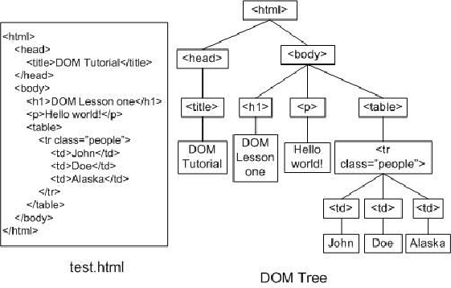
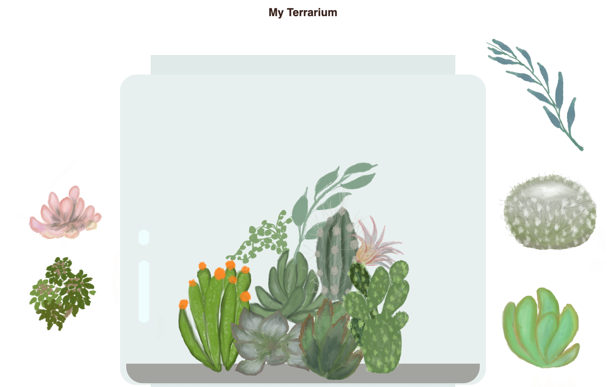

# Terrarium Project Part 3: DOM Manipulación y cierre

! [DOM y un cierre](/sketchnotes/webdev101-js.png)
> Boceto de [Tomomi Imura](https://twitter.com/girlie_mac)

## [Pre-lecture prueba](https://happy-mud-02d95f10f.azurestaticapps.net/quiz/19)

### Introducción:

Manipular el DOM, o el "Modelo de objetos de documento", es un aspecto clave del desarrollo web. Según [MDN](https://developer.mozilla.org/docs/Web/API/Document_Object_Model/Introduction), "El modelo de objetos de documento (DOM) es la representación de datos de los objetos que componen la estructura y contenido de un documento en la web ". Los desafíos en torno a la manipulación de DOM en la web a menudo han sido el ímpetu detrás del uso de marcos de JavaScript en lugar de JavaScript vanilla para administrar el DOM, ¡pero lo administraremos por nuestra cuenta!

Además, esta lección presentará la idea de un [cierre de JavaScript](https://developer.mozilla.org/docs/Web/JavaScript/Closures), que puede considerar como una función encerrada por otra función para que la función interna tenga acceso al alcance de la función externa.

Usaremos un cierre para manipular el DOM.

> Piense en el DOM como un árbol, que representa todas las formas en que se puede manipular un documento de página web. Se han escrito varias API (interfaces de programas de aplicación) para que los programadores, utilizando el lenguaje de programación de su elección, puedan acceder al DOM y editarlo, cambiarlo, reorganizarlo y administrarlo de otro modo.




> Una representación del DOM y el marcado HTML que lo hace referencia. De [Olfa Nasraoui](https://www.researchgate.net/publication/221417012_Profile-Based_Focused_Crawler_for_Social_Media-Sharing_Websites)

En esta lección, completaremos nuestro proyecto de terrario interactivo creando el JavaScript que permitirá al usuario manipular las plantas en la página.

### Requisito previo:

Debería tener el HTML y CSS para su terrario construido. Al final de esta lección, podrá mover las plantas dentro y fuera del terrario arrastrándolas.

### Tarea:

En su carpeta de terrario, cree un nuevo archivo llamado `script.js`. Importe ese archivo en la sección `<head>`:


```html
	<script src="./script.js" defer></script>
```

> Nota: use `defer` cuando importe un archivo JavaScript externo en el archivo html para permitir que JavaScript se ejecute solo después de que el archivo HTML se haya cargado por completo. También podría usar el atributo `async`, que permite que el script se ejecute mientras se analiza el archivo HTML, pero en nuestro caso, es importante tener los elementos HTML completamente disponibles para arrastrar antes de permitir que se ejecute el script de arrastre.
---

## 1. Los elementos DOM

Lo primero que debe hacer es crear referencias a los elementos que desea manipular en el DOM. En nuestro caso, son las 14 plantas que esperan actualmente en las barras laterales.


### Tarea:

```html
dragElement(document.getElementById('plant1'));
dragElement(document.getElementById('plant2'));
dragElement(document.getElementById('plant3'));
dragElement(document.getElementById('plant4'));
dragElement(document.getElementById('plant5'));
dragElement(document.getElementById('plant6'));
dragElement(document.getElementById('plant7'));
dragElement(document.getElementById('plant8'));
dragElement(document.getElementById('plant9'));
dragElement(document.getElementById('plant10'));
dragElement(document.getElementById('plant11'));
dragElement(document.getElementById('plant12'));
dragElement(document.getElementById('plant13'));
dragElement(document.getElementById('plant14'));
```

¿Que está pasando aqui? Está haciendo referencia al documento y mirando a través de su DOM para encontrar un elemento con un Id particular. ¿Recuerda en la primera lección sobre HTML que le dio ID individuales a cada imagen de planta (`id = "plant1"`)? Ahora harás uso de ese esfuerzo. Después de identificar cada elemento, pasa ese elemento a una función llamada `dragElement` que creará en un minuto. Por lo tanto, el elemento en el HTML ahora está habilitado para arrastrar, o lo estará en breve.

✅ ¿Por qué hacemos referencia a elementos por Id? ¿Por qué no por su clase de CSS? Puede consultar la lección anterior sobre CSS para responder a esta pregunta.

---

## 2. El cierre

Ahora está listo para crear el cierre dragElement, que es una función externa que encierra una función o funciones internas (en nuestro caso, tendremos tres).

Los cierres son útiles cuando una o más funciones necesitan acceder al alcance de una función externa. He aquí un ejemplo:

```javascript
function displayCandy(){
	let candy = ['jellybeans];
	function addCandy(candyType) {
		candy.push(candyType)
	}
	addCandy('gumdrops');
}
displayCandy();
console.log(candy)
```

En este ejemplo, la función displayCandy rodea una función que inserta un nuevo tipo de caramelo en una matriz que ya existe en la función. Si tuviera que ejecutar este código, la matriz `candy` no estaría definida, ya que es una variable local (local al cierre).

✅ ¿Cómo se puede hacer accesible la matriz de `candy`? Intente moverlo fuera del cierre. De esta manera, la matriz se vuelve global, en lugar de permanecer solo disponible para el alcance local del cierre.

### Tarea:

Debajo de las declaraciones de elementos en `script.js`, crea una función:


```javascript
function dragElement(terrariumElement) {
	//establecer 4 posiciones para posicionar en la pantalla
	let pos1 = 0,
		pos2 = 0,
		pos3 = 0,
		pos4 = 0;
	terrariumElement.onpointerdown = pointerDrag;
}
```

`dragElement` obtiene su objeto` terrariumElement` de las declaraciones en la parte superior del script. Luego, establece algunas posiciones locales en "0" para el objeto pasado a la función. Estas son las variables locales que se manipularán para cada elemento a medida que agrega la funcionalidad de arrastrar y soltar dentro del cierre de cada elemento. El terrario estará poblado por estos elementos arrastrados, por lo que la aplicación debe realizar un seguimiento de dónde se colocan.

Además, al terrariumElement que se pasa a esta función se le asigna un evento `pointerdown`, que forma parte de las [API web](https://developer.mozilla.org/docs/Web/API) diseñadas para ayudar con la gestión del DOM. `Onpointerdown` se dispara cuando se presiona un botón, o en nuestro caso, se toca un elemento que se puede arrastrar. Este controlador de eventos funciona tanto en [navegadores web como móviles](https://caniuse.com/?search=onpointerdown), con algunas excepciones.

✅ El [controlador de eventos `onclick`](https://developer.mozilla.org/docs/Web/API/GlobalEventHandlers/onclick) tiene mucho más soporte entre navegadores; ¿Por qué no lo usarías aquí? Piense en el tipo exacto de interacción de pantalla que está intentando crear aquí.

---

## 3. La función Pointerdrag

El terrariumElement está listo para ser arrastrado; cuando se dispara el evento `onpointerdown`, se invoca la función `pointerDrag`. Agrega esa función justo debajo de esta línea: `terrariumElement.onpointerdown = pointerDrag;`:

### Tarea: 

```javascript
function pointerDrag(e) {
	e.preventDefault();
	console.log(e);
	pos3 = e.clientX;
	pos4 = e.clientY;
}
```

Suceden varias cosas. Primero, evita que ocurran los eventos predeterminados que normalmente ocurren en el puntero hacia abajo usando `e.preventDefault ();`. De esta manera, tiene más control sobre el comportamiento de la interfaz.

> Regrese a esta línea cuando haya construido el archivo de script por completo y pruébelo sin `e.preventDefault ()`- ¿qué sucede?

En segundo lugar, abra `index.html` en una ventana del navegador e inspeccione la interfaz. Cuando hace clic en una planta, puede ver cómo se captura el evento 'e'. ¡Profundice en el evento para ver cuánta información recopila un evento de puntero hacia abajo!

A continuación, observe cómo las variables locales `pos3` y` pos4` se establecen en e.clientX. Puede encontrar los valores de `e` en el panel de inspección. Estos valores capturan las coordenadas xey de la planta en el momento en que hace clic en ella o la toca. Necesitará un control detallado sobre el comportamiento de las plantas al hacer clic en ellas y arrastrarlas, de modo que pueda realizar un seguimiento de sus coordenadas.

✅ ¿Está cada vez más claro por qué toda esta aplicación está construida con un gran cierre? Si no fuera así, ¿cómo mantendría el alcance para cada una de las 14 plantas arrastrables?

Complete la función inicial agregando dos manipulaciones de eventos de puntero más en `pos4 = e.clientY`:

```html
document.onpointermove = elementDrag;
document.onpointerup = stopElementDrag;
```
Ahora está indicando que desea que la planta se arrastre junto con el puntero mientras la mueve, y que el gesto de arrastre se detenga cuando anule la selección de la planta. `Onpointermove` y `onpointerup` son partes de la misma API que `onpointerdown`. La interfaz arrojará errores ahora ya que aún no ha definido las funciones `elementDrag` y `stopElementDrag`, así que compárelas a continuación.

## 4. Las funciones elementDrag y stopElementDrag

Completarás tu cierre agregando dos funciones internas más que se encargarán de lo que sucede cuando arrastras una planta y dejas de arrastrarla. El comportamiento que desea es que pueda arrastrar cualquier planta en cualquier momento y colocarla en cualquier lugar de la pantalla. Esta interfaz no tiene opiniones (no hay zona de caída, por ejemplo) para permitirle diseñar su terrario exactamente como le gusta agregando, quitando y reposicionando plantas.

### Tarea:

Agrega la función `elementDrag` justo después del corchete de cierre de `pointerDrag`:

```javascript
function elementDrag(e) {
	pos1 = pos3 - e.clientX;
	pos2 = pos4 - e.clientY;
	pos3 = e.clientX;
	pos4 = e.clientY;
	console.log(pos1, pos2, pos3, pos4);
	terrariumElement.style.top = terrariumElement.offsetTop - pos2 + 'px';
	terrariumElement.style.left = terrariumElement.offsetLeft - pos1 + 'px';
}
```
En esta función, usted edita mucho las posiciones iniciales 1-4 que establece como variables locales en la función externa. ¿Que está pasando aqui?

A medida que arrastra, reasigna `pos1` haciéndolo igual a `pos3` (que configuró anteriormente como `e.clientX`) menos el valor actual de `e.clientX`. Realiza una operación similar a `pos2`. Luego, restablece `pos3` y `pos4` a las nuevas coordenadas X e Y del elemento. Puede ver estos cambios en la consola mientras arrastra. Luego, manipula el estilo CSS de la planta para establecer su nueva posición en función de las nuevas posiciones de `pos1` y` pos2`, calculando las coordenadas X e Y superior e izquierda de la planta en función de la comparación de su desplazamiento con estas nuevas posiciones.

> `OffsetTop` y `offsetLeft` son propiedades CSS que establecen la posición de un elemento basándose en la de su padre; su padre puede ser cualquier elemento que no esté posicionado como "estático".

Todo este recálculo de posicionamiento le permite afinar el comportamiento del terrario y sus plantas.

### Tarea:

La tarea final para completar la interfaz es agregar la función `closeElementDrag` después del corchete de cierre de `elementDrag`:

```javascript
function stopElementDrag() {
	document.onpointerup = null;
	document.onpointermove = null;
}
```

Esta pequeña función restablece los eventos `onpointerup` y `onpointermove` para que pueda reiniciar el progreso de su planta comenzando a arrastrarla nuevamente, o comenzar a arrastrar una nueva planta.

✅ ¿Qué sucede si no configura estos eventos como nulos?

¡Ahora has completado tu proyecto!

---

🥇¡Felicitaciones! Has terminado tu hermoso terrario. 

🚀Challenge: agregue un nuevo controlador de eventos a su cierre para hacer algo más en las plantas; por ejemplo, haga doble clic en una planta para traerla al frente. ¡Se creativo!

## [Post-lecture prueba](https://happy-mud-02d95f10f.azurestaticapps.net/quiz/20)

## Revisión y autoestudio

Si bien arrastrar elementos por la pantalla parece trivial, hay muchas formas de hacerlo y muchas trampas, según el efecto que busque. De hecho, hay una [API de arrastrar y soltar](https://developer.mozilla.org/docs/Web/API/HTML_Drag_and_Drop_API) completa que puedes probar. No lo usamos en este módulo porque el efecto que queríamos era algo diferente, pero pruebe esta API en su propio proyecto y vea lo que puede lograr.

** Tarea: [Trabajar un poco más con el DOM](assignment.es.md)

