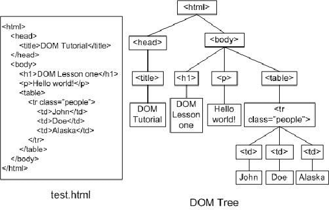

# टेरारियम प्रोजेक्ट पार्ट 3: DOM मैनिपुलेशन और एक क्लोजर


> [टोमोमी इमुरा](https://twitter.com/girlie_mac) द्वारा स्केचनेट

## पूर्व व्याख्यान प्रश्नोत्तरी

[पूर्व व्याख्यान प्रश्नोत्तरी](https://ff-quizzes.netlify.app/web/quiz/19?loc=hi)

### परिचय

DOM, या "Document Object Model" में हेरफेर, वेब विकास का एक प्रमुख पहलू है। [MDN](https://developer.mozilla.org/docs/Web/API/Document_Object_Model/Introduction) के अनुसार, "The Document Object Model (DOM) संरचना को समाहित करने वाली वस्तुओं का डेटा प्रतिनिधित्व है। और वेब पर एक दस्तावेज़ की सामग्री। " वेब पर DOM हेरफेर के आसपास की चुनौतियाँ अक्सर DOM का प्रबंधन करने के लिए वैनिला जावास्क्रिप्ट के बजाय जावास्क्रिप्ट चौखटे का उपयोग करने के पीछे होती हैं, लेकिन हम अपने दम पर प्रबंधित करेंगे!

इसके अलावा, यह पाठ एक [जावास्क्रिप्ट क्लोजर](https://developer.mozilla.org/docs/Web/JavaScript/Closures) के विचार को पेश करेगा, जिसे आप दूसरे से संलग्न फ़ंक्शन के रूप में सोच सकते हैं कार्य करें ताकि आंतरिक फ़ंक्शन बाहरी फ़ंक्शन के दायरे तक पहुंच सके।

> जावास्क्रिप्ट क्लोजर एक विशाल और जटिल विषय है। यह सबक सबसे बुनियादी विचार पर छूता है कि इस टेरारियम के कोड में, आपको एक बंद मिलेगा: एक आंतरिक फ़ंक्शन और एक बाहरी फ़ंक्शन, जो बाहरी फ़ंक्शन के दायरे में आंतरिक फ़ंक्शन का उपयोग करने की अनुमति देता है। यह कैसे काम करता है, इस बारे में अधिक जानकारी के लिए, कृपया [व्यापक प्रलेखन](https://developer.mozilla.org/docs/Web/JavaScript/Closures) पर जाएँ।

हम DOM को हेरफेर करने के लिए एक क्लोशर का उपयोग करेंगे।

DOM को एक पेड़ के रूप में सोचें, उन सभी तरीकों का प्रतिनिधित्व करता है जो एक वेब पेज दस्तावेज़ में हेरफेर किया जा सकता है। विभिन्न एपीआई (एप्लिकेशन प्रोग्राम इंटरफेस) लिखे गए हैं ताकि प्रोग्रामर अपनी पसंद की प्रोग्रामिंग भाषा का उपयोग करके, DOM तक पहुंच सकें और इसे संपादित, बदल सकें, पुनर्व्यवस्थित कर सकें और अन्यथा इसका प्रबंधन कर सकें।



> DOM और HTML मार्कअप का प्रतिनिधित्व जो इसे संदर्भित करता है। [ओलाफा नसरौई](https://www.researchgate.net/publication/221417012_Profile-Based_Focused_Crawler_for_Social_Media-Sharing_Websites) से

इस पाठ में, हम जावास्क्रिप्ट बनाकर अपनी इंटरैक्टिव टेरारियम परियोजना को पूरा करेंगे जो उपयोगकर्ता को पृष्ठ पर पौधों को हेरफेर करने की अनुमति देगा।

### शर्त

आपके पास निर्मित टेरारियम के लिए आपके पास HTML और CSS होना चाहिए। इस पाठ के अंत तक आप पौधों को खींचकर टेरारियम में ले जा सकेंगे।

### टास्क

अपने टेरारियम फ़ोल्डर में, `script.js` नामक एक नई फ़ाइल बनाएँ। उस फ़ाइल को `<head>` अनुभाग में आयात करें:

```html
	<script src="./script.js" defer></script>
```

> नोट: HTML फ़ाइल में एक बाहरी जावास्क्रिप्ट फ़ाइल आयात करते समय `defer` का उपयोग करें ताकि HTML फ़ाइल पूरी तरह से लोड होने के बाद ही जावास्क्रिप्ट निष्पादित हो सके। आप `async` विशेषता का भी उपयोग कर सकते हैं, जो स्क्रिप्ट को निष्पादित करने की अनुमति देता है जबकि HTML फ़ाइल पार्सिंग है, लेकिन हमारे मामले में, ड्रैग स्क्रिप्ट को निष्पादित करने की अनुमति देने से पहले HTML तत्वों को खींचने के लिए पूरी तरह से उपलब्ध होना आवश्यक है।
---

## डोम तत्व

पहली चीज जो आपको करने की ज़रूरत है वह उन तत्वों के संदर्भ बनाना है जिन्हें आप DOM में हेरफेर करना चाहते हैं। हमारे मामले में, वे 14 पौधे हैं जो वर्तमान में साइड बार में इंतजार कर रहे हैं।

### टास्क

```html
dragElement(document.getElementById('plant1'));
dragElement(document.getElementById('plant2'));
dragElement(document.getElementById('plant3'));
dragElement(document.getElementById('plant4'));
dragElement(document.getElementById('plant5'));
dragElement(document.getElementById('plant6'));
dragElement(document.getElementById('plant7'));
dragElement(document.getElementById('plant8'));
dragElement(document.getElementById('plant9'));
dragElement(document.getElementById('plant10'));
dragElement(document.getElementById('plant11'));
dragElement(document.getElementById('plant12'));
dragElement(document.getElementById('plant13'));
dragElement(document.getElementById('plant14'));
```

यहाँ क्या चल रहा है? आप दस्तावेज़ को संदर्भित कर रहे हैं और किसी विशेष आईडी के साथ एक तत्व खोजने के लिए इसके DOM के माध्यम से देख रहे हैं। HTML पर पहले पाठ में याद रखें कि आपने प्रत्येक संयंत्र छवि (`id="plant1"`) के लिए अलग-अलग Ids दिए हैं? अब आप उस प्रयास का उपयोग करेंगे। प्रत्येक तत्व की पहचान करने के बाद, आप उस आइटम को `dragElement` नामक एक फ़ंक्शन में पास करते हैं जिसे आप एक मिनट में बनाएंगे। इस प्रकार, HTML में तत्व अब ड्रैग-सक्षम है, या शीघ्र ही होगा।

✅ हम आईडी द्वारा तत्वों का संदर्भ क्यों देते हैं? उनके CSS क्लास के द्वारा क्यों नहीं? आप इस प्रश्न का उत्तर देने के लिए CSS के पिछले पाठ का उल्लेख कर सकते हैं।

---

## थे क्लोशर

अब आप DragElement बंद करने के लिए तैयार हैं, जो एक बाहरी फ़ंक्शन है जो एक आंतरिक फ़ंक्शन या फ़ंक्शन को संलग्न करता है (हमारे मामले में, हमारे पास तीन होंगे)।

बाहरी फ़ंक्शन के कार्यक्षेत्र तक पहुँचने के लिए क्लोज़र उपयोगी होते हैं। यहाँ एक उदाहरण है:

```javascript
function displayCandy(){
	let candy = ['jellybeans'];
	function addCandy(candyType) {
		candy.push(candyType)
	}
	addCandy('gumdrops');
}
displayCandy();
console.log(candy)
```

इस उदाहरण में, DisplayCandy फ़ंक्शन एक फ़ंक्शन को घेरता है जो एक नए कैंडी प्रकार को एक सरणी में धकेलता है जो पहले से ही फ़ंक्शन में मौजूद है। यदि आप इस कोड को चलाते हैं, तो `candy` सरणी अपरिभाषित होगी, क्योंकि यह एक स्थानीय चर (बंद करने के लिए स्थानीय) है।

✅ आप `candy` अरै को कैसे सुलभ बना सकते हैं? इसे बंद करने के बाहर ले जाने की कोशिश करें। इस तरह, यह सरणी वैश्विक हो जाती है, बजाए केवल बंद होने के स्थानीय दायरे के उपलब्ध होने के।

### टास्क

`Script.js` में तत्व घोषणाओं के तहत, एक फ़ंक्शन बनाएँ:

```javascript
function dragElement(terrariumElement) {
	//set 4 positions for positioning on the screen
	let pos1 = 0,
		pos2 = 0,
		pos3 = 0,
		pos4 = 0;
	terrariumElement.onpointerdown = pointerDrag;
}
```

`dragElement` स्क्रिप्ट के शीर्ष पर घोषणाओं से अपनी `terrariumElement` वस्तु प्राप्त करें। फिर, आप फ़ंक्शन में पारित ऑब्जेक्ट के लिए `0` पर कुछ स्थानीय स्थिति निर्धारित करते हैं। ये स्थानीय चर हैं जिन्हें प्रत्येक तत्व के लिए हेरफेर किया जाएगा क्योंकि आप प्रत्येक तत्व को बंद करने के भीतर खींचें और ड्रॉप कार्यक्षमता जोड़ते हैं। टेरारियम को इन घसीटे गए तत्वों द्वारा पॉपुलेट किया जाएगा, इसलिए एप्लिकेशन को इस बात पर नज़र रखने की आवश्यकता है कि उन्हें कहाँ रखा गया है।

इसके अलावा, इस फ़ंक्शन को पारित किए जाने वाले टेरारियम ईमेंट को एक `onpointerdown` ईवेंट सौंपा गया है, जो [वेब एपीआई](https://developer.mozilla.org/docs/Web/API) का एक हिस्सा है। डोम प्रबंधन के साथ मदद करने के लिए। `onpointerdown` एक बटन धकेलने पर, या हमारे मामले में, एक ड्रैग करने योग्य तत्व को छू जाता है। यह ईवेंट हैंडलर कुछ अपवादों के साथ [वेब और मोबाइल ब्राउज़र](https://caniuse.com/?search=onpointerdown) दोनों पर काम करता है।

✅ [ईवेंट हैंडलर `onclick`](https://developer.mozilla.org/docs/Web/API/GlobalEventHandlers/onclick) को अधिक समर्थन क्रॉस-ब्राउज़र है; आप इसका उपयोग यहां क्यों नहीं करेंगे? स्क्रीन निर्माण के सटीक प्रकार के बारे में सोचें जिसे आप यहाँ बनाने का प्रयास कर रहे हैं।

---

## पॉइंटरड्रैग फ़ंक्शन

terrariumElement को घसीटने के लिए तैयार है; जब `onpointerdown` ईवेंट को निकाल दिया जाता है, तो फ़ंक्शन पॉइंटरड्रैग को आमंत्रित किया जाता है। इस पंक्ति के नीचे उस फ़ंक्शन को जोड़ें: `terrariumElement.onpointerdown = pointerDrag;`:

### टास्क

```javascript
function pointerDrag(e) {
	e.preventDefault();
	console.log(e);
	pos3 = e.clientX;
	pos4 = e.clientY;
}
```

कई चीजें होती हैं। सबसे पहले, आप डिफ़ॉल्ट ईवेंट्स को इंगित करते हैं जो आमतौर पर पॉइंटरडाउन पर होता है `e.preventDefault ();` का उपयोग करके। इस तरह से आपके पास इंटरफ़ेस के व्यवहार पर अधिक नियंत्रण है।

> जब आप पूरी तरह से स्क्रिप्ट फ़ाइल का निर्माण कर चुके हों और `e.preventDefault ()` के बिना प्रयास करें - इस पंक्ति में वापस आएं - क्या होता है?

दूसरा, ब्राउज़र विंडो में `index.html` खोलें, और इंटरफ़ेस का निरीक्षण करें। जब आप किसी प्लांट पर क्लिक करते हैं, तो आप देख सकते हैं कि 'e' ईवेंट कैसे कैप्चर किया जाता है। घटना में खुदाई करके देखें कि एक सूचक डाउन घटना द्वारा कितनी जानकारी एकत्र की जाती है!

इसके बाद, ध्यान दें कि कैसे स्थानीय चर `pos3` और` pos4` को e.clientX पर सेट किया जाता है। आप निरीक्षण फलक में `e` मान पा सकते हैं। ये मान उस समय संयंत्र के x और y निर्देशांक को कैप्चर करते हैं जब आप उस पर क्लिक करते हैं या उसे स्पर्श करते हैं। जब आप क्लिक करते हैं और उन्हें खींचते हैं, तो आपको पौधों के व्यवहार पर ठीक-ठीक नियंत्रण की आवश्यकता होगी, इसलिए आप उनके निर्देशांक पर नज़र रखें।

✅ क्या यह अधिक स्पष्ट हो रहा है कि इस पूरे ऐप को एक बड़े क्लोजर के साथ क्यों बनाया गया है? यदि यह नहीं था, तो आप 14 ड्रैगेबल पौधों में से प्रत्येक के लिए गुंजाइश कैसे बनाए रखेंगे?

`pos4 = e.clientY` के तहत दो और पॉइंटर इवेंट जोड़-तोड़ जोड़कर प्रारंभिक कार्य पूरा करें:

```html
document.onpointermove = elementDrag;
document.onpointerup = stopElementDrag;
```
अब आप यह संकेत दे रहे हैं कि आप चाहते हैं कि प्लांट आपको पॉइंटर के साथ-साथ खींचे, और जब आप प्लांट को अचयनित करते हैं, तब उसे रोकने के लिए जेस्चर को खींचे। `onpointermove` और` onpointerup` एक ही API के सभी भाग `onpointerdown` के रूप में हैं। इंटरफ़ेस अब त्रुटियों को फेंक देगा क्योंकि आपने अभी तक `elementDrag` और `stopElementDrag` फ़ंक्शन को परिभाषित नहीं किया है, इसलिए उन लोगों का निर्माण करेंt.

## elementDrag और stopElementDrag फंगक्शनस 

आप दो और आंतरिक कार्यों को जोड़कर अपने बंद को पूरा करेंगे जो तब होगा जब आप किसी पौधे को खींचते हैं और उसे खींचना बंद कर देंगे। जो व्यवहार आप चाहते हैं, वह यह है कि आप किसी भी समय किसी भी पौधे को खींच सकते हैं और स्क्रीन पर कहीं भी रख सकते हैं। यह इंटरफ़ेस काफी गैर-राय है (उदाहरण के लिए कोई ड्रॉप ज़ोन नहीं है) आपको अपने टेरारियम को ठीक उसी तरह से डिज़ाइन करने की अनुमति देता है, जैसे आप पौधों को जोड़कर, हटाकर और रिपोजिट करके।

### टास्क

`PointerDrag` के समापन घुंघराले ब्रैकेट के ठीक बाद `elementDrag` फ़ंक्शन जोड़ें।

```javascript
function elementDrag(e) {
	pos1 = pos3 - e.clientX;
	pos2 = pos4 - e.clientY;
	pos3 = e.clientX;
	pos4 = e.clientY;
	console.log(pos1, pos2, pos3, pos4);
	terrariumElement.style.top = terrariumElement.offsetTop - pos2 + 'px';
	terrariumElement.style.left = terrariumElement.offsetLeft - pos1 + 'px';
}
```
इस फ़ंक्शन में, आप प्रारंभिक पदों 1-4 का बहुत अधिक संपादन करते हैं जो आप बाहरी फ़ंक्शन में स्थानीय चर के रूप में सेट करते हैं। यहाँ क्या चल रहा है?

जैसा कि आप खींचते हैं, आप `pos1` को` pos3` (जिसे आप पहले `e.clientX` के रूप में सेट करते हैं) के बराबर करके वर्तमान` e.clientX` मान को पुन: असाइन करते हैं। आप `pos2` के समान ऑपरेशन करते हैं। फिर, आप तत्व के नए X और Y निर्देशांक के लिए `pos3` और `pos4` को रीसेट करते हैं। जैसे ही आप ड्रैग करते हैं आप इन बदलावों को कंसोल में देख सकते हैं। फिर, आप प्लांट की सीएसएस शैली में हेरफेर करते हैं, ताकि पॉज़ के शीर्ष और बाएं एक्स और वाई निर्देशांक की गणना इन नए पदों के साथ तुलना करने के आधार पर `pos1` और `pos2` के नए पदों के आधार पर अपनी नई स्थिति निर्धारित कर सकें।

> `offsetTop` और `offsetLeft` सीएसएस गुण हैं जो एक तत्व की स्थिति को उसके पेरेंट्स के आधार पर निर्धारित करते हैं; इसका मूल कोई भी तत्व हो सकता है जिसे `static` के रूप में तैनात नहीं किया जाता है।

स्थिति के इस सभी पुनर्गणना से आपको टेरारियम और उसके पौधों के व्यवहार को ठीक करने की अनुमति मिलती है।

### टास्क

इंटरफ़ेस को पूरा करने के लिए अंतिम कार्य `elementDrag` के समापन कर्ली ब्रैकेट के बाद `stopElementDrag` फ़ंक्शन को जोड़ना है:

```javascript
function stopElementDrag() {
	document.onpointerup = null;
	document.onpointermove = null;
}
```

यह छोटा फ़ंक्शन `onpointerup` और `onpointermove` इवेंट्स को रीसेट करता है ताकि आप या तो अपने प्लांट की प्रगति को फिर से खींचना शुरू कर सकें, या एक नए प्लांट को खींचना शुरू कर सकें।

✅ यदि आप इन घटनाओं को नल करने के लिए सेट नहीं करते हैं तो क्या होगा?

अब आपने अपना प्रोजेक्ट पूरा कर लिया है!

🥇बधाई हो! आपने अपना सुंदर टेरारियम पूरा कर लिया है। [समाप्त टेरारियम](../images/terrarium-final.png)

---

## 🚀चुनौती

पौधों को कुछ और करने के लिए अपने क्लोशर करने के लिए नया ईवेंट हैंडलर जोड़ें; उदाहरण के लिए, किसी पौधे को सामने लाने के लिए उस पर डबल-क्लिक करें। रचनात्मक हो!

## व्याख्यान उपरांत प्रश्नोत्तरी

[व्याख्यान उपरांत प्रश्नोत्तरी](https://ff-quizzes.netlify.app/web/quiz/20?loc=hi)

## समीक्षा और स्व अध्ययन

स्क्रीन के चारों ओर तत्वों को खींचते समय तुच्छ लगता है, ऐसा करने के कई तरीके और कई नुकसान हैं, जो आपके चाहने वाले प्रभाव पर निर्भर करता है। वास्तव में, एक संपूर्ण [ड्रैग एंड ड्रॉप एपीआई](https://developer.mozilla.org/docs/Web/API/HTML_Drag_and_Drop_API) है जिसे आप आज़मा सकते हैं। हमने इसका उपयोग इस मॉड्यूल में नहीं किया क्योंकि हम जो प्रभाव चाहते थे वह कुछ अलग था, लेकिन इस एपीआई को अपने प्रोजेक्ट पर आज़माएँ और देखें कि आप क्या हासिल कर सकते हैं।

[W3C डॉक्स](https://www.w3.org/TR/pointerevents1/) और [MDN वेब डॉक्स](https://developer.mozilla.org/docs/Web/API/Pointer_events) पर सूचक घटनाओं के बारे में अधिक जानकारी प्राप्त करें।

हमेशा [CanIUse.com] (https://caniuse.com/) का उपयोग करके ब्राउज़र क्षमताओं की जाँच करें।

## असाइनमेंट

[DOM के साथ थोड़ा और काम करें](assignment.hi.md)

