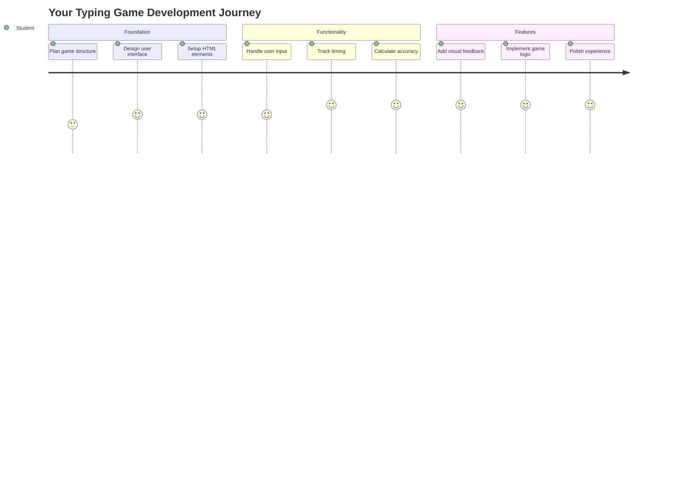
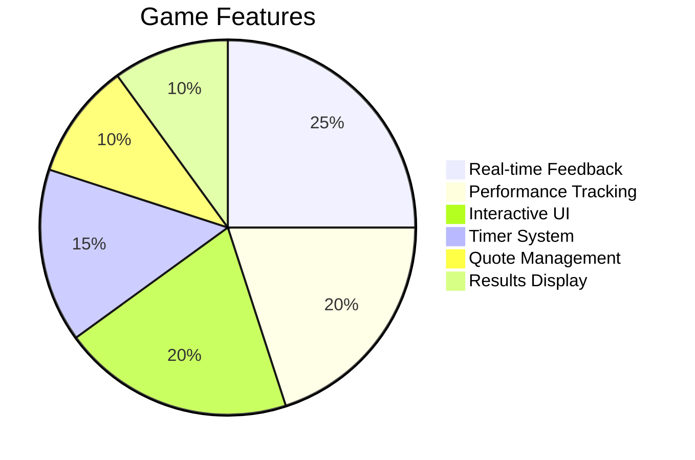
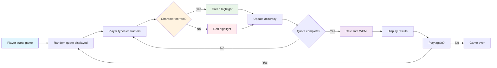
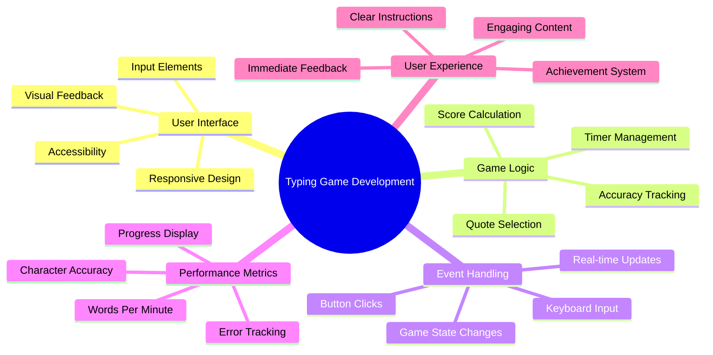
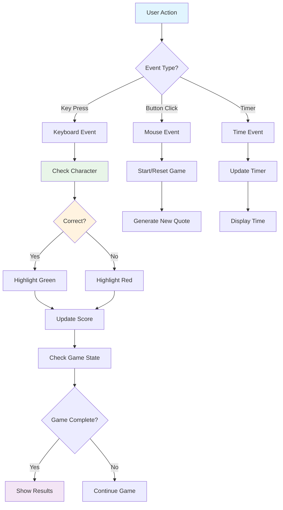
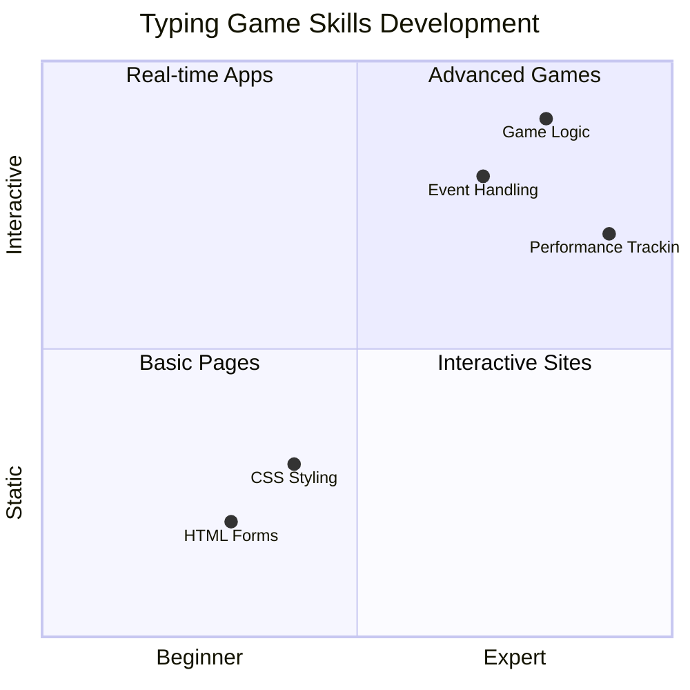
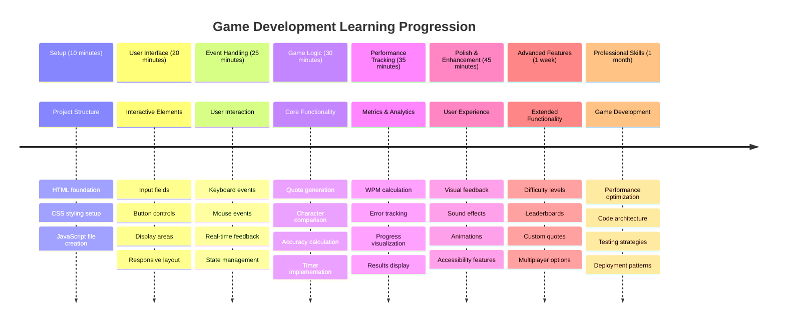

# Event-Driven Programming - Build a Typing Game

## Introduction

Here's something every developer knows but rarely talks about: typing fast is a superpower! 🚀 Think about it - the faster you can get your ideas from your brain to your code editor, the more your creativity can flow. It's like having a direct pipeline between your thoughts and the screen.

Want to know one of the best ways to level up this skill? You guessed it - we're going to build a game!

> Let's create an awesome typing game together!

Ready to put all those JavaScript, HTML, and CSS skills you've been learning to work? We're going to build a typing game that'll challenge you with random quotes from the legendary detective [Sherlock Holmes](https://en.wikipedia.org/wiki/Sherlock_Holmes). The game will track how fast and accurately you can type - and trust me, it's more addictive than you might think!

## What You'll Need to Know

Before we dive in, make sure you're comfortable with these concepts (don't worry if you need a quick refresher - we've all been there!):

- Creating text input and button controls
- CSS and setting styles using classes  
- JavaScript basics
  - Creating an array
  - Creating a random number
  - Getting the current time

If any of these feel a bit rusty, that's totally fine! Sometimes the best way to solidify your knowledge is by jumping into a project and figuring things out as you go.

### 🔄 **Pedagogical Check-in**
**Foundation Assessment**: Before starting development, ensure you understand:
- ✅ How HTML forms and input elements work
- ✅ CSS classes and dynamic styling
- ✅ JavaScript event listeners and handlers
- ✅ Array manipulation and random selection
- ✅ Time measurement and calculations

**Quick Self-Test**: Can you explain how these concepts work together in an interactive game?
- **Events** trigger when users interact with elements
- **Handlers** process those events and update game state
- **CSS** provides visual feedback for user actions
- **Timing** enables performance measurement and game progression

## Let's Build This Thing!

[Creating a typing game by using event driven programming](./typing-game/README.md)

### ⚡ **What You Can Do in the Next 5 Minutes**
- [ ] Open your browser console and try listening for keyboard events with `addEventListener`
- [ ] Create a simple HTML page with an input field and test typing detection
- [ ] Practice string manipulation by comparing typed text with target text
- [ ] Experiment with `setTimeout` to understand timing functions

### 🎯 **What You Can Accomplish This Hour**
- [ ] Complete the post-lesson quiz and understand event-driven programming
- [ ] Build a basic version of the typing game with word validation
- [ ] Add visual feedback for correct and incorrect typing
- [ ] Implement a simple scoring system based on speed and accuracy
- [ ] Style your game with CSS to make it visually appealing

### 📅 **Your Week-Long Game Development**
- [ ] Complete the full typing game with all features and polish
- [ ] Add difficulty levels with varying word complexity
- [ ] Implement user statistics tracking (WPM, accuracy over time)
- [ ] Create sound effects and animations for better user experience
- [ ] Make your game mobile-responsive for touch devices
- [ ] Share your game online and gather feedback from users

### 🌟 **Your Month-Long Interactive Development**
- [ ] Build multiple games exploring different interaction patterns
- [ ] Learn about game loops, state management, and performance optimization
- [ ] Contribute to open source game development projects
- [ ] Master advanced timing concepts and smooth animations
- [ ] Create a portfolio showcasing various interactive applications
- [ ] Mentor others interested in game development and user interaction

## 🎯 Your Typing Game Mastery Timeline

### 🛠️ Your Game Development Toolkit Summary

After completing this project, you'll have mastered:
- **Event-Driven Programming**: Responsive user interfaces that react to input
- **Real-Time Feedback**: Instant visual and performance updates
- **Performance Measurement**: Accurate timing and scoring systems
- **Game State Management**: Controlling application flow and user experience
- **Interactive Design**: Creating engaging, addictive user experiences
- **Modern Web APIs**: Utilizing browser capabilities for rich interactions
- **Accessibility Patterns**: Inclusive design for all users

**Real-World Applications**: These skills directly apply to:
- **Web Applications**: Any interactive interface or dashboard
- **Educational Software**: Learning platforms and skill assessment tools
- **Productivity Tools**: Text editors, IDEs, and collaboration software
- **Gaming Industry**: Browser games and interactive entertainment
- **Mobile Development**: Touch-based interfaces and gesture handling

**Next Level**: You're ready to explore advanced game frameworks, real-time multiplayer systems, or complex interactive applications!

## Credits

Written with ♥️ by [Christopher Harrison](http://www.twitter.com/geektrainer)
