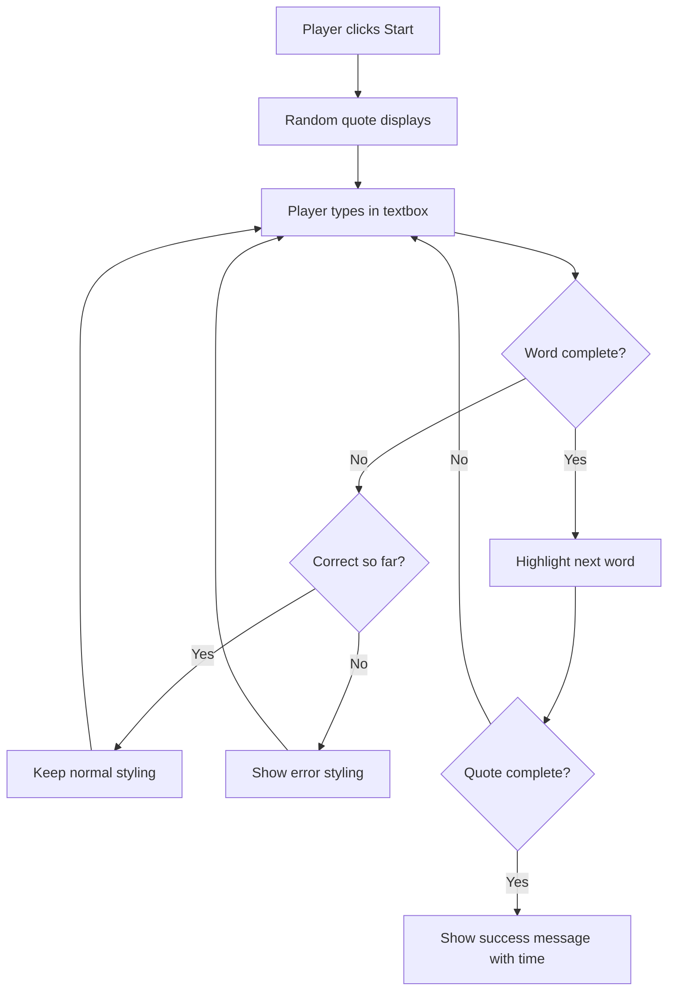
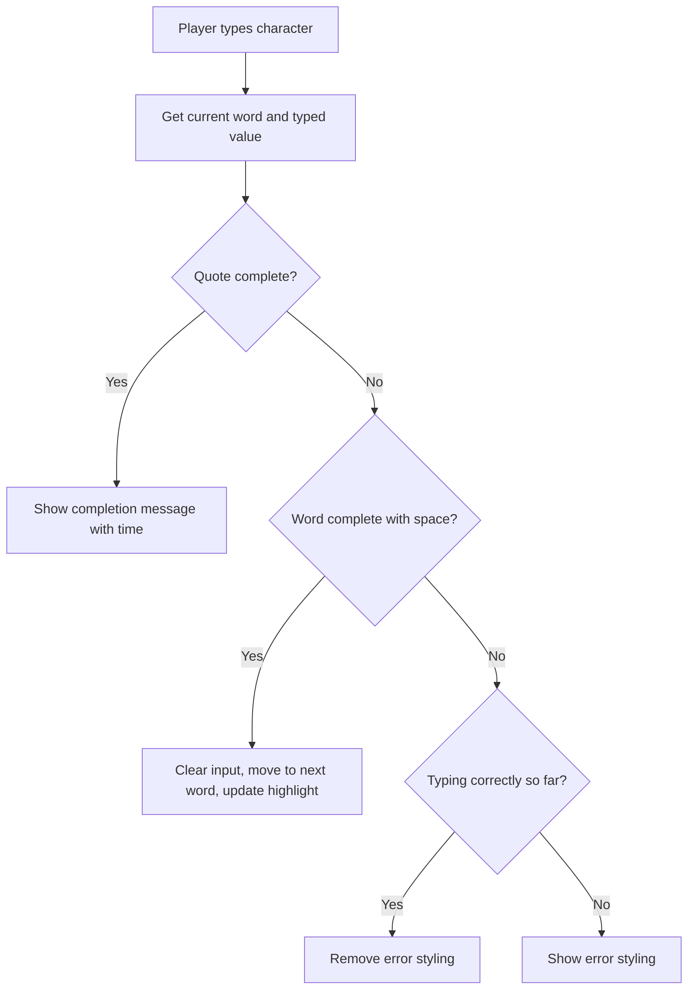

# Creating a game using events

Event-driven programming is the foundation of interactive web applications, and there's no better way to understand it than by building something fun and engaging. In this lesson, you'll create a typing speed game that responds to user interactions in real-time, teaching you how to handle events, manage application state, and create dynamic user experiences.

By building this typing game, you'll discover how web browsers communicate with your JavaScript code through events, and how to write code that responds intelligently to user actions. You'll also learn essential programming patterns that form the backbone of modern web development, from simple button clicks to complex user interfaces.

By the end of this lesson, you'll have created a fully functional typing game and gained the skills to build any interactive web application. Let's dive into the exciting world of event-driven programming and bring your web pages to life!

## Pre-Lecture Quiz

[Pre-lecture quiz](https://ff-quizzes.netlify.app/web/quiz/21)

## Event driven programming

User interaction is what makes web applications come alive, transforming static pages into dynamic, responsive experiences. Understanding how to capture and respond to user actions is fundamental to creating engaging web applications that feel intuitive and professional.

The challenge we face as developers is that we can't predict when users will click buttons, type in text fields, or interact with our interface. This uncertainty requires a different programming approach than the sequential, step-by-step code you might be familiar with.

When creating a browser based application, we provide a graphical user interface (GUI) for the user to use when interacting with what we've built. The most common way to interact with the browser is through clicking and typing in various elements. The challenge we face as a developer is we don't know when they're going to perform these operations!

[Event-driven programming](https://en.wikipedia.org/wiki/Event-driven_programming) is the name for the type of programming we need to do to create our GUI. If we break this phrase down a little bit, we see the core word here is **event**. [Event](https://www.merriam-webster.com/dictionary/event), according to Merriam-Webster, is defined as "something which happens". This describes our situation perfectly. We know something is going to happen for which we want to execute some code in response, but we don't know when it will take place.

The way we mark a section of code we want to execute is by creating a function. When we think about [procedural programming](https://en.wikipedia.org/wiki/Procedural_programming), functions are called in a specific order. This same thing is going to be true with event driven programming. The difference is **how** the functions will be called.

To handle events (button clicking, typing, etc.), we register **event listeners**. An event listener is a function which listens for an event to occur and executes in response. Event listeners can update the UI, make calls to the server, or whatever else needs to be done in response to the user's action. We add an event listener by using `addEventListener()`, and providing a function to execute.

**Here's how event listeners work:**
- **Listens** for specific user actions like clicks, keystrokes, or mouse movements
- **Executes** your custom code when the specified event occurs
- **Responds** immediately to user interactions, creating a seamless experience
- **Handles** multiple events on the same element using different listeners

> **NOTE:** It's worth highlighting there are numerous ways to create event listeners. You can use anonymous functions, or create named ones. You can use various shortcuts, like setting the `click` property, or using `addEventListener()`. In our exercise we are going to focus on `addEventListener()` and anonymous functions, as it's probably the most common technique web developers use. It's also the most flexible, as `addEventListener()` works for all events, and the event name can be provided as a parameter.

### Common events

While web browsers offer dozens of different events you can listen for, most interactive applications rely on just a handful of essential events. Understanding these core events will give you the foundation to build sophisticated user interactions.

There are [dozens of events](https://developer.mozilla.org/docs/Web/Events) available for you to listen to when creating an application. Basically anything a user does on a page raises an event, which gives you a lot of power to ensure they get the experience you desire. Fortunately, you'll normally only need a small handful of events. Here's a few common ones (including the two we'll use when creating our game):

| Event | Description | Common Use Cases |
|-------|-------------|------------------|
| `click` | The user clicked on something | Buttons, links, interactive elements |
| `contextmenu` | The user clicked the right mouse button | Custom right-click menus |
| `select` | The user highlighted some text | Text editing, copy operations |
| `input` | The user input some text | Form validation, real-time search |

**Understanding these event types:**
- **Triggers** when users interact with specific elements on your page
- **Provides** detailed information about the user's action through event objects
- **Enables** you to create responsive, interactive web applications
- **Works** consistently across different browsers and devices

## Creating the game

Now that you understand how events work, let's put that knowledge into practice by building something engaging and useful. We'll create a typing speed game that demonstrates event handling while helping you develop a crucial developer skill.

We are going to create a game to explore how events work in JavaScript. Our game is going to test a player's typing skill, which is one of the most underrated skills all developers should have. We should all be practicing our typing! The general flow of the game will look like this:



**Here's how our game will work:**
- **Starts** when the player clicks the start button and displays a random quote
- **Tracks** the player's typing progress word by word in real-time
- **Highlights** the current word to guide the player's focus
- **Provides** immediate visual feedback for typing errors
- **Calculates** and displays the total time when the quote is completed

Let's build our game, and learn about events!

### File structure

Organizing your project files properly from the start makes development smoother and helps you maintain clean, professional code. Our typing game will follow the standard web development structure that separates content, styling, and behavior.

We're going to need three total files: `index.html`, `script.js` and `style.css`. Let's start by setting those up to make life a little easier for us.

**Create a new folder for your work by opening a console or terminal window and issuing the following command:**

```bash
# Linux or macOS
mkdir typing-game && cd typing-game

# Windows
md typing-game && cd typing-game
```

**Here's what these commands do:**
- **Creates** a new directory called `typing-game` for your project files
- **Navigates** into the newly created directory automatically
- **Sets up** a clean workspace for your game development

**Open Visual Studio Code:**

```bash
code .
```

**This command:**
- **Launches** Visual Studio Code in the current directory
- **Opens** your project folder in the editor
- **Provides** access to all the development tools you'll need

**Add three files to the folder in Visual Studio Code with the following names:**
- `index.html` - Contains the structure and content of your game
- `script.js` - Handles all the game logic and event listeners
- `style.css` - Defines the visual appearance and styling

## Create the user interface

Building a user interface is like creating a blueprint for how users will interact with your application. We need to think about what elements users need to see and interact with, then structure them in a logical, accessible way.

If we explore the requirements, we know we're going to need a handful of elements on our HTML page. This is sort of like a recipe, where we need some ingredients:

| UI Element | Purpose | HTML Element |
|------------|---------|-------------|
| Quote Display | Shows the text to type | `<p>` with `id="quote"` |
| Message Area | Displays status and success messages | `<p>` with `id="message"` |
| Text Input | Where players type the quote | `<input>` with `id="typed-value"` |
| Start Button | Begins the game | `<button>` with `id="start"` |

**Understanding the UI structure:**
- **Organizes** content logically from top to bottom
- **Assigns** unique IDs to elements for JavaScript targeting
- **Provides** clear visual hierarchy for better user experience
- **Includes** semantic HTML elements for accessibility

Each of those will need IDs so we can work with them in our JavaScript. We will also add references to the CSS and JavaScript files we're going to create.

Create a new file named `index.html`. Add the following HTML:

```html
<!-- inside index.html -->
<html>
<head>
  <title>Typing game</title>
  <link rel="stylesheet" href="style.css">
</head>
<body>
  <h1>Typing game!</h1>
  <p>Practice your typing skills with a quote from Sherlock Holmes. Click **start** to begin!</p>
  <p id="quote"></p> <!-- This will display our quote -->
  <p id="message"></p> <!-- This will display any status messages -->
  <div>
    <input type="text" aria-label="current word" id="typed-value" /> <!-- The textbox for typing -->
    <button type="button" id="start">Start</button> <!-- To start the game -->
  </div>
  <script src="script.js"></script>
</body>
</html>
```

**Breaking down what this HTML structure accomplishes:**
- **Links** the CSS stylesheet in the `<head>` for styling
- **Creates** a clear heading and instructions for users
- **Establishes** placeholder paragraphs with specific IDs for dynamic content
- **Includes** an input field with accessibility attributes
- **Provides** a start button to trigger the game
- **Loads** the JavaScript file at the end for optimal performance

### Launch the application

Testing your application frequently during development helps you catch issues early and see your progress in real-time. Live Server is an invaluable tool that automatically refreshes your browser whenever you save changes, making development much more efficient.

It's always best to develop iteratively to see how things look. Let's launch our application. There's a wonderful extension for Visual Studio Code called [Live Server](https://marketplace.visualstudio.com/items?itemName=ritwickdey.LiveServer&WT.mc_id=academic-77807-sagibbon) which will both host your application locally and refresh the browser each time you save.

**Install [Live Server](https://marketplace.visualstudio.com/items?itemName=ritwickdey.LiveServer&WT.mc_id=academic-77807-sagibbon) by following the link and clicking Install:**

**Here's what happens during installation:**
- **Prompts** your browser to open Visual Studio Code
- **Guides** you through the extension installation process
- **May require** restarting Visual Studio Code to complete setup

**Once installed, in Visual Studio Code, click Ctrl-Shift-P (or Cmd-Shift-P) to open the command palette:**

**Understanding the command palette:**
- **Provides** quick access to all VS Code commands
- **Searches** commands as you type
- **Offers** keyboard shortcuts for faster development

**Type "Live Server: Open with Live Server":**

**What Live Server does:**
- **Starts** a local development server for your project
- **Automatically** refreshes the browser when you save files
- **Serves** your files from a local URL (typically `localhost:5500`)

**Open a browser and navigate to `https://localhost:5500`:**

You should now see the page you created! Let's add some functionality.

## Add the CSS

Visual feedback is essential for creating an intuitive user experience. Our CSS will provide immediate visual cues to help players understand their progress and identify errors quickly.

With our HTML created, let's add the CSS for core styling. We need to highlight the word the player should be typing, and colorize the textbox if what they've typed is incorrect. We'll do this with two classes.

Create a new file named `style.css` and add the following syntax.

```css
/* inside style.css */
.highlight {
  background-color: yellow;
}

.error {
  background-color: lightcoral;
  border: red;
}
```

**Understanding these CSS classes:**
- **Highlights** the current word with a yellow background for clear visual guidance
- **Signals** typing errors with a light coral background color
- **Provides** immediate feedback without disrupting the user's typing flow
- **Uses** contrasting colors for accessibility and clear visual communication

✅ When it comes to CSS you can layout your page however you might like. Take a little time and make the page look more appealing:

- Choose a different font
- Colorize the headers
- Resize items

## JavaScript

Now comes the exciting part – bringing your game to life with JavaScript! This is where you'll implement all the event handling, game logic, and dynamic behavior that makes your typing game interactive and engaging.

With our UI created, it's time to focus our attention on the JavaScript which will provide the logic. We're going to break this down into a handful of steps:

| Step | Purpose | What You'll Learn |
|------|---------|------------------|
| [Create the constants](#add-the-constants) | Set up quotes and DOM references | Variable management and DOM selection |
| [Event listener to start the game](#add-start-logic) | Handle game initialization | Event handling and UI updates |
| [Event listener to typing](#add-typing-logic) | Process user input in real-time | Input validation and dynamic feedback |

**This structured approach helps you:**
- **Organize** your code into logical, manageable sections
- **Build** functionality incrementally for easier debugging
- **Understand** how different parts of your application work together
- **Create** reusable patterns for future projects

But first, create a new file named `script.js`.

### Add the constants

Setting up constants and variables at the beginning of your script creates a solid foundation for your application. This approach makes your code more maintainable and helps prevent errors by establishing clear references to the elements and data you'll use throughout the game.

We're going to need a few items to make our lives a little easier for programming. Again, similar to a recipe, here's what we'll need:

| Data Type | Purpose | Example |
|-----------|---------|--------|
| Array of quotes | Store all possible quotes for the game | `['Quote 1', 'Quote 2', ...]` |
| Word array | Break current quote into individual words | `['When', 'you', 'have', ...]` |
| Word index | Track which word player is typing | `0, 1, 2, 3...` |
| Start time | Calculate elapsed time for scoring | `Date.now()` |

**We'll also need references to our UI elements:**
| Element | ID | Purpose |
|---------|----|---------|
| Text input | `typed-value` | Where players type |
| Quote display | `quote` | Shows the quote to type |
| Message area | `message` | Displays status updates |

```javascript
// inside script.js
// all of our quotes
const quotes = [
    'When you have eliminated the impossible, whatever remains, however improbable, must be the truth.',
    'There is nothing more deceptive than an obvious fact.',
    'I ought to know by this time that when a fact appears to be opposed to a long train of deductions it invariably proves to be capable of bearing some other interpretation.',
    'I never make exceptions. An exception disproves the rule.',
    'What one man can invent another can discover.',
    'Nothing clears up a case so much as stating it to another person.',
    'Education never ends, Watson. It is a series of lessons, with the greatest for the last.',
];
// store the list of words and the index of the word the player is currently typing
let words = [];
let wordIndex = 0;
// the starting time
let startTime = Date.now();
// page elements
const quoteElement = document.getElementById('quote');
const messageElement = document.getElementById('message');
const typedValueElement = document.getElementById('typed-value');
```

**Breaking down what this setup code accomplishes:**
- **Stores** an array of Sherlock Holmes quotes using `const` since the quotes won't change
- **Initializes** tracking variables with `let` since these values will update during gameplay
- **Captures** references to DOM elements using `document.getElementById()` for efficient access
- **Sets up** the foundation for all game functionality with clear, descriptive variable names
- **Organizes** related data and elements logically for easier code maintenance

✅ Go ahead and add more quotes to your game

> 💡 **Pro Tip**: We can retrieve the elements whenever we want in code by using `document.getElementById()`. Because of the fact we're going to refer to these elements on a regular basis we're going to avoid typos with string literals by using constants. Frameworks such as [Vue.js](https://vuejs.org/) or [React](https://reactjs.org/) can help you better manage centralizing your code.
>
**Here's why this approach works so well:**
- **Prevents** spelling errors when referencing elements multiple times
- **Improves** code readability with descriptive constant names
- **Enables** better IDE support with autocomplete and error checking
- **Makes** refactoring easier if element IDs change later

Take a minute to watch a video on using `const`, `let` and `var`

[](https://youtube.com/watch?v=JNIXfGiDWM8 "Types of variables")

> 🎥 Click the image above for a video about variables.

### Add start logic

The start button is where the magic begins! This is your first real implementation of event-driven programming, where you'll write code that waits patiently for user interaction and then springs into action.

To begin the game, the player will click on start. Of course, we don't know when they're going to click start. This is where an [event listener](https://developer.mozilla.org/docs/Web/API/EventTarget/addEventListener) comes into play. An event listener will allow us to listen for something to occur (an event) and execute code in response. In our case, we want to execute code when the user clicks on start.

When the user clicks `start`, we need to select a quote, setup the user interface, and setup tracking for the current word and timing. Below is the JavaScript you'll need to add; we discuss it just after the script block.

```javascript
// at the end of script.js
document.getElementById('start').addEventListener('click', () => {
  // get a quote
  const quoteIndex = Math.floor(Math.random() * quotes.length);
  const quote = quotes[quoteIndex];
  // Put the quote into an array of words
  words = quote.split(' ');
  // reset the word index for tracking
  wordIndex = 0;

  // UI updates
  // Create an array of span elements so we can set a class
  const spanWords = words.map(function(word) { return `<span>${word} </span>`});
  // Convert into string and set as innerHTML on quote display
  quoteElement.innerHTML = spanWords.join('');
  // Highlight the first word
  quoteElement.childNodes[0].className = 'highlight';
  // Clear any prior messages
  messageElement.innerText = '';

  // Setup the textbox
  // Clear the textbox
  typedValueElement.value = '';
  // set focus
  typedValueElement.focus();
  // set the event handler

  // Start the timer
  startTime = new Date().getTime();
});
```

**Let's break down the code into logical sections:**

**📊 Word Tracking Setup:**
- **Selects** a random quote using `Math.floor()` and `Math.random()` for variety
- **Converts** the quote into an array of individual words using `split(' ')`
- **Resets** the `wordIndex` to 0 since players start with the first word
- **Prepares** the game state for a fresh round

**🎨 UI Setup and Display:**
- **Creates** an array of `<span>` elements, wrapping each word for individual styling
- **Joins** the span elements into a single string for efficient DOM updating
- **Highlights** the first word by adding the `highlight` CSS class
- **Clears** any previous game messages to provide a clean slate

**⌨️ Textbox Preparation:**
- **Clears** any existing text in the input field
- **Sets focus** to the textbox so players can start typing immediately
- **Prepares** the input area for the new game session

**⏱️ Timer Initialization:**
- **Captures** the current timestamp using `new Date().getTime()`
- **Enables** accurate calculation of typing speed and completion time
- **Starts** the performance tracking for the game session

### Add typing logic

Now for the most complex and interesting part of our game – handling real-time typing input! This event listener will process every keystroke, provide immediate feedback, and manage the game's progression through the quote.

As the player types, an `input` event will be raised. This event listener will check to ensure the player is typing the word correctly, and handle the current status of the game. Returning to `script.js`, add the following code to the end. We will break it down afterwards.

```javascript
// at the end of script.js
typedValueElement.addEventListener('input', () => {
  // Get the current word
  const currentWord = words[wordIndex];
  // get the current value
  const typedValue = typedValueElement.value;

  if (typedValue === currentWord && wordIndex === words.length - 1) {
    // end of sentence
    // Display success
    const elapsedTime = new Date().getTime() - startTime;
    const message = `CONGRATULATIONS! You finished in ${elapsedTime / 1000} seconds.`;
    messageElement.innerText = message;
  } else if (typedValue.endsWith(' ') && typedValue.trim() === currentWord) {
    // end of word
    // clear the typedValueElement for the new word
    typedValueElement.value = '';
    // move to the next word
    wordIndex++;
    // reset the class name for all elements in quote
    for (const wordElement of quoteElement.childNodes) {
      wordElement.className = '';
    }
    // highlight the new word
    quoteElement.childNodes[wordIndex].className = 'highlight';
  } else if (currentWord.startsWith(typedValue)) {
    // currently correct
    // highlight the next word
    typedValueElement.className = '';
  } else {
    // error state
    typedValueElement.className = 'error';
  }
});
```

**Understanding the typing logic flow:**

This function uses a waterfall approach, checking conditions from most specific to most general. Let's break down each scenario:



**🏁 Quote Complete (Scenario 1):**
- **Checks** if typed value matches current word AND we're on the last word
- **Calculates** elapsed time by subtracting start time from current time
- **Converts** milliseconds to seconds by dividing by 1,000
- **Displays** congratulatory message with completion time

**✅ Word Complete (Scenario 2):**
- **Detects** word completion when input ends with a space
- **Validates** that trimmed input matches the current word exactly
- **Clears** the input field for the next word
- **Advances** to the next word by incrementing `wordIndex`
- **Updates** visual highlighting by removing all classes and highlighting the new word

**📝 Typing in Progress (Scenario 3):**
- **Verifies** that the current word starts with what's been typed so far
- **Removes** any error styling to show the input is correct
- **Allows** continued typing without interruption

**❌ Error State (Scenario 4):**
- **Triggers** when typed text doesn't match the expected word beginning
- **Applies** error CSS class to provide immediate visual feedback
- **Helps** players quickly identify and correct mistakes

## Test your application

Congratulations! You've built a complete typing game using event-driven programming. Testing is a crucial part of development – it's where you'll discover how your application behaves in real-world use and identify any areas for improvement.

You've made it to the end! The last step is to ensure our application works. Give it a shot! Don't worry if there are errors; **all developers** have errors. Examine the messages and debug as needed.

Click on `start`, and start typing away! It should look a little like the animation we saw before.


**What to test in your application:**
- **Verifies** that clicking Start displays a random quote
- **Confirms** that typing highlights the current word correctly
- **Checks** that error styling appears for incorrect typing
- **Ensures** that completing words advances the highlight properly
- **Tests** that finishing the quote shows the completion message with timing

**Common debugging tips:**
- **Check** the browser console (F12) for JavaScript errors
- **Verify** that all file names match exactly (case-sensitive)
- **Ensure** Live Server is running and refreshing properly
- **Test** different quotes to verify the random selection works

---

## GitHub Copilot Agent Challenge 🎮

Use the Agent mode to complete the following challenge:

**Description:** Extend the typing game by implementing a difficulty system that adjusts the game based on player performance. This challenge will help you practice advanced event handling, data analysis, and dynamic UI updates.

**Prompt:** Create a difficulty adjustment system for the typing game that:
1. Tracks the player's typing speed (words per minute) and accuracy percentage
2. Automatically adjusts to three difficulty levels: Easy (simple quotes), Medium (current quotes), Hard (complex quotes with punctuation)
3. Displays the current difficulty level and player statistics on the UI
4. Implements a streak counter that increases difficulty after 3 consecutive good performances
5. Adds visual feedback (colors, animations) to indicate difficulty changes

Add the necessary HTML elements, CSS styles, and JavaScript functions to implement this feature. Include proper error handling and ensure the game remains accessible with appropriate ARIA labels.

## 🚀 Challenge

Ready to take your typing game to the next level? Try implementing these advanced features to deepen your understanding of event handling and DOM manipulation:

**Add more functionality:**

| Feature | Description | Skills You'll Practice |
|---------|-------------|------------------------|
| **Input Control** | Disable the `input` event listener on completion, and re-enable it when the button is clicked | Event management and state control |
| **UI State Management** | Disable the textbox when the player completes the quote | DOM property manipulation |
| **Modal Dialog** | Display a modal dialog box with the success message | Advanced UI patterns and accessibility |
| **High Score System** | Store high scores using `localStorage` | Browser storage APIs and data persistence |

**Implementation tips:**
- **Research** `localStorage.setItem()` and `localStorage.getItem()` for persistent storage
- **Practice** adding and removing event listeners dynamically
- **Explore** HTML dialog elements or CSS modal patterns
- **Consider** accessibility when disabling and enabling form controls

## Post-Lecture Quiz

[Post-lecture quiz](https://ff-quizzes.netlify.app/web/quiz/22)

## Review & Self Study

Read up on [all the events available](https://developer.mozilla.org/docs/Web/Events) to the developer via the web browser, and consider the scenarios in which you would use each one.

## Assignment

[Create a new keyboard game](assignment.md)
