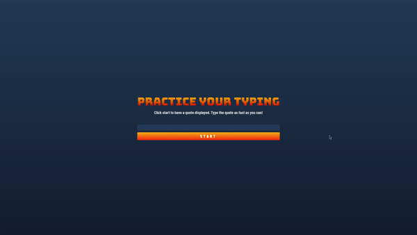

# 使用事件建立遊戲

## 課前測驗

[課前測驗](https://calm-wave-0d1a32b03.1.azurestaticapps.net/quiz/21?loc=zh_tw)

## 事件驅動程式設計

當我們建立專為瀏覽器設計的應用程式時，我們會提供 Graphical User Interface (GUI) 給用戶使用，在我們建立的格式上進行互動。最常見的互動方式是透過點擊或輸入在多樣的物件。開發者面臨的問題是，我們不了解用戶會何時對這些物件產生互動！

[事件驅動程式設計](https://zh.wikipedia.org/zh-tw/%E4%BA%8B%E4%BB%B6%E9%A9%85%E5%8B%95%E7%A8%8B%E5%BC%8F%E8%A8%AD%E8%A8%88)是一種程式設計的方式，以建立我們的 GUI。若拆解該名詞的話，我們知道主軸關鍵會是**事件（Event）**。根據 Merriam-Webster，[事件](https://www.merriam-webster.com/dictionary/event)定義為「將發生的事」。它能有效地解決我們面臨的問題。我們知道當用戶產生互動時，什麼程式必須回應其要求，只差在我們不知道用戶會何時產生互動。

藉由建立新的函式，我們可以標記這段將被運行的程式碼。我們回顧一下[程序式程式設計](https://zh.wikipedia.org/wiki/%E8%BF%87%E7%A8%8B%E5%BC%8F%E7%BC%96%E7%A8%8B)，函式會依照順序一行一行的被運行。這同樣也會被實踐在事件驅動程式設計上，差別在於**如何**去呼叫這些函式。

要處理這些事件：點擊按鈕、輸入字串等等，我們需註冊**事件監聽者（Event Listeners）**。事件監聽者是函式之一，負責回應當事件觸發時，提供相對應的回應。事件監聽者可以根據用戶的行為，更新使用者介面，呼叫伺服器，或是任何你想要它做的事。我們利用 [addEventListener](https://developer.mozilla.org/docs/Web/API/EventTarget/addEventListener) 新增事件監聽者，提供要被運行的函式。

> **注意** 值得注意我們有許多建立事件監聽者的方式。你可以使用匿名函式（anonymous functions），或是有名字的；你可以使用多種的快捷，好比直接設定 `click` 屬性，或使用 `addEventListener`。在我們練習過程中，主要專注在 `addEventLister` 與匿名函式上，它們可能是開發者最常見的網頁開發技巧。同時，也是彈性最高的： `addEventListener` 作用在任何事件，任何以參數方式輸入的事件名稱。

### 常見事件

創造應用時，這邊有[數種事件](https://developer.mozilla.org/docs/Web/Events)提供給你監聽。基本上，使用者在網頁上做的任何行為都會觸發事件，你需要花大量時間、大量精力確保它們有相對應的使用者體驗。幸運的是，你只需要處理少部分的事件類型。這邊是一些常見的事件類型，我們會使用其中兩種來建立遊戲：

- [點擊](https://developer.mozilla.org/docs/Web/API/Element/click_event)： 使用者點擊物件，通常會是按鈕或是連結。
- [右鍵選單](https://developer.mozilla.org/docs/Web/API/Element/contextmenu_event)： 使用者點擊滑鼠右鍵。
- [選取](https://developer.mozilla.org/docs/Web/API/Element/select_event)： 使用者標記特定文字。
- [輸入](https://developer.mozilla.org/docs/Web/API/Element/input_event)： 使用者輸入文字。

## 建立遊戲

現在我們藉由建立遊戲，了解事件是如何在 JavaScript 上運作的。我們的遊戲會測試玩家的打字技巧，一項程式開發員被忽略的技能之一。我們應該時刻練習打字技術！大致的遊戲流程如下：

- 玩家點擊「開始」按鈕並產生一行要被輸入的引文
- 玩家盡快地輸入這段文字到文字框中
  - 當單字輸入完畢時，立即標記下一個單字。
  - 當玩家打錯字時，將文字框轉為紅色。
  - 當玩家完成引文輸入時，顯示祝賀語與花費的時間。

讓我們開始建立遊戲，學習事件驅動吧！

### 檔案結構

我們總共需要三個檔案：**index.html**、**script.js** 與 **style.css**。我們來設定它們，以完成後續的步驟。

- 建立新的資料夾存放我們的遊戲，開啟 Console 或是終端機，輸入下列指令：

```bash
# Linux 或 macOS
mkdir typing-game && cd typing-game

# Windows
md typing-game && cd typing-game
```

- 打開文字編輯器 Visual Studio Code

```bash
code .
```

- 現在，在 Visual Studio Code 中新增三個檔案到資料夾中，分別為：
  - index.html
  - script.js
  - style.css

## 建立使用者介面

藉由回顧我們的需求，我們在 HTML 頁面上新增一些元素。這就像是看一份食譜，你需要對應的食材：

- 一個地方呈現將被輸入的引文
- 一個地方呈現任何訊息，好比祝賀文
- 一個玩家輸入的文字框
- 一個開始按鈕。

每一個物件都需要 ID ，讓 JavaScript 程式能控制它們。另外，在 HTML 檔案匯入 CSS 與 JavaScript 檔，我們等一下會編輯它們。

在新的 **index.html** 檔案中，加入下列程式碼：

```html
<!-- inside index.html -->
<html>
<head>
  <title>Typing game</title>
  <link rel="stylesheet" href="style.css">
</head>
<body>
  <h1>Typing game!</h1>
  <p>Practice your typing skills with a quote from Sherlock Holmes. Click **start** to begin!</p>
  <p id="quote"></p> <!-- This will display our quote -->
  <p id="message"></p> <!-- This will display any status messages -->
  <div>
    <input type="text" aria-label="current word" id="typed-value" /> <!-- The textbox for typing -->
    <button type="button" id="start">Start</button> <!-- To start the game -->
  </div>
  <script src="script.js"></script>
</body>
</html>
```

### 執行應用程式

最好的逐段開發模式是定期的確認程式結果。讓我們來執行現在的應用程式。Visual Studio Code 上有一個好用的擴充套件為 [Live Server](https://marketplace.visualstudio.com/items?itemName=ritwickdey.LiveServer)，它會在你儲存網頁檔案時，同時架設並更新瀏覽器上的網頁。

- 安裝 [Live Server](https://marketplace.visualstudio.com/items?itemName=ritwickdey.LiveServer)，點擊連結中的 **Install**
  - 瀏覽器要求開啟 Visual Studio Code，Visual Studio Code 會執行後續的安裝流程
  - 安裝完後，重啟 Visual Studio Code
- 一旦安裝完成，在 Visual Studio Code 下按下 Ctrl-Shift-P (或 Cmd-Shift-P) 開啟指令視窗。
- 輸入 **Live Server: Open with Live Server**
  - Live Server 會架設並發布你的網頁成果
- 開啟瀏覽器，前往 **https://localhost:5500**
- 現在你能看到你所做的網頁！

讓我們來為網頁增加更多功能。

## 加入 CSS

建立完 HTML 檔，現在我們為了造型加入 CSS。我們需要標記玩家需要輸入的單字，若單字輸入錯誤時需要改變文字框的顏色。利用兩組 class 來完成：

在檔案 **style.css** 加入下列語法：

```css
/* 在 style.css 中 */
.highlight {
  background-color: yellow;
}

.error {
  background-color: lightcoral;
  border: red;
}
```

✅ 處理 CSS 時，你可以規劃任何你想要的介面布局。花點時間讓你的網頁更迷人：

- 變更其他字型
- 改變標題顏色
- 改變物件大小

## JavaScript

建立完使用者介面後，我們要專注在 JavaScript 上，提供網頁邏輯處理的能力。我們將工作分為下列步驟：

- [建立常數](#建立常數)
- [事件監聽者 - 開始遊戲](#加入開始邏輯)
- [事件監聽者 - 輸入文字](#加入打字邏輯)

首先，我們先編輯檔案 **script.js**。

### 建立常數

加入一些變數給程式使用。同樣地，就像食譜一樣，我們需要的食材如下：

- 矩陣，儲存所有引文
- 空矩陣，儲存單一引文的所有單字
- 變數，儲存空矩陣的索引，標記玩家現在面對的單字
- 變數，紀錄玩家點擊開始時的時間

我們也需要將使用者介面上的物件做連結：

- 文字框 (**typed-value**)
- 顯示引文 (**quote**)
- 訊息欄 (**message**)

```javascript
// 在檔案 script.js 中
// 所有的引文內容
const quotes = [
    'When you have eliminated the impossible, whatever remains, however improbable, must be the truth.',
    'There is nothing more deceptive than an obvious fact.',
    'I ought to know by this time that when a fact appears to be opposed to a long train of deductions it invariably proves to be capable of bearing some other interpretation.',
    'I never make exceptions. An exception disproves the rule.',
    'What one man can invent another can discover.',
    'Nothing clears up a case so much as stating it to another person.',
    'Education never ends, Watson. It is a series of lessons, with the greatest for the last.',
];
// 儲存單字列表及目前要輸入的單字索引
let words = [];
let wordIndex = 0;
// 開始時間
let startTime = Date.now();
// 網頁物件連結
const quoteElement = document.getElementById('quote');
const messageElement = document.getElementById('message');
const typedValueElement = document.getElementById('typed-value');
```

✅ 試著加入更多的引文到你的遊戲中。

> **筆記** 我們可以接收任何物件，只要使用程式碼 `document.getElementById`。因為我們需要定期參考這些元素，所以使用常數來確認是否有單字輸入錯誤的問題。框架如 [Vue.js](https://vuejs.org/) 或 [React](https://reactjs.org/) 可以幫助你更好管理你的程式碼。

花點時間觀看下列關於 `const`、`let` 與 `var` 的影片。

[](https://youtube.com/watch?v=JNIXfGiDWM8 "變數類型")

> 點擊上方圖片以觀賞關於變數的影片。

### 加入開始邏輯

為了開始我們的遊戲，玩家會點擊開始按鈕。當然，我們不知道何時玩家會開始遊戲，這就是為什麼我們使用[事件監聽者](https://developer.mozilla.org/docs/Web/API/EventTarget/addEventListener)到程式中。一個事件監聽者允許我們監看事件的觸發與對應的回應程式。在這個例子，我們希望當使用者點擊開始時，執行某些程式。

當玩家點擊 **start** 按鈕後，我們需要挑選一段引文、設定使用者介面並追蹤現在玩家的要輸入的單字與時間。下列為我們需要新增的程式碼，我們會在之後逐行解釋。

```javascript
// 在 script.js 末端
document.getElementById('start').addEventListener('click', () => {
  // 取得一行引文
  const quoteIndex = Math.floor(Math.random() * quotes.length);
  const quote = quotes[quoteIndex];
  // 將引文分成許多單字，存在矩陣中。
  words = quote.split(' ');
  // 重制單字索引來做追蹤
  wordIndex = 0;

  // 更新使用者介面
  // 建立 span 元素的矩陣，設定 class 用。
  const spanWords = words.map(function(word) { return `<span>${word} </span>`});
  // 轉換成字串並以 innerHTML 顯示引文
  quoteElement.innerHTML = spanWords.join('');
  // 標記第一個單字
  quoteElement.childNodes[0].className = 'highlight';
  // 清除訊息欄之前的訊息
  messageElement.innerText = '';

  // 設定文字框
  // 清除文字框
  typedValueElement.value = '';
  // 設定 focus
  typedValueElement.focus();
  // 設定事件驅動程式

  // 開始計時器
  startTime = new Date().getTime();
});
```

我們來分解程式碼吧！

- 設定單字追蹤
  - 使用 [Math.floor](https://developer.mozilla.org/docs/Web/JavaScript/Reference/Global_Objects/Math/floor) 和 [Math.random](https://developer.mozilla.org/docs/Web/JavaScript/Reference/Global_Objects/Math/random) 讓我們能隨機從矩陣 `quotes` 中挑選一行引文
  - 轉換 `quote` 成 `words` 組成的矩陣，追蹤目前玩家正在輸入的單字
  - `wordIndex` 設定為 0，玩家會從第一的單字開始輸入
- 設定使用者介面
  - 建立矩陣 `spanWords`，將每一個單字包在 `span` 元素中
    - 這讓我們能高光標記單字
  - `join` 矩陣來建立字串，我們可以在 `quoteElement` 上更新 `innerHTML`
    - 這會顯示引文給玩家檢視
  - 設定第一個 `span` 元素的 `className` 成 `highlight`，來標記單字呈黃色
  - 修改 `messageElement`的 `innerText` 成 `''`，這會清除訊息欄的內容
- 設定文字框
  - 清除目前 `typedValueElement` 的 `value` 
  - 設定 `typedValueElement` 成 `focus` 
- 呼叫 `getTime` 來啟始計時器

### 加入打字邏輯

當玩家開始打字時，`input` 事件會被觸發。對應的事件監聽者需要檢查玩家是否輸入正確的單字，監控目前的遊戲狀況。回到檔案 **script.js**，加入下方程式碼到檔案最下方。我們會在後續解釋程式碼。

```javascript
// script.js 最末端
typedValueElement.addEventListener('input', () => {
  // 取得目前的單字
  const currentWord = words[wordIndex];
  // 取得目前輸入的數值
  const typedValue = typedValueElement.value;

  if (typedValue === currentWord && wordIndex === words.length - 1) {
    // 句子最末端
    // 顯示成功
    const elapsedTime = new Date().getTime() - startTime;
    const message = `CONGRATULATIONS! You finished in ${elapsedTime / 1000} seconds.`;
    messageElement.innerText = message;
  } else if (typedValue.endsWith(' ') && typedValue.trim() === currentWord) {
    // 單字最末端
    // 清除輸入的數值，準備給新的單字使用
    typedValueElement.value = '';
    // 移動到下一個單字
    wordIndex++;
    // 重設所有引文子元素的 class 名稱
    for (const wordElement of quoteElement.childNodes) {
      wordElement.className = '';
    }
    // 標記新單字
    quoteElement.childNodes[wordIndex].className = 'highlight';
  } else if (currentWord.startsWith(typedValue)) {
    // 單字目前輸入正確
    // 標記下一個單字
    typedValueElement.className = '';
  } else {
    // 單字輸入錯誤
    typedValueElement.className = 'error';
  }
});
```

讓我們分解程式碼吧！我們開始取得目前的單字與玩家輸入的數值。我們建立一系列的邏輯，檢查引文是否輸入完成，單字是否輸入完成，單字是否正確、是否錯誤。

- 引文完成，檢查 `typedValue` 與 `currentWord` 相等且 `wordIndex` 與 `words` 的 `length` 減一相等。
  - 計算 `elapsedTime` ，利用目前時間減去 `startTime` 取得遊戲時長
  - `elapsedTime` 除以 1,000 ，轉化毫秒單位為秒單位
  - 顯示成功訊息
- 單字完成，以 `typedValue` 間的空白為界，檢查 `typedValue` 是否與 `currentWord` 相等
  - 設定 `typedElement` 的 `value` 成 `''` ，準備給下一個單字輸入進來
  - 增加 `wordIndex` 到下一個單字
  - 進迴圈，每一個 `quoteElement` 的 `childNodes` ，它們的 `className` 都被設為 `''` ，代表預設的單字呈現規則
  - 設定單字的 `className` 成 `highlight` 來標記為下一個被輸入的單字
- 單字目前輸入正確但未完成，從 `typedValue` 開始檢查 `currentWord` 
  - 確保清除 `typedValueElement` 的 `className`，顯示預設的呈現方式。
- 若此時輸入錯誤，我們加上錯誤規則
  - 設定 `typedValueElement` 的 `className` 成 `error`

## 測試你的應用程式

我們做到最後了！最後一步就是確保我們的應用程式運作正常。試試看！不要擔心程式出現錯誤，**所有的開發者**都會面臨錯誤。有需要時，檢查程式訊息並偵錯。

點擊按鈕 **start**，馬上開始輸入單字！你可以看看這預覽動畫。



---

## 🚀 挑戰

加入更多功能。

- 在完成遊戲時，關閉 `input` 事件監聽者；遊戲重新開始時，再重新開啟它。
- 當玩家完成引文時，關閉文字框
- 以對話窗格的方式顯示恭賀訊息
- 利用 [localStorage](https://developer.mozilla.org/docs/Web/API/Window/localStorage) 儲存最高分的資料

## 課後測驗

[課後測驗](https://calm-wave-0d1a32b03.1.azurestaticapps.net/quiz/22?loc=zh_tw)

## 複習與自學

在瀏覽器上閱讀[所有開發者可運用的事件](https://developer.mozilla.org/docs/Web/Events)，想想你能在什麼樣的場合使用各個事件。

## 作業

[建立一款新的鍵盤遊戲](assignment.zh-tw.md)
