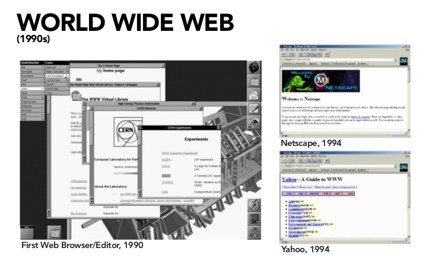
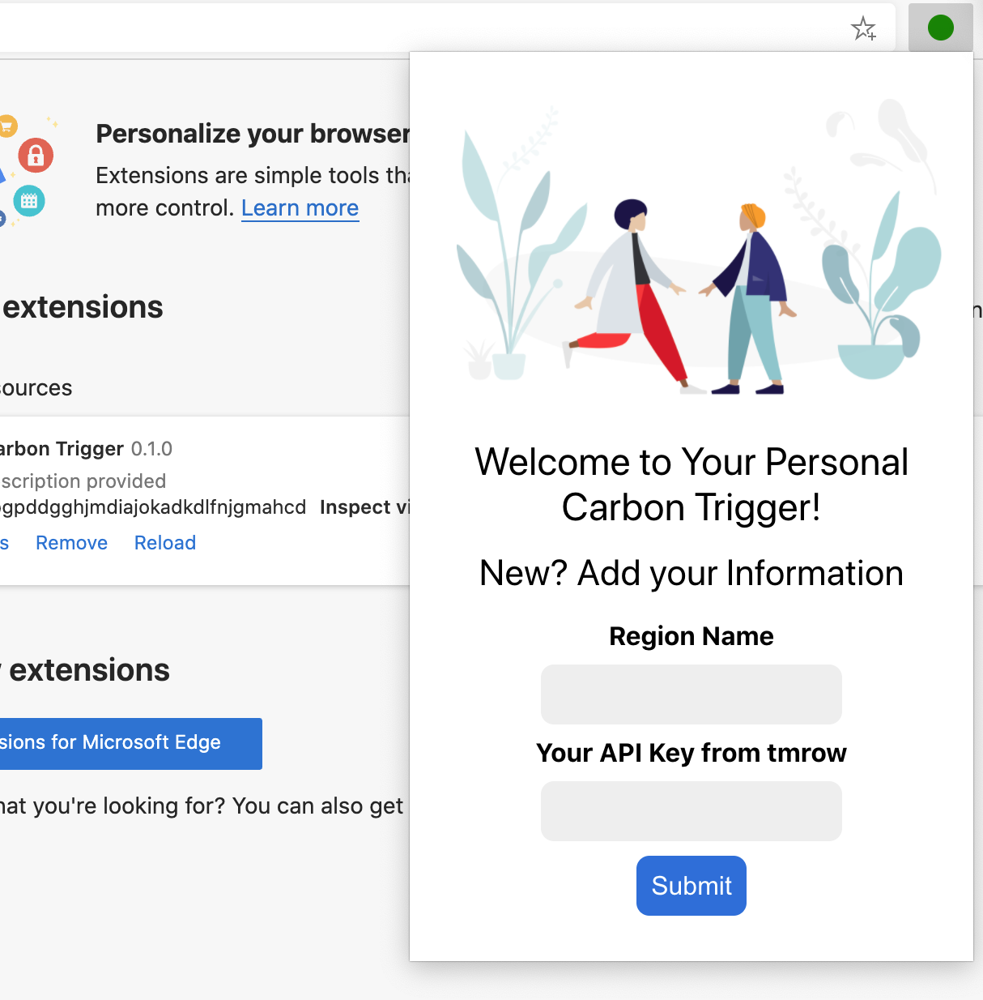
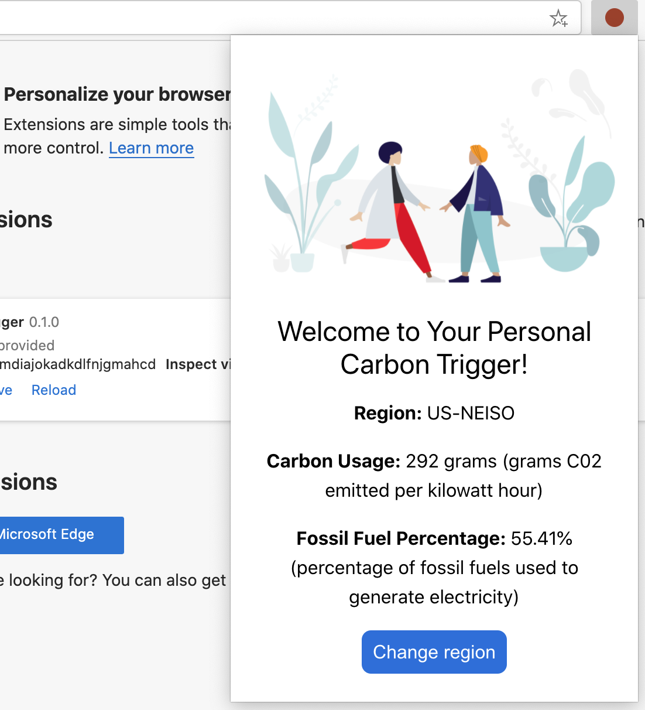

# Browser Extension Project Part 1: All about Browsers


> Sketchnote by [Wassim Chegham](https://dev.to/wassimchegham/ever-wondered-what-happens-when-you-type-in-a-url-in-an-address-bar-in-a-browser-3dob)

## Pre-Lecture Quiz

[Pre-lecture quiz](https://nice-beach-0fe9e9d0f.azurestaticapps.net/quiz/23)

### Introduction

Browser extensions add additional functionality to a browser. But before you build one, you should learn a little about how browsers do their work.

### About the browser

In this series of lessons, you'll learn how to build a browser extension that will work on Chrome, Firefox and Edge browsers. In this part, you'll discover how browsers work and scaffold out the elements of the browser extension.

But what is a browser exactly? It is a software application that allows an end user to access content from a server and display it on web pages.

✅ A little history: the first browser was called 'WorldWideWeb' and was created by Sir Timothy Berners-Lee in 1990.


> Some early browsers, via [Karen McGrane](https://www.slideshare.net/KMcGrane/week-4-ixd-history-personal-computing)

When a user connected to the internet using a URL (Uniform Resource Locator) address, usually using Hypertext Transfer Protocol via an `http` or `https` address, the browser communicates with a web server and fetches a web page.

At this point, the browser's rendering engine displays it on the user's device, which might be a mobile phone, desktop, or laptop.

Browsers also have the ability to cache content so that it doesn't have to be retrieved from the server every time. They can record the history of a user's browsing activity, store 'cookies', which are small bits of data that contain information used to store a user's activity, and more. 

A really important thing to remember about browsers is that they are not all the same! Each browser has its strengths and weaknesses, and a professional web developer needs to understand how to make web pages perform well cross-browser. This includes handling small viewports such as a mobile phone's, as well as a user who is offline.

A really useful website that you probably should bookmark in whatever browser you prefer to use is [caniuse.com](https://www.caniuse.com). When you are building web pages, it's very helpful to use caniuse's lists of supported technologies so that you can best support your users.

✅ How can you tell what browsers are most popular with your web site's user base? Check your analytics - you can install various analytics packages as part of your web development process, and they will tell you what browsers are most used by the various popular browsers.

## Browser extensions

Why would you want to build a browser extension? It's a handy thing to attach to your browser when you need quick access to tasks that you tend to repeat. For example, if you find yourself needing to check colors on the various web pages that you interact with, you might install a color-picker browser extension. If you have trouble remembering passwords, you might use a password-management browser extension. 

Browser extensions are fun to develop, too. They tend to manage a finite number of tasks that they perform well.

✅ What are your favorite browser extensions? What tasks do they perform?

### Installing extensions

Before you start building, take a look at the process of building and deploying a browser extension. While each browser varies a bit in how they manage this task, the process is similar on Chrome and Firefox to this example on Edge:


In essence, the process will be:

- build your extension using `npm run build` 
- navigate in the browser to the extensions pane using the "Settings and more" button (the `...` icon) on the top right
- if it's a new installation, choose `load unpacked` to upload a fresh extension from its build folder (in our case it is `/dist`) 
- or, click `reload` if you are reloading the already-installed extension

✅ These instructions pertain to extensions you build yourself; to install extensions that have been released to the browser extension store associated to each browser, you should navigate to those [stores](https://microsoftedge.microsoft.com/addons/Microsoft-Edge-Extensions-Home) and install the extension of your choice.

### Get Started

You're going to build a browser extension that displays your region's carbon footprint, showing your region's energy usage and the source of the energy. The extension will have a form that collects an API key so that you can access
CO2 Signal's API.

**You need:**

- [an API key](https://www.co2signal.com/); enter your email in the box on this page and one will be sent to you
- the [code for your region](http://api.electricitymap.org/v3/zones) corresponding to the [Electricity Map](https://www.electricitymap.org/map) (in Boston, for example, I use 'US-NEISO').
- the [starter code](../start). Download the `start` folder; you will be completing code in this folder.
- [NPM](https://www.npmjs.com) - NPM is a package management tool; install it locally and the packages listed in you `package.json` file will be installed for use by your web asset

✅ Learn more about package management in this [excellent Learn module](https://docs.microsoft.com/learn/modules/create-nodejs-project-dependencies/?WT.mc_id=academic-13441-cxa)

Take a minute to look through the codebase:

dist
    -|manifest.json (defaults set here)
    -|index.html (front-end HTML markup here)
    -|background.js (background JS here)
    -|main.js (built JS)
src
    -|index.js (your JS code goes here)

✅ Once you have your API key and Region code handy, store those somewhere in a note for future use.

### Build the HTML for the extension

This extension has two views. One to gather the API key and region code:



And the second to display the region's carbon usage:



Let's start by building the HTML for the form and styling it with CSS.

In the `/dist` folder, you will build a form and a result area. In the `index.html` file, populate the delineated form area:

```HTML
<form class="form-data" autocomplete="on">
	<div>
		<h2>New? Add your Information</h2>
	</div>
	<div>
		<label for="region">Region Name</label>
		<input type="text" id="region" required class="region-name" />
	</div>
	<div>
		<label for="api">Your API Key from tmrow</label>
		<input type="text" id="api" required class="api-key" />
	</div>
	<button class="search-btn">Submit</button>
</form>	
```
This is the form where your saved information will be input and saved to local storage.

Next, create the results area; under the final form tag, add some divs:

```HTML
<div class="result">
	<div class="loading">loading...</div>
	<div class="errors"></div>
	<div class="data"></div>
	<div class="result-container">
		<p><strong>Region: </strong><span class="my-region"></span></p>
		<p><strong>Carbon Usage: </strong><span class="carbon-usage"></span></p>
		<p><strong>Fossil Fuel Percentage: </strong><span class="fossil-fuel"></span></p>
	</div>
	<button class="clear-btn">Change region</button>
</div>
```
At this point, you can try a build. Make sure to install the package dependencies of this extension:

```
npm install
```

This command will use npm, the Node Package Manager, to install webpack for your extension's build process. Webpack is a bundler that handles compiling code. You can see the output of this process by looking in `/dist/main.js` - you see the code has been bundled.

For now, the extension should build and, if you deploy it into Edge as an extension, you'll see a form neatly displayed.

Congratulations, you've taken the first steps towards building a browser extension. In subsequent lessons, you'll make it more functional and useful.

---

## 🚀 Challenge

Take a look at a browser extension store and install one to your browser. You can examine its files in interesting ways. What do you discover?

## Post-Lecture Quiz

[Post-lecture quiz](https://nice-beach-0fe9e9d0f.azurestaticapps.net/quiz/24)

## Review & Self Study

In this lesson you learned a little about the history of the web browser; take this opportunity to learn about how the inventors of the World Wide Web envisioned its use by reading more about its history. Some useful sites include:

[The History of Web Browsers](https://www.mozilla.org/firefox/browsers/browser-history/)

[History of the Web](https://webfoundation.org/about/vision/history-of-the-web/)

[An interview with Tim Berners-Lee](https://www.theguardian.com/technology/2019/mar/12/tim-berners-lee-on-30-years-of-the-web-if-we-dream-a-little-we-can-get-the-web-we-want)

## Assignment 

[Restyle your extension](assignment.md)

