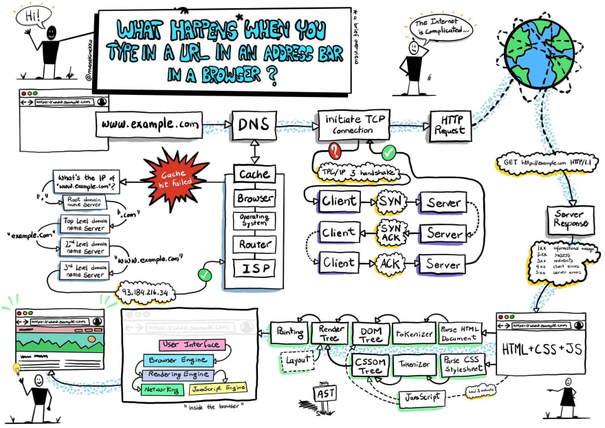
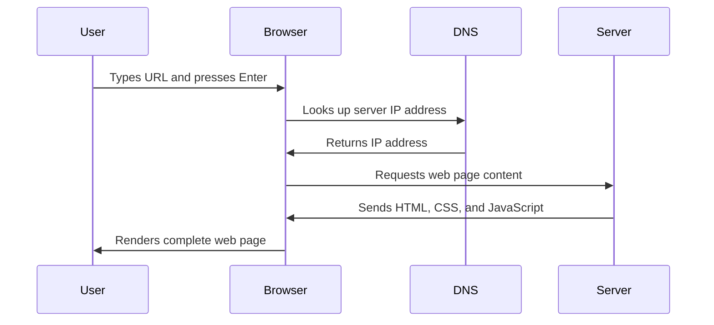

# Browser Extension Project Part 1: All about Browsers


> Sketchnote by [Wassim Chegham](https://dev.to/wassimchegham/ever-wondered-what-happens-when-you-type-in-a-url-in-an-address-bar-in-a-browser-3dob)

## Pre-Lecture Quiz

[Pre-lecture quiz](https://ff-quizzes.netlify.app/web/quiz/23)

### Introduction

Browser extensions are powerful tools that enhance your browsing experience by adding custom functionality directly to your web browser. Think of them as mini-applications that live inside your browser, ready to help you with specific tasks whenever you need them. From password managers to color pickers, extensions transform how you interact with the web.

Before you dive into building your own extension, it's essential to understand how browsers work behind the scenes. This knowledge will help you create more effective extensions and understand how they integrate with the browser's core functionality.

In this lesson, you'll discover the inner workings of web browsers, learn about different browser architectures, and start building your first browser extension. By the end, you'll have a solid foundation for creating extensions that work across multiple browsers and provide real value to users.

## Understanding Web Browsers

Let's start by understanding what browsers are and how they work. This foundation will help you build better extensions that integrate seamlessly with browser functionality.

A web browser is a sophisticated software application that acts as your gateway to the internet. It takes web addresses (URLs), retrieves content from web servers around the world, and transforms that content into the interactive web pages you see and use every day.

✅ **A little history**: The first browser was called 'WorldWideWeb' and was created by Sir Timothy Berners-Lee in 1990.


> Some early browsers, via [Karen McGrane](https://www.slideshare.net/KMcGrane/week-4-ixd-history-personal-computing)

### How Browsers Process Web Content

When you type a URL into your browser's address bar, here's what happens behind the scenes:



**Here's what this process accomplishes:**
- **Translates** the human-readable URL into a server IP address through DNS lookup
- **Establishes** a secure connection with the web server using HTTP or HTTPS protocols
- **Requests** the specific web page content from the server
- **Receives** HTML markup, CSS styling, and JavaScript code from the server
- **Renders** all content into the interactive web page you see

### Browser Core Features

Modern browsers provide several essential features that extensions can leverage:

| Feature | Purpose | Extension Opportunities |
|---------|---------|------------------------|
| **Rendering Engine** | Displays HTML, CSS, and JavaScript | Content modification, styling injection |
| **JavaScript Engine** | Executes JavaScript code | Custom scripts, API interactions |
| **Local Storage** | Saves data locally | User preferences, cached data |
| **Network Stack** | Handles web requests | Request monitoring, data analysis |
| **Security Model** | Protects users from malicious content | Content filtering, security enhancements |

**Understanding these features helps you:**
- **Identify** where your extension can add the most value
- **Choose** the right browser APIs for your extension's functionality
- **Design** extensions that work efficiently with browser systems
- **Ensure** your extension follows browser security best practices

### Cross-Browser Development Considerations

Each browser has its own strengths, quirks, and capabilities. As an extension developer, you'll need to consider these differences:

> 💡 **Pro Tip**: Use [caniuse.com](https://www.caniuse.com) to check which web technologies are supported across different browsers. This is invaluable when planning your extension's features!

**Key considerations for extension development:**
- **Test** your extension across Chrome, Firefox, and Edge browsers
- **Adapt** to different browser extension APIs and manifest formats
- **Handle** varying performance characteristics and limitations
- **Provide** fallbacks for browser-specific features that may not be available

✅ **Analytics Insight**: You can determine which browsers your users prefer by installing analytics packages in your web development projects. This data helps you prioritize which browsers to support first.

## Understanding Browser Extensions

Browser extensions solve real problems by adding specialized functionality exactly where you need it most. Unlike standalone applications, extensions integrate directly into your browsing experience, providing instant access to tools and features without interrupting your workflow.

Think about the repetitive tasks you do while browsing the web. Maybe you frequently need to check color codes on websites, save articles for later reading, or translate text from other languages. Extensions excel at automating these common tasks and making them accessible with just a click.

**Popular extension categories and their benefits:**
- **Productivity Tools**: Task managers, note-taking apps, and time trackers that help you stay organized
- **Security Enhancements**: Password managers, ad blockers, and privacy tools that protect your data
- **Developer Tools**: Code formatters, color pickers, and debugging utilities that streamline development
- **Content Enhancement**: Reading modes, video downloaders, and screenshot tools that improve your web experience

✅ **Reflection Question**: What are your favorite browser extensions? What specific tasks do they perform, and how do they improve your browsing experience?

## Installing and Managing Extensions

Before diving into development, let's understand how extensions are installed and managed. This knowledge will help you test your extensions and understand the user experience.

The extension installation process is similar across all modern browsers, though each has slight variations in their interface and terminology.


> **Important**: Make sure to toggle on developer mode and allow extensions from other stores when testing your own extensions.

### Development Extension Installation Process

When you're developing and testing your own extensions, follow this workflow:

```bash
# Step 1: Build your extension
npm run build
```

**What this command accomplishes:**
- **Compiles** your source code into browser-ready files
- **Bundles** JavaScript modules into optimized packages
- **Generates** the final extension files in the `/dist` folder
- **Prepares** your extension for installation and testing

**Step 2: Navigate to Browser Extensions**
1. **Open** your browser's extensions management page
2. **Click** the "Settings and more" button (the `...` icon) on the top right
3. **Select** "Extensions" from the dropdown menu

**Step 3: Load Your Extension**
- **For new installations**: Choose `load unpacked` and select your `/dist` folder
- **For updates**: Click `reload` next to your already-installed extension
- **For testing**: Enable "Developer mode" to access additional debugging features

### Production Extension Installation

> ✅ **Note**: These development instructions are specifically for extensions you build yourself. To install published extensions, visit the official browser extension stores like the [Microsoft Edge Add-ons store](https://microsoftedge.microsoft.com/addons/Microsoft-Edge-Extensions-Home).

**Understanding the difference:**
- **Development installations** let you test unpublished extensions during development
- **Store installations** provide vetted, published extensions with automatic updates
- **Sideloading** allows installation of extensions from outside official stores (requires developer mode)

## Building Your Carbon Footprint Extension

Now it's time to start building! You'll create a browser extension that displays your region's carbon footprint by showing local energy usage and sources. This practical project will teach you the fundamentals of extension development while creating something genuinely useful.

Your extension will help users understand their environmental impact by providing real-time data about their region's energy consumption and carbon emissions. This type of awareness tool is increasingly important as we all work toward more sustainable digital habits.

### Project Requirements

Before you begin coding, gather these essential resources:

**Required API Access:**
- **[CO2 Signal API key](https://www.co2signal.com/)**: Enter your email address to receive your free API key
- **[Region code](http://api.electricitymap.org/v3/zones)**: Find your region code using the [Electricity Map](https://www.electricitymap.org/map) (for example, Boston uses 'US-NEISO')

**Development Tools:**
- **[Node.js and NPM](https://www.npmjs.com)**: Package management tool for installing project dependencies
- **[Starter code](../start)**: Download the `start` folder to begin development

✅ **Learn More**: Enhance your package management skills with this [comprehensive Learn module](https://docs.microsoft.com/learn/modules/create-nodejs-project-dependencies/?WT.mc_id=academic-77807-sagibbon)

### Understanding the Project Structure

Let's explore the extension's file organization to understand how the pieces fit together:

```
project-root/
├── dist/                    # Built extension files
│   ├── manifest.json        # Extension configuration
│   ├── index.html           # User interface markup
│   ├── background.js        # Background script functionality
│   └── main.js              # Compiled JavaScript bundle
└── src/                     # Source development files
    └── index.js             # Your main JavaScript code
```

**Breaking down what each file accomplishes:**
- **`manifest.json`**: **Defines** extension metadata, permissions, and entry points
- **`index.html`**: **Creates** the user interface that appears when users click your extension
- **`background.js`**: **Handles** background tasks and browser event listeners
- **`main.js`**: **Contains** the final bundled JavaScript after the build process
- **`src/index.js`**: **Houses** your main development code that gets compiled into `main.js`

> 💡 **Organization Tip**: Store your API key and region code in a secure note for easy reference during development. You'll need these values to test your extension's functionality.

✅ **Security Note**: Never commit API keys or sensitive credentials to your code repository. We'll show you how to handle these securely in the next steps.

## Creating the Extension Interface

Your extension will have two main views that provide a complete user experience. Let's build these interfaces step by step, understanding how each component contributes to the overall functionality.

The first view collects user configuration data, while the second displays the carbon footprint information. This two-step approach ensures users can easily set up and then use your extension.

### Extension Views Overview

**Setup View** - First-time user configuration:


**Results View** - Carbon footprint data display:


### Building the Configuration Form

Let's start by creating the user input form. This form will collect the API key and region code, then save them to the browser's local storage for future use.

In the `/dist/index.html` file, add this form structure:

```html
<form class="form-data" autocomplete="on">
    <div>
        <h2>New? Add your Information</h2>
    </div>
    <div>
        <label for="region">Region Name</label>
        <input type="text" id="region" required class="region-name" />
    </div>
    <div>
        <label for="api">Your API Key from tmrow</label>
        <input type="text" id="api" required class="api-key" />
    </div>
    <button class="search-btn">Submit</button>
</form>
```

**Here's what this form accomplishes:**
- **Creates** a semantic form structure with proper labels and input associations
- **Enables** browser autocomplete functionality for improved user experience
- **Requires** both fields to be filled before submission using the `required` attribute
- **Organizes** inputs with descriptive class names for easy styling and JavaScript targeting
- **Provides** clear instructions for users who are setting up the extension for the first time

### Building the Results Display

Next, create the results area that will show the carbon footprint data. Add this HTML below the form:

```html
<div class="result">
    <div class="loading">loading...</div>
    <div class="errors"></div>
    <div class="data"></div>
    <div class="result-container">
        <p><strong>Region: </strong><span class="my-region"></span></p>
        <p><strong>Carbon Usage: </strong><span class="carbon-usage"></span></p>
        <p><strong>Fossil Fuel Percentage: </strong><span class="fossil-fuel"></span></p>
    </div>
    <button class="clear-btn">Change region</button>
</div>
```

**Breaking down what this structure provides:**
- **`loading`**: **Displays** a loading message while API data is being fetched
- **`errors`**: **Shows** error messages if API calls fail or data is invalid
- **`data`**: **Holds** raw data for debugging purposes during development
- **`result-container`**: **Presents** formatted carbon footprint information to users
- **`clear-btn`**: **Allows** users to change their region and reconfigure the extension

### Setting Up the Build Process

Now let's install the project dependencies and test the build process:

```bash
npm install
```

**What this installation process accomplishes:**
- **Downloads** Webpack and other development dependencies specified in `package.json`
- **Configures** the build toolchain for compiling modern JavaScript
- **Prepares** the development environment for extension building and testing
- **Enables** code bundling, optimization, and cross-browser compatibility features

> 💡 **Build Process Insight**: Webpack bundles your source code from `/src/index.js` into `/dist/main.js`. This process optimizes your code for production and ensures browser compatibility.

### Testing Your Progress

At this point, you can test your extension:

1. **Run** the build command to compile your code
2. **Load** the extension into your browser using the developer mode
3. **Verify** that the form displays correctly and looks professional
4. **Check** that all form elements are properly aligned and functional

**You've successfully:**
- **Built** the foundational HTML structure for your extension
- **Created** both configuration and results interfaces
- **Set up** the development workflow with modern build tools
- **Prepared** your extension for the next phase of JavaScript functionality

Congratulations! You've completed the first major milestone in browser extension development. In the upcoming lessons, you'll add JavaScript functionality to make your extension fully interactive and useful.

## GitHub Copilot Agent Challenge 🚀

Use the Agent mode to complete the following challenge:

**Description:** Enhance the browser extension by adding form validation and user feedback features to improve the user experience when entering API keys and region codes.

**Prompt:** Create JavaScript validation functions that check if the API key field contains at least 20 characters and if the region code follows the correct format (like 'US-NEISO'). Add visual feedback by changing input border colors to green for valid inputs and red for invalid ones. Also add a toggle feature to show/hide the API key for security purposes.

---

## 🚀 Challenge

Take a look at a browser extension store and install one to your browser. You can examine its files in interesting ways. What do you discover?

## Post-Lecture Quiz

[Post-lecture quiz](https://ff-quizzes.netlify.app/web/quiz/24)

## Review & Self Study

In this lesson you learned a little about the history of the web browser; take this opportunity to learn about how the inventors of the World Wide Web envisioned its use by reading more about its history. Some useful sites include:

[The History of Web Browsers](https://www.mozilla.org/firefox/browsers/browser-history/)

[History of the Web](https://webfoundation.org/about/vision/history-of-the-web/)

[An interview with Tim Berners-Lee](https://www.theguardian.com/technology/2019/mar/12/tim-berners-lee-on-30-years-of-the-web-if-we-dream-a-little-we-can-get-the-web-we-want)

## Assignment 

[Restyle your extension](assignment.md)

