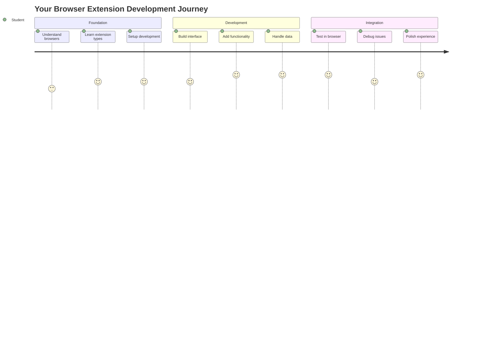
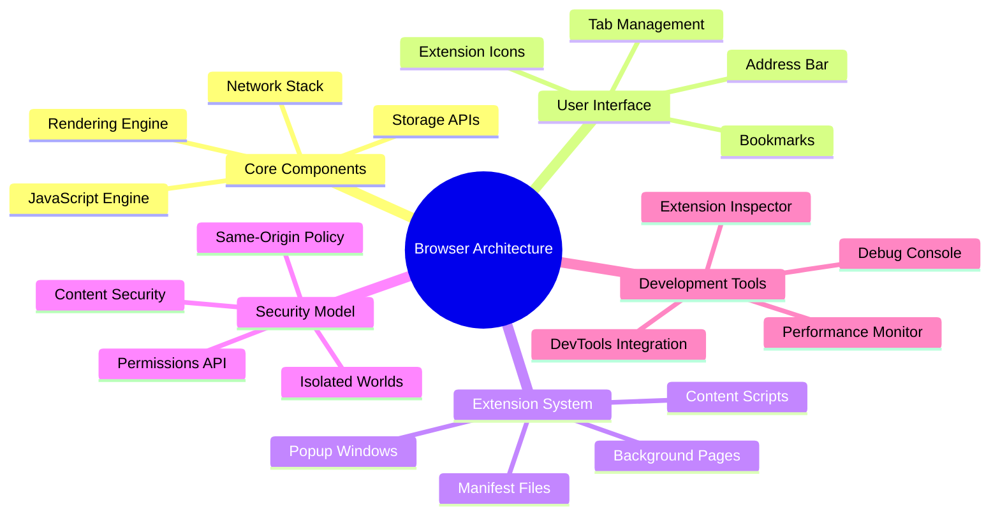
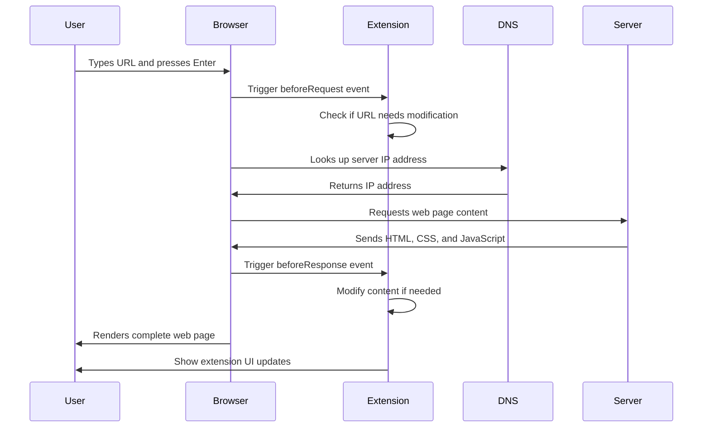
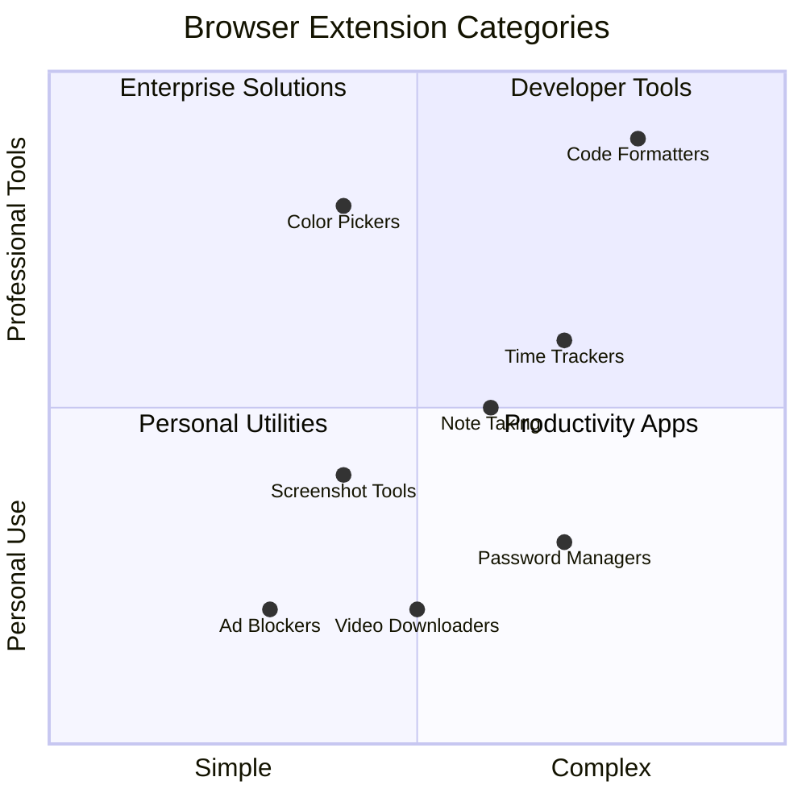
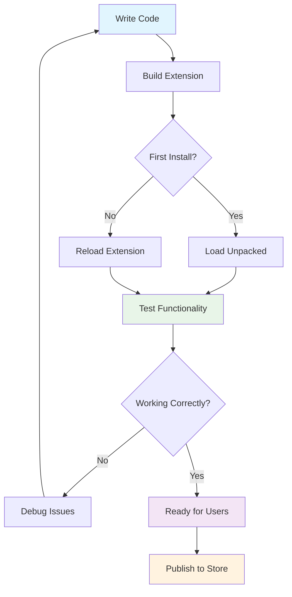
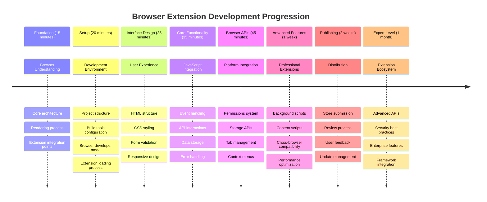

# Browser Extension Project Part 1: All about Browsers




> Sketchnote by [Wassim Chegham](https://dev.to/wassimchegham/ever-wondered-what-happens-when-you-type-in-a-url-in-an-address-bar-in-a-browser-3dob)

## Pre-Lecture Quiz

[Pre-lecture quiz](https://ff-quizzes.netlify.app/web/quiz/23)

### Introduction

Browser extensions are mini-applications that enhance your web browsing experience. Like Tim Berners-Lee's original vision of an interactive web, extensions extend the browser's capabilities beyond simple document viewing. From password managers that keep your accounts secure to color pickers that help designers grab perfect shades, extensions solve everyday browsing challenges.

Before we build your first extension, let's understand how browsers work. Just as Alexander Graham Bell needed to understand sound transmission before inventing the telephone, knowing browser fundamentals will help you create extensions that integrate seamlessly with existing browser systems.

By the end of this lesson, you'll understand browser architecture and have started building your first extension.



## Understanding Web Browsers

A web browser is essentially a sophisticated document interpreter. When you type "google.com" into the address bar, the browser performs a complex series of operations - requesting content from servers worldwide, then parsing and rendering that code into the interactive web pages you see.

This process mirrors how the first web browser, WorldWideWeb, was designed by Tim Berners-Lee in 1990 to make hyperlinked documents accessible to everyone.

✅ **A little history**: The first browser was called 'WorldWideWeb' and was created by Sir Timothy Berners-Lee in 1990.


> Some early browsers, via [Karen McGrane](https://www.slideshare.net/KMcGrane/week-4-ixd-history-personal-computing)

### How Browsers Process Web Content

The process between entering a URL and seeing a webpage involves several coordinated steps that happen within seconds:



**Here's what this process accomplishes:**
- **Translates** the human-readable URL into a server IP address through DNS lookup
- **Establishes** a secure connection with the web server using HTTP or HTTPS protocols
- **Requests** the specific web page content from the server
- **Receives** HTML markup, CSS styling, and JavaScript code from the server
- **Renders** all content into the interactive web page you see

### Browser Core Features

Modern browsers provide numerous features that extension developers can leverage:

| Feature | Purpose | Extension Opportunities |
|---------|---------|------------------------|
| **Rendering Engine** | Displays HTML, CSS, and JavaScript | Content modification, styling injection |
| **JavaScript Engine** | Executes JavaScript code | Custom scripts, API interactions |
| **Local Storage** | Saves data locally | User preferences, cached data |
| **Network Stack** | Handles web requests | Request monitoring, data analysis |
| **Security Model** | Protects users from malicious content | Content filtering, security enhancements |

**Understanding these features helps you:**
- **Identify** where your extension can add the most value
- **Choose** the right browser APIs for your extension's functionality
- **Design** extensions that work efficiently with browser systems
- **Ensure** your extension follows browser security best practices

### Cross-Browser Development Considerations

Different browsers implement standards with slight variations, similar to how different programming languages might handle the same algorithm differently. Chrome, Firefox, and Safari each have unique characteristics that developers must consider during extension development.

> 💡 **Pro Tip**: Use [caniuse.com](https://www.caniuse.com) to check which web technologies are supported across different browsers. This is invaluable when planning your extension's features!

**Key considerations for extension development:**
- **Test** your extension across Chrome, Firefox, and Edge browsers
- **Adapt** to different browser extension APIs and manifest formats
- **Handle** varying performance characteristics and limitations
- **Provide** fallbacks for browser-specific features that may not be available

✅ **Analytics Insight**: You can determine which browsers your users prefer by installing analytics packages in your web development projects. This data helps you prioritize which browsers to support first.

## Understanding Browser Extensions

Browser extensions solve common web browsing challenges by adding functionality directly to the browser interface. Rather than requiring separate applications or complex workflows, extensions provide immediate access to tools and features.

This concept mirrors how early computer pioneers like Douglas Engelbart envisioned augmenting human capabilities with technology - extensions augment your browser's basic functionality.



**Popular extension categories and their benefits:**
- **Productivity Tools**: Task managers, note-taking apps, and time trackers that help you stay organized
- **Security Enhancements**: Password managers, ad blockers, and privacy tools that protect your data
- **Developer Tools**: Code formatters, color pickers, and debugging utilities that streamline development
- **Content Enhancement**: Reading modes, video downloaders, and screenshot tools that improve your web experience

✅ **Reflection Question**: What are your favorite browser extensions? What specific tasks do they perform, and how do they improve your browsing experience?

### 🔄 **Pedagogical Check-in**
**Browser Architecture Understanding**: Before moving to extension development, ensure you can:
- ✅ Explain how browsers process web requests and render content
- ✅ Identify the main components of browser architecture
- ✅ Understand how extensions integrate with browser functionality
- ✅ Recognize the security model that protects users

**Quick Self-Test**: Can you trace the path from typing a URL to seeing a webpage?
1. **DNS lookup** converts URL to IP address
2. **HTTP request** fetches content from server
3. **Parsing** processes HTML, CSS, and JavaScript
4. **Rendering** displays the final webpage
5. **Extensions** can modify content at multiple steps

## Installing and Managing Extensions

Understanding the extension installation process helps you anticipate the user experience when people install your extension. The installation process is standardized across modern browsers, with minor variations in interface design.


> **Important**: Make sure to toggle on developer mode and allow extensions from other stores when testing your own extensions.

### Development Extension Installation Process

When you're developing and testing your own extensions, follow this workflow:



```bash
# Step 1: Build your extension
npm run build
```

**What this command accomplishes:**
- **Compiles** your source code into browser-ready files
- **Bundles** JavaScript modules into optimized packages
- **Generates** the final extension files in the `/dist` folder
- **Prepares** your extension for installation and testing

**Step 2: Navigate to Browser Extensions**
1. **Open** your browser's extensions management page
2. **Click** the "Settings and more" button (the `...` icon) on the top right
3. **Select** "Extensions" from the dropdown menu

**Step 3: Load Your Extension**
- **For new installations**: Choose `load unpacked` and select your `/dist` folder
- **For updates**: Click `reload` next to your already-installed extension
- **For testing**: Enable "Developer mode" to access additional debugging features

### Production Extension Installation

> ✅ **Note**: These development instructions are specifically for extensions you build yourself. To install published extensions, visit the official browser extension stores like the [Microsoft Edge Add-ons store](https://microsoftedge.microsoft.com/addons/Microsoft-Edge-Extensions-Home).

**Understanding the difference:**
- **Development installations** let you test unpublished extensions during development
- **Store installations** provide vetted, published extensions with automatic updates
- **Sideloading** allows installation of extensions from outside official stores (requires developer mode)

## Building Your Carbon Footprint Extension

We'll create a browser extension that displays the carbon footprint of your region's energy use. This project demonstrates essential extension development concepts while creating a practical tool for environmental awareness.

This approach follows the principle of "learning by doing" that has proven effective since John Dewey's educational theories - combining technical skills with meaningful real-world applications.

### Project Requirements

Before beginning development, let's gather the required resources and dependencies:

**Required API Access:**
- **[CO2 Signal API key](https://www.co2signal.com/)**: Enter your email address to receive your free API key
- **[Region code](http://api.electricitymap.org/v3/zones)**: Find your region code using the [Electricity Map](https://www.electricitymap.org/map) (for example, Boston uses 'US-NEISO')

**Development Tools:**
- **[Node.js and NPM](https://www.npmjs.com)**: Package management tool for installing project dependencies
- **[Starter code](../start)**: Download the `start` folder to begin development

✅ **Learn More**: Enhance your package management skills with this [comprehensive Learn module](https://docs.microsoft.com/learn/modules/create-nodejs-project-dependencies/?WT.mc_id=academic-77807-sagibbon)

### Understanding the Project Structure

Understanding the project structure helps organize development work efficiently. Like how the Library of Alexandria was organized for easy knowledge retrieval, a well-structured codebase makes development more efficient:

```mermaid
fileStructure
    project-root
        dist
            manifest.json
            index.html
            background.js
            main.js
        src
            index.js
        package.json
        webpack.config.js
```

```
project-root/
├── dist/                    # Built extension files
│   ├── manifest.json        # Extension configuration
│   ├── index.html           # User interface markup
│   ├── background.js        # Background script functionality
│   └── main.js              # Compiled JavaScript bundle
└── src/                     # Source development files
    └── index.js             # Your main JavaScript code
```

**Breaking down what each file accomplishes:**
- **`manifest.json`**: **Defines** extension metadata, permissions, and entry points
- **`index.html`**: **Creates** the user interface that appears when users click your extension
- **`background.js`**: **Handles** background tasks and browser event listeners
- **`main.js`**: **Contains** the final bundled JavaScript after the build process
- **`src/index.js`**: **Houses** your main development code that gets compiled into `main.js`

> 💡 **Organization Tip**: Store your API key and region code in a secure note for easy reference during development. You'll need these values to test your extension's functionality.

✅ **Security Note**: Never commit API keys or sensitive credentials to your code repository. We'll show you how to handle these securely in the next steps.

## Creating the Extension Interface

Now we'll build the user interface components. The extension uses a two-screen approach: a configuration screen for initial setup and a results screen for data display.

This follows the progressive disclosure principle used in interface design since the early days of computing - revealing information and options in a logical sequence to avoid overwhelming users.

### Extension Views Overview

**Setup View** - First-time user configuration:


**Results View** - Carbon footprint data display:


### Building the Configuration Form

The setup form collects user configuration data during initial use. Once configured, this information persists in browser storage for future sessions.

In the `/dist/index.html` file, add this form structure:

```html
<form class="form-data" autocomplete="on">
    <div>
        <h2>New? Add your Information</h2>
    </div>
    <div>
        <label for="region">Region Name</label>
        <input type="text" id="region" required class="region-name" />
    </div>
    <div>
        <label for="api">Your API Key from tmrow</label>
        <input type="text" id="api" required class="api-key" />
    </div>
    <button class="search-btn">Submit</button>
</form>
```

**Here's what this form accomplishes:**
- **Creates** a semantic form structure with proper labels and input associations
- **Enables** browser autocomplete functionality for improved user experience
- **Requires** both fields to be filled before submission using the `required` attribute
- **Organizes** inputs with descriptive class names for easy styling and JavaScript targeting
- **Provides** clear instructions for users who are setting up the extension for the first time

### Building the Results Display

Next, create the results area that will show the carbon footprint data. Add this HTML below the form:

```html
<div class="result">
    <div class="loading">loading...</div>
    <div class="errors"></div>
    <div class="data"></div>
    <div class="result-container">
        <p><strong>Region: </strong><span class="my-region"></span></p>
        <p><strong>Carbon Usage: </strong><span class="carbon-usage"></span></p>
        <p><strong>Fossil Fuel Percentage: </strong><span class="fossil-fuel"></span></p>
    </div>
    <button class="clear-btn">Change region</button>
</div>
```

**Breaking down what this structure provides:**
- **`loading`**: **Displays** a loading message while API data is being fetched
- **`errors`**: **Shows** error messages if API calls fail or data is invalid
- **`data`**: **Holds** raw data for debugging purposes during development
- **`result-container`**: **Presents** formatted carbon footprint information to users
- **`clear-btn`**: **Allows** users to change their region and reconfigure the extension

### Setting Up the Build Process

Now let's install the project dependencies and test the build process:

```bash
npm install
```

**What this installation process accomplishes:**
- **Downloads** Webpack and other development dependencies specified in `package.json`
- **Configures** the build toolchain for compiling modern JavaScript
- **Prepares** the development environment for extension building and testing
- **Enables** code bundling, optimization, and cross-browser compatibility features

> 💡 **Build Process Insight**: Webpack bundles your source code from `/src/index.js` into `/dist/main.js`. This process optimizes your code for production and ensures browser compatibility.

### Testing Your Progress

At this point, you can test your extension:

1. **Run** the build command to compile your code
2. **Load** the extension into your browser using the developer mode
3. **Verify** that the form displays correctly and looks professional
4. **Check** that all form elements are properly aligned and functional

**What you've accomplished:**
- **Built** the foundational HTML structure for your extension
- **Created** both configuration and results interfaces with proper semantic markup
- **Set up** a modern development workflow using industry-standard tools
- **Prepared** the foundation for adding interactive JavaScript functionality

### 🔄 **Pedagogical Check-in**
**Extension Development Progress**: Verify your understanding before continuing:
- ✅ Can you explain the purpose of each file in the project structure?
- ✅ Do you understand how the build process transforms your source code?
- ✅ Why do we separate configuration and results into different UI sections?
- ✅ How does the form structure support both usability and accessibility?

**Development Workflow Understanding**: You should now be able to:
1. **Modify** HTML and CSS for your extension interface
2. **Run** the build command to compile your changes
3. **Reload** the extension in your browser to test updates
4. **Debug** issues using browser developer tools

You've completed the first phase of browser extension development. Like how the Wright brothers first needed to understand aerodynamics before achieving flight, understanding these foundational concepts prepares you for building more complex interactive features in the next lesson.

## GitHub Copilot Agent Challenge 🚀

Use the Agent mode to complete the following challenge:

**Description:** Enhance the browser extension by adding form validation and user feedback features to improve the user experience when entering API keys and region codes.

**Prompt:** Create JavaScript validation functions that check if the API key field contains at least 20 characters and if the region code follows the correct format (like 'US-NEISO'). Add visual feedback by changing input border colors to green for valid inputs and red for invalid ones. Also add a toggle feature to show/hide the API key for security purposes.

Learn more about [agent mode](https://code.visualstudio.com/blogs/2025/02/24/introducing-copilot-agent-mode) here.

## 🚀 Challenge

Take a look at a browser extension store and install one to your browser. You can examine its files in interesting ways. What do you discover?

## Post-Lecture Quiz

[Post-lecture quiz](https://ff-quizzes.netlify.app/web/quiz/24)

## Review & Self Study

In this lesson you learned a little about the history of the web browser; take this opportunity to learn about how the inventors of the World Wide Web envisioned its use by reading more about its history. Some useful sites include:

[The History of Web Browsers](https://www.mozilla.org/firefox/browsers/browser-history/)

[History of the Web](https://webfoundation.org/about/vision/history-of-the-web/)

[An interview with Tim Berners-Lee](https://www.theguardian.com/technology/2019/mar/12/tim-berners-lee-on-30-years-of-the-web-if-we-dream-a-little-we-can-get-the-web-we-want)

### ⚡ **What You Can Do in the Next 5 Minutes**
- [ ] Open Chrome/Edge extensions page (chrome://extensions) and explore what you have installed
- [ ] Look at your browser's DevTools Network tab while loading a webpage
- [ ] Try viewing page source (Ctrl+U) to see HTML structure
- [ ] Inspect any webpage element and modify its CSS in DevTools

### 🎯 **What You Can Accomplish This Hour**
- [ ] Complete the post-lesson quiz and understand browser fundamentals
- [ ] Create a basic manifest.json file for a browser extension
- [ ] Build a simple "Hello World" extension that shows a popup
- [ ] Test loading your extension in developer mode
- [ ] Explore the browser extension documentation for your target browser

### 📅 **Your Week-Long Extension Journey**
- [ ] Complete a functional browser extension with real utility
- [ ] Learn about content scripts, background scripts, and popup interactions
- [ ] Master browser APIs like storage, tabs, and messaging
- [ ] Design user-friendly interfaces for your extension
- [ ] Test your extension across different websites and scenarios
- [ ] Publish your extension to the browser's extension store

### 🌟 **Your Month-Long Browser Development**
- [ ] Build multiple extensions solving different user problems
- [ ] Learn advanced browser APIs and security best practices
- [ ] Contribute to open source browser extension projects
- [ ] Master cross-browser compatibility and progressive enhancement
- [ ] Create extension development tools and templates for others
- [ ] Become a browser extension expert who helps other developers

## 🎯 Your Browser Extension Mastery Timeline



### 🛠️ Your Extension Development Toolkit Summary

After completing this lesson, you now have:
- **Browser Architecture Knowledge**: Understanding of rendering engines, security models, and extension integration
- **Development Environment**: Modern toolchain with Webpack, NPM, and debugging capabilities
- **UI/UX Foundation**: Semantic HTML structure with progressive disclosure patterns
- **Security Awareness**: Understanding of browser permissions and safe development practices
- **Cross-Browser Concepts**: Knowledge of compatibility considerations and testing approaches
- **API Integration**: Foundation for working with external data sources
- **Professional Workflow**: Industry-standard development and testing procedures

**Real-World Applications**: These skills directly apply to:
- **Web Development**: Single-page applications and progressive web apps
- **Desktop Applications**: Electron and web-based desktop software
- **Mobile Development**: Hybrid apps and web-based mobile solutions
- **Enterprise Tools**: Internal productivity applications and workflow automation
- **Open Source**: Contributing to browser extension projects and web standards

**Next Level**: You're ready to add interactive functionality, work with browser APIs, and create extensions that solve real user problems!

## Assignment 

[Restyle your extension](assignment.md)

