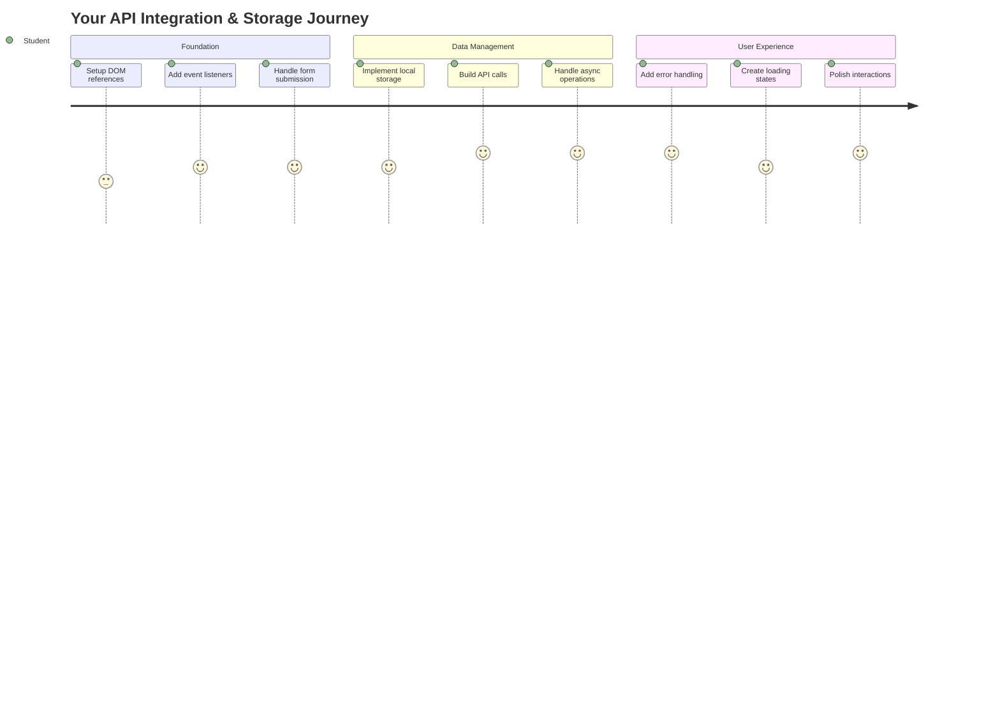
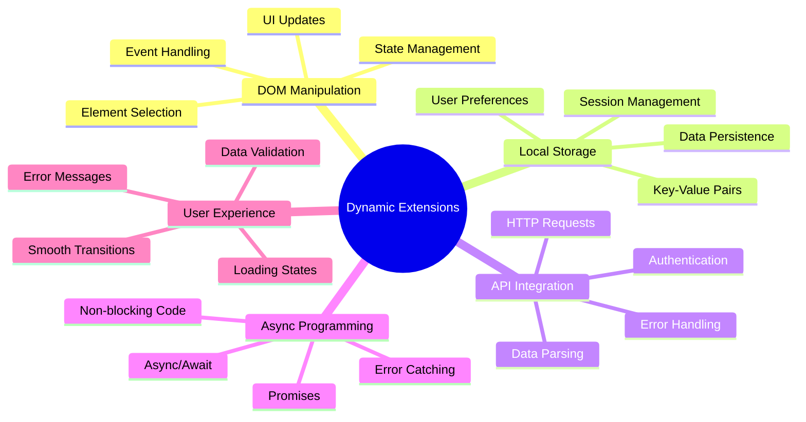
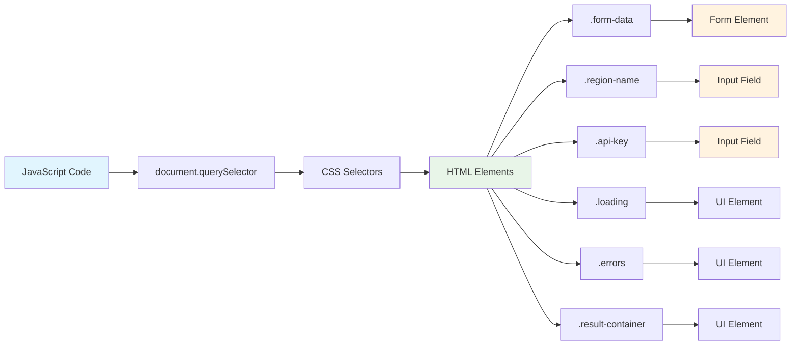
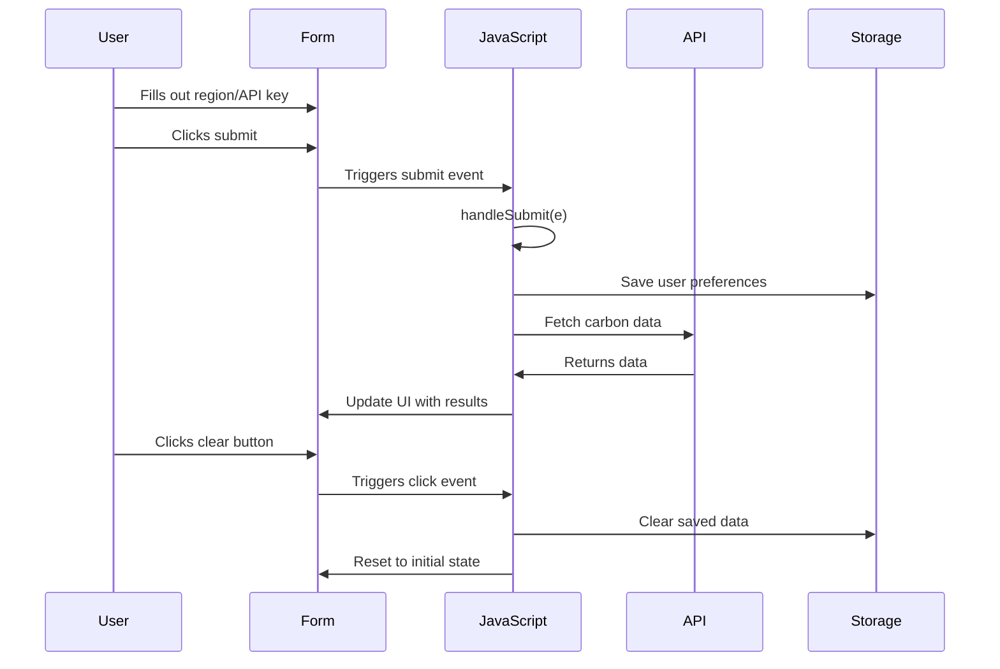
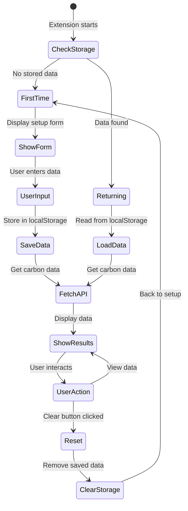
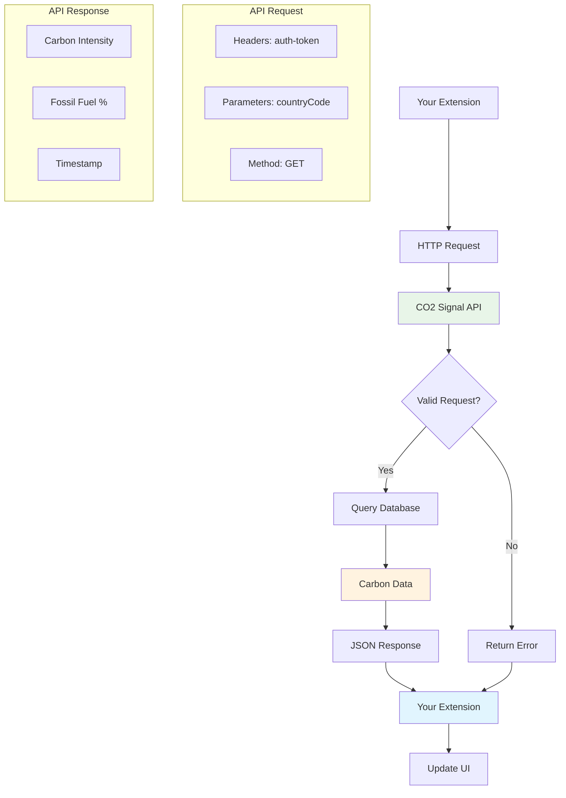
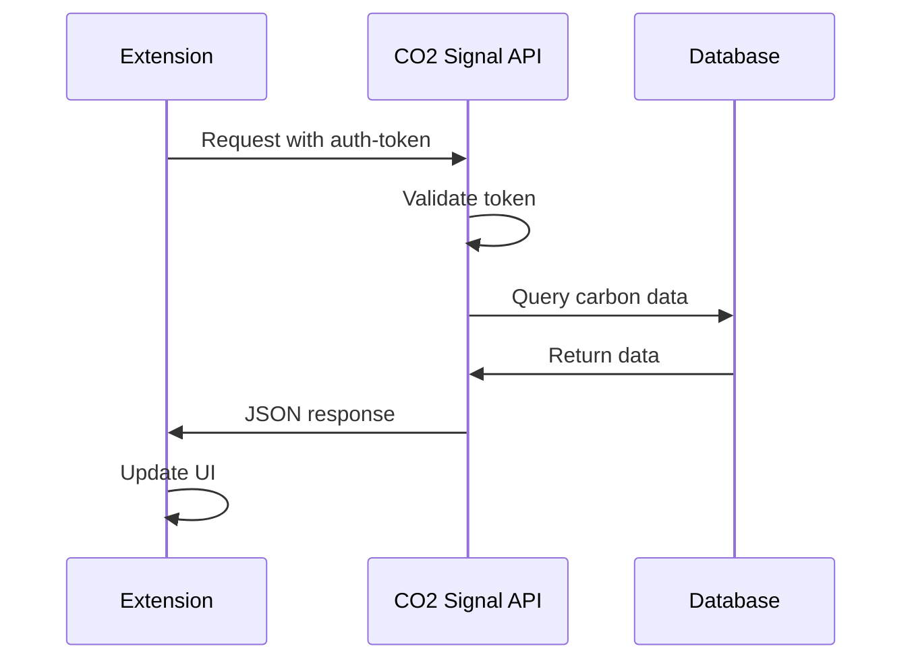
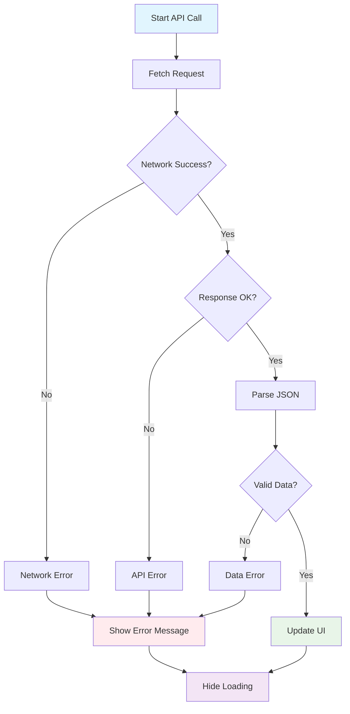
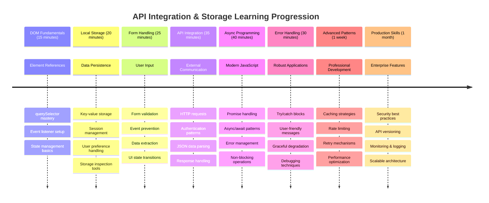

# Browser Extension Project Part 2: Call an API, use Local Storage



## Pre-Lecture Quiz

[Pre-lecture quiz](https://ff-quizzes.netlify.app/web/quiz/25)

## Introduction

Remember that browser extension you started building? Right now you've got a nice-looking form, but it's essentially static. Today we'll bring it to life by connecting it to real data and giving it memory.

Think about the Apollo mission control computers - they didn't just display fixed information. They constantly communicated with spacecraft, updated with telemetry data, and remembered critical mission parameters. That's the kind of dynamic behavior we're building today. Your extension will reach out to the internet, grab real environmental data, and remember your settings for next time.

API integration might sound complex, but it's really just teaching your code how to communicate with other services. Whether you're fetching weather data, social media feeds, or carbon footprint information like we'll do today, it's all about establishing these digital connections. We'll also explore how browsers can persist information - similar to how libraries have used card catalogs to remember where books belong.

By the end of this lesson, you'll have a browser extension that fetches real data, stores user preferences, and provides a smooth experience. Let's get started!



✅ Follow the numbered segments in the appropriate files to know where to place your code

## Set up the elements to manipulate in the extension

Before your JavaScript can manipulate the interface, it needs references to specific HTML elements. Think of it like a telescope needing to be pointed at particular stars - before Galileo could study Jupiter's moons, he had to locate and focus on Jupiter itself.

In your `index.js` file, we'll create `const` variables that capture references to each important form element. This is similar to how scientists label their equipment - instead of searching through the entire laboratory each time, they can directly access what they need.



```javascript
// form fields
const form = document.querySelector('.form-data');
const region = document.querySelector('.region-name');
const apiKey = document.querySelector('.api-key');

// results
const errors = document.querySelector('.errors');
const loading = document.querySelector('.loading');
const results = document.querySelector('.result-container');
const usage = document.querySelector('.carbon-usage');
const fossilfuel = document.querySelector('.fossil-fuel');
const myregion = document.querySelector('.my-region');
const clearBtn = document.querySelector('.clear-btn');
```

**Here's what this code does:**
- **Captures** form elements using `document.querySelector()` with CSS class selectors
- **Creates** references to input fields for the region name and API key
- **Establishes** connections to result display elements for carbon usage data
- **Sets up** access to UI elements like loading indicators and error messages
- **Stores** each element reference in a `const` variable for easy reuse throughout your code

## Add event listeners

Now we'll make your extension respond to user actions. Event listeners are your code's way of monitoring user interactions. Think of them like the operators in early telephone exchanges - they listened for incoming calls and connected the right circuits when someone wanted to make a connection.



```javascript
form.addEventListener('submit', (e) => handleSubmit(e));
clearBtn.addEventListener('click', (e) => reset(e));
init();
```

**Understanding these concepts:**
- **Attaches** a submit listener to the form that triggers when users press Enter or click submit
- **Connects** a click listener to the clear button for resetting the form
- **Passes** the event object `(e)` to handler functions for additional control
- **Calls** the `init()` function immediately to set up the initial state of your extension

✅ Notice the shorthand arrow function syntax used here. This modern JavaScript approach is cleaner than traditional function expressions, but both work equally well!

### 🔄 **Pedagogical Check-in**
**Event Handling Understanding**: Before moving to initialization, ensure you can:
- ✅ Explain how `addEventListener` connects user actions to JavaScript functions
- ✅ Understand why we pass the event object `(e)` to handler functions
- ✅ Recognize the difference between `submit` and `click` events
- ✅ Describe when the `init()` function runs and why

**Quick Self-Test**: What would happen if you forgot `e.preventDefault()` in a form submission?
*Answer: The page would reload, losing all JavaScript state and interrupting the user experience*

## Build the initialization and reset functions

Let's create the initialization logic for your extension. The `init()` function is like a ship's navigation system checking its instruments - it determines the current state and adjusts the interface accordingly. It checks if someone has used your extension before and loads their previous settings.

The `reset()` function provides users with a fresh start - similar to how scientists reset their instruments between experiments to ensure clean data.

```javascript
function init() {
	// Check if user has previously saved API credentials
	const storedApiKey = localStorage.getItem('apiKey');
	const storedRegion = localStorage.getItem('regionName');

	// Set extension icon to generic green (placeholder for future lesson)
	// TODO: Implement icon update in next lesson

	if (storedApiKey === null || storedRegion === null) {
		// First-time user: show the setup form
		form.style.display = 'block';
		results.style.display = 'none';
		loading.style.display = 'none';
		clearBtn.style.display = 'none';
		errors.textContent = '';
	} else {
		// Returning user: load their saved data automatically
		displayCarbonUsage(storedApiKey, storedRegion);
		results.style.display = 'none';
		form.style.display = 'none';
		clearBtn.style.display = 'block';
	}
}

function reset(e) {
	e.preventDefault();
	// Clear stored region to allow user to choose a new location
	localStorage.removeItem('regionName');
	// Restart the initialization process
	init();
}
```

**Breaking down what happens here:**
- **Retrieves** stored API key and region from browser's local storage
- **Checks** if this is a first-time user (no stored credentials) or returning user
- **Shows** the setup form for new users and hides other interface elements
- **Loads** saved data automatically for returning users and displays the reset option
- **Manages** the user interface state based on available data

**Key concepts about Local Storage:**
- **Persists** data between browser sessions (unlike session storage)
- **Stores** data as key-value pairs using `getItem()` and `setItem()`
- **Returns** `null` when no data exists for a given key
- **Provides** a simple way to remember user preferences and settings

> 💡 **Understanding Browser Storage**: [LocalStorage](https://developer.mozilla.org/docs/Web/API/Window/localStorage) is like giving your extension persistent memory. Consider how the ancient Library of Alexandria stored scrolls - information remained available even when scholars left and returned.
>
> **Key characteristics:**
> - **Persists** data even after you close your browser
> - **Survives** computer restarts and browser crashes
> - **Provides** substantial storage space for user preferences
> - **Offers** instant access without network delays

> **Important Note**: Your browser extension has its own isolated local storage that's separate from regular web pages. This provides security and prevents conflicts with other websites.

You can view your stored data by opening browser Developer Tools (F12), navigating to the **Application** tab, and expanding the **Local Storage** section.




> ⚠️ **Security Consideration**: In production applications, storing API keys in LocalStorage poses security risks since JavaScript can access this data. For learning purposes, this approach works fine, but real applications should use secure server-side storage for sensitive credentials.

## Handle form submission

Now we'll handle what happens when someone submits your form. By default, browsers reload the page when forms are submitted, but we'll intercept this behavior to create a smoother experience.

This approach mirrors how mission control handles spacecraft communications - instead of resetting the entire system for each transmission, they maintain continuous operation while processing new information.

Create a function that captures the form submission event and extracts the user's input:

```javascript
function handleSubmit(e) {
	e.preventDefault();
	setUpUser(apiKey.value, region.value);
}
```

**In the above, we've:**
- **Prevents** the default form submission behavior that would refresh the page
- **Extracts** user input values from the API key and region fields
- **Passes** the form data to the `setUpUser()` function for processing
- **Maintains** single-page application behavior by avoiding page reloads

✅ Remember that your HTML form fields include the `required` attribute, so the browser automatically validates that users provide both the API key and region before this function runs.

## Set up user preferences

The `setUpUser` function is responsible for saving the user's credentials and initiating the first API call. This creates a smooth transition from setup to displaying results.

```javascript
function setUpUser(apiKey, regionName) {
	// Save user credentials for future sessions
	localStorage.setItem('apiKey', apiKey);
	localStorage.setItem('regionName', regionName);
	
	// Update UI to show loading state
	loading.style.display = 'block';
	errors.textContent = '';
	clearBtn.style.display = 'block';
	
	// Fetch carbon usage data with user's credentials
	displayCarbonUsage(apiKey, regionName);
}
```

**Step by step, here's what's happening:**
- **Saves** the API key and region name to local storage for future use
- **Shows** a loading indicator to inform users that data is being fetched
- **Clears** any previous error messages from the display
- **Reveals** the clear button for users to reset their settings later
- **Initiates** the API call to fetch real carbon usage data

This function creates a seamless user experience by managing both data persistence and user interface updates in one coordinated action.

## Display carbon usage data

Now we'll connect your extension to external data sources through APIs. This transforms your extension from a standalone tool into something that can access real-time information from across the internet.

**Understanding APIs**

[APIs](https://www.webopedia.com/TERM/A/API.html) are how different applications communicate with each other. Think of them like the telegraph system that connected distant cities in the 19th century - operators would send requests to distant stations and receive responses with the requested information. Every time you check social media, ask a voice assistant a question, or use a delivery app, APIs are facilitating these data exchanges.



**Key concepts about REST APIs:**
- **REST** stands for 'Representational State Transfer'
- **Uses** standard HTTP methods (GET, POST, PUT, DELETE) to interact with data
- **Returns** data in predictable formats, typically JSON
- **Provides** consistent, URL-based endpoints for different types of requests

✅ The [CO2 Signal API](https://www.co2signal.com/) we'll use provides real-time carbon intensity data from electrical grids worldwide. This helps users understand the environmental impact of their electricity usage!

> 💡 **Understanding Asynchronous JavaScript**: The [`async` keyword](https://developer.mozilla.org/docs/Web/JavaScript/Reference/Statements/async_function) enables your code to handle multiple operations simultaneously. When you request data from a server, you don't want your entire extension to freeze - that would be like air traffic control stopping all operations while waiting for one plane to respond.
>
> **Key benefits:**
> - **Maintains** extension responsiveness while data loads
> - **Allows** other code to continue executing during network requests
> - **Improves** code readability compared to traditional callback patterns
> - **Enables** graceful error handling for network issues

Here's a quick video about `async`:

[](https://youtube.com/watch?v=YwmlRkrxvkk "Async and Await for managing promises")

> 🎥 Click the image above for a video about async/await.

### 🔄 **Pedagogical Check-in**
**Async Programming Understanding**: Before diving into the API function, verify you understand:
- ✅ Why we use `async/await` instead of blocking the entire extension
- ✅ How `try/catch` blocks handle network errors gracefully
- ✅ The difference between synchronous and asynchronous operations
- ✅ Why API calls can fail and how to handle those failures

**Real-World Connection**: Consider these everyday async examples:
- **Ordering food**: You don't wait by the kitchen - you get a receipt and continue other activities
- **Sending emails**: Your email app doesn't freeze while sending - you can compose more emails
- **Loading web pages**: Images load progressively while you can already read the text

**API Authentication Flow**:


Create the function to fetch and display carbon usage data:

```javascript
// Modern fetch API approach (no external dependencies needed)
async function displayCarbonUsage(apiKey, region) {
	try {
		// Fetch carbon intensity data from CO2 Signal API
		const response = await fetch('https://api.co2signal.com/v1/latest', {
			method: 'GET',
			headers: {
				'auth-token': apiKey,
				'Content-Type': 'application/json'
			},
			// Add query parameters for the specific region
			...new URLSearchParams({ countryCode: region }) && {
				url: `https://api.co2signal.com/v1/latest?countryCode=${region}`
			}
		});

		// Check if the API request was successful
		if (!response.ok) {
			throw new Error(`API request failed: ${response.status}`);
		}

		const data = await response.json();
		const carbonData = data.data;

		// Calculate rounded carbon intensity value
		const carbonIntensity = Math.round(carbonData.carbonIntensity);

		// Update the user interface with fetched data
		loading.style.display = 'none';
		form.style.display = 'none';
		myregion.textContent = region.toUpperCase();
		usage.textContent = `${carbonIntensity} grams (grams CO₂ emitted per kilowatt hour)`;
		fossilfuel.textContent = `${carbonData.fossilFuelPercentage.toFixed(2)}% (percentage of fossil fuels used to generate electricity)`;
		results.style.display = 'block';

		// TODO: calculateColor(carbonIntensity) - implement in next lesson

	} catch (error) {
		console.error('Error fetching carbon data:', error);
		
		// Show user-friendly error message
		loading.style.display = 'none';
		results.style.display = 'none';
		errors.textContent = 'Sorry, we couldn\'t fetch data for that region. Please check your API key and region code.';
	}
}
```

**Breaking down what happens here:**
- **Uses** the modern `fetch()` API instead of external libraries like Axios for cleaner, dependency-free code
- **Implements** proper error checking with `response.ok` to catch API failures early
- **Handles** asynchronous operations with `async/await` for more readable code flow
- **Authenticates** with the CO2 Signal API using the `auth-token` header
- **Parses** JSON response data and extracts carbon intensity information
- **Updates** multiple UI elements with formatted environmental data
- **Provides** user-friendly error messages when API calls fail

**Key modern JavaScript concepts demonstrated:**
- **Template literals** with `${}` syntax for clean string formatting
- **Error handling** with try/catch blocks for robust applications
- **Async/await** pattern for handling network requests gracefully
- **Object destructuring** to extract specific data from API responses
- **Method chaining** for multiple DOM manipulations

✅ This function demonstrates several important web development concepts - communicating with external servers, handling authentication, processing data, updating interfaces, and managing errors gracefully. These are fundamental skills that professional developers use regularly.



### 🔄 **Pedagogical Check-in**
**Complete System Understanding**: Verify your mastery of the entire flow:
- ✅ How DOM references enable JavaScript to control the interface
- ✅ Why local storage creates persistence between browser sessions
- ✅ How async/await makes API calls without freezing the extension
- ✅ What happens when API calls fail and how errors are handled
- ✅ Why user experience includes loading states and error messages

🎉 **What you've accomplished:** You've created a browser extension that:
- **Connects** to the internet and retrieves real environmental data
- **Persists** user settings between sessions
- **Handles** errors gracefully instead of crashing
- **Provides** a smooth, professional user experience

Test your work by running `npm run build` and refreshing your extension in the browser. You now have a functional carbon footprint tracker. The next lesson will add dynamic icon functionality to complete the extension.

---

## GitHub Copilot Agent Challenge 🚀

Use the Agent mode to complete the following challenge:

**Description:** Enhance the browser extension by adding error handling improvements and user experience features. This challenge will help you practice working with APIs, local storage, and DOM manipulation using modern JavaScript patterns.

**Prompt:** Create an enhanced version of the displayCarbonUsage function that includes: 1) A retry mechanism for failed API calls with exponential backoff, 2) Input validation for the region code before making the API call, 3) A loading animation with progress indicators, 4) Caching of API responses in localStorage with expiration timestamps (cache for 30 minutes), and 5) A feature to display historical data from previous API calls. Also add proper TypeScript-style JSDoc comments to document all function parameters and return types.

Learn more about [agent mode](https://code.visualstudio.com/blogs/2025/02/24/introducing-copilot-agent-mode) here.

## 🚀 Challenge

Expand your understanding of APIs by exploring the wealth of browser-based APIs available for web development. Choose one of these browser APIs and build a small demonstration:

- [Geolocation API](https://developer.mozilla.org/docs/Web/API/Geolocation_API) - Get user's current location
- [Notification API](https://developer.mozilla.org/docs/Web/API/Notifications_API) - Send desktop notifications
- [HTML Drag and Drop API](https://developer.mozilla.org/docs/Web/API/HTML_Drag_and_Drop_API) - Create interactive drag interfaces
- [Web Storage API](https://developer.mozilla.org/docs/Web/API/Web_Storage_API) - Advanced local storage techniques
- [Fetch API](https://developer.mozilla.org/docs/Web/API/Fetch_API) - Modern alternative to XMLHttpRequest

**Research questions to consider:**
- What real-world problems does this API solve?
- How does the API handle errors and edge cases?
- What security considerations exist when using this API?
- How widely supported is this API across different browsers?

After your research, identify what characteristics make an API developer-friendly and reliable.

## Post-Lecture Quiz

[Post-lecture quiz](https://ff-quizzes.netlify.app/web/quiz/26)

## Review & Self Study

You learned about LocalStorage and APIs in this lesson, both very useful for the professional web developer. Can you think about how these two things work together? Think about how you would architect a web site that would store items to be used by an API.

### ⚡ **What You Can Do in the Next 5 Minutes**
- [ ] Open DevTools Application tab and explore localStorage on any website
- [ ] Create a simple HTML form and test form validation in the browser
- [ ] Try storing and retrieving data using localStorage in the browser console
- [ ] Inspect form data being submitted using the Network tab

### 🎯 **What You Can Accomplish This Hour**
- [ ] Complete the post-lesson quiz and understand form handling concepts
- [ ] Build a browser extension form that saves user preferences
- [ ] Implement client-side form validation with helpful error messages
- [ ] Practice using the chrome.storage API for extension data persistence
- [ ] Create a user interface that responds to saved user settings

### 📅 **Your Week-Long Extension Building**
- [ ] Complete a full-featured browser extension with form functionality
- [ ] Master different storage options: local, sync, and session storage
- [ ] Implement advanced form features like autocomplete and validation
- [ ] Add import/export functionality for user data
- [ ] Test your extension thoroughly across different browsers
- [ ] Polish your extension's user experience and error handling

### 🌟 **Your Month-Long Web API Mastery**
- [ ] Build complex applications using various browser storage APIs
- [ ] Learn about offline-first development patterns
- [ ] Contribute to open source projects involving data persistence
- [ ] Master privacy-focused development and GDPR compliance
- [ ] Create reusable libraries for form handling and data management
- [ ] Share knowledge about web APIs and extension development

## 🎯 Your Extension Development Mastery Timeline



### 🛠️ Your Full-Stack Development Toolkit Summary

After completing this lesson, you now have:
- **DOM Mastery**: Precise element targeting and manipulation
- **Storage Expertise**: Persistent data management with localStorage
- **API Integration**: Real-time data fetching and authentication
- **Async Programming**: Non-blocking operations with modern JavaScript
- **Error Handling**: Robust applications that gracefully handle failures
- **User Experience**: Loading states, validation, and smooth interactions
- **Modern Patterns**: fetch API, async/await, and ES6+ features

**Professional Skills Gained**: You've implemented patterns used in:
- **Web Applications**: Single-page apps with external data sources
- **Mobile Development**: API-driven apps with offline capabilities
- **Desktop Software**: Electron apps with persistent storage
- **Enterprise Systems**: Authentication, caching, and error handling
- **Modern Frameworks**: React/Vue/Angular data management patterns

**Next Level**: You're ready to explore advanced topics like caching strategies, real-time WebSocket connections, or complex state management!

## Assignment

[Adopt an API](assignment.md)

