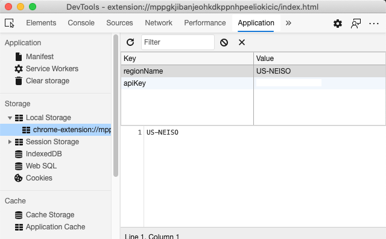

# ブラウザ拡張機能プロジェクト その 2: API の呼び出し、ローカルストレージの使用

## レッスン前の小テスト

[レッスン前の小テスト](https://ashy-river-0debb7803.1.azurestaticapps.net/quiz/25?loc=ja)

### イントロダクション

このレッスンでは、ブラウザ拡張機能のフォームを送信して API を呼び出し、その結果をブラウザ拡張機能に表示します。また、将来の参照や利用のために、ブラウザのローカルストレージにデータを保存する方法についても学びます。

✅ コードをどこに配置するかについては、適切なファイル内の番号の付いたセグメントを参照してください。

### 拡張機能で操作する要素の設定:

この時点で、フォーム用の HTML とブラウザ拡張機能用の結果 `<div>` が構築されています。これからは、`/src/index.js` ファイルを使って少しずつ拡張機能を構築していく必要があります。プロジェクトのセットアップとビルドのプロセスについては [前のレッスン](../../1-about-browsers/translations/README.ja.md) を参照してください。

`index.js` ファイルの中で作業を行うには、様々なフィールドに関連付けられた値を保持するための `const` 変数を作成することから始めます。

```javascript
// フォームフィールド
const form = document.querySelector('.form-data');
const region = document.querySelector('.region-name');
const apiKey = document.querySelector('.api-key');

// 結果
const errors = document.querySelector('.errors');
const loading = document.querySelector('.loading');
const results = document.querySelector('.result-container');
const usage = document.querySelector('.carbon-usage');
const fossilfuel = document.querySelector('.fossil-fuel');
const myregion = document.querySelector('.my-region');
const clearBtn = document.querySelector('.clear-btn');
```

前のレッスンで HTML で設定したように、これらのフィールドはすべてその CSS クラスによって参照されます。

### リスナーの追加

次に、フォームにイベントリスナーを追加し、フォームをリセットするクリアボタンを追加します。ユーザーがフォームを送信したり、リセットボタンをクリックしたりした場合に、そのリセットボタンをクリックするようにします。何かが起こるときのため、ファイルの一番下にアプリを初期化するための呼び出しを追加します。

```javascript
form.addEventListener('submit', (e) => handleSubmit(e));
clearBtn.addEventListener('click', (e) => reset(e));
init();
```

✅ 投稿やクリックのイベントをリッスンするために使用される速記法と、そのイベントがどのように handleSubmit や reset 関数に渡されるかに注目してください。この速記法と同等のものを、より長い形式で書くことができますか? どちらがいいですか?

### init() 関数と reset() 関数のビルド

今度は拡張機能を初期化する関数を作ります。これは init() と呼ばれています。

```javascript
function init() {
	//何かがローカルストレージにある場合は、それをピックアップします。
	const storedApiKey = localStorage.getItem('apiKey');
	const storedRegion = localStorage.getItem('regionName');

	//アイコンを一般的な緑色に設定
	//todo

	if (storedApiKey === null || storedRegion === null) {
		//キーを持っていない場合は、フォームを表示します。
		form.style.display = 'block';
		results.style.display = 'none';
		loading.style.display = 'none';
		clearBtn.style.display = 'none';
		errors.textContent = '';
	} else {
        //ローカルストレージにキー/領域を保存している場合、そのキー/領域がロードされたときに結果を表示します。
        displayCarbonUsage(storedApiKey, storedRegion);
		results.style.display = 'none';
		form.style.display = 'none';
		clearBtn.style.display = 'block';
	}
};

function reset(e) {
	e.preventDefault();
	//リージョン専用のローカルストレージをクリアします。
	localStorage.removeItem('regionName');
	init();
}

```
この関数には、面白いロジックがあります。これを読み進めていくと、何が起こるかわかりますか?

- 2つの `const` は、ユーザが API キーとリージョンコードをローカルストレージに保存しているかどうかをチェックするために設定されます
- どちらかが null の場合、フォームのスタイルを 'block' として表示するように変更してフォームを表示します
- 結果、読み込み、および clearBtn を非表示にし、エラーテキストを空の文字列に設定します
- キーとリージョンが存在する場合は、そのためのルーチンを開始します
  - API を呼び出して炭素使用量のデータを取得します
  - 結果領域を非表示にします
  - フォームを非表示にします
  - リセットボタンを表示します

先に進む前に、ブラウザで利用できる非常に重要な概念を知っておくと便利です。それは [ローカルストレージ](https://developer.mozilla.org/ja/docs/Web/API/Window/localStorage) です。ローカルストレージは文字列を `key-value` のペアとしてブラウザに保存する便利な方法です。このタイプの Web ストレージは JavaScript で操作することができ、ブラウザでデータを管理することができます。ローカルストレージは有効期限がありませんが、もう一つの種類の Web ストレージであるセッションストレージはブラウザを閉じると消去されます。様々なタイプのストレージには、その使用方法に長所と短所があります。

> 注意 - ブラウザ拡張機能は独自のローカルストレージを持っています。メインのブラウザウィンドウは別のインスタンスであり、別々に動作します。

API キーに文字列の値を設定して、例えば Edge では Web ページを「検査」して (ブラウザを右クリックして検査することができます)、「アプリケーション」タブに行ってストレージを確認することで設定されていることがわかります。



✅ ローカルストレージにデータを保存したくない状況を考えてみてください。一般的に、API キーをローカルストレージに置くのは悪い考えです! 理由がわかりますか? 私たちの場合、アプリは純粋に学習用であり、アプリストアにはデプロイされないので、このメソッドを使用します。

ローカルストレージを操作するには、`getItem()`, `setItem()`, `removeItem()` のいずれかの方法で Web API を使用することに注意してください。これはブラウザ全体で広くサポートされています。

`init()` で呼び出される `displayCarbonUsage()` 関数を構築する前に、フォームの初期投稿を処理する機能を構築しましょう。

### フォーム送信の処理

イベント引数 `(e)` を受け取る関数 `handleSubmit` を作成します。イベントの伝播を停止し (この場合、ブラウザの更新を停止したい)、新しい関数 `setUpUser` を呼び出し、引数 `apiKey.value` と `region.value` を渡します。このようにして、適切なフィールドが入力されたときに初期フォームから取得される2つの値を利用します。

```javascript
function handleSubmit(e) {
	e.preventDefault();
	setUpUser(apiKey.value, region.value);
}
```
✅ 記憶をリフレッシュしてください - 前回のレッスンで設定した HTML には、ファイルの先頭に設定した `const` で `values` が取得される2つの入力フィールドがあり、両方とも `required` であるため、ブラウザはユーザが null 値を入力しないようにします。

### ユーザーの設定

次に `setUpUser` 関数に進み、ここで apiKey と regionName のローカルストレージの値を設定します。新しい関数を追加します。

```javascript
function setUpUser(apiKey, regionName) {
	localStorage.setItem('apiKey', apiKey);
	localStorage.setItem('regionName', regionName);
	loading.style.display = 'block';
	errors.textContent = '';
	clearBtn.style.display = 'block';
	//初期化の呼び出し
	displayCarbonUsage(apiKey, regionName);
}
```
この関数は、API が呼び出されている間に表示するローディングメッセージを設定します。この時点で、このブラウザ拡張機能の最も重要な機能の作成に到達しました!

### 炭素使用量の表示

ついに API に問い合わせをする時が来ました!

先に進む前に、API について説明しましょう。API ([Application Programming Interfaces](https://www.webopedia.com/TERM/A/API.html)) は、Web 開発者のツールボックスの重要な要素です。API は、プログラムが相互作用し、相互にインターフェースするための標準的な方法を提供します。例えば、データベースへの問い合わせが必要な Web サイトを構築している場合、誰かが API を作成しているかもしれません。API には多くの種類がありますが、最も人気のあるものの一つが [REST API](https://www.smashingmagazine.com/2018/01/understanding-using-rest-api/) です。

✅ 'REST' とは 'Representational State Transfer' の略で、様々な設定の URL を使ってデータを取得するのが特徴です。開発者が利用できる様々なタイプの API について少し調べてみてください。どのような形式に興味がありますか?

この関数には注意すべき重要な点があります。まず、[`async` キーワード](https://developer.mozilla.org/ja/docs/Web/JavaScript/Reference/Statements/async_function)に注目してください。非同期的に実行されるように関数を書くということは、データが返されるなどのアクションが完了するのを待ってから続行するということです。

以下は `async` についての簡単なビデオです:

[](https://youtube.com/watch?v=YwmlRkrxvkk "Async and Await for managing promises")

C02Signal API に問い合わせを行うための新しい関数を作成します:

```javascript
import axios from '../node_modules/axios';

async function displayCarbonUsage(apiKey, region) {
	try {
		await axios
			.get('https://api.co2signal.com/v1/latest', {
				params: {
					countryCode: region,
				},
				headers: {
					'auth-token': apiKey,
				},
			})
			.then((response) => {
				let CO2 = Math.floor(response.data.data.carbonIntensity);

				//calculateColor(CO2);

				loading.style.display = 'none';
				form.style.display = 'none';
				myregion.textContent = region;
				usage.textContent =
					Math.round(response.data.data.carbonIntensity) + ' grams (grams C02 emitted per kilowatt hour)';
				fossilfuel.textContent =
					response.data.data.fossilFuelPercentage.toFixed(2) +
					'% (percentage of fossil fuels used to generate electricity)';
				results.style.display = 'block';
			});
	} catch (error) {
		console.log(error);
		loading.style.display = 'none';
		results.style.display = 'none';
		errors.textContent = 'Sorry, we have no data for the region you have requested.';
	}
}
```

これは大きな機能です。何が起こっているのでしょうか?

- ベストプラクティスに従って、この関数を非同期的に動作させるために `async` キーワードを使用します。API がデータを返すときにプロミスを返すので、この関数には `try/catch` ブロックが含まれています。API が応答する速度を制御できないので (全く応答しないかもしれません!)、非同期的に呼び出すことでこの不確実性を処理する必要があります
- co2signal API に問い合わせをして、API キーを使用してリージョンのデータを取得しています。そのキーを使用するには、ヘッダのパラメータで認証の種類を使用しなければなりません
- API が応答したら、その応答データの様々な要素を、このデータを表示するために設定した画面の部分に割り当てます
- エラーがあったり、結果が出なかったりすると、エラーメッセージが表示されます

✅ 非同期プログラミングパターンを使用することも、ツールボックスの中で非常に便利なツールです。このタイプのコードを設定するための[様々な方法について](https://developer.mozilla.org/ja/docs/Web/JavaScript/Reference/Statements/async_function)お読みください。

おめでとうございます! 拡張機能をビルド (`npm run build`) して、拡張機能ペインで更新すると、拡張機能が動作するようになりました! 動作していないのはアイコンだけで、次のレッスンで修正します。

---

## 🚀 チャレンジ

これらのレッスンでは、これまでにいくつかの種類の API について説明してきました。Web API を選択して、その API が提供しているものを詳しく調べてみましょう。例えば、[HTML ドラッグ＆ドロップ API](https://developer.mozilla.org/ja/docs/Web/API/HTML_Drag_and_Drop_API) のようなブラウザ内で利用できる API を見てみましょう。あなたの意見では、何が素晴らしい API を作るのでしょうか?

## レッスン後の小テスト

[レッスン後の小テスト](https://ashy-river-0debb7803.1.azurestaticapps.net/quiz/26?loc=ja)

## 復習と自己学習

このレッスンではローカルストレージと API について学びましたが、どちらもプロの Web 開発者にとって非常に有用なものです。この2つがどのように連携しているか考えてみましたか? API で使用するアイテムを保存する Web サイトをどのように構築するか考えてみてください。

## 課題

[API を採用する](assignment.ja.md)

