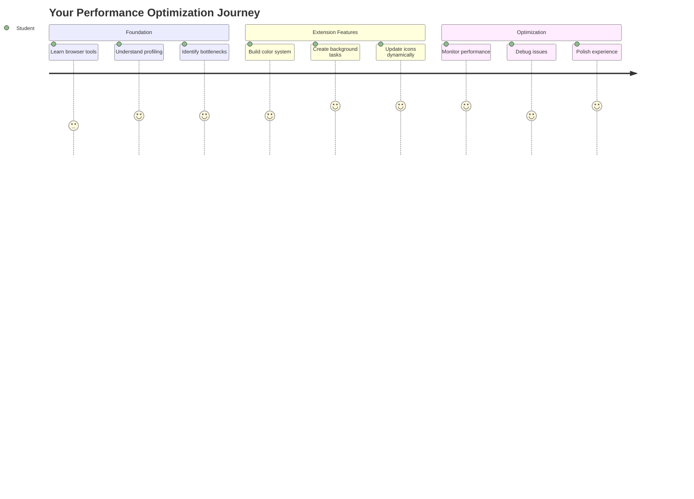
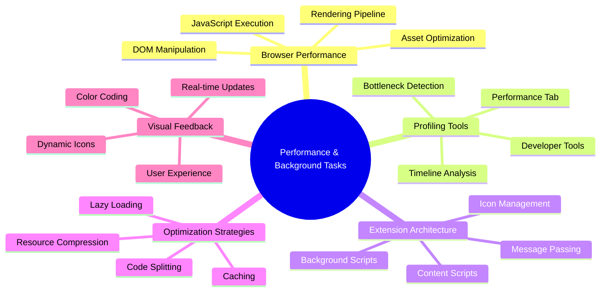
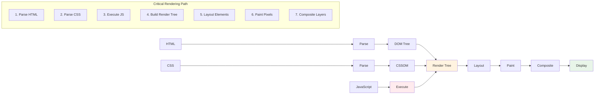
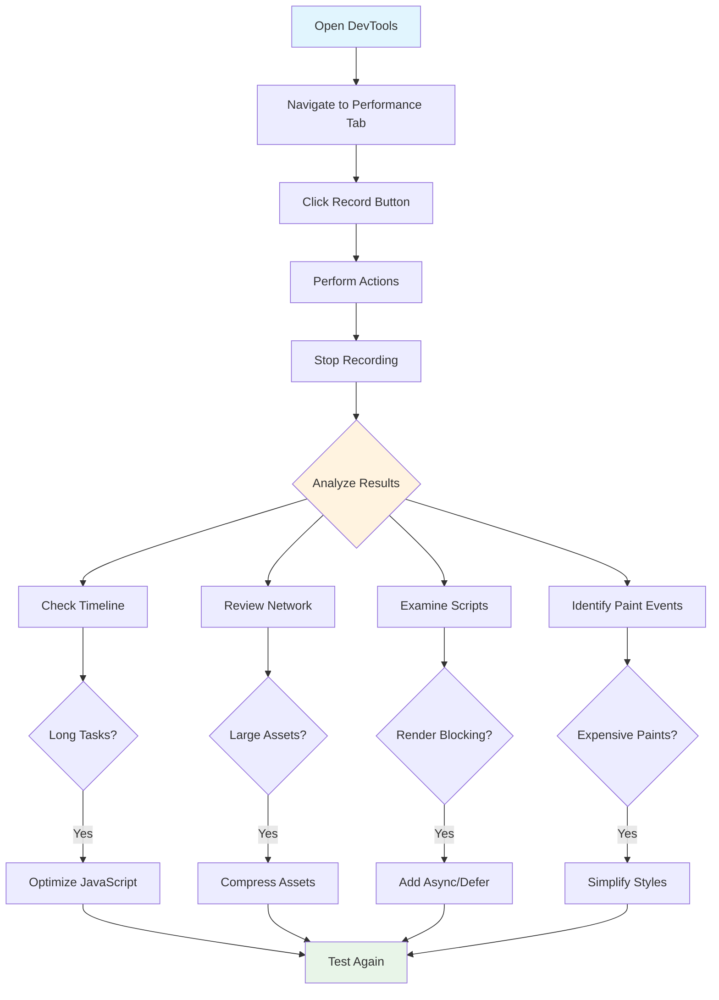
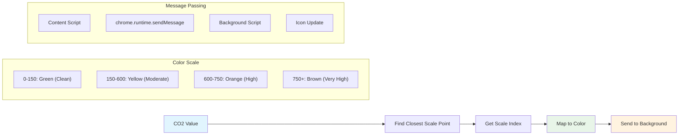
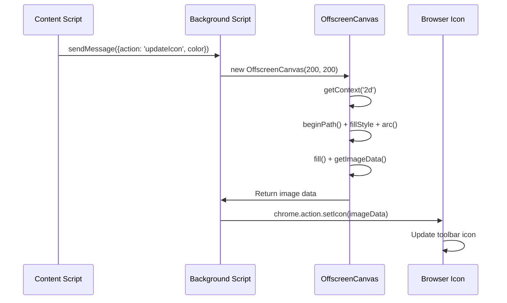
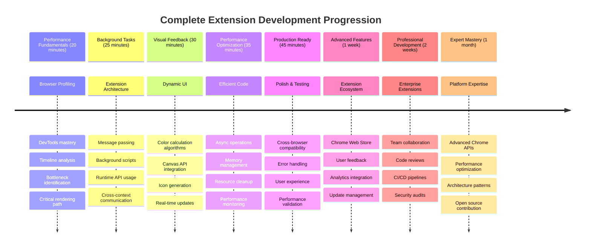

# Browser Extension Project Part 3: Learn about Background Tasks and Performance



Ever wonder what makes some browser extensions feel snappy and responsive while others seem sluggish? The secret lies in what's happening behind the scenes. While users click around your extension's interface, there's a whole world of background processes quietly managing data fetching, icon updates, and system resources.

This is our final lesson in the browser extension series, and we're going to make your carbon footprint tracker work smoothly. You'll add dynamic icon updates and learn how to spot performance issues before they become problems. It's like tuning a race car - small optimizations can make a huge difference in how everything runs.

By the time we're done, you'll have a polished extension and understand the performance principles that separate good web apps from great ones. Let's dive into the world of browser optimization.

## Pre-Lecture Quiz

[Pre-lecture quiz](https://ff-quizzes.netlify.app/web/quiz/27)

### Introduction

In our previous lessons, you built a form, connected it to an API, and tackled asynchronous data fetching. Your extension is taking shape nicely.

Now we need to add the finishing touches - like making that extension icon change colors based on the carbon data. This reminds me of how NASA had to optimize every system on the Apollo spacecraft. They couldn't afford any wasted cycles or memory because lives depended on performance. While our browser extension isn't quite that critical, the same principles apply - efficient code creates better user experiences.



## Web Performance Basics

When your code runs efficiently, people can actually *feel* the difference. You know that moment when a page loads instantly or an animation flows smoothly? That's good performance at work.

Performance isn't just about speed - it's about making web experiences that feel natural instead of clunky and frustrating. Back in the early days of computing, Grace Hopper famously kept a nanosecond (a piece of wire about a foot long) on her desk to show how far light travels in one billionth of a second. It was her way of explaining why every microsecond matters in computing. Let's explore the detective tools that help you figure out what's slowing things down.

> "Website performance is about two things: how fast the page loads, and how fast the code on it runs." -- [Zack Grossbart](https://www.smashingmagazine.com/2012/06/javascript-profiling-chrome-developer-tools/)

The topic of how to make your websites blazingly fast on all kinds of devices, for all kinds of users, in all kinds of situations, is unsurprisingly vast. Here are some points to keep in mind as you build either a standard web project or a browser extension.

The first step in optimizing your site is understanding what's actually happening under the hood. Fortunately, your browser comes with powerful detective tools built right in.



To open Developer Tools in Edge, click those three dots in the top right corner, then go to More Tools > Developer Tools. Or use the keyboard shortcut: `Ctrl` + `Shift` + `I` on Windows or `Option` + `Command` + `I` on Mac. Once you're there, click on the Performance tab - this is where you'll do your investigation.

**Here's your performance detective toolkit:**
- **Open** Developer Tools (you'll use these constantly as a developer!)
- **Head** to the Performance tab - think of it as your web app's fitness tracker
- **Hit** that Record button and watch your page in action
- **Study** the results to spot what's slowing things down

Let's try this out. Open a website (Microsoft.com works well for this) and click that 'Record' button. Now refresh the page and watch the profiler capture everything that happens. When you stop recording, you'll see a detailed breakdown of how the browser 'scripts', 'renders', and 'paints' the site. It reminds me of how mission control monitors every system during a rocket launch - you get real-time data on exactly what's happening and when.


✅ The [Microsoft Documentation](https://docs.microsoft.com/microsoft-edge/devtools-guide/performance/?WT.mc_id=academic-77807-sagibbon) has tons more details if you want to dive deeper

> Pro tip: Clear your browser cache before testing to see how your site performs for first-time visitors - it's usually quite different from repeat visits!

Select elements of the profile timeline to zoom in on events that happen while your page loads.

Get a snapshot of your page's performance by selecting a part of the profile timeline and looking at the summary pane:


Check the Event Log pane to see if any event took longer than 15 ms:


✅ Get to know your profiler! Open the developer tools on this site and see if there are any bottlenecks. What's the slowest-loading asset? The fastest?



## What to Look For When Profiling

Running the profiler is just the beginning - the real skill is knowing what those colorful charts are actually telling you. Don't worry, you'll get the hang of reading them. Experienced developers have learned to spot the warning signs before they become full-blown problems.

Let's talk about the usual suspects - the performance troublemakers that tend to sneak into web projects. Like how Marie Curie had to carefully monitor radiation levels in her lab, we need to watch for certain patterns that indicate trouble brewing. Catching these early will save you (and your users) a lot of frustration.

**Asset sizes**: Websites have been getting "heavier" over the years, and a lot of that extra weight comes from images. It's like we've been stuffing more and more into our digital suitcases.

✅ Check out the [Internet Archive](https://httparchive.org/reports/page-weight) to see how page sizes have grown over time - it's quite revealing.

**Here's how to keep your assets optimized:**
- **Compress** those images! Modern formats like WebP can cut file sizes dramatically
- **Serve** the right image size for each device - no need to send huge desktop images to phones
- **Minify** your CSS and JavaScript - every byte counts
- **Use** lazy loading so images only download when users actually scroll to them

**DOM traversals**: The browser has to build its Document Object Model based on the code you write, so it's in the interest of good page performance to keep your tags minimal, only using and styling what the page needs. To this point, excess CSS associated with a page could be optimized; styles that need to be used only on one page don't need to be included in the main style sheet, for example.

**Key strategies for DOM optimization:**
- **Minimizes** the number of HTML elements and nesting levels
- **Removes** unused CSS rules and consolidates stylesheets efficiently
- **Organizes** CSS to load only what's needed for each page
- **Structures** HTML semantically for better browser parsing

**JavaScript**: Every JavaScript developer should watch for 'render-blocking' scripts that must be loaded before the rest of the DOM can be traversed and painted to the browser. Consider using `defer` with your inline scripts (as is done in the Terrarium module).

**Modern JavaScript optimization techniques:**
- **Uses** the `defer` attribute to load scripts after DOM parsing
- **Implements** code splitting to load only necessary JavaScript
- **Applies** lazy loading for non-critical functionality
- **Minimizes** the use of heavy libraries and frameworks when possible

✅ Try some sites on a [Site Speed Test website](https://www.webpagetest.org/) to learn more about the common checks that are done to determine site performance.

### 🔄 **Pedagogical Check-in**
**Performance Understanding**: Before building extension features, ensure you can:
- ✅ Explain the critical rendering path from HTML to pixels
- ✅ Identify common performance bottlenecks in web applications
- ✅ Use browser developer tools to profile page performance
- ✅ Understand how asset size and DOM complexity affect speed

**Quick Self-Test**: What happens when you have render-blocking JavaScript?
*Answer: The browser must download and execute the script before it can continue parsing HTML and rendering the page*

**Real-World Performance Impact**:
- **100ms delay**: Users notice the slowdown
- **1 second delay**: Users start losing focus
- **3+ seconds**: 40% of users abandon the page
- **Mobile networks**: Performance matters even more

Now that you have an idea of how the browser renders the assets you send to it, let's look at the last few things you need to do to complete your extension:

### Create a function to calculate color

Now we'll create a function that turns numerical data into meaningful colors. Think of it like a traffic light system - green for clean energy, red for high carbon intensity.

This function will take the CO2 data from our API and determine what color best represents the environmental impact. It's similar to how scientists use color-coding in heat maps to visualize complex data patterns - from ocean temperatures to star formation. Let's add this to `/src/index.js`, right after those `const` variables we set up earlier:



```javascript
function calculateColor(value) {
	// Define CO2 intensity scale (grams per kWh)
	const co2Scale = [0, 150, 600, 750, 800];
	// Corresponding colors from green (clean) to dark brown (high carbon)
	const colors = ['#2AA364', '#F5EB4D', '#9E4229', '#381D02', '#381D02'];

	// Find the closest scale value to our input
	const closestNum = co2Scale.sort((a, b) => {
		return Math.abs(a - value) - Math.abs(b - value);
	})[0];
	
	console.log(`${value} is closest to ${closestNum}`);
	
	// Find the index for color mapping
	const num = (element) => element > closestNum;
	const scaleIndex = co2Scale.findIndex(num);

	const closestColor = colors[scaleIndex];
	console.log(scaleIndex, closestColor);

	// Send color update message to background script
	chrome.runtime.sendMessage({ action: 'updateIcon', value: { color: closestColor } });
}
```

**Let's break down this clever little function:**
- **Sets up** two arrays - one for CO2 levels, another for colors (green = clean, brown = dirty!)
- **Finds** the closest match to our actual CO2 value using some neat array sorting
- **Grabs** the matching color using the findIndex() method
- **Sends** a message to Chrome's background script with our chosen color
- **Uses** template literals (those backticks) for cleaner string formatting
- **Keeps** everything organized with const declarations

The `chrome.runtime` [API](https://developer.chrome.com/extensions/runtime) is like the nervous system of your extension - it handles all the behind-the-scenes communication and tasks:

> "Use the chrome.runtime API to retrieve the background page, return details about the manifest, and listen for and respond to events in the app or extension lifecycle. You can also use this API to convert the relative path of URLs to fully-qualified URLs."

**Why the Chrome Runtime API is so handy:**
- **Lets** different parts of your extension talk to each other
- **Handles** background work without freezing the user interface
- **Manages** your extension's lifecycle events
- **Makes** message passing between scripts super easy

✅ If you're developing this browser extension for Edge, it might surprise you that you're using a chrome API. The newer Edge browser versions run on the Chromium browser engine, so you can leverage these tools.



```mermaid
architecture-beta
    group browser(logos:chrome)[Browser]
    
    service popup(logos:html5)[Popup UI] in browser
    service content(logos:javascript)[Content Script] in browser
    service background(database)[Background Script] in browser
    service api(logos:api)[External API] in browser
    
    popup:R -- L:content
    content:R -- L:background
    background:T -- B:api
    content:T -- B:api
    
    junction junctionCenter in browser
    popup:R -- L:junctionCenter
    junctionCenter:R -- L:background
```

> **Pro Tip**: If you want to profile a browser extension, launch the dev tools from within the extension itself, as it is its own separate browser instance. This gives you access to extension-specific performance metrics.

### Set a default icon color

Before we start fetching real data, let's give our extension a starting point. Nobody likes staring at a blank or broken-looking icon. We'll start with a green color so users know the extension is working from the moment they install it.

In your `init()` function, let's set up that default green icon:

```javascript
chrome.runtime.sendMessage({
	action: 'updateIcon',
	value: {
		color: 'green',
	},
});
```

**What this initialization accomplishes:**
- **Sets** a neutral green color as the default state
- **Provides** immediate visual feedback when the extension loads
- **Establishes** the communication pattern with the background script
- **Ensures** users see a functional extension before data loads
### Call the function, execute the call

Now let's connect everything together so that when fresh CO2 data comes in, your icon automatically updates with the right color. It's like connecting the final circuit in an electronic device - suddenly all the individual components work as one system.

Add this line right after you get the CO2 data from the API:

```javascript
// After retrieving CO2 data from the API
// let CO2 = data.data[0].intensity.actual;
calculateColor(CO2);
```

**This integration accomplishes:**
- **Connects** the API data flow with the visual indicator system
- **Triggers** icon updates automatically when new data arrives
- **Ensures** real-time visual feedback based on current carbon intensity
- **Maintains** the separation of concerns between data fetching and display logic

And finally, in `/dist/background.js`, add the listener for these background action calls:

```javascript
// Listen for messages from the content script
chrome.runtime.onMessage.addListener(function (msg, sender, sendResponse) {
	if (msg.action === 'updateIcon') {
		chrome.action.setIcon({ imageData: drawIcon(msg.value) });
	}
});

// Draw dynamic icon using Canvas API
// Borrowed from energy lollipop extension - nice feature!
function drawIcon(value) {
	// Create an offscreen canvas for better performance
	const canvas = new OffscreenCanvas(200, 200);
	const context = canvas.getContext('2d');

	// Draw a colored circle representing carbon intensity
	context.beginPath();
	context.fillStyle = value.color;
	context.arc(100, 100, 50, 0, 2 * Math.PI);
	context.fill();

	// Return the image data for the browser icon
	return context.getImageData(50, 50, 100, 100);
}
```

**Here's what this background script does:**
- **Listens** for messages from your main script (like a receptionist taking calls)
- **Processes** those 'updateIcon' requests to change your toolbar icon
- **Creates** new icons on the fly using the Canvas API
- **Draws** a simple colored circle that shows the current carbon intensity
- **Updates** your browser toolbar with the fresh icon
- **Uses** OffscreenCanvas for smooth performance (no UI blocking)

✅ You'll learn more about the Canvas API in the [Space Game lessons](../../6-space-game/2-drawing-to-canvas/README.md).



### 🔄 **Pedagogical Check-in**
**Complete Extension Understanding**: Verify your mastery of the entire system:
- ✅ How does message passing work between different extension scripts?
- ✅ Why do we use OffscreenCanvas instead of regular Canvas for performance?
- ✅ What role does the Chrome Runtime API play in extension architecture?
- ✅ How does the color calculation algorithm map data to visual feedback?

**Performance Considerations**: Your extension now demonstrates:
- **Efficient messaging**: Clean communication between script contexts
- **Optimized rendering**: OffscreenCanvas prevents UI blocking
- **Real-time updates**: Dynamic icon changes based on live data
- **Memory management**: Proper cleanup and resource handling

**Time to test your extension:**
- **Build** everything with `npm run build`
- **Reload** your extension in the browser (don't forget this step)
- **Open** your extension and watch that icon change colors
- **Check** how it responds to real carbon data from around the world

Now you'll know at a glance whether it's a good time for that load of laundry or if you should wait for cleaner energy. You've just built something genuinely useful and learned about browser performance along the way.

## GitHub Copilot Agent Challenge 🚀

Use the Agent mode to complete the following challenge:

**Description:** Enhance the browser extension's performance monitoring capabilities by adding a feature that tracks and displays load times for different components of the extension.

**Prompt:** Create a performance monitoring system for the browser extension that measures and logs the time it takes to fetch CO2 data from the API, calculate colors, and update the icon. Add a function called `performanceTracker` that uses the Performance API to measure these operations and displays the results in the browser console with timestamps and duration metrics.

Learn more about [agent mode](https://code.visualstudio.com/blogs/2025/02/24/introducing-copilot-agent-mode) here.

## 🚀 Challenge

Here's an interesting detective mission: pick a few open source websites that have been around for years (think Wikipedia, GitHub, or Stack Overflow) and dig into their commit history. Can you spot where they made performance improvements? What problems kept cropping up?

**Your investigation approach:**
- **Search** commit messages for words like "optimize," "performance," or "faster"
- **Look** for patterns - do they keep fixing the same types of issues?
- **Identify** the common culprits that slow down websites
- **Share** what you discover - other developers learn from real-world examples

## Post-Lecture Quiz

[Post-lecture quiz](https://ff-quizzes.netlify.app/web/quiz/28)

## Review & Self Study

Consider signing up for a [performance newsletter](https://perf.email/)

Investigate some of the ways that browsers gauge web performance by looking through the performance tabs in their web tools. Do you find any major differences?

### ⚡ **What You Can Do in the Next 5 Minutes**
- [ ] Open browser Task Manager (Shift+Esc in Chrome) to see extension resource usage
- [ ] Use DevTools Performance tab to record and analyze webpage performance
- [ ] Check the browser's Extensions page to see which extensions impact startup time
- [ ] Try disabling extensions temporarily to see performance differences

### 🎯 **What You Can Accomplish This Hour**
- [ ] Complete the post-lesson quiz and understand performance concepts
- [ ] Implement a background script for your browser extension
- [ ] Learn to use browser.alarms for efficient background tasks
- [ ] Practice message passing between content scripts and background scripts
- [ ] Measure and optimize your extension's resource usage

### 📅 **Your Week-Long Performance Journey**
- [ ] Complete a high-performance browser extension with background functionality
- [ ] Master service workers and modern extension architecture
- [ ] Implement efficient data synchronization and caching strategies
- [ ] Learn advanced debugging techniques for extension performance
- [ ] Optimize your extension for both functionality and resource efficiency
- [ ] Create comprehensive tests for extension performance scenarios

### 🌟 **Your Month-Long Optimization Mastery**
- [ ] Build enterprise-grade browser extensions with optimal performance
- [ ] Learn about Web Workers, Service Workers, and modern web performance
- [ ] Contribute to open source projects focused on performance optimization
- [ ] Master browser internals and advanced debugging techniques
- [ ] Create performance monitoring tools and best practices guides
- [ ] Become a performance expert who helps optimize web applications

## 🎯 Your Browser Extension Mastery Timeline



### 🛠️ Your Complete Extension Development Toolkit

After completing this trilogy, you now have mastered:
- **Browser Architecture**: Deep understanding of how extensions integrate with browser systems
- **Performance Profiling**: Ability to identify and fix bottlenecks using developer tools
- **Async Programming**: Modern JavaScript patterns for responsive, non-blocking operations
- **API Integration**: External data fetching with authentication and error handling
- **Visual Design**: Dynamic UI updates and Canvas-based graphics generation
- **Message Passing**: Inter-script communication in extension architectures
- **User Experience**: Loading states, error handling, and intuitive interactions
- **Production Skills**: Testing, debugging, and optimization for real-world deployment

**Real-World Applications**: Your extension development skills apply directly to:
- **Progressive Web Apps**: Similar architecture and performance patterns
- **Electron Desktop Apps**: Cross-platform applications using web technologies
- **Mobile Hybrid Apps**: Cordova/PhoneGap development using web APIs
- **Enterprise Web Applications**: Complex dashboard and productivity tools
- **Chrome DevTools Extensions**: Advanced developer tooling and debugging
- **Web API Integration**: Any application that communicates with external services

**Professional Impact**: You can now:
- **Build** production-ready browser extensions from concept to deployment
- **Optimize** web application performance using industry-standard profiling tools
- **Architect** scalable systems with proper separation of concerns
- **Debug** complex async operations and cross-context communication
- **Contribute** to open source extension projects and browser standards

**Next Level Opportunities**:
- **Chrome Web Store Developer**: Publish extensions for millions of users
- **Web Performance Engineer**: Specialize in optimization and user experience
- **Browser Platform Developer**: Contribute to browser engine development
- **Extension Framework Creator**: Build tools that help other developers
- **Developer Relations**: Share knowledge through teaching and content creation

🌟 **Achievement Unlocked**: You've built a complete, functional browser extension that demonstrates professional development practices and modern web standards!

## Assignment

[Analyze a site for performance](assignment.md)

