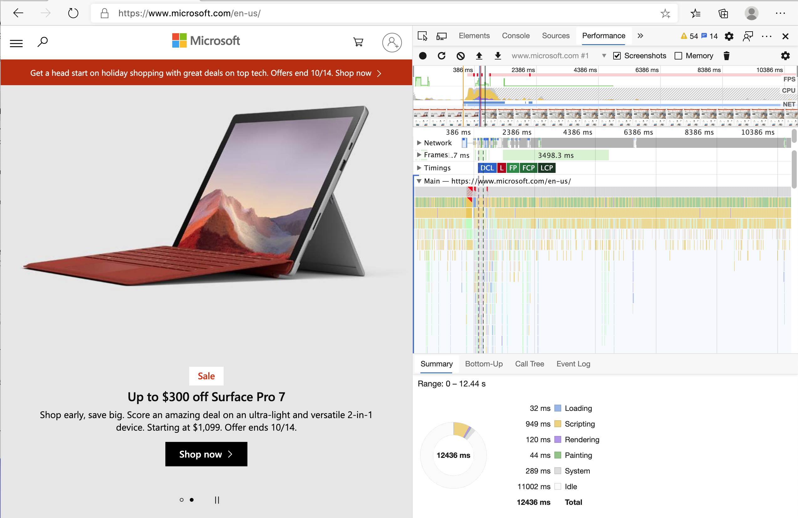
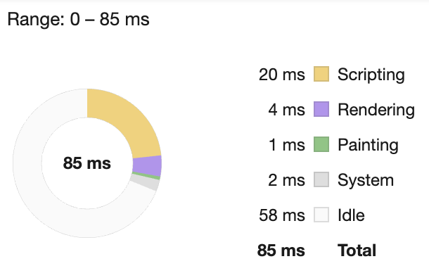
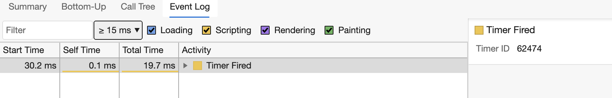

# Projek Pelanjutan Penyemak Imbas Bahagian 3: Ketahui mengenai Tugas dan Prestasi Latar Belakang

## Kuiz Pra Kuliah

[Kuiz Pra Kuliah](https://happy-mud-02d95f10f.azurestaticapps.net/quiz/27)

### Pengenalan

Dalam dua pelajaran terakhir modul ini, anda belajar bagaimana membuat borang dan kawasan paparan untuk data yang diambil dari API. Ini adalah kaedah yang sangat standard untuk membuat kehadiran web di web. Anda juga belajar bagaimana menangani pengambilan data secara tidak serentak. Sambungan penyemak imbas anda hampir selesai.

Masih perlu untuk menguruskan beberapa tugas latar belakang, termasuk menyegarkan warna ikon pelanjutan, jadi ini adalah masa yang tepat untuk membincangkan bagaimana penyemak imbas menguruskan tugas seperti ini. Mari fikirkan tugas penyemak imbas ini dalam konteks prestasi aset web anda semasa anda membuatnya.

## Asas Prestasi Web

> "Prestasi laman web adalah mengenai dua perkara: seberapa pantas halaman dimuat, dan seberapa pantas kod di dalamnya berjalan." - [Zack Grossbart](https://www.smashingmagazine.com/2012/06/javascript-profiling-chrome-developer-tools/)

Topik bagaimana membuat laman web anda sangat cepat di semua jenis peranti, untuk semua jenis pengguna, dalam semua jenis situasi, sangat mengejutkan. Berikut adalah beberapa perkara yang perlu diingat semasa anda membina projek web standard atau pelanjutan penyemak imbas.

Perkara pertama yang perlu anda lakukan untuk memastikan laman web anda berjalan dengan cekap adalah mengumpulkan data mengenai prestasinya. Tempat pertama untuk melakukan ini adalah dengan alat pembangun penyemak imbas web anda. Di Edge, anda boleh memilih butang "Tetapan dan lain-lain" (ikon tiga titik di kanan atas penyemak imbas), kemudian arahkan ke Lebih Banyak Alat> Alat Pembangun dan buka tab Prestasi. Anda juga boleh menggunakan pintasan papan kekunci `Ctrl` + `Shift` + `I` pada Windows, atau `Option` + `Command` + `I` di Mac untuk membuka alat pembangun.

Tab Prestasi mengandungi alat Profil. Buka laman web (cuba, misalnya, https://www.microsoft.com) dan klik butang 'Rakam', kemudian muat semula laman web tersebut. Hentikan rakaman pada bila-bila masa, dan anda akan dapat melihat rutin yang dihasilkan untuk 'script', 'render', dan 'cat' laman web ini:



✅ Lawati [Microsoft Documentation](https://docs.microsoft.com/microsoft-edge/devtools-guide/performance) pada panel Performance di Edge

> Petua: untuk mendapatkan bacaan sebenar mengenai masa permulaan laman web anda, kosongkan cache penyemak imbas anda

Pilih elemen garis masa profil untuk memperbesar peristiwa yang berlaku semasa halaman anda dimuat.

Dapatkan gambaran prestasi halaman anda dengan memilih bahagian garis masa profil dan melihat panel ringkasan:



Periksa panel Log Peristiwa untuk melihat apakah ada acara yang mengambil masa lebih dari 15 ms



✅ Kenali profiler anda! Buka alat pembangun di laman web ini dan lihat apakah ada kesulitan. Apakah aset pemuatan paling lambat? Paling pantas?

## Pemeriksaan profil

Secara umum ada beberapa "masalah" yang harus diperhatikan oleh setiap pembangun web ketika membangun laman web, untuk mengelakkan kejutan buruk ketika tiba waktunya untuk digunakan.

**Saiz aset**: Web menjadi 'lebih berat', dan dengan itu lebih perlahan, sejak beberapa tahun kebelakangan. Sebilangan berat ini ada kaitannya dengan penggunaan gambar.

✅ Lihat melalui [Arkib Internet](https://httparchive.org/reports/page-weight) untuk melihat sejarah berat halaman dan banyak lagi.

Amalan yang baik adalah memastikan gambar anda dioptimumkan, disampaikan pada ukuran dan resolusi yang tepat untuk pengguna anda.

**DOM traversals**: Penyemak imbas harus membina Model Objek Dokumennya berdasarkan kod yang anda tulis, jadi demi prestasi halaman yang baik untuk memastikan tag anda minimum, hanya menggunakan dan menggayakan apa yang diperlukan oleh halaman. Hingga saat ini, lebihan CSS yang dikaitkan dengan halaman dapat dioptimumkan; gaya yang hanya perlu digunakan pada satu halaman tidak perlu disertakan dalam helaian gaya utama, misalnya.

**JavaScript**: Setiap pengembang JavaScript harus menonton skrip 'render-blocking' yang mesti dimuat sebelum sisa DOM dapat dilalui dan dicat ke penyemak imbas. Pertimbangkan untuk menggunakan `defer` dengan skrip sebaris anda (seperti yang dilakukan dalam modul Terrarium).

✅ Cubalah beberapa laman web di [laman web Uji Kelajuan Web](https://www.webpagetest.org/) untuk mengetahui lebih lanjut mengenai pemeriksaan biasa yang dilakukan untuk menentukan prestasi laman web.

Setelah anda mempunyai idea tentang bagaimana penyemak imbas memberikan aset yang anda hantar kepadanya, mari kita lihat beberapa perkara terakhir yang perlu anda lakukan untuk menyelesaikan peluasan anda:

### Buat fungsi untuk mengira warna

Bekerja di `/src/index.js`, tambahkan fungsi yang disebut `calculColor ()` setelah rangkaian pemboleh ubah `const` yang anda tetapkan untuk mendapatkan akses ke DOM:

```JavaScript
function calculateColor(value) {
	let co2Scale = [0, 150, 600, 750, 800];
	let colors = ['#2AA364', '#F5EB4D', '#9E4229', '#381D02', '#381D02'];

	let closestNum = co2Scale.sort((a, b) => {
		return Math.abs(a - value) - Math.abs(b - value);
	})[0];
	console.log(value + ' is closest to ' + closestNum);
	let num = (element) => element > closestNum;
	let scaleIndex = co2Scale.findIndex(num);

	let closestColor = colors[scaleIndex];
	console.log(scaleIndex, closestColor);

	chrome.runtime.sendMessage({ action: 'updateIcon', value: { color: closestColor } });
}
```

Apa yang berlaku di sini? Anda memasukkan nilai (intensiti karbon) dari panggilan API yang anda selesaikan pada pelajaran terakhir, dan kemudian anda mengira seberapa dekat nilainya dengan indeks yang disajikan dalam array warna. Kemudian anda menghantar nilai warna yang paling hampir ke masa krom.

The chrome.runtime mempunyai [API](https://developer.chrome.com/extensions/runtime) yang menangani semua jenis tugas latar belakang, dan pelanjutan anda memanfaatkan:

> "Gunakan API chrome.runtime untuk mengambil halaman latar belakang, mengembalikan butiran tentang manifes, dan mendengarkan dan menanggapi peristiwa dalam aplikasi atau kitaran hayat pelanjutan. Anda juga dapat menggunakan API ini untuk menukar jalur relatif URL menjadi sepenuhnya- URL yang berkelayakan."

✅ Sekiranya anda mengembangkan pelanjutan penyemak imbas ini untuk Edge, mungkin mengejutkan anda bahawa anda menggunakan API krom. Versi penyemak imbas Edge yang lebih baru dijalankan pada enjin penyemak imbas Chromium, jadi anda dapat memanfaatkan alat ini.

> Perhatikan, jika anda ingin membuat profil pelanjutan penyemak imbas, lancarkan alat dev dari dalam pelanjutan itu sendiri, kerana ia adalah contoh penyemak imbas tersendiri.

### Tetapkan warna ikon lalai

Sekarang, dalam fungsi `init()`, tetapkan ikon menjadi hijau generik untuk dimulakan dengan memanggil sekali lagi tindakan `updateIcon` chrome:

```JavaScript
chrome.runtime.sendMessage({
	action: 'updateIcon',
		value: {
			color: 'green',
		},
});
```
### Panggil fungsi, laksanakan panggilan

Seterusnya, panggil fungsi yang baru anda buat dengan menambahkannya pada janji yang dikembalikan oleh C02Signal API:

```JavaScript
//let CO2...
calculateColor(CO2);
```

Dan akhirnya, di `/dist/background.js`, tambahkan pendengar untuk panggilan tindakan latar ini:

```JavaScript
chrome.runtime.onMessage.addListener(function (msg, sender, sendResponse) {
	if (msg.action === 'updateIcon') {
		chrome.browserAction.setIcon({ imageData: drawIcon(msg.value) });
	}
});
//dipinjam dari pelanjutan lollipop, ciri menarik
function drawIcon(value) {
	let canvas = document.createElement('canvas');
	let context = canvas.getContext('2d');

	context.beginPath();
	context.fillStyle = value.color;
	context.arc(100, 100, 50, 0, 2 * Math.PI);
	context.fill();

	return context.getImageData(50, 50, 100, 100);
}
```
Dalam kod ini, anda menambahkan pendengar untuk sebarang mesej yang datang ke pengurus tugas backend. Sekiranya disebut 'updateIcon', maka kod seterusnya dijalankan, untuk menggambar ikon warna yang tepat menggunakan Canvas API.

✅ Anda akan mengetahui lebih lanjut mengenai Canvas API dalam [pelajaran Space Game](../../../6-space-game/2-drawing-to-canvas/translations/README.ms.md).

Sekarang, buat semula pelanjutan anda (`npm run build`), muat semula dan lancarkan peluasan anda, dan perhatikan perubahan warnanya. Adakah masa yang sesuai untuk menjalankan tugas atau mencuci pinggan? Sekarang anda tahu!

Tahniah, anda telah membina pelanjutan penyemak imbas yang berguna dan mengetahui lebih lanjut mengenai cara penyemak imbas berfungsi dan bagaimana profil prestasinya.

---

## 🚀 Cabaran

Selidiki beberapa laman web sumber terbuka telah lama wujud, dan, berdasarkan sejarah GitHub mereka, lihat apakah anda dapat menentukan bagaimana mereka dioptimumkan selama bertahun-tahun untuk prestasi, jika tidak. Apakah titik kesakitan yang paling biasa?

## Kuiz Pasca Kuliah

[Kuiz Pasca Kuliah](https://happy-mud-02d95f10f.azurestaticapps.net/quiz/28)

## Mengkaji & Belajar Sendiri

Pertimbangkan untuk mendaftar ke [buletin prestasi](https://perf.email/)

Selidiki beberapa cara penyemak imbas mengukur prestasi web dengan melihat tab prestasi di alat web mereka. Adakah anda menemui perbezaan besar?

## Tugasan

[Menganalisis laman web untuk prestasi](assignment.ms.md)