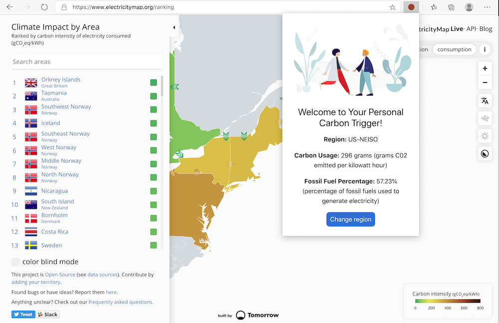
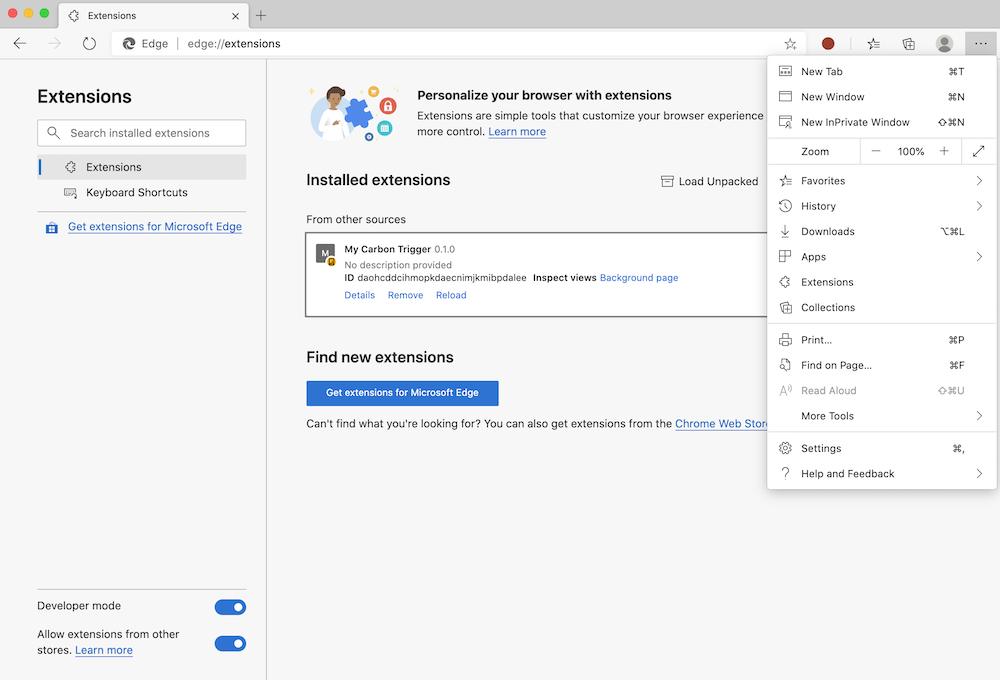

# कार्बन ट्रिगर ब्राउज़र एक्सटेंशन: स्टार्टर कोड

बिजली के उपयोग को ट्रैक करने के लिए tmrow के C02 सिग्नल एपीआई का उपयोग करना, एक ब्राउज़र एक्सटेंशन का निर्माण करना ताकि आपके ब्राउज़र में आपके क्षेत्र की बिजली का उपयोग कितना भारी हो, इस बारे में आपको एक रिमाइंडर मिल सके. इस एक्सटेंशन तदर्थ का उपयोग करने से आपको इस जानकारी के आधार पर अपनी गतिविधियों पर निर्णय लेने में मदद मिलेगी.



## शुरू करना

आपको [npm](https://npmjs.com) इंस्टॉल करना होगा । अपने कंप्यूटर पर एक फ़ोल्डर में इस कोड की एक प्रति डाउनलोड करें।

सभी आवश्यक पैकेज स्थापित करें:

```
npm install
```

वेबपैक से एक्सटेंशन बनाएं

```
npm run build
```

एज पर स्थापित करने के लिए, एक्सटेंशन पैनल को खोजने के लिए ब्राउज़र के ऊपरी दाएं कोने पर 'तीन डॉट' मेनू का उपयोग करें. वहां से, एक नया एक्सटेंशन लोड करने के लिए 'लोड अनपैक्ड' चुनें. प्रॉम्प्ट पर 'dist' फ़ोल्डर खोलें और एक्सटेंशन लोड होगा. इसका उपयोग करने के लिए, आपको CO2 सिग्नल की एपीआई ([ईमेल के माध्यम से यहां प्राप्त करें](https://www.co2snal.com/) के लिए एक एपीआई कुंजी की आवश्यकता होगी - इस पृष्ठ पर बॉक्स में अपना ईमेल दर्ज करें) और [अपने क्षेत्र के लिए कोड](http://api.electricitymap.org/v3/zones) [विद्युत मानचित्र](https://www.electricitymap.org/map) (उदाहरण के लिए, बोस्टन में, मैं 'US-NEISO' का उपयोग करता हूं).



एक बार एपीआई कुंजी और क्षेत्र एक्सटेंशन इंटरफ़ेस में इनपुट हो जाने के बाद, ब्राउज़र एक्सटेंशन बार में रंगीन डॉट को आपके क्षेत्र की ऊर्जा के उपयोग को प्रतिबिंबित करने के लिए बदलना चाहिए और आपको एक संकेतक देना चाहिए कि ऊर्जा-भारी गतिविधियां आपके प्रदर्शन के लिए क्या उपयुक्त होंगी।. इस 'डॉट' प्रणाली के पीछे की अवधारणा मुझे कैलिफ़ोर्निया उत्सर्जन के लिए [एनर्जी लॉलीपॉप एक्सटेंशन](https://energylollipop.com/) द्वारा दी गई थी।
