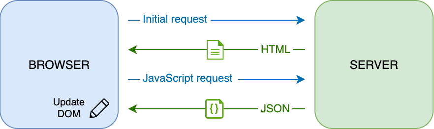
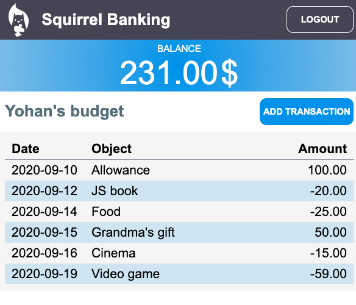

# 은행 앱 제작하기 파트 3: 데이터를 가져오고 사용하는 방식

## 강의 전 퀴즈

[Pre-lecture quiz](https://nice-beach-0fe9e9d0f.azurestaticapps.net/quiz/45?loc=ko)

### 소개

모든 웹 애플리케이션의 핵심에는 *data*가 있습니다. 데이터는 다양한 폼을 가질 수 있지만, 기본적인 목적은 항상 사용자에게 정보를 보여준다는 것입니다. 웹 앱이 점점 더 상호 작용하고 복잡해지면서, 사용자가 정보에 접근하고 상호 작용하는 방식은 이제 웹 개발에서 중요한 부분입니다.

이 강의에서는, 서버에서 비동기로 데이터를 가져오고, 이 데이터로 HTML을 다시 불러오지 않으면서 웹 페이지에 보여주는 방법으로 살펴봅니다.

### 준비물

이 강의에서 웹 앱의 [Login and Registration Form](../../2-forms/translations/README.ko.md) 부분을 작성하는 것이 필요합니다. 또한 계정 데이터를 가져오려면 [Node.js](https://nodejs.org)와 [run the server API](../../api/README.md)를 로컬에 설치해야 합니다.

터미널에서 이 명령을 실행하여 서버가 실행되고 있는지 테스트할 수 있습니다:

```sh
curl http://localhost:5000/api
# -> should return "Bank API v1.0.0" as a result
```

---

## AJAX와 데이터 가져오기

기존 웹 사이트는 모든 HTML 페이지를 다시 불러오기 위해서 사용자가 링크를 클릭하거나 폼으로 데이터를 제출할 때 표시되는 콘텐츠를 갱신합니다. 새로운 데이터를 불러와야 할 때마다, 웹 서버는 브라우저에서 처리하는 새 HTML 페이지를 반환하여, 현재 사용자의 액션을 중단하고 다시 불러오는 동안 상호 작용을 제한합니다. 이 과정을 *Multi-Page Application* 혹은 *MPA*라고 합니다.


웹 애플리케이션이 더 복잡해지고 상호 작용하기 시작하면서, [AJAX (Asynchronous JavaScript and XML)](https://en.wikipedia.org/wiki/Ajax_(programming))이라는 새로운 기술이 나타났습니다. 이 기술을 쓰면 웹 앱은 HTML 페이지를 다시 불러오지 않고, JavaScript를 사용하여 비동기로 서버에서 데이터를 보내고 찾을 수 있으므로, 갱신 속도가 빨라지고 사용자 상호 작용이 부드러워집니다. 서버에서 새로운 데이터를 받으면, [DOM](https://developer.mozilla.org/docs/Web/API/Document_Object_Model) API로 현재 HTML 페이지를 JavaScript로 갱신할 수도 있습니다. 시간이 지나면서, 이 방식은 이제 [*Single-Page Application* or *SPA*](https://en.wikipedia.org/wiki/Single-page_application)라는 것으로 발전했습니다.



AJAX가 처음 소개되었을 때, 데이터를 비동기로 가져올 유일한 API는 [`XMLHttpRequest`](https://developer.mozilla.org/docs/Web/API/XMLHttpRequest/Using_XMLHttpRequest)였습니다. 그러나 모던 브라우저는 이제 promises를 사용하고 JSON 데이터를 조작할 때 적당하며, 더 편리하고 강력한 [`Fetch` API](https://developer.mozilla.org/docs/Web/API/Fetch_API)도 구현합니다.

> 모든 모던 브라우저는 `Fetch API`를 지원하지만, 웹 애플리케이션이 레거시 혹은 옛날 브라우저에서 작동하도록 하려면 항상 [compatibility table on caniuse.com](https://caniuse.com/fetch)를 먼저 보는 것이 좋습니다.

### 작업

[이전 강의](../../2-forms/translations/README.ko.md)에서는 계정을 만들기 위해 가입 폼을 구현했습니다. 이제 이미 있는 계정으로 로그인하는 코드를 추가하고, 데이터를 가져올 것 입니다. `app.js` 파일을 열고 새로운 `login` 함수를 추가합니다:

```js
async function login() {
  const loginForm = document.getElementById('loginForm')
  const user = loginForm.user.value;
}
```

여기서 `getElementById()`로 폼 요소를 찾는 것으로 시작한 다음, `loginForm.user.value`로 입력에서 username을 가져옵니다. 모든 폼 컨트롤은 폼의 속성에 있는 이름(HTML에서 `name`속성으로 설정)으로 제어할 수 있습니다.

가입을 위해서 작업했던 것과 비슷한 방식으로, 서버 요청하는 또 다른 함수를 만들지만, 이번에는 계정 데이터를 찾기 위한 것입니다:

```js
async function getAccount(user) {
  try {
    const response = await fetch('//localhost:5000/api/accounts/' + encodeURIComponent(user));
    return await response.json();
  } catch (error) {
    return { error: error.message || 'Unknown error' };
  }
}
```

비동기로 서버에 데이터를 요청하기 위해서 `fetch` API를 사용하지만, 이번에는 데이터만 쿼리하므로, 호출할 URL 이외 추가 파라미터는 필요하지 않습니다. 기본적으로, `fetch`는 여기에서 찾는 것처럼 [`GET`](https://developer.mozilla.org/docs/Web/HTTP/Methods/GET) 요청을 생성합니다.

✅ `encodeURIComponent()`는 URL에 대한 특수 문자를 이스케이프하는 함수입니다. 이 함수를 호출하지 않고 URL에서 `user` 값을 직접 사용하면 어떤 이슈가 발생할 수 있나요?

이제 `getAccount`를 사용하여 `login` 함수를 갱신합니다:

```js
async function login() {
  const loginForm = document.getElementById('loginForm')
  const user = loginForm.user.value;
  const data = await getAccount(user);

  if (data.error) {
    return console.log('loginError', data.error);
  }

  account = data;
  navigate('/dashboard');
}
```

먼저, `getAccount`는 비동기 함수이므로 서버 결과를 기다리려면 `await` 키워드로 맞춰야 합니다. 모든 서버 요청처럼, 오류 케이스도 처리해야 합니다. 지금은 오류를 보여주는 로그 메시지만 추가하고, 이 레이어로 돌아옵니다.

그러고 나중에 대시보드 정보를 보여줄 수 있도록 데이터를 어딘가 저장해야 합니다. `account` 변수가 아직 없으므로, 파일 상단에 전역 변수를 생성합니다:

```js
let account = null;
```

사용자 데이터가 변수에 저장되면 이미 있는 `navigate()` 함수를 사용하여 *login* 페이지에서 *dashboard*로 이동할 수 있습니다.

마지막으로, HTML을 수정하여 로그인 폼을 제출할 때마다 `login` 함수를 호출해야 합니다:

```html
<form id="loginForm" action="javascript:login()">
```

새로운 계정을 가입하고 같은 계정으로 로그인을 시도하여 모두 잘 작동하는지 테스트합니다.

다음 부분으로 가기 전에, 함수 하단에 다음을 추가하여 `register` 함수를 완성할 수도 있습니다:

```js
account = result;
navigate('/dashboard');
```

✅ 기본적으로, 보고있는 웹 페이지에 *동일한 도메인와 포트*에서만 서버 API를 호출할 수 있다는 사실을 알고 있었나요? 이것은 브라우저에 의해 시행되는 보안 메커니즘입니다. 하지만, 웹 앱은 `localhost:3000`에서 실행되고 서버 API가 `localhost:5000`에서 실행됩니다. 왜 작동할까요? [Cross-Origin Resource Sharing (CORS)](https://developer.mozilla.org/docs/Web/HTTP/CORS)라는 기술을 사용하면 서버가 응답에 특별한 헤더를 추가하여 특정 도메인에 대한 예외를 허용하므로, cross-origin HTTP 요청을 수행 할 수 있습니다.

## 데이터를 보여주기 위해 HTML 갱신하기

이제 사용자 데이터가 있으므로, 기존 HTML을 갱신해서 보여줘야 합니다. 예시로 `document.getElementById()`를 사용하여 DOM에서 요소를 검색하는 방법은 이미 있습니다. 바탕 요소가 있으면, 수정하거나 하위 요소를 추가하는 방식으로 사용할 수 있는 몇 가지 API가 있습니다:

- [`textContent`](https://developer.mozilla.org/docs/Web/API/Node/textContent) 속성을 사용하여 요소의 텍스트를 바꿀 수 있습니다. 이 값을 변경하면 모든 요소의 하위가(있는 경우) 제거되고 주어진 텍스트로 대체됩니다. 따라서, 빈 문자열 `''`을 할당하여 주어진 요소의 모든 하위를 제거하는 효율적인 방법일 수도 있습니다.

- [`document.createElement()`](https://developer.mozilla.org/docs/Web/API/Document/createElement)를 [`append()`](https://developer.mozilla.org/docs/Web/API/ParentNode/append)메소드와 함께 사용하면 하나 이상의 새로운 하위 요소를 만들고 붙일 수 있습니다.

✅ 요소의 [`innerHTML`](https://developer.mozilla.org/docs/Web/API/Element/innerHTML) 속성을 사용하여 HTML 내용을 바꿀 수 있지만, [cross-site scripting (XSS)](https://developer.mozilla.org/docs/Glossary/Cross-site_scripting) 공격에 취약하므로 피해야 합니다.

### 작업

대시보드 화면으로 이동하기 전에, *login* 페이지에서 할 일이 더 있습니다. 현재, 없는 사용자 이름으로 로그인하면, 콘솔에는 메시지가 보이지만 일반적인 사용자의 경우에는 하나도 안 바뀌므로 어떤 일이 나는지 알 수 없습니다.

필요한 경우에 오류 메시지를 볼 수 있는 로그인 폼에 placeholder 요소를 추가하겠습니다. 로그인 `<button>` 바로 전에 두는 것이 좋습니다:

```html
...
<div id="loginError"></div>
<button>Login</button>
...
```

이 `<div>` 요소는 비어 있으므로, 내용를 더 할 때까지 화면에 아무것도 나오지 않습니다. 또한 JavaScript로 쉽게 찾을 수 있도록 `id`를 제공합니다.

`app.js` 파일로 돌아오고 새로운 헬퍼 함수인 `updateElement`를 만듭니다:

```js
function updateElement(id, text) {
  const element = document.getElementById(id);
  element.textContent = text;
}
```

이는 매우 간편합니다, *id*와 *text* 요소가 주어지는 순간에 일치하는 `id`로 DOM 요소의 텍스트 내용이 갱신됩니다. `login` 함수의 이전 오류 메시지 대신에 이 방법을 사용하겠습니다:

```js
if (data.error) {
  return updateElement('loginError', data.error);
}
```

이제 유효하지 않은 계정으로 로그인 시도하면, 다음과 같이 보입니다:


`register` 함수 오류와 동일한 동작을 하도록 구현합니다 (HTML을 갱신하는 것을 잊지 마세요).

## 대시보드로 정보 출력하기

방금 전 같은 기술을 사용하여 대시보드 페이지에서 계정 정보를 보여주는 작업도 합니다.

서버에서 받은 계정 객체는 다음과 같습니다:

```json
{
  "user": "test",
  "currency": "$",
  "description": "Test account",
  "balance": 75,
  "transactions": [
    { "id": "1", "date": "2020-10-01", "object": "Pocket money", "amount": 50 },
    { "id": "2", "date": "2020-10-03", "object": "Book", "amount": -10 },
    { "id": "3", "date": "2020-10-04", "object": "Sandwich", "amount": -5 }
  ],
}
```

> Note: 더 쉽게 진행하기 위해서, 이미 데이터로 채워진 기존 `test` 계정을 사용할 수 있습니다.

### 작업

HTML의 "Balance" 섹션을 교체하고 placeholder 요소를 추가하는 것으로 시작합니다:

```html
<section>
  Balance: <span id="balance"></span><span id="currency"></span>
</section>
```

또한 바로 밑에 새로운 섹션을 추가하여 계정 설명을 출력합니다:

```html
<section id="description" aria-label="Account description"></section>
```

✅ 이 섹션의 내용을 설명하는 텍스트 라벨이 없기 때문에, `aria-label` 속성을 사용하여 접근성 힌트를 줍니다. 모두 웹 앱에 접근할 수 있도록 [ARIA attributes](https://developer.mozilla.org/docs/Web/Accessibility/ARIA)에 대해 더 알아보세요.

다음으로, `app.js`에 placeholder를 채우기 위해서 새로운 함수를 만듭니다:

```js
function updateDashboard() {
  if (!account) {
    return navigate('/login');
  }

  updateElement('description', account.description);
  updateElement('balance', account.balance.toFixed(2));
  updateElement('currency', account.currency);
}
```

먼저, 나아가기 전 필요한 계정 데이터가 있는지 확인합니다. 그러고 일찍 만들어 둔 `updateElement()` 함수로 HTML을 업데이트합니다.

> 잔액을 더 예쁘게 보이게 만드려면, [`toFixed(2)`](https://developer.mozilla.org/docs/Web/JavaScript/Reference/Global_Objects/Number/toFixed) 방법으로 소수점 이하 2자리 값을 강제로 출력합니다.

이제 대시보드를 불러올 때마다 `updateDashboard()` 함수를 호출해야 합니다. 이미 [lesson 1 assignment](../../1-template-route/assignment.md)를 완료했다면 간단해야 합니다. 그렇지 않다면 이미 구현된 내용으로 쓸 수 있습니다.

`updateRoute()` 함수 끝에 이 코드를 추가합니다:

```js
if (typeof route.init === 'function') {
  route.init();
}
```

그리고 라우터 정의를 업데이트합니다:

```js
const routes = {
  '/login': { templateId: 'login' },
  '/dashboard': { templateId: 'dashboard', init: updateDashboard }
};
```

이 변경점으로, 대시보드 페이지가 나올 때마다 `updateDashboard()` 함수가 호출됩니다. 로그인하고나서, 계정 잔액, 통화와 설명을 볼 수 있습니다.

## HTML 템플릿으로 동적 테이블 row 만들기

[first lesson](../../1-template-route/translations/README.ko.md)에서는 HTML 템플릿과 [`appendChild()`](https://developer.mozilla.org/docs/Web/API/Node/appendChild) 메소드로 앱의 탐색을 구현했습니다. 템플릿은 더 작아 질 수 있고 페이지의 반복적인 부분을 동적으로 채우는 데 쓸 수 있습니다.

유사한 접근 방식을 사용하여 HTML 테이블에 트랜잭션 목록을 출력합니다.

### 작업

HTML `<body>`에서 새로운 템플릿을 추가합니다:

```html
<template id="transaction">
  <tr>
    <td></td>
    <td></td>
    <td></td>
  </tr>
</template>
```

이 템플릿은 하나의 테이블 행을 나타내고 있으며, 앞으로 채워나갈 3 개의 열이 있습니다: *date*, *object* 그리고 트랜젝션의 *amount*.

그러고, 이 `id` 속성을 대시보드 템플릿 내 테이블의 `<tbody>` 요소에 추가하여 JavaScript로 쉽게 찾을 수 있게 작성합니다:

```html
<tbody id="transactions"></tbody>
```

HTML은 준비되었습니다, JavaScript 코드로 전환하고 새로운 함수 `createTransactionRow`를 만들겠습니다:

```js
function createTransactionRow(transaction) {
  const template = document.getElementById('transaction');
  const transactionRow = template.content.cloneNode(true);
  const tr = transactionRow.querySelector('tr');
  tr.children[0].textContent = transaction.date;
  tr.children[1].textContent = transaction.object;
  tr.children[2].textContent = transaction.amount.toFixed(2);
  return transactionRow;
}
```

이 함수는 이름이 의미한대로 정확히 수행합니다: 이전에 만든 템플릿을 사용하면서, 새 테이블 행을 만들고 트랜잭션 데이터로 내용을 채웁니다. `updateDashboard()` 함수에서 이것으로 테이블을 채울 것입니다:

```js
const transactionsRows = document.createDocumentFragment();
for (const transaction of account.transactions) {
  const transactionRow = createTransactionRow(transaction);
  transactionsRows.appendChild(transactionRow);
}
updateElement('transactions', transactionsRows);
```

여기서는 새로운 DOM 프래그먼트를 만들 [`document.createDocumentFragment()`](https://developer.mozilla.org/docs/Web/API/Document/createDocumentFragment) 메소드로 최종적인 HTML 테이블에 붙입니다.

현재 `updateElement()` 함수가 텍스트 내용만 지원하므로 이 코드가 실행되기 전에 할 일이 하나 더 있습니다. 코드를 약간 바꿔 보겠습니다:

```js
function updateElement(id, textOrNode) {
  const element = document.getElementById(id);
  element.textContent = ''; // Removes all children
  element.append(textOrNode);
}
```

[`append()`](https://developer.mozilla.org/docs/Web/API/ParentNode/append)] 메소드를 사용하면 상위 요소에 텍스트 혹은 [DOM Nodes](https://developer.mozilla.org/docs/Web/API/Node)를 붙일 수 있으므로, 모든 사용 케이스에 적당합니다.

`test` 계정을 사용하여 로그인을 해보면, 지금 대시보드에 거래 목록이 보입니다 🎉.

---

## 🚀 도전

대시보드 페이지를 실제 은행 앱처럼 보이도록 함께 작업해보세요. 이미 앱 스타일한 경우, [media queries](https://developer.mozilla.org/docs/Web/CSS/Media_Queries)를 사용하여 데스크톱과 모바일 장치 다 잘 작동하는 [responsive design](https://developer.mozilla.org/docs/Web/Progressive_web_apps/Responsive/responsive_design_building_blocks)으로 만들어보세요.

여기는 꾸며진 대시보드 페이지의 예시입니다:



## 강의 후 퀴즈

[Post-lecture quiz](https://nice-beach-0fe9e9d0f.azurestaticapps.net/quiz/46?loc=ko)

## 과제

[Refactor and comment your code](../assignment.md)
