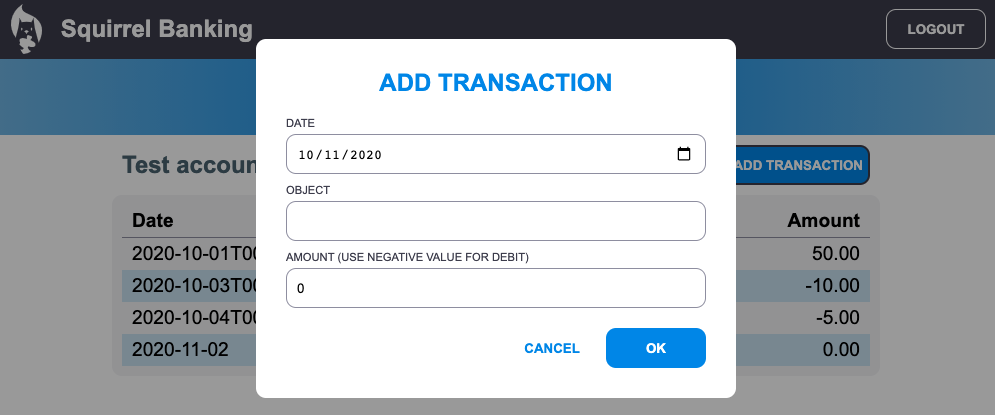

# लेनदेन जोड़ें डियलॉग लागू करें

## अनुदेश

हमारा बैंक ऐप अभी भी एक महत्वपूर्ण विशेषता को याद कर रहा है: नए लेनदेन दर्ज करने की संभावना।
पिछले चार पाठों में आपने जो कुछ भी सीखा है, उसका उपयोग करके "लेनदेन जोड़ें" डियलॉग को लागू करें:

- डैशबोर्ड पृष्ठ में "लेनदेन जोड़ें" बटन जोड़ें
- या तो HTML टेम्पलेट के साथ एक नया पृष्ठ बनाएँ, या डैशबोर्ड पृष्ठ को छोड़े बिना संवाद HTML दिखाने / छिपाने के लिए जावास्क्रिप्ट का उपयोग करें (आप उसके लिए, या CSS कक्षाओं के लिए [`hidden`](https://developer.mozilla.org/docs/Web/HTML/Global_attributes/hidden) हुई संपत्ति का उपयोग कर सकते हैं)
- सुनिश्चित करें कि आप [कीबोर्ड और स्क्रीन रीडर एक्सेसिबिलिटी](https://developer.paciellogroup.com/blog/2018/06/the-current-state-of-modal-dialog-accessibility/) डियलॉग संभालते हैं
- इनपुट डेटा प्राप्त करने के लिए एक HTML फॉर्म को लागू करें
- फॉर्म डेटा से JSON डेटा बनाएं और इसे API पर भेजें
- नए डेटा के साथ डैशबोर्ड पृष्ठ को अपडेट करें

[सर्वर एपीआई विनिर्देशों](../../api/README.md) को देखें कि आपको कौन सा एपीआई कॉल करने की आवश्यकता है और जो JSON प्रारूप अपेक्षित है उसे देखने के लिए।

यहां असाइनमेंट पूरा करने के बाद एक उदाहरण परिणाम है:

## शीर्ष

| मानदंड | उदाहरणात्मक                                                                                        | पर्याप्त                                                                                                                   | सुधार की जरूरत                               |
| ------ | -------------------------------------------------------------------------------------------------- | -------------------------------------------------------------------------------------------------------------------------- | -------------------------------------------- |
|        | लेन-देन को जोड़ना पाठों में देखी जाने वाली सभी सर्वोत्तम प्रथाओं का पूरी तरह से पालन किया जाता है. | लेन-देन जोड़ना कार्यान्वयन है, लेकिन पाठों में देखी गई सर्वोत्तम प्रथाओं का पालन नहीं करना, या केवल आंशिक रूप से काम करना. | लेनदेन जोड़ना बिल्कुल भी काम नहीं कर रहा है. |
