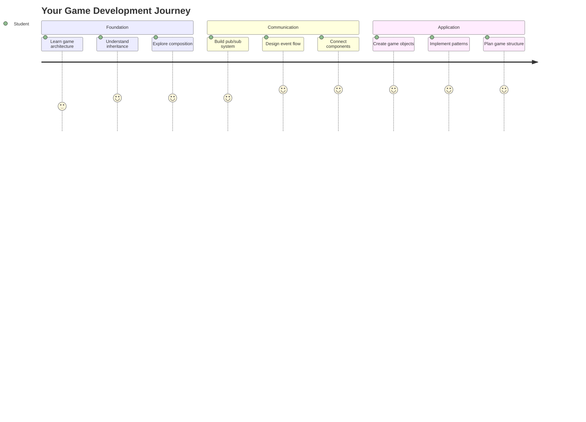
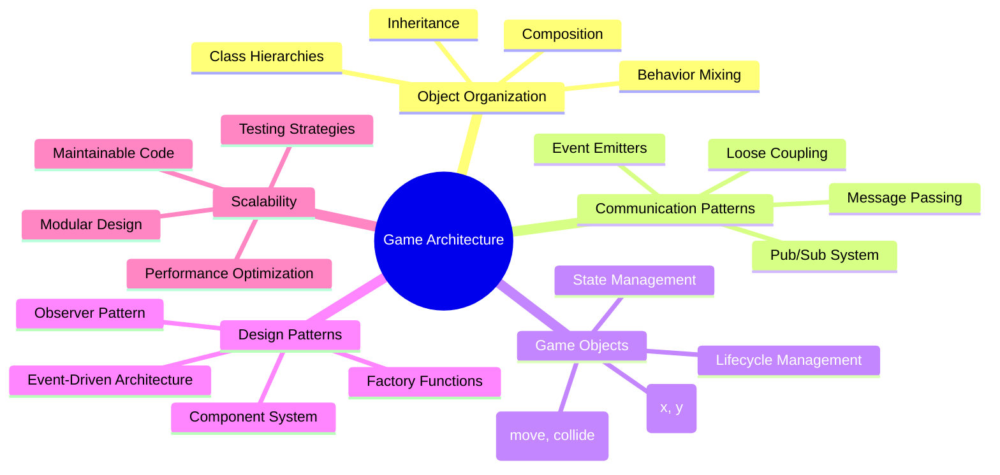
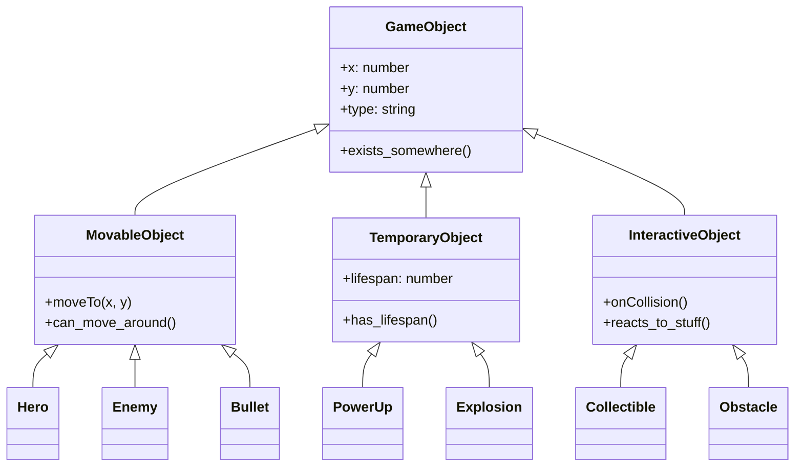
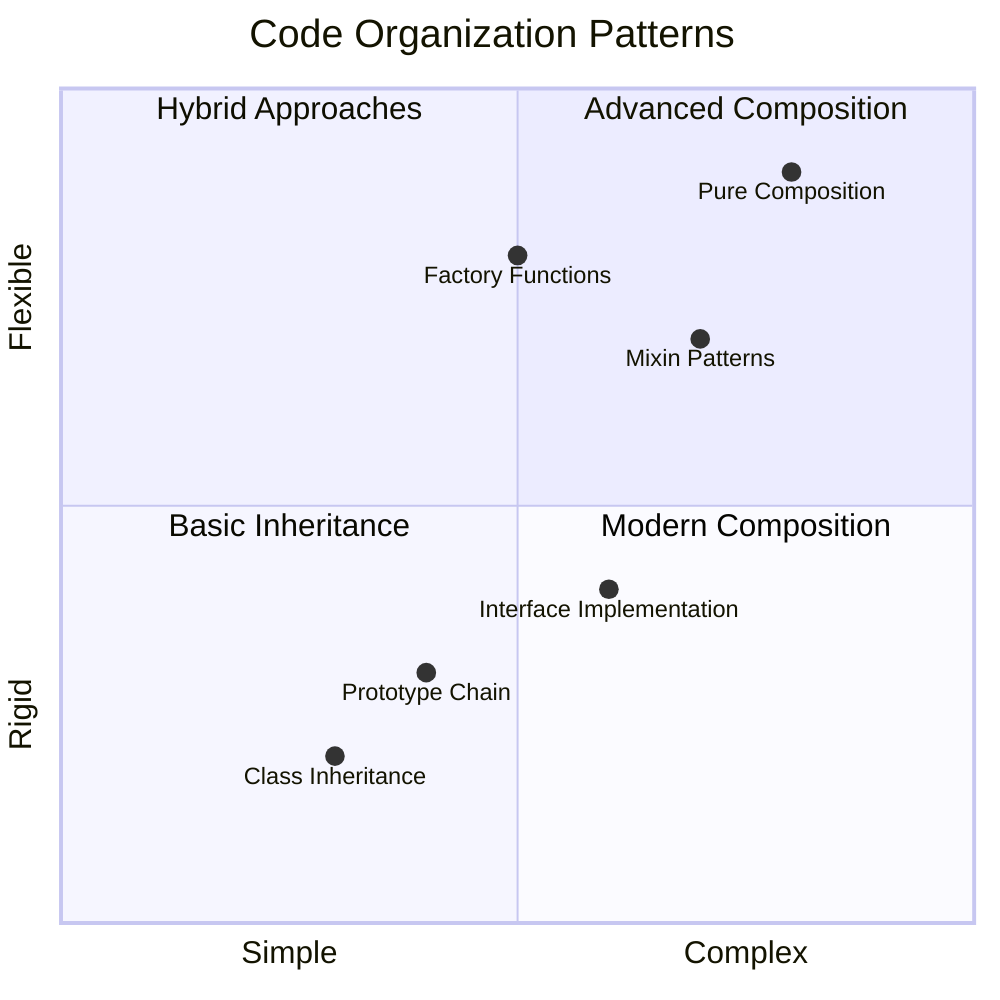
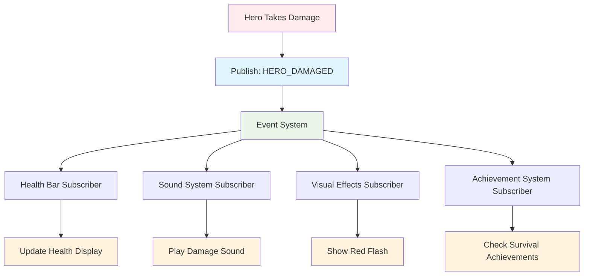
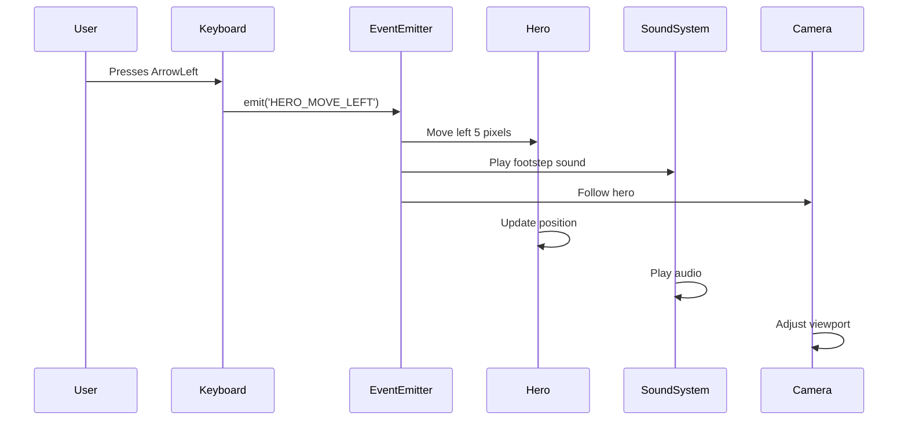
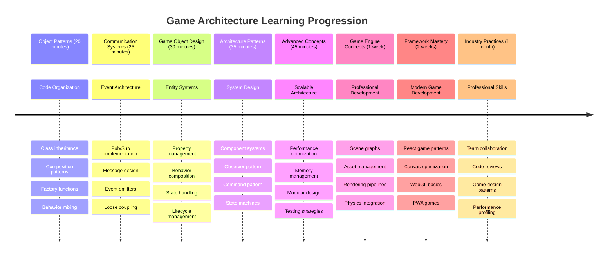

# Build a Space Game Part 1: Introduction




Just like NASA's mission control coordinates multiple systems during a space launch, we're going to build a space game that demonstrates how different parts of a program can work together seamlessly. While creating something you can actually play, you'll learn essential programming concepts that apply to any software project.

We'll explore two fundamental approaches to organizing code: inheritance and composition. These aren't just academic concepts – they're the same patterns that power everything from video games to banking systems. We'll also implement a communication system called pub/sub that works like the communication networks used in spacecraft, allowing different components to share information without creating dependencies.

By the end of this series, you'll understand how to build applications that can scale and evolve – whether you're developing games, web applications, or any other software system.



## Pre-Lecture Quiz

[Pre-lecture quiz](https://ff-quizzes.netlify.app/web/quiz/29)

## Inheritance and Composition in Game Development

As projects grow in complexity, code organization becomes critical. What begins as a simple script can become difficult to maintain without proper structure – much like how the Apollo missions required careful coordination between thousands of components.

We'll explore two fundamental approaches for organizing code: inheritance and composition. Each has distinct advantages, and understanding both helps you choose the right approach for different situations. We'll demonstrate these concepts through our space game, where heroes, enemies, power-ups, and other objects must interact efficiently.

✅ One of the most famous programming books ever written has to do with [design patterns](https://en.wikipedia.org/wiki/Design_Patterns).

In any game, you have `game objects` – the interactive elements that populate your game world. Heroes, enemies, power-ups, and visual effects are all game objects. Each exists at specific screen coordinates using `x` and `y` values, similar to plotting points on a coordinate plane.

Despite their visual differences, these objects often share fundamental behaviors:

- **They exist somewhere** – Every object has x and y coordinates so the game knows where to draw it
- **Many can move around** – Heroes run, enemies chase, bullets fly across the screen
- **They have a lifespan** – Some stick around forever, others (like explosions) appear briefly and vanish
- **They react to stuff** – When things collide, power-ups get collected, health bars update

✅ Think about a game like Pac-Man. Can you identify the four object types listed above in this game?



### Expressing Behavior Through Code

Now that you understand the common behaviors game objects share, let's explore how to implement these behaviors in JavaScript. You can express object behavior through methods attached to either classes or individual objects, and there are several approaches to choose from.

**The Class-Based Approach**

Classes and inheritance provide a structured approach to organizing game objects. Like the taxonomic classification system developed by Carl Linnaeus, you start with a base class containing common properties, then create specialized classes that inherit these fundamentals while adding specific capabilities.

✅ Inheritance is an important concept to understand. Learn more on [MDN's article about inheritance](https://developer.mozilla.org/docs/Web/JavaScript/Inheritance_and_the_prototype_chain).

Here's how you can implement game objects using classes and inheritance:

```javascript
// Step 1: Create the base GameObject class
class GameObject {
  constructor(x, y, type) {
    this.x = x;
    this.y = y;
    this.type = type;
  }
}
```

**Let's break this down step by step:**
- We're creating a basic template that every game object can use
- The constructor saves where the object is (`x`, `y`) and what kind of thing it is
- This becomes the foundation that all your game objects will build on

```javascript
// Step 2: Add movement capability through inheritance
class Movable extends GameObject {
  constructor(x, y, type) {
    super(x, y, type); // Call parent constructor
  }

  // Add the ability to move to a new position
  moveTo(x, y) {
    this.x = x;
    this.y = y;
  }
}
```

**In the above, we've:**
- **Extended** the GameObject class to add movement functionality
- **Called** the parent constructor using `super()` to initialize inherited properties
- **Added** a `moveTo()` method that updates the object's position

```javascript
// Step 3: Create specific game object types
class Hero extends Movable {
  constructor(x, y) {
    super(x, y, 'Hero'); // Set type automatically
  }
}

class Tree extends GameObject {
  constructor(x, y) {
    super(x, y, 'Tree'); // Trees don't need movement
  }
}

// Step 4: Use your game objects
const hero = new Hero(0, 0);
hero.moveTo(5, 5); // Hero can move!

const tree = new Tree(10, 15);
// tree.moveTo() would cause an error - trees can't move
```

**Understanding these concepts:**
- **Creates** specialized object types that inherit appropriate behaviors
- **Demonstrates** how inheritance allows selective feature inclusion
- **Shows** that heroes can move while trees remain stationary
- **Illustrates** how the class hierarchy prevents inappropriate actions

✅ Take a few minutes to re-envision a Pac-Man hero (Inky, Pinky or Blinky, for example) and how it would be written in JavaScript. 

**The Composition Approach**

Composition follows a modular design philosophy, similar to how engineers design spacecraft with interchangeable components. Instead of inheriting from a parent class, you combine specific behaviors to create objects with exactly the functionality they need. This approach offers flexibility without rigid hierarchical constraints.

```javascript
// Step 1: Create base behavior objects
const gameObject = {
  x: 0,
  y: 0,
  type: ''
};

const movable = {
  moveTo(x, y) {
    this.x = x;
    this.y = y;
  }
};
```

**Here's what this code does:**
- **Defines** a base `gameObject` with position and type properties
- **Creates** a separate `movable` behavior object with movement functionality
- **Separates** concerns by keeping position data and movement logic independent

```javascript
// Step 2: Compose objects by combining behaviors
const movableObject = { ...gameObject, ...movable };

// Step 3: Create factory functions for different object types
function createHero(x, y) {
  return {
    ...movableObject,
    x,
    y,
    type: 'Hero'
  };
}

function createStatic(x, y, type) {
  return {
    ...gameObject,
    x,
    y,
    type
  };
}
```

**In the above, we've:**
- **Combined** base object properties with movement behavior using spread syntax
- **Created** factory functions that return customized objects
- **Enabled** flexible object creation without rigid class hierarchies
- **Allowed** objects to have exactly the behaviors they need

```javascript
// Step 4: Create and use your composed objects
const hero = createHero(10, 10);
hero.moveTo(5, 5); // Works perfectly!

const tree = createStatic(0, 0, 'Tree');
// tree.moveTo() is undefined - no movement behavior was composed
```

**Key points to remember:**
- **Composes** objects by mixing behaviors rather than inheriting them
- **Provides** more flexibility than rigid inheritance hierarchies
- **Allows** objects to have exactly the features they need
- **Uses** modern JavaScript spread syntax for clean object combination 
```

**Which Pattern Should You Choose?**

**Which Pattern Should You Choose?**



> 💡 **Pro Tip**: Both patterns have their place in modern JavaScript development. Classes work well for clearly defined hierarchies, while composition shines when you need maximum flexibility.
> 
**Here's when to use each approach:**
- **Choose** inheritance when you have clear "is-a" relationships (a Hero *is-a* Movable object)
- **Select** composition when you need "has-a" relationships (a Hero *has* movement abilities)
- **Consider** your team's preferences and project requirements
- **Remember** that you can mix both approaches in the same application

### 🔄 **Pedagogical Check-in**
**Object Organization Understanding**: Before moving to communication patterns, ensure you can:
- ✅ Explain the difference between inheritance and composition
- ✅ Identify when to use classes vs factory functions
- ✅ Understand how the `super()` keyword works in inheritance
- ✅ Recognize the benefits of each approach for game development

**Quick Self-Test**: How would you create a Flying Enemy that can both move and fly?
- **Inheritance approach**: `class FlyingEnemy extends Movable`
- **Composition approach**: `{ ...movable, ...flyable, ...gameObject }`

**Real-World Connection**: These patterns appear everywhere:
- **React Components**: Props (composition) vs class inheritance
- **Game Engines**: Entity-component systems use composition
- **Mobile Apps**: UI frameworks often use inheritance hierarchies

## Communication Patterns: The Pub/Sub System

As applications grow complex, managing communication between components becomes challenging. The publish-subscribe pattern (pub/sub) solves this problem using principles similar to radio broadcasting – one transmitter can reach multiple receivers without knowing who's listening.

Consider what happens when a hero takes damage: the health bar updates, sound effects play, visual feedback appears. Rather than coupling the hero object directly to these systems, pub/sub allows the hero to broadcast a "damage taken" message. Any system that needs to respond can subscribe to this message type and react accordingly.

✅ **Pub/Sub** stands for 'publish-subscribe'



### Understanding the Pub/Sub Architecture

The pub/sub pattern keeps different parts of your application loosely coupled, meaning they can work together without being directly dependent on each other. This separation makes your code more maintainable, testable, and flexible to changes.

**The key players in pub/sub:**
- **Messages** – Simple text labels like `'PLAYER_SCORED'` that describe what happened (plus any extra info)
- **Publishers** – The objects that shout out "Something happened!" to anyone who's listening
- **Subscribers** – The objects that say "I care about that event" and react when it happens
- **Event System** – The middleman that makes sure messages get to the right listeners

### Building an Event System

Let's create a simple but powerful event system that demonstrates these concepts:

```javascript
// Step 1: Create the EventEmitter class
class EventEmitter {
  constructor() {
    this.listeners = {}; // Store all event listeners
  }
  
  // Register a listener for a specific message type
  on(message, listener) {
    if (!this.listeners[message]) {
      this.listeners[message] = [];
    }
    this.listeners[message].push(listener);
  }
  
  // Send a message to all registered listeners
  emit(message, payload = null) {
    if (this.listeners[message]) {
      this.listeners[message].forEach(listener => {
        listener(message, payload);
      });
    }
  }
}
```

**Breaking down what happens here:**
- **Creates** a central event management system using a simple class
- **Stores** listeners in an object organized by message type
- **Registers** new listeners using the `on()` method
- **Broadcasts** messages to all interested listeners using `emit()`
- **Supports** optional data payloads for passing relevant information

### Putting It All Together: A Practical Example

Alright, let's see this in action! We'll build a simple movement system that shows how clean and flexible pub/sub can be:

```javascript
// Step 1: Define your message types
const Messages = {
  HERO_MOVE_LEFT: 'HERO_MOVE_LEFT',
  HERO_MOVE_RIGHT: 'HERO_MOVE_RIGHT',
  ENEMY_SPOTTED: 'ENEMY_SPOTTED'
};

// Step 2: Create your event system and game objects
const eventEmitter = new EventEmitter();
const hero = createHero(0, 0);
```

**Here's what this code does:**
- **Defines** a constants object to prevent typos in message names
- **Creates** an event emitter instance to handle all communication
- **Initializes** a hero object at the starting position

```javascript
// Step 3: Set up event listeners (subscribers)
eventEmitter.on(Messages.HERO_MOVE_LEFT, () => {
  hero.moveTo(hero.x - 5, hero.y);
  console.log(`Hero moved to position: ${hero.x}, ${hero.y}`);
});

eventEmitter.on(Messages.HERO_MOVE_RIGHT, () => {
  hero.moveTo(hero.x + 5, hero.y);
  console.log(`Hero moved to position: ${hero.x}, ${hero.y}`);
});
```

**In the above, we've:**
- **Registered** event listeners that respond to movement messages
- **Updated** the hero's position based on the movement direction
- **Added** console logging to track the hero's position changes
- **Separated** the movement logic from the input handling

```javascript
// Step 4: Connect keyboard input to events (publishers)
window.addEventListener('keydown', (event) => {
  switch(event.key) {
    case 'ArrowLeft':
      eventEmitter.emit(Messages.HERO_MOVE_LEFT);
      break;
    case 'ArrowRight':
      eventEmitter.emit(Messages.HERO_MOVE_RIGHT);
      break;
  }
});
```

**Understanding these concepts:**
- **Connects** keyboard input to game events without tight coupling
- **Enables** the input system to communicate with game objects indirectly
- **Allows** multiple systems to respond to the same keyboard events
- **Makes** it easy to change key bindings or add new input methods



> 💡 **Pro Tip**: The beauty of this pattern is flexibility! You can easily add sound effects, screen shake, or particle effects by simply adding more event listeners – no need to modify the existing keyboard or movement code.
> 
**Here's why you'll love this approach:**
- Adding new features becomes super easy – just listen for the events you care about
- Multiple things can react to the same event without stepping on each other
- Testing gets way simpler because each piece works independently
- When something breaks, you know exactly where to look

### Why Pub/Sub Scales Effectively

The pub/sub pattern maintains simplicity as applications grow in complexity. Whether managing dozens of enemies, dynamic UI updates, or sound systems, the pattern handles increased scale without architectural changes. New features integrate into the existing event system without affecting established functionality.

> ⚠️ **Common Mistake**: Don't create too many specific message types early on. Start with broad categories and refine them as your game's needs become clearer.
> 
**Best practices to follow:**
- **Groups** related messages into logical categories
- **Uses** descriptive names that clearly indicate what happened
- **Keeps** message payloads simple and focused
- **Documents** your message types for team collaboration

### 🔄 **Pedagogical Check-in**
**Event-Driven Architecture Understanding**: Verify your grasp of the complete system:
- ✅ How does the pub/sub pattern prevent tight coupling between components?
- ✅ Why is it easier to add new features with event-driven architecture?
- ✅ What role does the EventEmitter play in the communication flow?
- ✅ How do message constants prevent bugs and improve maintainability?

**Design Challenge**: How would you handle these game scenarios with pub/sub?
1. **Enemy dies**: Update score, play sound, spawn power-up, remove from screen
2. **Level complete**: Stop music, show UI, save progress, load next level
3. **Power-up collected**: Enhance abilities, update UI, play effect, start timer

**Professional Connection**: This pattern appears in:
- **Frontend Frameworks**: React/Vue event systems
- **Backend Services**: Microservice communication
- **Game Engines**: Unity's event system
- **Mobile Development**: iOS/Android notification systems

---

## GitHub Copilot Agent Challenge 🚀

Use the Agent mode to complete the following challenge:

**Description:** Create a simple game object system using both inheritance and the pub/sub pattern. You'll implement a basic game where different objects can communicate through events without directly knowing about each other.

**Prompt:** Create a JavaScript game system with the following requirements: 1) Create a base GameObject class with x, y coordinates and a type property. 2) Create a Hero class that extends GameObject and can move. 3) Create an Enemy class that extends GameObject and can chase the hero. 4) Implement an EventEmitter class for the pub/sub pattern. 5) Set up event listeners so when the hero moves, nearby enemies receive a 'HERO_MOVED' event and update their position to move toward the hero. Include console.log statements to show the communication between objects.

Learn more about [agent mode](https://code.visualstudio.com/blogs/2025/02/24/introducing-copilot-agent-mode) here.

## 🚀 Challenge

Consider how the pub-sub pattern can enhance game architecture. Identify which components should emit events and how the system should respond. Design a game concept and map out the communication patterns between its components.

## Post-Lecture Quiz

[Post-lecture quiz](https://ff-quizzes.netlify.app/web/quiz/30)

## Review & Self Study

Learn more about Pub/Sub by [reading about it](https://docs.microsoft.com/azure/architecture/patterns/publisher-subscriber/?WT.mc_id=academic-77807-sagibbon).

### ⚡ **What You Can Do in the Next 5 Minutes**
- [ ] Open any HTML5 game online and inspect its code using DevTools
- [ ] Create a simple HTML5 Canvas element and draw a basic shape
- [ ] Try using `setInterval` to create a simple animation loop
- [ ] Explore the Canvas API documentation and try a drawing method

### 🎯 **What You Can Accomplish This Hour**
- [ ] Complete the post-lesson quiz and understand game development concepts
- [ ] Set up your game project structure with HTML, CSS, and JavaScript files
- [ ] Create a basic game loop that updates and renders continuously
- [ ] Draw your first game sprites on the canvas
- [ ] Implement basic asset loading for images and sounds

### 📅 **Your Week-Long Game Creation**
- [ ] Complete the full space game with all planned features
- [ ] Add polished graphics, sound effects, and smooth animations
- [ ] Implement game states (start screen, gameplay, game over)
- [ ] Create a scoring system and player progress tracking
- [ ] Make your game responsive and accessible across devices
- [ ] Share your game online and gather feedback from players

### 🌟 **Your Month-Long Game Development**
- [ ] Build multiple games exploring different genres and mechanics
- [ ] Learn a game development framework like Phaser or Three.js
- [ ] Contribute to open source game development projects
- [ ] Master advanced game programming patterns and optimization
- [ ] Create a portfolio showcasing your game development skills
- [ ] Mentor others interested in game development and interactive media

## 🎯 Your Game Development Mastery Timeline



### 🛠️ Your Game Architecture Toolkit Summary

After completing this lesson, you now have:
- **Design Pattern Mastery**: Understanding of inheritance vs composition trade-offs
- **Event-Driven Architecture**: Pub/sub implementation for scalable communication
- **Object-Oriented Design**: Class hierarchies and behavior composition
- **Modern JavaScript**: Factory functions, spread syntax, and ES6+ patterns
- **Scalable Architecture**: Loose coupling and modular design principles
- **Game Development Foundation**: Entity systems and component patterns
- **Professional Patterns**: Industry-standard approaches to code organization

**Real-World Applications**: These patterns directly apply to:
- **Frontend Frameworks**: React/Vue component architecture and state management
- **Backend Services**: Microservice communication and event-driven systems
- **Mobile Development**: iOS/Android app architecture and notification systems
- **Game Engines**: Unity, Unreal, and web-based game development
- **Enterprise Software**: Event sourcing and distributed system design
- **API Design**: RESTful services and real-time communication

**Professional Skills Gained**: You can now:
- **Design** scalable software architectures using proven patterns
- **Implement** event-driven systems that handle complex interactions
- **Choose** appropriate code organization strategies for different scenarios
- **Debug** and maintain loosely coupled systems effectively
- **Communicate** technical decisions using industry-standard terminology

**Next Level**: You're ready to implement these patterns in a real game, explore advanced game development topics, or apply these architectural concepts to web applications!

🌟 **Achievement Unlocked**: You've mastered fundamental software architecture patterns that power everything from simple games to complex enterprise systems!

## Assignment

[Mock up a game](assignment.md)
