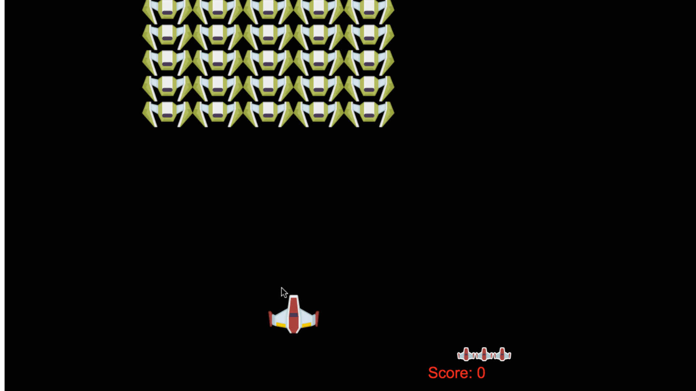

# Membina Permainan Angkasa Bahagian 1: Pengenalan



## Kuiz Pra Kuliah

[Kuiz Pra Kuliah](https://ashy-river-0debb7803.1.azurestaticapps.net/quiz/29)

### Warisan dan Komposisi dalam pembangunan permainan

Dalam pelajaran sebelumnya, tidak banyak yang perlu dikhawatirkan mengenai reka bentuk reka bentuk aplikasi yang anda buat, kerana skop projeknya sangat kecil. Namun, apabila aplikasi anda bertambah besar dan luas, keputusan seni bina menjadi perhatian yang lebih besar. Terdapat dua pendekatan utama untuk membuat aplikasi yang lebih besar dalam JavaScript: *komposisi* atau *pewarisan*. Terdapat kebaikan dan keburukan untuk kedua-duanya tetapi mari kita jelaskan dari dalam konteks permainan.

✅ Salah satu buku pengaturcaraan paling terkenal yang pernah ditulis ada kaitannya dengan [corak reka bentuk](https://en.wikipedia.org/wiki/Design_Patterns).

Dalam permainan, anda mempunyai `objek permainan` yang merupakan objek yang ada di layar. Ini bermakna mereka mempunyai lokasi pada sistem koordinat kartesian, yang dicirikan oleh mempunyai koordinat `x` dan `y`. Semasa anda mengembangkan permainan, anda akan melihat bahawa semua objek permainan anda mempunyai harta benda yang biasa, biasa untuk setiap permainan yang anda buat, iaitu elemen yang:

- **berdasarkan lokasi** Sebilangan besar, jika tidak semua, elemen permainan berdasarkan lokasi. Ini bermaksud bahawa mereka mempunyai lokasi, `x` dan` y`.
- **bergerak** Ini adalah objek yang boleh berpindah ke lokasi baru. Ini biasanya pahlawan, raksasa atau NPC (watak bukan pemain), tetapi tidak misalnya, objek statik seperti pokok.
- **merosakkan diri** Objek-objek ini hanya wujud untuk jangka masa yang ditetapkan sebelum mereka disiapkan untuk dihapus. Biasanya ini diwakili oleh boolean `mati` atau `dimusnahkan` yang memberi isyarat kepada mesin permainan bahawa objek ini tidak lagi boleh diberikan.
- **cool-down** 'Cool-down' adalah sifat khas di antara objek yang berumur pendek. Contoh biasa ialah sekeping teks atau kesan grafik seperti letupan yang hanya dapat dilihat selama beberapa milisaat.

✅ Fikirkan permainan seperti Pac-Man. Bolehkah anda mengenal pasti empat jenis objek yang disenaraikan di atas dalam permainan ini?

### Menyatakan tingkah laku

Yang kami terangkan di atas adalah tingkah laku yang boleh dimiliki oleh objek permainan. Jadi bagaimana kita mengekodkannya? Kita boleh menyatakan tingkah laku ini sebagai kaedah yang berkaitan dengan kelas atau objek.

**Kelas**

Ideanya adalah untuk menggunakan `kelas` bersama dengan `pewarisan` untuk menyelesaikan penambahan tingkah laku tertentu ke kelas.

✅ Warisan adalah konsep penting untuk difahami. Ketahui lebih lanjut mengenai [artikel MDN mengenai pewarisan](https://developer.mozilla.org/docs/Web/JavaScript/Inheritance_and_the_prototype_chain).

Diekspresikan melalui kod, objek permainan biasanya dapat terlihat seperti ini:

```javascript

//menubuhkan kelas GameObject
class GameObject {
  constructor(x, y, type) {
    this.x = x;
    this.y = y;
    this.type = type;
  }
}

//kelas ini akan memperluaskan sifat kelas yang ada pada GameObject
class Movable extends GameObject {
  constructor(x,y, type) {
    super(x,y, type)
  }

//objek bergerak ini dapat dipindahkan di skrin
  moveTo(x, y) {
    this.x = x;
    this.y = y;
  }
}

//ini adalah kelas khusus yang meluaskan kelas Bergerak, sehingga dapat memanfaatkan semua sifat yang diwarisi
class Hero extends Movable {
  constructor(x,y) {
    super(x,y, 'Hero')
  }
}

//kelas ini, sebaliknya, hanya mewarisi sifat GameObject
class Tree extends GameObject {
  constructor(x,y) {
    super(x,y, 'Tree')
  }
}

//hero dapat bergerak...
const hero = new Hero();
hero.moveTo(5,5);

//tetapi pokok tidak boleh
const tree = new Tree();
```

✅ Luangkan masa beberapa minit untuk membayangkan semula pahlawan Pac-Man (misalnya Inky, Pinky atau Blinky) dan bagaimana ia ditulis dalam JavaScript.

**Komposisi**

Cara yang berbeza untuk menangani pewarisan objek adalah dengan menggunakan *Komposisi*. Kemudian, objek menyatakan tingkah laku mereka seperti ini:

```javascript
//buat pemalar untuk gameObject
const gameObject = {
  x: 0,
  y: 0,
  type: ''
};

//...dan satu constant untuk bergerak
const movable = {
  moveTo(x, y) {
    this.x = x;
    this.y = y;
  }
}
//buat pemalar movableObject terdiri daripada pemalar gameObject dan bergerak
const movableObject = {...gameObject, ...movable};

//kemudian buat fungsi untuk membuat Hero baru yang mewarisi sifat movableObject
function createHero(x, y) {
  return {
    ...movableObject,
    x,
    y,
    type: 'Hero'
  }
}
//...dan objek statik yang hanya mewarisi sifat gameObject
function createStatic(x, y, type) {
  return {
    ...gameObject
    x,
    y,
    type
  }
}
//buat hero dan gerakkannya
const hero = createHero(10,10);
hero.moveTo(5,5);
//dan buat pokok statik yang hanya berdiri
const tree = createStatic(0,0, 'Tree'); 
```

**Corak mana yang harus saya gunakan?**

Terpulang kepada anda corak yang anda pilih. JavaScript menyokong kedua-dua paradigma ini.

--

Pola lain yang biasa dalam pengembangan permainan menangani masalah menangani pengalaman dan prestasi pengguna permainan.

## Corak pub / sub

✅ Pub / Sub bermaksud 'publish-subscribe'

Corak ini mengemukakan idea bahawa bahagian aplikasi anda yang berbeza tidak boleh saling mengenali. Kenapa begitu? Ini menjadikannya lebih mudah untuk melihat apa yang berlaku secara umum jika pelbagai bahagian dipisahkan. Ini juga menjadikannya lebih mudah untuk mengubah tingkah laku secara tiba-tiba jika anda perlu Bagaimana kita mencapainya? Kami melakukan ini dengan mewujudkan beberapa konsep:

- **mesej**: Mesej biasanya merupakan rentetan teks yang disertai dengan muatan pilihan (sekeping data yang menjelaskan tentang mesej itu) Mesej biasa dalam permainan boleh menjadi `KEY_PRESSED_ENTER`.
- **publish**: Elemen ini *menerbitkan* mesej dan mengirimkannya kepada semua pelanggan.
- **subscriber**: Elemen ini *mendengar* mesej tertentu dan menjalankan beberapa tugas sebagai hasil daripada menerima mesej ini, seperti menembakkan laser.

Pelaksanaannya cukup kecil tetapi coraknya sangat kuat. Inilah cara ia dapat dilaksanakan:

```javascript
//sediakan kelas EventEmitter yang mengandungi pendengar
class EventEmitter {
  constructor() {
    this.listeners = {};
  }
//apabila mesej diterima, biarkan pendengar menangani muatannya
  on(message, listener) {
    if (!this.listeners[message]) {
      this.listeners[message] = [];
    }
    this.listeners[message].push(listener);
  }
//semasa mesej dihantar, hantarkannya kepada pendengar dengan muatan
  emit(message, payload = null) {
    if (this.listeners[message]) {
      this.listeners[message].forEach(l => l(message, payload))
    }
  }
}

```

Untuk menggunakan kod di atas, kita dapat membuat implementasi yang sangat kecil:

```javascript
//sediakan struktur mesej
const Messages = {
  HERO_MOVE_LEFT: 'HERO_MOVE_LEFT'
};
//memanggil eventEmitter yang anda tetapkan di atas
const eventEmitter = new EventEmitter();
//sediakan hero
const hero = createHero(0,0);
//biarkan eventEmitter tahu untuk menonton mesej yang berkaitan dengan pahlawan yang bergerak ke kiri, dan bertindak di atasnya
eventEmitter.on(Messages.HERO_MOVE_LEFT, () => {
  hero.move(5,0);
});

//sediakan tetingkap untuk mendengarkan acara keyup, khususnya jika anak panah kiri dipukul, mengirimkan pesan untuk menggerakkan pahlawan ke kiri
window.addEventListener('keyup', (evt) => {
  if (evt.key === 'ArrowLeft') {
    eventEmitter.emit(Messages.HERO_MOVE_LEFT)
  }
});
```

Di atas kami menyambungkan acara papan kekunci, `ArrowLeft` dan menghantar mesej `HERO_MOVE_LEFT`. Kami mendengar mesej itu dan memindahkan `hero` sebagai hasilnya. Kekuatan dengan corak ini ialah pendengar acara dan wira tidak saling mengenali antara satu sama lain. Anda boleh memetakan semula `ArrowLeft` ke kekunci `A`. Selain itu mungkin untuk melakukan sesuatu yang sama sekali berbeza pada `ArrowLeft` dengan membuat beberapa pengeditan pada fungsi `on` eventEmitter:

```javascript
eventEmitter.on(Messages.HERO_MOVE_LEFT, () => {
  hero.move(5,0);
});
```

Oleh kerana keadaan menjadi lebih rumit semasa permainan anda berkembang, corak ini tetap sama dalam kerumitan dan kod anda tetap bersih. Sangat digalakkan untuk menggunakan corak ini.

---

## 🚀 Cabaran

Fikirkan bagaimana corak pub-sub dapat meningkatkan permainan. Bahagian mana yang harus memancarkan acara, dan bagaimana reaksi permainan terhadapnya? Inilah peluang anda untuk menjadi kreatif, memikirkan permainan baru dan bagaimana bahagiannya berkelakuan.

## Kuiz Pasca Kuliah

[Kuiz Pasca Kuliah](https://ashy-river-0debb7803.1.azurestaticapps.net/quiz/30)

## Mengkaji & Belajar Sendiri

Ketahui lebih lanjut mengenai Pub/Sub dengan [membaca mengenainya](https://docs.microsoft.com/azure/architecture/patterns/publisher-subscriber).

## Tugasan

[Mockup permainan](assignment.ms.md)