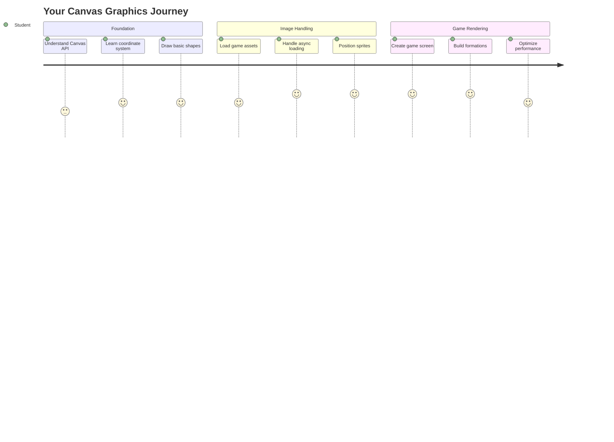
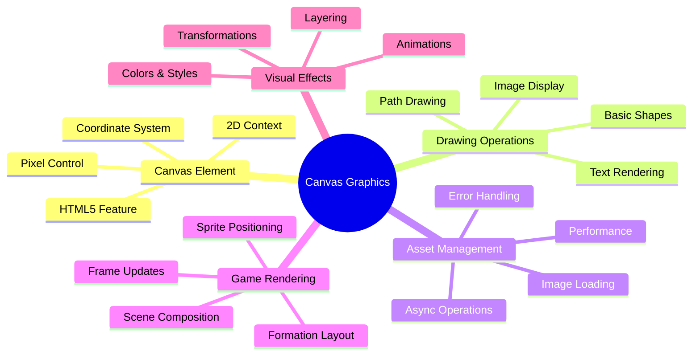
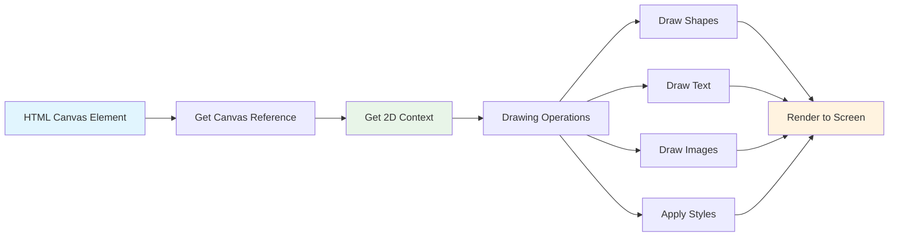
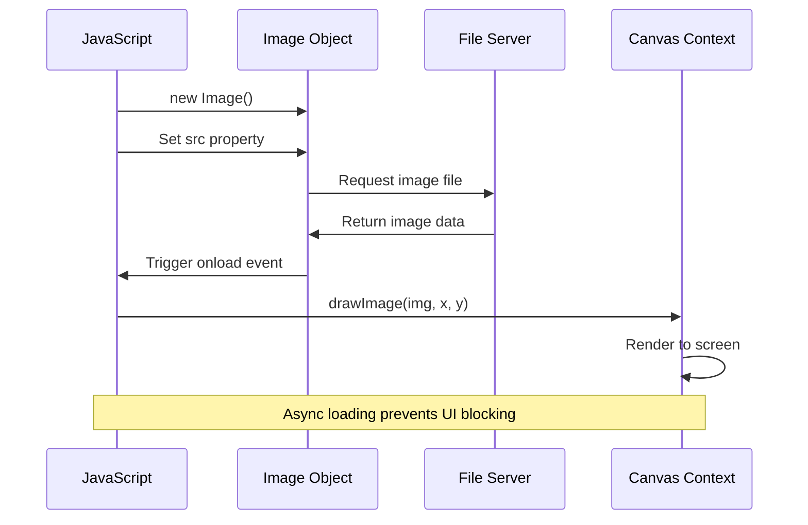
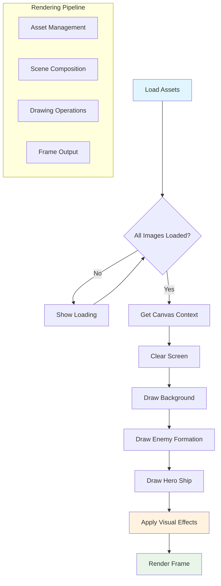
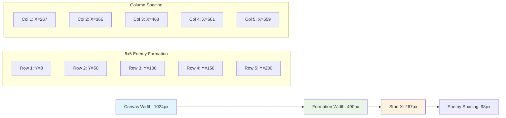
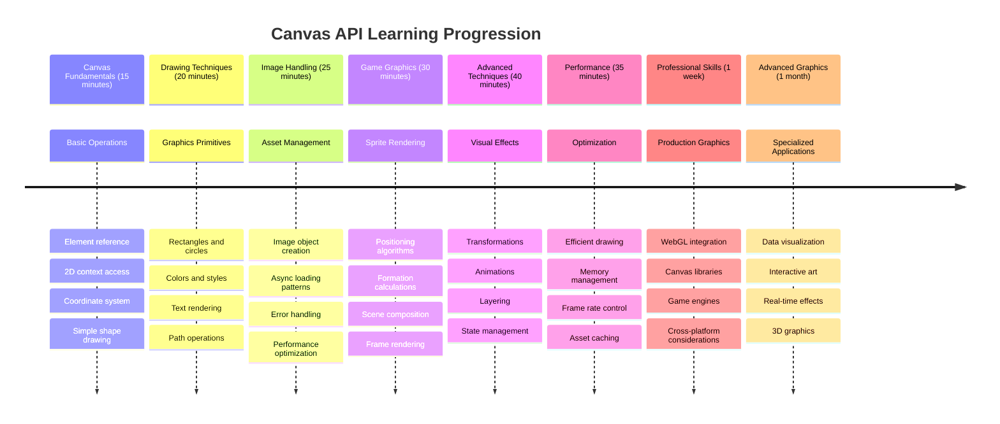

# Build a Space Game Part 2: Draw Hero and Monsters to Canvas



The Canvas API is one of web development's most powerful features for creating dynamic, interactive graphics right in your browser. In this lesson, we'll transform that blank HTML `<canvas>` element into a game world filled with heroes and monsters. Think of the canvas as your digital art board where code becomes visual.

We're building on what you learned in the previous lesson, and now we'll dive into the visual aspects. You'll learn how to load and display game sprites, position elements precisely, and create the visual foundation for your space game. This bridges the gap between static web pages and dynamic, interactive experiences.

By the end of this lesson, you'll have a complete game scene with your hero ship positioned correctly and enemy formations ready for battle. You'll understand how modern games render graphics in browsers and gain skills to create your own interactive visual experiences. Let's explore canvas graphics and bring your space game to life!



## Pre-Lecture Quiz

[Pre-lecture quiz](https://ff-quizzes.netlify.app/web/quiz/31)

## The Canvas

So what exactly is this `<canvas>` element? It's HTML5's solution for creating dynamic graphics and animations in web browsers. Unlike regular images or videos that are static, the canvas gives you pixel-level control over everything that appears on screen. This makes it perfect for games, data visualizations, and interactive art. Think of it as a programmable drawing surface where JavaScript becomes your paintbrush.

By default, a canvas element looks like a blank, transparent rectangle on your page. But that's where the potential lies! Its real power emerges when you use JavaScript to draw shapes, load images, create animations, and make things respond to user interactions. It's similar to how early computer graphics pioneers at Bell Labs in the 1960s had to program every pixel to create the first digital animations.

✅ Read [more about the Canvas API](https://developer.mozilla.org/docs/Web/API/Canvas_API) on MDN.

Here's how it's typically declared, as part of the page's body:

```html
<canvas id="myCanvas" width="200" height="100"></canvas>
```

**Here's what this code does:**
- **Sets** the `id` attribute so you can reference this specific canvas element in JavaScript
- **Defines** the `width` in pixels to control the canvas's horizontal size
- **Establishes** the `height` in pixels to determine the canvas's vertical dimensions

## Drawing Simple Geometry

Now that you know what the canvas element is, let's explore actually drawing on it! The canvas uses a coordinate system that might feel familiar from math class, but there's one important twist specific to computer graphics.

The canvas uses Cartesian coordinates with an x-axis (horizontal) and y-axis (vertical) to position everything you draw. But here's the key difference: unlike the coordinate system from math class, the origin point `(0,0)` starts at the top-left corner, with x-values increasing as you move right and y-values increasing as you move down. This approach dates back to early computer displays where electron beams scanned from top to bottom, making top-left the natural starting point.

```mermaid
quadrantChart
    title Canvas Coordinate System
    x-axis Left --> Right (X increases)
    y-axis Top --> Bottom (Y increases)
    quadrant-1 Quadrant 1
    quadrant-2 Quadrant 2  
    quadrant-3 Quadrant 3
    quadrant-4 Quadrant 4
    
    Origin (0,0): [0.1, 0.1]
    Hero Center: [0.5, 0.8]
    Enemy Formation: [0.3, 0.2]
    Power-up: [0.7, 0.6]
    UI Elements: [0.9, 0.1]
```


> Image from [MDN](https://developer.mozilla.org/docs/Web/API/Canvas_API/Tutorial/Drawing_shapes)

To draw on the canvas element, you'll follow the same three-step process that forms the foundation of all canvas graphics. Once you do this a few times, it becomes second nature:



1. **Get a reference** to your Canvas element from the DOM (just like any other HTML element)
2. **Get the 2D rendering context** – this provides all the drawing methods
3. **Start drawing!** Use the context's built-in methods to create your graphics

Here's how this looks in code:

```javascript
// Step 1: Get the canvas element
const canvas = document.getElementById("myCanvas");

// Step 2: Get the 2D rendering context
const ctx = canvas.getContext("2d");

// Step 3: Set fill color and draw a rectangle
ctx.fillStyle = 'red';
ctx.fillRect(0, 0, 200, 200); // x, y, width, height
```

**Let's break this down step by step:**
- We **grab** our canvas element using its ID and store it in a variable
- We **get** the 2D rendering context – this is our toolkit full of drawing methods
- We **tell** the canvas we want to fill things with red using the `fillStyle` property
- We **draw** a rectangle starting at the top-left corner (0,0) that's 200 pixels wide and tall

✅ The Canvas API mostly focuses on 2D shapes, but you can also draw 3D elements to a web site; for this, you might use the [WebGL API](https://developer.mozilla.org/docs/Web/API/WebGL_API).

You can draw all sorts of things with the Canvas API like:

- **Geometrical shapes**, we've already showed how to draw a rectangle, but there is much more you can draw.
- **Text**, you can draw a text with any font and color you wish.
- **Images**, you can draw an image based off of an image asset like a .jpg or .png for example.

✅ Try it! You know how to draw a rectangle, can you draw a circle to a page? Take a look at some interesting Canvas drawings on CodePen. Here's a [particularly impressive example](https://codepen.io/dissimulate/pen/KrAwx).

### 🔄 **Pedagogical Check-in**
**Canvas Fundamentals Understanding**: Before moving to image loading, ensure you can:
- ✅ Explain how the canvas coordinate system differs from mathematical coordinates
- ✅ Understand the three-step process for canvas drawing operations
- ✅ Identify what the 2D rendering context provides
- ✅ Describe how fillStyle and fillRect work together

**Quick Self-Test**: How would you draw a blue circle at position (100, 50) with radius 25?
```javascript
ctx.fillStyle = 'blue';
ctx.beginPath();
ctx.arc(100, 50, 25, 0, 2 * Math.PI);
ctx.fill();
```

**Canvas Drawing Methods You Now Know**:
- **fillRect()**: Draws filled rectangles
- **fillStyle**: Sets colors and patterns
- **beginPath()**: Starts new drawing paths
- **arc()**: Creates circles and curves

## Load and Draw an Image Asset

Drawing basic shapes is useful for getting started, but most games need actual images! Sprites, backgrounds, and textures are what give games their visual appeal. Loading and displaying images on the canvas works differently than drawing geometric shapes, but it's straightforward once you understand the process.

We need to create an `Image` object, load our image file (this happens asynchronously, meaning "in the background"), and then draw it to the canvas once it's ready. This approach ensures your images display properly without blocking your application while they load.



### Basic Image Loading

```javascript
const img = new Image();
img.src = 'path/to/my/image.png';
img.onload = () => {
  // Image loaded and ready to be used
  console.log('Image loaded successfully!');
};
```

**Here's what's happening in this code:**
- We **create** a brand new Image object to hold our sprite or texture
- We **tell** it which image file to load by setting the source path
- We **listen** for the load event so we know exactly when the image is ready to use

### A Better Way to Load Images

Here's a more robust way to handle image loading that professional developers commonly use. We'll wrap the image loading in a Promise-based function – this approach, popularized when JavaScript Promises became standard in ES6, makes your code more organized and handles errors gracefully:

```javascript
function loadAsset(path) {
  return new Promise((resolve, reject) => {
    const img = new Image();
    img.src = path;
    img.onload = () => {
      resolve(img);
    };
    img.onerror = () => {
      reject(new Error(`Failed to load image: ${path}`));
    };
  });
}

// Modern usage with async/await
async function initializeGame() {
  try {
    const heroImg = await loadAsset('hero.png');
    const monsterImg = await loadAsset('monster.png');
    // Images are now ready to use
  } catch (error) {
    console.error('Failed to load game assets:', error);
  }
}
```

**What we've done here:**
- **Wrapped** all that image loading logic in a Promise so we can handle it better
- **Added** error handling that actually tells us when something goes wrong
- **Used** modern async/await syntax because it's so much cleaner to read
- **Included** try/catch blocks to gracefully handle any loading hiccups

Once your images are loaded, drawing them to the canvas is actually pretty straightforward:

```javascript
async function renderGameScreen() {
  try {
    // Load game assets
    const heroImg = await loadAsset('hero.png');
    const monsterImg = await loadAsset('monster.png');

    // Get canvas and context
    const canvas = document.getElementById("myCanvas");
    const ctx = canvas.getContext("2d");

    // Draw images to specific positions
    ctx.drawImage(heroImg, canvas.width / 2, canvas.height / 2);
    ctx.drawImage(monsterImg, 0, 0);
  } catch (error) {
    console.error('Failed to render game screen:', error);
  }
}
```

**Let's walk through this step by step:**
- We **load** both our hero and monster images in the background using await
- We **grab** our canvas element and get that 2D rendering context we need
- We **position** the hero image right in the center using some quick coordinate math
- We **plop** the monster image at the top-left corner to start our enemy formation
- We **catch** any errors that might happen during loading or rendering



## Now It's Time to Start Building Your Game

Now we'll put everything together to create the visual foundation of your space game. You have a solid understanding of canvas fundamentals and image loading techniques, so this hands-on section will guide you through building a complete game screen with properly positioned sprites.

### What to Build

You will build a web page with a Canvas element. It should render a black screen `1024*768`. We've provided you with two images:

- Hero ship

   

- 5*5 monster

   

### Recommended steps to start development

Locate the starter files that have been created for you in the `your-work` sub folder. Your project structure should contain:

```bash
your-work/
├── assets/
│   ├── enemyShip.png
│   └── player.png
├── index.html
├── app.js
└── package.json
```

**Here's what you're working with:**
- **Game sprites** live in the `assets/` folder so everything stays organized
- **Your main HTML file** sets up the canvas element and gets everything ready
- **A JavaScript file** where you'll write all your game rendering magic
- **A package.json** that sets up a development server so you can test locally

Open this folder in Visual Studio Code to begin development. You'll need a local development environment with Visual Studio Code, NPM, and Node.js installed. If you don't have `npm` set up on your computer, [here's how to install it](https://www.npmjs.com/get-npm).

Start your development server by navigating to the `your-work` folder:

```bash
cd your-work
npm start
```

**This command does some pretty cool stuff:**
- **Starts up** a local server at `http://localhost:5000` so you can test your game
- **Serves** all your files properly so your browser can load them correctly
- **Watches** your files for changes so you can develop smoothly
- **Gives you** a professional development environment to test everything

> 💡 **Note**: Your browser will show a blank page initially – that's expected! As you add code, refresh your browser to see your changes. This iterative development approach is similar to how NASA built the Apollo guidance computer – testing each component before integrating it into the larger system.

### Add code

Add the required code to `your-work/app.js` to complete the following tasks:

1. **Draw a canvas with black background**
   > 💡 **Here's how**: Find the TODO in `/app.js` and add just two lines. Set `ctx.fillStyle` to black, then use `ctx.fillRect()` starting at (0,0) with your canvas dimensions. Easy!

2. **Load game textures**
   > 💡 **Here's how**: Use `await loadAsset()` to load your player and enemy images. Store them in variables so you can use them later. Remember – they won't show up until you actually draw them!

3. **Draw hero ship in the center-bottom position**
   > 💡 **Here's how**: Use `ctx.drawImage()` to position your hero. For the x-coordinate, try `canvas.width / 2 - 45` to center it, and for y-coordinate use `canvas.height - canvas.height / 4` to put it in the bottom area.

4. **Draw a 5×5 formation of enemy ships**
   > 💡 **Here's how**: Find the `createEnemies` function and set up a nested loop. You'll need to do some math for spacing and positioning, but don't worry – I'll show you exactly how!

First, establish constants for proper enemy formation layout:

```javascript
const ENEMY_TOTAL = 5;
const ENEMY_SPACING = 98;
const FORMATION_WIDTH = ENEMY_TOTAL * ENEMY_SPACING;
const START_X = (canvas.width - FORMATION_WIDTH) / 2;
const STOP_X = START_X + FORMATION_WIDTH;
```

**Let's break down what these constants do:**
- We **set** 5 enemies per row and column (a nice 5×5 grid)
- We **define** how much space to put between enemies so they don't look cramped
- We **calculate** how wide our whole formation will be
- We **figure out** where to start and stop so the formation looks centered



Then, create nested loops to draw the enemy formation:

```javascript
for (let x = START_X; x < STOP_X; x += ENEMY_SPACING) {
  for (let y = 0; y < 50 * 5; y += 50) {
    ctx.drawImage(enemyImg, x, y);
  }
}
```

**Here's what this nested loop does:**
- The outer loop **moves** from left to right across our formation
- The inner loop **goes** from top to bottom to create neat rows
- We **draw** each enemy sprite at the exact x,y coordinates we calculated
- Everything stays **evenly spaced** so it looks professional and organized

### 🔄 **Pedagogical Check-in**
**Game Rendering Mastery**: Verify your understanding of the complete rendering system:
- ✅ How does async image loading prevent UI blocking during game startup?
- ✅ Why do we calculate enemy formation positions using constants instead of hardcoding?
- ✅ What role does the 2D rendering context play in drawing operations?
- ✅ How do nested loops create organized sprite formations?

**Performance Considerations**: Your game now demonstrates:
- **Efficient asset loading**: Promise-based image management
- **Organized rendering**: Structured drawing operations
- **Mathematical positioning**: Calculated sprite placement
- **Error handling**: Graceful failure management

**Visual Programming Concepts**: You've learned:
- **Coordinate systems**: Translating math to screen positions
- **Sprite management**: Loading and displaying game graphics
- **Formation algorithms**: Mathematical patterns for organized layouts
- **Async operations**: Modern JavaScript for smooth user experience

## Result

The finished result should look like so:


## Solution

Please try solving it yourself first but if you get stuck, have a look at a [solution](solution/app.js)

---

## GitHub Copilot Agent Challenge 🚀

Use the Agent mode to complete the following challenge:

**Description:** Enhance your space game canvas by adding visual effects and interactive elements using the Canvas API techniques you've learned.

**Prompt:** Create a new file called `enhanced-canvas.html` with a canvas that displays animated stars in the background, a pulsing health bar for the hero ship, and enemy ships that slowly move downward. Include JavaScript code that draws twinkling stars using random positions and opacity, implements a health bar that changes color based on health level (green > yellow > red), and animates the enemy ships to move down the screen at different speeds.

Learn more about [agent mode](https://code.visualstudio.com/blogs/2025/02/24/introducing-copilot-agent-mode) here.

## 🚀 Challenge

You've learned about drawing with the 2D-focused Canvas API; take a look at the [WebGL API](https://developer.mozilla.org/docs/Web/API/WebGL_API), and try to draw a 3D object.

## Post-Lecture Quiz

[Post-lecture quiz](https://ff-quizzes.netlify.app/web/quiz/32)

## Review & Self Study

Learn more about the Canvas API by [reading about it](https://developer.mozilla.org/docs/Web/API/Canvas_API).

### ⚡ **What You Can Do in the Next 5 Minutes**
- [ ] Open the browser console and create a canvas element with `document.createElement('canvas')`
- [ ] Try drawing a rectangle using `fillRect()` on a canvas context
- [ ] Experiment with different colors using `fillStyle` property
- [ ] Draw a simple circle using the `arc()` method

### 🎯 **What You Can Accomplish This Hour**
- [ ] Complete the post-lesson quiz and understand canvas fundamentals
- [ ] Create a canvas drawing application with multiple shapes and colors
- [ ] Implement image loading and sprite rendering for your game
- [ ] Build a simple animation that moves objects across the canvas
- [ ] Practice canvas transformations like scaling, rotation, and translation

### 📅 **Your Week-Long Canvas Journey**
- [ ] Complete the space game with polished graphics and sprite animations
- [ ] Master advanced canvas techniques like gradients, patterns, and compositing
- [ ] Create interactive visualizations using canvas for data representation
- [ ] Learn about canvas optimization techniques for smooth performance
- [ ] Build a drawing or painting application with various tools
- [ ] Explore creative coding patterns and generative art with canvas

### 🌟 **Your Month-Long Graphics Mastery**
- [ ] Build complex visual applications using Canvas 2D and WebGL
- [ ] Learn graphics programming concepts and shader basics
- [ ] Contribute to open source graphics libraries and visualization tools
- [ ] Master performance optimization for graphics-intensive applications
- [ ] Create educational content about canvas programming and computer graphics
- [ ] Become a graphics programming expert who helps others create visual experiences

## 🎯 Your Canvas Graphics Mastery Timeline



### 🛠️ Your Canvas Graphics Toolkit Summary

After completing this lesson, you now have:
- **Canvas API Mastery**: Complete understanding of 2D graphics programming
- **Coordinate Mathematics**: Precise positioning and layout algorithms
- **Asset Management**: Professional image loading and error handling
- **Rendering Pipeline**: Structured approach to scene composition
- **Game Graphics**: Sprite positioning and formation calculations
- **Async Programming**: Modern JavaScript patterns for smooth performance
- **Visual Programming**: Translating mathematical concepts to screen graphics

**Real-World Applications**: Your Canvas skills directly apply to:
- **Data Visualization**: Charts, graphs, and interactive dashboards
- **Game Development**: 2D games, simulations, and interactive experiences
- **Digital Art**: Creative coding and generative art projects
- **UI/UX Design**: Custom graphics and interactive elements
- **Educational Software**: Visual learning tools and simulations
- **Web Applications**: Dynamic graphics and real-time visualizations

**Professional Skills Gained**: You can now:
- **Build** custom graphics solutions without external libraries
- **Optimize** rendering performance for smooth user experiences
- **Debug** complex visual problems using browser developer tools
- **Design** scalable graphics systems using mathematical principles
- **Integrate** Canvas graphics with modern web application frameworks

**Canvas API Methods You've Mastered**:
- **Element Management**: getElementById, getContext
- **Drawing Operations**: fillRect, drawImage, fillStyle
- **Asset Loading**: Image objects, Promise patterns
- **Mathematical Positioning**: Coordinate calculations, formation algorithms

**Next Level**: You're ready to add animation, user interaction, collision detection, or explore WebGL for 3D graphics!

🌟 **Achievement Unlocked**: You've built a complete game rendering system using fundamental Canvas API techniques!

## Assignment

[Play with the Canvas API](assignment.md)