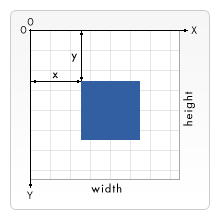
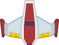
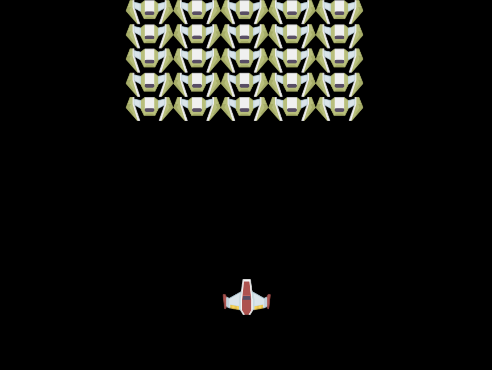

# スペースゲーム構築プロジェクト その 2: ヒーローとモンスターをキャンバスに描く

## レッスン前の小テスト

[レッスン前の小テスト](https://nice-beach-0fe9e9d0f.azurestaticapps.net/quiz/31?loc=ja)

## Canvas

Canvas は HTML 要素で、デフォルトでは何のコンテンツもありません。何もない白紙の状態です。その上に描画することで、Canvas に追加する必要があります。

✅ MDN の [Canvas API についての詳細](https://developer.mozilla.org/ja/docs/Web/API/Canvas_API)はこちらをご覧ください。

ページの本文の一部として、一般的にどのように宣言されているかをご紹介します。

```html
<canvas id="myCanvas" width="200" height="100"></canvas>
```

上では `id`, `width`, `height` を設定しています。

- `id`: 設定することで、これと対話する必要があるときに参照を取得できるようになります
- `width`: これは要素の幅です
- `height`: これは要素の高さです

## 簡単な幾何学図形の描画

キャンバスは、直交座標系を使って物を描いています。したがって、何かがどこにあるかを表現するために x 軸と y 軸を使用しています。`0,0` の位置が左上の位置で、右下の位置がキャンバスの幅と高さと言ったところです。


> 画像は [MDN](https://developer.mozilla.org/ja/docs/Web/Guide/HTML/Canvas_tutorial/Drawing_shapes) より

キャンバス要素に描画するには、以下の手順を踏む必要があります。

1. Canvas 要素への**参照を取得します**
1. canvas 要素の上にある Context 要素の**参照を取得します**
1. context 要素を使用して**描画操作を行います**

上記の手順のコードは、通常次のようになります。

```javascript
// 赤い四角を描きます。
//1. キャンバスの参照を取得します
canvas = document.getElementById("myCanvas");

//2. コンテキストを 2D に設定して基本的な図形を描画します。
ctx = canvas.getContext("2d");

//3. 赤で塗りつぶします。
ctx.fillStyle = 'red';

//4. そして、これらのパラメータで矩形を描画し、位置とサイズを設定します。
ctx.fillRect(0,0, 200, 200) // x, y, width, height
```

✅ Canvas API は主に 2D の図形に焦点を当てていますが、Web サイトに 3D の要素を描画することもできます。そのためには、[WebGL API](https://developer.mozilla.org/ja/docs/Web/API/WebGL_API) を使用するとよいでしょう。

Canvas API を使っていろいろなものを描くことができます。

- **幾何学的な形状**、我々はすでに長方形を描画する方法を示しましたが、あなたが描くことができるはるかに多くのものがあります
- **テキスト**は、任意のフォントと色でテキストを描くことができます
- **画像**では、例えば .jpg や .png のような画像アセットに基づいて画像を描くことができます

✅ やってみましょう! 長方形の描き方は知っていると思いますが、ページに円を描くことはできますか? CodePen に掲載されている面白い Canvas のドローイングを見てみましょう。ここに[特に印象的な例](https://codepen.io/dissimulate/pen/KrAwx)があります。

## 画像アセットの読み込みと描画

画像アセットをロードするには、`Image` オブジェクトを作成して `src` プロパティを設定します。そして、`load` イベントを待ち受け、それがいつ使用可能になるかを知ることができます。コードは次のようになります。

### アセットの読み込み

```javascript
const img = new Image();
img.src = 'path/to/my/image.png';
img.onload = () => {
  // イメージが読み込まれて使用可能な状態になっています
}
```

### アセットの読み込みパターン

上記のようなコンストラクトで包んだ方が使いやすいですし、フルロードした時だけ操作しようとするのでおすすめです。

```javascript
function loadAsset(path) {
  return new Promise((resolve) => {
    const img = new Image();
    img.src = path;
    img.onload = () => {
      // イメージが読み込まれて使用可能な状態になっています
      resolve(img);
    }
  })
}

// 使いまわします

async function run() {
  const heroImg = await loadAsset('hero.png')
  const monsterImg = await loadAsset('monster.png')
}

```

ゲームアセットを画面に描画するには、以下のようなコードになります。

```javascript
async function run() {
  const heroImg = await loadAsset('hero.png')
  const monsterImg = await loadAsset('monster.png')

  canvas = document.getElementById("myCanvas");
  ctx = canvas.getContext("2d");
  ctx.drawImage(heroImg, canvas.width/2, canvas.height/2);
  ctx.drawImage(monsterImg, 0, 0);
}
```

## さあ、あなたのゲームを作り始める時が来ました。

### 何を構築するか

Canvas 要素を使って Web ページを作成します。これは黒い画面 `1024 * 768` をレンダリングする必要があります。画像は2枚用意しました。

- Hero の宇宙船

   

- 5*5 monster

   

### 開発を始めるための推奨ステップ

あなたのために作成されたファイルを `your-work` サブフォルダ内で探します。以下のファイルが含まれているはずです。

```bash
-| assets
  -| enemyShip.png
  -| player.png
-| index.html
-| app.js
-| package.json
```

このフォルダのコピーを Visual Studio Code で開きます。ローカルの開発環境が設定されている必要があり、できれば Visual Studio Code に NPM と Node がインストールされている必要があります。もしあなたのコンピュータに `npm` がセットアップされていない場合は、[ここにその方法があります](https://www.npmjs.com/get-npm)。

`your_work` フォルダに移動してプロジェクトを開始します。

```bash
cd your-work
npm start
```

以上で、`http://localhost:5000` というアドレスに HTTP サーバが起動します。ブラウザを開いて、そのアドレスを入力してください。今は何も表示されていませんが、そのうち変わるでしょう。

> 注: 画面上の変更を確認するには、ブラウザを更新してください。

### コードの追加

以下の問題を解決するために必要なコードを `your-work/app.js` に追加します。

1. 黒い背景のキャンバスを**描画します**
   > tip: `/app.js` の適切な TODO の下に 2 行を追加し、`ctx` 要素を黒にして上下の座標を 0,0 にし、高さと幅をキャンバスと同じにします。
2. テクスチャを**読み込みます**
   > tip: プレイヤーと敵の画像を追加するには `await loadTexture` を使用し、画像パスを渡してください。まだ画面には表示されていません!
3. 下半分の画面中央にヒーローを**描画します**
   > tip: heroImg を画面に描画するには `drawImage` API を使用し、`canvas.width / 2 - 45` と `canvas.height - canvas.height / 4)` を設定します。
4. 5*5 のモンスターを**描画します**
   > tip: これで、画面上に敵を描画するコードのコメントを解除することができるようになりました。次に、`createEnemies` 関数に移動して、それを構築する。

   まず、いくつかの定数を設定します。

    ```javascript
    const MONSTER_TOTAL = 5;
    const MONSTER_WIDTH = MONSTER_TOTAL * 98;
    const START_X = (canvas.width - MONSTER_WIDTH) / 2;
    const STOP_X = START_X + MONSTER_WIDTH;
    ```

    そして、モンスターの配列を画面上に描画するループを作成します。

    ```javascript
    for (let x = START_X; x < STOP_X; x += 98) {
        for (let y = 0; y < 50 * 5; y += 50) {
          ctx.drawImage(enemyImg, x, y);
        }
      }
    ```

## 結果

仕上がりはこんな感じになるはずです。



## Solution

まずはご自身で解決してみていただきたいですが、行き詰った場合は [solution](../solution/app.js) を参考にしてみてください。

---

## 🚀 チャレンジ

2D を中心とした Canvas API での描画について学んできましたが、[WebGL API](https://developer.mozilla.org/ja/docs/Web/API/WebGL_API) を参考に、3D オブジェクトを描画してみましょう。

## レッスン後の小テスト

[レッスン後の小テスト](https://nice-beach-0fe9e9d0f.azurestaticapps.net/quiz/32?loc=ja)

## 復習と自己学習

Canvas API については、[こちらを読んでいただく](https://developer.mozilla.org/ja/docs/Web/API/Canvas_API)ことで詳しく知ることができます。

## 課題

[Canvas API で遊ぶ](assignment.ja.md)