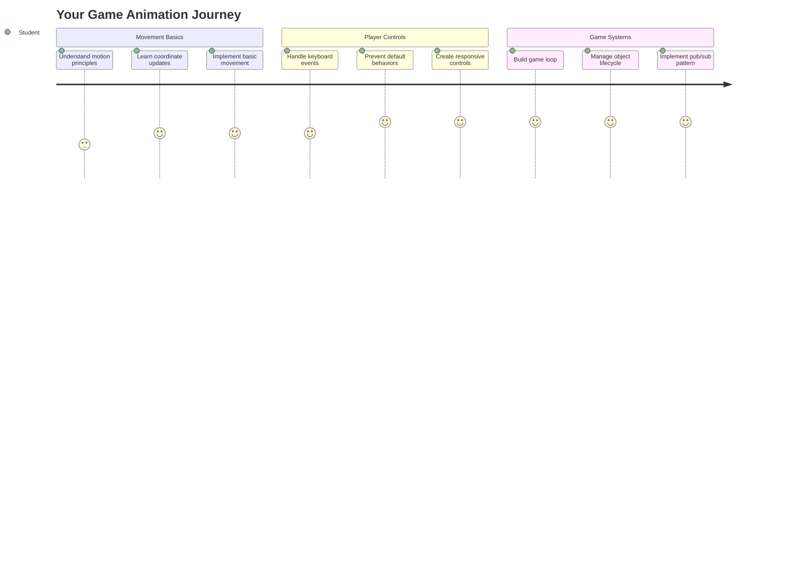
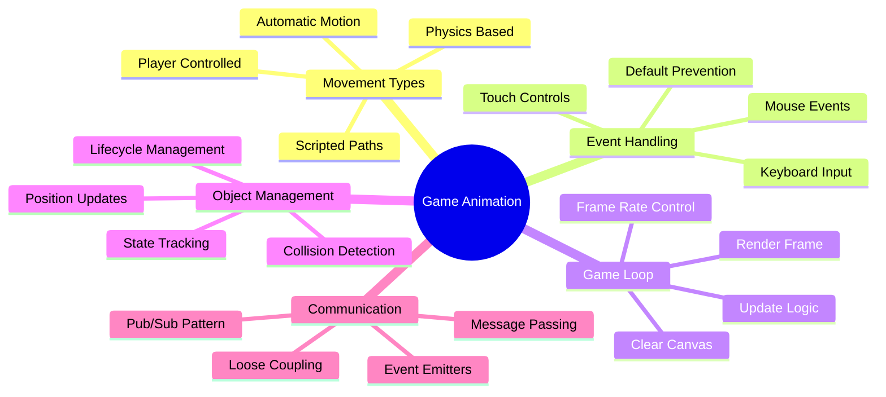
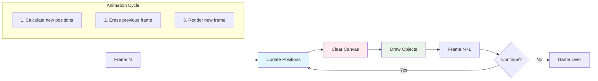
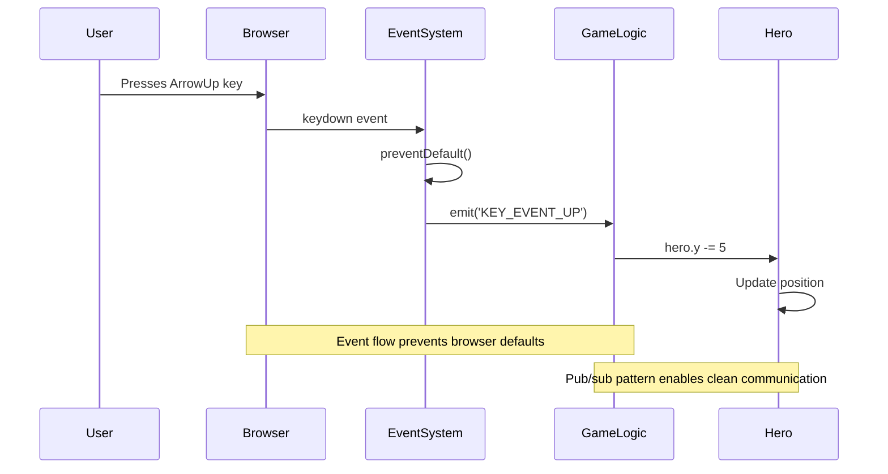
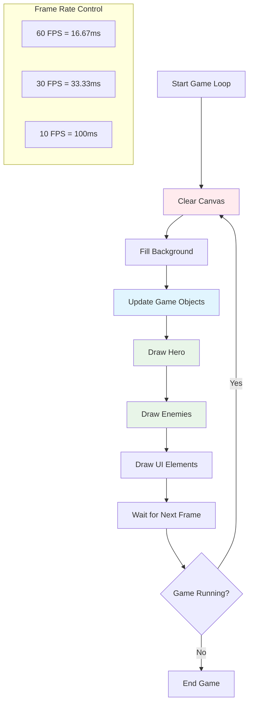
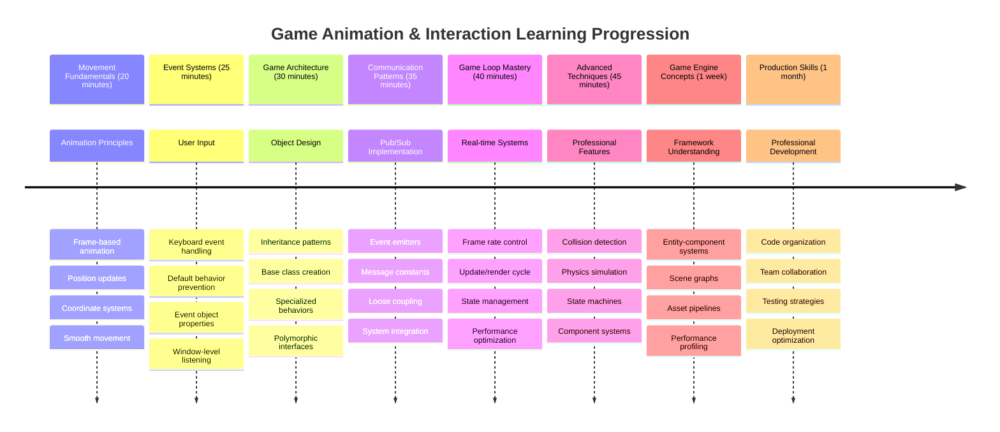

# Build a Space Game Part 3: Adding Motion



Think about your favorite games – what makes them captivating isn't just pretty graphics, it's the way everything moves and responds to your actions. Right now, your space game is like a beautiful painting, but we're about to add movement that brings it to life.

When NASA's engineers programmed the guidance computer for the Apollo missions, they faced a similar challenge: how do you make a spacecraft respond to pilot input while automatically maintaining course corrections? The principles we'll learn today echo those same concepts – managing player-controlled movement alongside automatic system behaviors.

In this lesson, you'll learn how to make spaceships glide across the screen, respond to player commands, and create smooth movement patterns. We'll break everything down into manageable concepts that build on each other naturally.

By the end, you'll have players flying their hero ship around the screen while enemy vessels patrol overhead. More importantly, you'll understand the core principles that power game movement systems.



## Pre-Lecture Quiz

[Pre-lecture quiz](https://ff-quizzes.netlify.app/web/quiz/33)

## Understanding Game Movement

Games come alive when things start moving around, and there are fundamentally two ways this happens:

- **Player-controlled movement**: When you press a key or click your mouse, something moves. This is the direct connection between you and your game world.
- **Automatic movement**: When the game itself decides to move things – like those enemy ships that need to patrol the screen whether you're doing anything or not.

Making objects move on a computer screen is simpler than you might think. Remember those x and y coordinates from math class? That's exactly what we're working with here. When Galileo tracked Jupiter's moons in 1610, he was essentially doing the same thing – plotting positions over time to understand motion patterns.

Moving things on screen is like creating a flipbook animation – you need to follow these three simple steps:



1. **Update the position** – Change where your object should be (maybe move it 5 pixels to the right)
2. **Erase the old frame** – Clear the screen so you don't see ghostly trails everywhere
3. **Draw the new frame** – Put your object in its new spot

Do this fast enough, and boom! You've got smooth movement that feels natural to players.

Here's what it can look like in code:

```javascript
// Set the hero's location
hero.x += 5;
// Clear the rectangle that hosts the hero
ctx.clearRect(0, 0, canvas.width, canvas.height);
// Redraw the game background and hero
ctx.fillRect(0, 0, canvas.width, canvas.height);
ctx.fillStyle = "black";
ctx.drawImage(heroImg, hero.x, hero.y);
```

**Here's what this code does:**
- **Updates** the hero's x-coordinate by 5 pixels to move it horizontally
- **Clears** the entire canvas area to remove the previous frame
- **Fills** the canvas with a black background color
- **Redraws** the hero image at its new position

✅ Can you think of a reason why redrawing your hero many frames per second might accrue performance costs? Read about [alternatives to this pattern](https://developer.mozilla.org/en-US/docs/Web/API/Canvas_API/Tutorial/Optimizing_canvas).

## Handle keyboard events

This is where we connect player input to game action. When someone hits the spacebar to fire a laser or taps an arrow key to dodge an asteroid, your game needs to detect and respond to that input.

Keyboard events happen at the window level, meaning your entire browser window is listening for those keypresses. Mouse clicks, on the other hand, can be tied to specific elements (like clicking a button). For our space game, we'll focus on keyboard controls since that's what gives players that classic arcade feel.

This reminds me of how telegraph operators in the 1800s had to translate morse code input into meaningful messages – we're doing something similar, translating keypresses into game commands.

To handle an event you need to use the window's `addEventListener()` method and provide it with two input parameters. The first parameter is the name of the event, for example `keyup`. The second parameter is the function that should be invoked as a result of the event taking place.

Here's an example:

```javascript
window.addEventListener('keyup', (evt) => {
  // evt.key = string representation of the key
  if (evt.key === 'ArrowUp') {
    // do something
  }
});
```

**Breaking down what happens here:**
- **Listens** for keyboard events on the entire window
- **Captures** the event object which contains information about which key was pressed
- **Checks** if the pressed key matches a specific key (in this case, the up arrow)
- **Executes** code when the condition is met

For key events there are two properties on the event you can use to see what key was pressed:

- `key` - this is a string representation of the pressed key, for example `'ArrowUp'`
- `keyCode` - this is a number representation, for example `37`, corresponds to `ArrowLeft`

✅ Key event manipulation is useful outside of game development. What other uses can you think of for this technique?



### Special keys: a heads up!

Some keys have built-in browser behaviors that can interfere with your game. Arrow keys scroll the page and spacebar jumps down – behaviors you don't want when someone is trying to pilot their spaceship.

We can prevent these default behaviors and let our game handle the input instead. This is similar to how early computer programmers had to override system interrupts to create custom behaviors – we're just doing it at the browser level. Here's how:

```javascript
const onKeyDown = function (e) {
  console.log(e.keyCode);
  switch (e.keyCode) {
    case 37:
    case 39:
    case 38:
    case 40: // Arrow keys
    case 32:
      e.preventDefault();
      break; // Space
    default:
      break; // do not block other keys
  }
};

window.addEventListener('keydown', onKeyDown);
```

**Understanding this prevention code:**
- **Checks** for specific key codes that might cause unwanted browser behavior
- **Prevents** the default browser action for arrow keys and spacebar
- **Allows** other keys to function normally
- **Uses** `e.preventDefault()` to stop the browser's built-in behavior

### 🔄 **Pedagogical Check-in**
**Event Handling Understanding**: Before moving to automatic movement, ensure you can:
- ✅ Explain the difference between `keydown` and `keyup` events
- ✅ Understand why we prevent default browser behaviors
- ✅ Describe how event listeners connect user input to game logic
- ✅ Identify which keys might interfere with game controls

**Quick Self-Test**: What would happen if you didn't prevent default behavior for arrow keys?
*Answer: The browser would scroll the page, interfering with game movement*

**Event System Architecture**: You now understand:
- **Window-level listening**: Capturing events at the browser level
- **Event object properties**: `key` strings vs `keyCode` numbers
- **Default prevention**: Stopping unwanted browser behaviors
- **Conditional logic**: Responding to specific key combinations

## Game induced movement

Now let's talk about objects that move without player input. Think about enemy ships cruising across the screen, bullets flying in straight lines, or clouds drifting in the background. This autonomous movement makes your game world feel alive even when nobody's touching the controls.

We use JavaScript's built-in timers to update positions at regular intervals. This concept is similar to how pendulum clocks work – a regular mechanism that triggers consistent, timed actions. Here's how simple it can be:

```javascript
const id = setInterval(() => {
  // Move the enemy on the y axis
  enemy.y += 10;
}, 100);
```

**Here's what this movement code does:**
- **Creates** a timer that runs every 100 milliseconds
- **Updates** the enemy's y-coordinate by 10 pixels each time
- **Stores** the interval ID so we can stop it later if needed
- **Moves** the enemy downward on the screen automatically

## The game loop

Here's the concept that ties everything together – the game loop. If your game were a movie, the game loop would be the film projector, showing frame after frame so fast that everything appears to move smoothly.

Every game has one of these loops running behind the scenes. It's a function that updates all game objects, redraws the screen, and repeats this process continuously. This keeps track of your hero, all the enemies, any lasers flying around – the entire game state.

This concept reminds me of how early film animators like Walt Disney had to redraw characters frame by frame to create the illusion of movement. We're doing the same thing, just with code instead of pencils.

Here's what a game loop can typically look like, expressed in code:



```javascript
const gameLoopId = setInterval(() => {
  function gameLoop() {
    ctx.clearRect(0, 0, canvas.width, canvas.height);
    ctx.fillStyle = "black";
    ctx.fillRect(0, 0, canvas.width, canvas.height);
    drawHero();
    drawEnemies();
    drawStaticObjects();
  }
  gameLoop();
}, 200);
```

**Understanding the game loop structure:**
- **Clears** the entire canvas to remove the previous frame
- **Fills** the background with a solid color
- **Draws** all game objects in their current positions
- **Repeats** this process every 200 milliseconds to create smooth animation
- **Manages** the frame rate by controlling the interval timing

## Continuing the Space Game

Now we'll add movement to the static scene you built previously. We're going to transform it from a screenshot into an interactive experience. We'll work through this step by step to ensure each piece builds on the last.

Grab the code from where we left off in the previous lesson (or start with the code in the [Part II- starter](your-work) folder if you need a fresh start).

**Here's what we're building today:**
- **Hero controls**: Arrow keys will pilot your spaceship around the screen
- **Enemy movement**: Those alien ships will start their advance

Let's begin implementing these features.

## Recommended steps

Locate the files that have been created for you in the `your-work` sub folder. It should contain the following:

```bash
-| assets
  -| enemyShip.png
  -| player.png
-| index.html
-| app.js
-| package.json
```

You start your project in the `your-work` folder by typing:

```bash
cd your-work
npm start
```

**What this command does:**
- **Navigates** to your project directory
- **Starts** a HTTP Server on address `http://localhost:5000`
- **Serves** your game files so you can test them in a browser

The above will start a HTTP Server on address `http://localhost:5000`. Open up a browser and input that address, right now it should render the hero and all the enemies; nothing is moving - yet!

### Add code

1. **Add dedicated objects** for `hero` and `enemy` and `game object`, they should have `x` and `y` properties. (Remember the portion on [Inheritance or composition](../README.md)).

   *HINT* `game object` should be the one with `x` and `y` and the ability to draw itself to a canvas.

   > **Tip**: Start by adding a new `GameObject` class with its constructor delineated as below, and then draw it to the canvas:

    ```javascript
    class GameObject {
      constructor(x, y) {
        this.x = x;
        this.y = y;
        this.dead = false;
        this.type = "";
        this.width = 0;
        this.height = 0;
        this.img = undefined;
      }
    
      draw(ctx) {
        ctx.drawImage(this.img, this.x, this.y, this.width, this.height);
      }
    }
    ```

    **Understanding this base class:**
    - **Defines** common properties that all game objects share (position, size, image)
    - **Includes** a `dead` flag to track whether the object should be removed
    - **Provides** a `draw()` method that renders the object on the canvas
    - **Sets** default values for all properties that child classes can override

    ```mermaid
    classDiagram
        class GameObject {
            +x: number
            +y: number
            +dead: boolean
            +type: string
            +width: number
            +height: number
            +img: Image
            +draw(ctx)
        }
        
        class Hero {
            +speed: number
            +type: "Hero"
            +width: 98
            +height: 75
        }
        
        class Enemy {
            +type: "Enemy"
            +width: 98
            +height: 50
            +setInterval()
        }
        
        GameObject <|-- Hero
        GameObject <|-- Enemy
        
        class EventEmitter {
            +listeners: object
            +on(message, listener)
            +emit(message, payload)
        }
    ```

    Now, extend this `GameObject` to create the `Hero` and `Enemy`:
    
    ```javascript
    class Hero extends GameObject {
      constructor(x, y) {
        super(x, y);
        this.width = 98;
        this.height = 75;
        this.type = "Hero";
        this.speed = 5;
      }
    }
    ```

    ```javascript
    class Enemy extends GameObject {
      constructor(x, y) {
        super(x, y);
        this.width = 98;
        this.height = 50;
        this.type = "Enemy";
        const id = setInterval(() => {
          if (this.y < canvas.height - this.height) {
            this.y += 5;
          } else {
            console.log('Stopped at', this.y);
            clearInterval(id);
          }
        }, 300);
      }
    }
    ```

    **Key concepts in these classes:**
    - **Inherits** from `GameObject` using the `extends` keyword
    - **Calls** the parent constructor with `super(x, y)`
    - **Sets** specific dimensions and properties for each object type
    - **Implements** automatic movement for enemies using `setInterval()`

2. **Add key-event handlers** to handle key navigation (move hero up/down left/right)

   *REMEMBER* it's a cartesian system, top-left is `0,0`. Also remember to add code to stop *default behavior*

   > **Tip**: Create your `onKeyDown` function and attach it to the window:

   ```javascript
   const onKeyDown = function (e) {
     console.log(e.keyCode);
     // Add the code from the lesson above to stop default behavior
     switch (e.keyCode) {
       case 37:
       case 39:
       case 38:
       case 40: // Arrow keys
       case 32:
         e.preventDefault();
         break; // Space
       default:
         break; // do not block other keys
     }
   };

   window.addEventListener("keydown", onKeyDown);
   ```
    
   **What this event handler does:**
   - **Listens** for keydown events on the entire window
   - **Logs** the key code to help you debug which keys are being pressed
   - **Prevents** default browser behavior for arrow keys and spacebar
   - **Allows** other keys to function normally
   
   Check your browser console at this point, and watch the keystrokes being logged. 

3. **Implement** the [Pub sub pattern](../README.md), this will keep your code clean as you follow the remaining parts.

   The Publish-Subscribe pattern helps organize your code by separating event detection from event handling. This makes your code more modular and easier to maintain.

   To do this last part, you can:

   1. **Add an event listener** on the window:

       ```javascript
       window.addEventListener("keyup", (evt) => {
         if (evt.key === "ArrowUp") {
           eventEmitter.emit(Messages.KEY_EVENT_UP);
         } else if (evt.key === "ArrowDown") {
           eventEmitter.emit(Messages.KEY_EVENT_DOWN);
         } else if (evt.key === "ArrowLeft") {
           eventEmitter.emit(Messages.KEY_EVENT_LEFT);
         } else if (evt.key === "ArrowRight") {
           eventEmitter.emit(Messages.KEY_EVENT_RIGHT);
         }
       });
       ```

   **What this event system does:**
   - **Detects** keyboard input and converts it to custom game events
   - **Separates** input detection from game logic
   - **Makes** it easy to change controls later without affecting game code
   - **Allows** multiple systems to respond to the same input

   ```mermaid
   flowchart TD
       A["Keyboard Input"] --> B["Window Event Listener"]
       B --> C["Event Emitter"]
       C --> D["KEY_EVENT_UP"]
       C --> E["KEY_EVENT_DOWN"]
       C --> F["KEY_EVENT_LEFT"]
       C --> G["KEY_EVENT_RIGHT"]
       
       D --> H["Hero Movement"]
       D --> I["Sound System"]
       D --> J["Visual Effects"]
       
       E --> H
       F --> H
       G --> H
       
       style A fill:#e1f5fe
       style C fill:#e8f5e8
       style H fill:#fff3e0
   ```

   2. **Create an EventEmitter class** to publish and subscribe to messages:

       ```javascript
       class EventEmitter {
         constructor() {
           this.listeners = {};
         }
       
         on(message, listener) {
           if (!this.listeners[message]) {
             this.listeners[message] = [];
           }
           this.listeners[message].push(listener);
         }
       
   3. **Add constants** and set up the EventEmitter:

       ```javascript
       const Messages = {
         KEY_EVENT_UP: "KEY_EVENT_UP",
         KEY_EVENT_DOWN: "KEY_EVENT_DOWN",
         KEY_EVENT_LEFT: "KEY_EVENT_LEFT",
         KEY_EVENT_RIGHT: "KEY_EVENT_RIGHT",
       };
       
       let heroImg, 
           enemyImg, 
           laserImg,
           canvas, ctx, 
           gameObjects = [], 
           hero, 
           eventEmitter = new EventEmitter();
       ```

   **Understanding the setup:**
   - **Defines** message constants to avoid typos and make refactoring easier
   - **Declares** variables for images, canvas context, and game state
   - **Creates** a global event emitter for the pub-sub system
   - **Initializes** an array to hold all game objects

   4. **Initialize the game**

       ```javascript
       function initGame() {
         gameObjects = [];
         createEnemies();
         createHero();
       
         eventEmitter.on(Messages.KEY_EVENT_UP, () => {
           hero.y -= 5;
         });
       
         eventEmitter.on(Messages.KEY_EVENT_DOWN, () => {
           hero.y += 5;
         });
       
         eventEmitter.on(Messages.KEY_EVENT_LEFT, () => {
           hero.x -= 5;
         });
       
4. **Setup the game loop**

   Refactor the `window.onload` function to initialize the game and set up a game loop on a good interval. You'll also add a laser beam:

    ```javascript
    window.onload = async () => {
      canvas = document.getElementById("canvas");
      ctx = canvas.getContext("2d");
      heroImg = await loadTexture("assets/player.png");
      enemyImg = await loadTexture("assets/enemyShip.png");
      laserImg = await loadTexture("assets/laserRed.png");
    
      initGame();
      const gameLoopId = setInterval(() => {
        ctx.clearRect(0, 0, canvas.width, canvas.height);
        ctx.fillStyle = "black";
        ctx.fillRect(0, 0, canvas.width, canvas.height);
        drawGameObjects(ctx);
      }, 100);
    };
    ```

   **Understanding the game setup:**
   - **Waits** for the page to load completely before starting
   - **Gets** the canvas element and its 2D rendering context
   - **Loads** all image assets asynchronously using `await`
   - **Starts** the game loop running at 100ms intervals (10 FPS)
   - **Clears** and redraws the entire screen each frame

5. **Add code** to move enemies at a certain interval

    Refactor the `createEnemies()` function to create the enemies and push them into the new gameObjects class:

    ```javascript
    function createEnemies() {
      const MONSTER_TOTAL = 5;
      const MONSTER_WIDTH = MONSTER_TOTAL * 98;
      const START_X = (canvas.width - MONSTER_WIDTH) / 2;
      const STOP_X = START_X + MONSTER_WIDTH;
    
      for (let x = START_X; x < STOP_X; x += 98) {
        for (let y = 0; y < 50 * 5; y += 50) {
          const enemy = new Enemy(x, y);
          enemy.img = enemyImg;
          gameObjects.push(enemy);
        }
      }
    }
    ```

    **What the enemy creation does:**
    - **Calculates** positions to center enemies on the screen
    - **Creates** a grid of enemies using nested loops
    - **Assigns** the enemy image to each enemy object
    - **Adds** each enemy to the global game objects array
    
    and add a `createHero()` function to do a similar process for the hero.
    
    ```javascript
    function createHero() {
      hero = new Hero(
        canvas.width / 2 - 45,
        canvas.height - canvas.height / 4
      );
      hero.img = heroImg;
      gameObjects.push(hero);
    }
    ```

    **What the hero creation does:**
    - **Positions** the hero at the bottom center of the screen
    - **Assigns** the hero image to the hero object
    - **Adds** the hero to the game objects array for rendering

    and finally, add a `drawGameObjects()` function to start the drawing:

    ```javascript
    function drawGameObjects(ctx) {
      gameObjects.forEach(go => go.draw(ctx));
    }
    ```

    **Understanding the drawing function:**
    - **Iterates** through all game objects in the array
    - **Calls** the `draw()` method on each object
    - **Passes** the canvas context so objects can render themselves

    ### 🔄 **Pedagogical Check-in**
    **Complete Game System Understanding**: Verify your mastery of the entire architecture:
    - ✅ How does inheritance allow Hero and Enemy to share common GameObject properties?
    - ✅ Why does the pub/sub pattern make your code more maintainable?
    - ✅ What role does the game loop play in creating smooth animation?
    - ✅ How do event listeners connect user input to game object behavior?

    **System Integration**: Your game now demonstrates:
    - **Object-Oriented Design**: Base classes with specialized inheritance
    - **Event-Driven Architecture**: Pub/sub pattern for loose coupling
    - **Animation Framework**: Game loop with consistent frame updates
    - **Input Handling**: Keyboard events with default prevention
    - **Asset Management**: Image loading and sprite rendering

    **Professional Patterns**: You've implemented:
    - **Separation of Concerns**: Input, logic, and rendering separated
    - **Polymorphism**: All game objects share common drawing interface
    - **Message Passing**: Clean communication between components
    - **Resource Management**: Efficient sprite and animation handling

    Your enemies should start advancing on your hero spaceship!
      }
    }
    ```
    
    and add a `createHero()` function to do a similar process for the hero.
    
    ```javascript
    function createHero() {
      hero = new Hero(
        canvas.width / 2 - 45,
        canvas.height - canvas.height / 4
      );
      hero.img = heroImg;
      gameObjects.push(hero);
    }
    ```

    and finally, add a `drawGameObjects()` function to start the drawing:

    ```javascript
    function drawGameObjects(ctx) {
      gameObjects.forEach(go => go.draw(ctx));
    }
    ```

    Your enemies should start advancing on your hero spaceship!

---

## GitHub Copilot Agent Challenge 🚀

Here's a challenge that will improve your game's polish: adding boundaries and smooth controls. Currently, your hero can fly off the screen, and the movement might feel choppy.

**Your Mission:** Make your spaceship feel more realistic by implementing screen boundaries and fluid movement. This is similar to how NASA's flight control systems prevent spacecraft from exceeding safe operational parameters.

**Here's what to build:** Create a system that keeps your hero spaceship on screen, and make the controls feel smooth. When players hold down an arrow key, the ship should glide continuously rather than moving in discrete steps. Consider adding visual feedback when the ship reaches screen boundaries – perhaps a subtle effect to indicate the edge of the play area.

Learn more about [agent mode](https://code.visualstudio.com/blogs/2025/02/24/introducing-copilot-agent-mode) here.

## 🚀 Challenge

Code organization becomes increasingly important as projects grow. You might have noticed your file getting crowded with functions, variables, and classes all mixed together. This reminds me of how the engineers organizing the Apollo mission code had to create clear, maintainable systems that multiple teams could work on simultaneously.

**Your mission:**
Think like a software architect. How would you organize your code so that six months from now, you (or a teammate) could understand what's happening? Even if everything stays in one file for now, you can create better organization:

- **Grouping related functions** together with clear comment headers
- **Separating concerns** - keep game logic separate from rendering
- **Using consistent naming** conventions for variables and functions
- **Creating modules** or namespaces to organize different aspects of your game
- **Adding documentation** that explains the purpose of each major section

**Reflection questions:**
- Which parts of your code are hardest to understand when you come back to them?
- How could you organize your code to make it easier for someone else to contribute?
- What would happen if you wanted to add new features like power-ups or different enemy types?

## Post-Lecture Quiz

[Post-lecture quiz](https://ff-quizzes.netlify.app/web/quiz/34)

## Review & Self Study

We've been building everything from scratch, which is fantastic for learning, but here's a little secret – there are some amazing JavaScript frameworks out there that can handle a lot of the heavy lifting for you. Once you feel comfortable with the fundamentals we've covered, it's worth [exploring what's available](https://github.com/collections/javascript-game-engines).

Think of frameworks like having a well-stocked toolbox instead of making every tool by hand. They can solve many of those code organization challenges we talked about, plus offer features that would take weeks to build yourself.

**Things worth exploring:**
- How game engines organize code – you'll be amazed at the clever patterns they use
- Performance tricks for making canvas games run butter-smooth  
- Modern JavaScript features that can make your code cleaner and more maintainable
- Different approaches to managing game objects and their relationships

## 🎯 Your Game Animation Mastery Timeline



### 🛠️ Your Game Development Toolkit Summary

After completing this lesson, you now have mastered:
- **Animation Principles**: Frame-based movement and smooth transitions
- **Event-Driven Programming**: Keyboard input handling with proper event management
- **Object-Oriented Design**: Inheritance hierarchies and polymorphic interfaces
- **Communication Patterns**: Pub/sub architecture for maintainable code
- **Game Loop Architecture**: Real-time update and rendering cycles
- **Input Systems**: User control mapping with default behavior prevention
- **Asset Management**: Sprite loading and efficient rendering techniques

### ⚡ **What You Can Do in the Next 5 Minutes**
- [ ] Open the browser console and try `addEventListener('keydown', console.log)` to see keyboard events
- [ ] Create a simple div element and move it around using arrow keys
- [ ] Experiment with `setInterval` to create continuous movement
- [ ] Try preventing default behavior with `event.preventDefault()`

### 🎯 **What You Can Accomplish This Hour**
- [ ] Complete the post-lesson quiz and understand event-driven programming
- [ ] Build the moving hero spaceship with full keyboard controls
- [ ] Implement smooth enemy movement patterns
- [ ] Add boundaries to prevent game objects from leaving the screen
- [ ] Create basic collision detection between game objects

### 📅 **Your Week-Long Animation Journey**
- [ ] Complete the full space game with polished movement and interactions
- [ ] Add advanced movement patterns like curves, acceleration, and physics
- [ ] Implement smooth transitions and easing functions
- [ ] Create particle effects and visual feedback systems
- [ ] Optimize game performance for smooth 60fps gameplay
- [ ] Add mobile touch controls and responsive design

### 🌟 **Your Month-Long Interactive Development**
- [ ] Build complex interactive applications with advanced animation systems
- [ ] Learn animation libraries like GSAP or create your own animation engine
- [ ] Contribute to open source game development and animation projects
- [ ] Master performance optimization for graphics-intensive applications
- [ ] Create educational content about game development and animation
- [ ] Build a portfolio showcasing advanced interactive programming skills

**Real-World Applications**: Your game animation skills apply directly to:
- **Interactive Web Applications**: Dynamic dashboards and real-time interfaces
- **Data Visualization**: Animated charts and interactive graphics
- **Educational Software**: Interactive simulations and learning tools
- **Mobile Development**: Touch-based games and gesture handling
- **Desktop Applications**: Electron apps with smooth animations
- **Web Animations**: CSS and JavaScript animation libraries

**Professional Skills Gained**: You can now:
- **Architect** event-driven systems that scale with complexity
- **Implement** smooth animations using mathematical principles
- **Debug** complex interaction systems using browser developer tools
- **Optimize** game performance for different devices and browsers
- **Design** maintainable code structures using proven patterns

**Game Development Concepts Mastered**:
- **Frame Rate Management**: Understanding FPS and timing controls
- **Input Handling**: Cross-platform keyboard and event systems
- **Object Lifecycle**: Creation, update, and destruction patterns
- **State Synchronization**: Keeping game state consistent across frames
- **Event Architecture**: Decoupled communication between game systems

**Next Level**: You're ready to add collision detection, scoring systems, sound effects, or explore modern game frameworks like Phaser or Three.js!

🌟 **Achievement Unlocked**: You've built a complete interactive game system with professional architecture patterns!

## Assignment

[Comment your code](assignment.md)
