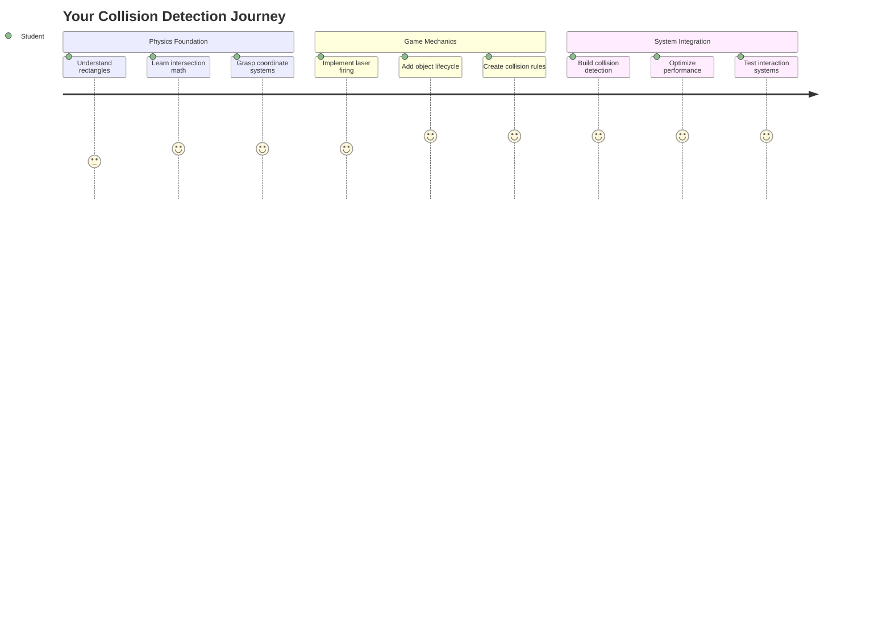
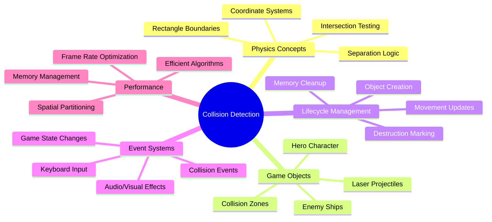
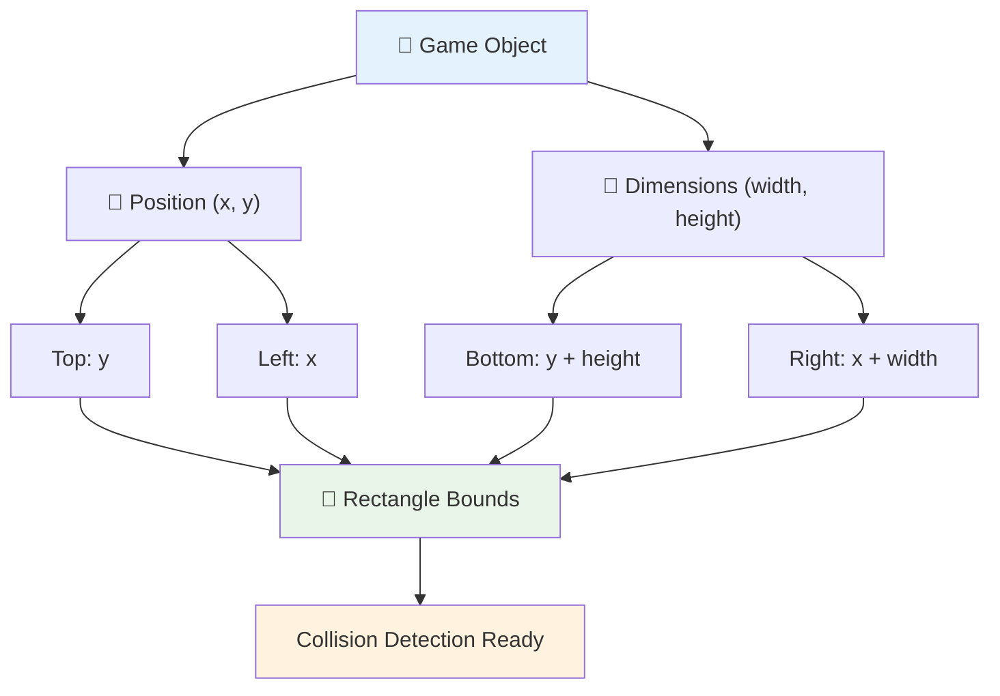
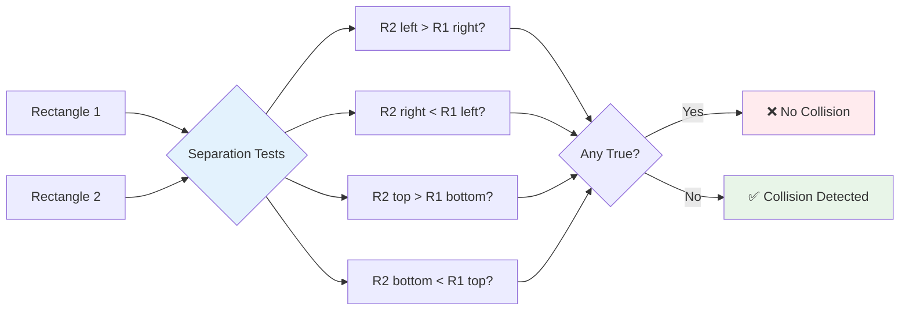
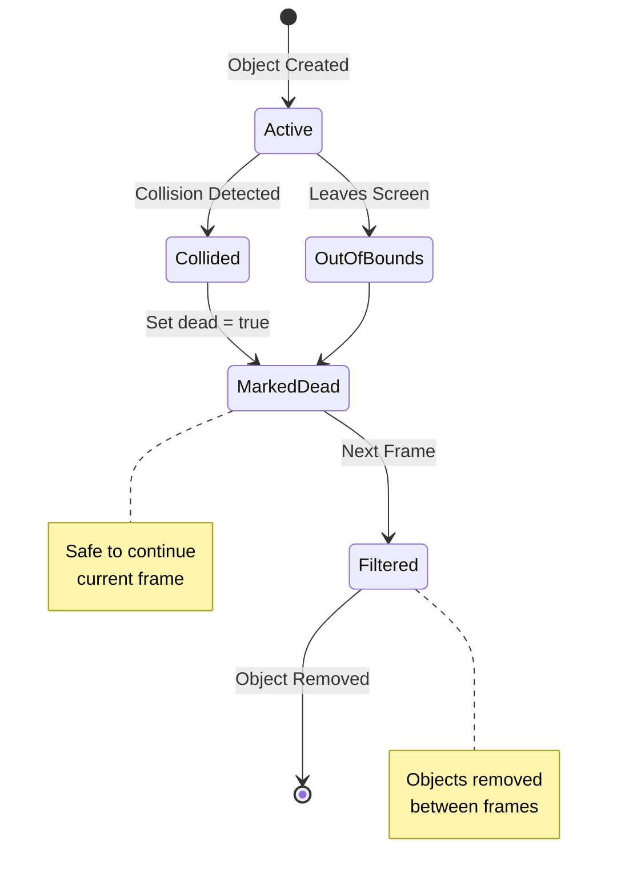
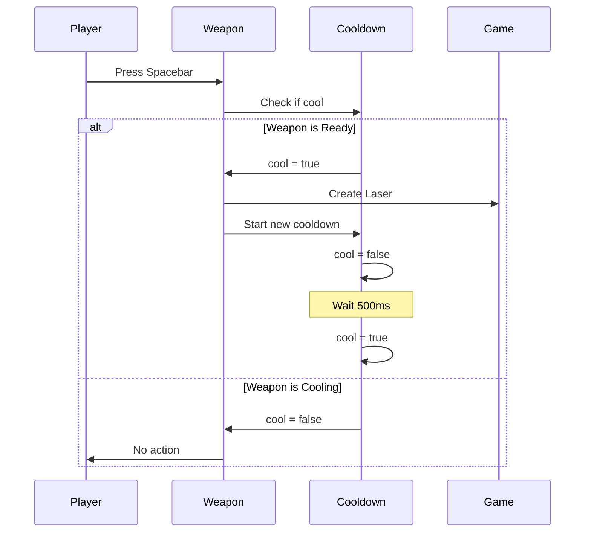
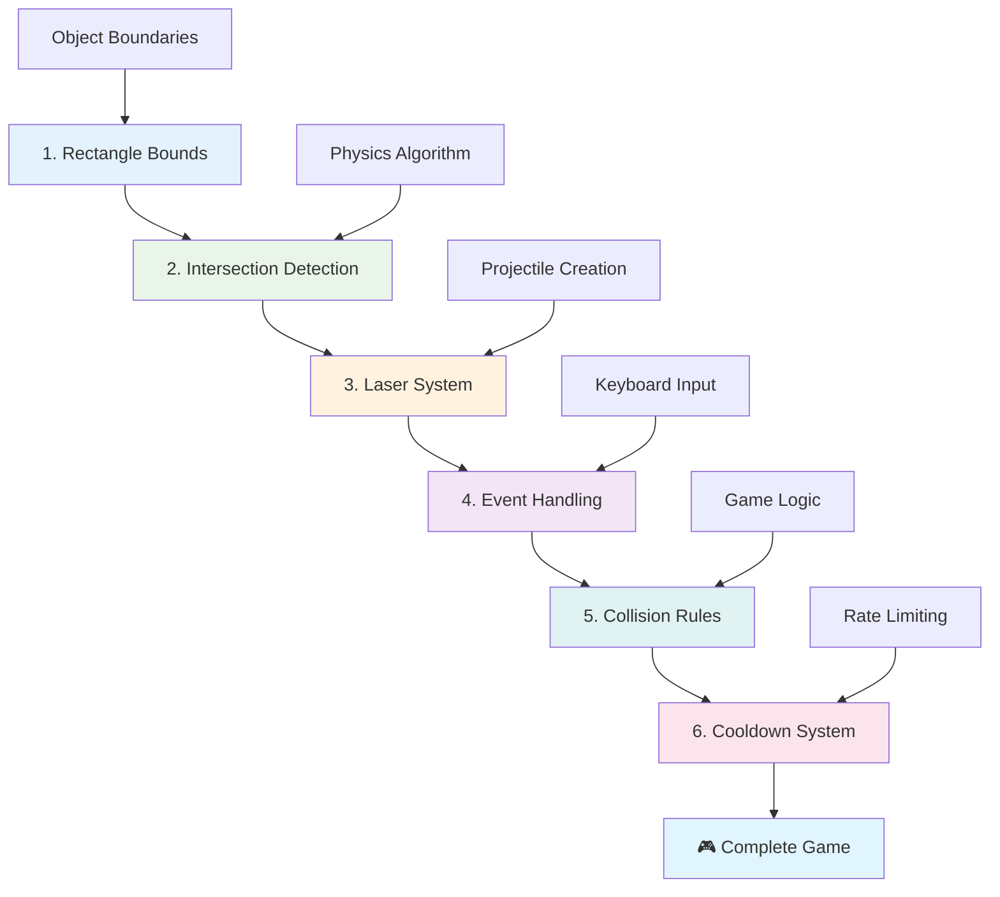
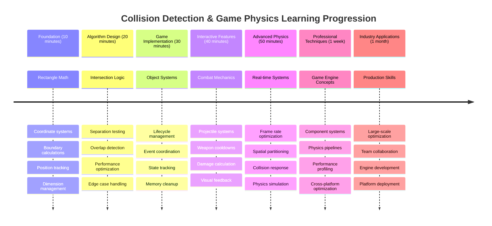

# Build a Space Game Part 4: Adding A Laser and Detect Collisions



## Pre-Lecture Quiz

[Pre-lecture quiz](https://ff-quizzes.netlify.app/web/quiz/35)

Think about the moment in Star Wars when Luke's proton torpedoes hit the Death Star's exhaust port. That precise collision detection changed the fate of the galaxy! In games, collision detection works the same way - it determines when objects interact and what happens next.

In this lesson, you'll add laser weapons to your space game and implement collision detection. Just like NASA's mission planners calculate spacecraft trajectories to avoid debris, you'll learn to detect when game objects intersect. We'll break this down into manageable steps that build on each other.

By the end, you'll have a functioning combat system where lasers destroy enemies and collisions trigger game events. These same collision principles are used in everything from physics simulations to interactive web interfaces.



✅ Do a little research on the very first computer game ever written. What was its functionality?

## Collision detection

Collision detection works like the proximity sensors on the Apollo lunar module - it constantly checks distances and triggers alerts when objects get too close. In games, this system determines when objects interact and what should happen next.

The approach we'll use treats every game object as a rectangle, similar to how air traffic control systems use simplified geometric shapes to track aircraft. This rectangular method might seem basic, but it's computationally efficient and works well for most game scenarios.

### Rectangle representation

Every game object needs coordinate boundaries, similar to how the Mars Pathfinder rover mapped its location on the Martian surface. Here's how we define these boundary coordinates:



```javascript
rectFromGameObject() {
  return {
    top: this.y,
    left: this.x,
    bottom: this.y + this.height,
    right: this.x + this.width
  }
}
```

**Let's break this down:**
- **Top edge**: That's just where your object starts vertically (its y position)
- **Left edge**: Where it starts horizontally (its x position) 
- **Bottom edge**: Add the height to the y position - now you know where it ends!
- **Right edge**: Add the width to the x position - and you've got the complete boundary

### Intersection algorithm

Detecting rectangle intersections uses logic similar to how the Hubble Space Telescope determines if celestial objects are overlapping in its field of view. The algorithm checks for separation:



```javascript
function intersectRect(r1, r2) {
  return !(r2.left > r1.right ||
    r2.right < r1.left ||
    r2.top > r1.bottom ||
    r2.bottom < r1.top);
}
```

**The separation test works like radar systems:**
- Is rectangle 2 completely to the right of rectangle 1?
- Is rectangle 2 completely to the left of rectangle 1?
- Is rectangle 2 completely below rectangle 1?
- Is rectangle 2 completely above rectangle 1?

If none of these conditions are true, the rectangles must be overlapping. This approach mirrors how radar operators determine if two aircraft are at safe distances.

## Managing object lifecycles

When a laser hits an enemy, both objects need to be removed from the game. However, deleting objects mid-loop can cause crashes - a lesson learned the hard way in early computer systems like the Apollo Guidance Computer. Instead, we use a "mark for deletion" approach that safely removes objects between frames.



Here's how we mark something for removal:

```javascript
// Mark object for removal
enemy.dead = true;
```

**Why this approach works:**
- We mark the object as "dead" but don't delete it right away
- This lets the current game frame finish safely
- No crashes from trying to use something that's already gone!

Then filter out marked objects before the next render cycle:

```javascript
gameObjects = gameObjects.filter(go => !go.dead);
```

**What this filtering does:**
- Creates a fresh list with only the "living" objects
- Tosses out anything marked as dead
- Keeps your game running smoothly
- Prevents memory bloat from accumulating destroyed objects

## Implementing laser mechanics

Laser projectiles in games work on the same principle as photon torpedoes in Star Trek - they're discrete objects that travel in straight lines until they hit something. Each spacebar press creates a new laser object that moves across the screen.

To make this work, we need to coordinate a few different pieces:

**Key components to implement:**
- **Create** laser objects that spawn from the hero's position
- **Handle** keyboard input to trigger laser creation
- **Manage** laser movement and lifecycle
- **Implement** visual representation for the laser projectiles

## Implementing firing rate control

Unlimited firing rates would overwhelm the game engine and make gameplay too easy. Real weapon systems face similar constraints - even the USS Enterprise's phasers needed time to recharge between shots.

We'll implement a cooldown system that prevents rapid-fire spamming while maintaining responsive controls:



```javascript
class Cooldown {
  constructor(time) {
    this.cool = false;
    setTimeout(() => {
      this.cool = true;
    }, time);
  }
}

class Weapon {
  constructor() {
    this.cooldown = null;
  }
  
  fire() {
    if (!this.cooldown || this.cooldown.cool) {
      // Create laser projectile
      this.cooldown = new Cooldown(500);
    } else {
      // Weapon is still cooling down
    }
  }
}
```

**How the cooldown works:**
- When created, the weapon starts "hot" (can't fire yet)
- After the timeout period, it becomes "cool" (ready to fire)
- Before firing, we check: "Is the weapon cool?"
- This prevents spam-clicking while keeping controls responsive

✅ Refer to lesson 1 in the space game series to remind yourself about cooldowns.

## Building the collision system

You'll extend your existing space game code to create a collision detection system. Like the International Space Station's automated collision avoidance system, your game will continuously monitor object positions and respond to intersections.

Starting from your previous lesson's code, you'll add collision detection with specific rules that govern object interactions.

> 💡 **Pro Tip**: The laser sprite is already included in your assets folder and referenced in your code, ready for implementation.

### Collision rules to implement

**Game mechanics to add:**
1. **Laser hits enemy**: Enemy object is destroyed when struck by a laser projectile
2. **Laser hits screen boundary**: Laser is removed when reaching the top edge of the screen
3. **Enemy and hero collision**: Both objects are destroyed when they intersect
4. **Enemy reaches bottom**: Game over condition when enemies reach the screen bottom

### 🔄 **Pedagogical Check-in**
**Collision Detection Foundation**: Before implementing, ensure you understand:
- ✅ How rectangle boundaries define collision zones
- ✅ Why separation testing is more efficient than intersection calculation
- ✅ The importance of object lifecycle management in game loops
- ✅ How event-driven systems coordinate collision responses

**Quick Self-Test**: What would happen if you deleted objects immediately instead of marking them?
*Answer: Mid-loop deletion could cause crashes or skip objects in iteration*

**Physics Understanding**: You now grasp:
- **Coordinate Systems**: How position and dimensions create boundaries
- **Intersection Logic**: Mathematical principles behind collision detection
- **Performance Optimization**: Why efficient algorithms matter in real-time systems
- **Memory Management**: Safe object lifecycle patterns for stability

## Setting up your development environment

Good news - we've already set up most of the groundwork for you! All your game assets and basic structure are waiting in the `your-work` subfolder, ready for you to add the cool collision features.

### Project structure

```bash
-| assets
  -| enemyShip.png
  -| player.png
  -| laserRed.png
-| index.html
-| app.js
-| package.json
```

**Understanding the file structure:**
- **Contains** all sprite images needed for the game objects
- **Includes** the main HTML document and JavaScript application file
- **Provides** package configuration for local development server

### Starting the development server

Navigate to your project folder and start the local server:

```bash
cd your-work
npm start
```

**This command sequence:**
- **Changes** directory to your working project folder
- **Starts** a local HTTP server on `http://localhost:5000`
- **Serves** your game files for testing and development
- **Enables** live development with automatic reloading

Open your browser and navigate to `http://localhost:5000` to see your current game state with the hero and enemies rendered on screen.

### Step-by-step implementation

Like the systematic approach NASA used to program the Voyager spacecraft, we'll implement collision detection methodically, building each component step by step.



#### 1. Add rectangle collision bounds

First, let's teach our game objects how to describe their boundaries. Add this method to your `GameObject` class:

```javascript
rectFromGameObject() {
    return {
      top: this.y,
      left: this.x,
      bottom: this.y + this.height,
      right: this.x + this.width,
    };
  }
```

**This method accomplishes:**
- **Creates** a rectangle object with precise boundary coordinates
- **Calculates** bottom and right edges using position plus dimensions
- **Returns** an object ready for collision detection algorithms
- **Provides** a standardized interface for all game objects

#### 2. Implement intersection detection

Now let's create our collision detective - a function that can tell when two rectangles are overlapping:

```javascript
function intersectRect(r1, r2) {
  return !(
    r2.left > r1.right ||
    r2.right < r1.left ||
    r2.top > r1.bottom ||
    r2.bottom < r1.top
  );
}
```

**This algorithm works by:**
- **Tests** four separation conditions between rectangles
- **Returns** `false` if any separation condition is true
- **Indicates** collision when no separation exists
- **Uses** negation logic for efficient intersection testing

#### 3. Implement laser firing system

Here's where things get exciting! Let's set up the laser firing system.

##### Message constants

First, let's define some message types so different parts of our game can talk to each other:

```javascript
KEY_EVENT_SPACE: "KEY_EVENT_SPACE",
COLLISION_ENEMY_LASER: "COLLISION_ENEMY_LASER",
COLLISION_ENEMY_HERO: "COLLISION_ENEMY_HERO",
```

**These constants provide:**
- **Standardizes** event names throughout the application
- **Enables** consistent communication between game systems
- **Prevents** typos in event handler registration

##### Keyboard input handling

Add space key detection to your key event listener:

```javascript
} else if(evt.keyCode === 32) {
  eventEmitter.emit(Messages.KEY_EVENT_SPACE);
}
```

**This input handler:**
- **Detects** space key presses using keyCode 32
- **Emits** a standardized event message
- **Enables** decoupled firing logic

##### Event listener setup

Register firing behavior in your `initGame()` function:

```javascript
eventEmitter.on(Messages.KEY_EVENT_SPACE, () => {
 if (hero.canFire()) {
   hero.fire();
 }
});
```

**This event listener:**
- **Responds** to space key events
- **Checks** firing cooldown status
- **Triggers** laser creation when allowed

Add collision handling for laser-enemy interactions:

```javascript
eventEmitter.on(Messages.COLLISION_ENEMY_LASER, (_, { first, second }) => {
  first.dead = true;
  second.dead = true;
});
```

**This collision handler:**
- **Receives** collision event data with both objects
- **Marks** both objects for removal
- **Ensures** proper cleanup after collision

#### 4. Create the Laser class

Implement a laser projectile that moves upward and manages its own lifecycle:

```javascript
class Laser extends GameObject {
  constructor(x, y) {
    super(x, y);
    this.width = 9;
    this.height = 33;
    this.type = 'Laser';
    this.img = laserImg;
    
    let id = setInterval(() => {
      if (this.y > 0) {
        this.y -= 15;
      } else {
        this.dead = true;
        clearInterval(id);
      }
    }, 100);
  }
}
```

**This class implementation:**
- **Extends** GameObject to inherit basic functionality
- **Sets** appropriate dimensions for the laser sprite
- **Creates** automatic upward movement using `setInterval()`
- **Handles** self-destruction when reaching screen top
- **Manages** its own animation timing and cleanup

#### 5. Implement collision detection system

Create a comprehensive collision detection function:

```javascript
function updateGameObjects() {
  const enemies = gameObjects.filter(go => go.type === 'Enemy');
  const lasers = gameObjects.filter(go => go.type === "Laser");
  
  // Test laser-enemy collisions
  lasers.forEach((laser) => {
    enemies.forEach((enemy) => {
      if (intersectRect(laser.rectFromGameObject(), enemy.rectFromGameObject())) {
        eventEmitter.emit(Messages.COLLISION_ENEMY_LASER, {
          first: laser,
          second: enemy,
        });
      }
    });
  });

  // Remove destroyed objects
  gameObjects = gameObjects.filter(go => !go.dead);
}
```

**This collision system:**
- **Filters** game objects by type for efficient testing
- **Tests** every laser against every enemy for intersections
- **Emits** collision events when intersections are detected
- **Cleans** up destroyed objects after collision processing

> ⚠️ **Important**: Add `updateGameObjects()` to your main game loop in `window.onload` to enable collision detection.

#### 6. Add cooldown system to Hero class

Enhance the Hero class with firing mechanics and rate limiting:

```javascript
class Hero extends GameObject {
  constructor(x, y) {
    super(x, y);
    this.width = 99;
    this.height = 75;
    this.type = "Hero";
    this.speed = { x: 0, y: 0 };
    this.cooldown = 0;
  }
  
  fire() {
    gameObjects.push(new Laser(this.x + 45, this.y - 10));
    this.cooldown = 500;

    let id = setInterval(() => {
      if (this.cooldown > 0) {
        this.cooldown -= 100;
      } else {
        clearInterval(id);
      }
    }, 200);
  }
  
  canFire() {
    return this.cooldown === 0;
  }
}
```

**Understanding the enhanced Hero class:**
- **Initializes** cooldown timer at zero (ready to fire)
- **Creates** laser objects positioned above the hero ship
- **Sets** cooldown period to prevent rapid firing
- **Decrements** cooldown timer using interval-based updates
- **Provides** firing status check through `canFire()` method

### 🔄 **Pedagogical Check-in**
**Complete System Understanding**: Verify your mastery of the collision system:
- ✅ How do rectangle boundaries enable efficient collision detection?
- ✅ Why is object lifecycle management critical for game stability?
- ✅ How does the cooldown system prevent performance issues?
- ✅ What role does event-driven architecture play in collision handling?

**System Integration**: Your collision detection demonstrates:
- **Mathematical Precision**: Rectangle intersection algorithms
- **Performance Optimization**: Efficient collision testing patterns
- **Memory Management**: Safe object creation and destruction
- **Event Coordination**: Decoupled system communication
- **Real-time Processing**: Frame-based update cycles

**Professional Patterns**: You've implemented:
- **Separation of Concerns**: Physics, rendering, and input separated
- **Object-Oriented Design**: Inheritance and polymorphism
- **State Management**: Object lifecycle and game state tracking
- **Performance Optimization**: Efficient algorithms for real-time use

### Testing your implementation

Your space game now features complete collision detection and combat mechanics. 🚀 Test these new capabilities:
- **Navigate** with arrow keys to verify movement controls
- **Fire lasers** with the spacebar - notice how the cooldown prevents spam-clicking
- **Observe collisions** when lasers hit enemies, triggering removal
- **Verify cleanup** as destroyed objects disappear from the game

You've successfully implemented a collision detection system using the same mathematical principles that guide spacecraft navigation and robotics.

### ⚡ **What You Can Do in the Next 5 Minutes**
- [ ] Open browser DevTools and set breakpoints in your collision detection function
- [ ] Try modifying the laser speed or enemy movement to see collision effects
- [ ] Experiment with different cooldown values to test firing rates
- [ ] Add `console.log` statements to track collision events in real-time

### 🎯 **What You Can Accomplish This Hour**
- [ ] Complete the post-lesson quiz and understand collision detection algorithms
- [ ] Add visual effects like explosions when collisions occur
- [ ] Implement different types of projectiles with varying properties
- [ ] Create power-ups that enhance player abilities temporarily
- [ ] Add sound effects to make collisions more satisfying

### 📅 **Your Week-Long Physics Programming**
- [ ] Complete the full space game with polished collision systems
- [ ] Implement advanced collision shapes beyond rectangles (circles, polygons)
- [ ] Add particle systems for realistic explosion effects
- [ ] Create complex enemy behavior with collision avoidance
- [ ] Optimize collision detection for better performance with many objects
- [ ] Add physics simulation like momentum and realistic movement

### 🌟 **Your Month-Long Game Physics Mastery**
- [ ] Build games with advanced physics engines and realistic simulations
- [ ] Learn 3D collision detection and spatial partitioning algorithms
- [ ] Contribute to open source physics libraries and game engines
- [ ] Master performance optimization for graphics-intensive applications
- [ ] Create educational content about game physics and collision detection
- [ ] Build a portfolio showcasing advanced physics programming skills

## 🎯 Your Collision Detection Mastery Timeline



### 🛠️ Your Game Physics Toolkit Summary

After completing this lesson, you now have mastered:
- **Collision Mathematics**: Rectangle intersection algorithms and coordinate systems
- **Performance Optimization**: Efficient collision detection for real-time applications
- **Object Lifecycle Management**: Safe creation, updating, and destruction patterns
- **Event-Driven Architecture**: Decoupled systems for collision response
- **Game Loop Integration**: Frame-based physics updates and rendering coordination
- **Input Systems**: Responsive controls with rate limiting and feedback
- **Memory Management**: Efficient object pooling and cleanup strategies

**Real-World Applications**: Your collision detection skills apply directly to:
- **Interactive Simulations**: Scientific modeling and educational tools
- **User Interface Design**: Drag-and-drop interactions and touch detection
- **Data Visualization**: Interactive charts and clickable elements
- **Mobile Development**: Touch gesture recognition and collision handling
- **Robotics Programming**: Path planning and obstacle avoidance
- **Computer Graphics**: Ray tracing and spatial algorithms

**Professional Skills Gained**: You can now:
- **Design** efficient algorithms for real-time collision detection
- **Implement** physics systems that scale with object complexity
- **Debug** complex interaction systems using mathematical principles
- **Optimize** performance for different hardware and browser capabilities
- **Architect** maintainable game systems using proven design patterns

**Game Development Concepts Mastered**:
- **Physics Simulation**: Real-time collision detection and response
- **Performance Engineering**: Optimized algorithms for interactive applications
- **Event Systems**: Decoupled communication between game components
- **Object Management**: Efficient lifecycle patterns for dynamic content
- **Input Handling**: Responsive controls with appropriate feedback

**Next Level**: You're ready to explore advanced physics engines like Matter.js, implement 3D collision detection, or build complex particle systems!

🌟 **Achievement Unlocked**: You've built a complete physics-based interaction system with professional-grade collision detection!

## GitHub Copilot Agent Challenge 🚀

Use the Agent mode to complete the following challenge:

**Description:** Enhance the collision detection system by implementing power-ups that spawn randomly and provide temporary abilities when collected by the hero ship.

**Prompt:** Create a PowerUp class that extends GameObject and implement collision detection between the hero and power-ups. Add at least two types of power-ups: one that increases fire rate (reduces cooldown) and another that creates a temporary shield. Include spawn logic that creates power-ups at random intervals and positions.

---


## 🚀 Challenge

Add an explosion! Take a look at the game assets in [the Space Art repo](../solution/spaceArt/readme.txt) and try to add an explosion when the laser hits an alien

## Post-Lecture Quiz

[Post-lecture quiz](https://ff-quizzes.netlify.app/web/quiz/36)

## Review & Self Study

Experiment with the intervals in your game thus far. What happens when you change them? Read more about [JavaScript timing events](https://www.freecodecamp.org/news/javascript-timing-events-settimeout-and-setinterval/).

## Assignment

[Explore collisions](assignment.md)
