# Build a Space Game Part 5: Scoring and Lives


## Pre-Lecture Quiz

[Pre-lecture quiz](https://ff-quizzes.netlify.app/web/quiz/37)

Ready to make your space game feel like a real game? Let's add scoring points and managing lives - the core mechanics that transformed early arcade games like Space Invaders from simple demonstrations into addictive entertainment. This is where your game becomes truly playable.


## Drawing Text on Screen - Your Game's Voice

To display your score, we need to learn how to render text on the canvas. The `fillText()` method is your primary tool for this - it's the same technique used in classic arcade games to show scores and status information.

```mermaid
flowchart LR
    A["📝 Text Content"] --> B["🎨 Styling"]
    B --> C["📍 Positioning"]
    C --> D["🖼️ Canvas Render"]
    
    E["Font Family"] --> B
    F["Font Size"] --> B
    G["Color"] --> B
    H["Alignment"] --> B
    
    I["X Coordinate"] --> C
    J["Y Coordinate"] --> C
    
    style A fill:#e3f2fd
    style B fill:#e8f5e8
    style C fill:#fff3e0
    style D fill:#f3e5f5
```



You have complete control over the text appearance:

```javascript
ctx.font = "30px Arial";
ctx.fillStyle = "red";
ctx.textAlign = "right";
ctx.fillText("show this on the screen", 0, 0);
```

✅ Dive deeper into [adding text to a canvas](https://developer.mozilla.org/docs/Web/API/Canvas_API/Tutorial/Drawing_text) - you might be surprised at how creative you can get with fonts and styling!

## Lives - More Than Just a Number

In game design, a "life" represents the player's margin for error. This concept dates back to pinball machines, where you'd get multiple balls to play with. In early video games like Asteroids, lives gave players permission to take risks and learn from mistakes.

```mermaid
flowchart TD
    A["🎮 Player Action"] --> B{"Risk Assessment"}
    
    B --> C["High Risk, High Reward"]
    B --> D["Safe Strategy"]
    
    C --> E{"Outcome"}
    D --> F["Steady Progress"]
    
    E -->|Success| G["🏆 Big Points"]
    E -->|Failure| H["💔 Lose Life"]
    
    H --> I{"Lives Remaining?"}
    I -->|Yes| J["🔄 Try Again"]
    I -->|No| K["💀 Game Over"]
    
    J --> B
    G --> B
    F --> B
    
    style C fill:#ffebee
    style D fill:#e8f5e8
    style G fill:#e3f2fd
    style H fill:#fff3e0
```



Visual representation matters significantly - displaying ship icons instead of just "Lives: 3" creates immediate visual recognition, similar to how early arcade cabinets used iconography to communicate across language barriers.

## Building Your Game's Reward System

Now we'll implement the core feedback systems that keep players engaged:


- **Scoring system**: Each destroyed enemy ship awards 100 points (round numbers are easier for players to calculate mentally). The score displays in the bottom left corner.
- **Life counter**: Your hero starts with three lives - a standard established by early arcade games to balance challenge with playability. Each collision with an enemy costs one life. We'll display remaining lives in the bottom right using ship icons .

## Let's Get Building!

First, set up your workspace. Navigate to the files in your `your-work` sub folder. You should see these files:

```bash
-| assets
  -| enemyShip.png
  -| player.png
  -| laserRed.png
-| index.html
-| app.js
-| package.json
```

To test your game, start the development server from the `your_work` folder:

```bash
cd your-work
npm start
```

This runs a local server at `http://localhost:5000`. Open this address in your browser to see your game. Test the controls with arrow keys and try shooting enemies to verify everything works.

```mermaid
flowchart TD
    A["1. Asset Loading"] --> B["2. Game Variables"]
    B --> C["3. Collision Detection"]
    C --> D["4. Hero Enhancement"]
    D --> E["5. Display Functions"]
    E --> F["6. Event Handlers"]
    
    G["Life Icon Image"] --> A
    H["Score & Lives Tracking"] --> B
    I["Hero-Enemy Intersections"] --> C
    J["Points & Life Methods"] --> D
    K["Text & Icon Rendering"] --> E
    L["Reward & Penalty Logic"] --> F
    
    F --> M["🎮 Complete Game"]
    
    style A fill:#e3f2fd
    style B fill:#e8f5e8
    style C fill:#fff3e0
    style D fill:#f3e5f5
    style E fill:#e0f2f1
    style F fill:#fce4ec
    style M fill:#e1f5fe
```



### Time to Code!

1. **Grab the visual assets you'll need**. Copy the `life.png` asset from the `solution/assets/` folder into your `your-work` folder. Then add the lifeImg to your window.onload function: 

    ```javascript
    lifeImg = await loadTexture("assets/life.png");
    ```

1. Don't forget to add the `lifeImg` to your assets list:

    ```javascript
    let heroImg,
    ...
    lifeImg,
    ...
    eventEmitter = new EventEmitter();
    ```
  
2. **Set up your game variables**. Add some code to track your total score (starting at 0) and remaining lives (starting at 3). We'll display these on screen so players always know where they stand.

3. **Implement collision detection**. Extend your `updateGameObjects()` function to detect when enemies collide with your hero:

    ```javascript
    enemies.forEach(enemy => {
        const heroRect = hero.rectFromGameObject();
        if (intersectRect(heroRect, enemy.rectFromGameObject())) {
          eventEmitter.emit(Messages.COLLISION_ENEMY_HERO, { enemy });
        }
      })
    ```

4. **Add life and point tracking to your Hero**. 
   1. **Initialize the counters**. Under `this.cooldown = 0` in your `Hero` class, set up life and points:

        ```javascript
        this.life = 3;
        this.points = 0;
        ```

   1. **Show these values to the player**. Create functions to draw these values on screen:

        ```javascript
        function drawLife() {
          // TODO, 35, 27
          const START_POS = canvas.width - 180;
          for(let i=0; i < hero.life; i++ ) {
            ctx.drawImage(
              lifeImg, 
              START_POS + (45 * (i+1) ), 
              canvas.height - 37);
          }
        }
        
        function drawPoints() {
          ctx.font = "30px Arial";
          ctx.fillStyle = "red";
          ctx.textAlign = "left";
          drawText("Points: " + hero.points, 10, canvas.height-20);
        }
        
        function drawText(message, x, y) {
          ctx.fillText(message, x, y);
        }

        ```

   1. **Hook everything into your game loop**. Add these functions to your window.onload function right after `updateGameObjects()`:

        ```javascript
        drawPoints();
        drawLife();
        ```

### 🔄 **Pedagogical Check-in**
**Game Design Understanding**: Before implementing consequences, ensure you understand:
- ✅ How visual feedback communicates game state to players
- ✅ Why consistent placement of UI elements improves usability
- ✅ The psychology behind point values and life management
- ✅ How canvas text rendering differs from HTML text

**Quick Self-Test**: Why do arcade games typically use round numbers for point values?
*Answer: Round numbers are easier for players to calculate mentally and create satisfying psychological rewards*

**User Experience Principles**: You're now applying:
- **Visual Hierarchy**: Important information positioned prominently
- **Immediate Feedback**: Real-time updates to player actions
- **Cognitive Load**: Simple, clear information presentation
- **Emotional Design**: Icons and colors that create player connection

1. **Implement game consequences and rewards**. Now we'll add the feedback systems that make player actions meaningful:

   1. **Collisions cost lives**. Every time your hero crashes into an enemy, you should lose a life.
   
      Add this method to your `Hero` class:

        ```javascript
        decrementLife() {
          this.life--;
          if (this.life === 0) {
            this.dead = true;
          }
        }
        ```

   2. **Shooting enemies earns points**. Each successful hit awards 100 points, providing immediate positive feedback for accurate shooting.

      Extend your Hero class with this increment method:
    
        ```javascript
          incrementPoints() {
            this.points += 100;
          }
        ```

        Now connect these functions to your collision events:

        ```javascript
        eventEmitter.on(Messages.COLLISION_ENEMY_LASER, (_, { first, second }) => {
           first.dead = true;
           second.dead = true;
           hero.incrementPoints();
        })

        eventEmitter.on(Messages.COLLISION_ENEMY_HERO, (_, { enemy }) => {
           enemy.dead = true;
           hero.decrementLife();
        });
        ```

✅ Curious about other games built with JavaScript and Canvas? Do some exploring - you might be amazed at what's possible!

After implementing these features, test your game to see the complete feedback system in action. You should see life icons in the bottom right, your score in the bottom left, and watch as collisions reduce lives while successful shots increase your score.

Your game now has the essential mechanics that made early arcade games so compelling - clear goals, immediate feedback, and meaningful consequences for player actions.

### 🔄 **Pedagogical Check-in**
**Complete Game Design System**: Verify your mastery of player feedback systems:
- ✅ How do scoring mechanics create player motivation and engagement?
- ✅ Why is visual consistency important for user interface design?
- ✅ How does the life system balance challenge with player retention?
- ✅ What role does immediate feedback play in creating satisfying gameplay?

**System Integration**: Your feedback system demonstrates:
- **User Experience Design**: Clear visual communication and information hierarchy
- **Event-Driven Architecture**: Responsive updates to player actions
- **State Management**: Tracking and displaying dynamic game data
- **Canvas Mastery**: Text rendering and sprite positioning
- **Game Psychology**: Understanding player motivation and engagement

**Professional Patterns**: You've implemented:
- **MVC Architecture**: Separation of game logic, data, and presentation
- **Observer Pattern**: Event-driven updates for game state changes
- **Component Design**: Reusable functions for rendering and logic
- **Performance Optimization**: Efficient rendering in game loops

### ⚡ **What You Can Do in the Next 5 Minutes**
- [ ] Experiment with different font sizes and colors for the score display
- [ ] Try changing the point values and see how it affects gameplay feel
- [ ] Add console.log statements to track when points and lives change
- [ ] Test edge cases like running out of lives or achieving high scores

### 🎯 **What You Can Accomplish This Hour**
- [ ] Complete the post-lesson quiz and understand game design psychology
- [ ] Add sound effects for scoring and losing lives
- [ ] Implement a high score system using localStorage
- [ ] Create different point values for different enemy types
- [ ] Add visual effects like screen shake when losing a life

### 📅 **Your Week-Long Game Design Journey**
- [ ] Complete the full space game with polished feedback systems
- [ ] Implement advanced scoring mechanics like combo multipliers
- [ ] Add achievements and unlockable content
- [ ] Create difficulty progression and balancing systems
- [ ] Design user interfaces for menus and game over screens
- [ ] Study other games to understand engagement mechanisms

### 🌟 **Your Month-Long Game Development Mastery**
- [ ] Build complete games with sophisticated progression systems
- [ ] Learn game analytics and player behavior measurement
- [ ] Contribute to open source game development projects
- [ ] Master advanced game design patterns and monetization
- [ ] Create educational content about game design and user experience
- [ ] Build a portfolio showcasing game design and development skills

## 🎯 Your Game Design Mastery Timeline


### 🛠️ Your Game Design Toolkit Summary

After completing this lesson, you now have mastered:
- **Player Psychology**: Understanding motivation, risk/reward, and engagement loops
- **Visual Communication**: Effective UI design using text, icons, and layout
- **Feedback Systems**: Real-time response to player actions and game events
- **State Management**: Tracking and displaying dynamic game data efficiently
- **Canvas Text Rendering**: Professional text display with styling and positioning
- **Event Integration**: Connecting user actions to meaningful game consequences
- **Game Balance**: Designing difficulty curves and player progression systems

**Real-World Applications**: Your game design skills apply directly to:
- **User Interface Design**: Creating engaging and intuitive interfaces
- **Product Development**: Understanding user motivation and feedback loops
- **Educational Technology**: Gamification and learning engagement systems
- **Data Visualization**: Making complex information accessible and engaging
- **Mobile App Development**: Retention mechanics and user experience design
- **Marketing Technology**: Understanding user behavior and conversion optimization

**Professional Skills Gained**: You can now:
- **Design** user experiences that motivate and engage users
- **Implement** feedback systems that guide user behavior effectively
- **Balance** challenge and accessibility in interactive systems
- **Create** visual communication that works across different user groups
- **Analyze** user behavior and iterate on design improvements

**Game Development Concepts Mastered**:
- **Player Motivation**: Understanding what drives engagement and retention
- **Visual Design**: Creating clear, attractive, and functional interfaces
- **System Integration**: Connecting multiple game systems for cohesive experience
- **Performance Optimization**: Efficient rendering and state management
- **Accessibility**: Designing for different skill levels and player needs

**Next Level**: You're ready to explore advanced game design patterns, implement analytics systems, or study game monetization and player retention strategies!

🌟 **Achievement Unlocked**: You've built a complete player feedback system with professional game design principles!

---

## GitHub Copilot Agent Challenge 🚀

Use the Agent mode to complete the following challenge:

**Description:** Enhance the space game's scoring system by implementing a high score feature with persistent storage and bonus scoring mechanics.

**Prompt:** Create a high score system that saves the player's best score to localStorage. Add bonus points for consecutive enemy kills (combo system) and implement different point values for different enemy types. Include a visual indicator when the player achieves a new high score and display the current high score on the game screen.


## 🚀 Challenge

You now have a functional game with scoring and lives. Consider what additional features might enhance the player experience.

## Post-Lecture Quiz

[Post-lecture quiz](https://ff-quizzes.netlify.app/web/quiz/38)

## Review & Self Study

Want to explore more? Research different approaches to game scoring and life systems. There are fascinating game engines out there like [PlayFab](https://playfab.com) that handle scoring, leaderboards, and player progression. How might integrating something like that take your game to the next level?

## Assignment

[Build a Scoring Game](assignment.md)
