# Build a Banking App Part 1: HTML Templates and Routes in a Web App

Think about the last time you used your favorite social media app or checked your bank account online. Notice how smoothly everything flows? You click a button, and boom – new content appears instantly without that jarring white flash of a page reload. That's the magic of modern web applications, and you're about to learn how to build that same smooth experience yourself.

Unlike the websites of yesteryear that would reload entire pages for every little interaction, today's web apps are much smarter. They update just the parts that need changing, creating that fluid, app-like feel we've all come to expect.

Here's what makes the difference so dramatic:

| Traditional Multi-Page Apps | Modern Single-Page Apps |
|----------------------------|-------------------------|
| **Navigation** | Full page reload for each screen | Instant content switching |
| **Performance** | Slower due to complete HTML downloads | Faster with partial updates |
| **User Experience** | Jarring page flashes | Smooth, app-like transitions |
| **Data Sharing** | Difficult between pages | Easy state management |
| **Development** | Multiple HTML files to maintain | Single HTML with dynamic templates |

**Understanding the evolution:**
- **Traditional apps** require server requests for every navigation action
- **Modern SPAs** load once and update content dynamically using JavaScript
- **User expectations** now favor instant, seamless interactions
- **Performance benefits** include reduced bandwidth and faster responses

In this lesson, we're going to build something pretty cool – a banking app with multiple screens that flow together seamlessly. No page reloads, no annoying flashes, just smooth navigation that feels professional and polished.

You'll get hands-on experience with HTML templates (think of them as reusable blueprints), JavaScript routing (the magic that switches between screens), and the browser's history API (so the back button actually works like users expect). These aren't just academic concepts – they're the same techniques powering apps like React, Vue, and Angular.

By the time we're done, you'll have a working banking app that looks and feels like something from a professional development team. Ready to dive in?

## Pre-Lecture Quiz

[Pre-lecture quiz](https://ff-quizzes.netlify.app/web/quiz/41)

### What You'll Need

We'll need a local web server to test our banking app – don't worry, it's easier than it sounds! If you don't already have one set up, just install [Node.js](https://nodejs.org) and run `npx lite-server` from your project folder. This handy command spins up a local server and automatically opens your app in the browser.

### Preparation

On your computer, create a folder named `bank` with a file named `index.html` inside it. We'll start from this HTML [boilerplate](https://en.wikipedia.org/wiki/Boilerplate_code):

```html
<!DOCTYPE html>
<html lang="en">
  <head>
    <meta charset="UTF-8">
    <meta name="viewport" content="width=device-width, initial-scale=1.0">
    <title>Bank App</title>
  </head>
  <body>
    <!-- This is where you'll work -->
  </body>
</html>
```

**Here's what this boilerplate provides:**
- **Establishes** the HTML5 document structure with proper DOCTYPE declaration
- **Configures** character encoding as UTF-8 for international text support
- **Enables** responsive design with the viewport meta tag for mobile compatibility
- **Sets** a descriptive title that appears in the browser tab
- **Creates** a clean body section where we'll build our application

> 📁 **Project Structure Preview**
> 
> **By the end of this lesson, your project will contain:**
> ```
> bank/
> ├── index.html      <!-- Main HTML with templates -->
> ├── app.js          <!-- Routing and navigation logic -->
> └── style.css       <!-- (Optional for future lessons) -->
> ```
> 
> **File responsibilities:**
> - **index.html**: Contains all templates and provides the app structure
> - **app.js**: Handles routing, navigation, and template management
> - **Templates**: Define the UI for login, dashboard, and other screens

---

## HTML Templates

Templates are honestly one of my favorite features for building dynamic web apps. Instead of juggling multiple HTML files for each screen (imagine the headache!), templates let you define reusable HTML structures that you can load and display whenever needed. It's like having a toolbox of pre-built components ready to go.

Here's a helpful way to think about it: templates are like blueprints for different parts of your app. An architect doesn't build a different blueprint for every identical room – they create one blueprint and use it multiple times. That's exactly what we're doing here. The browser keeps these templates hidden backstage until your JavaScript gives them the cue to appear.

If you want to create multiple screens for a web page, one solution would be to create one HTML file for every screen you want to display. However, this solution comes with some inconvenience:

- You have to reload the entire HTML when switching screen, which can be slow.
- It's difficult to share data between the different screens.

Another approach is to have only one HTML file, and define multiple [HTML templates](https://developer.mozilla.org/docs/Web/HTML/Element/template) using the `<template>` element. A template is a reusable HTML block that is not displayed by the browser, and needs to be instantiated at runtime using JavaScript.

### Let's Build It

We're going to create a bank app with two main screens: a login page and a dashboard. First, let's add a placeholder element to our HTML body – this is where all our different screens will appear:

```html
<div id="app">Loading...</div>
```

**Understanding this placeholder:**
- **Creates** a container with the ID "app" where all screens will be displayed
- **Shows** a loading message until the JavaScript initializes the first screen
- **Provides** a single mounting point for our dynamic content
- **Enables** easy targeting from JavaScript using `document.getElementById()`

> 💡 **Pro Tip**: Since the content of this element will be replaced, we can put in a loading message or indicator that will be shown while the app is loading.

Next, let's add below the HTML template for the login page. For now we'll only put in there a title and a section containing a link that we'll use to perform the navigation.

```html
<template id="login">
  <h1>Bank App</h1>
  <section>
    <a href="/dashboard">Login</a>
  </section>
</template>
```

**Breaking down this login template:**
- **Defines** a template with the unique identifier "login" for JavaScript targeting
- **Includes** a main heading that establishes the app's branding
- **Contains** a semantic `<section>` element to group related content
- **Provides** a navigation link that will route users to the dashboard

Then we'll add another HTML template for the dashboard page. This page will contain different sections:

- A header with a title and a logout link
- The current balance of the bank account
- A list of transactions, displayed in a table

```html
<template id="dashboard">
  <header>
    <h1>Bank App</h1>
    <a href="/login">Logout</a>
  </header>
  <section>
    Balance: 100$
  </section>
  <section>
    <h2>Transactions</h2>
    <table>
      <thead>
        <tr>
          <th>Date</th>
          <th>Object</th>
          <th>Amount</th>
        </tr>
      </thead>
      <tbody></tbody>
    </table>
  </section>
</template>
```

**Let's understand each part of this dashboard:**
- **Structures** the page with a semantic `<header>` element containing navigation
- **Displays** the app title consistently across screens for branding
- **Provides** a logout link that routes back to the login screen
- **Shows** the current account balance in a dedicated section
- **Organizes** transaction data using a properly structured HTML table
- **Defines** table headers for Date, Object, and Amount columns
- **Leaves** the table body empty for dynamic content injection later

> 💡 **Pro Tip**: When creating HTML templates, if you want to see what it will look like, you can comment out the `<template>` and `</template>` lines by enclosing them with `<!-- -->`.

✅ Why do you think we use `id` attributes on the templates? Could we use something else like classes?

## Bringing Templates to Life with JavaScript

Now comes the fun part – making our templates actually do something! Right now, they're just sitting there invisibly, like blueprints gathering dust. JavaScript is what transforms these hidden templates into the screens your users will actually see.

The process is pretty straightforward and follows three steps that you'll use over and over again. Once you get the hang of this pattern, you'll recognize it everywhere in modern web development.

If you try your current HTML file in a browser, you'll see that it gets stuck displaying `Loading...`. That's because we need to add some JavaScript code to instantiate and display the HTML templates.

Instantiating a template is usually done in 3 steps:

1. Retrieve the template element in the DOM, for example using [`document.getElementById`](https://developer.mozilla.org/docs/Web/API/Document/getElementById).
2. Clone the template element, using [`cloneNode`](https://developer.mozilla.org/docs/Web/API/Node/cloneNode).
3. Attach it to the DOM under a visible element, for example using [`appendChild`](https://developer.mozilla.org/docs/Web/API/Node/appendChild).

```mermaid
flowchart TD
    A[🔍 Step 1: Find Template] --> B[📋 Step 2: Clone Template]
    B --> C[🔗 Step 3: Attach to DOM]
    
    A1["document.getElementById('login')"] --> A
    B1["template.content.cloneNode(true)"] --> B  
    C1["app.appendChild(view)"] --> C
    
    C --> D[👁️ Template Visible to User]
    
    style A fill:#e1f5fe
    style B fill:#f3e5f5
    style C fill:#e8f5e8
    style D fill:#fff3e0
```



**Visual breakdown of the process:**
- **Step 1** locates the hidden template in the DOM structure
- **Step 2** creates a working copy that can be safely modified
- **Step 3** inserts the copy into the visible page area
- **Result** is a functional screen that users can interact with

✅ Why do we need to clone the template before attaching it to the DOM? What do you think would happen if we skipped this step?

### Task

Create a new file named `app.js` in your project folder and import that file in the `<head>` section of your HTML:

```html
<script src="app.js" defer></script>
```

**Understanding this script import:**
- **Links** the JavaScript file to our HTML document
- **Uses** the `defer` attribute to ensure the script runs after HTML parsing completes
- **Enables** access to all DOM elements since they're fully loaded before script execution
- **Follows** modern best practices for script loading and performance

Now in `app.js`, we'll create a new function `updateRoute`:

```js
function updateRoute(templateId) {
  const template = document.getElementById(templateId);
  const view = template.content.cloneNode(true);
  const app = document.getElementById('app');
  app.innerHTML = '';
  app.appendChild(view);
}
```

**Step by step, here's what's happening:**
- **Locates** the template element using its unique ID
- **Creates** a deep copy of the template's content using `cloneNode(true)`
- **Finds** the app container where the content will be displayed
- **Clears** any existing content from the app container
- **Inserts** the cloned template content into the visible DOM

Now call this function with one of the template and look at the result.

```js
updateRoute('login');
```

**What this function call accomplishes:**
- **Activates** the login template by passing its ID as a parameter
- **Demonstrates** how to programmatically switch between different app screens
- **Shows** the login screen in place of the "Loading..." message

✅ What's the purpose of this code `app.innerHTML = '';`? What happens without it?

## Creating Routes

Routing might sound fancy, but it's really just about connecting URLs to the right content. Think about how Gmail works – when you click on your inbox, the URL changes to something like `/inbox`, but the page doesn't reload. That's routing in action, and it's what makes web apps feel so smooth and responsive.

Traditionally, web servers handled this automatically by serving different HTML files for different URLs. But since we're building a single-page app, we need to handle this ourselves with JavaScript. The good news? This gives us way more control over how everything works together.

```mermaid
flowchart LR
    A["🌐 URL Path<br/>/dashboard"] --> B["🗺️ Routes Object<br/>Lookup"]
    B --> C["🎯 Template ID<br/>'dashboard'"]
    C --> D["📄 Find Template<br/>getElementById"]
    D --> E["👁️ Display Screen<br/>Clone & Append"]
    
    F["📍 /login"] --> G["🎯 'login'"]
    H["📍 /unknown"] --> I["❌ Not Found"]
    I --> J["🔄 Redirect to /login"]
    
    style B fill:#e3f2fd
    style E fill:#e8f5e8
    style I fill:#ffebee
    style J fill:#fff3e0
```



**Understanding the routing flow:**
- **URL changes** trigger a lookup in our routes configuration
- **Valid routes** map to specific template IDs for rendering
- **Invalid routes** trigger fallback behavior to prevent broken states
- **Template rendering** follows the three-step process we learned earlier

When talking about a web app, we call *Routing* the intent to map **URLs** to specific screens that should be displayed. On a website with multiple HTML files, this is done automatically as the file paths are reflected on the URL. For example, with these files in your project folder:

```
mywebsite/index.html
mywebsite/login.html
mywebsite/admin/index.html
```

If you create a web server with `mywebsite` as the root, the URL mapping will be:

```
https://site.com            --> mywebsite/index.html
https://site.com/login.html --> mywebsite/login.html
https://site.com/admin/     --> mywebsite/admin/index.html
```

However, for our web app we are using a single HTML file containing all the screens so this default behavior won't help us. We have to create this map manually and perform update the displayed template using JavaScript.

### Task

We'll use a simple object to implement a [map](https://en.wikipedia.org/wiki/Associative_array) between URL paths and our templates. Add this object at the top of your `app.js` file.

```js
const routes = {
  '/login': { templateId: 'login' },
  '/dashboard': { templateId: 'dashboard' },
};
```

**Understanding this routes configuration:**
- **Defines** a mapping between URL paths and template identifiers
- **Uses** object syntax where keys are URL paths and values contain template information
- **Enables** easy lookup of which template to display for any given URL
- **Provides** a scalable structure for adding new routes in the future

Now let's modify a bit the `updateRoute` function. Instead of passing directly the `templateId` as an argument, we want to retrieve it by first looking at the current URL, and then use our map to get the corresponding template ID value. We can use [`window.location.pathname`](https://developer.mozilla.org/docs/Web/API/Location/pathname) to get only the path section from the URL.

```js
function updateRoute() {
  const path = window.location.pathname;
  const route = routes[path];

  const template = document.getElementById(route.templateId);
  const view = template.content.cloneNode(true);
  const app = document.getElementById('app');
  app.innerHTML = '';
  app.appendChild(view);
}
```

**Breaking down what happens here:**
- **Extracts** the current path from the browser's URL using `window.location.pathname`
- **Looks up** the corresponding route configuration in our routes object
- **Retrieves** the template ID from the route configuration
- **Follows** the same template rendering process as before
- **Creates** a dynamic system that responds to URL changes

Here we mapped the routes we declared to the corresponding template. You can try it that it works correctly by changing the URL manually in your browser.

✅ What happens if you enter an unknown path in the URL? How could we solve this?

## Adding Navigation

Having solid routing is great, but users need an actual way to navigate around your app! In traditional websites, clicking a link reloads the entire page – definitely not the smooth experience we're going for. Instead, we'll set up navigation that updates both the URL and the content without any jarring page refreshes.

We need to coordinate two things: updating the browser's URL so users can bookmark pages and share links, and actually displaying the right content. Get this right, and everything just works the way users expect it to.

> 🏗️ **Architecture Insight**: Navigation System Components
>
> **What you're building:**
> - **🔄 URL Management**: Updates browser address bar without page reloads
> - **📋 Template System**: Swaps content dynamically based on current route  
> - **📚 History Integration**: Maintains browser back/forward button functionality
> - **🛡️ Error Handling**: Graceful fallbacks for invalid or missing routes
>
> **How components work together:**
> - **Listens** for navigation events (clicks, history changes)
> - **Updates** the URL using the History API
> - **Renders** the appropriate template for the new route
> - **Maintains** a seamless user experience throughout

The next step for our app is to add the possibility to navigate between pages without having to change the URL manually. This implies two things:

  1. Updating the current URL
  2. Updating the displayed template based on the new URL

We already took care of the second part with the `updateRoute` function, so we have to figure out how to update the current URL.

We'll have to use JavaScript and more specifically the [`history.pushState`](https://developer.mozilla.org/docs/Web/API/History/pushState) that allows to update the URL and create a new entry in the browsing history, without reloading the HTML.

> ⚠️ **Important Note**: While the HTML anchor element [`<a href>`](https://developer.mozilla.org/docs/Web/HTML/Element/a) can be used on its own to create hyperlinks to different URLs, it will make the browser reload the HTML by default. It is necessary to prevent this behavior when handling routing with custom javascript, using the preventDefault() function on the click event.

### Task

Let's create a new function we can use to navigate in our app:

```js
function navigate(path) {
  window.history.pushState({}, path, path);
  updateRoute();
}
```

**Understanding this navigation function:**
- **Updates** the browser's URL to the new path using `history.pushState`
- **Adds** a new entry to the browser's history stack for proper back/forward button support
- **Triggers** the `updateRoute()` function to display the corresponding template
- **Maintains** the single-page app experience without page reloads

This method first updates the current URL based on the path given, then updates the template. The property `window.location.origin` returns the URL root, allowing us to reconstruct a complete URL from a given path.

Now that we have this function, we can take care of the problem we have if a path does not match any defined route. We'll modify the `updateRoute` function by adding a fallback to one of the existing route if we can't find a match.

```js
function updateRoute() {
  const path = window.location.pathname;
  const route = routes[path];

  if (!route) {
    return navigate('/login');
  }

  const template = document.getElementById(route.templateId);
  const view = template.content.cloneNode(true);
  const app = document.getElementById('app');
  app.innerHTML = '';
  app.appendChild(view);
}
```

**Key points to remember:**
- **Checks** if a route exists for the current path
- **Redirects** to the login page when an invalid route is accessed
- **Provides** a fallback mechanism that prevents broken navigation
- **Ensures** users always see a valid screen, even with incorrect URLs

If a route cannot be found, we'll now redirect to the `login` page.

Now let's create a function to get the URL when a link is clicked, and to prevent the browser's default link behavior:

```js
function onLinkClick(event) {
  event.preventDefault();
  navigate(event.target.href);
}
```

**Breaking down this click handler:**
- **Prevents** the browser's default link behavior using `preventDefault()`
- **Extracts** the destination URL from the clicked link element
- **Calls** our custom navigate function instead of reloading the page
- **Maintains** the smooth single-page application experience

```html
<a href="/dashboard" onclick="onLinkClick(event)">Login</a>
...
<a href="/login" onclick="onLinkClick(event)">Logout</a>
```

**What this onclick binding accomplishes:**
- **Connects** each link to our custom navigation system
- **Passes** the click event to our `onLinkClick` function for processing
- **Enables** smooth navigation without page reloads
- **Maintains** proper URL structure that users can bookmark or share

The [`onclick`](https://developer.mozilla.org/docs/Web/API/GlobalEventHandlers/onclick) attribute bind the `click` event to JavaScript code, here the call to the `navigate()` function.

Try clicking on these links, you should be now able to navigate between the different screens of your app.

✅ The `history.pushState` method is part of the HTML5 standard and implemented in [all modern browsers](https://caniuse.com/?search=pushState). If you're building a web app for older browsers, there's a trick you can use in place of this API: using a [hash (`#`)](https://en.wikipedia.org/wiki/URI_fragment) before the path you can implement routing that works with regular anchor navigation and does not reload the page, as it's purpose was to create internal links within a page.

## Making the Back and Forward Buttons Work

Here's something that trips up a lot of developers: users absolutely expect the back button to work. It's such a fundamental part of web browsing that when it doesn't work, people get frustrated fast. The forward button should work too, obviously!

The thing is, our single-page app needs a little extra help to make this happen. The browser keeps track of where users have been using something called the history stack (which we've been adding to with `history.pushState`). When someone hits the back button, the browser knows where to go – but our app needs to actually update what's showing on screen.


**Key interaction points:**
- **User actions** trigger navigation through clicks or browser buttons
- **App intercepts** link clicks to prevent page reloads
- **History API** manages URL changes and browser history stack
- **Templates** provide the content structure for each screen
- **Event listeners** ensure the app responds to all navigation types

Using the `history.pushState` creates new entries in the browser's navigation history. You can check that by holding the *back button* of your browser, it should display something like this:


If you try clicking on the back button a few times, you'll see that the current URL changes and the history is updated, but the same template keeps being displayed.

That's because the application does not know that we need to call `updateRoute()` every time the history changes. If you take a look at the [`history.pushState` documentation](https://developer.mozilla.org/docs/Web/API/History/pushState), you can see that if the state changes - meaning that we moved to a different URL - the [`popstate`](https://developer.mozilla.org/docs/Web/API/Window/popstate_event) event is triggered. We'll use that to fix that issue.

### Task

To make sure the displayed template is updated when the browser history changes, we'll attach a new function that calls `updateRoute()`. We'll do that at the bottom of our `app.js` file:

```js
window.onpopstate = () => updateRoute();
updateRoute();
```

**Understanding this history integration:**
- **Listens** for `popstate` events that occur when users navigate with browser buttons
- **Uses** an arrow function for concise event handler syntax
- **Calls** `updateRoute()` automatically whenever the history state changes
- **Initializes** the app by calling `updateRoute()` when the page first loads
- **Ensures** the correct template displays regardless of how users navigate

> 💡 **Pro Tip**: We used an [arrow function](https://developer.mozilla.org/docs/Web/JavaScript/Reference/Functions/Arrow_functions) here to declare our `popstate` event handler for conciseness, but a regular function would work the same.

Here's a refresher video on arrow functions:

[](https://youtube.com/watch?v=OP6eEbOj2sc "Arrow Functions")

> 🎥 Click the image above for a video about arrow functions.

Now try to use the back and forward buttons of your browsers, and check that the displayed route is correctly updated this time.

---

## GitHub Copilot Agent Challenge 🚀

Use the Agent mode to complete the following challenge:

**Description:** Enhance the banking app by implementing error handling and a 404 page template for invalid routes, improving the user experience when navigating to non-existent pages.

**Prompt:** Create a new HTML template with id "not-found" that displays a user-friendly 404 error page with styling. Then modify the JavaScript routing logic to show this template when users navigate to invalid URLs, and add a "Go Home" button that navigates back to the login page.

## 🚀 Challenge

Add a new template and route for a third page that shows the credits for this app.

**Challenge goals:**
- **Create** a new HTML template with appropriate content structure
- **Add** the new route to your routes configuration object
- **Include** navigation links to and from the credits page
- **Test** that all navigation works correctly with browser history

## Post-Lecture Quiz

[Post-lecture quiz](https://ff-quizzes.netlify.app/web/quiz/42)

## Review & Self Study

Routing is one of the surprisingly tricky parts of web development, especially as the web moves from page refresh behaviors to Single Page Application page refreshes. Read a little about [how the Azure Static Web App service](https://docs.microsoft.com/azure/static-web-apps/routes/?WT.mc_id=academic-77807-sagibbon) handles routing. Can you explain why some of the decisions described on that document are necessary?

**Additional learning resources:**
- **Explore** how popular frameworks like React Router and Vue Router implement client-side routing
- **Research** the differences between hash-based routing and history API routing
- **Learn** about server-side rendering (SSR) and how it affects routing strategies
- **Investigate** how Progressive Web Apps (PWAs) handle routing and navigation

## Assignment

[Improve the routing](assignment.md)
