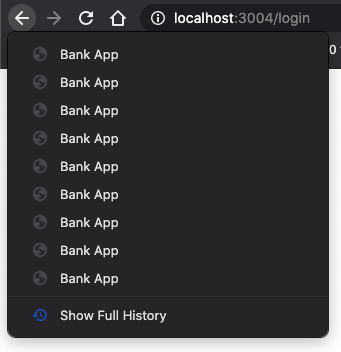

# Bina Aplikasi Perbankan Bahagian 1: Templat dan Laluan HTML dalam Aplikasi Web

## Kuiz Pra Kuliah

[Kuiz Pra Kuliah](https://nice-beach-0fe9e9d0f.azurestaticapps.net/quiz/41)

### Arahan

Sejak munculnya JavaScript di penyemak imbas, laman web menjadi lebih interaktif dan kompleks daripada sebelumnya. Teknologi web kini biasa digunakan untuk membuat aplikasi berfungsi sepenuhnya yang langsung masuk ke penyemak imbas yang kita panggil [aplikasi web](https://en.wikipedia.org/wiki/Web_application). Oleh kerana aplikasi Web sangat interaktif, pengguna tidak mahu menunggu muat semula halaman penuh setiap kali tindakan dilakukan. Itulah sebabnya JavaScript digunakan untuk mengemas kini HTML secara langsung menggunakan DOM, untuk memberikan pengalaman pengguna yang lebih lancar.

Dalam pelajaran ini, kita akan meletakkan dasar untuk membuat aplikasi web bank, menggunakan templat HTML untuk membuat banyak layar yang dapat ditampilkan dan diperbarui tanpa harus memuat ulang seluruh halaman HTML.

### Prasyarat

Anda memerlukan pelayan web tempatan untuk menguji aplikasi web yang akan kami bina dalam pelajaran ini. Sekiranya tidak memilikinya, anda boleh memasang [Node.js](https://nodejs.org) dan menggunakan arahan `npx lite-server` dari folder projek anda. Ini akan membuat pelayan web tempatan dan membuka aplikasi anda di penyemak imbas.

### Penyediaan

Di komputer anda, buat folder bernama `bank` dengan fail bernama `index.html` di dalamnya. Kami akan bermula dari HTML [boilerplate](https://en.wikipedia.org/wiki/Boilerplate_code):

```html
<!DOCTYPE html>
<html lang="en">
  <head>
    <meta charset="UTF-8">
    <meta name="viewport" content="width=device-width, initial-scale=1.0">
    <title>Bank App</title>
  </head>
  <body>
    <!-- This is where you'll work -->
  </body>
</html>
```

---

## Templat HTML

Jika anda ingin membuat beberapa layar untuk halaman web, satu penyelesaiannya adalah dengan membuat satu file HTML untuk setiap layar yang ingin anda tampilkan. Walau bagaimanapun, penyelesaian ini disertakan dengan beberapa kesulitan:

- Anda harus memuat semula keseluruhan HTML ketika menukar skrin, yang boleh menjadi lambat.
- Sukar untuk berkongsi data antara skrin yang berbeza.

Pendekatan lain hanya mempunyai satu fail HTML, dan menentukan beberapa [templat HTML](https://developer.mozilla.org/docs/Web/HTML/Element/template) menggunakan elemen `<template>`. Templat adalah blok HTML yang dapat digunakan kembali yang tidak ditampilkan oleh penyemak imbas, dan perlu dibuat pada waktu berjalan menggunakan JavaScript.

### Tugas

Kami akan membuat aplikasi bank dengan dua skrin: halaman log masuk dan papan pemuka. Pertama, mari kita tambahkan elemen penanda tempat pada badan HTML yang akan kita gunakan untuk menunjukkan pelbagai skrin aplikasi kita:

```html
<div id="app">Loading...</div>
```

Kami memberikannya `id` untuk memudahkan pencarian dengan JavaScript kemudian.

> Petua: kerana kandungan elemen ini akan diganti, kita dapat memasukkan pesan pemuatan atau penunjuk yang akan ditunjukkan semasa aplikasi dimuat.

Seterusnya, mari kita tambahkan di bawah templat HTML untuk halaman log masuk. Buat masa ini kami hanya akan memasukkan tajuk dan bahagian yang mengandungi pautan yang akan kami gunakan untuk melakukan navigasi.

```html
<template id="login">
  <h1>Bank App</h1>
  <section>
    <a href="/dashboard">Login</a>
  </section>
</template>
```

Kemudian kami akan menambahkan templat HTML lain untuk halaman papan pemuka. Halaman ini akan mengandungi bahagian yang berbeza:

- Tajuk dengan tajuk dan pautan log keluar
- Baki semasa akaun bank
- Senarai urus niaga, ditunjukkan dalam jadual

```html
<template id="dashboard">
  <header>
    <h1>Bank App</h1>
    <a href="/login">Logout</a>
  </header>
  <section>
    Balance: 100$
  </section>
  <section>
    <h2>Transactions</h2>
    <table>
      <thead>
        <tr>
          <th>Date</th>
          <th>Object</th>
          <th>Amount</th>
        </tr>
      </thead>
      <tbody></tbody>
    </table>
  </section>
</template>
```

> Petua: semasa membuat templat HTML, jika anda ingin melihat seperti apa, anda boleh memberi komen baris `<template>` `dan` `</template>` dengan melampirkannya dengan `<! - -> ` .

✅ Menurut anda mengapa kami menggunakan atribut `id` pada templat? Bolehkah kita menggunakan sesuatu yang lain seperti kelas?

## Memaparkan templat dengan JavaScript

Sekiranya anda mencuba fail HTML semasa anda dalam penyemak imbas, anda akan melihat fail tersebut macet memaparkan `Memuat ... '. Itu kerana kita perlu menambahkan beberapa kod JavaScript untuk memberi contoh dan memaparkan templat HTML.

Membuat templat biasanya dilakukan dalam 3 langkah:

1. Dapatkan semula elemen templat di DOM, misalnya menggunakan [`document.getElementById`](https://developer.mozilla.org/docs/Web/API/Document/getElementById).
2. Klon elemen templat, menggunakan [`cloneNode`](https://developer.mozilla.org/docs/Web/API/Node/cloneNode).
3. Lampirkan ke DOM di bawah elemen yang kelihatan, misalnya menggunakan [`appendChild`](https://developer.mozilla.org/docs/Web/API/Node/appendChild).

✅ Mengapa kita perlu mengklon templat sebelum melampirkannya ke DOM? Apa yang anda fikir akan berlaku sekiranya kita melangkau langkah ini?

### Tugas

Buat fail baru bernama `app.js` di folder projek anda dan import fail itu di bahagian `<head>` HTML anda:

```html
<script src="app.js" defer></script>
```

Sekarang di `app.js`, kami akan membuat fungsi baru `updateRoute`:

```js
function updateRoute(templateId) {
  const template = document.getElementById(templateId);
  const view = template.content.cloneNode(true);
  const app = document.getElementById('app');
  app.innerHTML = '';
  app.appendChild(view);
}
```

Apa yang kami lakukan di sini adalah tepat 3 langkah yang dinyatakan di atas. Kami membuat templat dengan id `templateId`, dan memasukkan kandungan klonnya ke dalam ruang letak aplikasi kami. Perhatikan bahawa kita perlu menggunakan `cloneNode(true)` untuk menyalin keseluruhan subtree templat.

Sekarang panggil fungsi ini dengan salah satu templat dan lihat hasilnya.

```js
updateRoute('login');
```

✅ Apa tujuan kod ini `app.innerHTML = '';`? Apa yang berlaku tanpanya?

## Membuat laluan

Ketika berbicara tentang aplikasi web, kami memanggil *Routing* niat untuk memetakan **URL** ke layar tertentu yang harus ditampilkan. Di laman web dengan banyak fail HTML, ini dilakukan secara automatik kerana jalur fail ditunjukkan pada URL. Contohnya, dengan fail ini dalam folder projek anda:

```
mywebsite/index.html
mywebsite/login.html
mywebsite/admin/index.html
```

Sekiranya anda membuat pelayan web dengan `mywebsite` sebagai root, pemetaan URL akan:

```
https://site.com            --> mywebsite/index.html
https://site.com/login.html --> mywebsite/login.html
https://site.com/admin/     --> mywebsite/admin/index.html
```

Walau bagaimanapun, untuk aplikasi web kami menggunakan satu fail HTML yang mengandungi semua skrin sehingga tingkah laku lalai ini tidak akan membantu kami. Kita harus membuat peta ini secara manual dan melakukan kemas kini templat yang dipaparkan menggunakan JavaScript.

### Tugas

Kami akan menggunakan objek sederhana untuk melaksanakan [peta](https://en.wikipedia.org/wiki/Associative_array) antara jalur URL dan templat kami. Tambahkan objek ini di bahagian atas fail `app.js` anda.

```js
const routes = {
  '/login': { templateId: 'login' },
  '/dashboard': { templateId: 'dashboard' },
};
```

Sekarang mari kita ubah sedikit fungsi `updateRoute`. Daripada meneruskan secara langsung `templateId` sebagai argumen, kami ingin mendapatkannya dengan terlebih dahulu melihat URL semasa, dan kemudian menggunakan peta kami untuk mendapatkan nilai ID templat yang sesuai. Kita boleh menggunakan [`window.location.pathname`](https://developer.mozilla.org/docs/Web/API/Location/pathname) untuk mendapatkan hanya bahagian jalan dari URL.

```js
function updateRoute() {
  const path = window.location.pathname;
  const route = routes[path];

  const template = document.getElementById(route.templateId);
  const view = template.content.cloneNode(true);
  const app = document.getElementById('app');
  app.innerHTML = '';
  app.appendChild(view);
}
```

Di sini kami memetakan laluan yang kami nyatakan ke templat yang sesuai. Anda boleh mencubanya agar berfungsi dengan betul dengan menukar URL secara manual di penyemak imbas anda.

✅ Apa yang berlaku jika anda memasukkan jalan yang tidak diketahui dalam URL? Bagaimana kita dapat menyelesaikannya?

## Tambahkan navigasi

Langkah seterusnya untuk aplikasi kita adalah menambahkan kemungkinan untuk menavigasi antara halaman tanpa perlu mengubah URL secara manual. Ini menunjukkan dua perkara:

  1. Mengemas kini URL semasa
  2. Mengemas kini templat yang dipaparkan berdasarkan URL baru

Kami sudah mengurus bahagian kedua dengan fungsi `updateRoute`, jadi kami harus memikirkan cara mengemas kini URL semasa.

Kita mesti menggunakan JavaScript dan lebih khusus lagi [`history.pushState`](https://developer.mozilla.org/docs/Web/API/History/pushState) yang memungkinkan untuk mengemas kini URL dan buat entri baru dalam sejarah penyemakan imbas, tanpa memuatkan semula HTML.

> Catatan: Walaupun elemen anchor HTML [`<a href>`](https://developer.mozilla.org/docs/Web/HTML/Element/a) dapat digunakan sendiri untuk membuat hyperlink ke URL yang berbeza, ini akan menjadikan penyemak imbas memuat semula HTML secara lalai. Adalah perlu untuk mencegah tingkah laku ini ketika menangani routing dengan javascript khusus, menggunakan fungsi preventDefault () pada peristiwa klik.

### Tugas

Mari buat fungsi baru yang dapat kita gunakan untuk menavigasi di aplikasi kita:

```js
function navigate(path) {
  window.history.pushState({}, path, window.location.origin + path);
  updateRoute();
}
```

Kaedah ini terlebih dahulu mengemas kini URL semasa berdasarkan jalan yang diberikan, kemudian mengemas kini templat. Properti `window.location.origin` mengembalikan akar URL, yang membolehkan kami membina semula URL lengkap dari jalan yang ditentukan.

Sekarang kita mempunyai fungsi ini, kita dapat mengatasi masalah yang kita ada jika jalan tidak sesuai dengan rute yang ditentukan. Kami akan mengubah fungsi `updateRoute` dengan menambahkan fallback ke salah satu laluan yang ada jika kami tidak dapat mencari yang sesuai.

```js
function updateRoute() {
  const path = window.location.pathname;
  const route = routes[path];

  if (!route) {
    return navigate('/login');
  }

  ...
```

Sekiranya laluan tidak dapat dijumpai, kami sekarang akan mengalihkan ke halaman `login`.

Sekarang mari kita buat fungsi untuk mendapatkan URL apabila pautan diklik, dan untuk mengelakkan tingkah laku pautan lalai penyemak imbas:

```js
function onLinkClick(event) {
  event.preventDefault();
  navigate(event.target.href);
}
```

Mari lengkapkan sistem navigasi dengan menambahkan pengikatan pada pautan *Login* dan *Logout* kami dalam HTML.

```html
<a href="/dashboard" onclick="onLinkClick()">Login</a>
...
<a href="/login" onclick="onLinkClick()">Logout</a>
```

Menggunakan atribut [`onclick`](https://developer.mozilla.org/docs/Web/API/GlobalEventHandlers/onclick) mengikat peristiwa`klik` ke kod JavaScript, di sini panggilan ke `navigasi() `fungsi.

Cuba klik pada pautan-pautan ini, kini anda seharusnya dapat menavigasi antara pelbagai skrin aplikasi anda.

✅ Kaedah `history.pushState` adalah sebahagian daripada standard HTML5 dan dilaksanakan di [semua penyemak imbas moden](https://caniuse.com/?search=pushState). Sekiranya anda membuat aplikasi web untuk penyemak imbas yang lebih lama, ada helah yang dapat Anda gunakan sebagai ganti API ini: menggunakan [hash (`#`)](https://en.wikipedia.org/wiki/URI_fragment) sebelum jalan yang dapat anda laksanakan perutean yang berfungsi dengan navigasi jangkar biasa dan tidak memuat semula halaman, kerana tujuannya adalah untuk membuat pautan dalaman dalam halaman.

## Mengendalikan butang belakang dan hadapan penyemak imbas

Menggunakan `history.pushState` membuat entri baru dalam sejarah navigasi penyemak imbas. Anda boleh memastikan bahawa dengan menahan * butang belakang * penyemak imbas anda, ia akan memaparkan sesuatu seperti ini:



Sekiranya anda cuba mengklik butang kembali beberapa kali, anda akan melihat bahawa URL semasa berubah dan sejarahnya dikemas kini, tetapi templat yang sama terus dipaparkan.

Ini kerana tidak tahu bahawa kita perlu memanggil `updateRoute()` setiap kali sejarah berubah. Sekiranya anda melihat dokumentasi [`history.pushState`](https://developer.mozilla.org/docs/Web/API/History/pushState), anda dapat melihat bahawa jika keadaan berubah - yang bermaksud bahawa kami berpindah ke URL yang berbeza - peristiwa [`popstate`](https://developer.mozilla.org/docs/Web/API/Window/popstate_event) dicetuskan. Kami akan menggunakannya untuk menyelesaikan masalah itu.

### Tugas

Untuk memastikan templat yang ditampilkan diperbaharui ketika sejarah penyemak imbas berubah, kami akan melampirkan fungsi baru yang memanggil `updateRoute ()`. Kami akan melakukannya di bahagian bawah fail `app.js` kami:

```js
window.onpopstate = () => updateRoute();
updateRoute();
```

> Catatan: kami menggunakan [fungsi panah](https://developer.mozilla.org/docs/Web/JavaScript/Reference/Functions/Arrow_functions) di sini untuk menyatakan pengendali acara `popstate` kami untuk kesimpulan, fungsi biasa akan berfungsi sama.

Berikut adalah video penyegaran mengenai fungsi anak panah:

[](https://youtube.com/watch?v=OP6eEbOj2sc "Fungsi Anak Panah")

> Klik gambar di atas untuk video mengenai fungsi anak panah.

Sekarang cuba gunakan butang belakang dan depan penyemak imbas anda, dan periksa bahawa laluan yang dipaparkan dikemas kini dengan betul kali ini.

---

## 🚀 Cabaran

Tambahkan templat dan laluan baru untuk halaman ketiga yang menunjukkan kredit untuk aplikasi ini.

## Kuiz Pasca Kuliah

[Kuiz Pasca Kuliah](https://nice-beach-0fe9e9d0f.azurestaticapps.net/quiz/42)

## Mengkaji & Belajar Sendiri

Perutean adalah salah satu bahagian pengembangan web yang sangat mengejutkan, terutama ketika web beralih dari tingkah laku penyegaran halaman ke penyegaran halaman Aplikasi Halaman Tunggal. Baca sedikit mengenai [bagaimana perkhidmatan Aplikasi Web Statik Azure](https://docs.microsoft.com/azure/static-web-apps/routes?WT.mc_id=academic-13441-cxa) menangani penghalaan . Bolehkah anda menjelaskan mengapa beberapa keputusan yang dijelaskan pada dokumen itu diperlukan?

## Tugasan

[Tingkatkan penghalaan](assignment.ms.md)