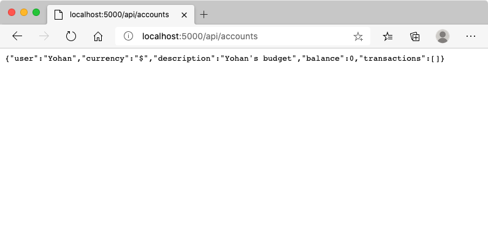

# Build a Banking App Part 2: Build a Login and Registration Form

## Pre-Lecture Quiz

[Pre-lecture quiz](https://happy-mud-02d95f10f.azurestaticapps.net/quiz/43)

### Introduction

In almost all modern web apps, you can create an account to have your own private space. As multiple users can access a web app at the same time, you need a mechanism to store each user personal data separately and select which information to display information. We won't cover how to manage [user identity securely](https://en.wikipedia.org/wiki/Authentication) as it's an extensive topic on its own, but we'll make sure each user is able to create one (or more) bank account on our app.

In this part we'll use HTML forms to add login and registration to our web app. We'll see how to send the data to a server API programmatically, and ultimately how to define basic validation rules for user inputs.

### Prerequisite

You need to have completed the [HTML templates and routing](../1-template-route/README.md) of the web app for this lesson. You also need to install [Node.js](https://nodejs.org) and [run the server API](../api/README.md) locally so you can send data to create accounts.

**Take note**
You will have two terminals running at the same time as listed below.
1. For the the main bank app we built in the [HTML templates and routing](../1-template-route/README.md) lesson
2. For the [Bank APP server API](../api/README.md) we just setup above.

You need two of the servers up and running to follow through with the rest of the lesson. They are listening on different ports(port `3000` and port `5000`) so everything should work just fine.

You can test that the server is running properly by executing this command in a terminal:

```sh
curl http://localhost:5000/api
# -> should return "Bank API v1.0.0" as a result
```

---

## Form and controls

The `<form>` element encapsulates a section of an HTML document where the user can input and submit data with interactive controls. There are all sorts of user interface (UI) controls that can be used within a form, the most common one being the `<input>` and the `<button>` elements.

There are a lot of different [types](https://developer.mozilla.org/docs/Web/HTML/Element/input) of `<input>`, for example to create a field where the user can enter its username you can use:

```html
<input id="username" name="username" type="text">
```

The `name` attribute will be used as the property name when the form data will be sent over. The `id` attribute is used to associate a `<label>` with the form control.

> Take a look at the whole list of [`<input>` types](https://developer.mozilla.org/docs/Web/HTML/Element/input) and [other form controls](https://developer.mozilla.org/docs/Learn/Forms/Other_form_controls) to get an idea of all the native UI elements you can use when building your UI.

✅ Note that `<input>` is an [empty element](https://developer.mozilla.org/docs/Glossary/Empty_element) on which you should *not* add a matching closing tag. You can however use the self-closing `<input/>` notation, but it's not required.

The `<button>` element within a form is a bit special. If you do not specify its `type` attribute, it will automatically submit the form data to the server when pressed. Here are the possible `type` values:

- `submit`: The default within a `<form>`, the button triggers the form submit action.
- `reset`: The button resets all the form controls to their initial values.
- `button`: Do not assign a default behavior when the button is pressed. You can then assign custom actions to it using JavaScript.

### Task

Let's start by adding a form to the `login` template. We'll need a *username* field and a *Login* button.

```html
<template id="login">
  <h1>Bank App</h1>
  <section>
    <h2>Login</h2>
    <form id="loginForm">
      <label for="username">Username</label>
      <input id="username" name="user" type="text">
      <button>Login</button>
    </form>
  </section>
</template>
```

If you take a closer look, you can notice that we also added a `<label>` element here. `<label>` elements are used to add a name to UI controls, such as our username field. Labels are important for the readability of your forms, but also comes with additional benefits:

- By associating a label to a form control, it helps users using assistive technologies (like a screen reader) to understand what data they're expected to provide.
- You can click on the label to directly put focus on the associated input, making it easier to reach on touch-screen based devices.

> [Accessibility](https://developer.mozilla.org/docs/Learn/Accessibility/What_is_accessibility) on the web is a very important topic that's often overlooked. Thanks to [semantic HTML elements](https://developer.mozilla.org/docs/Learn/Accessibility/HTML) it's not difficult to create accessible content if you use them properly. You can [read more about accessibility](https://developer.mozilla.org/docs/Web/Accessibility) to avoid common mistakes and become a responsible developer.

Now we'll add a second form for the registration, just below the previous one:

```html
<hr/>
<h2>Register</h2>
<form id="registerForm">
  <label for="user">Username</label>
  <input id="user" name="user" type="text">
  <label for="currency">Currency</label>
  <input id="currency" name="currency" type="text" value="$">
  <label for="description">Description</label>
  <input id="description" name="description" type="text">
  <label for="balance">Current balance</label>
  <input id="balance" name="balance" type="number" value="0">
  <button>Register</button>
</form>
```

Using the `value` attribute we can define a default value for a given input.
Notice also that the input for `balance` has the `number` type. Does it look different than the other inputs? Try interacting with it.

✅ Can you navigate and interact with the forms using only a keyboard? How would you do that?

## Submitting data to the server

Now that we have a functional UI, the next step is to send the data over to our server. Let's make a quick test using our current code: what happens if you click on the *Login* or *Register* button?

Did you notice the change in your browser's URL section?


The default action for a `<form>` is to submit the form to the current server URL using the [GET method](https://www.w3.org/Protocols/rfc2616/rfc2616-sec9.html#sec9.3), appending the form data directly to the URL. This method has some shortcomings though:

- The data sent is very limited in size (about 2000 characters)
- The data is directly visible in the URL (not great for passwords)
- It does not work with file uploads

That's why you can change it to use the [POST method](https://www.w3.org/Protocols/rfc2616/rfc2616-sec9.html#sec9.5) which sends the form data to the server in the body of the HTTP request, without any of the previous limitations.

> While POST is the most commonly used method to send data over, [in some specific scenarios](https://www.w3.org/2001/tag/doc/whenToUseGet.html) it is preferable to use the GET method, when implementing a search field for example.

### Task

Add `action` and `method` properties to the registration form:

```html
<form id="registerForm" action="//localhost:5000/api/accounts" method="POST">
```

Now try to register a new account with your name. After clicking on the *Register* button you should see something like this:



If everything goes well, the server should answer your request with a [JSON](https://www.json.org/json-en.html) response containing the account data that was created.

✅ Try registering again with the same name. What happens?

## Submitting data without reloading the page

As you probably noticed, there's a slight issue with the approach we just used: when submitting the form, we get out of our app and the browser redirects to the server URL. We're trying to avoid all page reloads with our web app, as we're making a [Single-page application (SPA)](https://en.wikipedia.org/wiki/Single-page_application).

To send the form data to the server without forcing a page reload, we have to use JavaScript code. Instead of putting an URL in the `action` property of a `<form>` element, you can use any JavaScript code prepended by the `javascript:` string to perform a custom action. Using this also means that you'll have to implement some tasks that were previously done automatically by the browser:

- Retrieve the form data
- Convert and encode the form data to a suitable format
- Create the HTTP request and send it to the server

### Task

Replace the registration form `action` with:

```html
<form id="registerForm" action="javascript:register()">
```

Open `app.js` add a new function named `register`:

```js
function register() {
  const registerForm = document.getElementById('registerForm');
  const formData = new FormData(registerForm);
  const data = Object.fromEntries(formData);
  const jsonData = JSON.stringify(data);
}
```

Here we retrieve the form element using `getElementById()` and use the [`FormData`](https://developer.mozilla.org/docs/Web/API/FormData) helper to extract the values from form controls as a set of key/value pairs. Then we convert the data to a regular object using [`Object.fromEntries()`](https://developer.mozilla.org/docs/Web/JavaScript/Reference/Global_Objects/Object/fromEntries) and finally serialize the data to [JSON](https://www.json.org/json-en.html), a format commonly used for exchanging data on the web.

The data is now ready to be sent to the server. Create a new function named `createAccount`:

```js
async function createAccount(account) {
  try {
    const response = await fetch('//localhost:5000/api/accounts', {
      method: 'POST',
      headers: { 'Content-Type': 'application/json' },
      body: account
    });
    return await response.json();
  } catch (error) {
    return { error: error.message || 'Unknown error' };
  }
}
```

What's this function doing? First, notice the `async` keyword here. This means that the function contains code that will execute [**asynchronously**](https://developer.mozilla.org/docs/Web/JavaScript/Reference/Statements/async_function). When used along the `await` keyword, it allows waiting for asynchronous code to execute - like waiting for the server response here - before continuing.

Here's a quick video about `async/await` usage:

[](https://youtube.com/watch?v=YwmlRkrxvkk "Async and Await for managing promises")

> 🎥 Click the image above for a video about async/await.

We use the `fetch()` API to send JSON data to the server. This method takes 2 parameters:

- The URL of the server, so we put back `//localhost:5000/api/accounts` here.
- The settings of the request. That's where we set the method to `POST` and provide the `body` for the request. As we're sending JSON data to the server, we also need to set the `Content-Type` header to `application/json` so the server know how to interpret the content.

As the server will respond to the request with JSON, we can use `await response.json()` to parse the JSON content and return the resulting object. Note that this method is asynchronous, so we use the `await` keyword here before returning to make sure any errors during parsing are also caught.

Now add some code to the `register` function to call `createAccount()`:

```js
const result = await createAccount(jsonData);
```

Because we use the `await` keyword here, we need to add the `async` keyword before the register function:

```js
async function register() {
```

Finally, let's add some logs to check the result. The final function should look like this:

```js
async function register() {
  const registerForm = document.getElementById('registerForm');
  const formData = new FormData(registerForm);
  const jsonData = JSON.stringify(Object.fromEntries(formData));
  const result = await createAccount(jsonData);

  if (result.error) {
    return console.log('An error occurred:', result.error);
  }

  console.log('Account created!', result);
}
```

That was a bit long but we got there! If you open your [browser developer tools](https://developer.mozilla.org/docs/Learn/Common_questions/What_are_browser_developer_tools), and try registering a new account, you should not see any change on the web page but a message will appear in the console confirming that everything works.


✅ Do you think the data is sent to the server securely? What if someone what was able to intercept the request? You can read about [HTTPS](https://en.wikipedia.org/wiki/HTTPS) to know more about secure data communication.

## Data validation

If you try to register a new account without setting an username first, you can see that the server returns an error with status code [400 (Bad Request)](https://developer.mozilla.org/docs/Web/HTTP/Status/400#:~:text=The%20HyperText%20Transfer%20Protocol%20(HTTP,%2C%20or%20deceptive%20request%20routing).).

Before sending data to a server it's a good practice to [validate the form data](https://developer.mozilla.org/docs/Learn/Forms/Form_validation) beforehand when possible, to make sure you send a valid request. HTML5 forms controls provides built-in validation using various attributes:

- `required`: the field needs to be filled otherwise the form cannot be submitted.
- `minlength` and `maxlength`: defines the minimum and maximum number of characters in text fields.
- `min` and `max`: defines the minimum and maximum value of a numerical field.
- `type`: defines the kind of data expected, like `number`, `email`, `file` or [other built-in types](https://developer.mozilla.org/docs/Web/HTML/Element/input). This attribute may also change the visual rendering of the form control.
- `pattern`: allows to define a [regular expression](https://developer.mozilla.org/docs/Web/JavaScript/Guide/Regular_Expressions) pattern to test if the entered data is valid or not.

> Tip: you can customize the look of your form controls depending if they're valid or not using the `:valid` and `:invalid` CSS pseudo-classes.

### Task

There are 2 required fields to create a valid new account, the username and currency, the other fields being optional. Update the form's HTML, using both the `required` attribute and text in the field's label to that:

```html
<label for="user">Username (required)</label>
<input id="user" name="user" type="text" required>
...
<label for="currency">Currency (required)</label>
<input id="currency" name="currency" type="text" value="$" required>
```

While this particular server implementation does not enforce specific limits on the fields maximum length, it's always a good practice to define reasonable limits for any user text entry.

Add a `maxlength` attribute to the text fields:

```html
<input id="user" name="user" type="text" maxlength="20" required>
...
<input id="currency" name="currency" type="text" value="$" maxlength="5" required>
...
<input id="description" name="description" type="text" maxlength="100">
```

Now if you press the *Register* button and a field does not respect a validation rule we defined, you should see something like this:


Validation like this performed *before* sending any data to the server is called **client-side** validation. But note that's it's not always possible to perform all checks without sending the data. For example, we cannot check here if an account already exists with the same username without sending a request to the server. Additional validation performed on the server is called **server-side** validation.

Usually both need to be implemented, and while using client-side validation improves the user experience by providing instant feedback to the user, server-side validation is crucial to make sure the user data you manipulate is sound and safe.

---

## 🚀 Challenge

Show an error message in the HTML if the user already exists.

Here's an example of what the final login page can look like after a bit of styling:


## Post-Lecture Quiz

[Post-lecture quiz](https://happy-mud-02d95f10f.azurestaticapps.net/quiz/44)

## Review & Self Study

Developers have gotten very creative about their form building efforts, especially regarding validation strategies. Learn about different form flows by looking through [CodePen](https://codepen.com); can you find some interesting and inspiring forms?

## Assignment

[Style your bank app](assignment.md)
