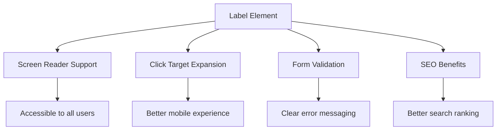
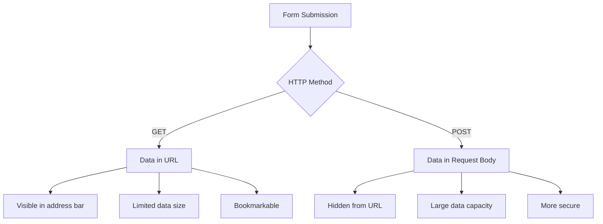
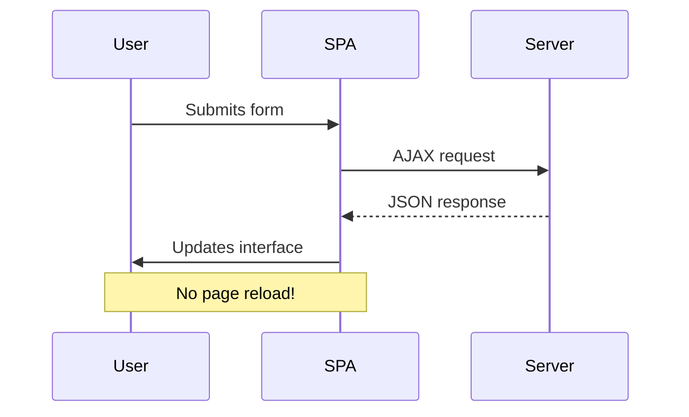
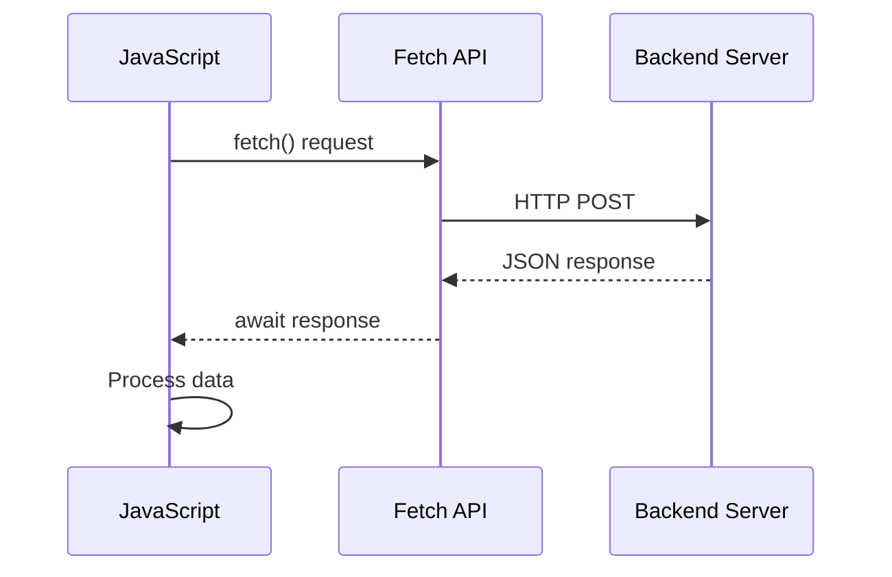
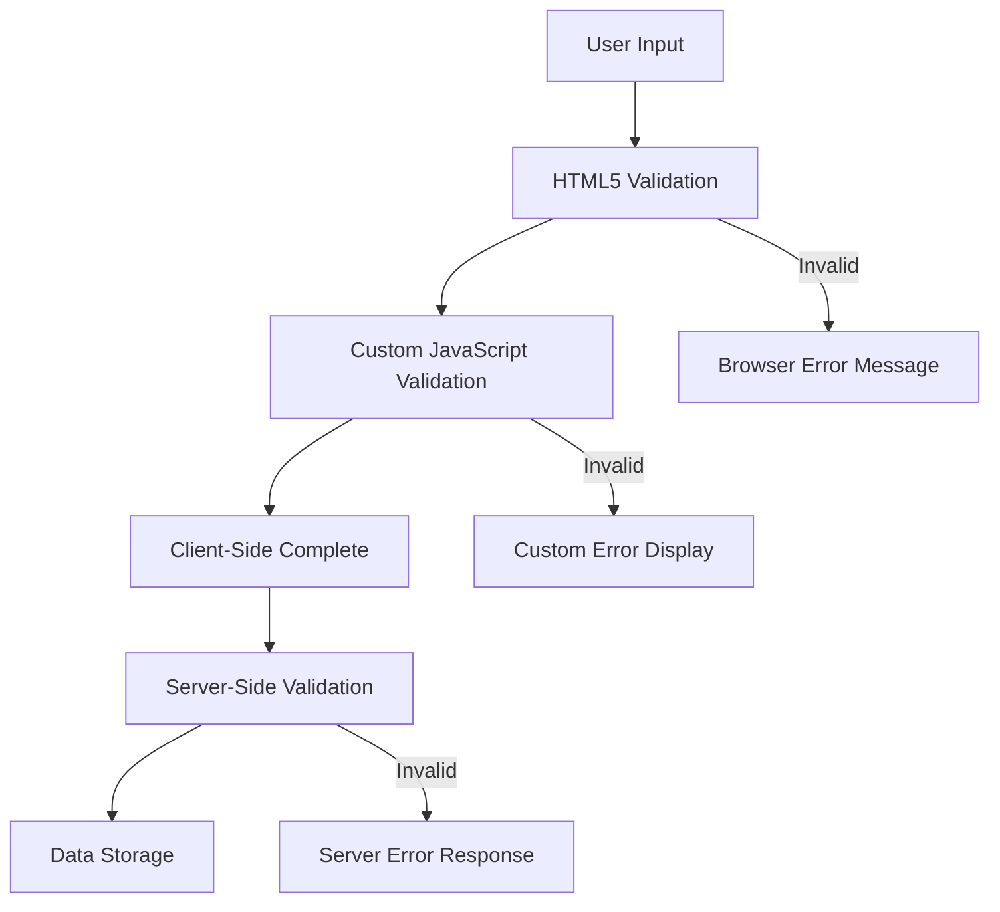
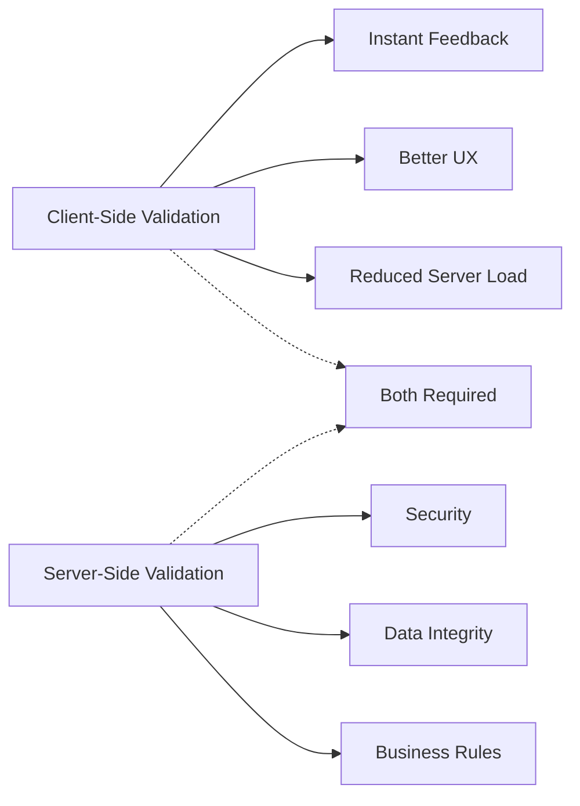

# Build a Banking App Part 2: Build a Login and Registration Form

## Pre-Lecture Quiz

[Pre-lecture quiz](https://ff-quizzes.netlify.app/web/quiz/43)

Ever filled out a form online and had it yell at you for entering your email wrong? Or worse, had it completely lose all your information when you clicked submit? Yeah, we've all been there, and it's pretty frustrating.

Forms might seem simple on the surface, but they're actually the bridge between your users and everything your app can do. When done right, they feel smooth and helpful. When done wrong... well, let's just say users won't stick around long.

In this lesson, we're going to take your static banking app and give it some real functionality. Users will be able to create accounts, log in, and actually interact with the app instead of just looking at it. You'll learn how to build forms that are smart enough to catch mistakes before they happen and communicate with a server to save user data.

By the time we're done, you'll have a proper login and registration system that actually works – complete with validation that helps users instead of frustrating them. Ready to make your app come alive?

## Prerequisites

Before we start building forms, let's make sure you've got everything set up correctly. This lesson picks up right where we left off in the previous one, so if you skipped ahead, you might want to go back and get the basics working first.

### Required Setup

| Component | Status | Description |
|-----------|--------|-------------|
| [HTML Templates](../1-template-route/README.md) | ✅ Required | Your basic banking app structure |
| [Node.js](https://nodejs.org) | ✅ Required | JavaScript runtime for the server |
| [Bank API Server](../api/README.md) | ✅ Required | Backend service for data storage |

> 💡 **Development Tip**: You'll be running two separate servers simultaneously – one for your front-end banking app and another for the backend API. This setup mirrors real-world development where frontend and backend services operate independently.

### Server Configuration

**Your development environment will include:**
- **Frontend server**: Serves your banking app (typically port `3000`)
- **Backend API server**: Handles data storage and retrieval (port `5000`)
- **Both servers** can run simultaneously without conflicts

**Testing your API connection:**
```bash
curl http://localhost:5000/api
# Expected response: "Bank API v1.0.0"
```

**If you see the API version response, you're ready to proceed!**

---

## Understanding HTML Forms and Controls

HTML forms are basically how users talk to your web app. They're the digital equivalent of filling out paperwork, except way more powerful. When built well, they can catch typos, guide users toward the right format, and even provide helpful suggestions.

These days, forms are a lot smarter than just basic text boxes. HTML5 gave us some pretty neat input types that automatically handle things like email validation and number formatting. Plus, they work better with screen readers and mobile devices right out of the box.

### Essential Form Elements

**Building blocks every form needs:**

```html
<!-- Basic form structure -->
<form id="userForm" method="POST">
  <label for="username">Username</label>
  <input id="username" name="username" type="text" required>
  
  <button type="submit">Submit</button>
</form>
```

**Here's what this code does:**
- **Creates** a form container with a unique identifier
- **Specifies** the HTTP method for data submission
- **Associates** labels with inputs for accessibility
- **Defines** a submit button to process the form

### Modern Input Types and Attributes

| Input Type | Purpose | Example Usage |
|------------|---------|---------------|
| `text` | General text input | `<input type="text" name="username">` |
| `email` | Email validation | `<input type="email" name="email">` |
| `password` | Hidden text entry | `<input type="password" name="password">` |
| `number` | Numeric input | `<input type="number" name="balance" min="0">` |
| `tel` | Phone numbers | `<input type="tel" name="phone">` |

> 💡 **Modern HTML5 Advantage**: Using specific input types provides automatic validation, appropriate mobile keyboards, and better accessibility support without additional JavaScript!

### Button Types and Behavior

```html
<!-- Different button behaviors -->
<button type="submit">Save Data</button>     <!-- Submits the form -->
<button type="reset">Clear Form</button>    <!-- Resets all fields -->
<button type="button">Custom Action</button> <!-- No default behavior -->
```

**Here's what each button type does:**
- **Submit buttons**: These actually send your form data somewhere (usually a server)
- **Reset buttons**: Hit this and poof – everything goes back to how it was when the page loaded
- **Regular buttons**: These don't do anything special unless you write JavaScript to make them useful

> ⚠️ **Important Note**: The `<input>` element is self-closing and doesn't require a closing tag. Modern best practice is to write `<input>` without the slash.

### Building Your Login Form

Now let's create a practical login form that demonstrates modern HTML form practices. We'll start with a basic structure and gradually enhance it with accessibility features and validation.

```html
<template id="login">
  <h1>Bank App</h1>
  <section>
    <h2>Login</h2>
    <form id="loginForm" novalidate>
      <div class="form-group">
        <label for="username">Username</label>
        <input id="username" name="user" type="text" required 
               autocomplete="username" placeholder="Enter your username">
      </div>
      <button type="submit">Login</button>
    </form>
  </section>
</template>
```

**Breaking down what happens here:**
- **Structures** the form with semantic HTML5 elements
- **Groups** related elements using `div` containers with meaningful classes
- **Associates** labels with inputs using the `for` and `id` attributes
- **Includes** modern attributes like `autocomplete` and `placeholder` for better UX
- **Adds** `novalidate` to handle validation with JavaScript instead of browser defaults

### The Power of Proper Labels

**Why labels matter for modern web development:**



**What proper labels accomplish:**
- **Enables** screen readers to announce form fields clearly
- **Expands** the clickable area (clicking the label focuses the input)
- **Improves** mobile usability with larger touch targets
- **Supports** form validation with meaningful error messages
- **Enhances** SEO by providing semantic meaning to form elements

> 🎯 **Accessibility Goal**: Every form input should have an associated label. This simple practice makes your forms usable by everyone, including users with disabilities, and improves the experience for all users.

### Creating the Registration Form

The registration form requires more detailed information to create a complete user account. Let's build it with modern HTML5 features and enhanced accessibility.

```html
<hr/>
<h2>Register</h2>
<form id="registerForm" novalidate>
  <div class="form-group">
    <label for="user">Username</label>
    <input id="user" name="user" type="text" required 
           autocomplete="username" placeholder="Choose a username">
  </div>
  
  <div class="form-group">
    <label for="currency">Currency</label>
    <input id="currency" name="currency" type="text" value="$" 
           required maxlength="3" placeholder="USD, EUR, etc.">
  </div>
  
  <div class="form-group">
    <label for="description">Account Description</label>
    <input id="description" name="description" type="text" 
           maxlength="100" placeholder="Personal savings, checking, etc.">
  </div>
  
  <div class="form-group">
    <label for="balance">Starting Balance</label>
    <input id="balance" name="balance" type="number" value="0" 
           min="0" step="0.01" placeholder="0.00">
  </div>
  
  <button type="submit">Create Account</button>
</form>
```

**In the above, we've:**
- **Organized** each field in container divs for better styling and layout
- **Added** appropriate `autocomplete` attributes for browser autofill support
- **Included** helpful placeholder text to guide user input
- **Set** sensible defaults using the `value` attribute
- **Applied** validation attributes like `required`, `maxlength`, and `min`
- **Used** `type="number"` for the balance field with decimal support

### Exploring Input Types and Behavior

**Modern input types provide enhanced functionality:**

| Feature | Benefit | Example |
|---------|---------|----------|
| `type="number"` | Numeric keypad on mobile | Easier balance entry |
| `step="0.01"` | Decimal precision control | Allows cents in currency |
| `autocomplete` | Browser autofill | Faster form completion |
| `placeholder` | Contextual hints | Guides user expectations |

> 🎯 **Accessibility Challenge**: Try navigating the forms using only your keyboard! Use `Tab` to move between fields, `Space` to check boxes, and `Enter` to submit. This experience helps you understand how screen reader users interact with your forms.

## Understanding Form Submission Methods

When someone fills out your form and hits submit, that data needs to go somewhere – usually to a server that can save it. There are a couple of different ways this can happen, and knowing which one to use can save you from some headaches later.

Let's take a look at what actually happens when someone clicks that submit button.

### Default Form Behavior

First, let's observe what happens with basic form submission:

**Test your current forms:**
1. Click the *Register* button in your form
2. Observe the changes in your browser's address bar
3. Notice how the page reloads and data appears in the URL


### HTTP Methods Comparison



**Understanding the differences:**

| Method | Use Case | Data Location | Security Level | Size Limit |
|--------|----------|---------------|----------------|-------------|
| `GET` | Search queries, filters | URL parameters | Low (visible) | ~2000 characters |
| `POST` | User accounts, sensitive data | Request body | Higher (hidden) | No practical limit |

**Here's the basic difference:**
- **GET**: Sticks your form data right in the URL for everyone to see (useful for search forms)
- **POST**: Hides the data in the request body (much better for passwords and personal info)
- **GET downsides**: Limited space, everything shows up in the address bar, gets saved in browser history
- **POST benefits**: Can handle large amounts of data, keeps sensitive info private, supports file uploads

> 💡 **Best Practice**: Use `GET` for search forms and filters (data retrieval), use `POST` for user registration, login, and data creation.

### Configuring Form Submission

Let's configure your registration form to communicate properly with the backend API using the POST method:

```html
<form id="registerForm" action="//localhost:5000/api/accounts" 
      method="POST" novalidate>
```

**Here's what this configuration does:**
- **Directs** form submission to your API endpoint
- **Uses** POST method for secure data transmission
- **Includes** `novalidate` to handle validation with JavaScript

### Testing Form Submission

**Follow these steps to test your form:**
1. **Fill out** the registration form with your information
2. **Click** the "Create Account" button
3. **Observe** the server response in your browser


**What you should see:**
- **Browser redirects** to the API endpoint URL
- **JSON response** containing your newly created account data
- **Server confirmation** that the account was successfully created

> 🧪 **Experiment Time**: Try registering again with the same username. What response do you get? This helps you understand how the server handles duplicate data and error conditions.

### Understanding JSON Responses

**When the server processes your form successfully:**
```json
{
  "user": "john_doe",
  "currency": "$",
  "description": "Personal savings",
  "balance": 100,
  "id": "unique_account_id"
}
```

**This response confirms:**
- **Creates** a new account with your specified data
- **Assigns** a unique identifier for future reference
- **Returns** all account information for verification
- **Indicates** successful database storage

## Modern Form Handling with JavaScript

Remember how we talked about avoiding those jarring page reloads? Well, that applies to forms too. When someone submits a form in a traditional website, the whole page refreshes and you lose your place. Not exactly smooth.

With JavaScript, we can intercept that form submission and handle everything behind the scenes. Users stay right where they are, we can show loading spinners, display error messages nicely, and update the page based on what the server tells us. Much better experience all around.

### Why Avoid Page Reloads?



**Benefits of JavaScript form handling:**
- **Maintains** application state and user context
- **Provides** instant feedback and loading indicators
- **Enables** dynamic error handling and validation
- **Creates** smooth, app-like user experiences
- **Allows** conditional logic based on server responses

### Transitioning from Traditional to Modern Forms

**Traditional approach challenges:**
- **Redirects** users away from your application
- **Loses** current application state and context
- **Requires** full page reloads for simple operations
- **Provides** limited control over user feedback

**Modern JavaScript approach advantages:**
- **Keeps** users within your application
- **Maintains** all application state and data
- **Enables** real-time validation and feedback
- **Supports** progressive enhancement and accessibility

### Implementing JavaScript Form Handling

Let's replace the traditional form submission with modern JavaScript event handling:

```html
<!-- Remove the action attribute and add event handling -->
<form id="registerForm" method="POST" novalidate>
```

**Add the registration logic to your `app.js` file:**

```javascript
// Modern event-driven form handling
function register() {
  const registerForm = document.getElementById('registerForm');
  const formData = new FormData(registerForm);
  const data = Object.fromEntries(formData);
  const jsonData = JSON.stringify(data);
  
  console.log('Form data prepared:', data);
}

// Attach event listener when the page loads
document.addEventListener('DOMContentLoaded', () => {
  const registerForm = document.getElementById('registerForm');
  registerForm.addEventListener('submit', (event) => {
    event.preventDefault(); // Prevent default form submission
    register();
  });
});
```

**Breaking down what happens here:**
- **Prevents** default form submission using `event.preventDefault()`
- **Retrieves** the form element using modern DOM selection
- **Extracts** form data using the powerful `FormData` API
- **Converts** FormData to a plain object with `Object.fromEntries()`
- **Serializes** the data to JSON format for server communication
- **Logs** the processed data for debugging and verification

### Understanding the FormData API

**The FormData API provides powerful form handling:**

```javascript
// Example of what FormData captures
const formData = new FormData(registerForm);

// FormData automatically captures:
// {
//   "user": "john_doe",
//   "currency": "$", 
//   "description": "Personal account",
//   "balance": "100"
// }
```

**Why the FormData API is pretty awesome:**
- **Grabs everything**: Text fields, checkboxes, file uploads – it doesn't miss anything
- **Smart handling**: Knows how to deal with different input types without you having to code each one
- **Less work**: Instead of manually collecting each field's value, FormData does it all at once
- **Flexible**: Works great even if you add or remove form fields later

### Creating the Server Communication Function

Now let's build a robust function to communicate with your API server using modern JavaScript patterns:

```javascript
async function createAccount(account) {
  try {
    const response = await fetch('//localhost:5000/api/accounts', {
      method: 'POST',
      headers: { 
        'Content-Type': 'application/json',
        'Accept': 'application/json'
      },
      body: account
    });
    
    // Check if the response was successful
    if (!response.ok) {
      throw new Error(`HTTP error! status: ${response.status}`);
    }
    
    return await response.json();
  } catch (error) {
    console.error('Account creation failed:', error);
    return { error: error.message || 'Network error occurred' };
  }
}
```

**Understanding asynchronous JavaScript:**



**What this modern implementation accomplishes:**
- **Uses** `async/await` for readable asynchronous code
- **Includes** proper error handling with try/catch blocks
- **Checks** response status before processing data
- **Sets** appropriate headers for JSON communication
- **Provides** detailed error messages for debugging
- **Returns** consistent data structure for success and error cases

### The Power of Modern Fetch API

**Fetch API advantages over older methods:**

| Feature | Benefit | Implementation |
|---------|---------|----------------|
| Promise-based | Clean async code | `await fetch()` |
| Request customization | Full HTTP control | Headers, methods, body |
| Response handling | Flexible data parsing | `.json()`, `.text()`, `.blob()` |
| Error handling | Comprehensive error catching | Try/catch blocks |

> 🎥 **Learn More**: [Async/Await Tutorial](https://youtube.com/watch?v=YwmlRkrxvkk) - Understanding asynchronous JavaScript patterns for modern web development.

**Key concepts for server communication:**
- **Async functions** allow pausing execution to wait for server responses
- **Await keyword** makes asynchronous code read like synchronous code
- **Fetch API** provides modern, promise-based HTTP requests
- **Error handling** ensures your app responds gracefully to network issues

### Completing the Registration Function

Let's bring everything together with a complete, production-ready registration function:

```javascript
async function register() {
  const registerForm = document.getElementById('registerForm');
  const submitButton = registerForm.querySelector('button[type="submit"]');
  
  try {
    // Show loading state
    submitButton.disabled = true;
    submitButton.textContent = 'Creating Account...';
    
    // Process form data
    const formData = new FormData(registerForm);
    const jsonData = JSON.stringify(Object.fromEntries(formData));
    
    // Send to server
    const result = await createAccount(jsonData);
    
    if (result.error) {
      console.error('Registration failed:', result.error);
      alert(`Registration failed: ${result.error}`);
      return;
    }
    
    console.log('Account created successfully!', result);
    alert(`Welcome, ${result.user}! Your account has been created.`);
    
    // Reset form after successful registration
    registerForm.reset();
    
  } catch (error) {
    console.error('Unexpected error:', error);
    alert('An unexpected error occurred. Please try again.');
  } finally {
    // Restore button state
    submitButton.disabled = false;
    submitButton.textContent = 'Create Account';
  }
}
```

**This enhanced implementation includes:**
- **Provides** visual feedback during form submission
- **Disables** the submit button to prevent duplicate submissions
- **Handles** both expected and unexpected errors gracefully
- **Shows** user-friendly success and error messages
- **Resets** the form after successful registration
- **Restores** UI state regardless of outcome

### Testing Your Implementation

**Open your browser developer tools and test the registration:**

1. **Open** the browser console (F12 → Console tab)
2. **Fill out** the registration form
3. **Click** "Create Account"
4. **Observe** the console messages and user feedback


**What you should see:**
- **Loading state** appears on the submit button
- **Console logs** show detailed information about the process
- **Success message** appears when account creation succeeds
- **Form resets** automatically after successful submission

> 🔒 **Security Consideration**: Currently, data travels over HTTP, which is not secure for production. In real applications, always use HTTPS to encrypt data transmission. Learn more about [HTTPS security](https://en.wikipedia.org/wiki/HTTPS) and why it's essential for protecting user data.

## Comprehensive Form Validation

Nobody likes filling out a form only to find out they did something wrong after hitting submit. Good validation catches problems early and helps users fix them before they get frustrated.

The best approach uses multiple layers – some basic checks happen right in the browser, more complex stuff gets handled by JavaScript, and the server does a final security check. This way, users get immediate feedback, but you're still protected if someone tries to send malicious data.

### Understanding Validation Layers



**Multi-layer validation strategy:**
- **HTML5 validation**: Immediate browser-based checks
- **JavaScript validation**: Custom logic and user experience
- **Server validation**: Final security and data integrity checks
- **Progressive enhancement**: Works even if JavaScript is disabled

### HTML5 Validation Attributes

**Modern validation tools at your disposal:**

| Attribute | Purpose | Example Usage | Browser Behavior |
|-----------|---------|---------------|------------------|
| `required` | Mandatory fields | `<input required>` | Prevents empty submission |
| `minlength`/`maxlength` | Text length limits | `<input maxlength="20">` | Enforces character limits |
| `min`/`max` | Numeric ranges | `<input min="0" max="1000">` | Validates number bounds |
| `pattern` | Custom regex rules | `<input pattern="[A-Za-z]+">` | Matches specific formats |
| `type` | Data type validation | `<input type="email">` | Format-specific validation |

### CSS Validation Styling

**Create visual feedback for validation states:**

```css
/* Valid input styling */
input:valid {
  border-color: #28a745;
  background-color: #f8fff9;
}

/* Invalid input styling */
input:invalid {
  border-color: #dc3545;
  background-color: #fff5f5;
}

/* Focus states for better accessibility */
input:focus:valid {
  box-shadow: 0 0 0 0.2rem rgba(40, 167, 69, 0.25);
}

input:focus:invalid {
  box-shadow: 0 0 0 0.2rem rgba(220, 53, 69, 0.25);
}
```

**What these styles accomplish:**
- **Green borders**: "You got it right!" 
- **Red borders**: "Something's not quite right here"
- **Focus highlights**: Shows users exactly where they are in the form
- **Consistent look**: Users learn what to expect across your whole app

> 💡 **Pro Tip**: Use the `:valid` and `:invalid` CSS pseudo-classes to provide immediate visual feedback as users type, creating a responsive and helpful interface.

### Implementing Comprehensive Validation

Let's enhance your registration form with robust validation that provides excellent user experience and data quality:

```html
<form id="registerForm" method="POST" novalidate>
  <div class="form-group">
    <label for="user">Username <span class="required">*</span></label>
    <input id="user" name="user" type="text" required 
           minlength="3" maxlength="20" 
           pattern="[a-zA-Z0-9_]+" 
           autocomplete="username"
           title="Username must be 3-20 characters, letters, numbers, and underscores only">
    <small class="form-text">Choose a unique username (3-20 characters)</small>
  </div>
  
  <div class="form-group">
    <label for="currency">Currency <span class="required">*</span></label>
    <input id="currency" name="currency" type="text" required 
           value="$" maxlength="3" 
           pattern="[A-Z$€£¥₹]+" 
           title="Enter a valid currency symbol or code">
    <small class="form-text">Currency symbol (e.g., $, €, £)</small>
  </div>
  
  <div class="form-group">
    <label for="description">Account Description</label>
    <input id="description" name="description" type="text" 
           maxlength="100" 
           placeholder="Personal savings, checking, etc.">
    <small class="form-text">Optional description (up to 100 characters)</small>
  </div>
  
  <div class="form-group">
    <label for="balance">Starting Balance</label>
    <input id="balance" name="balance" type="number" 
           value="0" min="0" step="0.01" 
           title="Enter a positive number for your starting balance">
    <small class="form-text">Initial account balance (minimum $0.00)</small>
  </div>
  
  <button type="submit">Create Account</button>
</form>
```

**Understanding the enhanced validation:**
- **Combines** required field indicators with helpful descriptions
- **Includes** `pattern` attributes for format validation
- **Provides** `title` attributes for accessibility and tooltips
- **Adds** helper text to guide user input
- **Uses** semantic HTML structure for better accessibility

### Advanced Validation Rules

**What each validation rule accomplishes:**

| Field | Validation Rules | User Benefit |
|-------|------------------|--------------|
| Username | `required`, `minlength="3"`, `maxlength="20"`, `pattern="[a-zA-Z0-9_]+"` | Ensures valid, unique identifiers |
| Currency | `required`, `maxlength="3"`, `pattern="[A-Z$€£¥₹]+"` | Accepts common currency symbols |
| Balance | `min="0"`, `step="0.01"`, `type="number"` | Prevents negative balances |
| Description | `maxlength="100"` | Reasonable length limits |

### Testing Validation Behavior

**Try these validation scenarios:**
1. **Submit** the form with empty required fields
2. **Enter** a username shorter than 3 characters
3. **Try** special characters in the username field
4. **Input** a negative balance amount


**What you'll observe:**
- **Browser displays** native validation messages
- **Styling changes** based on `:valid` and `:invalid` states
- **Form submission** is prevented until all validations pass
- **Focus automatically** moves to the first invalid field

### Client-Side vs Server-Side Validation



**Why you need both layers:**
- **Client-side validation**: Provides immediate feedback and improves user experience
- **Server-side validation**: Ensures security and handles complex business rules
- **Combined approach**: Creates robust, user-friendly, and secure applications
- **Progressive enhancement**: Works even when JavaScript is disabled

> 🛡️ **Security Reminder**: Never trust client-side validation alone! Malicious users can bypass client-side checks, so server-side validation is essential for security and data integrity.

---


---

## GitHub Copilot Agent Challenge 🚀

Use the Agent mode to complete the following challenge:

**Description:** Enhance the registration form with comprehensive client-side validation and user feedback. This challenge will help you practice form validation, error handling, and improving user experience with interactive feedback.

**Prompt:** Create a complete form validation system for the registration form that includes: 1) Real-time validation feedback for each field as the user types, 2) Custom validation messages that appear below each input field, 3) A password confirmation field with matching validation, 4) Visual indicators (like green checkmarks for valid fields and red warnings for invalid ones), 5) A submit button that only becomes enabled when all validations pass. Use HTML5 validation attributes, CSS for styling the validation states, and JavaScript for the interactive behavior.

Learn more about [agent mode](https://code.visualstudio.com/blogs/2025/02/24/introducing-copilot-agent-mode) here.

## 🚀 Challenge

Show an error message in the HTML if the user already exists.

Here's an example of what the final login page can look like after a bit of styling:


## Post-Lecture Quiz

[Post-lecture quiz](https://ff-quizzes.netlify.app/web/quiz/44)

## Review & Self Study

Developers have gotten very creative about their form building efforts, especially regarding validation strategies. Learn about different form flows by looking through [CodePen](https://codepen.com); can you find some interesting and inspiring forms?

## Assignment

[Style your bank app](assignment.md)
