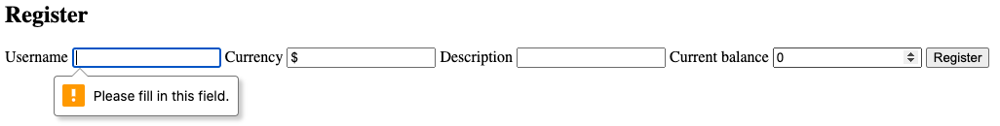
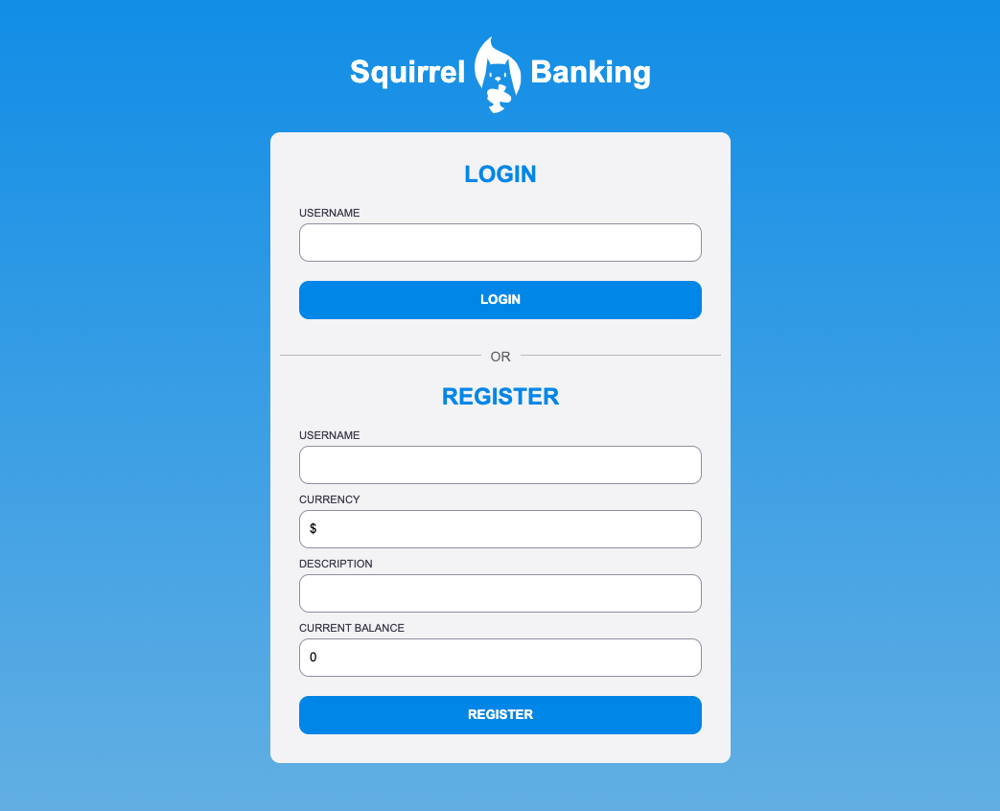

# バンキングアプリを作ろう その 2: ログインと登録フォームの構築

## レッスン前の小テスト

[レッスン前の小テスト](https://calm-wave-0d1a32b03.1.azurestaticapps.net/quiz/43?loc=ja)

### イントロダクション

最近のほとんどの Web アプリでは、アカウントを作成して自分だけのプライベート空間を持つことができます。複数のユーザーが同時に Web アプリにアクセスすることができるため、各ユーザーの個人情報を個別に保存し、どの情報を表示するかを選択する仕組みが必要になります。ここでは、[ユーザー ID を安全に管理する方法](https://en.wikipedia.org/wiki/Authentication)については、それ自体が広範なトピックなので取り上げませんが、各ユーザーがアプリ上で1つ(または複数)の銀行口座を作成できるようにしておきます。

このパートでは、HTML フォームを使用して、Web アプリにログインと登録を追加します。プログラムでサーバー API にデータを送信する方法、最終的にユーザー入力の基本的な検証ルールを定義する方法を見ていきます。

### 前提条件

このレッスンでは、Web アプリの [HTML テンプレートとルーティング](../../1-template-route/translations/README.ja.md)が完了している必要があります。また、アカウントを作成するためのデータを送信できるように、ローカルに [Node.js](https://nodejs.org/ja) と[サーバー API を実行する](../../api/translations/README.ja.md)をインストールする必要があります。

ターミナルでこのコマンドを実行することで、サーバーが正常に動作していることを確認することができます。

```sh
curl http://localhost:5000/api
# -> 結果として "Bank API v1.0.0" を返す必要があります。
```

---

## フォームとコントロール

`<form>` 要素は HTML ドキュメントのセクションをカプセル化し、ユーザがインタラクティブなコントロールを使ってデータを入力したり送信したりすることができます。フォームの中で利用できるユーザーインターフェイス (UI) コントロールには様々な種類がありますが、最も一般的なものは `<input>` と `<button>` 要素です。

例えば、ユーザがユーザ名を入力できるフィールドを作成するには、`<input>` 要素を使用することができます。

```html
<input id="username" name="username" type="text">
```

`name` 属性はフォームデータを送信する際のプロパティ名として使われます。`id` 属性は `<label>` をフォームコントロールに関連付けるために使われます。

> UI を構築する際に使用できるすべてのネイティブ UI 要素のアイデアを得るために、[`<input>` タイプ](https://developer.mozilla.org/ja/docs/Web/HTML/Element/input) と [その他のフォームコントロール](https://developer.mozilla.org/ja/docs/Learn/Forms/Other_form_controls) のリスト全体を見てみましょう。

✅ `<input>` は [空の要素](https://developer.mozilla.org/ja/docs/Glossary/Empty_element) であることに注意してください。それは一致するクロージングタグを追加すべき*ではありません*。タグ自身で閉じる `<input/>` 記法を使うことはできますが、必須ではありません。

フォーム内の `<button>` 要素は少し特殊です。`type` 属性を指定しないと、ボタンが押されたときに自動的にフォームデータをサーバに送信します。以下に可能な `type` の値を示します。

- `submit`: `<form>`内のデフォルトの値で、ボタンはフォームの送信アクションをトリガーします
- `reset`: ボタンはすべてのフォームコントロールを初期値にリセットします
- `button`: ボタンが押されたときのデフォルトの動作を割り当てないでください。その後、JavaScript を使ってカスタムアクションを割り当てることができます

### タスク

まずは `login` テンプレートにフォームを追加してみましょう。*ユーザ名*フィールドと*ログイン*ボタンが必要です。

```html
<template id="login">
  <h1>Bank App</h1>
  <section>
    <h2>Login</h2>
    <form id="loginForm">
      <label for="username">Username</label>
      <input id="username" name="user" type="text">
      <button>Login</button>
    </form>
  </section>
</template>
```

よく見ると、ここに `<label>` 要素が追加されていることがわかります。`<label>` 要素はユーザー名フィールドなどの UI コントロールに名前を追加するために使われます。ラベルはフォームを読みやすくするために重要ですが、それだけではありません。

- ラベルをフォームコントロールに関連付けることで、(スクリーンリーダーのような) 支援技術を使用しているユーザーが、どのようなデータを提供することが求められているのかを理解するのに役立ちます
- ラベルをクリックすると、関連する入力に直接フォーカスを当てることができるので、タッチスクリーンベースのデバイスでも手が届きやすくなります

> ウェブ上の [アクセシビリティ](https://developer.mozilla.org/ja/docs/Learn/Accessibility/What_is_accessibility) は、見落とされがちな非常に重要なトピックです。[セマンティックな HTML 要素](https://developer.mozilla.org/ja/docs/Learn/Accessibility/HTML) のおかげで、適切に使用すれば、アクセシブルなコンテンツを作成することは難しくありません。[アクセシビリティについての詳細を読む](https://developer.mozilla.org/ja/docs/Web/Accessibility)ことで、よくある間違いを回避し、責任ある開発者になることができます。

あとは、前のもののすぐ下に登録用の第二形態を追加します。

```html
<hr/>
<h2>Register</h2>
<form id="registerForm">
  <label for="user">Username</label>
  <input id="user" name="user" type="text">
  <label for="currency">Currency</label>
  <input id="currency" name="currency" type="text" value="$">
  <label for="description">Description</label>
  <input id="description" name="description" type="text">
  <label for="balance">Current balance</label>
  <input id="balance" name="balance" type="number" value="0">
  <button>Register</button>
</form>
```

`value` 属性を用いて、与えられた入力に対してデフォルト値を定義することができます。
また、`balance` の入力が `number` 型であることにも注目してください。他の入力とは違うように見えますか? これを使ってみてください。

✅ キーボードだけでフォームをナビゲートして対話することができますか? あなたならどうしますか?

## サーバーへのデータ送信

機能的な UI ができたので、次のステップはデータをサーバーに送信することです。現在のコードを使って簡単なテストをしてみましょう。*ログイン*または*登録*ボタンをクリックするとどうなりますか?

ブラウザの URL セクションの変化に気付きましたか？


`<form>` のデフォルトのアクションは、フォームを現在のサーバの URL に [GET メソッド](https://www.w3.org/Protocols/rfc2616/rfc2616-sec9.html#sec9.3) を使って送信し、フォームのデータを URL に直接追加することです。この方法にはいくつかの欠点があります。

- 送信されるデータのサイズが非常に限られています (2000 文字程度)
- データは URL で直接見ることができます (パスワードには向いていません)
- ファイルのアップロードでは動作しません

そのため、これまでの制限を受けずに、HTTP リクエストの本文でフォームデータをサーバに送信する [POST メソッド](https://www.w3.org/Protocols/rfc2616/rfc2616-sec9.html#sec9.5)を利用するように変更することができます。

> POST はデータを送信するために最も一般的に使用される方法ですが、[いくつかの特定のシナリオ](https://www.w3.org/2001/tag/doc/whenToUseGet.html)では、例えば検索フィールドを実装する場合には、GET メソッドを使用することが望ましいです。

### タスク

登録フォームに `action` と `method` プロパティを追加します。

```html
<form id="registerForm" action="//localhost:5000/api/accounts" method="POST">
```

ここで、あなたの名前で新しいアカウントを登録してみてください。*登録*ボタンをクリックすると、このような画面が表示されるはずです。


すべてがうまくいけば、サーバーはあなたのリクエストに、作成されたアカウントデータを含む [JSON](https://www.json.org/json-ja.html) レスポンスを返すはずです。

✅ 同じ名前で再度登録してみてください。どうなるでしょうか?

## ページを再読み込みせずにデータを送信する

お気づきのように、先ほど使用したアプローチに若干の問題があります。フォームを送信するときです。これが発生するとアプリを終了し、ブラウザはサーバーの URL にリダイレクトします。[シングルページアプリケーション(SPA)](https://en.wikipedia.org/wiki/Single-page_application) を作成しているので、ウェブアプリですべてのページのリロードを回避しようとしています。

ページのリロードを強制せずにフォームデータをサーバに送信するには、JavaScript のコードを使用しなければなりません。`<form>` 要素の `action` プロパティに URL を記述する代わりに、カスタムアクションを実行するために `javascript:` 文字列の前に任意の JavaScript コードを使用することができます。これを使うと、これまでブラウザが自動的に行っていたタスクを実装しなければならないことになります。

- フォームデータを取得する
- フォームデータを適切なフォーマットに変換してエンコードする
- HTTPリクエストを作成してサーバーに送信する

### タスク

登録フォームの `action` は、次のように置き換えてください。

```html
<form id="registerForm" action="javascript:register()">
```

`app.js`を開いて `register` という名前の関数を追加します。

```js
function register() {
  const registerForm = document.getElementById('registerForm');
  const formData = new FormData(registerForm);
  const data = Object.fromEntries(formData);
  const jsonData = JSON.stringify(data);
}
```

ここでは、`getElementById()`を使ってフォーム要素を取得し、[`FormData`](https://developer.mozilla.org/ja/docs/Web/API/FormData) ヘルパーを使ってフォームコントロールからキーと値のペアのセットとして値を抽出します。次に、[`Object.fromEntries()`](https://developer.mozilla.org/ja/docs/Web/JavaScript/Reference/Global_Objects/Object/fromEntries) を使用してデータを通常のオブジェクトに変換し、最後に Web 上でデータを交換するために一般的に使用されるフォーマットである [JSON](https://www.json.org/json-ja.html) にデータをシリアライズします。

これで、データをサーバに送信する準備ができました。`createAccount` という名前の関数を新規に作成しましょう。

```js
async function createAccount(account) {
  try {
    const response = await fetch('//localhost:5000/api/accounts', {
      method: 'POST',
      headers: { 'Content-Type': 'application/json' },
      body: account
    });
    return await response.json();
  } catch (error) {
    return { error: error.message || 'Unknown error' };
  }
}
```

この関数は何をしているのでしょうか？まず、ここでの `async` キーワードに注目してください。これは、この関数が [**非同期的に**](https://developer.mozilla.org/ja/docs/Web/JavaScript/Reference/Statements/async_function) を実行するコードを含んでいることを意味します。await` キーワードと一緒に使用すると、非同期コードが実行されるのを待つことができます。

以下に、`async/await` の使用法についての簡単なビデオを示します。

[](https://youtube.com/watch?v=YwmlRkrxvkk "Async and Await for managing promises")

JSON データをサーバに送信するには、`fetch()` API を使用します。このメソッドは2つのパラメータを受け取ります。

- サーバの URL なので、ここに `/localhost:5000/api/accounts` を返します
- リクエストの設定。ここでメソッドを `POST` に設定し、リクエストのための `body` を提供します。JSON データをサーバに送るので、`Content-Type` ヘッダを `application/json` に設定する必要があります

サーバはリクエストに対して JSON で応答するので、`await response.json()` を使って JSON の内容を解析し、結果のオブジェクトを返すことができます。このメソッドは非同期なので、返す前に `await` キーワードを使って、解析中のエラーが発生した場合にはそれもキャッチするようにしています。

次に、`register` 関数にコードを追加して `createAccount()` を呼び出すようにします。

```js
const result = await createAccount(jsonData);
```

ここでは `await` キーワードを使用しているので、レジスタ関数の前に `async` キーワードを追加する必要があります。

```js
async function register() {
```

最後に、結果を確認するためのログを追加してみましょう。最終的な関数は以下のようになるはずです。

```js
async function register() {
  const registerForm = document.getElementById('registerForm');
  const formData = new FormData(registerForm);
  const jsonData = JSON.stringify(Object.fromEntries(formData));
  const result = await createAccount(jsonData);

  if (result.error) {
    return console.log('An error occured:', result.error);
  }

  console.log('Account created!', result);
}
```

ちょっと長かったですが、無事にたどり着きました! [ブラウザの開発者ツール](https://developer.mozilla.org/ja/docs/Learn/Common_questions/What_are_browser_developer_tools)を開いて、新しいアカウントを登録してみると、Web ページには何も変化がないはずなのですが、コンソールにはすべてが正常に動作することを確認するメッセージが表示されます。


✅ データは安全にサーバーに送られていると思いますか? もし何者かにリクエストを傍受されたらどうしますか? 安全なデータ通信については、[HTTPS](https://ja.wikipedia.org/wiki/HTTPS) を読むとより詳しく知ることができます。

## データの検証

最初にユーザー名を設定せずに新規アカウントを登録しようとすると、サーバーがステータスコード [400 (Bad Request)](https://developer.mozilla.org/ja/docs/Web/HTTP/Status/400) でエラーを返していることがわかります。

サーバーにデータを送信する前に、可能な限り事前に [フォームデータの検証](https://developer.mozilla.org/ja/docs/Learn/Forms/Form_validation) を行い、有効なリクエストを送信していることを確認するのが良い方法です。HTML5 フォームコントロールは、様々な属性を使った組み込みのバリデーションを提供しています。

- `required`: フィールドには入力する必要があります。そうでない場合は、フォームを送信することができません
- `minlength` と `maxlength`: テキストフィールドの最小文字数と最大文字数を定義します
- `min` と `max`: 数値フィールドの最小値と最大値を定義します
- `type`: `number`, `email`, `file` や [その他の組み込み型](https://developer.mozilla.org/ja/docs/Web/HTML/Element/input) のような、期待されるデータの種類を定義します。この属性はフォームコントロールの視覚的なレンダリングを変更することもできます
- `pattern`: これを使用すると、入力されたデータが有効かどうかをテストするための [正規表現](https://developer.mozilla.org/ja/docs/Web/JavaScript/Guide/Regular_Expressions) パターンを定義することができます

> ヒント: CSS 疑似クラス `:valid` と `:invalid` を利用して、フォームコントロールの見た目を有効か無効かによってカスタマイズすることができます。

### タスク

有効な新規アカウントを作成するためには、ユーザー名と通貨の2つの必須フィールドがあり、その他のフィールドは任意です。フォームの HTML を更新し、`required` 属性とフィールドのラベルのテキストの両方を使用してください。

```html
<label for="user">Username (required)</label>
<input id="user" name="user" type="text" required>
...
<label for="currency">Currency (required)</label>
<input id="currency" name="currency" type="text" value="$" required>
```

このサーバの実装ではフィールドの最大長に特定の制限はありませんが、ユーザのテキスト入力に対して合理的な制限を定義することは常に良い習慣です。

テキストフィールドに `maxlength` 属性を追加します。

```html
<input id="user" name="user" type="text" maxlength="20" required>
...
<input id="currency" name="currency" type="text" value="$" maxlength="5" required>
...
<input id="description" name="description" type="text" maxlength="100">
```

これで、*Register* ボタンを押したときに、フィールドが定義したバリデーションルールに準拠していない場合は、次のように表示されるはずです。



このように、サーバにデータを送信する前に実行されるバリデーションのことを **クライアントサイド** のバリデーションと呼びます。しかし、データを送信せずにすべてのチェックを実行できるとは限らないことに注意してください。例えば、サーバーにリクエストを送らずに、同じユーザー名のアカウントが既に存在するかどうかを確認することはできません。サーバー上で実行される追加のバリデーションは、**サーバーサイド**のバリデーションと呼ばれます。

通常は両方を実装する必要があり、クライアントサイドのバリデーションを使用すると、ユーザーへのフィードバックを即座に提供することでユーザーエクスペリエンスが向上しますが、サーバーサイドのバリデーションは、操作するユーザーデータが健全で安全であることを確認するために非常に重要です。

---

## 🚀 チャレンジ

ユーザーが既に存在する場合には、エラーメッセージを HTML に表示します。

ここでは、少しのスタイリングの後に最終的なログインページがどのように見えるかの例を示します。



## レッスン後の小テスト

[レッスン後の小テスト](https://calm-wave-0d1a32b03.1.azurestaticapps.net/quiz/44?loc=ja)

## 復習と自己学習

開発者は、フォーム構築の取り組み、特に検証戦略に関して、非常にクリエイティブになっています。[CodePen](https://codepen.com) を見て、さまざまなフォームの流れについて学びましょう。

## 課題

[銀行アプリのスタイル設定](assignment.ja.md)
