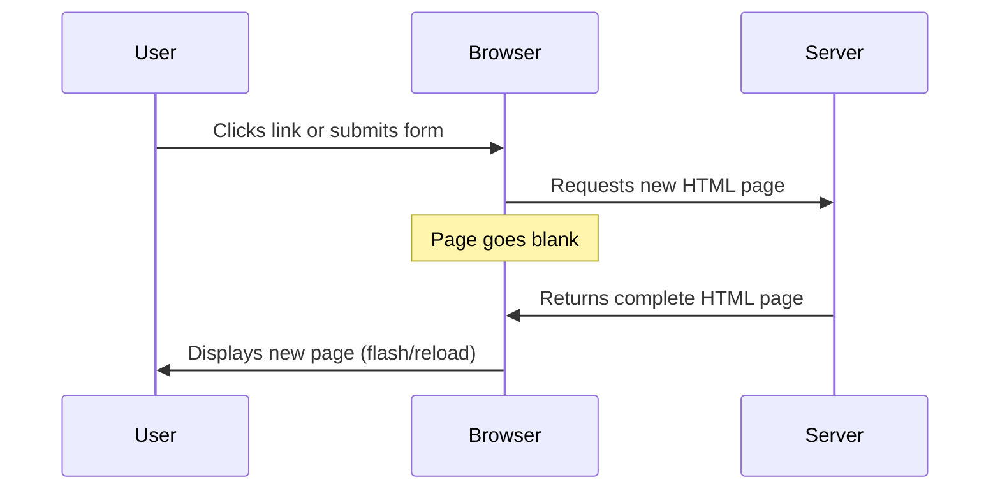
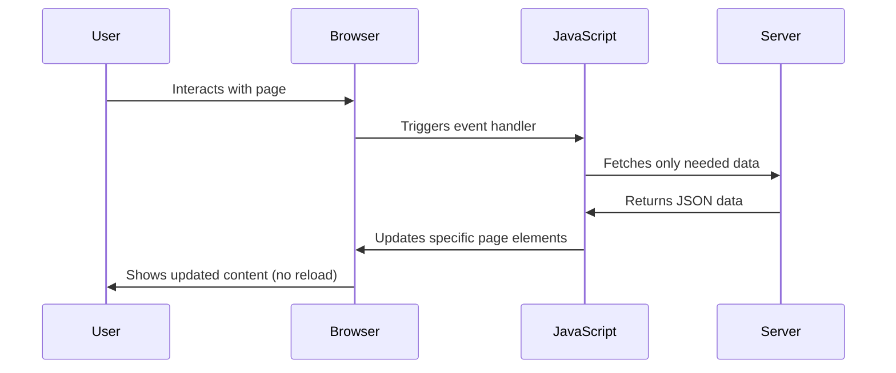
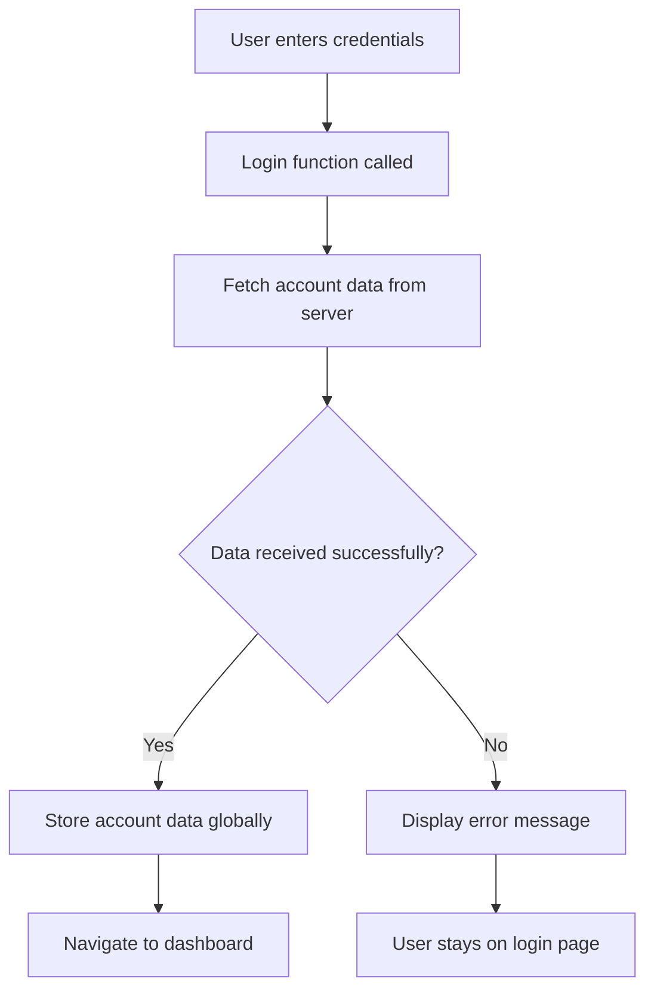
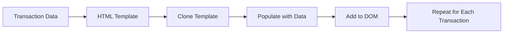

# Build a Banking App Part 3: Methods of Fetching and Using Data

Data is the lifeblood of modern web applications. Every time you check your bank balance, refresh your social media feed, or search for a product online, you're witnessing the power of dynamic data fetching and display. Unlike traditional websites that required full page reloads to show new information, modern web applications can seamlessly update content in real-time, creating smooth and responsive user experiences.

In this lesson, you'll discover how to transform your static banking app into a dynamic, data-driven application. You'll learn to fetch user account information from a server, handle asynchronous operations with modern JavaScript, and dynamically update your HTML to display real bank account data. This represents a crucial shift from hard-coded content to live, server-driven information.

By the end of this lesson, you'll understand the fundamental concepts behind single-page applications and have the skills to create web apps that feel fast, responsive, and professional. Let's dive into the world of asynchronous data fetching and dynamic content updates!

## Pre-Lecture Quiz

[Pre-lecture quiz](https://ff-quizzes.netlify.app/web/quiz/45)

### Prerequisites

Before diving into data fetching, ensure you have these components ready:

- **Previous Lesson**: Complete the [Login and Registration Form](../2-forms/README.md) - we'll build on this foundation
- **Local Server**: Install [Node.js](https://nodejs.org) and [run the server API](../api/README.md) to provide account data
- **API Connection**: Test your server connection with this command:

```bash
curl http://localhost:5000/api
# Expected response: "Bank API v1.0.0"
```

**Testing your setup:**
- **Verifies** that Node.js is properly installed on your system
- **Confirms** the API server is running and accessible
- **Establishes** the connection between your app and the data source

---

## Understanding Data Fetching in Modern Web Apps

The way web applications handle data has evolved dramatically over the past two decades. Understanding this evolution will help you appreciate why modern techniques like AJAX and the Fetch API are so powerful and why they've become essential tools for web developers.

Let's explore how traditional websites worked compared to the dynamic, responsive applications we build today.

### Traditional Multi-Page Applications (MPA)

In the early days of the web, every user interaction required a complete page reload. When you clicked a link or submitted a form, the browser would request an entirely new HTML page from the server, causing the screen to flash white and interrupting the user's experience.




**Understanding the MPA approach:**
- **Reloads** the entire page for every data update or navigation
- **Interrupts** user interaction with visible page refreshes
- **Transfers** more data since complete HTML pages are sent
- **Creates** a less smooth, desktop-app-like experience

### Modern Single-Page Applications (SPA)

Modern web applications use a technique called AJAX (Asynchronous JavaScript and XML) to fetch only the data they need, without reloading the entire page. This creates much smoother, app-like experiences that users have come to expect.




**Here's what makes SPAs superior:**
- **Updates** only the parts of the page that need to change
- **Maintains** smooth user interactions without interruption
- **Transfers** less data by sending only JSON instead of full HTML
- **Provides** desktop-application-like responsiveness and speed

### The Evolution to Modern Fetch API

While AJAX originally used the [`XMLHttpRequest`](https://developer.mozilla.org/docs/Web/API/XMLHttpRequest/Using_XMLHttpRequest) API, modern browsers provide the more elegant [`Fetch` API](https://developer.mozilla.org/docs/Web/API/Fetch_API). The Fetch API uses promises and is specifically designed for handling JSON data - perfect for modern web applications.

| Feature | XMLHttpRequest | Fetch API |
|---------|----------------|----------|
| **Syntax** | Complex callback-based | Clean promise-based |
| **JSON Handling** | Manual parsing required | Built-in `.json()` method |
| **Error Handling** | Limited error information | Comprehensive error details |
| **Modern Support** | Legacy compatibility | ES6+ promises and async/await |

> 💡 **Browser Compatibility**: While all modern browsers support the Fetch API, you can always check the [compatibility table on caniuse.com](https://caniuse.com/fetch) to verify support for your target browsers.
> 
**What you need to know:**
- **Supports** all current browser versions (Chrome, Firefox, Safari, Edge)
- **Requires** polyfills only for Internet Explorer and very old browsers
- **Provides** the foundation for modern async/await JavaScript patterns

### Implementing User Login and Data Retrieval

Now that you understand how modern web applications fetch data, let's implement these concepts in your banking app. You'll create a login function that authenticates users and retrieves their account information from the server - all without reloading the page.

We'll build this functionality step by step, starting with a basic login function and then adding data fetching capabilities.

#### Step 1: Create the Login Function Foundation

Open your `app.js` file and add a new `login` function. This will handle the user authentication process:

```javascript
async function login() {
  const loginForm = document.getElementById('loginForm');
  const user = loginForm.user.value;
}
```

**Breaking down what happens here:**
- **Declares** an `async` function to handle asynchronous operations
- **Retrieves** the login form element using `getElementById()`
- **Extracts** the username value from the form input field
- **Accesses** form controls by their `name` attribute as properties of the form

> 💡 **Form Access Pattern**: Every form control can be accessed by its name (set in the HTML using the `name` attribute) as a property of the form element. This provides a clean, readable way to get form data.

#### Step 2: Create the Account Data Fetching Function

Next, we'll create a dedicated function to retrieve account data from the server. This follows the same pattern as your registration function but focuses on data retrieval:

```javascript
async function getAccount(user) {
  try {
    const response = await fetch('//localhost:5000/api/accounts/' + encodeURIComponent(user));
    return await response.json();
  } catch (error) {
    return { error: error.message || 'Unknown error' };
  }
}
```

**Here's what this code accomplishes:**
- **Uses** the modern `fetch` API to request data asynchronously
- **Constructs** a GET request URL with the username parameter
- **Applies** `encodeURIComponent()` to safely handle special characters in URLs
- **Converts** the response to JSON format for easy data manipulation
- **Handles** errors gracefully by returning an error object instead of crashing

> ⚠️ **Security Consideration**: The `encodeURIComponent()` function escapes special characters that could break URLs or cause security issues. What problems might occur if a username contained characters like `#`, `&`, or spaces without proper encoding?
> 
**Security implications to consider:**
- **Prevents** URL parsing errors when usernames contain special characters
- **Blocks** potential injection attacks through malformed URLs
- **Ensures** consistent server-side processing of user data
- **Maintains** proper HTTP request formatting standards

#### Understanding HTTP GET Requests

By default, the `fetch` API creates a [`GET`](https://developer.mozilla.org/docs/Web/HTTP/Methods/GET) HTTP request, which is perfect for retrieving data. Unlike POST requests (used for creating accounts), GET requests:

| GET Request | POST Request |
|-------------|-------------|
| **Purpose** | Retrieve existing data | Send new data to server |
| **Parameters** | In URL path/query string | In request body |
| **Caching** | Can be cached by browsers | Not typically cached |
| **Security** | Visible in URL/logs | Hidden in request body |

#### Step 3: Complete the Login Function

Now let's integrate the account fetching function into your login process. This creates a complete user authentication and data retrieval workflow:

```javascript
async function login() {
  const loginForm = document.getElementById('loginForm');
  const user = loginForm.user.value;
  const data = await getAccount(user);

  if (data.error) {
    return console.log('loginError', data.error);
  }

  account = data;
  navigate('/dashboard');
}
```

**Step by step, here's what's happening:**
- **Retrieves** the username from the login form
- **Calls** the `getAccount` function and waits for the server response
- **Checks** for errors and logs them if they occur (we'll improve this soon)
- **Stores** the account data in a global variable for app-wide access
- **Navigates** to the dashboard page to display the account information

> 🎯 **Async/Await Pattern**: Since `getAccount` is an asynchronous function, we use the `await` keyword to pause execution until the server responds. This prevents the code from continuing with undefined data.

#### Step 4: Set Up Global Data Storage

Your app needs a place to store the account data so it can be accessed from different parts of your application. Add this global variable at the top of your `app.js` file:

```javascript
// Global variable to store current user account data
let account = null;
```

**Understanding global state management:**
- **Stores** account data accessible throughout the entire application
- **Initializes** as `null` to indicate no user is currently logged in
- **Updates** when users successfully log in or register
- **Provides** a single source of truth for user account information

#### Step 5: Connect the Login Function to Your Form

Update your HTML form to call the login function when submitted:

```html
<form id="loginForm" action="javascript:login()">
  <!-- Your existing form inputs -->
</form>
```

**What this accomplishes:**
- **Prevents** the default form submission that would reload the page
- **Triggers** your custom JavaScript login function instead
- **Maintains** the single-page application experience
- **Allows** for custom error handling and user feedback

#### Step 6: Enhance Your Registration Function

For consistency, update your `register` function to also store account data and navigate to the dashboard:

```javascript
// Add these lines at the end of your register function
account = result;
navigate('/dashboard');
```

**This enhancement provides:**
- **Seamless** transition from registration to dashboard
- **Consistent** user experience between login and registration flows
- **Immediate** access to account data after successful registration

#### Testing Your Implementation



**Test your login system:**
1. **Register** a new account to ensure the API is working
2. **Try logging in** with the same credentials
3. **Check the browser console** for any error messages
4. **Verify** that you're redirected to the dashboard after successful login

#### Understanding Cross-Origin Requests

You might be wondering how our web app can communicate with the API server when they're running on different ports. This involves an important web security concept that every developer should understand.

> 🔒 **Security Insight**: By default, browsers enforce the "same-origin policy" which only allows web pages to make requests to the same domain and port they were loaded from. This prevents malicious websites from accessing data from other sites.
> 
**Here's what this means:**
- **Web app** runs on `localhost:3000` (your development server)
- **API server** runs on `localhost:5000` (your backend)
- **Browsers** would normally block this cross-origin communication
- **CORS** (Cross-Origin Resource Sharing) allows controlled exceptions

Our setup works because the API server includes special [CORS headers](https://developer.mozilla.org/docs/Web/HTTP/CORS) that tell the browser: "It's okay to allow requests from localhost:3000." This is a crucial concept for modern web development where frontend and backend often run on different servers.

> 📚 **Learn More**: Dive deeper into APIs and data fetching with this comprehensive [Microsoft Learn module on APIs](https://docs.microsoft.com/learn/modules/use-apis-discover-museum-art/?WT.mc_id=academic-77807-sagibbon).

## Displaying Dynamic Data in Your HTML

Now that your app can successfully fetch user data from the server, it's time to make that data visible to your users. This is where the magic happens - transforming raw JSON data into meaningful, interactive content that users can see and understand.

Let's explore the essential techniques for dynamically updating HTML content with JavaScript, focusing on safe and efficient methods that create professional user experiences.

### Understanding DOM Manipulation Methods

When working with dynamic content, you have several tools available for updating HTML elements. Each method serves different purposes and has specific security considerations:

| Method | Purpose | Best Use Case | Security Level |
|--------|---------|---------------|----------------|
| `textContent` | Update text safely | Displaying user data, simple text | ✅ Safe |
| `createElement()` + `append()` | Create new elements | Building complex structures | ✅ Safe |
| `innerHTML` | Set HTML content | ⚠️ Should be avoided | ❌ XSS vulnerable |

#### Safe Text Content Updates

The [`textContent`](https://developer.mozilla.org/docs/Web/API/Node/textContent) property is your go-to method for safely displaying user data:

```javascript
// Safe way to update text content
const balanceElement = document.getElementById('balance');
balanceElement.textContent = account.balance;
```

**Key benefits of textContent:**
- **Prevents** XSS attacks by treating all content as plain text
- **Removes** all existing child elements when updated
- **Provides** an efficient way to clear elements by setting to empty string `''`
- **Ensures** safe display of user-generated content

#### Creating Dynamic HTML Elements

For more complex content, combine [`document.createElement()`](https://developer.mozilla.org/docs/Web/API/Document/createElement) with the [`append()`](https://developer.mozilla.org/docs/Web/API/ParentNode/append) method:

```javascript
// Safe way to create new elements
const transactionItem = document.createElement('div');
transactionItem.className = 'transaction-item';
transactionItem.textContent = `${transaction.date}: ${transaction.description}`;
container.append(transactionItem);
```

**Understanding this approach:**
- **Creates** new DOM elements programmatically
- **Maintains** full control over element attributes and content
- **Allows** for complex, nested element structures
- **Preserves** security by separating structure from content

> ⚠️ **Security Warning**: While the [`innerHTML`](https://developer.mozilla.org/docs/Web/API/Element/innerHTML) property can update HTML content, it should be avoided because it's vulnerable to [cross-site scripting (XSS)](https://developer.mozilla.org/docs/Glossary/Cross-site_scripting) attacks.
> 
**Why innerHTML is dangerous:**
- **Executes** any JavaScript code included in the HTML string
- **Allows** malicious users to inject harmful scripts
- **Creates** security vulnerabilities in production applications
- **Better alternatives** exist for all common use cases

### Implementing User-Friendly Error Handling

Right now, when login fails, error messages only appear in the browser console - invisible to your users. Let's fix this by creating a professional error display system that provides clear feedback and works well for all users, including those using screen readers.

This improvement transforms your app from a developer tool into a polished user experience.

#### Step 1: Add Error Display Elements to Your HTML

First, add a placeholder element in your login form where error messages can appear. Place it just before the login button for optimal visibility:

```html
<!-- Add this error display area to your login form -->
<div id="loginError" role="alert"></div>
<button>Login</button>
```

**Here's what this code does:**
- **Creates** an empty container that's invisible until needed
- **Positions** the error message where users naturally look for feedback
- **Includes** the `role="alert"` attribute for screen reader accessibility
- **Provides** a unique `id` for easy JavaScript targeting

#### Step 2: Create a Reusable Update Function

Next, create a helper function that can update any element's text content. This promotes code reusability and consistency:

```javascript
function updateElement(id, text) {
  const element = document.getElementById(id);
  element.textContent = text;
}
```

**Understanding this utility function:**
- **Accepts** an element ID and text content as parameters
- **Finds** the target element using `getElementById()`
- **Updates** the element's text content safely using `textContent`
- **Provides** a reusable pattern for updating any page element

#### Step 3: Display Login Errors to Users

Update your login function to show errors visually instead of just logging them:

```javascript
// Replace the console.log with user-visible error display
if (data.error) {
  return updateElement('loginError', data.error);
}
```

**What this improvement accomplishes:**
- **Displays** error messages where users can see them
- **Replaces** developer-only console messages with user-friendly feedback
- **Stops** the login process when errors occur
- **Provides** immediate, actionable feedback to users

Now when you test with an invalid account, you'll see a clear error message:


#### Step 4: Ensure Accessibility with Live Regions

The error message now appears visually, but screen reader users might miss it since it's added dynamically. The `role="alert"` attribute creates a [Live Region](https://developer.mozilla.org/docs/Web/Accessibility/ARIA/ARIA_Live_Regions) that announces changes to assistive technologies:

```html
<div id="loginError" role="alert"></div>
```

**Why accessibility matters:**
- **Announces** error messages to screen reader users immediately
- **Ensures** all users receive important feedback
- **Complies** with web accessibility standards (WCAG)
- **Creates** inclusive experiences for users with disabilities

#### Step 5: Apply the Same Pattern to Registration

For consistency, implement identical error handling in your registration form:

1. **Add** an error display element to your registration HTML:
```html
<div id="registerError" role="alert"></div>
```

2. **Update** your register function to use the same error display pattern:
```javascript
if (data.error) {
  return updateElement('registerError', data.error);
}
```

**Benefits of consistent error handling:**
- **Provides** uniform user experience across all forms
- **Reduces** cognitive load by using familiar patterns
- **Simplifies** maintenance with reusable code
- **Ensures** accessibility standards are met throughout the app

## Building Your Dynamic Dashboard

Now comes the exciting part - transforming your static dashboard into a dynamic, data-driven interface that displays real account information. You'll apply the DOM manipulation techniques you've learned to create a professional banking dashboard that updates in real-time.

Let's start by understanding the data structure you'll be working with, then build the dashboard step by step.

### Understanding the Account Data Structure

When your app successfully retrieves account data from the server, it receives a JSON object with all the information needed to display a complete banking dashboard:

```json
{
  "user": "test",
  "currency": "$",
  "description": "Test account",
  "balance": 75,
  "transactions": [
    { "id": "1", "date": "2020-10-01", "object": "Pocket money", "amount": 50 },
    { "id": "2", "date": "2020-10-03", "object": "Book", "amount": -10 },
    { "id": "3", "date": "2020-10-04", "object": "Sandwich", "amount": -5 }
  ]
}
```

**Breaking down this data structure:**
- **`user`**: The account holder's username for personalization
- **`currency`**: The currency symbol for proper formatting
- **`description`**: A human-readable account description
- **`balance`**: The current account balance as a number
- **`transactions`**: An array of transaction objects with complete details

> 💡 **Development Tip**: For testing purposes, you can use the pre-existing `test` account that's already populated with sample data. This lets you see the dashboard in action without creating multiple test accounts.
> 
**What the test account provides:**
- **Sample data** that demonstrates all dashboard features
- **Realistic transactions** showing both income and expenses
- **Consistent testing** environment for development
- **Quick verification** that your implementation works correctly

### Creating the Dashboard Display Elements

Let's build your dashboard interface step by step, starting with the account summary information and then moving on to more complex features like transaction lists.

#### Step 1: Update Your HTML Structure

First, replace the static "Balance" section with dynamic placeholder elements that your JavaScript can populate:

```html
<section>
  Balance: <span id="balance"></span><span id="currency"></span>
</section>
```

Next, add a section for the account description. Since this acts as a title for the dashboard content, use semantic HTML:

```html
<h2 id="description"></h2>
```

**Understanding the HTML structure:**
- **Uses** separate `<span>` elements for balance and currency for individual control
- **Applies** unique IDs to each element for JavaScript targeting
- **Follows** semantic HTML by using `<h2>` for the account description
- **Creates** a logical hierarchy for screen readers and SEO

> ✅ **Accessibility Insight**: The account description functions as a title for the dashboard content, so it's marked up semantically as a heading. Learn more about how [heading structure](https://www.nomensa.com/blog/2017/how-structure-headings-web-accessibility) impacts accessibility. Can you identify other elements on your page that might benefit from heading tags?

#### Step 2: Create the Dashboard Update Function

Now create a function that populates your dashboard with real account data:

```javascript
function updateDashboard() {
  if (!account) {
    return navigate('/login');
  }

  updateElement('description', account.description);
  updateElement('balance', account.balance.toFixed(2));
  updateElement('currency', account.currency);
}
```

**Step by step, here's what this function does:**
- **Validates** that account data exists before proceeding
- **Redirects** unauthenticated users back to the login page
- **Updates** the account description using the reusable `updateElement` function
- **Formats** the balance to always show two decimal places
- **Displays** the appropriate currency symbol

> 💰 **Number Formatting**: The [`toFixed(2)`](https://developer.mozilla.org/docs/Web/JavaScript/Reference/Global_Objects/Number/toFixed) method ensures the balance always displays with exactly 2 decimal places, making it look professional and consistent with banking standards (e.g., "75.00" instead of "75").

#### Step 3: Integrate Dashboard Updates with Navigation

To ensure your dashboard updates every time it's displayed, you need to connect the `updateDashboard()` function to your routing system.

If you completed the [lesson 1 assignment](../1-template-route/assignment.md), this integration should be straightforward. Otherwise, use this implementation:

Add this code to the end of your `updateRoute()` function:

```javascript
if (typeof route.init === 'function') {
  route.init();
}
```

Then update your routes definition to include the dashboard initialization:

```javascript
const routes = {
  '/login': { templateId: 'login' },
  '/dashboard': { templateId: 'dashboard', init: updateDashboard }
};
```

**Understanding this routing enhancement:**
- **Checks** if a route has an initialization function defined
- **Calls** the initialization function when the route is loaded
- **Ensures** the dashboard displays fresh data every time it's visited
- **Maintains** separation between routing logic and dashboard updates

#### Testing Your Dashboard

After implementing these changes, test your dashboard:

1. **Log in** with a test account
2. **Verify** you're redirected to the dashboard
3. **Check** that the account description, balance, and currency display correctly
4. **Try logging out and back in** to ensure data refreshes properly

Your dashboard should now display dynamic account information that updates based on the logged-in user's data!

## Creating Dynamic Transaction Lists with HTML Templates

One of the most powerful features of your banking dashboard will be the transaction history. Instead of hardcoding transaction data, you'll use HTML templates to dynamically generate table rows for each transaction. This technique scales beautifully - whether a user has 3 transactions or 300, your code handles them all efficiently.

You've already used HTML templates for navigation in the [first lesson](../1-template-route/README.md). Now you'll apply the same powerful technique to create repeating content that adapts to your data.



### Step 1: Create the Transaction Template

First, add a reusable template for transaction rows in your HTML `<body>`:

```html
<template id="transaction">
  <tr>
    <td></td>
    <td></td>
    <td></td>
  </tr>
</template>
```

**Understanding HTML templates:**
- **Defines** the structure for a single table row
- **Remains** invisible until cloned and populated with JavaScript
- **Includes** three cells for date, description, and amount
- **Provides** a reusable pattern for consistent formatting

### Step 2: Prepare Your Table for Dynamic Content

Next, add an `id` to your table body so JavaScript can easily target it:

```html
<tbody id="transactions"></tbody>
```

**What this accomplishes:**
- **Creates** a clear target for inserting transaction rows
- **Separates** the table structure from the dynamic content
- **Enables** easy clearing and repopulating of transaction data

### Step 3: Build the Transaction Row Factory Function

Now create a function that transforms transaction data into HTML elements:

```javascript
function createTransactionRow(transaction) {
  const template = document.getElementById('transaction');
  const transactionRow = template.content.cloneNode(true);
  const tr = transactionRow.querySelector('tr');
  tr.children[0].textContent = transaction.date;
  tr.children[1].textContent = transaction.object;
  tr.children[2].textContent = transaction.amount.toFixed(2);
  return transactionRow;
}
```

**Breaking down this factory function:**
- **Retrieves** the template element by its ID
- **Clones** the template content for safe manipulation
- **Selects** the table row within the cloned content
- **Populates** each cell with transaction data
- **Formats** the amount to show proper decimal places
- **Returns** the completed row ready for insertion

### Step 4: Generate Multiple Transaction Rows Efficiently

Add this code to your `updateDashboard()` function to display all transactions:

```javascript
const transactionsRows = document.createDocumentFragment();
for (const transaction of account.transactions) {
  const transactionRow = createTransactionRow(transaction);
  transactionsRows.appendChild(transactionRow);
}
updateElement('transactions', transactionsRows);
```

**Understanding this efficient approach:**
- **Creates** a document fragment to batch DOM operations
- **Iterates** through all transactions in the account data
- **Generates** a row for each transaction using the factory function
- **Collects** all rows in the fragment before adding to the DOM
- **Performs** a single DOM update instead of multiple individual insertions

> ⚡ **Performance Tip**: [`document.createDocumentFragment()`](https://developer.mozilla.org/docs/Web/API/Document/createDocumentFragment) creates an in-memory container that doesn't trigger layout recalculations until attached to the main DOM. This dramatically improves performance when adding multiple elements.

### Step 5: Enhance the Update Function for Mixed Content

Your `updateElement()` function currently only handles text content. Update it to work with both text and DOM nodes:

```javascript
function updateElement(id, textOrNode) {
  const element = document.getElementById(id);
  element.textContent = ''; // Removes all children
  element.append(textOrNode);
}
```

**Key improvements in this update:**
- **Clears** existing content before adding new content
- **Accepts** either text strings or DOM nodes as parameters
- **Uses** the [`append()`](https://developer.mozilla.org/docs/Web/API/ParentNode/append) method for flexibility
- **Maintains** backward compatibility with existing text-based usage

### Testing Your Dynamic Transaction List

Now test your implementation:

1. **Log in** with the `test` account to see sample transaction data
2. **Navigate** to the dashboard
3. **Verify** that transaction rows appear with proper formatting
4. **Check** that dates, descriptions, and amounts display correctly

You should now see a complete transaction list on your dashboard! 🎉

**What you've accomplished:**
- **Transformed** static HTML into dynamic, data-driven content
- **Created** a scalable system that handles any number of transactions
- **Applied** professional web development patterns using templates
- **Built** an efficient, performant solution for repetitive content

---

## GitHub Copilot Agent Challenge 🚀

Use the Agent mode to complete the following challenge:

**Description:** Enhance the banking app by implementing a transaction search and filter feature that allows users to find specific transactions by date range, amount, or description.

**Prompt:** Create a search functionality for the banking app that includes: 1) A search form with input fields for date range (from/to), minimum/maximum amount, and transaction description keywords, 2) A `filterTransactions()` function that filters the account.transactions array based on the search criteria, 3) Update the `updateDashboard()` function to show filtered results, and 4) Add a "Clear Filters" button to reset the view. Use modern JavaScript array methods like `filter()` and handle edge cases for empty search criteria.

## 🚀 Challenge

Work together to make the dashboard page look like a real banking app. If you already styled your app, try to use [media queries](https://developer.mozilla.org/docs/Web/CSS/Media_Queries) to create a [responsive design](https://developer.mozilla.org/docs/Web/Progressive_web_apps/Responsive/responsive_design_building_blocks) working nicely on both desktop and mobile devices.

Here's an example of a styled dashboard page:


## Post-Lecture Quiz

[Post-lecture quiz](https://ff-quizzes.netlify.app/web/quiz/46)

## Assignment

[Refactor and comment your code](assignment.md)
