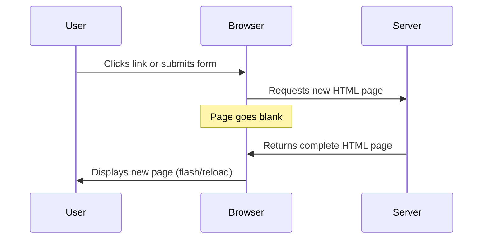
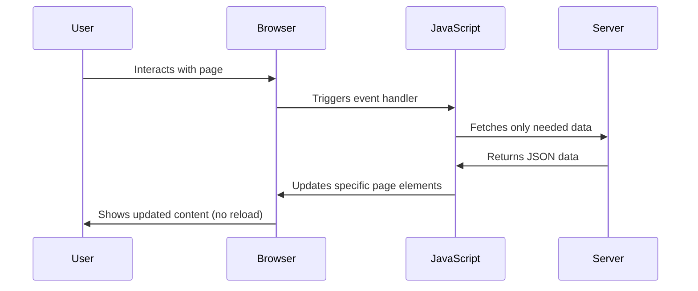
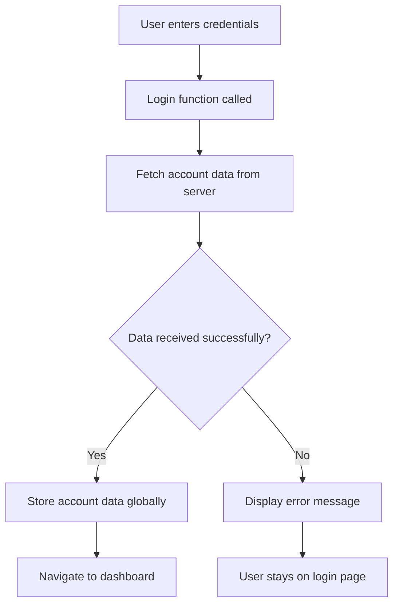
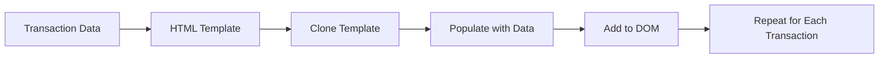

# Build a Banking App Part 3: Methods of Fetching and Using Data

Think about the last time you checked your bank balance or scrolled through social media. Notice how the content updates instantly without the page flickering or reloading? That's the magic of dynamic data fetching in action! Every smooth interaction you've come to expect from modern apps relies on the techniques we're about to explore together.

Here's what's exciting about this lesson: we're going to breathe life into your static banking app. Right now, it's like a beautiful storefront window - nice to look at, but not very interactive. By the time we're done, it'll feel like a real banking app that fetches actual account data, updates in real-time, and responds to user actions seamlessly.

You'll master the art of talking to servers without interrupting your users, handle data that arrives asynchronously (because servers don't always respond instantly!), and transform that raw data into meaningful information your users can actually use. This is where your app stops being a demo and starts feeling professional.

Ready to make the leap from static to dynamic? Let's dive in!

## Pre-Lecture Quiz

[Pre-lecture quiz](https://ff-quizzes.netlify.app/web/quiz/45)

### Prerequisites

Before diving into data fetching, ensure you have these components ready:

- **Previous Lesson**: Complete the [Login and Registration Form](../2-forms/README.md) - we'll build on this foundation
- **Local Server**: Install [Node.js](https://nodejs.org) and [run the server API](../api/README.md) to provide account data
- **API Connection**: Test your server connection with this command:

```bash
curl http://localhost:5000/api
# Expected response: "Bank API v1.0.0"
```

Don't worry if this feels a bit technical - we're just making sure everything's talking to each other properly! This quick test:
- Checks that Node.js is playing nice with your system
- Confirms your API server is awake and ready to serve data
- Ensures your app can actually reach the server (no point building a phone if there's no one to call!)

---

## Understanding Data Fetching in Modern Web Apps

The way web applications handle data has evolved dramatically over the past two decades. Understanding this evolution will help you appreciate why modern techniques like AJAX and the Fetch API are so powerful and why they've become essential tools for web developers.

Let's explore how traditional websites worked compared to the dynamic, responsive applications we build today.

### Traditional Multi-Page Applications (MPA)

Picture this: it's the early 2000s, and every time you clicked a link, the entire webpage would disappear, show you a brief flash of white, and then slowly rebuild itself. Remember that jarring experience? That was the reality of early web applications - every interaction meant starting completely over.




**Why this approach felt clunky:**
- Every click meant rebuilding the entire page from scratch
- Users got interrupted mid-thought by those annoying page flashes
- Your internet connection worked overtime downloading the same header and footer repeatedly
- Apps felt more like clicking through a filing cabinet than using software

### Modern Single-Page Applications (SPA)

Now imagine a different world - one where clicking updates just the part of the page that needs to change, like magic! This is what AJAX (Asynchronous JavaScript and XML) brought to the web. Despite the name mentioning XML, we mostly use JSON these days, but the core idea remains brilliant: why reload everything when you only need to update a small piece?




**Why SPAs feel so much better:**
- Only the parts that actually changed get updated (smart, right?)
- No more jarring interruptions - your users stay in their flow
- Less data traveling over the wire means faster loading
- Everything feels snappy and responsive, like the apps on your phone

### The Evolution to Modern Fetch API

Here's some good news: we don't have to wrestle with the old, clunky [`XMLHttpRequest`](https://developer.mozilla.org/docs/Web/API/XMLHttpRequest/Using_XMLHttpRequest) anymore! Modern browsers gave us the much friendlier [`Fetch` API](https://developer.mozilla.org/docs/Web/API/Fetch_API), which feels like a breath of fresh air. It uses promises (which make async code way more readable) and practically speaks JSON natively.

| Feature | XMLHttpRequest | Fetch API |
|---------|----------------|----------|
| **Syntax** | Complex callback-based | Clean promise-based |
| **JSON Handling** | Manual parsing required | Built-in `.json()` method |
| **Error Handling** | Limited error information | Comprehensive error details |
| **Modern Support** | Legacy compatibility | ES6+ promises and async/await |

> 💡 **Browser Compatibility**: Good news - the Fetch API works in all modern browsers! If you're curious about specific versions, [caniuse.com](https://caniuse.com/fetch) has the complete compatibility story.
> 
**The bottom line:**
- Works great in Chrome, Firefox, Safari, and Edge (basically everywhere your users are)
- Only Internet Explorer needs extra help (and honestly, it's time to let IE go)
- Sets you up perfectly for the elegant async/await patterns we'll use later

### Implementing User Login and Data Retrieval

Alright, enough theory - let's get our hands dirty! We're about to build the login system that'll make your banking app feel real. The cool part? When users log in, they'll see their actual account data appear instantly, without any page refreshes or loading screens.

I'll walk you through this step by step so nothing feels overwhelming. We'll start simple and gradually add the exciting data-fetching magic.

#### Step 1: Create the Login Function Foundation

Open your `app.js` file and add a new `login` function. This will handle the user authentication process:

```javascript
async function login() {
  const loginForm = document.getElementById('loginForm');
  const user = loginForm.user.value;
}
```

**Let's break this down:**
- That `async` keyword? It's telling JavaScript "hey, this function might need to wait for things"
- We're grabbing our form from the page (nothing fancy, just finding it by its ID)
- Then we're pulling out whatever the user typed as their username
- Here's a neat trick: you can access any form input by its `name` attribute - no need for extra getElementById calls!

> 💡 **Form Access Pattern**: Every form control can be accessed by its name (set in the HTML using the `name` attribute) as a property of the form element. This provides a clean, readable way to get form data.

#### Step 2: Create the Account Data Fetching Function

Next, we'll create a dedicated function to retrieve account data from the server. This follows the same pattern as your registration function but focuses on data retrieval:

```javascript
async function getAccount(user) {
  try {
    const response = await fetch('//localhost:5000/api/accounts/' + encodeURIComponent(user));
    return await response.json();
  } catch (error) {
    return { error: error.message || 'Unknown error' };
  }
}
```

**Here's what this code accomplishes:**
- **Uses** the modern `fetch` API to request data asynchronously
- **Constructs** a GET request URL with the username parameter
- **Applies** `encodeURIComponent()` to safely handle special characters in URLs
- **Converts** the response to JSON format for easy data manipulation
- **Handles** errors gracefully by returning an error object instead of crashing

> ⚠️ **Security Heads-up**: That `encodeURIComponent()` function might look like overkill, but it's actually your friend! Imagine if someone's username was "user#1" - without encoding, that `#` would confuse the URL and break your request.
> 
**Why this matters:**
- Prevents weird characters from breaking your URLs (trust me, users will find ways to break things!)
- Keeps malicious users from trying sneaky URL tricks
- Makes sure your server receives exactly what you intended to send
- Just good, clean coding practice that'll save you headaches later

#### Understanding HTTP GET Requests

Here's something that might surprise you: when you use `fetch` without any extra options, it automatically creates a [`GET`](https://developer.mozilla.org/docs/Web/HTTP/Methods/GET) request. This is perfect for what we're doing - asking the server "hey, can I see this user's account data?"

Think of GET requests like politely asking to borrow a book from the library - you're requesting to see something that already exists. POST requests (which we used for registration) are more like submitting a new book to be added to the collection.

| GET Request | POST Request |
|-------------|-------------|
| **Purpose** | Retrieve existing data | Send new data to server |
| **Parameters** | In URL path/query string | In request body |
| **Caching** | Can be cached by browsers | Not typically cached |
| **Security** | Visible in URL/logs | Hidden in request body |

#### Step 3: Bringing It All Together

Now for the satisfying part - let's connect your account fetching function to the login process. This is where everything clicks into place:

```javascript
async function login() {
  const loginForm = document.getElementById('loginForm');
  const user = loginForm.user.value;
  const data = await getAccount(user);

  if (data.error) {
    return console.log('loginError', data.error);
  }

  account = data;
  navigate('/dashboard');
}
```

Look at what's happening here - it's actually pretty elegant:
- We grab the username from the form (easy peasy)
- Ask the server for that user's account data and patiently wait for an answer
- If something goes wrong, we log it (we'll make this prettier for users in a moment)
- If everything's good, we save the account data and whisk the user off to their dashboard

> 🎯 **Async/Await Pattern**: Since `getAccount` is an asynchronous function, we use the `await` keyword to pause execution until the server responds. This prevents the code from continuing with undefined data.

#### Step 4: Creating a Home for Your Data

Your app needs somewhere to remember the account information once it's loaded. Think of this like your app's short-term memory - a place to keep the current user's data handy. Add this line at the top of your `app.js` file:

```javascript
// This holds the current user's account data
let account = null;
```

**Why we need this:**
- Keeps the account data accessible from anywhere in your app
- Starting with `null` means "no one's logged in yet"
- Gets updated when someone successfully logs in or registers
- Acts like a single source of truth - no confusion about who's logged in

#### Step 5: Wire Up Your Form

Now let's connect your shiny new login function to your HTML form. Update your form tag like this:

```html
<form id="loginForm" action="javascript:login()">
  <!-- Your existing form inputs -->
</form>
```

**What this little change does:**
- Stops the form from doing its default "reload the whole page" behavior
- Calls your custom JavaScript function instead
- Keeps everything smooth and single-page-app-like
- Gives you complete control over what happens when users hit "Login"

#### Step 6: Enhance Your Registration Function

For consistency, update your `register` function to also store account data and navigate to the dashboard:

```javascript
// Add these lines at the end of your register function
account = result;
navigate('/dashboard');
```

**This enhancement provides:**
- **Seamless** transition from registration to dashboard
- **Consistent** user experience between login and registration flows
- **Immediate** access to account data after successful registration

#### Testing Your Implementation



**Time to take it for a spin:**
1. Create a new account to make sure everything's working
2. Try logging in with those same credentials
3. Peek at your browser's console (F12) if anything seems off
4. Make sure you land on the dashboard after a successful login

If something's not working, don't panic! Most issues are simple fixes like typos or forgetting to start the API server.

#### A Quick Word About Cross-Origin Magic

You might be wondering: "How is my web app talking to this API server when they're running on different ports?" Great question! This touches on something every web developer bumps into eventually.

> 🔒 **Here's the deal**: Browsers are naturally suspicious. They don't want random websites making requests to other websites on your behalf - that could be dangerous! So they enforce this "same-origin policy" where web pages can normally only talk to servers on the exact same domain and port.
> 
**In our case:**
- Your web app runs on `localhost:3000` (your development server)
- Your API server runs on `localhost:5000` (your backend)
- Normally, browsers would block this cross-port conversation
- But our API server is polite and sends special [CORS headers](https://developer.mozilla.org/docs/Web/HTTP/CORS) saying "hey browser, it's cool - localhost:3000 is allowed to talk to me"

This setup mimics real-world development where your frontend and backend often live on different servers. Pretty neat how it all works together, right?

> 📚 **Learn More**: Dive deeper into APIs and data fetching with this comprehensive [Microsoft Learn module on APIs](https://docs.microsoft.com/learn/modules/use-apis-discover-museum-art/?WT.mc_id=academic-77807-sagibbon).

## Bringing Your Data to Life in HTML

This is where things get really exciting! You've successfully fetched user data from the server, but right now it's just sitting there invisible in JavaScript land. Time to make that data shine by displaying it in ways your users can actually see and interact with.

We're about to explore the art of DOM manipulation - essentially teaching your JavaScript to redecorate your webpage on the fly. This is what transforms a static page into a dynamic, responsive application that feels alive.

### Choosing the Right Tool for the Job

When it comes to updating your HTML with JavaScript, you've got several options. Think of these like different tools in a toolbox - each one perfect for specific jobs:

| Method | What it's great for | When to use it | Safety level |
|--------|---------------------|----------------|--------------|
| `textContent` | Displaying user data safely | Any time you're showing text | ✅ Rock solid |
| `createElement()` + `append()` | Building complex layouts | Creating new sections/lists | ✅ Bulletproof |
| `innerHTML` | Setting HTML content | ⚠️ Try to avoid this one | ❌ Risky business |

#### The Safe Way to Show Text: textContent

The [`textContent`](https://developer.mozilla.org/docs/Web/API/Node/textContent) property is your best friend when displaying user data. It's like having a bouncer for your webpage - nothing harmful gets through:

```javascript
// The safe, reliable way to update text
const balanceElement = document.getElementById('balance');
balanceElement.textContent = account.balance;
```

**Why textContent is awesome:**
- Treats everything as plain text (no sneaky scripts can run)
- Clears out any existing content automatically
- Super efficient for simple text updates
- Protects your users from malicious content

#### Creating Dynamic HTML Elements

For more complex content, combine [`document.createElement()`](https://developer.mozilla.org/docs/Web/API/Document/createElement) with the [`append()`](https://developer.mozilla.org/docs/Web/API/ParentNode/append) method:

```javascript
// Safe way to create new elements
const transactionItem = document.createElement('div');
transactionItem.className = 'transaction-item';
transactionItem.textContent = `${transaction.date}: ${transaction.description}`;
container.append(transactionItem);
```

**Understanding this approach:**
- **Creates** new DOM elements programmatically
- **Maintains** full control over element attributes and content
- **Allows** for complex, nested element structures
- **Preserves** security by separating structure from content

> ⚠️ **A Word of Caution**: You'll see [`innerHTML`](https://developer.mozilla.org/docs/Web/API/Element/innerHTML) used in tutorials all over the web, and while it works, it's like leaving your front door unlocked. Sure, most of the time nothing bad happens, but why take the risk?
> 
**Here's why innerHTML can bite you:**
- If user data contains `<script>` tags, they'll actually run (yikes!)
- Malicious users can inject harmful code into your app
- Security vulnerabilities are no joke in production apps
- The safe alternatives we're using are just as easy and way more secure

### Making Errors User-Friendly

Right now, when login fails, your error messages are hiding in the browser console where only developers look. That's like whispering important information - your users can't hear you! Let's fix this by creating error messages that actually help people understand what went wrong.

This small change will make your app feel professional and considerate. No more leaving users wondering "Did it work? Why isn't anything happening?"

#### Step 1: Add a Spot for Error Messages

First, let's give error messages a home in your HTML. Add this right before your login button so users will see it naturally:

```html
<!-- This is where error messages will appear -->
<div id="loginError" role="alert"></div>
<button>Login</button>
```

**What's happening here:**
- We're creating an empty container that stays invisible until needed
- It's positioned where users naturally look after clicking "Login"
- That `role="alert"` is a nice touch for screen readers - it tells assistive technology "hey, this is important!"
- The unique `id` gives our JavaScript an easy target

#### Step 2: Create a Handy Helper Function

Let's make a little utility function that can update any element's text. This is one of those "write once, use everywhere" functions that'll save you time:

```javascript
function updateElement(id, text) {
  const element = document.getElementById(id);
  element.textContent = text;
}
```

**Why this tiny function is brilliant:**
- Takes an element ID and some text - that's it!
- Finds the element and updates it safely
- You'll use this pattern so often, it's worth having a shortcut
- Keeps your code clean and consistent

#### Step 3: Show Errors Where Users Can See Them

Now let's replace that hidden console message with something users can actually see. Update your login function:

```javascript
// Instead of just logging to console, show the user what's wrong
if (data.error) {
  return updateElement('loginError', data.error);
}
```

**This small change makes a big difference:**
- Error messages appear right where users are looking
- No more mysterious silent failures
- Users get immediate, actionable feedback
- Your app starts feeling professional and thoughtful

Now when you test with an invalid account, you'll see a helpful error message right on the page!


#### Step 4: Being Inclusive with Accessibility

Here's something cool about that `role="alert"` we added earlier - it's not just decoration! This little attribute creates what's called a [Live Region](https://developer.mozilla.org/docs/Web/Accessibility/ARIA/ARIA_Live_Regions) that immediately announces changes to screen readers:

```html
<div id="loginError" role="alert"></div>
```

**Why this matters:**
- Screen reader users hear the error message as soon as it appears
- Everyone gets the same important information, regardless of how they navigate
- It's a simple way to make your app work for more people
- Shows you care about creating inclusive experiences

Small touches like this separate good developers from great ones!

#### Step 5: Apply the Same Pattern to Registration

For consistency, implement identical error handling in your registration form:

1. **Add** an error display element to your registration HTML:
```html
<div id="registerError" role="alert"></div>
```

2. **Update** your register function to use the same error display pattern:
```javascript
if (data.error) {
  return updateElement('registerError', data.error);
}
```

**Benefits of consistent error handling:**
- **Provides** uniform user experience across all forms
- **Reduces** cognitive load by using familiar patterns
- **Simplifies** maintenance with reusable code
- **Ensures** accessibility standards are met throughout the app

## Creating Your Dynamic Dashboard

This is the moment we've been building toward! You're about to transform your static dashboard into something that feels alive - a real banking interface that shows actual account data, updates in real-time, and responds to your users' needs.

We'll take all those DOM manipulation skills you've learned and put them to work creating something genuinely impressive. By the time we're done, your dashboard will rival what you'd see on real banking websites.

### Getting to Know Your Data

Before we start building, let's peek at what kind of data your server sends back. When someone successfully logs in, here's the treasure trove of information you get to work with:

```json
{
  "user": "test",
  "currency": "$",
  "description": "Test account",
  "balance": 75,
  "transactions": [
    { "id": "1", "date": "2020-10-01", "object": "Pocket money", "amount": 50 },
    { "id": "2", "date": "2020-10-03", "object": "Book", "amount": -10 },
    { "id": "3", "date": "2020-10-04", "object": "Sandwich", "amount": -5 }
  ]
}
```

**Pretty neat, right? Here's what we're working with:**
- **`user`**: Perfect for personalizing the experience ("Welcome back, Sarah!")
- **`currency`**: Makes sure we display money amounts correctly
- **`description`**: A friendly name for the account
- **`balance`**: The all-important current balance
- **`transactions`**: The complete transaction history with all the details

Everything you need to build a professional-looking banking dashboard!

> 💡 **Pro Tip**: Want to see your dashboard in action right away? Use the username `test` when you log in - it comes pre-loaded with sample data so you can see everything working without having to create transactions first.
> 
**Why the test account is handy:**
- Comes with realistic sample data already loaded
- Perfect for seeing how transactions display
- Great for testing your dashboard features
- Saves you from having to create dummy data manually

### Creating the Dashboard Display Elements

Let's build your dashboard interface step by step, starting with the account summary information and then moving on to more complex features like transaction lists.

#### Step 1: Update Your HTML Structure

First, replace the static "Balance" section with dynamic placeholder elements that your JavaScript can populate:

```html
<section>
  Balance: <span id="balance"></span><span id="currency"></span>
</section>
```

Next, add a section for the account description. Since this acts as a title for the dashboard content, use semantic HTML:

```html
<h2 id="description"></h2>
```

**Understanding the HTML structure:**
- **Uses** separate `<span>` elements for balance and currency for individual control
- **Applies** unique IDs to each element for JavaScript targeting
- **Follows** semantic HTML by using `<h2>` for the account description
- **Creates** a logical hierarchy for screen readers and SEO

> ✅ **Accessibility Insight**: The account description functions as a title for the dashboard content, so it's marked up semantically as a heading. Learn more about how [heading structure](https://www.nomensa.com/blog/2017/how-structure-headings-web-accessibility) impacts accessibility. Can you identify other elements on your page that might benefit from heading tags?

#### Step 2: Create the Dashboard Update Function

Now create a function that populates your dashboard with real account data:

```javascript
function updateDashboard() {
  if (!account) {
    return navigate('/login');
  }

  updateElement('description', account.description);
  updateElement('balance', account.balance.toFixed(2));
  updateElement('currency', account.currency);
}
```

**Step by step, here's what this function does:**
- **Validates** that account data exists before proceeding
- **Redirects** unauthenticated users back to the login page
- **Updates** the account description using the reusable `updateElement` function
- **Formats** the balance to always show two decimal places
- **Displays** the appropriate currency symbol

> 💰 **Money Formatting**: That [`toFixed(2)`](https://developer.mozilla.org/docs/Web/JavaScript/Reference/Global_Objects/Number/toFixed) method is a lifesaver! It ensures your balance always looks like real money - "75.00" instead of just "75". Your users will appreciate seeing familiar currency formatting.

#### Step 3: Making Sure Your Dashboard Updates

To ensure your dashboard refreshes with current data every time someone visits it, we need to hook into your navigation system. If you completed the [lesson 1 assignment](../1-template-route/assignment.md), this should feel familiar. If not, don't worry - here's what you need:

Add this to the end of your `updateRoute()` function:

```javascript
if (typeof route.init === 'function') {
  route.init();
}
```

Then update your routes to include the dashboard initialization:

```javascript
const routes = {
  '/login': { templateId: 'login' },
  '/dashboard': { templateId: 'dashboard', init: updateDashboard }
};
```

**What this clever setup does:**
- Checks if a route has special initialization code
- Runs that code automatically when the route loads
- Ensures your dashboard always shows fresh, current data
- Keeps your routing logic clean and organized

#### Testing Your Dashboard

After implementing these changes, test your dashboard:

1. **Log in** with a test account
2. **Verify** you're redirected to the dashboard
3. **Check** that the account description, balance, and currency display correctly
4. **Try logging out and back in** to ensure data refreshes properly

Your dashboard should now display dynamic account information that updates based on the logged-in user's data!

## Building Smart Transaction Lists with Templates

Here's where things get really clever! Instead of writing HTML for every single transaction by hand, we're going to create a template - like a cookie cutter for HTML - that can stamp out perfectly formatted transaction rows automatically.

This is the same powerful technique you used for navigation in [lesson 1](../1-template-route/README.md), but now we're applying it to repetitive content. Whether your user has 3 transactions or 3,000, your code will handle them all with the same elegant approach.



### Step 1: Create the Transaction Template

First, add a reusable template for transaction rows in your HTML `<body>`:

```html
<template id="transaction">
  <tr>
    <td></td>
    <td></td>
    <td></td>
  </tr>
</template>
```

**Understanding HTML templates:**
- **Defines** the structure for a single table row
- **Remains** invisible until cloned and populated with JavaScript
- **Includes** three cells for date, description, and amount
- **Provides** a reusable pattern for consistent formatting

### Step 2: Prepare Your Table for Dynamic Content

Next, add an `id` to your table body so JavaScript can easily target it:

```html
<tbody id="transactions"></tbody>
```

**What this accomplishes:**
- **Creates** a clear target for inserting transaction rows
- **Separates** the table structure from the dynamic content
- **Enables** easy clearing and repopulating of transaction data

### Step 3: Build the Transaction Row Factory Function

Now create a function that transforms transaction data into HTML elements:

```javascript
function createTransactionRow(transaction) {
  const template = document.getElementById('transaction');
  const transactionRow = template.content.cloneNode(true);
  const tr = transactionRow.querySelector('tr');
  tr.children[0].textContent = transaction.date;
  tr.children[1].textContent = transaction.object;
  tr.children[2].textContent = transaction.amount.toFixed(2);
  return transactionRow;
}
```

**Breaking down this factory function:**
- **Retrieves** the template element by its ID
- **Clones** the template content for safe manipulation
- **Selects** the table row within the cloned content
- **Populates** each cell with transaction data
- **Formats** the amount to show proper decimal places
- **Returns** the completed row ready for insertion

### Step 4: Generate Multiple Transaction Rows Efficiently

Add this code to your `updateDashboard()` function to display all transactions:

```javascript
const transactionsRows = document.createDocumentFragment();
for (const transaction of account.transactions) {
  const transactionRow = createTransactionRow(transaction);
  transactionsRows.appendChild(transactionRow);
}
updateElement('transactions', transactionsRows);
```

**Understanding this efficient approach:**
- **Creates** a document fragment to batch DOM operations
- **Iterates** through all transactions in the account data
- **Generates** a row for each transaction using the factory function
- **Collects** all rows in the fragment before adding to the DOM
- **Performs** a single DOM update instead of multiple individual insertions

> ⚡ **Performance Secret**: [`document.createDocumentFragment()`](https://developer.mozilla.org/docs/Web/API/Document/createDocumentFragment) is like a backstage area for your DOM elements. You can prepare all your transaction rows behind the scenes, then add them to the page all at once. This prevents the browser from having to redraw the page after each row - much smoother!

### Step 5: Enhance the Update Function for Mixed Content

Your `updateElement()` function currently only handles text content. Update it to work with both text and DOM nodes:

```javascript
function updateElement(id, textOrNode) {
  const element = document.getElementById(id);
  element.textContent = ''; // Removes all children
  element.append(textOrNode);
}
```

**Key improvements in this update:**
- **Clears** existing content before adding new content
- **Accepts** either text strings or DOM nodes as parameters
- **Uses** the [`append()`](https://developer.mozilla.org/docs/Web/API/ParentNode/append) method for flexibility
- **Maintains** backward compatibility with existing text-based usage

### Taking Your Dashboard for a Test Drive

Time for the moment of truth! Let's see your dynamic dashboard in action:

1. Log in using the `test` account (it has sample data ready to go)
2. Navigate to your dashboard
3. Check that transaction rows appear with proper formatting
4. Make sure dates, descriptions, and amounts all look good

If everything's working, you should see a fully functional transaction list on your dashboard! 🎉

**What you've accomplished is pretty amazing:**
- Built a dashboard that adapts to any amount of data
- Created reusable templates for consistent formatting
- Implemented efficient, performant DOM manipulation
- Made something that actually feels like real banking software

You've officially crossed the line from static webpage to dynamic web application!

---

## GitHub Copilot Agent Challenge 🚀

Use the Agent mode to complete the following challenge:

**Description:** Enhance the banking app by implementing a transaction search and filter feature that allows users to find specific transactions by date range, amount, or description.

**Prompt:** Create a search functionality for the banking app that includes: 1) A search form with input fields for date range (from/to), minimum/maximum amount, and transaction description keywords, 2) A `filterTransactions()` function that filters the account.transactions array based on the search criteria, 3) Update the `updateDashboard()` function to show filtered results, and 4) Add a "Clear Filters" button to reset the view. Use modern JavaScript array methods like `filter()` and handle edge cases for empty search criteria.

## 🚀 Challenge

Ready to take your banking app to the next level? Let's make it look and feel like something you'd actually want to use. Here are some ideas to spark your creativity:

**Make it beautiful**: Add CSS styling to transform your functional dashboard into something visually appealing. Think clean lines, good spacing, and maybe even some subtle animations.

**Make it responsive**: Try using [media queries](https://developer.mozilla.org/docs/Web/CSS/Media_Queries) to create a [responsive design](https://developer.mozilla.org/docs/Web/Progressive_web_apps/Responsive/responsive_design_building_blocks) that works great on phones, tablets, and desktops. Your users will thank you!

**Add some flair**: Consider color-coding transactions (green for income, red for expenses), adding icons, or creating hover effects that make the interface feel interactive.

Here's what a polished dashboard could look like:


Don't feel like you have to match this exactly - use it as inspiration and make it your own!

## Post-Lecture Quiz

[Post-lecture quiz](https://ff-quizzes.netlify.app/web/quiz/46)

## Assignment

[Refactor and comment your code](assignment.md)
