# Build a Banking App Part 3: Methods of Fetching and Using Data

Think about the Enterprise's computer in Star Trek - when Captain Picard asks for ship status, the information appears instantly without the whole interface shutting down and rebuilding itself. That seamless flow of information is exactly what we're building here with dynamic data fetching.

Right now, your banking app is like a printed newspaper - informative but static. We're going to transform it into something more like mission control at NASA, where data flows continuously and updates in real-time without interrupting the user's workflow.

You'll learn how to communicate with servers asynchronously, handle data that arrives at different times, and transform raw information into something meaningful for your users. This is the difference between a demo and production-ready software.

## ⚡ What You Can Do in the Next 5 Minutes

**Quick Start Pathway for Busy Developers**

```mermaid
flowchart LR
    A[⚡ 5 minutes] --> B[Set up API server]
    B --> C[Test fetch with curl]
    C --> D[Create login function]
    D --> E[See data in action]
```



- **Minute 1-2**: Start your API server (`cd api && npm start`) and test the connection
- **Minute 3**: Create a basic `getAccount()` function using fetch
- **Minute 4**: Wire up the login form with `action="javascript:login()"`
- **Minute 5**: Test login and watch account data appear in the console

**Quick Test Commands**:
```bash
# Verify API is running
curl http://localhost:5000/api

# Test account data fetch
curl http://localhost:5000/api/accounts/test
```

**Why This Matters**: In 5 minutes, you'll see the magic of asynchronous data fetching that powers every modern web application. This is the foundation that makes apps feel responsive and alive.

## 🗺️ Your Learning Journey Through Data-Driven Web Applications


**Your Journey Destination**: By the end of this lesson, you'll understand how modern web applications fetch, process, and display data dynamically, creating the seamless user experiences we expect from professional applications.

## Pre-Lecture Quiz

[Pre-lecture quiz](https://ff-quizzes.netlify.app/web/quiz/45)

### Prerequisites

Before diving into data fetching, ensure you have these components ready:

- **Previous Lesson**: Complete the [Login and Registration Form](../2-forms/README.md) - we'll build on this foundation
- **Local Server**: Install [Node.js](https://nodejs.org) and [run the server API](../api/README.md) to provide account data
- **API Connection**: Test your server connection with this command:

```bash
curl http://localhost:5000/api
# Expected response: "Bank API v1.0.0"
```

This quick test ensures all components are communicating properly:
- Verifies that Node.js is running correctly on your system
- Confirms your API server is active and responding
- Validates that your app can reach the server (like checking radio contact before a mission)

## 🧠 Data Management Ecosystem Overview


**Core Principle**: Modern web applications are data orchestration systems - they coordinate between user interfaces, server APIs, and browser security models to create seamless, responsive experiences.

---

## Understanding Data Fetching in Modern Web Apps

The way web applications handle data has evolved dramatically over the past two decades. Understanding this evolution will help you appreciate why modern techniques like AJAX and the Fetch API are so powerful and why they've become essential tools for web developers.

Let's explore how traditional websites worked compared to the dynamic, responsive applications we build today.

### Traditional Multi-Page Applications (MPA)

In the early days of the web, every click was like changing channels on an old television - the screen would go blank, then slowly tune into the new content. This was the reality of early web applications, where every interaction meant completely rebuilding the entire page from scratch.


**Why this approach felt clunky:**
- Every click meant rebuilding the entire page from scratch
- Users got interrupted mid-thought by those annoying page flashes
- Your internet connection worked overtime downloading the same header and footer repeatedly
- Apps felt more like clicking through a filing cabinet than using software

### Modern Single-Page Applications (SPA)

AJAX (Asynchronous JavaScript and XML) changed this paradigm entirely. Like the modular design of the International Space Station, where astronauts can replace individual components without rebuilding the entire structure, AJAX allows us to update specific parts of a webpage without reloading everything. Despite the name mentioning XML, we mostly use JSON today, but the core principle remains: update only what needs to change.


**Why SPAs feel so much better:**
- Only the parts that actually changed get updated (smart, right?)
- No more jarring interruptions - your users stay in their flow
- Less data traveling over the wire means faster loading
- Everything feels snappy and responsive, like the apps on your phone

### The Evolution to Modern Fetch API

Modern browsers provide the [`Fetch` API](https://developer.mozilla.org/docs/Web/API/Fetch_API), which replaces the older [`XMLHttpRequest`](https://developer.mozilla.org/docs/Web/API/XMLHttpRequest/Using_XMLHttpRequest). Like the difference between operating a telegraph and using email, Fetch API uses promises for cleaner asynchronous code and handles JSON naturally.

| Feature | XMLHttpRequest | Fetch API |
|---------|----------------|----------|
| **Syntax** | Complex callback-based | Clean promise-based |
| **JSON Handling** | Manual parsing required | Built-in `.json()` method |
| **Error Handling** | Limited error information | Comprehensive error details |
| **Modern Support** | Legacy compatibility | ES6+ promises and async/await |

> 💡 **Browser Compatibility**: Good news - the Fetch API works in all modern browsers! If you're curious about specific versions, [caniuse.com](https://caniuse.com/fetch) has the complete compatibility story.
> 
**The bottom line:**
- Works great in Chrome, Firefox, Safari, and Edge (basically everywhere your users are)
- Only Internet Explorer needs extra help (and honestly, it's time to let IE go)
- Sets you up perfectly for the elegant async/await patterns we'll use later

### Implementing User Login and Data Retrieval

Now let's implement the login system that transforms your banking app from a static display into a functional application. Like the authentication protocols used in secure military facilities, we'll verify user credentials and then provide access to their specific data.

We'll build this incrementally, starting with basic authentication and then adding the data-fetching capabilities.

#### Step 1: Create the Login Function Foundation

Open your `app.js` file and add a new `login` function. This will handle the user authentication process:

```javascript
async function login() {
  const loginForm = document.getElementById('loginForm');
  const user = loginForm.user.value;
}
```

**Let's break this down:**
- That `async` keyword? It's telling JavaScript "hey, this function might need to wait for things"
- We're grabbing our form from the page (nothing fancy, just finding it by its ID)
- Then we're pulling out whatever the user typed as their username
- Here's a neat trick: you can access any form input by its `name` attribute - no need for extra getElementById calls!

> 💡 **Form Access Pattern**: Every form control can be accessed by its name (set in the HTML using the `name` attribute) as a property of the form element. This provides a clean, readable way to get form data.

#### Step 2: Create the Account Data Fetching Function

Next, we'll create a dedicated function to retrieve account data from the server. This follows the same pattern as your registration function but focuses on data retrieval:

```javascript
async function getAccount(user) {
  try {
    const response = await fetch('//localhost:5000/api/accounts/' + encodeURIComponent(user));
    return await response.json();
  } catch (error) {
    return { error: error.message || 'Unknown error' };
  }
}
```

**Here's what this code accomplishes:**
- **Uses** the modern `fetch` API to request data asynchronously
- **Constructs** a GET request URL with the username parameter
- **Applies** `encodeURIComponent()` to safely handle special characters in URLs
- **Converts** the response to JSON format for easy data manipulation
- **Handles** errors gracefully by returning an error object instead of crashing

> ⚠️ **Security Note**: The `encodeURIComponent()` function handles special characters in URLs. Like the encoding systems used in naval communications, it ensures your message arrives exactly as intended, preventing characters like "#" or "&" from being misinterpreted.
> 
**Why this matters:**
- Prevents special characters from breaking URLs
- Protects against URL manipulation attacks
- Ensures your server receives the intended data
- Follows secure coding practices

#### Understanding HTTP GET Requests

Here's something that might surprise you: when you use `fetch` without any extra options, it automatically creates a [`GET`](https://developer.mozilla.org/docs/Web/HTTP/Methods/GET) request. This is perfect for what we're doing - asking the server "hey, can I see this user's account data?"

Think of GET requests like politely asking to borrow a book from the library - you're requesting to see something that already exists. POST requests (which we used for registration) are more like submitting a new book to be added to the collection.

| GET Request | POST Request |
|-------------|-------------|
| **Purpose** | Retrieve existing data | Send new data to server |
| **Parameters** | In URL path/query string | In request body |
| **Caching** | Can be cached by browsers | Not typically cached |
| **Security** | Visible in URL/logs | Hidden in request body |


#### Step 3: Bringing It All Together

Now for the satisfying part - let's connect your account fetching function to the login process. This is where everything clicks into place:

```javascript
async function login() {
  const loginForm = document.getElementById('loginForm');
  const user = loginForm.user.value;
  const data = await getAccount(user);

  if (data.error) {
    return console.log('loginError', data.error);
  }

  account = data;
  navigate('/dashboard');
}
```

This function follows a clear sequence:
- Extract the username from the form input
- Request the user's account data from the server
- Handle any errors that occur during the process
- Store the account data and navigate to the dashboard upon success

> 🎯 **Async/Await Pattern**: Since `getAccount` is an asynchronous function, we use the `await` keyword to pause execution until the server responds. This prevents the code from continuing with undefined data.

#### Step 4: Creating a Home for Your Data

Your app needs somewhere to remember the account information once it's loaded. Think of this like your app's short-term memory - a place to keep the current user's data handy. Add this line at the top of your `app.js` file:

```javascript
// This holds the current user's account data
let account = null;
```

**Why we need this:**
- Keeps the account data accessible from anywhere in your app
- Starting with `null` means "no one's logged in yet"
- Gets updated when someone successfully logs in or registers
- Acts like a single source of truth - no confusion about who's logged in

#### Step 5: Wire Up Your Form

Now let's connect your shiny new login function to your HTML form. Update your form tag like this:

```html
<form id="loginForm" action="javascript:login()">
  <!-- Your existing form inputs -->
</form>
```

**What this little change does:**
- Stops the form from doing its default "reload the whole page" behavior
- Calls your custom JavaScript function instead
- Keeps everything smooth and single-page-app-like
- Gives you complete control over what happens when users hit "Login"

#### Step 6: Enhance Your Registration Function

For consistency, update your `register` function to also store account data and navigate to the dashboard:

```javascript
// Add these lines at the end of your register function
account = result;
navigate('/dashboard');
```

**This enhancement provides:**
- **Seamless** transition from registration to dashboard
- **Consistent** user experience between login and registration flows
- **Immediate** access to account data after successful registration

#### Testing Your Implementation


**Time to take it for a spin:**
1. Create a new account to make sure everything's working
2. Try logging in with those same credentials
3. Peek at your browser's console (F12) if anything seems off
4. Make sure you land on the dashboard after a successful login

If something's not working, don't panic! Most issues are simple fixes like typos or forgetting to start the API server.

#### A Quick Word About Cross-Origin Magic

You might be wondering: "How is my web app talking to this API server when they're running on different ports?" Great question! This touches on something every web developer bumps into eventually.

> 🔒 **Cross-Origin Security**: Browsers enforce a "same-origin policy" to prevent unauthorized communication between different domains. Like the checkpoint system at the Pentagon, they verify that communication is authorized before allowing data transfer.
> 
**In our setup:**
- Your web app runs on `localhost:3000` (development server)
- Your API server runs on `localhost:5000` (backend server)
- The API server includes [CORS headers](https://developer.mozilla.org/docs/Web/HTTP/CORS) that explicitly authorize communication from your web app

This configuration mirrors real-world development where frontend and backend applications typically run on separate servers.

> 📚 **Learn More**: Dive deeper into APIs and data fetching with this comprehensive [Microsoft Learn module on APIs](https://docs.microsoft.com/learn/modules/use-apis-discover-museum-art/?WT.mc_id=academic-77807-sagibbon).

## Bringing Your Data to Life in HTML

Now we'll make the fetched data visible to users through DOM manipulation. Like the process of developing photographs in a darkroom, we're taking invisible data and rendering it into something users can see and interact with.

DOM manipulation is the technique that transforms static web pages into dynamic applications that update their content based on user interactions and server responses.

### Choosing the Right Tool for the Job

When it comes to updating your HTML with JavaScript, you've got several options. Think of these like different tools in a toolbox - each one perfect for specific jobs:

| Method | What it's great for | When to use it | Safety level |
|--------|---------------------|----------------|--------------|
| `textContent` | Displaying user data safely | Any time you're showing text | ✅ Rock solid |
| `createElement()` + `append()` | Building complex layouts | Creating new sections/lists | ✅ Bulletproof |
| `innerHTML` | Setting HTML content | ⚠️ Try to avoid this one | ❌ Risky business |

#### The Safe Way to Show Text: textContent

The [`textContent`](https://developer.mozilla.org/docs/Web/API/Node/textContent) property is your best friend when displaying user data. It's like having a bouncer for your webpage - nothing harmful gets through:

```javascript
// The safe, reliable way to update text
const balanceElement = document.getElementById('balance');
balanceElement.textContent = account.balance;
```

**Benefits of textContent:**
- Treats everything as plain text (prevents script execution)
- Automatically clears existing content
- Efficient for simple text updates
- Provides built-in security against malicious content

#### Creating Dynamic HTML Elements

For more complex content, combine [`document.createElement()`](https://developer.mozilla.org/docs/Web/API/Document/createElement) with the [`append()`](https://developer.mozilla.org/docs/Web/API/ParentNode/append) method:

```javascript
// Safe way to create new elements
const transactionItem = document.createElement('div');
transactionItem.className = 'transaction-item';
transactionItem.textContent = `${transaction.date}: ${transaction.description}`;
container.append(transactionItem);
```

**Understanding this approach:**
- **Creates** new DOM elements programmatically
- **Maintains** full control over element attributes and content
- **Allows** for complex, nested element structures
- **Preserves** security by separating structure from content

> ⚠️ **Security Consideration**: While [`innerHTML`](https://developer.mozilla.org/docs/Web/API/Element/innerHTML) appears in many tutorials, it can execute embedded scripts. Like the security protocols at CERN that prevent unauthorized code execution, using `textContent` and `createElement` provides safer alternatives.
> 
**Risks of innerHTML:**
- Executes any `<script>` tags in user data
- Vulnerable to code injection attacks
- Creates potential security vulnerabilities
- The safer alternatives we're using provide equivalent functionality

### Making Errors User-Friendly

Currently, login errors only appear in the browser console, which is invisible to users. Like the difference between a pilot's internal diagnostics and the passenger information system, we need to communicate important information through the appropriate channel.

Implementing visible error messages provides users with immediate feedback about what went wrong and how to proceed.

#### Step 1: Add a Spot for Error Messages

First, let's give error messages a home in your HTML. Add this right before your login button so users will see it naturally:

```html
<!-- This is where error messages will appear -->
<div id="loginError" role="alert"></div>
<button>Login</button>
```

**What's happening here:**
- We're creating an empty container that stays invisible until needed
- It's positioned where users naturally look after clicking "Login"
- That `role="alert"` is a nice touch for screen readers - it tells assistive technology "hey, this is important!"
- The unique `id` gives our JavaScript an easy target

#### Step 2: Create a Handy Helper Function

Let's make a little utility function that can update any element's text. This is one of those "write once, use everywhere" functions that'll save you time:

```javascript
function updateElement(id, text) {
  const element = document.getElementById(id);
  element.textContent = text;
}
```

**Function benefits:**
- Simple interface requiring only an element ID and text content
- Safely locates and updates DOM elements
- Reusable pattern that reduces code duplication
- Maintains consistent updating behavior across the application

#### Step 3: Show Errors Where Users Can See Them

Now let's replace that hidden console message with something users can actually see. Update your login function:

```javascript
// Instead of just logging to console, show the user what's wrong
if (data.error) {
  return updateElement('loginError', data.error);
}
```

**This small change makes a big difference:**
- Error messages appear right where users are looking
- No more mysterious silent failures
- Users get immediate, actionable feedback
- Your app starts feeling professional and thoughtful

Now when you test with an invalid account, you'll see a helpful error message right on the page!


#### Step 4: Being Inclusive with Accessibility

Here's something cool about that `role="alert"` we added earlier - it's not just decoration! This little attribute creates what's called a [Live Region](https://developer.mozilla.org/docs/Web/Accessibility/ARIA/ARIA_Live_Regions) that immediately announces changes to screen readers:

```html
<div id="loginError" role="alert"></div>
```

**Why this matters:**
- Screen reader users hear the error message as soon as it appears
- Everyone gets the same important information, regardless of how they navigate
- It's a simple way to make your app work for more people
- Shows you care about creating inclusive experiences

Small touches like this separate good developers from great ones!

### 🎯 Pedagogical Check-in: Authentication Patterns

**Pause and Reflect**: You've just implemented a complete authentication flow. This is a foundational pattern in web development.

**Quick Self-Assessment**:
- Can you explain why we use async/await for API calls?
- What would happen if we forgot the `encodeURIComponent()` function?
- How does our error handling improve the user experience?

**Real-World Connection**: The patterns you've learned here (async data fetching, error handling, user feedback) are used in every major web application from social media platforms to e-commerce sites. You're building production-level skills!

**Challenge Question**: How might you modify this authentication system to handle multiple user roles (customer, admin, teller)? Think about the data structure and UI changes needed.

#### Step 5: Apply the Same Pattern to Registration

For consistency, implement identical error handling in your registration form:

1. **Add** an error display element to your registration HTML:
```html
<div id="registerError" role="alert"></div>
```

2. **Update** your register function to use the same error display pattern:
```javascript
if (data.error) {
  return updateElement('registerError', data.error);
}
```

**Benefits of consistent error handling:**
- **Provides** uniform user experience across all forms
- **Reduces** cognitive load by using familiar patterns
- **Simplifies** maintenance with reusable code
- **Ensures** accessibility standards are met throughout the app

## Creating Your Dynamic Dashboard

Now we'll transform your static dashboard into a dynamic interface that displays real account data. Like the difference between a printed flight schedule and the live departure boards at airports, we're moving from static information to real-time, responsive displays.

Using the DOM manipulation techniques you've learned, we'll create a dashboard that updates automatically with current account information.

### Getting to Know Your Data

Before we start building, let's peek at what kind of data your server sends back. When someone successfully logs in, here's the treasure trove of information you get to work with:

```json
{
  "user": "test",
  "currency": "$",
  "description": "Test account",
  "balance": 75,
  "transactions": [
    { "id": "1", "date": "2020-10-01", "object": "Pocket money", "amount": 50 },
    { "id": "2", "date": "2020-10-03", "object": "Book", "amount": -10 },
    { "id": "3", "date": "2020-10-04", "object": "Sandwich", "amount": -5 }
  ]
}
```

**This data structure provides:**
- **`user`**: Perfect for personalizing the experience ("Welcome back, Sarah!")
- **`currency`**: Makes sure we display money amounts correctly
- **`description`**: A friendly name for the account
- **`balance`**: The all-important current balance
- **`transactions`**: The complete transaction history with all the details

Everything you need to build a professional-looking banking dashboard!


> 💡 **Pro Tip**: Want to see your dashboard in action right away? Use the username `test` when you log in - it comes pre-loaded with sample data so you can see everything working without having to create transactions first.
> 
**Why the test account is handy:**
- Comes with realistic sample data already loaded
- Perfect for seeing how transactions display
- Great for testing your dashboard features
- Saves you from having to create dummy data manually

### Creating the Dashboard Display Elements

Let's build your dashboard interface step by step, starting with the account summary information and then moving on to more complex features like transaction lists.

#### Step 1: Update Your HTML Structure

First, replace the static "Balance" section with dynamic placeholder elements that your JavaScript can populate:

```html
<section>
  Balance: <span id="balance"></span><span id="currency"></span>
</section>
```

Next, add a section for the account description. Since this acts as a title for the dashboard content, use semantic HTML:

```html
<h2 id="description"></h2>
```

**Understanding the HTML structure:**
- **Uses** separate `<span>` elements for balance and currency for individual control
- **Applies** unique IDs to each element for JavaScript targeting
- **Follows** semantic HTML by using `<h2>` for the account description
- **Creates** a logical hierarchy for screen readers and SEO

> ✅ **Accessibility Insight**: The account description functions as a title for the dashboard content, so it's marked up semantically as a heading. Learn more about how [heading structure](https://www.nomensa.com/blog/2017/how-structure-headings-web-accessibility) impacts accessibility. Can you identify other elements on your page that might benefit from heading tags?

#### Step 2: Create the Dashboard Update Function

Now create a function that populates your dashboard with real account data:

```javascript
function updateDashboard() {
  if (!account) {
    return navigate('/login');
  }

  updateElement('description', account.description);
  updateElement('balance', account.balance.toFixed(2));
  updateElement('currency', account.currency);
}
```

**Step by step, here's what this function does:**
- **Validates** that account data exists before proceeding
- **Redirects** unauthenticated users back to the login page
- **Updates** the account description using the reusable `updateElement` function
- **Formats** the balance to always show two decimal places
- **Displays** the appropriate currency symbol

> 💰 **Money Formatting**: That [`toFixed(2)`](https://developer.mozilla.org/docs/Web/JavaScript/Reference/Global_Objects/Number/toFixed) method is a lifesaver! It ensures your balance always looks like real money - "75.00" instead of just "75". Your users will appreciate seeing familiar currency formatting.

#### Step 3: Making Sure Your Dashboard Updates

To ensure your dashboard refreshes with current data every time someone visits it, we need to hook into your navigation system. If you completed the [lesson 1 assignment](../1-template-route/assignment.md), this should feel familiar. If not, don't worry - here's what you need:

Add this to the end of your `updateRoute()` function:

```javascript
if (typeof route.init === 'function') {
  route.init();
}
```

Then update your routes to include the dashboard initialization:

```javascript
const routes = {
  '/login': { templateId: 'login' },
  '/dashboard': { templateId: 'dashboard', init: updateDashboard }
};
```

**What this clever setup does:**
- Checks if a route has special initialization code
- Runs that code automatically when the route loads
- Ensures your dashboard always shows fresh, current data
- Keeps your routing logic clean and organized

#### Testing Your Dashboard

After implementing these changes, test your dashboard:

1. **Log in** with a test account
2. **Verify** you're redirected to the dashboard
3. **Check** that the account description, balance, and currency display correctly
4. **Try logging out and back in** to ensure data refreshes properly

Your dashboard should now display dynamic account information that updates based on the logged-in user's data!

## Building Smart Transaction Lists with Templates

Instead of manually creating HTML for each transaction, we'll use templates to generate consistent formatting automatically. Like the standardized components used in spacecraft manufacturing, templates ensure every transaction row follows the same structure and appearance.

This technique scales efficiently from a few transactions to thousands, maintaining consistent performance and presentation.


### Step 1: Create the Transaction Template

First, add a reusable template for transaction rows in your HTML `<body>`:

```html
<template id="transaction">
  <tr>
    <td></td>
    <td></td>
    <td></td>
  </tr>
</template>
```

**Understanding HTML templates:**
- **Defines** the structure for a single table row
- **Remains** invisible until cloned and populated with JavaScript
- **Includes** three cells for date, description, and amount
- **Provides** a reusable pattern for consistent formatting

### Step 2: Prepare Your Table for Dynamic Content

Next, add an `id` to your table body so JavaScript can easily target it:

```html
<tbody id="transactions"></tbody>
```

**What this accomplishes:**
- **Creates** a clear target for inserting transaction rows
- **Separates** the table structure from the dynamic content
- **Enables** easy clearing and repopulating of transaction data

### Step 3: Build the Transaction Row Factory Function

Now create a function that transforms transaction data into HTML elements:

```javascript
function createTransactionRow(transaction) {
  const template = document.getElementById('transaction');
  const transactionRow = template.content.cloneNode(true);
  const tr = transactionRow.querySelector('tr');
  tr.children[0].textContent = transaction.date;
  tr.children[1].textContent = transaction.object;
  tr.children[2].textContent = transaction.amount.toFixed(2);
  return transactionRow;
}
```

**Breaking down this factory function:**
- **Retrieves** the template element by its ID
- **Clones** the template content for safe manipulation
- **Selects** the table row within the cloned content
- **Populates** each cell with transaction data
- **Formats** the amount to show proper decimal places
- **Returns** the completed row ready for insertion

### Step 4: Generate Multiple Transaction Rows Efficiently

Add this code to your `updateDashboard()` function to display all transactions:

```javascript
const transactionsRows = document.createDocumentFragment();
for (const transaction of account.transactions) {
  const transactionRow = createTransactionRow(transaction);
  transactionsRows.appendChild(transactionRow);
}
updateElement('transactions', transactionsRows);
```

**Understanding this efficient approach:**
- **Creates** a document fragment to batch DOM operations
- **Iterates** through all transactions in the account data
- **Generates** a row for each transaction using the factory function
- **Collects** all rows in the fragment before adding to the DOM
- **Performs** a single DOM update instead of multiple individual insertions

> ⚡ **Performance Optimization**: [`document.createDocumentFragment()`](https://developer.mozilla.org/docs/Web/API/Document/createDocumentFragment) works like the assembly process at Boeing - components are prepared off the main line, then installed as a complete unit. This batching approach minimizes DOM reflows by performing a single insertion instead of multiple individual operations.

### Step 5: Enhance the Update Function for Mixed Content

Your `updateElement()` function currently only handles text content. Update it to work with both text and DOM nodes:

```javascript
function updateElement(id, textOrNode) {
  const element = document.getElementById(id);
  element.textContent = ''; // Removes all children
  element.append(textOrNode);
}
```

**Key improvements in this update:**
- **Clears** existing content before adding new content
- **Accepts** either text strings or DOM nodes as parameters
- **Uses** the [`append()`](https://developer.mozilla.org/docs/Web/API/ParentNode/append) method for flexibility
- **Maintains** backward compatibility with existing text-based usage

### Taking Your Dashboard for a Test Drive

Time for the moment of truth! Let's see your dynamic dashboard in action:

1. Log in using the `test` account (it has sample data ready to go)
2. Navigate to your dashboard
3. Check that transaction rows appear with proper formatting
4. Make sure dates, descriptions, and amounts all look good

If everything's working, you should see a fully functional transaction list on your dashboard! 🎉

**What you've accomplished:**
- Built a dashboard that scales with any amount of data
- Created reusable templates for consistent formatting
- Implemented efficient DOM manipulation techniques
- Developed functionality comparable to production banking applications

You've successfully transformed a static webpage into a dynamic web application.

### 🎯 Pedagogical Check-in: Dynamic Content Generation

**Architecture Understanding**: You've implemented a sophisticated data-to-UI pipeline that mirrors patterns used in frameworks like React, Vue, and Angular.

**Key Concepts Mastered**:
- **Template-based rendering**: Creating reusable UI components
- **Document fragments**: Optimizing DOM performance
- **Safe DOM manipulation**: Preventing security vulnerabilities
- **Data transformation**: Converting server data to user interfaces

**Industry Connection**: These techniques form the foundation of modern frontend frameworks. React's virtual DOM, Vue's template system, and Angular's component architecture all build on these core concepts.

**Reflection Question**: How would you extend this system to handle real-time updates (like new transactions appearing automatically)? Consider WebSockets or Server-Sent Events.

---

## 📈 Your Data Management Mastery Timeline


**🎓 Graduation Milestone**: You've successfully built a complete data-driven web application using modern JavaScript patterns. These skills translate directly to working with frameworks like React, Vue, or Angular.

**🔄 Next Level Capabilities**:
- Ready to explore frontend frameworks that build on these concepts
- Prepared to implement real-time features with WebSockets
- Equipped to build Progressive Web Apps with offline capabilities
- Foundation set for learning advanced state management patterns

## GitHub Copilot Agent Challenge 🚀

Use the Agent mode to complete the following challenge:

**Description:** Enhance the banking app by implementing a transaction search and filter feature that allows users to find specific transactions by date range, amount, or description.

**Prompt:** Create a search functionality for the banking app that includes: 1) A search form with input fields for date range (from/to), minimum/maximum amount, and transaction description keywords, 2) A `filterTransactions()` function that filters the account.transactions array based on the search criteria, 3) Update the `updateDashboard()` function to show filtered results, and 4) Add a "Clear Filters" button to reset the view. Use modern JavaScript array methods like `filter()` and handle edge cases for empty search criteria.

Learn more about [agent mode](https://code.visualstudio.com/blogs/2025/02/24/introducing-copilot-agent-mode) here.

## 🚀 Challenge

Ready to take your banking app to the next level? Let's make it look and feel like something you'd actually want to use. Here are some ideas to spark your creativity:

**Make it beautiful**: Add CSS styling to transform your functional dashboard into something visually appealing. Think clean lines, good spacing, and maybe even some subtle animations.

**Make it responsive**: Try using [media queries](https://developer.mozilla.org/docs/Web/CSS/Media_Queries) to create a [responsive design](https://developer.mozilla.org/docs/Web/Progressive_web_apps/Responsive/responsive_design_building_blocks) that works great on phones, tablets, and desktops. Your users will thank you!

**Add some flair**: Consider color-coding transactions (green for income, red for expenses), adding icons, or creating hover effects that make the interface feel interactive.

Here's what a polished dashboard could look like:


Don't feel like you have to match this exactly - use it as inspiration and make it your own!

## Post-Lecture Quiz

[Post-lecture quiz](https://ff-quizzes.netlify.app/web/quiz/46)

## Assignment

[Refactor and comment your code](assignment.md)
