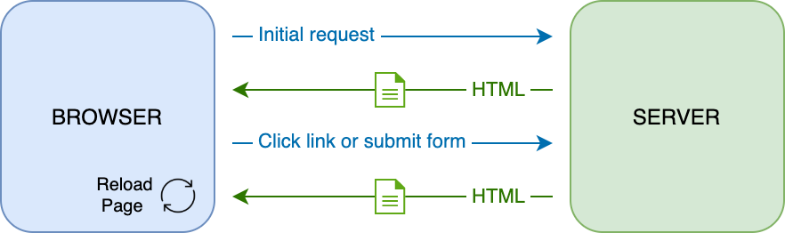
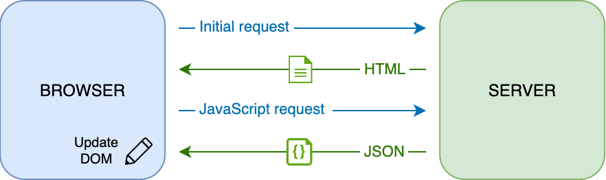
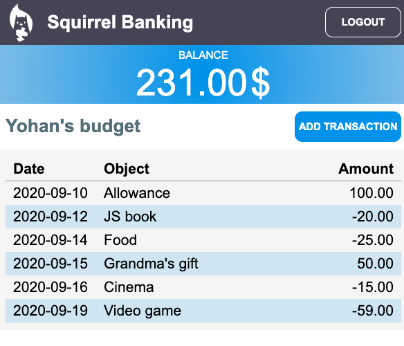

# Creazione di un'App Bancaria Parte 3: Metodi di Recupero e Utilizzo Dati

## Quiz Pre-Lezione

[Quiz Pre-Lezione](https://ashy-river-0debb7803.1.azurestaticapps.net/quiz/45?loc=it)

### Introduzione

Al centro di ogni applicazione web ci sono i *dati*. I dati possono assumere molte forme, ma il loro scopo principale è sempre quello di mostrare le informazioni all'utente. Con le app web che diventano sempre più interattive e complesse, il modo in cui l'utente accede e interagisce con le informazioni è ora una parte fondamentale dello sviluppo web.

In questa lezione si vedrà come recuperare i dati da un server in modo asincrono e utilizzare questi dati per visualizzare le informazioni su una pagina web senza ricaricare l'HTML.

### Prerequisito

Per questa lezinoe è necessario aver creato la parte [Form di Accesso e Registrazione](../../2-forms/translations/README.it.md) dell'app web. È inoltre necessario installare [Node.js](https://nodejs.org) ed eseguire [l'API del server](../../api/translations/README.it.md)  in locale in modo da ottenere i dati dell'account.

Si può verificare che il server funzioni correttamente eseguendo questo comando in un terminale:

```sh
curl http://localhost:5000/api
# -> dovrebbe restituire  "Bank API v1.0.0" come risultato
```

---

## AJAX e recupero dati

I siti Web tradizionali aggiornano il contenuto visualizzato quando l'utente seleziona un collegamento o invia dati utilizzando un form, ricaricando l'intera pagina HTML. Ogni volta che è necessario caricare nuovi dati, il server web restituisce una nuova pagina HTML che deve essere elaborata dal browser, interrompendo l'azione corrente dell'utente e limitando le interazioni durante il ricaricamento. Questo flusso di lavoro è anche chiamato *Applicazione MultiPagina*   o *MPA* (Multi-Page Application) .



Quando le applicazioni web hanno iniziato a diventare più complesse e interattive, è emersa una nuova tecnica chiamata [AJAX (Asynchronous JavaScript and XML)](https://it.wikipedia.org/wiki/AJAX)). Questa tecnica consente alle app web di inviare e recuperare dati da un server in modo asincrono utilizzando JavaScript, senza dover ricaricare la pagina HTML, con conseguenti aggiornamenti più rapidi e interazioni utente più fluide. Quando vengono ricevuti nuovi dati dal server, la pagina HTML corrente può anche essere aggiornata con JavaScript utilizzando l'API [DOM](https://developer.mozilla.org/it/docs/Web/API/Document_Object_Model). Nel tempo, questo approccio si è evoluto in quella che ora viene chiamata [*Applicazione a Pagina Singola* o *SPA*](https://it.wikipedia.org/wiki/Single-page_application)  (Single-Page Application).



Quando è stato introdotto per la prima volta AJAX, l'unica API disponibile per recuperare i dati in modo asincrono era [`XMLHttpRequest`](https://developer.mozilla.org/docs/Web/API/XMLHttpRequest/Using_XMLHttpRequest). I browser moderni ora implementano anche l'[API Fetch](https://developer.mozilla.org/it/docs/Web/API/Fetch_API), più conveniente e potente, che utilizza le promesse ed è più adatta per manipolare i dati JSON.

> Sebbene tutti i browser moderni supportino l'`API Fetch`, se si desidera che la propria applicazione web funzioni su browser legacy o vecchi, è sempre una buona idea controllare prima la [tabella di compatibilità su caniuse.com](https://caniuse.com/fetch).

### Attività

[Nella lezione precedente](../../2-forms/translations/README.it.md) si è implementato il form di registrazione per creare un account. Ora verrà aggiunto il codice per accedere utilizzando un account esistente e recuperarne i dati. Aprire il file `app.js` e aggiungere una nuova funzione di accesso (`login`):

```js
async function login() {
  const loginForm = document.getElementById('loginForm')
  const user = loginForm.user.value;
}
```

Qui si inizia recuperando l'elemento form con `getElementById()`, quindi si ottiene il nome utente (user) dall'input con `loginForm.user.value`. È possibile accedere a ogni controllo del form tramite il suo nome (impostato nell'HTML utilizzando l'attributo `name`) come proprietà del form.

In modo simile a quanto fatto per la registrazione, verrà creata un'altra funzione per eseguire una richiesta al server, ma questa volta per recuperare i dati dell'account:

```js
async function getAccount(user) {
  try {
    const response = await fetch('//localhost:5000/api/accounts/' + encodeURIComponent(user));
    return await response.json();
  } catch (error) {
    return { error: error.message || 'Unknown error' };
  }
}
```

Si usa l'API `fetch` per richiedere i dati in modo asincrono dal server, ma questa volta non servono parametri aggiuntivi oltre all'URL da chiamare, poiché si sta solo interrogando i dati. Per impostazione predefinita, `fetch` crea una richiesta  HTTP [`GET`](https://developer.mozilla.org/docs/Web/HTTP/Methods/GET), che è ciò che serve qui.

✅ `encodeURIComponent()` è una funzione che evita i caratteri speciali per l'URL. Quali problemi si potrebbero avere se non viene chiamata questa funzione e si utilizza direttamente il valore del campo `user` nell'URL?

Aggiornare ora la funzione `login` per utilizzare `getAccount`:

```js
async function login() {
  const loginForm = document.getElementById('loginForm')
  const user = loginForm.user.value;
  const data = await getAccount(user);

  if (data.error) {
    return console.log('loginError', data.error);
  }

  account = data;
  navigate('/dashboard');
}
```

Innanzitutto, poiché `getAccount` è una funzione asincrona, occorre associarla alla parola chiave `await` per attendere il risultato dal server. Come con qualsiasi richiesta al server, occorre anche gestire i casi di errore. Per ora si aggiungerà solo un messaggio di log per visualizzare l'errore e verrà indirizzato più tardi.

Quindi si deve memorizzare i dati da qualche parte in modo da poterli utilizzare in seguito per visualizzare le informazioni nel cruscotto. Poiché la variabile `account` non esiste ancora, verrà creata come variabile globale all'inizio del file:

```js
let account = null;
```

Dopo che i dati dell'utente sono stati salvati in una variabile, si può navigare dalla pagina di accessi (*login*) al cruscotto (*dashboard*) utilizzando la funzione `navigate()` che già esiste.

Infine, si deve chiamare la funzione `login` quando viene inviato il form di accesso, modificando l'HTML:

```html
<form id="loginForm" action="javascript:login()">
```

Verificare che tutto funzioni correttamente registrando un nuovo account e provando ad accedere utilizzando lo stesso account.

Prima di passare alla parte successiva, si può anche completare la funzione di registrazione (`register`) aggiungendola in fondo alla funzione:

```js
account = result;
navigate('/dashboard');
```

✅ Si sa che per impostazione predefinita, si possono  chiamare solo le API di un server che ha *stesso dominio e porta* della pagina web che si sta visualizzando? Questo è un meccanismo di sicurezza applicato dai browser. Un momento, la nostra app web è in esecuzione su `localhost:3000` mentre l'API del server è in esecuzione su  `localhost:5000`, come mai funziona? Utilizzando una tecnica chiamata CORS [Cross-Origin Resource Sharing](https://developer.mozilla.org/it/docs/Web/HTTP/CORS), è possibile eseguire richieste HTTP con diverse origini (cross-origin) se il server aggiunge intestazioni speciali alla risposta, consentendo eccezioni per domini specifici.

> Ulteriori informazioni sulle API sono disponibili seguendo questa [lezione](https://docs.microsoft.com/learn/modules/use-apis-discover-museum-art?WT.mc_id=academic-4621-cxa)

## Aggiornare HTML per visualizzare i dati

Ora che si hanno i dati dell'utente, occorre aggiornare l'HTML esistente per visualizzarli. E'  già noto come recuperare un elemento dal DOM utilizzando ad esempio `document.getElementById()`. Dopo aver ottenuto un elemento base, ecco alcune API che si possono utilizzare per modificarlo o aggiungervi elementi figlio:

- Usando la proprietà [`textContent`](https://developer.mozilla.org/docs/Web/API/Node/textContent)  si può  cambiare il testo di un elemento. Notare che la modifica di questo valore rimuove tutti i figli dell'elemento (se presenti) e li sostituisce con il testo fornito. In quanto tale, è anche un metodo efficiente per rimuovere tutti i figli di un dato elemento assegnandogli una stringa vuota  `""` .

- Usando [`document.createElement()`](https://developer.mozilla.org/docs/Web/API/Document/createElement) insieme al metodo [`append()`](https://developer.mozilla.org/docs/Web/API/ParentNode/append) si può  creare e allegare uno o più nuovi elementi figlio.

✅ Utilizzando la proprietà [`innerHTML`](https://developer.mozilla.org/docs/Web/API/Element/innerHTML) di un elemento è anche possibile modificare il suo contenuto HTML, ma questo dovrebbe essere evitato poiché è vulnerabile agli attacchi di [cross-site scripting (XSS)](https://developer.mozilla.org/docs/Glossary/Cross-site_scripting) .

### Attività

Prima di passare alla schermata del cruscotto, c'è ancora una cosa da fare nella pagina di accesso (*login*). Attualmente, se si prova ad accedere con un nome utente che non esiste, viene mostrato un messaggio nella console ma per un utente normale non cambia nulla e non sa cosa sta succedendo.

Si aggiunge ora un elemento segnaposto nel form di accesso dove si può  visualizzare un messaggio di errore se necessario. Un buon posto sarebbe subito prima del pulsante (`<button>`) con testo Login:

```html
...
<div id="loginError"></div>
<button>Login</button>
...
```

Questo elemento `<div>` è vuoto, il che significa che non verrà visualizzato nulla sullo schermo fino a quando non verrà aggiunto del contenuto. Occorre anche assegnarli un `ID` in modo da poterlo recuperare facilmente con JavaScript.

Tornare al  file `app.js` e creare una nuova funzione di supporto `updateElement`:

```js
function updateElement(id, text) {
  const element = document.getElementById(id);
  element.textContent = text;
}
```

Questo è abbastanza semplice: dato un *ID* di un elemento e un *testo*, si aggiornerà il contenuto del testo dell'elemento DOM con l'`id` corrispondente. Si usa questo metodo al posto del precedente messaggio di errore nella funzione `login` :

```js
if (data.error) {
  return updateElement('loginError', data.error);
}
```

Ora se si prova ad accedere con un account non valido, si dovrebbe vedere qualcosa del genere:


Ora si ha un testo di errore che viene visualizzato, ma se si prova con un lettore di schermo si noterà che non viene annunciato nulla. Affinché il testo che viene aggiunto dinamicamente a una pagina venga annunciato dai lettori di schermo, sarà necessario utilizzare qualcosa chiamato [Live Region](https://developer.mozilla.org/docs/Web/Accessibility/ARIA/ARIA_Live_Regions). Qui verrà utilizzato un tipo specifico di live region chiamato alert:

```html
<div id="loginError" role="alert"></div>
```

Implementare lo stesso comportamento per gli errori della funzione `register` (non dimenticare di aggiornare l'HTML).

## Visualizzare le informazioni sulla dashboard

Utilizzando le stesse tecniche appena viste, ci si occuperà anche di visualizzare le informazioni dell'account nella pagina del cruscotto.

Ecco come appare un oggetto account ricevuto dal server:

```json
{
  "user": "test",
  "currency": "$",
  "description": "Test account",
  "balance": 75,
  "transactions": [
    { "id": "1", "date": "2020-10-01", "object": "Pocket money", "amount": 50 },
    { "id": "2", "date": "2020-10-03", "object": "Book", "amount": -10 },
    { "id": "3", "date": "2020-10-04", "object": "Sandwich", "amount": -5 }
  ],
}
```

> Nota: per semplificare, si può  utilizzare l'account `test` preesistente già popolato di dati.

### Attività

Iniziare sostituendo la sezione "Balance" (saldo) nell'HTML per aggiungere elementi segnaposto:

```html
<section>
  Balance: <span id="balance"></span><span id="currency"></span>
</section>
```

Si aggiungerà anche una nuova sezione appena sotto per visualizzare la descrizione dell'account:

```html
<h2 id="description"></h2>
```

✅ Poiché la descrizione del'account funge da titolo per il contenuto sottostante, viene contrassegnata semanticamente come intestazione (heading). Scoprire di più su come [la struttura delle intestazioni](https://www.nomensa.com/blog/2017/how-structure-headings-web-accessibility) è importante per l'accessibilità ed esaminare la pagina per determinare cos'altro potrebbe essere un'intestazione.

Successivamente, verrà creata una nuova funzione in `app.js` per riempire il segnaposto:

```js
function updateDashboard() {
  if (!account) {
    return navigate('/login');
  }

  updateElement('description', account.description);
  updateElement('balance', account.balance.toFixed(2));
  updateElement('currency', account.currency);
}
```

Innanzitutto, controllare di avere i dati dell'account necessari prima di andare oltre. Quindi si usa la funzione `updateElement()` creata in precedenza per aggiornare l'HTML.

> Per rendere la visualizzazione del saldo più bella, si usa il metodo [`toFixed(2)`](https://developer.mozilla.org/docs/Web/JavaScript/Reference/Global_Objects/Number/toFixed) per forzare la visualizzazione del valore con 2 cifre per la parte decimale.

Ora occorre chiamare la funzione `updateDashboard()` ogni volta che viene caricato il cruscotto. Se si è già terminato il [compito della lezione 1](../../1-template-route/translations/assignment.it.md) , questo dovrebbe essere immediato, altrimenti si può  utilizzare la seguente implementazione.

Aggiungere questo codice alla fine della funzione `updateRoute()`:

```js
if (typeof route.init === 'function') {
  route.init();
}
```

Aggiornare la definizione delle rotte con:

```js
const routes = {
  '/login': { templateId: 'login' },
  '/dashboard': { templateId: 'dashboard', init: updateDashboard }
};
```

Con questa modifica, ogni volta che viene visualizzata la pagina del cruscotto viene chiamata la funzione `updateDashboard()`. Dopo un accesso, si dovrebbe essere in grado di vedere il saldo del conto, la valuta e la descrizione.

## Creare righe di tabelle dinamicamente con modelli HTML

Nella [prima lezione](../../1-template-route/translations/README.it.md) sono stati utilizzati modelli HTML insieme al metodo [`appendChild()`](https://developer.mozilla.org/docs/Web/API/Node/appendChild) per implementare la navigazione nell'app. I modelli possono anche essere più piccoli e utilizzati per popolare dinamicamente parti ripetitive di una pagina.

Verrà usato un approccio simile per visualizzare l'elenco delle transazioni nella tabella HTML.

### Attività

Aggiungere un nuovo modello nell'elemento HTML `<body>`:

```html
<template id="transaction">
  <tr>
    <td></td>
    <td></td>
    <td></td>
  </tr>
</template>
```

Questo modello rappresenta una singola riga di tabella, con le 3 colonne che si vuole popolare: *data*, *oggetto* e *importo* di una transazione.

Aggiungere quindi la proprietà `id` all'elemento `<tbody>` della tabella all'interno del modello del cruscotto per semplificare la ricerca dell'elemento utilizzando JavaScript:

```html
<tbody id="transactions"></tbody>
```

L'HTML è pronto, ora si passa al codice JavaScript e si crea una nuova funzione `createTransactionRow`:

```js
function createTransactionRow(transaction) {
  const template = document.getElementById('transaction');
  const transactionRow = template.content.cloneNode(true);
  const tr = transactionRow.querySelector('tr');
  tr.children[0].textContent = transaction.date;
  tr.children[1].textContent = transaction.object;
  tr.children[2].textContent = transaction.amount.toFixed(2);
  return transactionRow;
}
```

Questa funzione fa esattamente ciò che implica il suo nome: utilizzando il modello creato in precedenza, crea una nuova riga di tabella e riempie il suo contenuto utilizzando i dati della transazione. Verrà usata nella funzione `updateDashboard()` per popolare la tabella:

```js
const transactionsRows = document.createDocumentFragment();
for (const transaction of account.transactions) {
  const transactionRow = createTransactionRow(transaction);
  transactionsRows.appendChild(transactionRow);
}
updateElement('transactions', transactionsRows);
```

Qui si utilizza il metodo [`document.createDocumentFragment()`](https://developer.mozilla.org/docs/Web/API/Document/createDocumentFragment) che crea un nuovo frammento DOM su cui si può  lavorare, prima di collegarlo finalmente alla tabella HTML.

C'è ancora un'altra cosa da fare prima che questo codice possa funzionare, poiché la funzione `updateElement()` attualmente supporta solo contenuto di testo. Occorre cambiare un poco il suo codice:

```js
function updateElement(id, textOrNode) {
  const element = document.getElementById(id);
  element.textContent = ''; // Rimuove tutti i figli
  element.append(textOrNode);
}
```

Si usa il metodo [`append()`](https://developer.mozilla.org/docs/Web/API/ParentNode/append) in quanto consente di allegare testo o [nodi DOM](https://developer.mozilla.org/docs/Web/API/Node) a un elemento genitore, che è perfetto per tutti i casi d'uso.

Se si prova a utilizzare l'account `test` per accedere, ora si dovrebbe vedere un elenco di transazioni sul cruscotto 🎉.

---

## 🚀 Sfida

Collaborare per far sembrare la pagina del cruscotto una vera app bancaria. Se è già stato definito lo stile della propria app, provare a utilizzare le [media query](https://developer.mozilla.org/docs/Web/CSS/Media_Queries) per creare una [disposizione reattiva](https://developer.mozilla.org/docs/Web/Progressive_web_apps/Responsive/responsive_design_building_blocks) che funzioni bene sia su dispositivi desktop che mobili.

Ecco un esempio di una pagina cruscotto con applicato uno stile:



## Quiz Post-Lezione

[Quiz post-lezione](https://ashy-river-0debb7803.1.azurestaticapps.net/quiz/46?loc=it)

## Compito

[Refattorizzare e commentare il codice](assignment.it.md)
